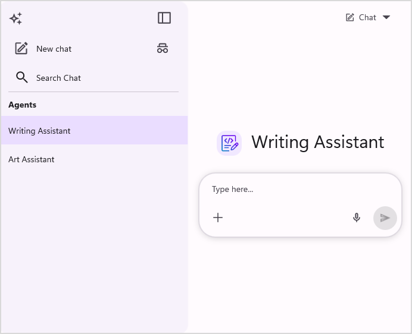
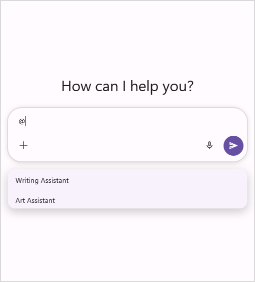
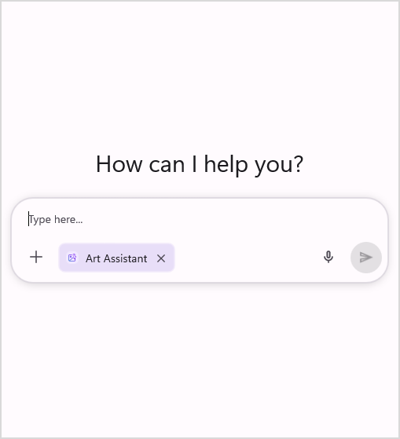

# Getting Started with Agent in .NET MAUI AI AssistView

The [SfAIAssistView](https://help.syncfusion.com/cr/maui/Syncfusion.Maui.AIAssistView.SfAIAssistView.html) control provides an `Agent` feature that enables multiple AI agents to be presented within a single chat experience. Agents are useful in AI chat applications because they represent specialized assistants for different tasks and domains, allowing users to switch between capabilities seamlessly and receive more focused, context-aware responses.

## Populating agent collection

The `SfAIAssistView` control provides the [Agents](https://help.syncfusion.com/cr/maui/Syncfusion.Maui.AIAssistView.SfAIAssistView.html#Syncfusion_Maui_AIAssistView_SfAIAssistView_Agents) property to set the agents collection. Each item in the collection is of type [AssistAgent](https://help.syncfusion.com/cr/maui/Syncfusion.Maui.AIAssistView.AssistAgent.html) and contains the following members:

* [Name](https://help.syncfusion.com/cr/maui/Syncfusion.Maui.AIAssistView.AssistAgent.html#Syncfusion_Maui_AIAssistView_AssistAgent_Name) : Displays the name of the agent.
* [Description](https://help.syncfusion.com/cr/maui/Syncfusion.Maui.AIAssistView.AssistAgent.html#Syncfusion_Maui_AIAssistView_AssistAgent_Description) : Defines the agent's functionality.
* [Instructions](https://help.syncfusion.com/cr/maui/Syncfusion.Maui.AIAssistView.AssistAgent.html#Syncfusion_Maui_AIAssistView_AssistAgent_Instructions) : Determines the agent's behavior associated with AI.
* [Icon](https://help.syncfusion.com/cr/maui/Syncfusion.Maui.AIAssistView.AssistAgent.html#Syncfusion_Maui_AIAssistView_AssistAgent_Icon) : Displays the agent's image.

### Define the View Model

Create a simple view model as shown in the following code example and save it as `ViewModel.cs`.




using System.Collections.ObjectModel;
using System.ComponentModel;
using Syncfusion.Maui.AIAssistView;

public class GettingStartedViewModel : INotifyPropertyChanged
{
    private ObservableCollection<AssistAgent> agentCollections;
    private AssistAgent agent;

    public GettingStartedViewModel()
    {
        this.agentCollections = new ObservableCollection<AssistAgent>();
        this.InitializeAgentCollection();
        
        // Default selected agent
        if (this.AgentCollection.Count > 0)
        {
            this.Agent = this.AgentCollection[0];
        }
    }

    public ObservableCollection<AssistAgent> AgentCollection
    {
        get => this.agentCollections;
        set
        {
            this.agentCollections = value;
            this.OnPropertyChanged(nameof(AgentCollection));
        }
    }

    public AssistAgent Agent
    {
        get => this.agent;
        set
        {
            this.agent = value;
            this.OnPropertyChanged(nameof(Agent));
        }
    }

    public void InitializeAgentCollection()
    {
        var agent1 = new AssistAgent
        {
            Name = "Writing Assistant",
            Description = "Helps with writing, editing, and brainstorming",
            Instructions = "You are a writing assistant that helps with content creation, editing, brainstorming ideas, and improving written communication. Provide constructive feedback and creative suggestions.",
            Icon = "richtexteditor.png"
        };

        var agent2 = new AssistAgent
        {
            Name = "Art Assistant",
            Description = "Creates images based on user descriptions and ideas",
            Instructions = "You are an image generation assistant that creates visual content from user prompts. Understand the user's description clearly and generate accurate, creative, and high-quality images. If needed, refine the prompt for better results. Keep responses simple and confirm the type of image before generating when required.",
            Icon = "imageeditor.png"
        };

        this.AgentCollection.Add(agent1);
        this.AgentCollection.Add(agent2);
    }

    public event PropertyChangedEventHandler? PropertyChanged;

    public void OnPropertyChanged(string name)
    {
        this.PropertyChanged?.Invoke(this, new PropertyChangedEventArgs(name));
    }
}




### Binding Agent Collection to AI AssistView

To populate the agent collection, first assign the view model as the `BindingContext` of the page, then bind the collection to the [Agents](https://help.syncfusion.com/cr/maui/Syncfusion.Maui.AIAssistView.SfAIAssistView.html#Syncfusion_Maui_AIAssistView_SfAIAssistView_Agents) property.




<ContentPage.BindingContext>
    <local:GettingStartedViewModel />
</ContentPage.BindingContext>

<syncfusion:SfAIAssistView x:Name="sfAIAssistView"
                           Agents="{Binding AgentCollection}" />




using Syncfusion.Maui.AIAssistView;

public partial class MainPage : ContentPage
{
    public MainPage()
    {
        InitializeComponent();
        var viewModel = new GettingStartedViewModel();
        this.BindingContext = viewModel;

        SfAIAssistView sfAIAssistView = new SfAIAssistView();
        sfAIAssistView.Agents = viewModel.AgentCollection;
        this.Content = sfAIAssistView;
    }
}




### Selecting an Agent

The `SfAIAssistView` control supports setting a current agent using the [SelectedAgent](https://help.syncfusion.com/cr/maui/Syncfusion.Maui.AIAssistView.SfAIAssistView.html#Syncfusion_Maui_AIAssistView_SfAIAssistView_SelectedAgent) property. A user can directly set the `SelectedAgent` in the `SfAIAssistView`, or select one from the editor by typing `@`, which reveals all available agents in the [Agents](https://help.syncfusion.com/cr/maui/Syncfusion.Maui.AIAssistView.SfAIAssistView.html#Syncfusion_Maui_AIAssistView_SfAIAssistView_Agents) collection.




<ContentPage.BindingContext>
    <local:GettingStartedViewModel />
</ContentPage.BindingContext>

<syncfusion:SfAIAssistView x:Name="sfAIAssistView"
                           Agents="{Binding AgentCollection}"
                           SelectedAgent="{Binding Agent}" />




using Syncfusion.Maui.AIAssistView;

public partial class MainPage : ContentPage
{
    public MainPage()
    {
        InitializeComponent();
        var viewModel = new GettingStartedViewModel();
        this.BindingContext = viewModel;

        SfAIAssistView sfAIAssistView = new SfAIAssistView();
        sfAIAssistView.Agents = viewModel.AgentCollection;
        sfAIAssistView.SelectedAgent = viewModel.Agent;
        this.Content = sfAIAssistView;
    }
}




### Show Selected Agent in View

The `SfAIAssistView` control supports showing the `SelectedAgent` in the editor view. By default, `ShowSelectedAgent` is `true` and the `SelectedAgent` is displayed. To hide the `SelectedAgent`, set the [ShowSelectedAgent](https://help.syncfusion.com/cr/maui/Syncfusion.Maui.AIAssistView.SfAIAssistView.html#Syncfusion_Maui_AIAssistView_SfAIAssistView_ShowSelectedAgent) property to `false`.




<syncfusion:SfAIAssistView x:Name="sfAIAssistView"
                           ShowSelectedAgent="False" />




using Syncfusion.Maui.AIAssistView;

public partial class MainPage : ContentPage
{
    public MainPage()
    {
        InitializeComponent();

        SfAIAssistView sfAIAssistView = new SfAIAssistView();
        sfAIAssistView.ShowSelectedAgent = false;
        this.Content = sfAIAssistView;
    }
}




### Agent view customization

The `SfAIAssistView` control allows you to fully customize the `SelectedAgent` appearance in the editor using the [SelectedAgentTemplate](https://help.syncfusion.com/cr/maui/Syncfusion.Maui.AIAssistView.SfAIAssistView.html#Syncfusion_Maui_AIAssistView_SfAIAssistView_SelectedAgentTemplate) property. This property lets you define a custom layout and style.




<ContentPage.Resources>
    <ResourceDictionary>
        <DataTemplate x:Key="agentTemplate">
            <Grid>
                ...
            </Grid>
        </DataTemplate>
    </ResourceDictionary>
</ContentPage.Resources>

<syncfusion:SfAIAssistView x:Name="sfAIAssistView"
                           SelectedAgentTemplate="{StaticResource agentTemplate}" />




using Syncfusion.Maui.AIAssistView;

public partial class MainPage : ContentPage
{
    public MainPage()
    {
        InitializeComponent();

        SfAIAssistView sfAIAssistView = new SfAIAssistView();
        sfAIAssistView.SelectedAgentTemplate = this.CreateAgentTemplate();
        this.Content = sfAIAssistView;
    }

    private DataTemplate CreateAgentTemplate()
    {
        return new DataTemplate(() =>
        {
            ...
        });
    }
}




