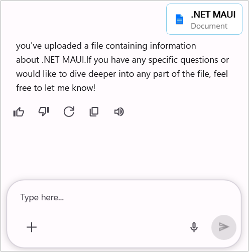
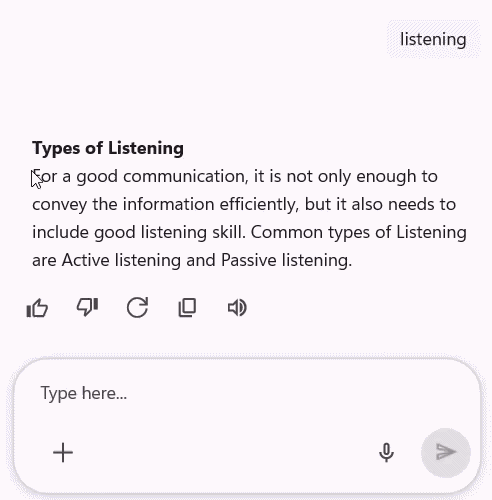

# How to Customize Appearance in .NET MAUI SfAIAssistView?

The [SfAIAssistView](https://help.syncfusion.com/cr/maui/Syncfusion.Maui.AIAssistView.html) control provides flexible options to customize the appearance of chat interfaces. You can modify layout, styling, and visual structure to match your application's design and user experience requirements.

## Customizing AI AssistView with ControlTemplate

The `ControlTemplate` in AI AssistView allows you to define and reuse the visual structure of a control. This flexible structure enables to fully customize the appearance and behavior of the AI AssistView. By using `ControlTemplate` with the AI AssistView, you can create a highly customized and interactive interface, as demonstrated below.




    <local:CustomAssistView x:Name="sfAIAssistView"
                            AssistItems="{Binding AssistMessages}">
        <local:CustomAssistView.ControlTemplate>
                <ControlTemplate>
                    <ContentView>
                        <ContentView.Content>
                            <Grid>
                                <ContentView  Content="{TemplateBinding AssistChatView}" BindingContext="{TemplateBinding BindingContext}" />
                             </Grid>
                        </ContentView.Content>
                    </ContentView>
                </ControlTemplate>
        </local:CustomAssistView.ControlTemplate>
    </local:CustomAssistView>




### Customizing Chat View in AI AssistView

The [CreateAssistChat](https://help.syncfusion.com/cr/maui/Syncfusion.Maui.AIAssistView.SfAIAssistView.html#Syncfusion_Maui_AIAssistView_SfAIAssistView_CreateAssistChat) method allows for the customization of the chat view functionality within the AI AssistView control. By overriding this method, can create their own custom implementation of the chat view, allowing for greater control over the appearance and behavior of chat interactions. It provides the flexibility to modify how chat messages are displayed, how user interactions are handled. Here’s how to override the `CreateAssistChat` method to return a custom instance of [AssistViewChat](https://help.syncfusion.com/cr/maui/Syncfusion.Maui.AIAssistView.AssistViewChat.html).




    public class CustomAIAssiststView : SfAIAssistView
    {
        public static readonly BindableProperty AssistChatViewProperty = BindableProperty.Create(nameof(AssistChatView), typeof(CustomAssistViewChat), typeof(CustomAIAssiststView));

        public CustomAssistViewChat AssistChatView
        {
            get { return (CustomAssistViewChat)this.GetValue(AssistChatViewProperty); }
            set { this.SetValue(AssistChatViewProperty, value); }
        }

        protected override AssistViewChat CreateAssistChat()
        {
            // Returning custom implementation of AssistViewChat
            AssistChatView = new CustomAssistViewChat(this);
            return AssistChatView;
        }
    }




The `CustomAssistViewChat`class inherits from `AssistViewChat` and can be used to further customize the chat view, here  the input view is removed by setting `ShowMessageInputView` to `false` as shown below.




    public class CustomAssistViewChat : AssistViewChat
    {
        public CustomAssistViewChat(SfAIAssistView assistView) : base(assistView)
        {
            //Customize the AssistViewChat
            this.ShowMessageInputView = false;   
        }
    }




N> [View sample in GitHub](https://github.com/SyncfusionExamples/custom-control-template-in-.net-maui-aiassistview)

## Display empty view when AI AssistView has no items

When no request or response messages are available in the AssistItems collection, you can use the  [EmptyView](https://help.syncfusion.com/cr/maui/Syncfusion.Maui.AIAssistView.SfAIAssistView.html#Syncfusion_Maui_AIAssistView_SfAIAssistView_EmptyView) property to display placeholder content in the AI AssistView. The `EmptyView` can be set to either a string or a custom data object and is shown until one or more items are added to the AssistItems collection.




    <local:CustomAssistView x:Name="sfAIAssistView"
                               EmptyView="Ask AI Anything"/>




    CustomAssistView sfAIAssistView = new CustomAssistView();
    sfAIAssistView.EmptyView = "Ask AI Anything";




## Empty view customization

The `SfAIAssistView` control allows you to fully customize the empty view appearance by using the [EmptyViewTemplate](https://help.syncfusion.com/cr/maui/Syncfusion.Maui.AIAssistView.SfAIAssistView.html#Syncfusion_Maui_AIAssistView_SfAIAssistView_EmptyViewTemplate) property. This property lets you define a custom layout and style for the `EmptyView`.




    <local:CustomAssistView x:Name="sfAIAssistView" 
                               AssistItems="{Binding AssistItems}"
                               EmptyView="No Items">
        <local:CustomAssistView.EmptyViewTemplate>
            <DataTemplate>
                <Grid RowDefinitions="45,30" 
                      RowSpacing="10"
                      HorizontalOptions="Center"
                      VerticalOptions="Center">
                    <Border Background="#6C4EC2" 
                            Stroke="#CAC4D0"  
                            HorizontalOptions="Center" >
                        <Border.StrokeShape>
                             <RoundRectangle CornerRadius="12"/>
                        </Border.StrokeShape>
                            <Label Text="&#xe7e1;"
                                   FontSize="24"
                                   HorizontalTextAlignment="Center" VerticalTextAlignment="Center" FontFamily="MauiSampleFontIcon" 
                                   TextColor="White"
                                   HeightRequest="45" WidthRequest="45" HorizontalOptions="Center" />
                        </Border>
                        <Label Text="Hi, How can I help you!" 
                               HorizontalOptions="Center" Grid.Row="1" FontFamily="Roboto-Regular" 
                               FontSize="20"/>
                 </Grid>
            </DataTemplate>
         </local:CustomAssistView.EmptyViewTemplate>
    </local:CustomAssistView>




    CustomAssistView sfAIAssistView = new CustomAssistView
    {
        EmptyView = "No Items"
    };
    GettingStartedViewModel viewModel = new GettingStartedViewModel();
    sfAIAssistView.AssistItems = viewModel.AssistItems;
    sfAIAssistView.EmptyViewTemplate = CreateEmptyViewTemplate();

    private DataTemplate CreateEmptyViewTemplate()
    {
        return new DataTemplate(() =>
        {
            var grid = new Grid
            {
                RowDefinitions =
                {
                    new RowDefinition { Height = new GridLength(45) },
                    new RowDefinition { Height = new GridLength(30) }
                },
                RowSpacing = 10,
                HorizontalOptions = LayoutOptions.Center,
                VerticalOptions = LayoutOptions.Center
            };

            var border = new Border
            {
                Background = Color.FromArgb("#6C4EC2"),
                Stroke = Color.FromArgb("#CAC4D0"),
                HorizontalOptions = LayoutOptions.Center,
                StrokeShape = new RoundRectangle { CornerRadius = 12 }
            };

            var iconLabel = new Label
            {
                Text = "\ue7e1", 
                FontSize = 24,
                FontFamily = "MauiSampleFontIcon",  
                TextColor = Colors.White,
                WidthRequest = 45,
                HeightRequest = 45,
                HorizontalTextAlignment = TextAlignment.Center,
                VerticalTextAlignment = TextAlignment.Center,
                HorizontalOptions = LayoutOptions.Center
            };

            border.Content = iconLabel;

            var messageLabel = new Label
            {
                Text = "Hi, How can I help you!",
                FontSize = 20,
                FontFamily = "Roboto-Regular", 
                HorizontalOptions = LayoutOptions.Center
            };

            Grid.SetRow(messageLabel, 1);
            grid.Children.Add(border);
            grid.Children.Add(messageLabel);

            return grid;
        });
    }
    



N>
* `EmptyView` and `EmptyViewTemplate` are displayed only when using `CustomAssistView`.
* By default, `SfAIAssistView` shows its built-in temporary banner view when no messages are available.
* The `EmptyViewTemplate` will only be applied when the `EmptyView` property is explicitly defined. If `EmptyView` is not set, the template will not be displayed.
* `EmptyView` can be set to custom data model and the appearance of the `EmptyView` can be customized by using the `EmptyViewTemplate`.

N> [View Sample in GitHub](https://github.com/SyncfusionExamples/how-to-display-empty-view-when-.net-maui-aiassistview-has-no-data).

## Customizing Request and Response item templates

The `SfAIAssistView` facilitates the customization of both request and response item templates according to specific requirements. This feature enhances flexibility and provides a higher degree of control over the display of items.

By utilizing the template selector, distinct templates can be assigned to all [AssistItem](https://help.syncfusion.com/cr/maui/Syncfusion.Maui.AIAssistView.AssistItem.html) or to a particular item, allowing for the independent customization of both request and response items. This capability is particularly beneficial when custom item types require different visual representations, offering precise control over the layout and presentation within the assist view.

### Defining the request item template

A template can be used to present the data in a way that makes sense for the application by using different controls. `SfAIAssistView` allows customizing the appearance of the Request view by setting the [RequestItemTemplate](https://help.syncfusion.com/cr/maui/Syncfusion.Maui.AIAssistView.SfAIAssistView.html#Syncfusion_Maui_AIAssistView_SfAIAssistView_RequestItemTemplate) property.

#### Defining a custom AssistItem model




    public class FileAssistItem : AssistItem, INotifyPropertyChanged 
    {
        private string fileName;
        private string fileType;

        public string FileName
        { 
            get
            {
                return fileName;
            }
            set
            {
                fileName = value;
                OnPropertyChanged("FileName");
            }
        }
        
        public string FileType
        {
            get
            {
                return fileType;
            }
            set
            {
                fileType = value;
                OnPropertyChanged("FileType");
            }
        }

        public event PropertyChangedEventHandler PropertyChanged;

        public void OnPropertyChanged(string name)
        {
            if (this.PropertyChanged != null)
            {
               this.PropertyChanged(this, new PropertyChangedEventArgs(name));
            }
        }
    }




#### Defining the view model




    public class GettingStartedViewModel : INotifyPropertyChanged
    {
        private ObservableCollection<IAssistItem> assistItems;

        public GettingStartedViewModel()
        {
            this.assistItems = new ObservableCollection<IAssistItem>();
            this.GenerateAssistItems();
        }

        /// 

        /// Gets or sets the collection of AssistItem of a conversation.
        /// 

        public ObservableCollection<IAssistItem> AssistItems
        {
           get
           {
              return this.assistItems;
           }

           set
           {
              this.assistItems = value;
           }
        }

        private async void GenerateAssistItems()
        {

           FileAssistItem FileItem = new FileAssistItem()
           {
              FileName = ".NET MAUI",
              FileType = "Document",
              IsRequested = true
           };

           this.AssistItems.Add(FileItem);

           await Task.Delay(1000).ConfigureAwait(true);

           AssistItem responseItem2 = new AssistItem()
           {
               Text = "you've uploaded a file containing information about .NET MAUI.If you have any specific questions or would like to dive deeper into any part of the file, feel free to let me know!",
               IsRequested = false
           };

           this.AssistItems.Add(responseItem2);
        }
    }




#### Implementing a custom request template selector

Create a custom class that inherits from [RequestItemTemplateSelector](https://help.syncfusion.com/cr/maui/Syncfusion.Maui.AIAssistView.RequestItemTemplateSelector.html), and override the [OnSelectTemplate](https://help.syncfusion.com/cr/maui/Syncfusion.Maui.AIAssistView.RequestItemTemplateSelector.html#Syncfusion_Maui_AIAssistView_RequestItemTemplateSelector_OnSelectTemplate_System_Object_Microsoft_Maui_Controls_BindableObject_) method to return the `DataTemplate` for that item. At runtime, the `SfAIAssistView` invokes the `OnSelectTemplate` method for each item and passes the data object as parameter.




    public class CustomRequestTemplateSelector : RequestItemTemplateSelector
    {
        private readonly DataTemplate? requestcustomtemplate;

        public CustomRequestTemplateSelector()
        {
           this.requestcustomtemplate = new DataTemplate(typeof(FileTemplate));
        }

        protected override DataTemplate? OnSelectTemplate(object item, BindableObject container)
        {
            var assistitem = item as IAssistItem;

            if (assistitem == null)
            {
               return null;
            }

            // Returns the custom data template for the file item.
            if (item.GetType() == typeof(FileAssistItem))
            {
               return requestcustomtemplate;
            }

            // Returns the inbuilt data templates for the other request AssistItems.
            else
            {
                return base.OnSelectTemplate(item, container);
            }
        }
    }




#### Applying the request template selector




    <ContentPage.Resources>
        <local:CustomRequestTemplateSelector x:Key="requestSelector"/>
    </ContentPage.Resources>

    <syncfusion:SfAIAssistView x:Name="sfAIAssistView"
                               RequestItemTemplate="{StaticResource requestSelector}"/>




    SfAIAssistView sfAIAssistView = new SfAIAssistView();
    sfAIAssistView.RequestItemTemplate = new CustomRequestTemplateSelector();




### Defining the response item template

A template can be used to present the data in a way that makes sense for the application by using different controls. `SfAIAssistView` allows customizing the appearance of the Response view by setting the [ResponseItemTemplate](https://help.syncfusion.com/cr/maui/Syncfusion.Maui.AIAssistView.SfAIAssistView.html#Syncfusion_Maui_AIAssistView_SfAIAssistView_ResponseItemTemplate) property.

#### Defining the View Model




    public class GettingStartedViewModel : INotifyPropertyChanged
    {

        /// 

        /// Collection of assistItem in a conversation.
        /// 

        private ObservableCollection<IAssistItem> assistItems;

        public GettingStartedViewModel()
        {
            this.assistItems = new ObservableCollection<IAssistItem>();
            this.GenerateAssistItems();
        }

        /// 

        /// Gets or sets the collection of AssistItem of a conversation.
        /// 

        public ObservableCollection<IAssistItem> AssistItems
        {
            get
            {
                return this.assistItems;
            }

            set
            {
                this.assistItems = value;
            }
        }

        private async void GenerateAssistItems()
        {
            AssistItem requestItem = new AssistItem()
            {
                Text = "Hi, I think I caught a cold.",
                IsRequested = true
            };

            // Add the request item to the collection
            this.AssistItems.Add(requestItem);

            await Task.Delay(1000).ConfigureAwait(true);

            AssistItem responseItem = new AssistItem()
            {
                Text = "Do you want me to schedule a consultation with a doctor?",
                IsRequested = false,
            };

            // Add the response item to the collection
            this.AssistItems.Add(responseItem);

            // Adding a request item
            AssistItem requestItem1 = new AssistItem()
            {
                Text = "Yes, Consultation with Dr.Harry tomorrow",
                IsRequested = true
            };

            // Add the request item to the collection
            this.AssistItems.Add(requestItem1);

            await Task.Delay(1000).ConfigureAwait(true);

            DatePickerItem datepickerItem = new DatePickerItem()
            {
                Text = "Choose a date for Consultation",
                IsRequested = false,
                SelectedDate = DateTime.Today,
            };

            // Add the response item to the collection
            this.AssistItems.Add(datepickerItem);
            // Generating response item
        }
    }




#### Implementing a custom response template selector

Create a custom class that inherits from [ResponseItemTemplateSelector](https://help.syncfusion.com/cr/maui/Syncfusion.Maui.AIAssistView.ResponseItemTemplateSelector.html), and override the [OnSelectTemplate](https://help.syncfusion.com/cr/maui/Syncfusion.Maui.AIAssistView.ResponseItemTemplateSelector.html#Syncfusion_Maui_AIAssistView_ResponseItemTemplateSelector_OnSelectTemplate_System_Object_Microsoft_Maui_Controls_BindableObject_) method to return the `DataTemplate` for that item. At runtime, the `SfAIAssistView` invokes the `OnSelectTemplate` method for each item and passes the data object as parameter.




    public class CustomResponseTemplateSelector : ResponseItemTemplateSelector
    {
        private readonly DataTemplate? reponsecustomtemplate;

        public CustomResponseTemplateSelector()
        {
           this.reponsecustomtemplate = new DataTemplate(typeof(TimePickerTemplate));
        }

        protected override DataTemplate? OnSelectTemplate(object item, BindableObject container)
        {
            var assistitem = item as IAssistItem;

            if (assistitem == null)
            {
                return null;
            }

            // Returns the custom data template for the DatePickerItem item.
            if (item.GetType() == typeof(DatePickerItem))
            {
                return reponsecustomtemplate;
            }

            // Returns the inbuilt data templates for the other request AssistItems.
        else
        {
            return base.OnSelectTemplate(item, container);
        }
    }
}




#### Applying the response template selector




    <ContentPage.Resources>
        <local:CustomResponseTemplateSelector x:Key="responseSelector"/>
    </ContentPage.Resources>

    <syncfusion:SfAIAssistView x:Name="sfAIAssistView"
                                   AssistItems="{Binding AssistItems}"
                                   ResponseItemTemplate="{StaticResource responseSelector}"/>
  



    SfAIAssistView sfAIAssistView = new SfAIAssistView();
    sfAIAssistView.ResponseItemTemplate = new CustomResponseTemplateSelector();




## Customizing request and response views in SfAIAssistView

The `SfAIAssistView` allows you to customize specific parts of request and response items without changing the entire UI. You can apply styles, templates, or subclass these views to create custom visuals and behavior.

The following views can be customized individually:

### Request Views

<table>
<tr>
<th> View </th>
<th> Description </th>
</tr>
<tr>
<td> {{ '[RequestTextView](https://help.syncfusion.com/cr/maui/Syncfusion.Maui.AIAssistView.RequestTextView.html)'| markdownify }} </td>
<td> Represents the user request text content. </td>
</tr>
<tr>
<td> {{ '[RequestAssistImageView](https://help.syncfusion.com/cr/maui/Syncfusion.Maui.AIAssistView.RequestAssistImageView.html)'| markdownify }} </td>
<td> Represents the user request image content. </td>
</tr>
<tr>
<td> {{ '[RequestHyperlinkUrlLabelView](https://help.syncfusion.com/cr/maui/Syncfusion.Maui.AIAssistView.RequestHyperlinkUrlLabelView.html)'| markdownify }} </td>
<td> Represents the user request URL label area. </td>
</tr>
<tr>
<td> {{ '[RequestHyperLinkDetailsViewFrameView](https://help.syncfusion.com/cr/maui/Syncfusion.Maui.AIAssistView.RequestHyperLinkDetailsViewFrameView.html)'| markdownify }} </td>
<td> Represents the user request URL details/preview frame area. </td>
</tr>
<tr>
<td> {{ '[RequestAttachmentsView](https://help.syncfusion.com/cr/maui/Syncfusion.Maui.AIAssistView.RequestAttachmentsView.html)'| markdownify }} </td>
<td> Represents the request attachments view. </td>
</tr>
<tr>
<td> {{ '[RequestAuthorView](https://help.syncfusion.com/cr/maui/Syncfusion.Maui.AIAssistView.RequestAuthorView.html)'| markdownify }} </td>
<td> Represents the request author name view. </td>
</tr>
<tr>
<td> {{ '[RequestAvatarView](https://help.syncfusion.com/cr/maui/Syncfusion.Maui.AIAssistView.RequestAvatarView.html)'| markdownify }} </td>
<td> Represents the request avatar view </td>
</tr>
<tr>
<td> {{ '[RequestContentView](https://help.syncfusion.com/cr/maui/Syncfusion.Maui.AIAssistView.RequestContentView.html)'| markdownify }} </td>
<td> Represents the request content view. </td>
</tr>
</table>

### Response Views

<table>
<tr>
<th> View </th>
<th> Description </th>
</tr>
<tr>
<td> {{ '[ResponseTextView](https://help.syncfusion.com/cr/maui/Syncfusion.Maui.AIAssistView.ResponseTextView.html)'| markdownify }} </td>
<td> Represents the AI response text content. </td>
</tr>
<tr>
<td> {{ '[ResponseAssistImageView](https://help.syncfusion.com/cr/maui/Syncfusion.Maui.AIAssistView.ResponseAssistImageView.html)'| markdownify }} </td>
<td> Represents the AI response image content. </td>
</tr>
<tr>
<td> {{ '[ResponseHyperlinkUrlLabelView](https://help.syncfusion.com/cr/maui/Syncfusion.Maui.AIAssistView.ResponseHyperlinkUrlLabelView.html)'| markdownify }} </td>
<td> Represents the AI response URL label area. </td>
</tr>
<tr>
<td> {{ '[ResponseHyperLinkDetailsViewFrameView](https://help.syncfusion.com/cr/maui/Syncfusion.Maui.AIAssistView.ResponseHyperLinkDetailsViewFrameView.html)'| markdownify }} </td>
<td> Represents the AI response URL details/preview frame area. </td>
</tr>
<tr>
<td> {{ '[ResponseCardView](https://help.syncfusion.com/cr/maui/Syncfusion.Maui.AIAssistView.ResponseCardView.html)'| markdownify }} </td>
<td> Represents the container for card-based AI responses. </td>
</tr>
<tr>
<td> {{ '[CardItemView](https://help.syncfusion.com/cr/maui/Syncfusion.Maui.AIAssistView.CardItemView.html)'| markdownify }} </td>
<td> Represents a single card item within a response. </td>
</tr>
<tr>
<td> {{ '[CardButtonView](https://help.syncfusion.com/cr/maui/Syncfusion.Maui.AIAssistView.CardButtonView.html)'| markdownify }} </td>
<td> Represents an action button inside a card item; exposes Title and Value bindable properties. </td>
</tr>
<tr>
<td> {{ '[ResponseAuthorView](https://help.syncfusion.com/cr/maui/Syncfusion.Maui.AIAssistView.ResponseAuthorView.html)'| markdownify }} </td>
<td> Represents the response author name view. </td>
</tr>
<tr>
<td> {{ '[ResponseAvatarView](https://help.syncfusion.com/cr/maui/Syncfusion.Maui.AIAssistView.ResponseAvatarView.html)'| markdownify }} </td>
<td> Represents the response avatar view. </td>
</tr>
<tr>
<td> {{ '[ResponseContentView](https://help.syncfusion.com/cr/maui/Syncfusion.Maui.AIAssistView.ResponseContentView.html)'| markdownify }} </td>
<td> Represents the response content view. </td>
</tr>
<tr>
<td> {{ '[ResponseLoaderView](https://help.syncfusion.com/cr/maui/Syncfusion.Maui.AIAssistView.ResponseLoaderView.html)'| markdownify }} </td>
<td> Represents the response loading indicator view </td>
</tr>
<tr>
<td> {{ '[ResponseSuggestionView](https://help.syncfusion.com/cr/maui/Syncfusion.Maui.AIAssistView.ResponseSuggestionView.html)'| markdownify }} </td>
<td> Represents the response suggestion view. </td>
</tr>
<tr>
<td> {{ '[ResponseActionsView](https://help.syncfusion.com/cr/maui/Syncfusion.Maui.AIAssistView.ResponseActionsView.html)'| markdownify }} </td>
<td> Represents the response action icons view. </td>
</tr>
<tr>
<td> {{ '[ErrorMessageView](https://help.syncfusion.com/cr/maui/Syncfusion.Maui.AIAssistView.ErrorMessageView.html)'| markdownify }} </td>
<td> Represents the error message display view. </td>
</tr>
</table>

### Common Views

<table>
<tr>
<td> {{ '[RequestEditorView](https://help.syncfusion.com/cr/maui/Syncfusion.Maui.AIAssistView.RequestEditorView.html)'| markdownify }} </td>
<td> Represents the user request text editor </td>
</tr>
<tr>
<td> {{ '[ResponseSuggestionList](https://help.syncfusion.com/cr/maui/Syncfusion.Maui.AIAssistView.ResponseSuggestionList.html)'| markdownify }} </td>
<td> Represents the list of response suggestions.</td>
</tr>
<tr>
<td> {{ '[SuggestionHeaderView](https://help.syncfusion.com/cr/maui/Syncfusion.Maui.AIAssistView.SuggestionHeaderView.html)'| markdownify }} </td>
<td> Represents the header displayed above suggestions. </td>
</tr>
<td> {{ '[DisclaimerView]()'| markdownify }} </td>
<td> </td>
</tr>
</table>




    <ContentPage.Resources>
        <ResourceDictionary>
            <!-- Request text customization -->
            

            <!-- Response text customization -->
            
        </ResourceDictionary>
    </ContentPage.Resources>

    <syncfusion:SfAIAssistView x:Name="AssistView"
                               AssistItems="{Binding AssistItems}" />




    SfAIAssistView assistView;
    ViewModel viewModel = new ViewModel();

    assistView = new SfAIAssistView
    {
        AssistItems = viewModel.AssistItems;
    };
            
    var resources = new ResourceDictionary();

    // Request text customization
    var requestTextStyle = new Style(typeof(RequestTextView))
    {
        Setters =
        {
            new Setter
            {
                Property = RequestTextView.ControlTemplateProperty,
                Value = new ControlTemplate(() =>
                {
                    var grid = new Grid { Padding = 8, BackgroundColor = Colors.Beige };
                    var label = new Label
                    {
                        FontSize = 13,
                        TextColor = Colors.Black
                    };
                    label.SetBinding(Label.TextProperty, "Text");
                    grid.Children.Add(label);
                    return grid;
                })
            }
        }
    };

    // Response text customization 
    var responseTextStyle = new Style(typeof(ResponseTextView))
    {
        Setters =
        {
            new Setter
            {
                Property = ResponseTextView.ControlTemplateProperty,
                Value = new ControlTemplate(() =>
                {
                    var grid = new Grid { Padding = 10, BackgroundColor = Colors.LightSkyBlue };
                    var label = new Label
                    {
                        FontSize = 13,
                        FontAttributes = FontAttributes.Italic,
                        TextColor = Colors.White
                    };
                    label.SetBinding(Label.TextProperty, "Text");
                    grid.Children.Add(label);
                    return grid;
                })
            }
        }
    };

    resources.Add(requestTextStyle);
    resources.Add(responseTextStyle);




## Edit option for request item

The `SfAIAssistView` allows you to edit a previously sent request. This feature lets users review and refine the prompt and resubmit from the editor to get more accurate responses. Each request shows an Edit icon; when tapped, the request text is placed in the editor (InputView) to redefine.

N> **Interaction**: On desktop (Windows, macOS), hover over a request to reveal the Edit icon. On mobile (Android, iOS), tap the request to show the Edit option.

## Display Response Processing Indicator

By default, a processing indicator is displayed when a request is added to indicate that the response is being generated. To disable it, set the [ShowResponseLoader](https://help.syncfusion.com/cr/maui/Syncfusion.Maui.AIAssistView.SfAIAssistView.html#Syncfusion_Maui_AIAssistView_SfAIAssistView_ShowResponseLoader) property to `false`




    <syncfusion:SfAIAssistView x:Name="sfAIAssistView"
                               ShowResponseLoader="False"/>




    SfAIAssistView sfAIAssistView = new SfAIAssistView();
    sfAIAssistView.ShowResponseLoader = false;




## Text Selection in Request and Response messages

The `SfAIAssistView` allows for selecting specific phrases or the entire response or request text. It enables the platform specific selection functionalities.
By default, text selection is disabled. To enable it, set the [AllowTextSelection](https://help.syncfusion.com/cr/maui/Syncfusion.Maui.AIAssistView.SfAIAssistView.html#Syncfusion_Maui_AIAssistView_SfAIAssistView_AllowTextSelection) property to `true`.




    <syncfusion:SfAIAssistView x:Name="sfAIAssistView"
                               AllowTextSelection="True"/>




    SfAIAssistView sfAIAssistView = new SfAIAssistView();
    sfAIAssistView.AllowTextSelection = true;




## Request Context menu

The `SfAIAssistView` control supports customizable Request context menu for both request. Use the following properties to configure context menus and their templates:

- [RequestContextMenu](https://help.syncfusion.com/cr/maui/Syncfusion.Maui.AIAssistView.SfAIAssistView.html#Syncfusion_Maui_AIAssistView_SfAIAssistView_RequestContextMenu): `ObservableCollection<AssistContextMenuItem>` — collection of menu items shown for request items.
- [RequestContextMenuItemTemplate](https://help.syncfusion.com/cr/maui/Syncfusion.Maui.AIAssistView.SfAIAssistView.html#Syncfusion_Maui_AIAssistView_SfAIAssistView_RequestContextMenuItemTemplate): `DataTemplate` — template for individual menu items.
- [RequestContextMenuPanelTemplate](https://help.syncfusion.com/cr/maui/Syncfusion.Maui.AIAssistView.SfAIAssistView.html#Syncfusion_Maui_AIAssistView_SfAIAssistView_RequestContextMenuPanelTemplate): `DataTemplate` — template for the popup panel that contains the menu items.

Assist context menu items are represented by [AssistContextMenuItem](https://help.syncfusion.com/cr/maui/Syncfusion.Maui.AIAssistView.AssistContextMenuItem.html) (inherits from `ActionButton`) and expose the familiar `Text`, `Icon`, `Command`, and `CommandParameter` properties. When the menu is opened for a specific assist item, the control sets the [AssistItem](https://help.syncfusion.com/cr/maui/Syncfusion.Maui.AIAssistView.AssistContextMenuItem.html#Syncfusion_Maui_AIAssistView_AssistContextMenuItem_AssistItem) property on each `AssistContextMenuItem` so commands can access the target `IAssistItem`.

- When a menu item is tapped the control executes the `Command` on the `AssistContextMenuItem` (if present). If `CommandParameter` is `null`, the control passes the `AssistContextMenuItem` instance as the parameter (so you can access the `AssistItem` property).
- The context menu is shown when the More Options icon is tapped for an item. The [ContextMenuOpening](https://help.syncfusion.com/cr/maui/Syncfusion.Maui.AIAssistView.ContextMenuOpeningEventArgs.html) event is raised before the popup appears so you can modify or cancel it.




<syncfusion:SfAIAssistView x:Name="sfAIAssistView">
    <syncfusion:SfAIAssistView.RequestContextMenu>
        <syncfusion:AssistContextMenuItem Text="Retry" Command="{Binding RetryCommand}" />
    </syncfusion:SfAIAssistView.RequestContextMenu>
</syncfusion:SfAIAssistView>




    SfAIAssistView sfAIAssistView = new SfAIAssistView();
    GettingStartedViewModel viewModel = new GettingStartedViewModel();
    var requestMenu = new ObservableCollection<AssistContextMenuItem>
    {
        new AssistContextMenuItem
        {
            Text = "Copy",
            Command = viewModel.RetryCommand,
        }
    };

    sfAIAssistView.RequestContextMenu = requestMenu;




## Customizing the context menu item template

The [RequestContextMenuItemTemplate](https://help.syncfusion.com/cr/maui/Syncfusion.Maui.AIAssistView.SfAIAssistView.html#Syncfusion_Maui_AIAssistView_SfAIAssistView_RequestContextMenuItemTemplate) property allows you to customize the appearance and interaction of individual context menu items. You can define a custom layout, bind UI elements such as icons and text, and pass the associated `AssistItem` as a CommandParameter for handling item-specific actions.




 <syncfusion:SfAIAssistView.RequestContextMenuItemTemplate>
    <DataTemplate>
        <Grid Padding="8">
            <Grid.ColumnDefinitions>
                <ColumnDefinition Width="Auto" />
                <ColumnDefinition Width="*" />
            </Grid.ColumnDefinitions>
            <Image Source="{Binding Icon}" HeightRequest="20" WidthRequest="20" />
            <Label Grid.Column="1" Text="{Binding Text}" />
            <!-- Make the AssistItem available to the command as parameter -->
            <Grid.GestureRecognizers>
                <TapGestureRecognizer Command="{Binding Command}" CommandParameter="{Binding AssistItem}" />
            </Grid.GestureRecognizers>
        </Grid>
    </DataTemplate>
</syncfusion:SfAIAssistView.RequestContextMenuItemTemplate>




## Customizing the context menu panel template
The [RequestContextMenuPanelTemplate](https://help.syncfusion.com/cr/maui/Syncfusion.Maui.AIAssistView.SfAIAssistView.html#Syncfusion_Maui_AIAssistView_SfAIAssistView_RequestContextMenuPanelTemplate) property enables you to customize the overall layout and styling of the context menu popup. This allows you to control how menu items are arranged and presented, including styling, spacing, and container appearance.




<syncfusion:SfAIAssistView.RequestContextMenuPanelTemplate>
    <DataTemplate>
        ...
    </DataTemplate>
</syncfusion:SfAIAssistView.RequestContextMenuPanelTemplate>




## Response Context menu

The `SfAIAssistView` control supports customizable Response context menu for both response. Use the following properties to configure Response context menu and its template:

- [ResponseContextMenu](https://help.syncfusion.com/cr/maui/Syncfusion.Maui.AIAssistView.SfAIAssistView.html#Syncfusion_Maui_AIAssistView_SfAIAssistView_ResponseContextMenu): `IList<AssistContextMenuItem>` — collection of menu items shown for response items.
- [ResponseContextMenuItemTemplate](https://help.syncfusion.com/cr/maui/Syncfusion.Maui.AIAssistView.SfAIAssistView.html#Syncfusion_Maui_AIAssistView_SfAIAssistView_ResponseContextMenuItemTemplate): `DataTemplate` — template for individual menu items.
- [ResponseContextMenuPanelTemplate](https://help.syncfusion.com/cr/maui/Syncfusion.Maui.AIAssistView.SfAIAssistView.html#Syncfusion_Maui_AIAssistView_SfAIAssistView_ResponseContextMenuPanelTemplate): `DataTemplate` — template for the popup panel that contains the menu items.

Assist context menu items are represented by `AssistContextMenuItem` (inherits from `ActionButton`) and expose the familiar `Text`, `Icon`, `Command`, and `CommandParameter` properties. When the menu is opened for a specific assist item, the control sets the [AssistItem](https://help.syncfusion.com/cr/maui/Syncfusion.Maui.AIAssistView.AssistContextMenuItem.html#Syncfusion_Maui_AIAssistView_AssistContextMenuItem_AssistItem) property on each `AssistContextMenuItem` so commands can access the target `IAssistItem`.

- When a menu item is tapped the control executes the `Command` on the `AssistContextMenuItem` (if present). If `CommandParameter` is `null`, the control passes the `AssistContextMenuItem` instance as the parameter (so you can access the `AssistItem` property).
- The context menu is shown when the More Options icon is tapped for an item. The [ContextMenuOpening](https://help.syncfusion.com/cr/maui/Syncfusion.Maui.AIAssistView.ContextMenuOpeningEventArgs.html) event is raised before the popup appears so you can modify or cancel it.




<syncfusion:SfAIAssistView x:Name="sfAIAssistView">
    <syncfusion:SfAIAssistView.ResponseContextMenu>
        <syncfusion:AssistContextMenuItem Text="Share" Command="{Binding ShareCommand}" />
        <syncfusion:AssistContextMenuItem Text="Regenerate" Command="{Binding RegenerateCommand}" />
    </syncfusion:SfAIAssistView.ResponseContextMenu>
</syncfusion:SfAIAssistView>




    SfAIAssistView sfAIAssistView = new SfAIAssistView();
    GettingStartedViewModel viewModel = new GettingStartedViewModel()
    var responseMenu = new ObservableCollection<AssistContextMenuItem>
    {
        new AssistContextMenuItem
        {
            Text = "Share",
            Command = viewModel.ShareCommand
        },
        new AssistContextMenuItem
        {
           Text = "Regenerate",
           Command = viewModel.RegenerateCommand
        }
    };

    sfAIAssistView.ResponseContextMenu = responseMenu;




N> The customization of [ResponseContextMenuItemTemplate](https://help.syncfusion.com/cr/maui/Syncfusion.Maui.AIAssistView.SfAIAssistView.html#Syncfusion_Maui_AIAssistView_SfAIAssistView_ResponseContextMenuItemTemplate) and [ResponseContextMenuPanelTemplate](https://help.syncfusion.com/cr/maui/Syncfusion.Maui.AIAssistView.SfAIAssistView.html#Syncfusion_Maui_AIAssistView_SfAIAssistView_ResponseContextMenuPanelTemplate) follows the same approach as the `RequestContextMenu` templates. Refer to the Request Context Menu template customization section for implementation details, as described there.

## Enable time break in view

The `SfAIAssistView` control allows for organizing the `AssistItems` by their creation date and time, enabling users to identify request and responses chronologically. Set the [ShowTimeBreak](https://help.syncfusion.com/cr/maui/Syncfusion.Maui.AIAssistView.SfAIAssistView.html#Syncfusion_Maui_AIAssistView_SfAIAssistView_ShowTimeBreak) property to `true` to display the time break view.




<syncfusion:SfAIAssistView x:Name="sfAIAssistView"
                           ShowTimeBreak="True" />




    SfAIAssistView sfAIAssistView = new SfAIAssistView();
    sfAIAssistView.ShowTimeBreak = true;




### Time break customization

The `SfAIAssistView` control allows you to fully customize the time break appearance using the [TimeBreakTemplate](https://help.syncfusion.com/cr/maui/Syncfusion.Maui.AIAssistView.SfAIAssistView.html#Syncfusion_Maui_AIAssistView_SfAIAssistView_TimeBreakTemplate) property. This property lets you define a custom layout and style for the time break UI.




<ContentPage.Resources>
        <ResourceDictionary>
            <DataTemplate x:Key="timeBreakTemplate">
                ...
            </DataTemplate>
        </ResourceDictionary>
</ContentPage.Resources>

<syncfusion:SfAIAssistView x:Name="sfAIAssistView"
                           ShowTimeBreak="True"
                           TimeBreakTemplate="{StaticResource timeBreakTemplate}" />




    SfAIAssistView sfAIAssistView = new SfAIAssistView();
    sfAIAssistView.ShowTimeBreak = true;
    sfAIAssistView.TimeBreakTemplate = this.CreateTimeBreakTemplate();

    private DataTemplate CreateTimeBreakTemplate()
    {
        return new DataTemplate(() =>
        {
            ...
        });
    }




## Show Toast notification in view

The `SfAIAssistView` control supports displaying toast notifications. These notifications appear as pop-up windows providing information during user interactions with the `SfAIAssistView`.

### Toast notification types

The `SfAIAssistView` supports the following types of toast notifications:

* [Default](https://help.syncfusion.com/cr/maui/Syncfusion.Maui.AIAssistView.ToastType.html#Syncfusion_Maui_AIAssistView_ToastType_Default) : Displays the default toast notification.
* [Success](https://help.syncfusion.com/cr/maui/Syncfusion.Maui.AIAssistView.ToastType.html#Syncfusion_Maui_AIAssistView_ToastType_Success) : Indicates that an operation has been completed successfully.
* [Warning](https://help.syncfusion.com/cr/maui/Syncfusion.Maui.AIAssistView.ToastType.html#Syncfusion_Maui_AIAssistView_ToastType_Warning) : Highlights a cautionary message or a potential issue that requires user attention.
* [Error](https://help.syncfusion.com/cr/maui/Syncfusion.Maui.AIAssistView.ToastType.html#Syncfusion_Maui_AIAssistView_ToastType_Error) : Notifies the user of a failure or an issue that has occurred during execution.

### Restrict toast notification in view

By default, toast notifications appear in the view. To prevent them from showing, use the [ToastOpening](https://help.syncfusion.com/cr/maui/Syncfusion.Maui.AIAssistView.SfAIAssistView.html#Syncfusion_Maui_AIAssistView_SfAIAssistView_ToastOpening) event.




<syncfusion:SfAIAssistView x:Name="sfAIAssistView"
                           ToastOpening="assistView_ToastOpening" />




sfAIAssistView.ToastOpening += assistView_ToastOpening;

private void assistView_ToastOpening(object sender, Syncfusion.Maui.AIAssistView.ToastNotificationEventArgs e)
{
   e.Cancel = true;
}




## Display a disclaimer message

The `SfAIAssistView` control supports displaying a note or suggestion text below the editor. To display this text, assign a value to the [DisclaimerText](https://help.syncfusion.com/cr/maui/Syncfusion.Maui.AIAssistView.SfAIAssistView.html#Syncfusion_Maui_AIAssistView_SfAIAssistView_DisclaimerText) property.




<syncfusion:SfAIAssistView x:Name="sfAIAssistView"
                           DisclaimerText="AI outputs may be inaccurate or inconsistent." />




SfAIAssistView sfAIAssistView = new SfAIAssistView();
sfAIAssistView.DisclaimerText = "AI outputs may be inaccurate or inconsistent.";




## Image preview support in SfAIAssistView

The `SfAIAssistView` control provides built-in image preview support. When an image is associated with an `AssistImageItem` or an `AssistAttachmentItem`, tapping the image displays it in a preview view.
This behavior is enabled by default and does not require additional configuration.
