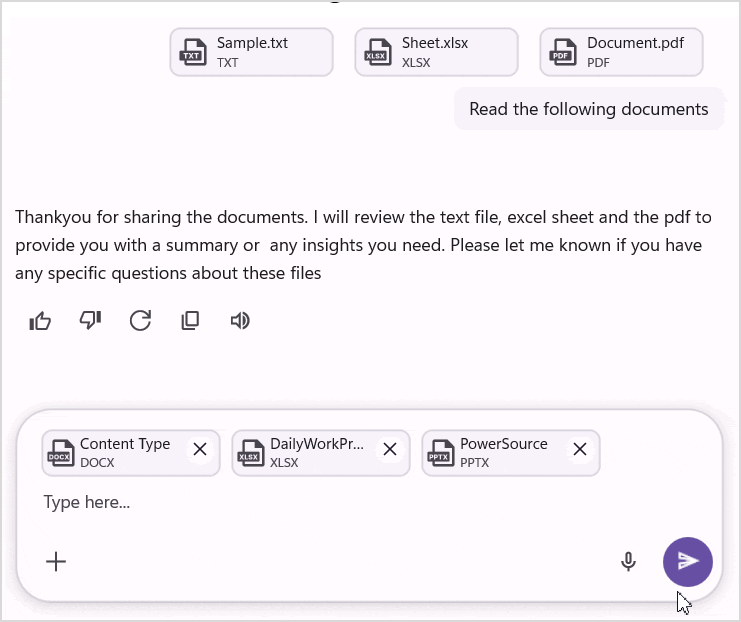

# How to Preview Attachments in .NET MAUI SfAIAssistView Editor?

Previewing attachments in the [SfAIAssistView](https://help.syncfusion.com/cr/maui/Syncfusion.Maui.AIAssistView.html) editor allows users to view files and images before sending them. This improves usability by providing a clear representation of the attached content within the chat interface.

## Working with Attachment Preview in AI AssistView

The `SfAIAssistView` allows you to add files and images as attachments in the editor using [Attachments](https://help.syncfusion.com/cr/maui/Syncfusion.Maui.AIAssistView.SfAIAssistView.html#Syncfusion_Maui_AIAssistView_SfAIAssistView_Attachments) property. This feature lets you show the preview for attachments added in the editor. `Attachments` are added as [AssistAttachment](https://help.syncfusion.com/cr/maui/Syncfusion.Maui.AIAssistView.AssistAttachment.html) which has the following members:

* [FileName](https://help.syncfusion.com/cr/maui/Syncfusion.Maui.AIAssistView.AssistAttachment.html#Syncfusion_Maui_AIAssistView_AssistAttachment_FileName) : Displays the name of the file.
* [FileSize](https://help.syncfusion.com/cr/maui/Syncfusion.Maui.AIAssistView.AssistAttachment.html#Syncfusion_Maui_AIAssistView_AssistAttachment_FileSize) : Displays the size of the file.
* [FilePath](https://help.syncfusion.com/cr/maui/Syncfusion.Maui.AIAssistView.AssistAttachment.html#Syncfusion_Maui_AIAssistView_AssistAttachment_FilePath) : Displays the local path of the file.
* [FileExtension](https://help.syncfusion.com/cr/maui/Syncfusion.Maui.AIAssistView.AssistAttachment.html#Syncfusion_Maui_AIAssistView_AssistAttachment_FileExtension) : Displays the type of the file using the extension.
* [FileContent](https://help.syncfusion.com/cr/maui/Syncfusion.Maui.AIAssistView.AssistAttachment.html#Syncfusion_Maui_AIAssistView_AssistAttachment_FileContent) : Displays the content of the file.
* [FilePreviewIcon](https://help.syncfusion.com/cr/maui/Syncfusion.Maui.AIAssistView.AssistAttachment.html#Syncfusion_Maui_AIAssistView_AssistAttachment_FilePreviewIcon) : Displays the preview icon for the file.




    <syncfusion:SfAIAssistView x:Name="sfAIAssistView"
                               Attachments="{Binding Attachments}"/>




    using Syncfusion.Maui.AIAssistView;

    internal class ViewModel : INotifyPropertyChanged
    {
        private ObservableCollection<IAttachment>? attachments;

        public ViewModel()
        {
            Attachments = new ObservableCollection<IAttachment>();
            UploadCommand = new Command(async () => await UploadFilesAsync());
        }

        public ObservableCollection<IAttachment>? Attachments
        {
            get => attachments;
            set
            {
               if (attachments != value)
               {
                  attachments = value;
               }
            }
        }

        public ICommand UploadCommand { get; }

        private async Task UploadFilesAsync()
        {
            var results = await FilePicker.Default.PickMultipleAsync();
            if (results == null) return;

            foreach (var file in results)
            {
                Stream stream = await file.OpenReadAsync();

                long size;
                if (stream.CanSeek)
                {
                    size = stream.Length;
                }
                else
                {
                    using var ms = new MemoryStream();
                    await stream.CopyToAsync(ms);
                    size = ms.Length;
                    stream.Dispose();
                    stream = new MemoryStream(ms.ToArray());
                }

                Attachments?.Add(new AssistAttachment
                {
                    FileName = file.FileName,
                    FileSize = size,
                    FilePath = file.FullPath ?? string.Empty,
                    FileExtension = Path.GetExtension(file.FileName) ?? string.Empty,
                    FileContent = stream,
                });
            }
        }
    }




### Setting the maximum number of attachments in SfAIAssistView

The `SfAIAssistView` control allows you to control the number of attachments using the [MaxAttachmentCount](https://help.syncfusion.com/cr/maui/Syncfusion.Maui.AIAssistView.SfAIAssistView.html#Syncfusion_Maui_AIAssistView_SfAIAssistView_MaxAttachmentCount) property. This feature allows us to restrict the number of attachments that can be added to the `Attachments`. The default value is 10.




    <syncfusion:SfAIAssistView x:Name = "sfAIAssistView"
                               Attachments = "{Binding Attachments}"
                               MaxAttachmentCount = 8/> 




    SfAIAssistView sfAIAssistView = new SfAIAssistView();
    sfAIAssistView.Attachment = viewModel.Attachments;
    sfAIAssistView.MaxAttachmentCount = 8;




### Attachment preview customization

The `SfAIAssistView` control allows you to customize the preview for the attachments by using the [AttachmentItemTemplate](https://help.syncfusion.com/cr/maui/Syncfusion.Maui.AIAssistView.SfAIAssistView.html#Syncfusion_Maui_AIAssistView_SfAIAssistView_AttachmentItemTemplate) property. This property lets you define a custom layout for the attachment preview UI.




    <ContentPage.Resources>
        <ResourceDictionary>
            <DataTemplate x:Key = "attachmentItemTemplate">
                <Grid Padding="8" ColumnSpacing="10">
                    <Grid.ColumnDefinitions>
                        <ColumnDefinition Width="Auto"/>
                        <ColumnDefinition Width="*"/>
                        <ColumnDefinition Width="Auto"/>
                    </Grid.ColumnDefinitions>

                    <!-- File Icon -->
                    <Image WidthRequest="32" HeightRequest="32">
                        <Image.Source>
                             <FontImageSource Glyph="&#xe76c;"
                               FontFamily="MauiMaterialAssets"
                               Color="Black" />
                        </Image.Source>
                    </Image>

                    <!-- File Details -->
                    <StackLayout Grid.Column="1" Spacing="2">
                         <!-- File Name -->
                         <Label Text="{Binding FileName}"
                                FontAttributes="Bold"
                                FontSize="14"
                                LineBreakMode="TailTruncation"/>

                        <!-- File Size -->
                        <Label Text="{Binding FileSize}"
                               FontSize="12"
                               TextColor="Gray"/>
                    </StackLayout>
                </Grid>
            </DataTemplate>
        </ResourceDictionary>
    </ContentPage.Resources>

    <syncfusion:SfAIAssistView x:Name = "sfAIAssistView"
                               Attachments = "{Binding Attachments}"
                               AttachmentItemTemplate = "{StaticResource attachmentItemTemplate}"/>




    SfAIAssistView sfAIAssistView = new SfAIAssistView();
    SfAIAssistView.Attachments = viewModel.Attachments;
    sfAIAssistView.AttachmentItemTemplate = CreateAttachmentItemTemplate();

    private DataTemplate CreateAttachmentItemTemplate()
    {
        return new DataTemplate(() =>
        {
            var grid = new Grid
            {
                Padding = new Thickness(8),
                ColumnSpacing = 10,
                ColumnDefinitions =
                {
                    new ColumnDefinition { Width = GridLength.Auto },
                    new ColumnDefinition { Width = GridLength.Star },
                    new ColumnDefinition { Width = GridLength.Auto }
                }
            };

            var image = new Image
            {
                WidthRequest = 32,
                HeightRequest = 32,
                Source = new FontImageSource
                {
                    Glyph = "\ue76c", 
                    FontFamily = "MauiMaterialAssets",
                    Color = Colors.Black
                }
            };

            var fileNameLabel = new Label
            {
                FontAttributes = FontAttributes.Bold,
                FontSize = 14,
                LineBreakMode = LineBreakMode.TailTruncation
            };

            fileNameLabel.SetBinding(Label.TextProperty, "FileName");

            var fileSizeLabel = new Label
            {
                FontSize = 12,
                TextColor = Colors.Gray
            };

            fileSizeLabel.SetBinding(Label.TextProperty, "FileSize");

            var detailsLayout = new StackLayout
            {
                Spacing = 2,
                Children =
                {
                   fileNameLabel,
                   fileSizeLabel
                }
            };

            grid.Add(image, 0, 0);
            grid.Add(detailsLayout, 1, 0);

            return grid;
        });
    }



