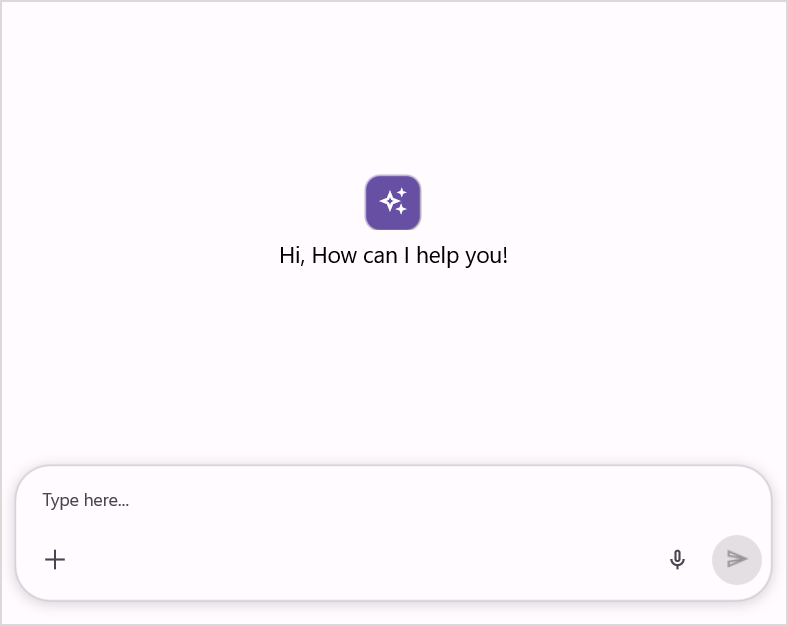

# How to Customize Empty View in .NET MAUI SfAIAssistView?

The [SfAIAssistView](https://help.syncfusion.com/cr/maui/Syncfusion.Maui.AIAssistView.html) control allows you to display and customize the empty view content when no request or response items are available, providing a better initial user experience.

## Display empty view when AI AssistView has no items

The [EmptyView](https://help.syncfusion.com/cr/maui/Syncfusion.Maui.AIAssistView.SfAIAssistView.html#Syncfusion_Maui_AIAssistView_SfAIAssistView_EmptyView) property can also be set to a string or a view, which will be displayed when no request or response is available to display in the control.




<syncfusion:SfAIAssistView x:Name="sfAIAssistView"  
                           AssistItems="{Binding AssistItems}"
                           EmptyView="Ask AI Anything">
</syncfusion:SfAIAssistView>




    SfAIAssistView sfAIAssistView = new SfAIAssistView();
    GettingStartedViewModel viewModel = new GettingStartedViewModel();
    sfAIAssistView.AssistItems = viewModel.AssistItems;
    sfAIAssistView.EmptyView = "Ask AI Anything";




## Empty view customization

The `SfAIAssistView` control allows you to fully customize the empty view appearance by using the [EmptyViewTemplate](https://help.syncfusion.com/cr/maui/Syncfusion.Maui.AIAssistView.SfAIAssistView.html#Syncfusion_Maui_AIAssistView_SfAIAssistView_EmptyViewTemplate) property. This property lets you define a custom layout and style for the `EmptyView`.




 <syncfusion:SfAIAssistView x:Name="sfAIAssistView" 
                         AssistItems="{Binding AssistItems}"
                         EmptyView="No Items">
     <syncfusion:SfAIAssistView.EmptyViewTemplate>
         <DataTemplate>
             <Grid RowDefinitions="45,30" 
                   RowSpacing="10"
                   HorizontalOptions="Center"
                   VerticalOptions="Center">
                <Border Background="#6C4EC2" 
                         Stroke="#CAC4D0"  
                         HorizontalOptions="Center" >
                    <Border.StrokeShape>
                         <RoundRectangle CornerRadius="12"/>
                    </Border.StrokeShape>
                       <Label Text="&#xe7e1;"
                              FontSize="24"
                              HorizontalTextAlignment="Center" VerticalTextAlignment="Center" FontFamily="MauiSampleFontIcon" 
                              TextColor="White"
                              HeightRequest="45" WidthRequest="45" HorizontalOptions="Center" />
                 </Border>
                 <Label Text="Hi, How can I help you!" 
                        HorizontalOptions="Center" Grid.Row="1" FontFamily="Roboto-Regular" 
                        FontSize="20"/>
             </Grid>
         </DataTemplate>
     </syncfusion:SfAIAssistView.EmptyViewTemplate>
 </syncfusion:SfAIAssistView>




   public partial class MainPage : ContentPage
   {
        SfAIAssistView sfAIAssistView;
        public MainPage()
        {
            InitializeComponent();
            sfAIAssistView = new SfAIAssistView
            {
                EmptyView = "No Items"
            };
            GettingStartedViewModel viewModel = new GettingStartedViewModel();
            sfAIAssistView.AssistItems = viewModel.AssistItems;
            sfAIAssistView.EmptyViewTemplate = CreateEmptyViewTemplate();
            Content = sfAIAssistView;
        }

        private DataTemplate CreateEmptyViewTemplate()
        {
            return new DataTemplate(() =>
            {
                var grid = new Grid
                {
                    RowDefinitions =
                    {
                        new RowDefinition { Height = new GridLength(45) },
                        new RowDefinition { Height = new GridLength(30) }
                    },
                    RowSpacing = 10,
                    HorizontalOptions = LayoutOptions.Center,
                    VerticalOptions = LayoutOptions.Center
                };

                var border = new Border
                {
                    Background = Color.FromArgb("#6C4EC2"),
                    Stroke = Color.FromArgb("#CAC4D0"),
                    HorizontalOptions = LayoutOptions.Center,
                    StrokeShape = new RoundRectangle { CornerRadius = 12 }
                };

                var iconLabel = new Label
                {
                    Text = "\ue7e1", 
                    FontSize = 24,
                    FontFamily = "MauiSampleFontIcon",  
                    TextColor = Colors.White,
                    WidthRequest = 45,
                    HeightRequest = 45,
                    HorizontalTextAlignment = TextAlignment.Center,
                    VerticalTextAlignment = TextAlignment.Center,
                    HorizontalOptions = LayoutOptions.Center
                };

                border.Content = iconLabel;

                var messageLabel = new Label
                {
                    Text = "Hi, How can I help you!",
                    FontSize = 20,
                    FontFamily = "Roboto-Regular", 
                    HorizontalOptions = LayoutOptions.Center
                };

                Grid.SetRow(messageLabel, 1);
                grid.Children.Add(border);
                grid.Children.Add(messageLabel);

                return grid;
            });
        }
    }




N>
* The `EmptyViewTemplate` will only be applied when the `EmptyView` property is explicitly defined. If `EmptyView` is not set, the template will not be displayed.
* `EmptyView` can be set to custom data model and the appearance of the `EmptyView` can be customized by using the `EmptyViewTemplate`.

N> [View Sample in GitHub](https://github.com/SyncfusionExamples/how-to-display-empty-view-when-.net-maui-aiassistview-has-no-data).
