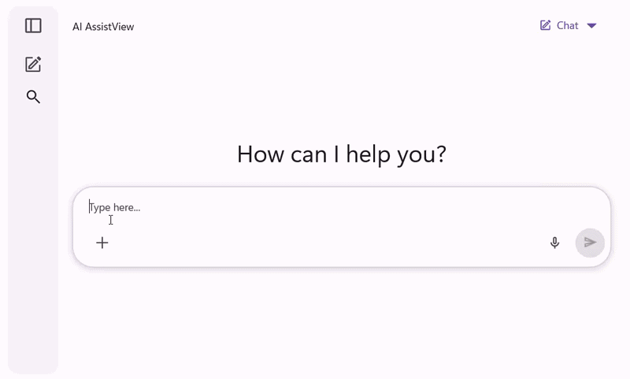
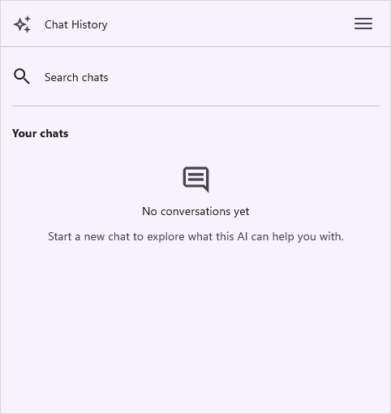
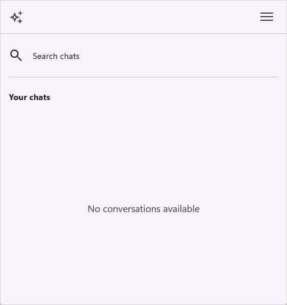

# History in .NET MAUI AI AssistView (SfAIAssistView)

This section explains how to define and customize the history in the [SfAIAssistView](https://help.syncfusion.com/cr/maui/Syncfusion.Maui.AIAssistView.html).

## Conversation history

The [SfAIAssistView](https://help.syncfusion.com/cr/maui/Syncfusion.Maui.AIAssistView.SfAIAssistView.html) control provides a `History` feature that allows you to display the conversation history from interactions with real-time AI. To disable this feature, set the [EnableConversationHistory](https://help.syncfusion.com/cr/maui/Syncfusion.Maui.AIAssistView.SfAIAssistView.html#Syncfusion_Maui_AIAssistView_SfAIAssistView_EnableConversationHistory) property to `false`.

### Binding data into conversation history

The `SfAIAssistView` control provides the [ConversationItemsSource](https://help.syncfusion.com/cr/maui/Syncfusion.Maui.AIAssistView.SfAIAssistView.html#Syncfusion_Maui_AIAssistView_SfAIAssistView_ConversationItemsSource) API to manually set the conversation history items source. This source also updates at runtime when new requests are made in the conversation. 

#### View model
Create a simple view model as shown in the following code example, and save it as `GettingStartedViewModel.cs` file.




using Syncfusion.Maui.AIAssistView;
public class GettingStartedViewModel : INotifyPropertyChanged
{
    ...
    private ObservableCollection<AssistConversationItem> conversationItems;
    ...

    public AIAssistViewModel()
    {
        ...
        this.conversationItems = new ObservableCollection<AssistConversationItem>();
        this.InitializeConversationHistory();
        ...
    }

    ...
    public ObservableCollection<AssistConversationItem> ConversationItems 
    { 
        get { return this.conversationItems; }
        set 
        {
            this.conversationItems = value;
            this.RaisePropertyChanged(nameof(ConversationItems));
        }
    }
    ...

    public void InitializeConversationHistory()
    {
        DateTime baseTime = DateTime.Now;

        string[] topics = new string[]
        {
            "listening",
            "Hey AI, can you tell me what Maui is?",
        };

        string[] responses = new string[]
        {
            "Types of Listening : For a good communication, it is not only enough to convey the information efficiently, but it also needs to include good listening skill. Common types of Listening are Active listening and Passive listening.",
            "MAUI stands for .NET Multi-platform APP UI. It's is a framework that allowws you to create cross-platform applications using a single codebase.",
        };

        for (int i = 0; i < 2; i++)
        {
            var dateTime = baseTime.AddDays(-i);
            var request = new AssistItem
            {
                Text = topics[i],
                IsRequested = true,
                DateTime = dateTime,
            };

            var response = new AssistItem
            {
                Text = responses[i],
                IsRequested = false,
                DateTime = dateTime,
                RequestItem = request,
            };

            var title = topics[i];
            var conversationItem = new AssistConversationItem
            {
                Title = title,
                DateTime = baseTime.AddDays(-i),
                AssistItems = new ObservableCollection<IAssistItem>
                {
                    request,
                    response,
                }
            };

            this.ConversationItems.Add(conversationItem);
        }
    }
    ...
}




#### Binding conversation items to SfAIAssistView
To populate the conversation items, bind the item collection from its BindingContext to `SfAIAssistView.ConversationItemsSource` property.




<?xml version="1.0" encoding="utf-8" ?>
<ContentPage xmlns="http://schemas.microsoft.com/dotnet/2021/maui"
             xmlns:x="http://schemas.microsoft.com/winfx/2009/xaml"
             xmlns:syncfusion="clr-namespace:Syncfusion.Maui.AIAssistView;assembly=Syncfusion.Maui.AIAssistView"
             xmlns:local="clr-namespace:GettingStarted.ViewModel"            
             x:Class="GettingStarted.MainPage">

    <ContentPage.BindingContext>
        <local:GettingStartedViewModal/>
    </ContentPage.BindingContext>

    <ContentPage.Content>
        <syncfusion:SfAIAssistView x:Name="sfAIAssistView"
                                   AssistItems="{Binding AssistItems}"
                                   ConversationItemsSource="{Binding ConversationItems}"/>
    </ContentPage.Content>

</ContentPage>




public partial class MainPage : ContentPage 
{
    SfAIAssistView sfAIAssistView;
    public MainPage()
    {
        InitializeComponent();
        this.sfAIAssistView = new SfAIAssistView();
        GettingStartedViewModel viewModel = new GettingStartedViewModel();
        this.sfAIAssistView.AssistItems = viewModel.AssistItems;
        this.sfAIAssistView.ConversationItemsSource = viewModel.ConversationItems;
        this.Content = sfAIAssistView;
    }
}




### Conversation header text

The `SfAIAssistView` control provides the [ConversationHeaderText](https://help.syncfusion.com/cr/maui/Syncfusion.Maui.AIAssistView.SfAIAssistView.html#Syncfusion_Maui_AIAssistView_SfAIAssistView_ConversationHeaderText) API to set the header text for the conversation view. By default, this property is set to `string.Empty`.




<syncfusion:SfAIAssistView x:Name="aiAssistView"
                     ConversationHeaderText="Chat History" />




SfAIAssistView sfAIAssistView; 
public MainPage() 
{ 
    InitializeComponent(); 
    this.sfAIAssistView = new SfAIAssistView();
    this.sfAIAssistView.ConversationHeaderText = "Chat History";
    this.Content = sfAIAssistView;
}




### Conversation empty view

The [ConversationEmptyView](https://help.syncfusion.com/cr/maui/Syncfusion.Maui.AIAssistView.SfAIAssistView.html#Syncfusion_Maui_AIAssistView_SfAIAssistView_ConversationEmptyView) property can be set to a string or a custom view, which will be displayed when no conversation items are available in the control.




<ContentPage xmlns:syncfusion="clr-namespace:Syncfusion.Maui.AIAssistView;assembly=Syncfusion.Maui.AIAssistView">

   <syncfusion:SfAIAssistView x:Name="sfAIAssistView"  
                              AssistItems="{Binding AssistItems}"
                              ConversationEmptyView="No conversations available">
    </syncfusion:SfAIAssistView>
</ContentPage>



public partial class MainPage : ContentPage
{
    SfAIAssistView sfAIAssistView;
    public MainPage()
    { 
        InitializeComponent();
        sfAIAssistView = new SfAIAssistView();
        GettingStartedViewModel viewModel = new GettingStartedViewModel();
        sfAIAssistView.AssistItems = viewModel.AssistItems;
        sfAIAssistView.ConversationEmptyView = "No conversations available";
        Content = sfAIAssistView;
   }
}




## Events and commands

When a user selects a conversation item, the [ConversationItemTapped](https://help.syncfusion.com/cr/maui/Syncfusion.Maui.AIAssistView.SfAIAssistView.html#Syncfusion_Maui_AIAssistView_SfAIAssistView_ConversationItemTapped) event and [ConversationItemTappedCommand](https://help.syncfusion.com/cr/maui/Syncfusion.Maui.AIAssistView.SfAIAssistView.html#Syncfusion_Maui_AIAssistView_SfAIAssistView_ConversationItemTappedCommand) are triggered, providing [ConversationItemTappedEventArgs](https://help.syncfusion.com/cr/maui/Syncfusion.Maui.AIAssistView.ConversationItemTappedEventArgs.html) as arguments. This arguments contains the following details about the selected suggestion item.

 * [ConversationItem](https://help.syncfusion.com/cr/maui/Syncfusion.Maui.AIAssistView.ConversationItemTappedEventArgs.html#Syncfusion_Maui_AIAssistView_ConversationItemTappedEventArgs_ConversationItem) : The conversation item selected by the user.
 * [Handled](https://help.syncfusion.com/cr/maui/Syncfusion.Maui.AIAssistView.ConversationItemTappedEventArgs.html#Syncfusion_Maui_AIAssistView_ConversationItemTappedEventArgs_Handled) : A boolean indicating whether the selected conversation item is automatically visible in view. The default value is false.

### ConversationItemTapped event




<syncfusion:SfAIAssistView x:Name="aiAssistView"
                     ConversationItemTapped="OnConversationItemTapped"/>




aiAssistView.ConversationItemTapped += OnConversationItemTapped;

private void OnConversationItemTapped(object sender, ConversationItemTappedEventArgs e)
{
    // Handle the conversation item action
}




### ConversationItemTappedCommand




<syncfusion:SfAIAssistView x:Name="aiAssistView"
                     ConversationItemTappedCommand="{Binding ConversationItemTappedCommand}"/>




public class AIAssistViewModel : INotifyPropertyChanged
{
    ...
    public ICommand ConversationItemTappedCommand { get; }
    ...

    public AIAssistViewModel()
    {
        ...
        this.ConversationItemTappedCommand = new Command<object>(OnConversationItemTapped);
        ...
    }

    ...
    private void OnConversationItemTapped(object obj)
    {
        // Handle the conversation item action
    }
    ...
}


 
