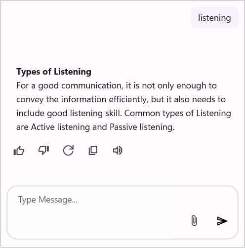
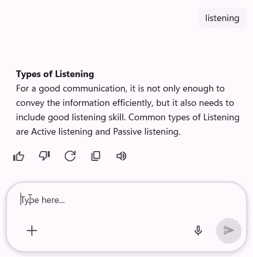
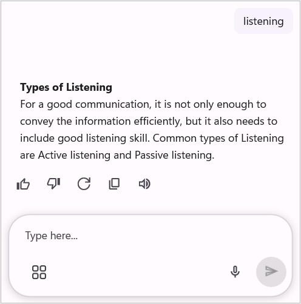
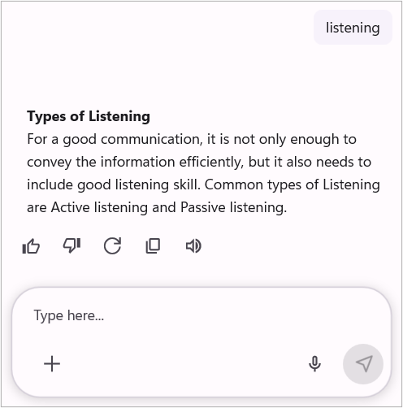
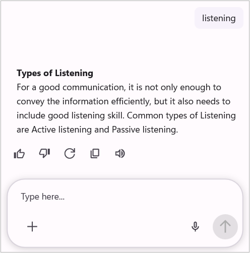

# How to Customize InputView in .NET MAUI SfAIAssistView?

Learn how to customize InputView in Syncfusion .NET MAUI [SfAIAssistView](https://help.syncfusion.com/cr/maui/Syncfusion.Maui.AIAssistView.html) to enhance message input UI and improve user interaction in chat interfaces.

## Editor
The Editor in `SfAIAssistView` is the input area where users compose and send their requests. It can be customized using templates or by modifying its properties programmatically.

### EditorView customization

The `SfAIAssistView` control allows you to fully customize the editor's appearance by using the [EditorViewTemplate](https://help.syncfusion.com/cr/maui/Syncfusion.Maui.AIAssistView.SfAIAssistView.html#Syncfusion_Maui_AIAssistView_SfAIAssistView_EditorViewTemplate) property. This property lets you define a custom layout and style for the editor.




<ContentPage.Resources>
    <ResourceDictionary>
        <DataTemplate x:Key="editorViewTemplate">
            <Grid>
                <Editor x:Name="editor" Placeholder="Type Message...">
            </Grid>
        </DataTemplate>
    </ResourceDictionary>
</ContentPage.Resources>
<ContentPage.Content>
      <syncfusion:SfAIAssistView x:Name="sfAIAssistView"
                                 EditorViewTemplate="{StaticResource editorViewTemplate}">
      </syncfusion:SfSfAIAssistView>
</ContentPage.Content>




using Syncfusion.Maui.AIAssistView;

public partial class MainPage : ContentPage
{
    SfAIAssistView sfAIAssistView;
    public MainPage()
    {
            InitializeComponent();
            sfAIAssistView = new SfAIAssistView();
            sfAIAssistView.EditorViewTemplate = CreateEditorViewTemplate();
            this.Content = sfAIAssistView;
    }

    private DataTemplate CreateEditorViewTemplate()
    {
        return new DataTemplate(() =>
        {
            var grid = new Grid { };

            var editor = new Editor
            {
                Placeholder = "Type Message...",
            };

            grid.Children.Add(editor);

            return grid;
        });
    }
}




### Customizing editor appearance using RequestEditor
The `SfAIAssistView` allows users to customize the editor’s visual surface by accessing the [RequestEditor](https://help.syncfusion.com/cr/maui/Syncfusion.Maui.AIAssistView.SfAIAssistView.html#Syncfusion_Maui_AIAssistView_SfAIAssistView_RequestEditor) only in the code behind C#.




using Syncfusion.Maui.AIAssistView;

  sfAIAssistView = new SfAIAssistView();
  sfAIAssistView.RequestEditor.PlaceholderColor = Colors.Red;




### Accessing the editor in AssistView
The `SfAIAssistView` allows you to access the editor by using [RequestEditorView](https://help.syncfusion.com/cr/maui/Syncfusion.Maui.AIAssistView.RequestEditorView.html), which helps you to customize the editor’s visual elements and overall appearance wherever it is used.

## StopResponding Button

The [SfAIAssistView](https://help.syncfusion.com/cr/maui/Syncfusion.Maui.AIAssistView.SfAIAssistView.html) control includes a built-in StopResponding button that allows users to cancel an ongoing AI response. This feature provides better control by enabling users to stop a response when it is no longer needed.
By default, the StopResponding button is visible. To hide this button, set the  [EnableStopResponding](https://help.syncfusion.com/cr/maui/Syncfusion.Maui.AIAssistView.SfAIAssistView.html#Syncfusion_Maui_AIAssistView_SfAIAssistView_EnableStopResponding) property to false.




<syncfusion:SfAIAssistView x:Name="sfAIAssistView"
                           EnableStopResponding="False"/>  

 


SfAIAssistView sfAIAssistView = new SfAIAssistView();
sfAIAssistView.EnableStopResponding = false;




### Customizing the StopResponding icon

The `SfAIAssistView` control allows you to set a custom icon for the StopResponding button using the [StopRespondingIcon]() property.




        <syncfusion:SfAIAssistView x:Name="sfAIAssistView" 
                                   AssistItems="{Binding AssistItems}">
            <syncfusion:SfAIAssistView.StopRespondingIcon>
                <FontImageSource Glyph="&#xe70b;"
                                 FontFamily="MauiMaterialAssets">
                </FontImageSource>
            </syncfusion:SfAIAssistView.StopRespondingIcon>
        </syncfusion:SfAIAssistView>

 

 

SfAIAssistView sfAIAssistView = new SfAIAssistView();
sfAIAssistView.StopRespondingIcon = new FontImageSource()
{
    FontFamily = "MauiMaterialAssets",
    Glyph = "\ue70b",
};




### StopResponding UI customization

The `SfAIAssistView` control allows you to fully customize the Stop Responding view appearance by using the [StopRespondingTemplate](https://help.syncfusion.com/cr/maui/Syncfusion.Maui.AIAssistView.SfAIAssistView.html#Syncfusion_Maui_AIAssistView_SfAIAssistView_StopRespondingTemplate) property. This property lets you define a custom layout and style for the StopResponding UI.




<ContentPage.Resources>
    <ResourceDictionary>
        <DataTemplate x:Key="stopRespondingTemplate">
            <Grid>
                ...
            </Grid>
        </DataTemplate>
    </ResourceDictionary>
</ContentPage.Resources>
<ContentPage.Content>
      <syncfusion:SfAIAssistView x:Name="sfAIAssistView"
                                 StopRespondingTemplate="{StaticResource stopRespondingTemplate}">
      </syncfusion:SfSfAIAssistView>
</ContentPage.Content>




using Syncfusion.Maui.AIAssistView;

public partial class MainPage : ContentPage
{
    SfAIAssistView sfAIAssistView;
    public MainPage()
    {
        InitializeComponent();
        sfAIAssistView = new SfAIAssistView();
        sfAIAssistView.StopRespondingTemplate = CreateStopRespondingViewTemplate();
        this.Content = sfAIAssistView;
    }

    private DataTemplate CreateStopRespondingViewTemplate()
    {
        return new DataTemplate(() =>
        {
            ...
        });
    }
}




## Action buttons in the editor

The `SfAIAssistView` can display a quick action icon inside the editor. To enable the action button, set the [ShowActionButtons](https://help.syncfusion.com/cr/maui/Syncfusion.Maui.AIAssistView.SfAIAssistView.html#Syncfusion_Maui_AIAssistView_SfAIAssistView_ShowActionButtons) property to `true`.

 
 

<syncfusion:SfAIAssistView x:Name="sfAIAssistView" 
                           ShowActionButtons="True" />



 

using Syncfusion.Maui.AIAssistView;

    SfAIAssistView sfAIAssistView = new SfAIAssistView();
    sfAIAssistView.ShowActionButtons = true;

 


### Displaying action buttons

Bind the [ActionButtons](https://help.syncfusion.com/cr/maui/Syncfusion.Maui.AIAssistView.SfAIAssistView.html#Syncfusion_Maui_AIAssistView_SfAIAssistView_ActionButtons) collection with one or more [ActionButton](https://help.syncfusion.com/cr/maui/Syncfusion.Maui.AIAssistView.ActionButton.html) items to populate the popup. The `ActionButton` provides the properties. When the `ActionButton` icon is tapped, an action popup appears with the list of configured `ActionButton`.

- [Text](https://help.syncfusion.com/cr/maui/Syncfusion.Maui.AIAssistView.ActionButton.html#Syncfusion_Maui_AIAssistView_ActionButton_Text): Displays the text for the action button.
- [Icon](https://help.syncfusion.com/cr/maui/Syncfusion.Maui.AIAssistView.ActionButton.html#Syncfusion_Maui_AIAssistView_ActionButton_Icon): Displays an icon for the action button.
- [Command](https://help.syncfusion.com/cr/maui/Syncfusion.Maui.AIAssistView.ActionButton.html#Syncfusion_Maui_AIAssistView_ActionButton_Command): Executes a command when the action button is tapped.
- [CommandParameter](https://help.syncfusion.com/cr/maui/Syncfusion.Maui.AIAssistView.ActionButton.html#Syncfusion_Maui_AIAssistView_ActionButton_CommandParameter): Passes a parameter to the command when executed.

 
 

<syncfusion:SfAIAssistView x:Name="sfAIAssistView" 
                           ShowActionButtons="True"
                           AssistItems="{Binding AssistItems}"> 
    <syncfusion:SfAIAssistView.ActionButtons> 
        <syncfusion:ActionButton BindingContext="{x:Reference viewModel}" Text="Upload images" Icon="image.png" Command="{Binding UploadCommand}" /> 
        <syncfusion:ActionButton BindingContext="{x:Reference viewModel}" Text="Search in web" Icon="web.png" Command="{Binding SearchCommand}" />
    </syncfusion:SfAIAssistView.ActionButtons> 
</syncfusion:SfAIAssistView>



 

using Syncfusion.Maui.AIAssistView;

    SfAIAssistView sfAIAssistView = new SfAIAssistView();
    ViewModel viewModel = new ViewModel();
    sfAIAssistView.ShowActionButtons = true,
    sfAIAssistView.AssistItems = this.viewModel.AssistItems,
    sfAIAssistView.ActionButtons = new ObservableCollection<ActionButton>
    {
        new ActionButton
        {
            BindingContext = this.viewModel,
            Text = "Upload images",
            Icon = ImageSource.FromFile("image.png"),
            Command = this.viewModel.UploadCommand
        },
          
        new ActionButton
        {
            BindingContext = this.viewModel,
            Text = "Search in web",
            Icon = ImageSource.FromFile("web.png"),
            Command = this.viewModel.SearchCommand
        },
     };

 


### Action button customization

The editor action button and its popup are customizable beyond the `ActionButtons` collection:

- **[ActionButtonIcon](https://help.syncfusion.com/cr/maui/Syncfusion.Maui.AIAssistView.SfAIAssistView.html#Syncfusion_Maui_AIAssistView_SfAIAssistView_ActionButtonIcon)**: Set a custom `ImageSource` for the quick action icon shown inside the editor (the icon that opens the action popup).
- **[ActionButtonPosition](https://help.syncfusion.com/cr/maui/Syncfusion.Maui.AIAssistView.SfAIAssistView.html#Syncfusion_Maui_AIAssistView_SfAIAssistView_ActionButtonPosition)**: Controls where the action icon appears in the input view. Use [ActionButtonPosition.Start](https://help.syncfusion.com/cr/maui/Syncfusion.Maui.AIAssistView.ActionButtonPosition.html#Syncfusion_Maui_AIAssistView_ActionButtonPosition_Start) or [ActionButtonPosition.End](https://help.syncfusion.com/cr/maui/Syncfusion.Maui.AIAssistView.ActionButtonPosition.html#Syncfusion_Maui_AIAssistView_ActionButtonPosition_End) to place the icon at the leading or trailing edge.

 


<syncfusion:SfAIAssistView
    ShowActionButtons="True"
    ActionButtonIcon="dotmenu.png"
    ActionButtonPosition="Start">
    <syncfusion:SfAIAssistView.ActionButtons>
        <syncfusion:ActionButton BindingContext="{x:Reference viewModel}" Text="Attach" Icon="attach.png" Command="{Binding AttachCommand}" />
        <syncfusion:ActionButton BindingContext="{x:Reference viewModel}" Text="Format" Icon="format.png" Command="{Binding FormatCommand}" />
    </syncfusion:SfAIAssistView.ActionButtons>
</syncfusion:SfAIAssistView>





    SfAIAssistView sfAIAssistView = new SfAIAssistView();
    ViewModel viewModel = new ViewModel();
    sfAIAssistView.ShowActionButtons = true,
    sfAIAssistView.ActionButtonIcon = trueImageSource.FromFile("dotmenu.png"),
    sfAIAssistView.ActionButtonPosition = ActionButtonPosition.Start; // or   ActionButtonPosition.End,
    sfAIAssistView.AssistItems = this.viewModel.AssistItems,
    sfAIAssistView.ActionButtons = new ObservableCollection<ActionButton>
    {
        new ActionButton
        {
            BindingContext = this.viewModel;
            Text = "Attach",
            Icon = ImageSource.FromFile ("attach.png"),
            Command = viewModel.AttachCommand
        },

        new ActionButton
        {
            BindingContext = this.viewModel;
            Text = "Search in web",
            Icon = ImageSource.FromFile ("format.png"),
            Command = this.viewModel.FormatCommand
        },
    };




## Request button customization

### Request button icon

The `SfAIAssistView` control allows you to customize the request button icon by setting an `ImageSource` to the [RequestButtonIcon](https://help.syncfusion.com/cr/maui/Syncfusion.Maui.AIAssistView.SfAIAssistView.html#Syncfusion_Maui_AIAssistView_SfAIAssistView_RequestButtonIcon) property.




<syncfusion:SfAIAssistView x:Name="sfAIAssistView"
                           AssistItems="{Binding AssistItems}">
        <syncfusion:SfAIAssistView.RequestButtonIcon>
            <FontImageSource Glyph="&#xe809;"
                             FontFamily="MauiSampleFontIcon"
                             Color="Black" />
        </syncfusion:SfAIAssistView.RequestButtonIcon>
</syncfusion:SfAIAssistView>




using Syncfusion.Maui.AIAssistView;

    SfAIAssistView sfAIAssistView = new SfAIAssistView();
    sfAIAssistView.RequestButtonIcon = new FontImageSource
    {
            Glyph = "\ue809;",
            FontFamily = "MauiMaterialAssets",
            Color = Colors.Green
    };




### Request button template

The `SfAIAssistView` control allows you to fully customize the request button's appearance using the [RequestButtonTemplate](https://help.syncfusion.com/cr/maui/Syncfusion.Maui.AIAssistView.SfAIAssistView.html#Syncfusion_Maui_AIAssistView_SfAIAssistView_RequestButtonTemplate) property. This property lets you define a custom layout and style for the send button.




<ContentPage.Resources>
        <ResourceDictionary>
            <!-- Define the RequestButtonTemplate as a static resource -->
            <DataTemplate x:Key="RequestButtonTemplate">
                <Grid>
                    <Label x:Name="label"
                           Text="&#xe791;"
                           FontFamily="MauiMaterialAssets"
                           FontSize="24"
                           HorizontalOptions="Center"
                           VerticalOptions="Center" />
                </Grid>
            </DataTemplate>
        </ResourceDictionary>
    </ContentPage.Resources>

<ContentPage.Content>
       <StackLayout>
        <syncfusion:SfAIAssistView x:Name="assist"
                                   AssistItems="{Binding AssistItems}"
                                   Request="assist_Request"
                                   RequestButtonTemplate="{StaticResource RequestButtonTemplate}" />
    </StackLayout>
</ContentPage.Content>




using Syncfusion.Maui.AIAssistView;

public partial class MainPage : ContentPage
{
    SfAIAssistView sfAIAssistView;
    public MainPage()
    {
            InitializeComponent();
            sfAIAssistView = new SfAIAssistView();
            sfAIAssistView.RequestButtonTemplate = RequestButtonTemplate();
            this.Content = sfAIAssistView;
    }

    private DataTemplate RequestButtonTemplate()
    {
        return new DataTemplate(() =>
        {
            var grid = new Grid();

            var label = new Label
            {
                Text = "&#xe791;", // Unicode for the icon
                FontFamily = "MauiMaterialAssets",
                FontSize = 24,
                HorizontalOptions = LayoutOptions.Center,
                VerticalOptions = LayoutOptions.Center
            };

            grid.Children.Add(label);
            return grid;
        });
    }
}




N> The [InputText](https://help.syncfusion.com/cr/maui/Syncfusion.Maui.AIAssistView.SfAIAssistView.html#Syncfusion_Maui_AIAssistView_SfAIAssistView_InputText) is used to gets or sets the text of the editor in the `SfAIAssistView`.