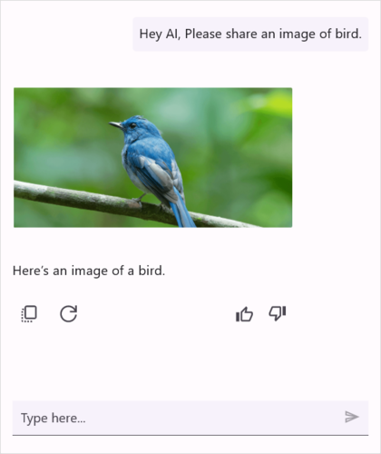

# Items in .NET MAUI AI Assist View (SfAIAssistView)

## Configuring common settings for the AssistItem

<table>
<tr>
<td>{{`Text`| markdownify }}</td>
<td>Displays the content of the assist item in the AI Assist view.</td>
</tr>
<tr>
<td>{{`Profile`| markdownify }}</td>
<td>Specify the avatar and name of the user using {{`Profile.Avatar``| markdownify }} and {{`Profile.Name`| markdownify }} properties respectively.</td>
</tr>
<tr>
<td>{{`DateTime`| markdownify }}</td>
<td>Displays the time when the item was sent or received.</td>
</tr>
<tr>
<td>{{`RequestItem`| markdownify }}</td>
<td>Gets the data associated with the request sent by user for which the response is generated.</td>
</tr>
<tr>
<td>{{`Suggestion`| markdownify }}</td>
<td>Displays list of `AssistSuggestion` as a response to a request.</td>
</tr>
<tr>
<td>{{`IsLiked`| markdownify }}</td>
<td>Indicates whether the item has been liked or disliked by the user.</td>
</tr>
<tr>
<td>{{`ShowAssistItemFooter`| markdownify }}</td>
<td>Determines whether the footer, which includes Copy, Retry, Like, Dislike to be displayed for the assist item.</td>
</tr>
</table>

## Text item

The `TextItem` is used to display plain text as a item, which is used to represent text-based content.



    
    <?xml version="1.0" encoding="utf-8" ?>
    <ContentPage xmlns="http://schemas.microsoft.com/dotnet/2021/maui"
                xmlns:x="http://schemas.microsoft.com/winfx/2009/xaml"
                xmlns:sfAIAssistView="clr-namespace:Syncfusion.Maui.AIAssistView;assembly=Syncfusion.Maui.AIAssistView"
                xmlns:local="clr-namespace:MauiAIAssistView"             
                x:Class="MauiAIAssistView.MainPage">

        <ContentPage.BindingContext>
            <local:ViewModel/>
        </ContentPage.BindingContext>

        <ContentPage.Content>
            <sfAIAssistView:SfAIAssistView x:Name="sfAIAssistView"
                                           AssistItems="{Binding AssistItems}"/>
        </ContentPage.Content>
    </ContentPage>




    using Syncfusion.Maui.AIAssistView;

    namespace MauiAIAssistView
    {
        public partial class MainPage : ContentPage
        {
            SfAiAssistView sfAIAssistView;
            ViewModel viewModel;
            public MainPage()
            {
                InitializeComponent();
                this.sfAIAssistView = new SfAIAssistView();
                this.viewModel = new ViewModel();
                this.sfAIAssistView = viewModel.AssistItems;
                this.Content = sfAIAssistView;
            }
        }
    }





    
    public class ViewModel : INotifyPropertyChanged
    {

       ...

        private void GenerateAssistItems()
        {
            this.AssistItems.Add(new AssistItem()
            {
               // Adding a user request as a text item.
               Text = "Hey AI, can you tell me what MAUI is? Could you provide a link to learn more about .NET MAUI?",
               IsRequested = true;
 
               // Add the request item to the collection
               this.AssistItems.Add(requestItem);
 
                // Generating response item
                await GetResult(requestItem);
            });
        }      
 
        private async Task GetResult(AssistItem requestItem)
        {
           await Task.Delay(1000).ConfigureAwait(true);
 
           AssistItem responseItem = new AssistItem()
           {
             // response from AI service
             Text = "Sure! MAUI stands for .NET Multi-platform App UI. It’s a framework that allows you to create cross-platform applications using a single codebase.This powerful framework is an evolution of Xamarin.Forms and is designed to streamline the development process by allowing you to write code once and deploy it across multiple platforms.",
,
           };
 
           // Add the response item to the collection
           this.AssistItems.Add(responseItem);

        }
    }
    



## Hyperlink item

The `HyperlinkItem` is used to send a URL as a item. Along with the link, the thumbnail, title, and description of the URL are automatically fetched and displayed.




    public class ViewModel : INotifyPropertyChanged
    {
        ...

        private void GenerateAssistItems()
        {
            this.AssistItems.Add(new AssistItem()
            {
               Text = "Hey AI, can you tell me what MAUI is? Could you provide a link to learn more about .NET MAUI?",
               IsRequested = true;
 
               // Add the request item to the collection
               this.AssistItems.Add(requestItem);
 
                // Generating response item
                await GetResult(requestItem);
            });
        }

        private async Task GetResult(AssistItem requestItem)
        {
           await Task.Delay(1000).ConfigureAwait(true);

            AssistItem responseItem = new AssistHyperlinkItem()
            {
                // Adding a hyperlink item as a response from the AI service.
                Text = "MAUI stands for .NET Multi-platform App UI. It's a .NET framework for building cross-platform apps with a single C# codebase for iOS, Android, macOS, and Windows. Sure! Here's a link to learn more about .NET MAUI",
                Url = "https://dotnet.microsoft.com/en-us/apps/maui",
            };

           // Add the response item to the collection
           this.AssistItems.Add(responseItem);
        }
    } 




## Image item

The `ImageItem` is used to display an image as a item. Using the `Source`, `Size`, and `Aspect` properties, you can display the desired image in the desired height and width as a item in the AI Assist View control.




    public class ViewModel : INotifyPropertyChanged
    {
        ...

        private void GenerateAssistItems()
        {
            this.AssistItems.Add(new AssistItem()
            {
                 Text = "Hey AI, Please share an image of bird.",
                 IsRequested = true;
 
                 // Add the request item to the collection
                 this.AssistItems.Add(requestItem);
 
                 // Generating response item
                 await GetResult(requestItem);
            });
        }
        
        private async Task GetResult(AssistItem requestItem)
        {
            await Task.Delay(1000).ConfigureAwait(true);
            
            // Adding a hyperlink item as a response from the AI service.
            AssistItem responseItem = newnew AssistImageItem()
            {
                  Size = new Size(0, 0),
                  Aspect = Aspect.AspectFit,
                  Text = "Here's an image of a bird.",
                  Source = "bird01.png"          
            };

            // Add the response item to the collection
           this.AssistItems.Add(responseItem);
        }

        ...
    }




## ImageTapped Event and Command

The `SfAIAssistView` control includes a built-in event called `ImageTapped` and a command named `ImageTappedCommand`. These are triggered when an image is tapped. You can access the tapped image and the point of interaction through the `ImageTappedEventArgs`.

### ImageTapped Event




    <sfAIAssistView:SfAIAssistView x:Name="sfAIAssistView"
                                   ImageTapped="sfAIAssistView_ImageTapped" />



      
    sfAIAssistView.ImageTapped += SfAIAssistView_ImageTapped;

    private void SfAIAssistView_ImageTapped(object sender, ImageTappedEventArgs e)
    {  
       DisplayAlert("Image", " Tapped on image :" + e.ImageItem.Source, "Ok");                  
    }




### ImageTapped Command


   

    <sfAIAssistView:SfAIAssistView x:Name="sfAIAssistView"  
                                   ImageTappedCommand="{Binding TappedCommand}" />




    public class ViewModel : INotifyPropertyChanged
    {
        public Command<object> tappedCommand;

        public ViewModel()
        {
            TappedCommand = new Command<object>(ImageTapped);
        }
        
        public Command<object> TappedCommand
        {
            get { return tappedCommand; }
            set { tappedCommand = value; }
        }

        private void ImageTapped(object obj)
        {
           var ImageTappedArgs = obj as ImageTappedEventArgs;
           DisplayAlert("Image", " Tapped on Image item :" + ImageTappedArgs.ImageItem.Source, "Ok");                  
        }    
      
    }




## Card item

You can show a list of interactive cards with each card containing an image, a list of buttons, and text (title, subtitle, and description) to tie in with the cards of popular bot frameworks. Use the `Card.Image`, `Card.Title`, `Card.Subtitle`, and `Card.Description` properties to display the image, title, subtitle, and description in a card respectively.
 



    public class ViewModel : INotifyPropertyChanged
    {
        ...
        public ViewModel()
        {
            this.assistItems = new ObservableCollection<object>();
            this.GenerateCards();
            this.GenerateAssistItems();
        }

        private void GenerateCards()
        {
            // Adding a hyperlink item as a response from the AI service.
            cardsCollection = new ObservableCollection<Card>();
            Card card1 = new Card()
            {
                Title = "Miami",
                Description = "Miami, officially the City of Miami, is the seat of Miami-Dade County and the cultural, economic and financial center of South Florida in the United States. The city covers an area of about 56 square miles between the Everglades to the west and Biscayne Bay to the east.",
                Image = "miami.png",
            };
            card1.Buttons.Add(new CardButton() { Title = "Choose", Value = "Miammi" });

            Card card2 = new Card()
            {
                Title = "A popular tourist destination, San Francisco is known for its cool summers, fog, steep rolling hills, eclectic mix of architecture, and landmarks, including the Golden Gate Bridge, cable cars, the former Alcatraz Federal Penitentiary, Fisherman's Wharf, and its Chinatown district.",
                Image = "sanfrancisco.png",
            };
            card2.Buttons.Add(new CardButton() { Title = "Choose", Value = "San Francisco" });

            Card card3 = new Card()
            {
                Title = "Las Vegas",
                Description = "Las Vegas is an internationally renowned major resort city, known primarily for its gambling, shopping, fine dining, entertainment, and nightlife. The Las Vegas Valley as a whole serves as the leading financial, commercial, and cultural center for Nevada.",
                Image = "lasvegas.png",
            };
            card3.Buttons.Add(new CardButton() { Title = "Choose", Value = "Las Vegas" });

            Card card4 = new Card()
            {
                Title = "Dallas",
                Description = "Dallas, a modern metropolis in north Texas, is a commercial and cultural hub of the region. The Downtown Sixth Floor Museum at Dealey Plaza commemorates the site of President John F. Kennedy's assassination in 1963. In the Arts District, the Dallas Museum of Art and the Crow Collection of Asian Art cover thousands of years of art. The sleek Nasher Sculpture Center showcases contemporary sculpture.",
                Image = "dallas.png",
            };
            card4.Buttons.Add(new CardButton() { Title = "Choose", Value = "Dallas" });

            this.CardsCollection.Add(card1);
            this.CardsCollection.Add(card2);
            this.CardsCollection.Add(card3);
            this.CardsCollection.Add(card4);
        }   
        
        private void GenerateAssistItems()
        {
            AssistItems.Add(new AssistCardItem()
            {
                Cards = CardsCollection,
            });
        }
        ...  
    }




## CardTapped Event and Command

The `SfAIAssistView` control includes a built-in event called `CardTapped` and a command named `CardTappedCommand`. These are triggered when a card is tapped. You can access the tapped card and the point of interaction through the `CardTappedEventArgs`.

### CardTapped Event




    <sfAIAssistView:SfAIAssistView x:Name="sfAIAssistView"
                                   CardTapped="sfAIAssistView_CardTapped" />



      
    sfAIAssistView.CardTapped += SfAIAssistView_CardTapped;

    private void SfAIAssistView_CardTapped(object sender, CardTappedEventArgs e)
    {  
       DisplayAlert("Card", " Tapped on card :" + e.Card.Title, "Ok");                  
    }




### CardTapped Command


   

    <sfAIAssistView:SfAIAssistView x:Name="sfAIAssistView"  
                                   CardTappedCommand="{Binding TappedCommand}" />




    public class ViewModel : INotifyPropertyChanged
    {
        public Command<object> tappedCommand;

        public ViewModel()
        {
            TappedCommand = new Command<object>(CardTapped);
        }
        
        public Command<object> TappedCommand
        {
            get { return tappedCommand; }
            set { tappedCommand = value; }
        }

        private void CardTapped(object obj)
        {
           var CardTappedArgs = obj as CardTappedEventArgs;
           DisplayAlert("Card", " Tapped on Card item :" + CardTappedArgs.Card.Title, "Ok");                  
        }    
      
    }



