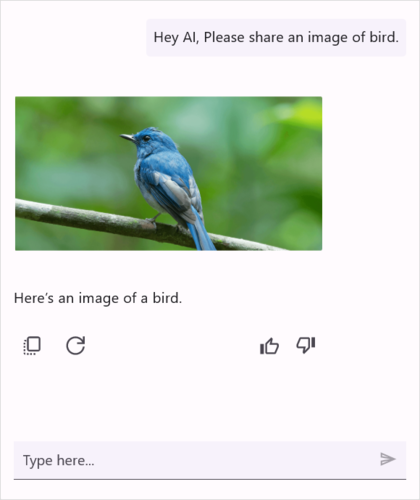

# Items in .NET MAUI AIAssistView (SfAIAssistView)

## Text item

[TextMessage]() is used to display plain text as a item. The following code example explains how to add a simple text item.



    
    <?xml version="1.0" encoding="utf-8" ?>
    <ContentPage xmlns="http://schemas.microsoft.com/dotnet/2021/maui"
                xmlns:x="http://schemas.microsoft.com/winfx/2009/xaml"
                xmlns:sfAIAssistView="clr-namespace:Syncfusion.Maui.AIAssistView;assembly=Syncfusion.Maui.AIAssistView"
                xmlns:local="clr-namespace:MauiAIAssistView"             
                x:Class="MauiAIAssistView.MainPage">

        <ContentPage.BindingContext>
            <local:ViewModel/>
        </ContentPage.BindingContext>

        <ContentPage.Content>
            <sfAIAssistView:SfAIAssistView x:Name="sfAIAssistView"
                                           AssistItems="{Binding AssistItems}"/>
        </ContentPage.Content>
    </ContentPage>




    using Syncfusion.Maui.AIAssistView;

    namespace MauiAIAssistView
    {
        public partial class MainPage : ContentPage
        {
            SfAiAssistView sfAIAssistView;
            ViewModel viewModel;
            public MainPage()
            {
                InitializeComponent();
                this.sfAIAssistView = new SfAIAssistView();
                this.viewModel = new ViewModel();
                this.sfAIAssistView = viewModel.AssistItems;
                this.Content = sfAIAssistView;
            }
        }
    }





    
        public class ViewModel : INotifyPropertyChanged
        {
            ...
            private void GenerateAssistItems()
            {
                this.AssistItems.Add(new AssistItem()
                {
                   Text = "Hey AI, can you tell me what MAUI is? Could you provide a link to learn more about .NET MAUI?",
                });
                this.Messages.Add(new AssistItem()
                {
                  Text = "MAUI stands for .NET Multi-platform App UI. It's a .NET framework for building cross-platform apps with a single C# codebase for iOS, Android, macOS, and Windows",
                });

            }
            ...
        }
    



## Hyperlink item

[HyperlinkMessage]() is used to send a URL as a item. Along with the link, the thumbnail, title, and description of the URL are automatically fetched and displayed. The code example below illustrates how to add a hyperlink item.



    
    <?xml version="1.0" encoding="utf-8" ?>
    <ContentPage xmlns="http://schemas.microsoft.com/dotnet/2021/maui"
                xmlns:x="http://schemas.microsoft.com/winfx/2009/xaml"
                xmlns:sfAIAssistView="clr-namespace:Syncfusion.Maui.AIAssistView;assembly=Syncfusion.Maui.AIAssistView"
                xmlns:local="clr-namespace:MauiAIAssistView"             
                x:Class="MauiAIAssistView.MainPage">

        <ContentPage.BindingContext>
            <local:ViewModel/>
        </ContentPage.BindingContext>

        <ContentPage.Content>
            <sfAIAssistView:SfAIAssistView x:Name="sfAIAssistView"
                                           AssistItems="{Binding AssistItems}"/>
        </ContentPage.Content>
    </ContentPage>




    using Syncfusion.Maui.AIAssistView;

    namespace MauiAIAssistView
    {
        public partial class MainPage : ContentPage
        {
            SfAIAssistView sfAIAssistView;
            ViewModel viewModel;
            public MainPage()
            {
                InitializeComponent();
                this.AIAssistView = new SfAIAssistView();
                this.viewModel = new ViewModel();
                this.sfAIAssistView.AssistItems = viewModel.AssistItems;
                this.Content = sfAIAssistView;
            }
        }
    }


 



    public class ViewModel : INotifyPropertyChanged
    {
        ...
        private void GenerateAssistItems()
        {
            this.AssistItems.Add(new AssistItem()
            {
               Text = "Hey AI, can you tell me what MAUI is? Could you provide a link to learn more about .NET MAUI?",
            });
            this.AssistItems.Add(new AssistHyperlinkItem()
            {
                Text = "MAUI stands for .NET Multi-platform App UI. It's a .NET framework for building cross-platform apps with a single C# codebase for iOS, Android, macOS, and Windows. Sure! Here's a link to learn more about .NET MAUI",
                Url = "https://dotnet.microsoft.com/en-us/apps/maui",
            });
        }
    }     



## Image item

[Image item]() is used to display an image as a item. Using the [Source](), [Size](), and [Aspect]() properties, you can display the desired image in the desired height and width as a item in the AIAssistView control.



    
    <?xml version="1.0" encoding="utf-8" ?>
    <ContentPage xmlns="http://schemas.microsoft.com/dotnet/2021/maui"
                xmlns:x="http://schemas.microsoft.com/winfx/2009/xaml"
                xmlns:sfAIAssistView="clr-namespace:Syncfusion.Maui.AIAssistView;assembly=Syncfusion.Maui.AIAssistView"
                xmlns:local="clr-namespace:MauiAIAssistView"             
                x:Class="MauiAIAssistView.MainPage">

        <ContentPage.BindingContext>
            <local:ViewModel/>
        </ContentPage.BindingContext>

        <ContentPage.Content>
            <sfAIAssistView:SfAIAssistView x:Name="sfAIAssistView"
                                           AssistItems="{Binding AssistItems}"/>                        
        </ContentPage.Content>
    </ContentPage>




    using Syncfusion.Maui.AIAssistView;

    namespace MauiAIAssistView
    {
        public partial class MainPage : ContentPage
        {
            SfAIAssistView sfAIAssistView;
            ViewModel viewModel;
            public MainPage()
            {
                InitializeComponent();
                this.sfAIAssistView = new SfAIAssistView();
                this.viewModel = new ViewModel();
                this.sfAIAssistView.AssistItems = viewModel.AssistItems;
                this.Content = sfAIAssistView;
            }
        }
    }



 



    public class ViewModel : INotifyPropertyChanged
    {
        ...
        private void GenerateAssistItems()
        {
            this.AssistItems.Add(new AssistItem()
            {
                 Text = "Hey AI, Please share an image of bird.",
            });

            this.AssistItems.Add(new AssistImageItem()
            {
                  Size = new Size(0, 0),
                  Aspect = Aspect.AspectFit,
                  Text = "Here’s an image of a bird.",
                  Source = "bird01.png"          
            });
        }
        ...
    }




## Card item

You can show a list of interactive cards with each card containing an image, a list of buttons, and text (title, subtitle, and description) to tie in with the cards of popular bot frameworks. Use the [Card.Image](), [Card.Title](), [Card.Subtitle](), and [Card.Description]() properties to display the image, title, subtitle, and description in a card respectively.



    
    <?xml version="1.0" encoding="utf-8" ?>
    <ContentPage xmlns="http://schemas.microsoft.com/dotnet/2021/maui"
                xmlns:x="http://schemas.microsoft.com/winfx/2009/xaml"
                xmlns:sfAIAssistView="clr-namespace:Syncfusion.Maui.AIAssistView;assembly=Syncfusion.Maui.AIAssistView"
                xmlns:local="clr-namespace:MauiAIAssistView"             
                x:Class="MauiAIAssistView.MainPage">

        <ContentPage.BindingContext>
            <local:ViewModel/>
        </ContentPage.BindingContext>

        <ContentPage.Content>
            <sfAIAssistView:SfAIAssistView x:Name="sfAIAssistView"
                                           AssistItems ="{Binding AssistItems}" />                         
        </ContentPage.Content>
    </ContentPage>




    using Syncfusion.Maui.AIAssistView;

    namespace MauiAIAssistView
    {
        public partial class MainPage : ContentPage
        {
            SfAIAssistView sfAIAssistView;
            ViewModel viewModel;
            public MainPage()
            {
                InitializeComponent();
                this.sfAIAssistView = new SfAIAssistView();
                this.viewModel = new ViewModel();
                this.sfAIAssistView.AssistItems = viewModel.AssistItems ;
                this.Content = sfAIAssistView;
            }
        }
    }


 



    public class ViewModel : INotifyPropertyChanged
    {
        ...
        public ViewModel()
        {
            this.assistItems = new ObservableCollection<object>();
            this.GenerateCards();
            this.GenerateAssistItems();
        }

        private void GenerateCards()
        {
            cardsCollection = new ObservableCollection<Card>();
            Card card1 = new Card()
            {
                Title = "Miami",
                Description = "Miami, officially the City of Miami, is the seat of Miami-Dade County and the cultural, economic and financial center of South Florida in the United States. The city covers an area of about 56 square miles between the Everglades to the west and Biscayne Bay to the east.",
                Image = "miami.png",
            };
            card1.Buttons.Add(new CardButton() { Title = "Choose", Value = "Miammi" });

            Card card2 = new Card()
            {
                Title = "A popular tourist destination, San Francisco is known for its cool summers, fog, steep rolling hills, eclectic mix of architecture, and landmarks, including the Golden Gate Bridge, cable cars, the former Alcatraz Federal Penitentiary, Fisherman's Wharf, and its Chinatown district.",
                Image = "sanfrancisco.png",
            };
            card2.Buttons.Add(new CardButton() { Title = "Choose", Value = "San Francisco" });

            Card card3 = new Card()
            {
                Title = "Las Vegas",
                Description = "Las Vegas is an internationally renowned major resort city, known primarily for its gambling, shopping, fine dining, entertainment, and nightlife. The Las Vegas Valley as a whole serves as the leading financial, commercial, and cultural center for Nevada.",
                Image = "lasvegas.png",
            };
            card3.Buttons.Add(new CardButton() { Title = "Choose", Value = "Las Vegas" });

            Card card4 = new Card()
            {
                Title = "Dallas",
                Description = "Dallas, a modern metropolis in north Texas, is a commercial and cultural hub of the region. The Downtown Sixth Floor Museum at Dealey Plaza commemorates the site of President John F. Kennedy's assassination in 1963. In the Arts District, the Dallas Museum of Art and the Crow Collection of Asian Art cover thousands of years of art. The sleek Nasher Sculpture Center showcases contemporary sculpture.",
                Image = "dallas.png",
            };
            card4.Buttons.Add(new CardButton() { Title = "Choose", Value = "Dallas" });

            this.CardsCollection.Add(card1);
            this.CardsCollection.Add(card2);
            this.CardsCollection.Add(card3);
            this.CardsCollection.Add(card4);
        }   
        
        private void AssistItems()
        {
            Messages.Add(new AssistCardItem()
            {
                Cards = CardsCollection,
            });
        }
        ...  
    }




N> [View sample in GitHub]()
