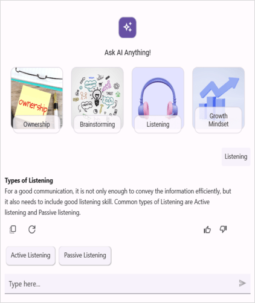

# Overview of .NET MAUI AIAssistView (SfAIAssistView)

The Syncfusion .NET MAUI AIAssistView control is used to enhance interaction between users and AI services. It offers a user-friendly interface for creating intelligent and responsive applications with AI services, allowing users to customize the appearance easily.

## Key features

* `Data binding` : Support to bind any existing data to assist item collection.
* `Item types` : Support for various item types such as text, image, hyperlink, and card items.
* `Control template` : Offers a customizable control template to display any view or control.
* `Suggestions` : Offers quick options to choose from and expedite the conversation flow.
* `Styling` : Customize the appearance of request and response items.

