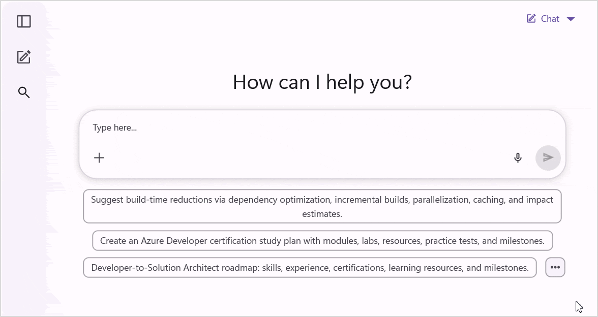

# Prompt Library in .NET MAUI AI AssistView

The `SfPromptLibrary` displays a collection of predefined prompts organized by section and topic, allowing users to quickly find and select prompts.

## Populate prompts in PromptLibrary

Set the `ItemsSource` property of `SfPromptLibrary` to a collection of PromptItem objects to display the available prompts.

Each item in the collection is a `PromptItem`. The prompt library uses the following members to group and display prompts:

* `Title` - Specifies the title of the prompt.
* `Topic` - Specifies the topic associated with the prompt.
* `Description` - Specifies a brief description of the prompt displayed in the library.
* `Section` - Specifies the section used to group related prompts.
* `PromptContent` - Specifies the prompt content used when the prompt is selected.
* `Version` - Specifies the version of the prompt.

### Define the prompt collection

Create a view model with a prompt collection and save it as `PromptLibraryViewModel.cs`.




using System.Collections.ObjectModel;
using Syncfusion.Maui.AIAssistView;

public class PromptLibraryViewModel
{
    private ObservableCollection<PromptItem> promptItemsInfo;

    public PromptLibraryViewModel()
    {
        this.promptItemsInfo = new ObservableCollection<PromptItem>();
        this.InitializePromptLibrary();
    }

    public ObservableCollection<PromptItem> PromptLibraryInfo
    {
        get => this.promptItemsInfo;
        set => this.promptItemsInfo = value;
    }

    private void InitializePromptLibrary()
    {
        this.PromptLibraryInfo.Add(new PromptItem
        {
            Title = "Podcast Script Generator",
            PromptContent = "As a Podcast Script Generator, create a 10-minute podcast script about AI productivity. Include an engaging introduction, discussion points, and a closing summary.",
            Section = "Prompt Topics",
            Topic = "Audio",
            Description = "Creates structured podcast episodes."
        });

        this.PromptLibraryInfo.Add(new PromptItem
        {
            Title = "Project Proposal Writer",
            PromptContent = "As a Project Proposal Writer, draft a project proposal for cloud migration. Define objectives, scope, expected outcomes, risks, and resource requirements.",
            Section = "Prompt Topics",
            Topic = "Document",
            Description = "Creates detailed project proposal documents."
        });
    }
}




### Bind to data source

Bind the view model collection to the `SfPromptLibrary.ItemsSource` property to display the items in the `PromptLibrary`.




<ContentPage.BindingContext>
    <local:PromptLibraryViewModel />
</ContentPage.BindingContext>

<syncfusion:SfPromptLibrary ItemsSource="{Binding PromptLibraryInfo}" />




using Syncfusion.Maui.AIAssistView;

public partial class MainPage : ContentPage
{
    public MainPage()
    {
        InitializeComponent();

        var viewModel = new PromptLibraryViewModel();
        this.BindingContext = viewModel;

        var promptLibrary = new SfPromptLibrary
        {
            ItemsSource = viewModel.PromptLibraryInfo,
        };

        this.Content = promptLibrary;
    }
}




## Event and Command

When a user selects a prompt, both the `PromptSelected` event and the `PromptSelectedCommand` are triggered. Both provide a `PromptSelectedEventArgs` instance containing information about the selected prompt.

* `Prompt` - The prompt item chosen by the user.

### Using PromptSelected event




<ContentPage.BindingContext>
    <local:PromptLibraryViewModel />
</ContentPage.BindingContext>

<syncfusion:SfPromptLibrary ItemsSource="{Binding PromptLibraryInfo}"
                            PromptSelected="OnPromptSelected" />




using Syncfusion.Maui.AIAssistView;

public partial class MainPage : ContentPage
{
    public MainPage()
    {
        InitializeComponent();
    }

    private void OnPromptSelected(object sender, PromptSelectedEventArgs e)
    {
        PromptItem selectedPrompt = e.Prompt;
        // Use the selected prompt text (selectedPrompt.PromptContent).
    }
}




### Using PromptSelectedCommand




<ContentPage.BindingContext>
    <local:PromptLibraryViewModel />
</ContentPage.BindingContext>

<syncfusion:SfPromptLibrary ItemsSource="{Binding PromptLibraryInfo}"
                            PromptSelectedCommand="{Binding PromptSelectedCommand}" />




using System.Collections.ObjectModel;
using System.Windows.Input;
using Syncfusion.Maui.AIAssistView;

public class PromptLibraryViewModel
{
    private ICommand promptSelectedCommand;

    public PromptLibraryViewModel()
    {
        this.promptSelectedCommand = new Command(ExecutePromptSelected);
    }

    public ICommand PromptSelectedCommand
    {
        get => this.promptSelectedCommand;
    }

    private void ExecutePromptSelected(object parameter)
    {
        if (parameter is PromptItem selectedPrompt)
        {
            // Handle the PromptSelected command
        }
    }
}




## Add PromptLibrary to SfAIAssistView

To display `SfPromptLibrary` within `SfAIAssistView`, assign an `SfPromptLibrary` instance to the `PromptLibrary` property. When suggestions are configured, a `More` icon appears in the suggestions area. Tapping the icon opens the `PromptLibrary` overlay.




<ContentPage.BindingContext>
    <local:PromptLibraryViewModel />
</ContentPage.BindingContext>

<syncfusion:SfAIAssistView x:Name="sfAIAssistView"
                        Suggestions="{Binding PromptSuggestions}">

    <syncfusion:SfAIAssistView.PromptLibrary>
        <syncfusion:SfPromptLibrary ItemsSource="{Binding PromptLibraryInfo}"/>
    </syncfusion:SfAIAssistView.PromptLibrary>

</syncfusion:SfAIAssistView>




using Syncfusion.Maui.AIAssistView;

public partial class MainPage : ContentPage
{
    public MainPage()
    {
        InitializeComponent();

        var viewModel = new PromptLibraryViewModel();
        this.BindingContext = viewModel;

        var promptLibrary = new SfPromptLibrary
        {
            ItemsSource = viewModel.PromptLibraryInfo,
        };

        // Create AssistView
        SfAIAssistView assistView = new SfAIAssistView
        {
            Suggestions = viewModel.PromptSuggestions,
            PromptLibrary = promptLibrary
        };

        this.Content = assistView;
    }
}




N> Configure suggestions in `SfAIAssistView` to display the `PromptLibrary` overlay. For more information, refer to the [Common suggestions](https://help.syncfusion.com/maui/aiassistview/suggestions#displaying-common-suggestions) section.