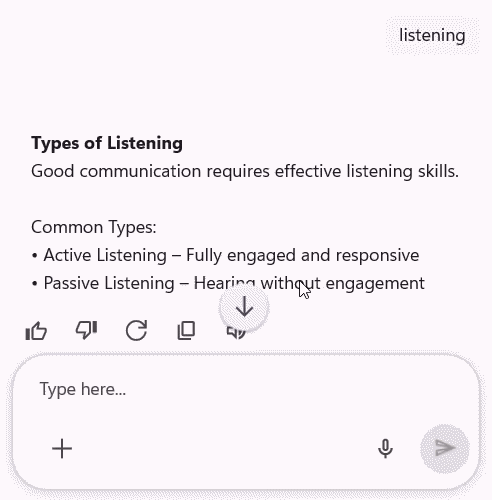
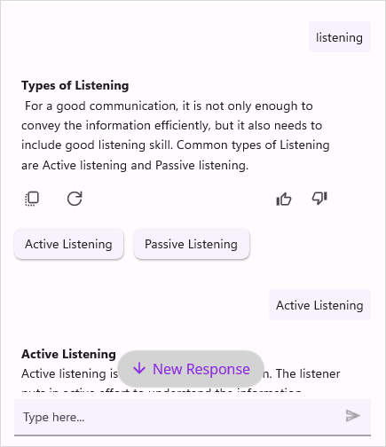

# Scrolling in .NET MAUI AI AssistView 

The [SfAIAssistView](https://help.syncfusion.com/cr/maui/Syncfusion.Maui.AIAssistView.html) control provides features to manage scrolling efficiently. It includes a scroll-to-bottom button for quick navigation, supports customization through templates, and allows control over auto-scrolling and scroll events to enhance user experience.

## Scroll to bottom button

The `SfAIAssistView` control provides an option to display a scroll-to-bottom button that helps users quickly navigate back to the latest responses when they have scrolled up in the AI conversation. To enable this, set the [ShowScrollToBottomButton](https://help.syncfusion.com/cr/maui/Syncfusion.Maui.AIAssistView.SfAIAssistView.html#Syncfusion_Maui_AIAssistView_SfAIAssistView_ShowScrollToBottomButton) property to `true`.




<syncfusion:SfAIAssistView x:Name="sfAIAssistView"
                           AssistItems="{Binding AssistItems}"
                           ShowScrollToBottomButton="True" />




using Syncfusion.Maui.AIAssistView;

public partial class MainPage : ContentPage
{
    SfAIAssistView sfAIAssistView;
    public MainPage()
    {
        InitializeComponent();
        this.sfAIAssistView = new SfAIAssistView();
        this.sfAIAssistView.ShowScrollToBottomButton = true;
        this.Content = sfAIAssistView;
    }
}




### Scroll to bottom button customization

The `SfAIAssistView` control allows you to fully customize the scroll-to-bottom button appearance by using the [ScrollToBottomButtonTemplate](https://help.syncfusion.com/cr/maui/Syncfusion.Maui.AIAssistView.SfAIAssistView.html#Syncfusion_Maui_AIAssistView_SfAIAssistView_ScrollToBottomButtonTemplate) property. This property lets you define a custom layout and style.




<ContentPage.Resources>
        <ResourceDictionary>
            <DataTemplate x:Key="scrollToBottomButtonTemplate">
                <Border Padding="10"
                        BackgroundColor="#6C4EC2"
                        StrokeThickness="0"
                        StrokeShape="RoundRectangle 25"
                        HorizontalOptions="Center"
                        VerticalOptions="End">
                    <HorizontalStackLayout Spacing="6"
                                           HorizontalOptions="Center"
                                           VerticalOptions="Center">
                        <Image Source="down.png"
                               WidthRequest="16"
                               HeightRequest="16"
                               VerticalOptions="Center" />
                        <Label Text="New Response"
                               FontSize="14"
                               TextColor="White"
                               VerticalOptions="Center" />
                        </HorizontalStackLayout>
                </Border>
            </DataTemplate>
        </ResourceDictionary>
</ContentPage.Resources>

<syncfusion:SfAIAssistView x:Name="sfAIAssistView"
                           AssistItems="{Binding AssistItems}"
                           ShowScrollToBottomButton="True"
                           ScrollToBottomButtonTemplate="{StaticResource scrollToBottomButtonTemplate}" />




using Syncfusion.Maui.AIAssistView;

public partial class MainPage : ContentPage
{
    SfAIAssistView sfAIAssistView;
    public MainPage()
    {
        InitializeComponent();
        this.sfAIAssistView = new SfAIAssistView();
        this.sfAIAssistView.ShowScrollToBottomButton = true;
        this.sfAIAssistView.ScrollToBottomButtonTemplate = this.CreateScrollToBottomButtonTemplate();
        this.Content = this.sfAIAssistView;
    }

    private DataTemplate CreateScrollToBottomButtonTemplate()
    {
        return new DataTemplate(() =>
        {
            var border = new Border
            {
                Padding = new Thickness(10),
                BackgroundColor = Color.FromArgb("#6C4EC2"),
                StrokeThickness = 0,
                StrokeShape = new RoundRectangle
                {
                    CornerRadius = new CornerRadius(25)
                },
                HorizontalOptions = LayoutOptions.Center,
                VerticalOptions = LayoutOptions.End
            };

            var layout = new HorizontalStackLayout
            {
                Spacing = 6,
                HorizontalOptions = LayoutOptions.Center,
                VerticalOptions = LayoutOptions.Center
            };

            var image = new Image
            {
                Source = "down.png",
                WidthRequest = 16,
                HeightRequest = 16,
                VerticalOptions = LayoutOptions.Center
            };

            var label = new Label
            {
                Text = "New Response",
                FontSize = 14,
                TextColor = Colors.White,
                VerticalOptions = LayoutOptions.Center
            };

            layout.Children.Add(image);
            layout.Children.Add(label);
            border.Content = layout;
            return border;
        });
    }
}




## Auto scroll control to bottom when new message is added

By default, the `SfAIAssistView` control automatically scrolls to the bottom of the conversation to display newly added messages. If you want to prevent this behavior and retain the current scroll position, you can disable auto‑scrolling by setting the [CanAutoScrollToBottom](https://help.syncfusion.com/cr/maui/Syncfusion.Maui.AIAssistView.SfAIAssistView.html#Syncfusion_Maui_AIAssistView_SfAIAssistView_CanAutoScrollToBottom) property to `false`.




<syncfusion:SfAIAssistView x:Name="sfAIAssistView"
                           AssistItems="{Binding AssistItems}"
                           CanAutoScrollToBottom="False" />




## Scrolled Event

The `SfAIAssistView` control comes with a built-in [Scrolled](https://help.syncfusion.com/cr/maui/Syncfusion.Maui.AIAssistView.SfAIAssistView.html#Syncfusion_Maui_AIAssistView_SfAIAssistView_Scrolled) event that will be fired whenever the conversation view is scrolled.  This event allows developers to track the current scroll position and determine whether the user has reached the top or bottom of the conversation list through the [ScrolledEventArgs](https://help.syncfusion.com/cr/maui/Syncfusion.Maui.AIAssistView.ScrolledEventArgs.html). 

You can handle this event to control the auto-scroll behavior of the AssistView. For example, if the user manually scrolls up and is no longer at the bottom of the conversation, auto-scrolling can be disabled to prevent newly added messages from interrupting the user’s reading position.




<syncfusion:SfAIAssistView x:Name="sfAIAssistView"
                           Scrolled="sfAIAssistView_Scrolled" />




 sfAIAssistView.Scrolled += sfAIAssistView_Scrolled;

private void sfAIAssistView_Scrolled(object sender, Syncfusion.Maui.AIAssistView.ScrolledEventArgs e)
{
   // Handle the Scrolled event.
}



