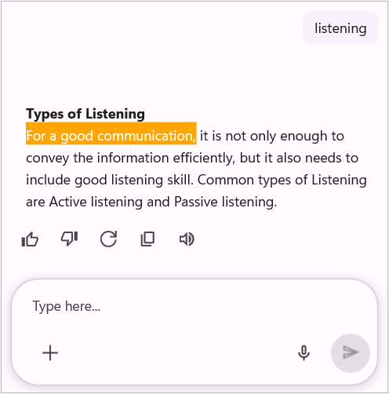
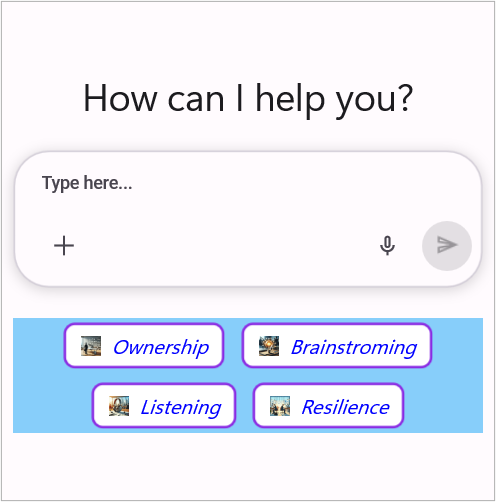

# Style customization in NET MAUI AI AssistView

You can style the elements of the [SfAIAssistView](https://help.syncfusion.com/cr/maui/Syncfusion.Maui.AIAssistView.html) control by creating resource dictionaries and assigning values to the built-in keys for each individual element.

## AI AssistView background

To set a solid color as the background for the [SfAIAssistView](https://help.syncfusion.com/cr/maui/Syncfusion.Maui.AIAssistView.html) control, assign a color to the `SfAIAssistView.Background` property. For the solid color to be visible, also set the background to transparent, as shown in the code sample below.




<ContentPage.Resources>
    <syncTheme:SyncfusionThemeDictionary>
        <syncTheme:SyncfusionThemeDictionary.MergedDictionaries>
            <ResourceDictionary>
                <x:String x:Key="SfAIAssistViewTheme">CustomTheme</x:String>
                <Color x:Key="SfAIAssistViewBackground">transparent</Color>
            </ResourceDictionary>
        </syncTheme:SyncfusionThemeDictionary.MergedDictionaries>
    </syncTheme:SyncfusionThemeDictionary>
</ContentPage.Resources>

<syncfusion:SfAIAssistView x:Name="sfAIAssistView"
                           Background="#94b6ec" />




public partial class MainPage : ContentPage
{
    public MainPage()
    {
        InitializeComponent();
        SfAIAssistView sfAIAssistView = new SfAIAssistView();
        sfAIAssistView.Background = Color.FromArgb("#94b6ec");
        this.Content = sfAIAssistView;
    }
}




### Set background image

To set an image as the background for the `SfAIAssistView`, set the `SfAIAssistView.Background` to `Colors.Transparent` and place the image below the `SfAIAssistView` control.




<ContentPage.Resources>
    <syncTheme:SyncfusionThemeDictionary>
        <syncTheme:SyncfusionThemeDictionary.MergedDictionaries>
            <ResourceDictionary>
                <x:String x:Key="SfAIAssistViewTheme">CustomTheme</x:String>
                <Color x:Key="SfAIAssistViewBackground">transparent</Color>
            </ResourceDictionary>
        </syncTheme:SyncfusionThemeDictionary.MergedDictionaries>
    </syncTheme:SyncfusionThemeDictionary>
</ContentPage.Resources>

<Grid>
    <Image Source="backgroundimage.jpg" Aspect="AspectFill" />
    <syncfusion:SfAIAssistView x:Name="sfAIAssistView"
                               Background="Transparent" />
</Grid>




public partial class MainPage : ContentPage
{
    public MainPage()
    {
        InitializeComponent();
        Grid grid = new Grid();
        SfAIAssistView sfAIAssistView = new SfAIAssistView();
        Image image = new Image();
        image.Source = "backgroundimage.jpg";
        image.Aspect = Aspect.AspectFill;
        grid.Children.Add(image);
        sfAIAssistView.Background = Colors.Transparent;
        grid.Children.Add(sfAIAssistView);
        this.Content = grid;
    }
}




### Set gradient background

To apply a gradient view as a background to the AI AssistView, set the `SfAIAssistView.Background` property to the desired gradient colors.





<ContentPage.Resources>
    <syncTheme:SyncfusionThemeDictionary>
        <syncTheme:SyncfusionThemeDictionary.MergedDictionaries>
            <ResourceDictionary>
                <x:String x:Key="SfAIAssistViewTheme">CustomTheme</x:String>
                <Color x:Key="SfAIAssistViewBackground">transparent</Color>
            </ResourceDictionary>
        </syncTheme:SyncfusionThemeDictionary.MergedDictionaries>
    </syncTheme:SyncfusionThemeDictionary>
</ContentPage.Resources>

<syncfusion:SfAIAssistView x:Name="sfAIAssistView">
    <syncfusion:SfAIAssistView.Background>
        <LinearGradientBrush>
            <GradientStop Color="SkyBlue" Offset="0.0" />
            <GradientStop Color="LightCyan" Offset="0.25" />
            <GradientStop Color="SteelBlue" Offset="0.5" />
            <GradientStop Color="LightSkyBlue" Offset="0.75" />
            <GradientStop Color="LightGray" Offset="1.0" />
        </LinearGradientBrush>
    </syncfusion:SfAIAssistView.Background>
</syncfusion:SfAIAssistView>




public partial class MainPage : ContentPage
{
    public MainPage()
    {
        InitializeComponent();
        SfAIAssistView sfAIAssistView = new SfAIAssistView();
        LinearGradientBrush linearGradientBrush = new LinearGradientBrush();
        linearGradientBrush.GradientStops.Add(new GradientStop(Colors.SkyBlue, 0.0f));
        linearGradientBrush.GradientStops.Add(new GradientStop(Colors.LightCyan, 0.25f));
        linearGradientBrush.GradientStops.Add(new GradientStop(Colors.SteelBlue, 0.5f));
        linearGradientBrush.GradientStops.Add(new GradientStop(Colors.LightSkyBlue, 0.75f));
        linearGradientBrush.GradientStops.Add(new GradientStop(Colors.LightGray, 1.0f));
        sfAIAssistView.Background = linearGradientBrush;
        this.Content = sfAIAssistView;
    }
}




## Request item styling

To apply styles to the elements of a request item, set values to the built-in keys of the request item in the resource dictionary.

<table>
<tr>
<th>Key</th>
<th>Description</th>
</tr>
<tr>
<td>SfAIAssistViewRequestItemTextColor</td>
<td>Text color of the request item.</td>
</tr>
<tr>
<td>SfAIAssistViewRequestItemAuthorTextColor</td>
<td>Text color of the author’s name in the request item.</td>
</tr>
<tr>
<td>SfAIAssistViewRequestItemBackground</td>
<td>Background color of the request item.</td>
</tr>
<tr>
<td>SfAIAssistViewRequestItemFontFamily</td>
<td>Font family of the request item.</td>
</tr>
<tr>
<td>SfAIAssistViewRequestItemFontAttributes</td>
<td>Font attributes of the request item.</td>
</tr>
<tr>
<td>SfAIAssistViewRequestItemFontSize</td>
<td>Font size of the request item.</td>
</tr>
<tr>
<td>SfAIAssistViewRequestItemAuthorFontFamily</td>
<td>Font family of the author’s name in the request item.</td>
</tr>
<tr>
<td>SfAIAssistViewRequestItemAuthorFontAttributes</td>
<td>Font attributes of the author’s name in the request item.</td>
</tr>
<tr>
<td>SfAIAssistViewRequestItemAuthorFontSize</td>
<td>Font size of the author’s name in the request item.</td>
</tr>
</table>




<ContentPage.Resources>
    <syncTheme:SyncfusionThemeDictionary>
        <syncTheme:SyncfusionThemeDictionary.MergedDictionaries>
            <ResourceDictionary>
                <x:String x:Key="SfAIAssistViewTheme">CustomTheme</x:String>
                <Color x:Key="SfAIAssistViewRequestItemTextColor">Gray</Color>
                <Color x:Key="SfAIAssistViewRequestItemAuthorTextColor">Gray</Color>
                <Color x:Key="SfAIAssistViewRequestItemBackground">#eee479</Color>
                <x:String x:Key="SfAIAssistViewRequestItemFontFamily">Roboto-Medium</x:String>
                <FontAttributes x:Key="SfAIAssistViewRequestItemFontAttributes">Italic</FontAttributes>
                <x:Double x:Key="SfAIAssistViewRequestItemFontSize">16</x:Double>
                <x:String x:Key="SfAIAssistViewRequestItemAuthorFontFamily">Roboto-Medium</x:String>
                <FontAttributes x:Key="SfAIAssistViewRequestItemAuthorFontAttributes">Italic</FontAttributes>
                <x:Double x:Key="SfAIAssistViewRequestItemAuthorFontSize">16</x:Double>
            </ResourceDictionary>
        </syncTheme:SyncfusionThemeDictionary.MergedDictionaries>
    </syncTheme:SyncfusionThemeDictionary>
</ContentPage.Resources>




public partial class MainPage : ContentPage
{
    public MainPage()
    {
        InitializeComponent();
        ResourceDictionary dictionary = new ResourceDictionary();
        dictionary.Add("SfAIAssistViewTheme", "CustomTheme");
        dictionary.Add("SfAIAssistViewRequestItemTextColor", Colors.Gray);
        dictionary.Add("SfAIAssistViewRequestItemAuthorTextColor", Colors.Gray);
        dictionary.Add("SfAIAssistViewRequestItemBackground", Color.FromArgb("#eee479"));
        dictionary.Add("SfAIAssistViewRequestItemFontFamily", "Roboto-Medium");
        dictionary.Add("SfAIAssistViewRequestItemFontAttributes", FontAttributes.Italic);
        dictionary.Add("SfAIAssistViewRequestItemFontSize", 16);
        dictionary.Add("SfAIAssistViewRequestItemAuthorFontFamily", "Roboto-Medium");
        dictionary.Add("SfAIAssistViewRequestItemAuthorFontAttributes", FontAttributes.Italic);
        dictionary.Add("SfAIAssistViewRequestItemAuthorFontSize", 16);
        this.Resources.Add(dictionary);
    }
}




## Response item styling

To apply styles to the elements of a response item, set values to the built-in keys of the response item in the resource dictionary.

<table>
<tr>
<th>Key</th>
<th>Description</th>
</tr>
<tr>
<td>SfAIAssistViewResponseItemTextColor</td>
<td>Text color of the response item.</td>
</tr>
<tr>
<td>SfAIAssistViewResponseItemAuthorTextColor</td>
<td>Text color of the author’s name in the response item.</td>
</tr>
<tr>
<td>SfAIAssistViewResponseItemBackground</td>
<td>Background color of the response item.</td>
</tr>
<tr>
<td>SfAIAssistViewResponseItemFontFamily</td>
<td>Font family of the response item.</td>
</tr>
<tr>
<td>SfAIAssistViewResponseItemFontAttributes</td>
<td>Font attributes of the response item.</td>
</tr>
<tr>
<td>SfAIAssistViewResponseItemFontSize</td>
<td>Font size of the response.</td>
</tr>
<tr>
<td>SfAIAssistViewResponseItemAuthorFontFamily</td>
<td>Font family of the author’s name in the response item.</td>
</tr>
<tr>
<td>SfAIAssistViewResponseItemAuthorFontAttributes</td>
<td>Font attributes of the author’s name in the response item.</td>
</tr>
<tr>
<td>SfAIAssistViewResponseItemAuthorFontSize</td>
<td>Font size of the author’s name in the response item.</td>
</tr>
</table>




<ContentPage.Resources>
    <syncTheme:SyncfusionThemeDictionary>
        <syncTheme:SyncfusionThemeDictionary.MergedDictionaries>
            <ResourceDictionary>
                <x:String x:Key="SfAIAssistViewTheme">CustomTheme</x:String>
                <Color x:Key="SfAIAssistViewResponseItemTextColor">Gray</Color>
                <Color x:Key="SfAIAssistViewResponseItemAuthorTextColor">Gray</Color>
                <Color x:Key="SfAIAssistViewResponseItemBackground">#eee479</Color>
                <x:String x:Key="SfAIAssistViewResponseItemFontFamily">Roboto-Medium</x:String>
                <FontAttributes x:Key="SfAIAssistViewResponseItemFontAttributes">Italic</FontAttributes>
                <x:Double x:Key="SfAIAssistViewResponseItemFontSize">16</x:Double>
                <x:String x:Key="SfAIAssistViewResponseItemAuthorFontFamily">Roboto-Medium</x:String>
                <FontAttributes x:Key="SfAIAssistViewResponseItemAuthorFontAttributes">Italic</FontAttributes>
                <x:Double x:Key="SfAIAssistViewResponseItemAuthorFontSize">16</x:Double>
            </ResourceDictionary>
        </syncTheme:SyncfusionThemeDictionary.MergedDictionaries>
    </syncTheme:SyncfusionThemeDictionary>
</ContentPage.Resources>




public partial class MainPage : ContentPage
{
    public MainPage()
    {
        InitializeComponent();
        ResourceDictionary dictionary = new ResourceDictionary();
        dictionary.Add("SfAIAssistViewTheme", "CustomTheme");
        dictionary.Add("SfAIAssistViewResponseItemTextColor", Colors.Gray);
        dictionary.Add("SfAIAssistViewResponseItemAuthorTextColor", Colors.Gray);
        dictionary.Add("SfAIAssistViewResponseItemBackground", Color.FromArgb("#eee479"));
        dictionary.Add("SfAIAssistViewResponseItemFontFamily", "Roboto-Medium");
        dictionary.Add("SfAIAssistViewResponseItemFontAttributes", FontAttributes.Italic);
        dictionary.Add("SfAIAssistViewResponseItemFontSize", 16);
        dictionary.Add("SfAIAssistViewResponseItemAuthorFontFamily", "Roboto-Medium");
        dictionary.Add("SfAIAssistViewResponseItemAuthorFontAttributes", FontAttributes.Italic);
        dictionary.Add("SfAIAssistViewResponseItemAuthorFontSize", 16);
        this.Resources.Add(dictionary);
    }
}




## Hyperlink item styling

To apply styles to the elements of a hyperlink item, set values to the built-in keys of the hyperlink item in the resource dictionary.

<table>
<tr>
<th>Key</th>
<th>Description</th>
</tr>
<tr>
<td>SfAIAssistViewRequestHyperlinkColor</td>
<td>Text color of the URL in a hyperlink item.</td>
</tr>
<tr>
<td>SfAIAssistViewResponseHyperlinkColor</td>
<td>Text color of the URL in an outgoing hyperlink item.</td>
</tr>
<tr>
<td>SfAIAssistViewHyperlinkDescriptionTextColor</td>
<td>Text color of the URL's meta description in a hyperlink item.</td>
</tr>
<tr>
<td>SfAIAssistViewHyperlinkDescriptionBackground</td>
<td>Background color of the URL description area in a hyperlink item.</td>
</tr>
<tr>
<td>SfAIAssistViewHyperlinkMetaTitleTextColor</td>
<td>Text color of the URL's meta title in a hyperlink item.</td>
</tr>
</table>




<ContentPage.Resources>
    <syncTheme:SyncfusionThemeDictionary>
        <syncTheme:SyncfusionThemeDictionary.MergedDictionaries>
            <ResourceDictionary>
                <x:String x:Key="SfAIAssistViewTheme">CustomTheme</x:String>
                <Color x:Key="SfAIAssistViewRequestHyperlinkColor">#94b6ec</Color>
                <Color x:Key="SfAIAssistViewHyperlinkMetaTitleTextColor">#f29d0a</Color>
                <Color x:Key="SfAIAssistViewHyperlinkDescriptionTextColor">Black</Color>
                <Color x:Key="SfAIAssistViewHyperlinkDescriptionBackground">#dde9cc</Color>
            </ResourceDictionary>
        </syncTheme:SyncfusionThemeDictionary.MergedDictionaries>
    </syncTheme:SyncfusionThemeDictionary>
</ContentPage.Resources>




public partial class MainPage : ContentPage
{
    public MainPage()
    {
        InitializeComponent();
        ResourceDictionary dictionary = new ResourceDictionary();
        dictionary.Add("SfAIAssistViewTheme", "CustomTheme");
        dictionary.Add("SfAIAssistViewRequestHyperlinkColor", Color.FromArgb("#94b6ec"));
        dictionary.Add("SfAIAssistViewHyperlinkMetaTitleTextColor", Color.FromArgb("#f29d0a"));
        dictionary.Add("SfAIAssistViewHyperlinkDescriptionTextColor", Colors.Black);
        dictionary.Add("SfAIAssistViewHyperlinkDescriptionBackground", Color.FromArgb("#dde9cc"));
        this.Resources.Add(dictionary);
    }
}




## Card item styling

To apply styles to the elements of a card item, set values to the built-in keys of the card item in the resource dictionary.

<table>
<tr>
<th>Key</th>
<th>Description</th>
</tr>
<tr>
<td>SfAIAssistViewCardBackground</td>
<td>Background color of the card item.</td>
</tr>
<tr>
<td>SfAIAssistViewCardStroke</td>
<td>Border color of the card item.</td>
</tr>
<tr>
<td>SfAIAssistViewCardTitleTextColor</td>
<td>Title text color of the card item.</td>
</tr>
<tr>
<td>SfAIAssistViewCardTitleFontFamily</td>
<td>Font family of the card title.</td>
</tr>
<tr>
<td>SfAIAssistViewCardTitleFontSize</td>
<td>Font size of the card title.</td>
</tr>
<tr>
<td>SfAIAssistViewCardTitleFontAttributes</td>
<td>Font attributes of the card title.</td>
</tr>
<tr>
<td>SfAIAssistViewCardSubtitleTextColor</td>
<td>Text color of the card subtitle.</td>
</tr>
<tr>
<td>SfAIAssistViewCardSubtitleFontFamily</td>
<td>Font family of the card subtitle.</td>
</tr>
<tr>
<td>SfAIAssistViewCardSubtitleFontSize</td>
<td>Font size of the card subtitle.</td>
</tr>
<tr>
<td>SfAIAssistViewCardSubtitleFontAttributes</td>
<td>Font attributes of the card subtitle.</td>
</tr>
<tr>
<td>SfAIAssistViewCardDescriptionTextColor</td>
<td>Text color of the card description.</td>
</tr>
<tr>
<td>SfAIAssistViewCardDescriptionFontFamily</td>
<td>Font family of the card description.</td>
</tr>
<tr>
<td>SfAIAssistViewCardDescriptionFontSize</td>
<td>Font size of the card description.</td>
</tr>
<tr>
<td>SfAIAssistViewCardDescriptionFontAttributes</td>
<td>Font attributes of the card description.</td>
</tr>
<tr>
<td>SfAIAssistViewCardButtonBackground</td>
<td>Background color of the card button.</td>
</tr>
<tr>
<td>SfAIAssistViewCardButtonStroke</td>
<td>Border color of the card button.</td>
</tr>
<tr>
<td>SfAIAssistViewCardButtonTextColor</td>
<td>Text color of the card button.</td>
</tr>
<tr>
<td>SfAIAssistViewCardButtonFontFamily</td>
<td>Font family of the card button.</td>
</tr>
<tr>
<td>SfAIAssistViewCardButtonFontSize</td>
<td>Font size of the card button.</td>
</tr>
<tr>
<td>SfAIAssistViewCardButtonFontAttributes</td>
<td>Font attributes of the card button.</td>
</tr>
</table>




<ContentPage.Resources>
    <syncTheme:SyncfusionThemeDictionary>
        <syncTheme:SyncfusionThemeDictionary.MergedDictionaries>
            <ResourceDictionary>
                <x:String x:Key="SfAIAssistViewTheme">CustomTheme</x:String>
                <Color x:Key="SfAIAssistViewCardBackground">#94b6ec</Color>
                <Color x:Key="SfAIAssistViewCardStroke">#f29d0a</Color>
                <Color x:Key="SfAIAssistViewCardTitleTextColor">Black</Color>
                <x:String x:Key="SfAIAssistViewCardTitleFontFamily">Roboto-Medium</x:String>
                <x:Double x:Key="SfAIAssistViewCardTitleFontSize">16</x:Double>
                <FontAttributes x:Key="SfAIAssistViewCardTitleFontAttributes">Bold</FontAttributes>
                <Color x:Key="SfAIAssistViewCardSubtitleTextColor">#dde9cc</Color>
                <x:String x:Key="SfAIAssistViewCardSubtitleFontFamily">Roboto-Medium</x:String>
                <x:Double x:Key="SfAIAssistViewCardSubtitleFontSize">12</x:Double>
                <FontAttributes x:Key="SfAIAssistViewCardSubtitleFontAttributes">Italic</FontAttributes>
                <Color x:Key="SfAIAssistViewCardDescriptionTextColor">#dde9cc</Color>
                <x:String x:Key="SfAIAssistViewCardDescriptionFontFamily">Roboto-Medium</x:String>
                <x:Double x:Key="SfAIAssistViewCardDescriptionFontSize">12</x:Double>
                <FontAttributes x:Key="SfAIAssistViewCardDescriptionFontAttributes">Italic</FontAttributes>
                <Color x:Key="SfAIAssistViewCardButtonBackground">#94b6ec</Color>
                <Color x:Key="SfAIAssistViewCardButtonStroke">#f29d0a</Color>
                <Color x:Key="SfAIAssistViewCardButtonTextColor">Gray</Color>
                <x:String x:Key="SfAIAssistViewCardButtonFontFamily">Roboto-Medium</x:String>
                <x:Double x:Key="SfAIAssistViewCardButtonFontSize">16</x:Double>
                <FontAttributes x:Key="SfAIAssistViewCardButtonFontAttributes">Bold</FontAttributes>
            </ResourceDictionary>
        </syncTheme:SyncfusionThemeDictionary.MergedDictionaries>
    </syncTheme:SyncfusionThemeDictionary>
</ContentPage.Resources>




public partial class MainPage : ContentPage
{
    public MainPage()
    {
        InitializeComponent();
        ResourceDictionary dictionary = new ResourceDictionary();
        dictionary.Add("SfAIAssistViewTheme", "CustomTheme");
        dictionary.Add("SfAIAssistViewCardBackground", Color.FromArgb("#94b6ec"));
        dictionary.Add("SfAIAssistViewCardStroke", Color.FromArgb("#f29d0a"));
        dictionary.Add("SfAIAssistViewCardTitleTextColor", Colors.Black);
        dictionary.Add("SfAIAssistViewCardTitleFontFamily", "Roboto-Medium");
        dictionary.Add("SfAIAssistViewCardTitleFontSize", 16.0);
        dictionary.Add("SfAIAssistViewCardTitleFontAttributes", FontAttributes.Bold);
        dictionary.Add("SfAIAssistViewCardSubtitleTextColor", Color.FromArgb("#dde9cc"));
        dictionary.Add("SfAIAssistViewCardSubtitleFontFamily", "Roboto-Medium");
        dictionary.Add("SfAIAssistViewCardSubtitleFontSize", 12.0);
        dictionary.Add("SfAIAssistViewCardSubtitleFontAttributes", FontAttributes.Italic);
        dictionary.Add("SfAIAssistViewCardDescriptionTextColor", Color.FromArgb("#dde9cc"));
        dictionary.Add("SfAIAssistViewCardDescriptionFontFamily", "Roboto-Medium");
        dictionary.Add("SfAIAssistViewCardDescriptionFontSize", 12.0);
        dictionary.Add("SfAIAssistViewCardDescriptionFontAttributes", FontAttributes.Italic);
        dictionary.Add("SfAIAssistViewCardButtonBackground", Color.FromArgb("#94b6ec"));
        dictionary.Add("SfAIAssistViewCardButtonStroke", Color.FromArgb("#f29d0a"));
        dictionary.Add("SfAIAssistViewCardButtonTextColor", Colors.Gray);
        dictionary.Add("SfAIAssistViewCardButtonFontFamily", "Roboto-Medium");
        dictionary.Add("SfAIAssistViewCardButtonFontSize", 16.0);
        dictionary.Add("SfAIAssistViewCardButtonFontAttributes", FontAttributes.Bold);
        this.Resources.Add(dictionary);
    }
}




## Item input view styling

To apply styles to the elements of the input view, set values to the built-in keys of the input view in the resource dictionary.

<table>
<tr>
<th>Key</th>
<th>Description</th>
</tr>
<tr>
<td>SfAIAssistViewInputViewBackground</td>
<td>Item input view background color.</td>
</tr>
</table>




<ContentPage.Resources>
    <syncTheme:SyncfusionThemeDictionary>
        <syncTheme:SyncfusionThemeDictionary.MergedDictionaries>
            <ResourceDictionary>
                <x:String x:Key="SfAIAssistViewTheme">CustomTheme</x:String>
                <Color x:Key="SfAIAssistViewInputViewBackground">#94b6ec</Color>
            </ResourceDictionary>
        </syncTheme:SyncfusionThemeDictionary.MergedDictionaries>
    </syncTheme:SyncfusionThemeDictionary>
</ContentPage.Resources>




public partial class MainPage : ContentPage
{
    public MainPage()
    {
        InitializeComponent();
        ResourceDictionary dictionary = new ResourceDictionary();
        dictionary.Add("SfAIAssistViewTheme", "CustomTheme");
        dictionary.Add("SfAIAssistViewInputViewBackground", Color.FromArgb("#94b6ec"));
        this.Resources.Add(dictionary);
    }
}




## Editor styling

To apply styles to the elements of the editor view, set values to the built-in keys of the editor view in the resource dictionary.

<table>
<tr>
<th>Key</th>
<th>Description</th>
</tr>
<tr>
<td>SfAIAssistViewEditorTextColor</td>
<td>Color of the text in the editor.</td>
</tr>
<tr>
<td>SfAIAssistViewEditorPlaceholderTextColor</td>
<td>Color of the placeholder text in the editor.</td>
</tr>
<tr>
<td>SfAIAssistViewEditorStroke</td>
<td>Color of the border in the editor.</td>
</tr>
<tr>
<td>SfAIAssistViewEditorStrokeThickness</td>
<td>Thickness of the border in the editor.</td>
</tr>
<tr>
<td>SfAIAssistViewEditorBackground</td>
<td>Background color of the editor.</td>
</tr>
<tr>
<td>SfAIAssistViewEditorFontFamily</td>
<td>Font family of the text in the editor.</td>
</tr>
<tr>
<td>SfAIAssistViewEditorFontAttributes</td>
<td>Font attributes of the text in the editor.</td>
</tr>
<tr>
<td>SfAIAssistViewEditorFontSize</td>
<td>Font size of the text in the editor.</td>
</tr>
</table>




<ContentPage.Resources>
    <syncTheme:SyncfusionThemeDictionary>
        <syncTheme:SyncfusionThemeDictionary.MergedDictionaries>
            <ResourceDictionary>
                <x:String x:Key="SfAIAssistViewTheme">CustomTheme</x:String>
                <Color x:Key="SfAIAssistViewEditorPlaceholderTextColor">Blue</Color>
                <Color x:Key="SfAIAssistViewEditorTextColor">Black</Color>
                <Color x:Key="SfAIAssistViewEditorBackground">LightGreen</Color>
                <Color x:Key="SfAIAssistViewEditorStroke">Black</Color>
                <x:Double x:Key="SfAIAssistViewEditorStrokeThickness">2</x:Double>
                <x:String x:Key="SfAIAssistViewEditorFontFamily">Roboto-Medium</x:String>
                <FontAttributes x:Key="SfAIAssistViewEditorFontAttributes">Bold</FontAttributes>
                <x:Double x:Key="SfAIAssistViewEditorFontSize">16</x:Double>
            </ResourceDictionary>
        </syncTheme:SyncfusionThemeDictionary.MergedDictionaries>
    </syncTheme:SyncfusionThemeDictionary>
</ContentPage.Resources>




public partial class MainPage : ContentPage
{
    public MainPage()
    {
        InitializeComponent();
        ResourceDictionary dictionary = new ResourceDictionary();
        dictionary.Add("SfAIAssistViewTheme", "CustomTheme");
        dictionary.Add("SfAIAssistViewEditorPlaceholderTextColor", Colors.Blue);
        dictionary.Add("SfAIAssistViewEditorBackground", Colors.LightGreen);
        dictionary.Add("SfAIAssistViewEditorTextColor", Colors.Black);
        dictionary.Add("SfAIAssistViewEditorStroke", Colors.Black);
        dictionary.Add("SfAIAssistViewEditorStrokeThickness", 2.0);
        dictionary.Add("SfAIAssistViewEditorFontFamily", "Roboto-Medium");
        dictionary.Add("SfAIAssistViewEditorFontAttributes", FontAttributes.Bold);
        dictionary.Add("SfAIAssistViewEditorFontSize", 16);
        this.Resources.Add(dictionary);
    }
}




## Suggestions styling

To apply styles to the elements of the suggestion view, set values to the built-in keys of the suggestion view in the resource dictionary.

<table>
<tr>
<th>Key</th>
<th>Description</th>
</tr>
<tr>
<td>SfAIAssistViewSuggestionItemTextColor</td>
<td>Text color of an item in the list of suggestions.</td>
</tr>
<tr>
<td>SfAIAssistViewSuggestionItemBackground</td>
<td>Background color of an item in the list of suggestions.</td>
</tr>
<tr>
<td>SfAIAssistViewSuggestionBackground</td>
<td>Background color of the suggestions list view.</td>
</tr>
<tr>
<td>SfAIAssistViewSuggestionItemFontFamily</td>
<td>Font family of an item in the list of suggestions.</td>
</tr>
<tr>
<td>SfAIAssistViewSuggestionItemFontAttributes</td>
<td>Font attributes of an item in the list of suggestions.</td>
</tr>
<tr>
<td>SfAIAssistViewSuggestionItemFontSize</td>
<td>Font size of an item in the list of suggestions.</td>
</tr>
</table>




<ContentPage.Resources>
    <syncTheme:SyncfusionThemeDictionary>
        <syncTheme:SyncfusionThemeDictionary.MergedDictionaries>
            <ResourceDictionary>
                <x:String x:Key="SfAIAssistViewTheme">CustomTheme</x:String>
                <Color x:Key="SfAIAssistViewSuggestionItemTextColor">Blue</Color>
                <Color x:Key="SfAIAssistViewSuggestionItemBackground">#d9d9d9</Color>
                <Color x:Key="SfAIAssistViewSuggestionBackground">Violet</Color>
                <x:String x:Key="SfAIAssistViewSuggestionItemFontFamily">Roboto-Medium</x:String>
                <FontAttributes x:Key="SfAIAssistViewSuggestionItemFontAttributes">Bold</FontAttributes>
                <x:Double x:Key="SfAIAssistViewSuggestionItemFontSize">16</x:Double>
            </ResourceDictionary>
        </syncTheme:SyncfusionThemeDictionary.MergedDictionaries>
    </syncTheme:SyncfusionThemeDictionary>
</ContentPage.Resources>




public partial class MainPage : ContentPage
{
    public MainPage()
    {
        InitializeComponent();
        ResourceDictionary dictionary = new ResourceDictionary();
        dictionary.Add("SfAIAssistViewTheme", "CustomTheme");
        dictionary.Add("SfAIAssistViewSuggestionItemTextColor", Colors.Blue);
        dictionary.Add("SfAIAssistViewSuggestionBackground", Colors.Violet);
        dictionary.Add("SfAIAssistViewSuggestionItemBackground", Color.FromArgb("#d9d9d9"));
        dictionary.Add("SfAIAssistViewSuggestionItemFontFamily", "Roboto-Medium");
        dictionary.Add("SfAIAssistViewSuggestionItemFontAttributes", FontAttributes.Bold);
        dictionary.Add("SfAIAssistViewSuggestionItemFontSize", 16);
        this.Resources.Add(dictionary);
    }
}




## Action view styling

To apply styles to the elements of the action view, set values to the built-in keys of the action view in the resource dictionary.

<table>
<tr>
<th>Key</th>
<th>Description</th>
</tr>
<tr>
<td>SfAIAssistViewNormalActionViewColor</td>
<td>Background color of the action view.</td>
</tr>
<tr>
<td>SfAIAssistViewHoverActionViewColor</td>
<td>Background color of the action view in the hover state.</td>
</tr>
<tr>
<td>SfAIAssistViewPressedActionViewColor</td>
<td>Background color of the action view in the pressed state.</td>
</tr>
<tr>
<td>SfAIAssistViewNormalActionViewIconColor</td>
<td>Icon color of the copy, retry, like, and dislike icons.</td>
</tr>
<tr>
<td>SfAIAssistViewSelectedLikeIconColor</td>
<td>Color of the like icon.</td>
</tr>
<tr>
<td>SfAIAssistViewSelectedDisLikeIconColor</td>
<td>Color of the dislike icon.</td>
</tr>
</table>




<ContentPage.Resources>
    <syncTheme:SyncfusionThemeDictionary>
        <syncTheme:SyncfusionThemeDictionary.MergedDictionaries>
            <ResourceDictionary>
                <x:String x:Key="SfAIAssistViewTheme">CustomTheme</x:String>
                <Color x:Key="SfAIAssistViewNormalActionViewColor">Blue</Color>
                <Color x:Key="SfAIAssistViewHoverActionViewColor">LightGray</Color>
                <Color x:Key="SfAIAssistViewPressedActionViewColor">DarkGray</Color>
                <Color x:Key="SfAIAssistViewNormalActionViewIconColor">Black</Color>
                <Color x:Key="SfAIAssistViewSelectedLikeIconColor">Green</Color>
                <Color x:Key="SfAIAssistViewSelectedDisLikeIconColor">Red</Color>
            </ResourceDictionary>
        </syncTheme:SyncfusionThemeDictionary.MergedDictionaries>
    </syncTheme:SyncfusionThemeDictionary>
</ContentPage.Resources>




public partial class MainPage : ContentPage
{
    public MainPage()
    {
        InitializeComponent();
        ResourceDictionary dictionary = new ResourceDictionary();
        dictionary.Add("SfAIAssistViewTheme", "CustomTheme");
        dictionary.Add("SfAIAssistViewNormalActionViewColor", Colors.Blue);
        dictionary.Add("SfAIAssistViewHoverActionViewColor", Colors.LightGray);
        dictionary.Add("SfAIAssistViewPressedActionViewColor", Colors.DarkGray);
        dictionary.Add("SfAIAssistViewNormalActionViewIconColor", Colors.Black);
        dictionary.Add("SfAIAssistViewSelectedLikeIconColor", Colors.Green);
        dictionary.Add("SfAIAssistViewSelectedDisLikeIconColor", Colors.Red);
        this.Resources.Add(dictionary);
    }
}




## Send button styling

To style the send item button based on its state, set values to the built-in keys of the send button in the resource dictionary.

<table>
<tr>
<th>Key</th>
<th>Description</th>
</tr>
<tr>
<td>SfAIAssistViewSendButtonBackground</td>
<td>Background color of the send button.</td>
</tr>
<tr>
<td>SfAIAssistViewSendButtonIconColor</td>
<td>Icon color of the send button.</td>
</tr>
<tr>
<td>SfAIAssistViewDisabledSendButtonIconColor</td>
<td>Color of the send button when it is in the disabled state.</td>
</tr>
<tr>
<td>SfAIAssistViewDisabledSendButtonBackground</td>
<td>Background color of the send button in the disabled state.</td>
</tr>
<tr>
<td>SfAIAssistViewSendViewHoverBackground</td>
<td>Background color of the send button in the hover state.</td>
</tr>
<tr>
<td>SfAIAssistViewSendViewPressedBackground</td>
<td>Background color of the send button in the pressed state.</td>
</tr>
</table>




<ContentPage.Resources>
    <syncTheme:SyncfusionThemeDictionary>
        <syncTheme:SyncfusionThemeDictionary.MergedDictionaries>
            <ResourceDictionary>
                <x:String x:Key="SfAIAssistViewTheme">CustomTheme</x:String>
                <Color x:Key="SfAIAssistViewSendButtonBackground">LightBlue</Color>
                <Color x:Key="SfAIAssistViewSendButtonIconColor">White</Color>
                <Color x:Key="SfAIAssistViewDisabledSendButtonIconColor">Purple</Color>
                <Color x:Key="SfAIAssistViewDisabledSendButtonBackground">LightGreen</Color>
                <Color x:Key="SfAIAssistViewSendViewHoverBackground">LightSkyBlue</Color>
                <Color x:Key="SfAIAssistViewSendViewPressedBackground">DeepSkyBlue</Color>
            </ResourceDictionary>
        </syncTheme:SyncfusionThemeDictionary.MergedDictionaries>
    </syncTheme:SyncfusionThemeDictionary>
</ContentPage.Resources>




public partial class MainPage : ContentPage
{
    public MainPage()
    {
        InitializeComponent();
        ResourceDictionary dictionary = new ResourceDictionary();
        dictionary.Add("SfAIAssistViewTheme", "CustomTheme");
        dictionary.Add("SfAIAssistViewSendButtonBackground", Colors.LightBlue);
        dictionary.Add("SfAIAssistViewSendButtonIconColor", Colors.White);
        dictionary.Add("SfAIAssistViewDisabledSendButtonIconColor", Colors.Purple);
        dictionary.Add("SfAIAssistViewDisabledSendButtonBackground", Colors.LightGreen);
        dictionary.Add("SfAIAssistViewSendViewHoverBackground", Colors.LightSkyBlue);
        dictionary.Add("SfAIAssistViewSendViewPressedBackground", Colors.DeepSkyBlue);
        this.Resources.Add(dictionary);
    }
}




## Stop responding view styling

To style the stop responding view based on its appearance, set values to the built-in keys in the resource dictionary.

<table>
<tr>
<th>Key</th>
<th>Description</th>
</tr>
<tr> 
<td>SfAIAssistViewStopRespondingBackground</td>
<td>Background color of the stop responding view.</td>
</tr>
<tr>
<td>SfAIAssistViewStopRespondingIconColor</td>
<td>Icon color of the stop responding view.</td>
</tr>
<tr>
<td>SfAIAssistViewStopRespondingStroke</td>
<td>Stroke color of the stop responding view.</td>
</tr>
<tr>
<td>SfAIAssistViewStopRespondingStrokeThickness</td>
<td>Stroke thickness of the stop responding view.</td>
</tr>
</table>




<ContentPage.Resources>
    <syncTheme:SyncfusionThemeDictionary>
        <syncTheme:SyncfusionThemeDictionary.MergedDictionaries>
            <ResourceDictionary>
                <x:String x:Key="SfAIAssistViewTheme">CustomTheme</x:String>
                <Color x:Key="SfAIAssistViewStopRespondingBackground">LightYellow</Color>
                <Color x:Key="SfAIAssistViewStopRespondingIconColor">Red</Color>
                <Color x:Key="SfAIAssistViewStopRespondingStroke">Violet</Color>
                <x:Double x:Key="SfAIAssistViewStopRespondingStrokeThickness">2</x:Double>
            </ResourceDictionary>
        </syncTheme:SyncfusionThemeDictionary.MergedDictionaries>
    </syncTheme:SyncfusionThemeDictionary>
</ContentPage.Resources>




public partial class MainPage : ContentPage
{
    public MainPage()
    {
        InitializeComponent();
        ResourceDictionary dictionary = new ResourceDictionary();
        dictionary.Add("SfAIAssistViewTheme", "CustomTheme");
        dictionary.Add("SfAIAssistViewStopRespondingBackground", Colors.LightYellow);
        dictionary.Add("SfAIAssistViewStopRespondingIconColor", Colors.Red);
        dictionary.Add("SfAIAssistViewStopRespondingStroke", Colors.Violet);
        dictionary.Add("SfAIAssistViewStopRespondingStrokeThickness", 2.0);
        this.Resources.Add(dictionary);
    }
}




## Text selection styling

To modify the highlight color of selected text, you need to update the value associated with the built-in key `SfAIAssistViewSelectionTextHighLightColor` in the resource dictionary.

<table>
<tr>
<th>Key</th>
<th>Description</th>
</tr>
<tr>
<td> SfAIAssistViewSelectionTextHighLightColor </td>
<td> Color to highlight the selected text. </td>
</tr>
</table>




<ContentPage.Resources>
    <core:SyncfusionThemeDictionary>
        <core:SyncfusionThemeDictionary.MergedDictionaries>
            <ResourceDictionary>
                <x:String x:Key="SfAIAssistViewTheme">CustomTheme</x:String>
                <Color x:Key="SfAIAssistViewSelectionTextHighLightColor">Orange</Color>
            </ResourceDictionary>
        </core:SyncfusionThemeDictionary.MergedDictionaries>
    </core:SyncfusionThemeDictionary>
</ContentPage.Resources>




public partial class MainPage : ContentPage
{
    public MainPage()
    {
        InitializeComponent();
        ResourceDictionary dictionary = new ResourceDictionary();
        dictionary.Add("SfAIAssistViewTheme", "CustomTheme");
        dictionary.Add("SfAIAssistViewSelectionTextHighlightColor", Colors.Orange);
        this.Resources.Add(dictionary);
    }
}




## Common suggestions styling

To style the common suggestion view based on its appearance, set values to the built-in keys in the resource dictionary.

<table>
<tr>
<th>Key</th>
<th>Description</th>
</tr>
<tr>
<td>SfAIAssistViewHeaderSuggestionBackground</td>
<td>Background color of the common suggestions view.</td>
</tr>
<tr>
<td>SfAIAssistViewHeaderSuggestionItemStroke</td>
<td>Stroke color for the common suggestion item.</td>
</tr>
<tr>
<td>SfAIAssistViewHeaderSuggestionItemStrokeThickness</td>
<td>Stroke thickness for the common suggestion item.</td>
</tr>
<tr>
<td>SfAIAssistViewHeaderSuggestionItemBackground</td>
<td>Background color of an item in the common suggestions.</td>
</tr>
<tr>
<td>SfAIAssistViewHeaderSuggestionItemTextColor</td>
<td>Text color of an item in the common suggestions.</td>
</tr>
<tr>
<td>SfAIAssistViewHeaderSuggestionItemFontSize</td>
<td>Font size of an item in the common suggestions.</td>
</tr>
<tr>
<td>SfAIAssistViewHeaderSuggestionItemFontFamily</td>
<td>Font family of an item in the common suggestions.</td>
</tr>
<tr>
<td>SfAIAssistViewHeaderSuggestionItemFontAttribute</td>
<td>Font attributes of an item in the common suggestions.</td>
</tr>
</table>




<ContentPage.Resources>
    <syncTheme:SyncfusionThemeDictionary>
        <syncTheme:SyncfusionThemeDictionary.MergedDictionaries>
            <ResourceDictionary>
                <x:String x:Key="SfAIAssistViewTheme">CustomTheme</x:String>
                <Color x:Key="SfAIAssistViewHeaderSuggestionBackground">LightSkyBlue</Color>
                <Color x:Key="SfAIAssistViewHeaderSuggestionItemStroke">BlueViolet</Color>
                <x:Double x:Key="SfAIAssistViewHeaderSuggestionItemStrokeThickness">2</x:Double>
                <Color x:Key="SfAIAssistViewHeaderSuggestionItemBackground">White</Color>
                <Color x:Key="SfAIAssistViewHeaderSuggestionItemTextColor">Blue</Color>
                <x:Double x:Key="SfAIAssistViewHeaderSuggestionItemFontSize">16</x:Double>
                <FontAttributes x:Key="SfAIAssistViewHeaderSuggestionItemFontAttribute">Italic</FontAttributes>
                <x:String x:Key="SfAIAssistViewHeaderSuggestionItemFontFamily">Roboto-Medium</x:String>
            </ResourceDictionary>
        </syncTheme:SyncfusionThemeDictionary.MergedDictionaries>
    </syncTheme:SyncfusionThemeDictionary>
</ContentPage.Resources>




public partial class MainPage : ContentPage
{
    public MainPage()
    {
        InitializeComponent();
        ResourceDictionary dictionary = new ResourceDictionary();
        dictionary.Add("SfAIAssistViewTheme", "CustomTheme");
        dictionary.Add("SfAIAssistViewHeaderSuggestionBackground", Colors.LightSkyBlue);
        dictionary.Add("SfAIAssistViewHeaderSuggestionItemStroke", Colors.BlueViolet);
        dictionary.Add("SfAIAssistViewHeaderSuggestionItemStrokeThickness", 2.0);
        dictionary.Add("SfAIAssistViewHeaderSuggestionItemBackground", Colors.White);
        dictionary.Add("SfAIAssistViewHeaderSuggestionItemTextColor", Colors.Blue);
        dictionary.Add("SfAIAssistViewHeaderSuggestionItemFontSize", 16.0);
        dictionary.Add("SfAIAssistViewHeaderSuggestionItemFontAttribute", FontAttributes.Italic);
        dictionary.Add("SfAIAssistViewHeaderSuggestionItemFontFamily", "Roboto-Medium");
        this.Resources.Add(dictionary);
    }
}




## Scroll to bottom button styling

To style the scroll to bottom button view based on its appearance, set values to the built-in keys in the resource dictionary.

<table>
<tr>
<th>Key</th>
<th>Description</th>
</tr>
<tr>
<td>SfAIAssistViewScrollToBottomButtonBackground</td>
<td>Background color of the scroll to bottom button view.</td>
</tr>
<tr>
<td>SfAIAssistViewScrollToBottomButtonIconColor</td>
<td>Color of the scroll to bottom button.</td>
</tr>
<tr>
<td>SfAIAssistViewHoveredScrollToBottomButtonBackground</td>
<td>Background color of the scroll to bottom button in the hover state.</td>
</tr>
<tr>
<td>SfAIAssistViewPressedScrollToBottomButtonBackground</td>
<td>Background color of the scroll to bottom button in the pressed state.</td>
</tr>
</table>




<ContentPage.Resources>
    <core:SyncfusionThemeDictionary>
        <core:SyncfusionThemeDictionary.MergedDictionaries>
            <ResourceDictionary>
                <x:String x:Key="SfAIAssistViewTheme">CustomTheme</x:String>
                <Color x:Key="SfAIAssistViewScrollToBottomButtonBackground">Orange</Color>
                <Color x:Key="SfAIAssistViewScrollToBottomButtonIconColor">White</Color>
                <Color x:Key="SfAIAssistViewHoveredScrollToBottomButtonBackground">DarkOrange</Color>
                <Color x:Key="SfAIAssistViewPressedScrollToBottomButtonBackground">OrangeRed</Color>
            </ResourceDictionary>
        </core:SyncfusionThemeDictionary.MergedDictionaries>
    </core:SyncfusionThemeDictionary>
</ContentPage.Resources>




public partial class MainPage : ContentPage
{
    public MainPage()
    {
        InitializeComponent();
        ResourceDictionary dictionary = new ResourceDictionary();
        dictionary.Add("SfAIAssistViewTheme", "CustomTheme");
        dictionary.Add("SfAIAssistViewScrollToBottomButtonBackground", Colors.Orange);
        dictionary.Add("SfAIAssistViewScrollToBottomButtonIconColor", Colors.White);
        dictionary.Add("SfAIAssistViewHoveredScrollToBottomButtonBackground", Colors.DarkOrange);
        dictionary.Add("SfAIAssistViewPressedScrollToBottomButtonBackground", Colors.OrangeRed);
        this.Resources.Add(dictionary);
    }
}




## Action button styling

To style the action button view based on its appearance, set values to the built-in keys in the resource dictionary.

<table>
<tr>
<th>Key</th>
<th>Description</th>
</tr>
<tr>
<td>SfAIAssistViewActionButtonBackground</td>
<td>Background color of the action button.</td>
</tr>
<tr>
<td>SfAIAssistViewActionButtonIconColor</td>
<td>Color of the action button.</td>
</tr>
<tr>
<td>SfAIAssistViewActionButtonViewTextColor</td>
<td>Text color of an item in the action button.</td>
</tr>
<tr>
<td>SfAIAssistViewActionButtonItemBackground</td>
<td>Background color of an item in the action buttons view.</td>
</tr>
<tr>
<td>SfAIAssistViewActionButtonItemFontFamily</td>
<td>Font family of an item in the action buttons view.</td>
</tr>
<tr>
<td>SfAIAssistViewActionButtonItemFontSize</td>
<td>Font size of an item in the action buttons view.</td>
</tr>
<tr>
<td>SfAIAssistViewActionButtonItemFontAttributes</td>
<td>Font attributes of an item in the action buttons view.</td>
</tr>
<tr>
<td>SfAIAssistViewActionButtonsPopupBackground</td>
<td>Background color of the action buttons view.</td>
</tr>
</table>




<ContentPage.Resources>
    <core:SyncfusionThemeDictionary>
        <core:SyncfusionThemeDictionary.MergedDictionaries>
            <ResourceDictionary>
                <x:String x:Key="SfAIAssistViewTheme">CustomTheme</x:String>
                <Color x:Key="SfAIAssistViewActionButtonBackground">Orange</Color>
                <Color x:Key="SfAIAssistViewActionButtonIconColor">White</Color>
                <Color x:Key="SfAIAssistViewActionButtonViewTextColor">Black</Color>
                <Color x:Key="SfAIAssistViewActionButtonItemBackground">White</Color>
                <x:String x:Key="SfAIAssistViewActionButtonItemFontFamily">Roboto-Medium</x:String>
                <x:Double x:Key="SfAIAssistViewActionButtonItemFontSize">16</x:Double>
                <FontAttributes x:Key="SfAIAssistViewActionButtonItemFontAttributes">Bold</FontAttributes>
                <Color x:Key="SfAIAssistViewActionButtonsPopupBackground">LightGray</Color>
            </ResourceDictionary>
        </core:SyncfusionThemeDictionary.MergedDictionaries>
    </core:SyncfusionThemeDictionary>
</ContentPage.Resources>




public partial class MainPage : ContentPage
{
    public MainPage()
    {
        InitializeComponent();
        ResourceDictionary dictionary = new ResourceDictionary();
        dictionary.Add("SfAIAssistViewTheme", "CustomTheme");
        dictionary.Add("SfAIAssistViewActionButtonBackground", Colors.Orange);
        dictionary.Add("SfAIAssistViewActionButtonIconColor", Colors.White);
        dictionary.Add("SfAIAssistViewActionButtonViewTextColor", Colors.Black);
        dictionary.Add("SfAIAssistViewActionButtonItemBackground", Colors.White);
        dictionary.Add("SfAIAssistViewActionButtonItemFontFamily", "Roboto-Medium");
        dictionary.Add("SfAIAssistViewActionButtonItemFontSize", 16.0);
        dictionary.Add("SfAIAssistViewActionButtonItemFontAttributes", FontAttributes.Bold);
        dictionary.Add("SfAIAssistViewActionButtonsPopupBackground", Colors.LightGray);
        this.Resources.Add(dictionary);
    }
}




## Response suggestion header text styling

To style the response suggestion header text view based on its appearance, set values to the built-in keys in the resource dictionary.

<table>
<tr>
<th>Key</th>
<th>Description</th>
</tr>
<tr>
<td>SfAIAssistViewSuggestionHeaderTextColor</td>
<td>Text color of the response suggestion header text.</td>
</tr>
<tr>
<td>SfAIAssistViewSuggestionHeaderBackground</td>
<td>Background color of the response suggestion header text.</td>
</tr>
<tr>
<td>SfAIAssistViewSuggestionHeaderFontSize</td>
<td>Font size of the response suggestion header text.</td>
</tr>
<tr>
<td>SfAIAssistViewSuggestionHeaderFontFamily</td>
<td>Font family of the response suggestion header text.</td>
</tr>
<tr>
<td>SfAIAssistViewSuggestionHeaderFontAttributes</td>
<td>Font attributes of the response suggestion header text.</td>
</tr>
</table>




<ContentPage.Resources>
    <syncTheme:SyncfusionThemeDictionary>
        <syncTheme:SyncfusionThemeDictionary.MergedDictionaries>
            <ResourceDictionary>
                <x:String x:Key="SfAIAssistViewTheme">CustomTheme</x:String>
                <Color x:Key="SfAIAssistViewSuggestionHeaderTextColor">DarkBlue</Color>
                <Color x:Key="SfAIAssistViewSuggestionHeaderBackground">LightSkyBlue</Color>
                <x:Double x:Key="SfAIAssistViewSuggestionHeaderFontSize">14</x:Double>
                <x:String x:Key="SfAIAssistViewSuggestionHeaderFontFamily">Roboto-Medium</x:String>
                <FontAttributes x:Key="SfAIAssistViewSuggestionHeaderFontAttributes">Bold</FontAttributes>
            </ResourceDictionary>
        </syncTheme:SyncfusionThemeDictionary.MergedDictionaries>
    </syncTheme:SyncfusionThemeDictionary>
</ContentPage.Resources>




public partial class MainPage : ContentPage
{
    public MainPage()
    {
        InitializeComponent();
        ResourceDictionary dictionary = new ResourceDictionary();
        dictionary.Add("SfAIAssistViewTheme", "CustomTheme");
        dictionary.Add("SfAIAssistViewSuggestionHeaderTextColor", Colors.DarkBlue);
        dictionary.Add("SfAIAssistViewSuggestionHeaderBackground", Colors.LightSkyBlue);
        dictionary.Add("SfAIAssistViewSuggestionHeaderFontSize", 14);
        dictionary.Add("SfAIAssistViewSuggestionHeaderFontFamily", "Roboto-Medium");
        dictionary.Add("SfAIAssistViewSuggestionHeaderFontAttributes", FontAttributes.Bold);
        this.Resources.Add(dictionary);
    }
}




## AutoComplete suggestion item styling

To style the autocomplete suggestion overlay view based on its appearance, set values to the built-in keys in the resource dictionary.

<table>
<tr>
<th>Key</th>
<th>Description</th>
</tr>
<tr>
<td>SfAIAssistViewAutoCompleteSuggestionBackground</td>
<td>Background color of the autocomplete suggestion overlay.</td>
</tr>
<tr>
<td>SfAIAssistViewAutoCompleteSuggestionItemBackground</td>
<td>Background color of an item in the autocomplete suggestion overlay.</td>
</tr>
<tr>
<td>SfAIAssistViewAutoCompleteSuggestionItemTextColor</td>
<td>Text color of an item in the autocomplete suggestion overlay.</td>
</tr>
<tr>
<td>SfAIAssistViewAutoCompleteSuggestionItemFontFamily</td>
<td>Font family of an item in the autocomplete suggestion overlay.</td>
</tr>
<tr>
<td>SfAIAssistViewAutoCompleteSuggestionItemFontSize</td>
<td>Font size of an item in the autocomplete suggestion overlay.</td>
</tr>
<tr>
<td>SfAIAssistViewAutoCompleteSuggestionItemFontAttributes</td>
<td>Font attributes of an item in the autocomplete suggestion overlay.</td>
</tr>
<tr>
<td>SfAIAssistViewAutoCompleteSuggestionItemSelectionBackground</td>
<td>Background color of the selected item in the autocomplete suggestion overlay.</td>
</tr>
<tr>
<td>SfAIAssistViewAutoCompleteSuggestionGroupHeaderTextColor</td>
<td>Text color of the group header in the autocomplete suggestion overlay.</td>
</tr>
<tr>
<td>SfAIAssistViewAutoCompleteSuggestionGroupHeaderBackground</td>
<td>Background color of the group header in the autocomplete suggestion overlay.</td>
</tr>
<tr>
<td>SfAIAssistViewAutoCompleteSuggestionGroupHeaderFontFamily</td>
<td>Font family of the group header in the autocomplete suggestion overlay.</td>
</tr>
<tr>
<td>SfAIAssistViewAutoCompleteSuggestionGroupHeaderFontSize</td>
<td>Font size of the group header in the autocomplete suggestion overlay.</td>
</tr>
<tr>
<td>SfAIAssistViewAutoCompleteSuggestionGroupHeaderFontAttributes</td>
<td>Font attributes of the group header in the autocomplete suggestion overlay.</td>
</tr>
<tr>
<td>SfAIAssistViewAutoSuggestionDividerBackground</td>
<td>Background color of the divider in the autocomplete suggestion overlay.</td>
</tr>
<tr>
<td>SfAIAssistViewAutoSuggestionDividerStrokeThickness</td>
<td>Stroke thickness of the divider in the autocomplete suggestion overlay.</td>
</tr>
</table>




<ContentPage.Resources>
    <syncTheme:SyncfusionThemeDictionary>
        <syncTheme:SyncfusionThemeDictionary.MergedDictionaries>
            <ResourceDictionary>
                <x:String x:Key="SfAIAssistViewTheme">CustomTheme</x:String>
                <Color x:Key="SfAIAssistViewAutoCompleteSuggestionBackground">Orange</Color>
                <Color x:Key="SfAIAssistViewAutoCompleteSuggestionItemBackground">LightSkyBlue</Color>
                <Color x:Key="SfAIAssistViewAutoCompleteSuggestionItemTextColor">Green</Color>
                <x:String x:Key="SfAIAssistViewAutoCompleteSuggestionItemFontFamily">OpenSansSemibold</x:String>
                <x:Double x:Key="SfAIAssistViewAutoCompleteSuggestionItemFontSize">20</x:Double>
                <FontAttributes x:Key="SfAIAssistViewAutoCompleteSuggestionItemFontAttributes">Bold</FontAttributes>
                <Color x:Key="SfAIAssistViewAutoCompleteSuggestionItemSelectionBackground">LightGray</Color>
                <Color x:Key="SfAIAssistViewAutoCompleteSuggestionGroupHeaderTextColor">DarkBlue</Color>
                <Color x:Key="SfAIAssistViewAutoCompleteSuggestionGroupHeaderBackground">LightYellow</Color>
                <x:String x:Key="SfAIAssistViewAutoCompleteSuggestionGroupHeaderFontFamily">Roboto-Medium</x:String>
                <x:Double x:Key="SfAIAssistViewAutoCompleteSuggestionGroupHeaderFontSize">14</x:Double>
                <FontAttributes x:Key="SfAIAssistViewAutoCompleteSuggestionGroupHeaderFontAttributes">Bold</FontAttributes>
                <Color x:Key="SfAIAssistViewAutoSuggestionDividerBackground">LightGray</Color>
                <x:Double x:Key="SfAIAssistViewAutoSuggestionDividerStrokeThickness">1</x:Double>
            </ResourceDictionary>
        </syncTheme:SyncfusionThemeDictionary.MergedDictionaries>
    </syncTheme:SyncfusionThemeDictionary>
</ContentPage.Resources>




public partial class MainPage : ContentPage
{
    public MainPage()
    {
        InitializeComponent();
        ResourceDictionary dictionary = new ResourceDictionary();
        dictionary.Add("SfAIAssistViewTheme", "CustomTheme");
        dictionary.Add("SfAIAssistViewAutoCompleteSuggestionBackground", Colors.Orange);
        dictionary.Add("SfAIAssistViewAutoCompleteSuggestionItemBackground", Colors.LightSkyBlue);
        dictionary.Add("SfAIAssistViewAutoCompleteSuggestionItemTextColor", Colors.Green);
        dictionary.Add("SfAIAssistViewAutoCompleteSuggestionItemFontFamily", "OpenSansSemibold");
        dictionary.Add("SfAIAssistViewAutoCompleteSuggestionItemFontSize", 20.0);
        dictionary.Add("SfAIAssistViewAutoCompleteSuggestionItemFontAttributes", FontAttributes.Bold);
        dictionary.Add("SfAIAssistViewAutoCompleteSuggestionItemSelectionBackground", Colors.LightGray);
        dictionary.Add("SfAIAssistViewAutoCompleteSuggestionGroupHeaderTextColor", Colors.DarkBlue);
        dictionary.Add("SfAIAssistViewAutoCompleteSuggestionGroupHeaderBackground", Colors.LightYellow);
        dictionary.Add("SfAIAssistViewAutoCompleteSuggestionGroupHeaderFontFamily", "Roboto-Medium");
        dictionary.Add("SfAIAssistViewAutoCompleteSuggestionGroupHeaderFontSize", 14.0);
        dictionary.Add("SfAIAssistViewAutoCompleteSuggestionGroupHeaderFontAttributes", FontAttributes.Bold);
        dictionary.Add("SfAIAssistViewAutoSuggestionDividerBackground", Colors.LightGray);
        dictionary.Add("SfAIAssistViewAutoSuggestionDividerStrokeThickness", 1.0);
        this.Resources.Add(dictionary);
    }
}




## Time break styling

To style the time break view based on its appearance, set values to the built-in keys in the resource dictionary.

<table>
<tr>
<th>Key</th>
<th>Description</th>
</tr>
<tr>
<td>SfAIAssistViewTimeBreakLabelTextColor</td>
<td>Text color of the time break label.</td>
</tr>
<tr>
<td>SfAIAssistViewTimeBreakLabelFontSize</td>
<td>Font size of the time break label.</td>
</tr>
<tr>
<td>SfAIAssistViewTimeBreakLabelFontFamily</td>
<td>Font family of the time break label.</td>
</tr>
<tr>
<td>SfAIAssistViewTimeBreakLabelFontAttributes</td>
<td>Font attributes of the time break label.</td>
</tr>
<tr>
<td>SfAIAssistViewTimeBreakSeparatorHeightRequest</td>
<td>Height of the time break separator line.</td>
</tr>
<tr>
<td>SfAIAssistViewTimeBreakSeparatorBackground</td>
<td>Background color of the time break separator line.</td>
</tr>
</table>




<ContentPage.Resources>
    <syncTheme:SyncfusionThemeDictionary>
        <syncTheme:SyncfusionThemeDictionary.MergedDictionaries>
            <ResourceDictionary>
                <x:String x:Key="SfAIAssistViewTheme">CustomTheme</x:String>
                <Color x:Key="SfAIAssistViewTimeBreakLabelTextColor">Blue</Color>
                <x:Double x:Key="SfAIAssistViewTimeBreakLabelFontSize">15</x:Double>
                <x:String x:Key="SfAIAssistViewTimeBreakLabelFontFamily">OpenSansSemibold</x:String>
                <FontAttributes x:Key="SfAIAssistViewTimeBreakLabelFontAttributes">Bold</FontAttributes>
                <x:Double x:Key="SfAIAssistViewTimeBreakSeparatorHeightRequest">4</x:Double>
                <Color x:Key="SfAIAssistViewTimeBreakSeparatorBackground">LightSkyBlue</Color>
            </ResourceDictionary>
        </syncTheme:SyncfusionThemeDictionary.MergedDictionaries>
    </syncTheme:SyncfusionThemeDictionary>
</ContentPage.Resources>




public partial class MainPage : ContentPage
{
    public MainPage()
    {
        InitializeComponent();
        ResourceDictionary dictionary = new ResourceDictionary();
        dictionary.Add("SfAIAssistViewTheme", "CustomTheme");
        dictionary.Add("SfAIAssistViewTimeBreakLabelTextColor", Colors.Blue);
        dictionary.Add("SfAIAssistViewTimeBreakLabelFontSize", 15.0);
        dictionary.Add("SfAIAssistViewTimeBreakLabelFontFamily", "OpenSansSemibold");
        dictionary.Add("SfAIAssistViewTimeBreakLabelFontAttributes", FontAttributes.Bold);
        dictionary.Add("SfAIAssistViewTimeBreakSeparatorHeightRequest", 4.0);
        dictionary.Add("SfAIAssistViewTimeBreakSeparatorBackground", Colors.LightSkyBlue);
        this.Resources.Add(dictionary);
    }
}




## Editor expansion button styling

To style the editor expansion button view based on its appearance, set values to the built-in keys in the resource dictionary.

<table>
<tr>
<th>Key</th>
<th>Description</th>
</tr>
<tr>
<td>SfAIAssistViewExpandViewBackground</td>
<td>Background color of the editor expansion button.</td>
</tr>
<tr>
<td>SfAIAssistViewExpandViewStroke</td>
<td>Stroke color of the editor expansion button.</td>
</tr>
<tr>
<td>SfAIAssistViewExpandIconColor</td>
<td>Icon color of the editor expansion button.</td>
</tr>
</table>




<ContentPage.Resources>
    <syncTheme:SyncfusionThemeDictionary>
        <syncTheme:SyncfusionThemeDictionary.MergedDictionaries>
            <ResourceDictionary>
                <x:String x:Key="SfAIAssistViewTheme">CustomTheme</x:String>
                <Color x:Key="SfAIAssistViewExpandViewBackground">Blue</Color>
                <Color x:Key="SfAIAssistViewExpandViewStroke">Orange</Color>
                <Color x:Key="SfAIAssistViewExpandIconColor">Red</Color>
            </ResourceDictionary>
        </syncTheme:SyncfusionThemeDictionary.MergedDictionaries>
    </syncTheme:SyncfusionThemeDictionary>
</ContentPage.Resources>




public partial class MainPage : ContentPage
{
    public MainPage()
    {
        InitializeComponent();
        ResourceDictionary dictionary = new ResourceDictionary();
        dictionary.Add("SfAIAssistViewTheme", "CustomTheme");
        dictionary.Add("SfAIAssistViewExpandViewBackground", Colors.Blue);
        dictionary.Add("SfAIAssistViewExpandViewStroke", Colors.Orange);
        dictionary.Add("SfAIAssistViewExpandIconColor", Colors.Red);
        this.Resources.Add(dictionary);
    }
}




## Voice input styling

To style the voice input view based on its appearance, set values to the built-in keys in the resource dictionary.

<table>
<tr>
<th>Key</th>
<th>Description</th>
</tr>
<tr>
<td>SfAIAssistViewMicViewNormalBackground</td>
<td>Background color of the microphone view in the normal state.</td>
</tr>
<tr>
<td>SfAIAssistViewMicViewHoverBackground</td>
<td>Background color of the microphone view in the hover state.</td>
</tr>
<tr>
<td>SfAIAssistViewMicViewPressedBackground</td>
<td>Background color of the microphone view in the pressed state.</td>
</tr>
<tr>
<td>SfAIAssistViewMicViewStroke</td>
<td>Stroke color of the microphone view.</td>
</tr>
<tr>
<td>SfAIAssistViewMicViewStrokeThickness</td>
<td>Stroke thickness of the microphone view.</td>
</tr>
<tr>
<td>SfAIAssistViewMicButtonDefaultIconColor</td>
<td>Default icon color of the microphone button.</td>
</tr>
<tr>
<td>SfAIAssistViewMicButtonPressedIconColor</td>
<td>Icon color of the microphone button in the pressed state.</td>
</tr>
</table>




<ContentPage.Resources>
    <syncTheme:SyncfusionThemeDictionary>
        <syncTheme:SyncfusionThemeDictionary.MergedDictionaries>
            <ResourceDictionary>
                <x:String x:Key="SfAIAssistViewTheme">CustomTheme</x:String>
                <Color x:Key="SfAIAssistViewMicViewNormalBackground">Blue</Color>
                <Color x:Key="SfAIAssistViewMicViewHoverBackground">LightBlue</Color>
                <Color x:Key="SfAIAssistViewMicViewPressedBackground">Violet</Color>
                <Color x:Key="SfAIAssistViewMicViewStroke">Red</Color>
                <x:Double x:Key="SfAIAssistViewMicViewStrokeThickness">3</x:Double>
                <Color x:Key="SfAIAssistViewMicButtonDefaultIconColor">Orange</Color>
                <Color x:Key="SfAIAssistViewMicButtonPressedIconColor">Green</Color>
            </ResourceDictionary>
        </syncTheme:SyncfusionThemeDictionary.MergedDictionaries>
    </syncTheme:SyncfusionThemeDictionary>
</ContentPage.Resources>




public partial class MainPage : ContentPage
{
    public MainPage()
    {
        InitializeComponent();
        ResourceDictionary dictionary = new ResourceDictionary();
        dictionary.Add("SfAIAssistViewTheme", "CustomTheme");
        dictionary.Add("SfAIAssistViewMicViewNormalBackground", Colors.Blue);
        dictionary.Add("SfAIAssistViewMicViewHoverBackground", Colors.LightBlue);
        dictionary.Add("SfAIAssistViewMicViewPressedBackground", Colors.Violet);
        dictionary.Add("SfAIAssistViewMicViewStroke", Colors.Red);
        dictionary.Add("SfAIAssistViewMicViewStrokeThickness", 3.0);
        dictionary.Add("SfAIAssistViewMicButtonDefaultIconColor", Colors.Orange);
        dictionary.Add("SfAIAssistViewMicButtonPressedIconColor", Colors.Green);
        this.Resources.Add(dictionary);
    }
}




### Error message styling
  
To style the error message view based on its appearance, set values to the built-in keys in the resource dictionary.

<table>
<tr>
<th>Key</th>
<th>Description</th>
</tr>
<tr>
<td>SfAIAssistViewErrorIcon</td>
<td>Icon displayed in the error message view.</td>
</tr>
<tr>
<td>SfAIAssistViewErrorIconColor</td>
<td>Color of the error icon.</td>
</tr>
<tr>
<td>SfAIAssistViewErrorIconFontSize</td>
<td>Font size of the error icon.</td>
</tr>
<tr>
<td>SfAIAssistViewErrorIconFontFamily</td>
<td>Font family of the error icon.</td>
</tr>
<tr>
<td>SfAIAssistViewErrorIconFontAttributes</td>
<td>Font attributes of the error icon.</td>
</tr>
<tr>
<td>SfAIAssistViewErrorMessageTextColor</td>
<td>Text color of the error message.</td>
</tr>
<tr>
<td>SfAIAssistViewErrorMessageFontSize</td>
<td>Font size of the error message.</td>
</tr>
<tr>
<td>SfAIAssistViewErrorMessageFontFamily</td>
<td>Font family of the error message.</td>
</tr>
<tr>
<td>SfAIAssistViewErrorMessageFontAttributes</td>
<td>Font attributes of the error message.</td>
</tr>
</table>




<ContentPage.Resources>
    <syncTheme:SyncfusionThemeDictionary>
        <syncTheme:SyncfusionThemeDictionary.MergedDictionaries>
            <ResourceDictionary>
                <x:String x:Key="SfAIAssistViewTheme">CustomTheme</x:String>
                <x:String x:Key="SfAIAssistViewErrorIcon">&#xe79e;</x:String>
                <Color x:Key="SfAIAssistViewErrorIconColor">Red</Color>
                <x:Double x:Key="SfAIAssistViewErrorIconFontSize">18</x:Double>
                <x:String x:Key="SfAIAssistViewErrorIconFontFamily">MauiMaterialAssets</x:String>
                <FontAttributes x:Key="SfAIAssistViewErrorIconFontAttributes">Bold</FontAttributes>
                <Color x:Key="SfAIAssistViewErrorMessageTextColor">DarkRed</Color>
                <x:Double x:Key="SfAIAssistViewErrorMessageFontSize">14</x:Double>
                <x:String x:Key="SfAIAssistViewErrorMessageFontFamily">Roboto-Medium</x:String>
                <FontAttributes x:Key="SfAIAssistViewErrorMessageFontAttributes">Italic</FontAttributes>
            </ResourceDictionary>
        </syncTheme:SyncfusionThemeDictionary.MergedDictionaries>
    </syncTheme:SyncfusionThemeDictionary>
</ContentPage.Resources>




public partial class MainPage : ContentPage
{
    public MainPage()
    {
        InitializeComponent();

        ResourceDictionary dictionary = new ResourceDictionary();
        dictionary.Add("SfAIAssistViewTheme", "CustomTheme");
        dictionary.Add("SfAIAssistViewErrorIcon", "\ue79e");
        dictionary.Add("SfAIAssistViewErrorIconColor", Colors.Red);
        dictionary.Add("SfAIAssistViewErrorIconFontSize", 18.0);
        dictionary.Add("SfAIAssistViewErrorIconFontFamily", "MauiMaterialAssets");
        dictionary.Add("SfAIAssistViewErrorIconFontAttributes", FontAttributes.Bold);
        dictionary.Add("SfAIAssistViewErrorMessageTextColor", Colors.DarkRed);
        dictionary.Add("SfAIAssistViewErrorMessageFontSize", 14.0);
        dictionary.Add("SfAIAssistViewErrorMessageFontFamily", "Roboto-Medium");
        dictionary.Add("SfAIAssistViewErrorMessageFontAttributes", FontAttributes.Italic);

        this.Resources.Add(dictionary);
    }
}




## Response context menu styling

To style the response context menu view based on its appearance, set values to the built-in keys in the resource dictionary.

<table>
<tr>
<th>Key</th>
<th>Description</th>
</tr>
<tr>
<td>SfAIAssistViewResponseContextMenuPopupBackground</td>
<td>Background color of the response context menu popup.</td>
</tr>
<tr>
<td>SfAIAssistViewResponseContextMenuItemBackground</td>
<td>Background color of an item in the response context menu.</td>
</tr>
<tr>
<td>SfAIAssistViewResponseContextMenuItemTextColor</td>
<td>Text color of an item in the response context menu.</td>
</tr>
<tr>
<td>SfAIAssistViewResponseContextMenuItemFontFamily</td>
<td>Font family of an item in the response context menu.</td>
</tr>
<tr>
<td>SfAIAssistViewResponseContextMenuItemFontSize</td>
<td>Font size of an item in the response context menu.</td>
</tr>
<tr>
<td>SfAIAssistViewResponseContextMenuItemFontAttributes</td>
<td>Font attributes of an item in the response context menu.</td>
</tr>
</table>




<ContentPage.Resources>
    <syncTheme:SyncfusionThemeDictionary>
        <syncTheme:SyncfusionThemeDictionary.MergedDictionaries>
            <ResourceDictionary>
                <x:String x:Key="SfAIAssistViewTheme">CustomTheme</x:String>
                <Color x:Key="SfAIAssistViewResponseContextMenuPopupBackground">LightGray</Color>
                <Color x:Key="SfAIAssistViewResponseContextMenuItemBackground">White</Color>
                <Color x:Key="SfAIAssistViewResponseContextMenuItemTextColor">Black</Color>
                <x:String x:Key="SfAIAssistViewResponseContextMenuItemFontFamily">Roboto-Medium</x:String>
                <x:Double x:Key="SfAIAssistViewResponseContextMenuItemFontSize">14</x:Double>
                <FontAttributes x:Key="SfAIAssistViewResponseContextMenuItemFontAttributes">Bold</FontAttributes>
            </ResourceDictionary>
        </syncTheme:SyncfusionThemeDictionary.MergedDictionaries>
    </syncTheme:SyncfusionThemeDictionary>
</ContentPage.Resources>




public partial class MainPage : ContentPage
{
    public MainPage()
    {
        InitializeComponent();
        ResourceDictionary dictionary = new ResourceDictionary();
        dictionary.Add("SfAIAssistViewTheme", "CustomTheme");
        dictionary.Add("SfAIAssistViewResponseContextMenuPopupBackground", Colors.LightGray);
        dictionary.Add("SfAIAssistViewResponseContextMenuItemBackground", Colors.White);
        dictionary.Add("SfAIAssistViewResponseContextMenuItemTextColor", Colors.Black);
        dictionary.Add("SfAIAssistViewResponseContextMenuItemFontFamily", "Roboto-Medium");
        dictionary.Add("SfAIAssistViewResponseContextMenuItemFontSize", 14.0);
        dictionary.Add("SfAIAssistViewResponseContextMenuItemFontAttributes", FontAttributes.Bold);
        this.Resources.Add(dictionary);
    }
}




## Request context menu styling

To style the request context menu view based on its appearance, set values to the built-in keys in the resource dictionary.

<table>
<tr>
<th>Key</th>
<th>Description</th>
</tr>
<tr>
<td>SfAIAssistViewRequestContextMenuPopupBackground</td>
<td>Background color of the request context menu popup.</td>
</tr>
<tr>
<td>SfAIAssistViewRequestContextMenuItemBackground</td>
<td>Background color of an item in the request context menu.</td>
</tr>
<tr>
<td>SfAIAssistViewRequestContextMenuItemTextColor</td>
<td>Text color of an item in the request context menu.</td>
</tr>
<tr>
<td>SfAIAssistViewRequestContextMenuItemFontFamily</td>
<td>Font family of an item in the request context menu.</td>
</tr>
<tr>
<td>SfAIAssistViewRequestContextMenuItemFontSize</td>
<td>Font size of an item in the request context menu.</td>
</tr>
<tr>
<td>SfAIAssistViewRequestContextMenuItemFontAttributes</td>
<td>Font attributes of an item in the request context menu.</td>
</tr>
</table>




<ContentPage.Resources>
    <syncTheme:SyncfusionThemeDictionary>
        <syncTheme:SyncfusionThemeDictionary.MergedDictionaries>
            <ResourceDictionary>
                <x:String x:Key="SfAIAssistViewTheme">CustomTheme</x:String>
                <Color x:Key="SfAIAssistViewRequestContextMenuPopupBackground">LightGray</Color>
                <Color x:Key="SfAIAssistViewRequestContextMenuItemBackground">White</Color>
                <Color x:Key="SfAIAssistViewRequestContextMenuItemTextColor">Black</Color>
                <x:String x:Key="SfAIAssistViewRequestContextMenuItemFontFamily">Roboto-Medium</x:String>
                <x:Double x:Key="SfAIAssistViewRequestContextMenuItemFontSize">14</x:Double>
                <FontAttributes x:Key="SfAIAssistViewRequestContextMenuItemFontAttributes">Bold</FontAttributes>
            </ResourceDictionary>
        </syncTheme:SyncfusionThemeDictionary.MergedDictionaries>
    </syncTheme:SyncfusionThemeDictionary>
</ContentPage.Resources>




public partial class MainPage : ContentPage
{
    public MainPage()
    {
        InitializeComponent();
        ResourceDictionary dictionary = new ResourceDictionary();
        dictionary.Add("SfAIAssistViewTheme", "CustomTheme");
        dictionary.Add("SfAIAssistViewRequestContextMenuPopupBackground", Colors.LightGray);
        dictionary.Add("SfAIAssistViewRequestContextMenuItemBackground", Colors.White);
        dictionary.Add("SfAIAssistViewRequestContextMenuItemTextColor", Colors.Black);
        dictionary.Add("SfAIAssistViewRequestContextMenuItemFontFamily", "Roboto-Medium");
        dictionary.Add("SfAIAssistViewRequestContextMenuItemFontSize", 14.0);
        dictionary.Add("SfAIAssistViewRequestContextMenuItemFontAttributes", FontAttributes.Bold);
        this.Resources.Add(dictionary);
    }
}




## Chat mode context menu styling

To style the chat mode context menu view based on its appearance, set values to the built-in keys in the resource dictionary.

<table>
<tr>
<th>Key</th>
<th>Description</th>
</tr>
<tr>
<td>SfAIAssistViewChatModeContextMenuPopupBackground</td>
<td>Background color of the chat mode context menu popup.</td>
</tr>
<tr>
<td>SfAIAssistViewChatModeContextMenuItemBackground</td>
<td>Background color of an item in the chat mode context menu.</td>
</tr>
<tr>
<td>SfAIAssistViewChatModeContextMenuItemTextColor</td>
<td>Text color of an item in the chat mode context menu.</td>
</tr>
<tr>
<td>SfAIAssistViewChatModeContextMenuItemFontFamily</td>
<td>Font family of an item in the chat mode context menu.</td>
</tr>
<tr>
<td>SfAIAssistViewChatModeContextMenuItemFontSize</td>
<td>Font size of an item in the chat mode context menu.</td>
</tr>
<tr>
<td>SfAIAssistViewChatModeContextMenuItemFontAttributes</td>
<td>Font attributes of an item in the chat mode context menu.</td>
</tr>
</table>




<ContentPage.Resources>
    <syncTheme:SyncfusionThemeDictionary>
        <syncTheme:SyncfusionThemeDictionary.MergedDictionaries>
            <ResourceDictionary>
                <x:String x:Key="SfAIAssistViewTheme">CustomTheme</x:String>
                <Color x:Key="SfAIAssistViewChatModeContextMenuPopupBackground">LightGray</Color>
                <Color x:Key="SfAIAssistViewChatModeContextMenuItemBackground">White</Color>
                <Color x:Key="SfAIAssistViewChatModeContextMenuItemTextColor">Black</Color>
                <x:String x:Key="SfAIAssistViewChatModeContextMenuItemFontFamily">Roboto-Medium</x:String>
                <x:Double x:Key="SfAIAssistViewChatModeContextMenuItemFontSize">14</x:Double>
                <FontAttributes x:Key="SfAIAssistViewChatModeContextMenuItemFontAttributes">Bold</FontAttributes>
            </ResourceDictionary>
        </syncTheme:SyncfusionThemeDictionary.MergedDictionaries>
    </syncTheme:SyncfusionThemeDictionary>
</ContentPage.Resources>




public partial class MainPage : ContentPage
{
    public MainPage()
    {
        InitializeComponent();
        ResourceDictionary dictionary = new ResourceDictionary();
        dictionary.Add("SfAIAssistViewTheme", "CustomTheme");
        dictionary.Add("SfAIAssistViewChatModeContextMenuPopupBackground", Colors.LightGray);
        dictionary.Add("SfAIAssistViewChatModeContextMenuItemBackground", Colors.White);
        dictionary.Add("SfAIAssistViewChatModeContextMenuItemTextColor", Colors.Black);
        dictionary.Add("SfAIAssistViewChatModeContextMenuItemFontFamily", "Roboto-Medium");
        dictionary.Add("SfAIAssistViewChatModeContextMenuItemFontSize", 14.0);
        dictionary.Add("SfAIAssistViewChatModeContextMenuItemFontAttributes", FontAttributes.Bold);
        this.Resources.Add(dictionary);
    }
}




## Footer suggestion styling

To style the footer suggestion view based on its appearance, set values to the built-in keys in the resource dictionary.

<table>
<tr>
<th>Key</th>
<th>Description</th>
</tr>
<tr>
<td>SfAIAssistViewFooterSuggestionListItemBackground</td>
<td>Background color of an item in the footer suggestion list.</td>
</tr>
<tr>
<td>SfAIAssistViewFooterSuggestionListItemTextColor</td>
<td>Text color of an item in the footer suggestion list.</td>
</tr>
<tr>
<td>SfAIAssistViewFooterSuggestionListItemFontFamily</td>
<td>Font family of an item in the footer suggestion list.</td>
</tr>
<tr>
<td>SfAIAssistViewFooterSuggestionListItemFontSize</td>
<td>Font size of an item in the footer suggestion list.</td>
</tr>
<tr>
<td>SfAIAssistViewFooterSuggestionListItemFontAttributes</td>
<td>Font attributes of an item in the footer suggestion list.</td>
</tr>
<tr>
<td>SfAIAssistViewFooterSuggestionListItemStroke</td>
<td>Stroke color of an item in the footer suggestion list.</td>
</tr>
<tr>
<td>SfAIAssistViewFooterSuggestionScrollLeftIconColor</td>
<td>Color of the footer suggestion scroll-left icon.</td>
</tr>
<tr>
<td>SfAIAssistViewFooterSuggestionScrollRightIconColor</td>
<td>Color of the footer suggestion scroll-right icon.</td>
</tr>
<tr>
<td>SfAIAssistViewFooterSuggestionScrollLeftIconDisabledColor</td>
<td>Disabled color of the footer suggestion scroll-left icon.</td>
</tr>
<tr>
<td>SfAIAssistViewFooterSuggestionScrollRightIconDisabledColor</td>
<td>Disabled color of the footer suggestion scroll-right icon.</td>
</tr>
<tr>
<td>SfAIAssistViewFooterSuggestionScrollIconBackground</td>
<td>Background color of the footer suggestion scroll icons.</td>
</tr>
</table>




<ContentPage.Resources>
    <syncTheme:SyncfusionThemeDictionary>
        <syncTheme:SyncfusionThemeDictionary.MergedDictionaries>
            <ResourceDictionary>
                <x:String x:Key="SfAIAssistViewTheme">CustomTheme</x:String>
                <Color x:Key="SfAIAssistViewFooterSuggestionListItemBackground">White</Color>
                <Color x:Key="SfAIAssistViewFooterSuggestionListItemTextColor">Black</Color>
                <x:String x:Key="SfAIAssistViewFooterSuggestionListItemFontFamily">Roboto-Medium</x:String>
                <x:Double x:Key="SfAIAssistViewFooterSuggestionListItemFontSize">16</x:Double>
                <FontAttributes x:Key="SfAIAssistViewFooterSuggestionListItemFontAttributes">Bold</FontAttributes>
                <Color x:Key="SfAIAssistViewFooterSuggestionListItemStroke">Gray</Color>
                <Color x:Key="SfAIAssistViewFooterSuggestionScrollLeftIconColor">DarkBlue</Color>
                <Color x:Key="SfAIAssistViewFooterSuggestionScrollRightIconColor">DarkBlue</Color>
                <Color x:Key="SfAIAssistViewFooterSuggestionScrollLeftIconDisabledColor">LightGray</Color>
                <Color x:Key="SfAIAssistViewFooterSuggestionScrollRightIconDisabledColor">LightGray</Color>
                <Color x:Key="SfAIAssistViewFooterSuggestionScrollIconBackground">LightYellow</Color>
            </ResourceDictionary>
        </syncTheme:SyncfusionThemeDictionary.MergedDictionaries>
    </syncTheme:SyncfusionThemeDictionary>
</ContentPage.Resources>




public partial class MainPage : ContentPage
{
    public MainPage()
    {
        InitializeComponent();
        ResourceDictionary dictionary = new ResourceDictionary();
        dictionary.Add("SfAIAssistViewTheme", "CustomTheme");
        dictionary.Add("SfAIAssistViewFooterSuggestionListItemBackground", Colors.White);
        dictionary.Add("SfAIAssistViewFooterSuggestionListItemTextColor", Colors.Black);
        dictionary.Add("SfAIAssistViewFooterSuggestionListItemFontFamily", "Roboto-Medium");
        dictionary.Add("SfAIAssistViewFooterSuggestionListItemFontSize", 16.0);
        dictionary.Add("SfAIAssistViewFooterSuggestionListItemFontAttributes", FontAttributes.Bold);
        dictionary.Add("SfAIAssistViewFooterSuggestionListItemStroke", Colors.Gray);
        dictionary.Add("SfAIAssistViewFooterSuggestionScrollLeftIconColor", Colors.DarkBlue);
        dictionary.Add("SfAIAssistViewFooterSuggestionScrollRightIconColor", Colors.DarkBlue);
        dictionary.Add("SfAIAssistViewFooterSuggestionScrollLeftIconDisabledColor", Colors.LightGray);
        dictionary.Add("SfAIAssistViewFooterSuggestionScrollRightIconDisabledColor", Colors.LightGray);
        dictionary.Add("SfAIAssistViewFooterSuggestionScrollIconBackground", Colors.LightYellow);
        this.Resources.Add(dictionary);
    }
}




## Attachment styling

To style the attachment view based on its appearance, set values to the built-in keys in the resource dictionary.

<table>
<tr>
<th>Key</th>
<th>Description</th>
</tr>
<tr>
<td>SfAIAssistViewAttachmentItemBackground</td>
<td>Background color of an attachment item.</td>
</tr>
<tr>
<td>SfAIAssistViewAttachmentBackground</td>
<td>Background color of the attachment view.</td>
</tr>
<tr>
<td>SfAIAssistViewAttachmentItemThumbnailColor</td>
<td>Color of the attachment item thumbnail.</td>
</tr>
<tr>
<td>SfAIAssistViewAttachmentItemStroke</td>
<td>Stroke color of an attachment item.</td>
</tr>
<tr>
<td>SfAIAssistViewAttachmentItemFileNameTextColor</td>
<td>Text color of the attachment item file name.</td>
</tr>
<tr>
<td>SfAIAssistViewAttachmentItemRemoveBackground</td>
<td>Background color of the attachment item remove button.</td>
</tr>
<tr>
<td>SfAIAssistViewAttachmentItemRemoveIconColor</td>
<td>Icon color of the attachment item remove button.</td>
</tr>
</table>




<ContentPage.Resources>
    <syncTheme:SyncfusionThemeDictionary>
        <syncTheme:SyncfusionThemeDictionary.MergedDictionaries>
            <ResourceDictionary>
                <x:String x:Key="SfAIAssistViewTheme">CustomTheme</x:String>
                <Color x:Key="SfAIAssistViewAttachmentItemBackground">LightBlue</Color>
                <Color x:Key="SfAIAssistViewAttachmentBackground">White</Color>
                <Color x:Key="SfAIAssistViewAttachmentItemThumbnailColor">Gray</Color>
                <Color x:Key="SfAIAssistViewAttachmentItemStroke">DarkGray</Color>
                <Color x:Key="SfAIAssistViewAttachmentItemFileNameTextColor">Black</Color>
                <Color x:Key="SfAIAssistViewAttachmentItemRemoveBackground">Red</Color>
                <Color x:Key="SfAIAssistViewAttachmentItemRemoveIconColor">White</Color>
            </ResourceDictionary>
        </syncTheme:SyncfusionThemeDictionary.MergedDictionaries>
    </syncTheme:SyncfusionThemeDictionary>
</ContentPage.Resources>




public partial class MainPage : ContentPage
{
    public MainPage()
    {
        InitializeComponent();
        ResourceDictionary dictionary = new ResourceDictionary();
        dictionary.Add("SfAIAssistViewTheme", "CustomTheme");
        dictionary.Add("SfAIAssistViewAttachmentItemBackground", Colors.LightBlue);
        dictionary.Add("SfAIAssistViewAttachmentBackground", Colors.White);
        dictionary.Add("SfAIAssistViewAttachmentItemThumbnailColor", Colors.Gray);
        dictionary.Add("SfAIAssistViewAttachmentItemStroke", Colors.DarkGray);
        dictionary.Add("SfAIAssistViewAttachmentItemFileNameTextColor", Colors.Black);
        dictionary.Add("SfAIAssistViewAttachmentItemRemoveBackground", Colors.Red);
        dictionary.Add("SfAIAssistViewAttachmentItemRemoveIconColor", Colors.White);
        this.Resources.Add(dictionary);
    }
}




## Toolbar styling

To style the toolbar view based on its appearance, set values to the built-in keys in the resource dictionary.

<table>
<tr>
<th>Key</th>
<th>Description</th>
</tr>
<tr>
<td>SfAIAssistViewToolBarViewBackground</td>
<td>Background color of the toolbar view.</td>
</tr>
<tr>
<td>SfAIAssistViewToolBarTitleTextColor</td>
<td>Text color of the toolbar title.</td>
</tr>
<tr>
<td>SfAIAssistViewToolBarTitleFontFamily</td>
<td>Font family of the toolbar title.</td>
</tr>
<tr>
<td>SfAIAssistViewToolBarTitleFontSize</td>
<td>Font size of the toolbar title.</td>
</tr>
<tr>
<td>SfAIAssistViewToolBarTitleFontAttributes</td>
<td>Font attributes of the toolbar title.</td>
</tr>
<tr>
<td>SfAIAssistViewToolbarStroke</td>
<td>Stroke color of the toolbar.</td>
</tr>
<tr>
<td>SfAIAssistViewChatModeLabelTextColor</td>
<td>Text color of the chat mode label.</td>
</tr>
<tr>
<td>SfAIAssistViewChevronIconColor</td>
<td>Color of the chevron icon.</td>
</tr>
<tr>
<td>SfAIAssistViewNewChatIconColor</td>
<td>Color of the new chat icon.</td>
</tr>
<tr>
<td>SfAIAssistViewToolbarSeparatorStroke</td>
<td>Stroke color of the toolbar separator.</td>
</tr>
<tr>
<td>SfAIAssistViewToolbarMenuIconColor</td>
<td>Color of the toolbar menu icon.</td>
</tr>
</table>




<ContentPage.Resources>
    <syncTheme:SyncfusionThemeDictionary>
        <syncTheme:SyncfusionThemeDictionary.MergedDictionaries>
            <ResourceDictionary>
                <x:String x:Key="SfAIAssistViewTheme">CustomTheme</x:String>
                <Color x:Key="SfAIAssistViewToolBarViewBackground">LightBlue</Color>
                <Color x:Key="SfAIAssistViewToolBarTitleTextColor">Red</Color>
                <x:String x:Key="SfAIAssistViewToolBarTitleFontFamily">Roboto-Medium</x:String>
                <x:Double x:Key="SfAIAssistViewToolBarTitleFontSize">16</x:Double>
                <FontAttributes x:Key="SfAIAssistViewToolBarTitleFontAttributes">Bold</FontAttributes>
                <Color x:Key="SfAIAssistViewToolbarStroke">Orange</Color>
                <Color x:Key="SfAIAssistViewChatModeLabelTextColor">Purple</Color>
                <Color x:Key="SfAIAssistViewChevronIconColor">Green</Color>
                <Color x:Key="SfAIAssistViewNewChatIconColor">Blue</Color>
                <Color x:Key="SfAIAssistViewToolbarSeparatorStroke">Magenta</Color>
                <Color x:Key="SfAIAssistViewToolbarMenuIconColor">Red</Color>
            </ResourceDictionary>
        </syncTheme:SyncfusionThemeDictionary.MergedDictionaries>
    </syncTheme:SyncfusionThemeDictionary>
</ContentPage.Resources>




public partial class MainPage : ContentPage
{
    public MainPage()
    {
        InitializeComponent();

        ResourceDictionary dictionary = new ResourceDictionary();
        dictionary.Add("SfAIAssistViewTheme", "CustomTheme");
        dictionary.Add("SfAIAssistViewToolBarViewBackground", Colors.LightBlue);
        dictionary.Add("SfAIAssistViewToolBarTitleTextColor", Colors.Red);
        dictionary.Add("SfAIAssistViewToolBarTitleFontFamily", "Roboto-Medium");
        dictionary.Add("SfAIAssistViewToolBarTitleFontSize", 16.0);
        dictionary.Add("SfAIAssistViewToolBarTitleFontAttributes", FontAttributes.Bold);
        dictionary.Add("SfAIAssistViewToolbarStroke", Colors.Orange);
        dictionary.Add("SfAIAssistViewChatModeLabelTextColor", Colors.Purple);
        dictionary.Add("SfAIAssistViewChevronIconColor", Colors.Green);
        dictionary.Add("SfAIAssistViewNewChatIconColor", Colors.Blue);
        dictionary.Add("SfAIAssistViewToolbarSeparatorStroke", Colors.Magenta);
        dictionary.Add("SfAIAssistViewToolbarMenuIconColor", Colors.Red);

        this.Resources.Add(dictionary);
    }
}




## Conversation drawer and search panel styling

To style the conversation drawer and search panel based on their appearance, set values to the built-in keys in the resource dictionary.

<table>
<tr>
<th>Key</th>
<th>Description</th>
</tr>
<tr>
<td>SfAIAssistViewConversationDrawerBackground</td>
<td>Background color of the conversation drawer.</td>
</tr>
<tr>
<td>SfAIAssistViewDefaultConversationDrawerBackground</td>
<td>Default background color of the conversation drawer.</td>
</tr>
<tr>
<td>SfAIAssistViewSearchPanelBackground</td>
<td>Background color of the search panel.</td>
</tr>
<tr>
<td>SfAIAssistViewSearchPanelEmptyViewTextColor</td>
<td>Text color of the search panel empty view.</td>
</tr>
<tr>
<td>SfAIAssistViewSearchPanelEmptyViewFontSize</td>
<td>Font size of the search panel empty view text.</td>
</tr>
<tr>
<td>SfAIAssistViewSearchPanelEmptyViewFontFamily</td>
<td>Font family of the search panel empty view text.</td>
</tr>
<tr>
<td>SfAIAssistViewSearchPanelEmptyViewFontAttributes</td>
<td>Font attributes of the search panel empty view text.</td>
</tr>
<tr>
<td>SfAIAssistViewSearchPanelGroupHeaderTextColor</td>
<td>Text color of the search panel group header.</td>
</tr>
<tr>
<td>SfAIAssistViewSearchPanelGroupHeaderFontSize</td>
<td>Font size of the search panel group header.</td>
</tr>
<tr>
<td>SfAIAssistViewSearchPanelGroupHeaderFontFamily</td>
<td>Font family of the search panel group header.</td>
</tr>
<tr>
<td>SfAIAssistViewSearchPanelGroupHeaderFontAttributes</td>
<td>Font attributes of the search panel group header.</td>
</tr>
<tr>
<td>SfAIAssistViewSearchPanelSearchIconTextColor</td>
<td>Color of the search icon in the search panel.</td>
</tr>
<tr>
<td>SfAIAssistViewSearchPanelCancelIconTextColor</td>
<td>Color of the cancel icon in the search panel.</td>
</tr>
<tr>
<td>SfAIAssistViewSearchBarTextColor</td>
<td>Text color of the search bar.</td>
</tr>
<tr>
<td>SfAIAssistViewSearchBarFontSize</td>
<td>Font size of the search bar text.</td>
</tr>
<tr>
<td>SfAIAssistViewSearchBarFontFamily</td>
<td>Font family of the search bar text.</td>
</tr>
<tr>
<td>SfAIAssistViewSearchBarFontAttributes</td>
<td>Font attributes of the search bar text.</td>
</tr>
<tr>
<td>SfAIAssistViewSearchBarPlaceholderTextColor</td>
<td>Text color of the search bar placeholder.</td>
</tr>
<tr>
<td>SfAIAssistViewOverlayBackground</td>
<td>Color for the flyout overlay background.</td>
</tr>
</table>




<ContentPage.Resources>
    <syncTheme:SyncfusionThemeDictionary>
        <syncTheme:SyncfusionThemeDictionary.MergedDictionaries>
            <ResourceDictionary>
                <x:String x:Key="SfAIAssistViewTheme">CustomTheme</x:String>
                <Color x:Key="SfAIAssistViewConversationDrawerBackground">LightBlue</Color>
                <Color x:Key="SfAIAssistViewDefaultConversationDrawerBackground">LightYellow</Color>
                <Color x:Key="SfAIAssistViewSearchPanelBackground">LightGreen</Color>
                <Color x:Key="SfAIAssistViewSearchPanelEmptyViewTextColor">Purple</Color>
                <x:Double x:Key="SfAIAssistViewSearchPanelEmptyViewFontSize">16</x:Double>
                <x:String x:Key="SfAIAssistViewSearchPanelEmptyViewFontFamily">Roboto-Medium</x:String>
                <FontAttributes x:Key="SfAIAssistViewSearchPanelEmptyViewFontAttributes">Italic</FontAttributes>
                <Color x:Key="SfAIAssistViewSearchPanelGroupHeaderTextColor">DarkBlue</Color>
                <x:Double x:Key="SfAIAssistViewSearchPanelGroupHeaderFontSize">18</x:Double>
                <x:String x:Key="SfAIAssistViewSearchPanelGroupHeaderFontFamily">Roboto-Medium</x:String>
                <FontAttributes x:Key="SfAIAssistViewSearchPanelGroupHeaderFontAttributes">Bold</FontAttributes>
                <Color x:Key="SfAIAssistViewSearchPanelSearchIconTextColor">Green</Color>
                <Color x:Key="SfAIAssistViewSearchPanelCancelIconTextColor">Red</Color>
                <Color x:Key="SfAIAssistViewSearchBarTextColor">DarkViolet</Color>
                <x:Double x:Key="SfAIAssistViewSearchBarFontSize">16</x:Double>
                <x:String x:Key="SfAIAssistViewSearchBarFontFamily">Roboto-Medium</x:String>
                <FontAttributes x:Key="SfAIAssistViewSearchBarFontAttributes">Bold</FontAttributes>
                <Color x:Key="SfAIAssistViewSearchBarPlaceholderTextColor">DarkOrange</Color>
                <Color x:Key="SfAIAssistViewOverlayBackground">LightCoral</Color>
            </ResourceDictionary>
        </syncTheme:SyncfusionThemeDictionary.MergedDictionaries>
    </syncTheme:SyncfusionThemeDictionary>
</ContentPage.Resources>




public partial class MainPage : ContentPage
{
    public MainPage()
    {
        InitializeComponent();

        ResourceDictionary dictionary = new ResourceDictionary();
        dictionary.Add("SfAIAssistViewTheme", "CustomTheme");
        dictionary.Add("SfAIAssistViewConversationDrawerBackground", Colors.LightBlue);
        dictionary.Add("SfAIAssistViewDefaultConversationDrawerBackground", Colors.LightYellow);
        dictionary.Add("SfAIAssistViewSearchPanelBackground", Colors.LightGreen);
        dictionary.Add("SfAIAssistViewSearchPanelEmptyViewTextColor", Colors.Purple);
        dictionary.Add("SfAIAssistViewSearchPanelEmptyViewFontSize", 16.0);
        dictionary.Add("SfAIAssistViewSearchPanelEmptyViewFontFamily", "Roboto-Medium");
        dictionary.Add("SfAIAssistViewSearchPanelEmptyViewFontAttributes", FontAttributes.Italic);
        dictionary.Add("SfAIAssistViewSearchPanelGroupHeaderTextColor", Colors.DarkBlue);
        dictionary.Add("SfAIAssistViewSearchPanelGroupHeaderFontSize", 18.0);
        dictionary.Add("SfAIAssistViewSearchPanelGroupHeaderFontFamily", "Roboto-Medium");
        dictionary.Add("SfAIAssistViewSearchPanelGroupHeaderFontAttributes", FontAttributes.Bold);
        dictionary.Add("SfAIAssistViewSearchPanelSearchIconTextColor", Colors.Green);
        dictionary.Add("SfAIAssistViewSearchPanelCancelIconTextColor", Colors.Red);
        dictionary.Add("SfAIAssistViewSearchBarTextColor", Colors.DarkViolet);
        dictionary.Add("SfAIAssistViewSearchBarFontSize", 16.0);
        dictionary.Add("SfAIAssistViewSearchBarFontFamily", "Roboto-Medium");
        dictionary.Add("SfAIAssistViewSearchBarFontAttributes", FontAttributes.Bold);
        dictionary.Add("SfAIAssistViewSearchBarPlaceholderTextColor", Colors.DarkOrange);
        dictionary.Add("SfAIAssistViewOverlayBackground", Colors.LightCoral);

        this.Resources.Add(dictionary);
    }
}




## Conversation styling

To style the conversation items in the conversation drawer and search panel based on their appearance, set values to the built-in keys in the resource dictionary.

<table>
<tr>
<th>Key</th>
<th>Description</th>
</tr>
<tr>
<td>SfAIAssistViewConversationDrawerHeaderTextColor</td>
<td>Text color of the conversation drawer header.</td>
</tr>
<tr>
<td>SfAIAssistViewConversationDrawerHeaderFontSize</td>
<td>Font size of the conversation drawer header.</td>
</tr>
<tr>
<td>SfAIAssistViewConversationDrawerHeaderFontFamily</td>
<td>Font family of the conversation drawer header.</td>
</tr>
<tr>
<td>SfAIAssistViewConversationDrawerHeaderFontAttributes</td>
<td>Font attributes of the conversation drawer header.</td>
</tr>
<tr>
<td>SfAIAssistViewConversationItemTextColor</td>
<td>Text color of the conversation item.</td>
</tr>
<tr>
<td>SfAIAssistViewConversationItemFontSize</td>
<td>Font size of the conversation item.</td>
</tr>
<tr>
<td>SfAIAssistViewConversationItemFontFamily</td>
<td>Font family of the conversation item.</td>
</tr>
<tr>
<td>SfAIAssistViewConversationItemFontAttributes</td>
<td>Font attributes of the conversation item.</td>
</tr>
<tr>
<td>SfAIAssistViewConversationNewChatIconColor</td>
<td>Color of the new chat icon in the conversation drawer.</td>
</tr>
<tr>
<td>SfAIAssistViewConversationNewChatLabelTextColor</td>
<td>Text color of the new chat label.</td>
</tr>
<tr>
<td>SfAIAssistViewConversationNewChatLabelFontSize</td>
<td>Font size of the new chat label.</td>
</tr>
<tr>
<td>SfAIAssistViewSearchPanelConversationItemTextColor</td>
<td>Text color of the conversation item in the search panel.</td>
</tr>
<tr>
<td>SfAIAssistViewSearchPanelConversationItemFontSize</td>
<td>Font size of the conversation item in the search panel.</td>
</tr>
<tr>
<td>SfAIAssistViewSearchPanelConversationItemFontFamily</td>
<td>Font family of the conversation item in the search panel.</td>
</tr>
<tr>
<td>SfAIAssistViewSearchPanelConversationItemFontAttributes</td>
<td>Font attributes of the conversation item in the search panel.</td>
</tr>
<tr>
<td>SfAIAssistViewConversationSearchSelectionBackground</td>
<td>Background color of the selected conversation search item.</td>
</tr>
<tr>
<td>SfAIAssistViewConversationSearchTextColor</td>
<td>Text color of the conversation search item.</td>
</tr>
<tr>
<td>SfAIAssistViewConversationSearchFontSize</td>
<td>Font size of the conversation search item.</td>
</tr>
<tr>
<td>SfAIAssistViewConversationSearchFontFamily</td>
<td>Font family of the conversation search item.</td>
</tr>
<tr>
<td>SfAIAssistViewConversationSearchFontAttributes</td>
<td>Font attributes of the conversation search item.</td>
</tr>
<tr>
<td>SfAIAssistViewConversationDividerBackground</td>
<td>Background color of the conversation divider.</td>
</tr>
<tr>
<td>SfAIAssistViewConversationDividerStrokeThickness</td>
<td>Stroke thickness of the conversation divider.</td>
</tr>
<tr>
<td>SfAIAssistViewConversationSectionLabelTextColor</td>
<td>Text color of the conversation section label.</td>
</tr>
<tr>
<td>SfAIAssistViewConversationSectionLabelFontSize</td>
<td>Font size of the conversation section label.</td>
</tr>
<tr>
<td>SfAIAssistViewConversationSectionLabelFontFamily</td>
<td>Font family of the conversation section label.</td>
</tr>
<tr>
<td>SfAIAssistViewConversationSectionLabelFontAttributes</td>
<td>Font attributes of the conversation section label.</td>
</tr>
<tr>
<td>SfAIAssistViewRenameViewEntryTextColor</td>
<td>Text color of the rename view entry.</td>
</tr>
<tr>
<td>SfAIAssistViewMoreBorderIconPressedBackground</td>
<td>Background color of the more icon when it is pressed.</td>
</tr>
<tr>
<td>SfAIAssistViewConversationDeleteMessageTextColor</td>
<td>Text color of the conversation delete message.</td>
</tr>
<tr>
<td>SfAIAssistViewConversationDeleteButtonTextColor</td>
<td>Text color of the delete button in the conversation delete popup.</td>
</tr>
<tr>
<td>SfAIAssistViewConversationCancelButtonTextColor</td>
<td>Text color of the cancel button in the conversation delete popup.</td>
</tr>
</table>




<ContentPage.Resources>
    <syncTheme:SyncfusionThemeDictionary>
        <syncTheme:SyncfusionThemeDictionary.MergedDictionaries>
            <ResourceDictionary>
                <x:String x:Key="SfAIAssistViewTheme">CustomTheme</x:String>
                <Color x:Key="SfAIAssistViewConversationDrawerHeaderTextColor">Pink</Color>
                <x:Double x:Key="SfAIAssistViewConversationDrawerHeaderFontSize">20</x:Double>
                <x:String x:Key="SfAIAssistViewConversationDrawerHeaderFontFamily">Roboto-Medium</x:String>
                <FontAttributes x:Key="SfAIAssistViewConversationDrawerHeaderFontAttributes">Bold</FontAttributes>
                <Color x:Key="SfAIAssistViewConversationItemTextColor">Yellow</Color>
                <x:Double x:Key="SfAIAssistViewConversationItemFontSize">18</x:Double>
                <x:String x:Key="SfAIAssistViewConversationItemFontFamily">Roboto-Medium</x:String>
                <FontAttributes x:Key="SfAIAssistViewConversationItemFontAttributes">Italic</FontAttributes>
                <Color x:Key="SfAIAssistViewConversationNewChatIconColor">Red</Color>
                <Color x:Key="SfAIAssistViewConversationNewChatLabelTextColor">Purple</Color>
                <x:Double x:Key="SfAIAssistViewConversationNewChatLabelFontSize">19</x:Double>
                <Color x:Key="SfAIAssistViewSearchPanelConversationItemTextColor">DarkViolet</Color>
                <x:Double x:Key="SfAIAssistViewSearchPanelConversationItemFontSize">18</x:Double>
                <x:String x:Key="SfAIAssistViewSearchPanelConversationItemFontFamily">Roboto-Medium</x:String>
                <FontAttributes x:Key="SfAIAssistViewSearchPanelConversationItemFontAttributes">Bold</FontAttributes>
                <Color x:Key="SfAIAssistViewConversationSearchSelectionBackground">LightGreen</Color>
                <Color x:Key="SfAIAssistViewConversationSearchTextColor">Teal</Color>
                <x:Double x:Key="SfAIAssistViewConversationSearchFontSize">18</x:Double>
                <x:String x:Key="SfAIAssistViewConversationSearchFontFamily">Roboto-Medium</x:String>
                <FontAttributes x:Key="SfAIAssistViewConversationSearchFontAttributes">Italic</FontAttributes>
                <Color x:Key="SfAIAssistViewConversationDividerBackground">Orange</Color>
                <x:Double x:Key="SfAIAssistViewConversationDividerStrokeThickness">3</x:Double>
                <Color x:Key="SfAIAssistViewConversationSectionLabelTextColor">Lime</Color>
                <x:Double x:Key="SfAIAssistViewConversationSectionLabelFontSize">18</x:Double>
                <x:String x:Key="SfAIAssistViewConversationSectionLabelFontFamily">Roboto-Medium</x:String>
                <FontAttributes x:Key="SfAIAssistViewConversationSectionLabelFontAttributes">Bold</FontAttributes>
                <Color x:Key="SfAIAssistViewRenameViewEntryTextColor">Green</Color>
                <Color x:Key="SfAIAssistViewMoreBorderIconPressedBackground">Pink</Color>
                <Color x:Key="SfAIAssistViewConversationDeleteMessageTextColor">DarkViolet</Color>
                <Color x:Key="SfAIAssistViewConversationDeleteButtonTextColor">Green</Color>
                <Color x:Key="SfAIAssistViewConversationCancelButtonTextColor">Yellow</Color>
            </ResourceDictionary>
        </syncTheme:SyncfusionThemeDictionary.MergedDictionaries>
    </syncTheme:SyncfusionThemeDictionary>
</ContentPage.Resources>




public partial class MainPage : ContentPage
{
    public MainPage()
    {
        InitializeComponent();

        ResourceDictionary dictionary = new ResourceDictionary();
        dictionary.Add("SfAIAssistViewTheme", "CustomTheme");
        dictionary.Add("SfAIAssistViewConversationDrawerHeaderTextColor", Colors.Pink);
        dictionary.Add("SfAIAssistViewConversationDrawerHeaderFontSize", 20.0);
        dictionary.Add("SfAIAssistViewConversationDrawerHeaderFontFamily", "Roboto-Medium");
        dictionary.Add("SfAIAssistViewConversationDrawerHeaderFontAttributes", FontAttributes.Bold);

        dictionary.Add("SfAIAssistViewConversationItemTextColor", Colors.Yellow);
        dictionary.Add("SfAIAssistViewConversationItemFontSize", 18.0);
        dictionary.Add("SfAIAssistViewConversationItemFontFamily", "Roboto-Medium");
        dictionary.Add("SfAIAssistViewConversationItemFontAttributes", FontAttributes.Italic);

        dictionary.Add("SfAIAssistViewConversationNewChatIconColor", Colors.Red);
        dictionary.Add("SfAIAssistViewConversationNewChatLabelTextColor", Colors.Purple);
        dictionary.Add("SfAIAssistViewConversationNewChatLabelFontSize", 19.0);

        dictionary.Add("SfAIAssistViewSearchPanelConversationItemTextColor", Colors.DarkViolet);
        dictionary.Add("SfAIAssistViewSearchPanelConversationItemFontSize", 18.0);
        dictionary.Add("SfAIAssistViewSearchPanelConversationItemFontFamily", "Roboto-Medium");
        dictionary.Add("SfAIAssistViewSearchPanelConversationItemFontAttributes", FontAttributes.Bold);

        dictionary.Add("SfAIAssistViewConversationSearchSelectionBackground", Colors.LightGreen);
        dictionary.Add("SfAIAssistViewConversationSearchTextColor", Colors.Teal);
        dictionary.Add("SfAIAssistViewConversationSearchFontSize", 18.0);
        dictionary.Add("SfAIAssistViewConversationSearchFontFamily", "Roboto-Medium");
        dictionary.Add("SfAIAssistViewConversationSearchFontAttributes", FontAttributes.Italic);

        dictionary.Add("SfAIAssistViewConversationDividerBackground", Colors.Orange);
        dictionary.Add("SfAIAssistViewConversationDividerStrokeThickness", 3.0);

        dictionary.Add("SfAIAssistViewConversationSectionLabelTextColor", Colors.Lime);
        dictionary.Add("SfAIAssistViewConversationSectionLabelFontSize", 18.0);
        dictionary.Add("SfAIAssistViewConversationSectionLabelFontFamily", "Roboto-Medium");
        dictionary.Add("SfAIAssistViewConversationSectionLabelFontAttributes", FontAttributes.Bold);
        dictionary.Add("SfAIAssistViewRenameViewEntryTextColor", Colors.Green);
        dictionary.Add("SfAIAssistViewMoreBorderIconPressedBackground", Colors.Pink);
        dictionary.Add("SfAIAssistViewConversationDeleteMessageTextColor", Colors.DarkViolet);
        dictionary.Add("SfAIAssistViewConversationDeleteButtonTextColor", Colors.Green);
        dictionary.Add("SfAIAssistViewConversationCancelButtonTextColor", Colors.Yellow);
        
        this.Resources.Add(dictionary);
    }
}




## Disclaimer styling

To style the disclaimer text based on its appearance, set values to the built-in keys in the resource dictionary.

<table>
<tr>
<th>Key</th>
<th>Description</th>
</tr>
<tr>
<td>SfAssistViewDisclaimerTextColor</td>
<td>Text color of the disclaimer.</td>
</tr>
</table>




<ContentPage.Resources>
    <syncTheme:SyncfusionThemeDictionary>
        <syncTheme:SyncfusionThemeDictionary.MergedDictionaries>
            <ResourceDictionary>
                <x:String x:Key="SfAIAssistViewTheme">CustomTheme</x:String>
                <Color x:Key="SfAssistViewDisclaimerTextColor">Red</Color>
            </ResourceDictionary>
        </syncTheme:SyncfusionThemeDictionary.MergedDictionaries>
    </syncTheme:SyncfusionThemeDictionary>
</ContentPage.Resources>




public partial class MainPage : ContentPage
{
    public MainPage()
    {
        InitializeComponent();

        ResourceDictionary dictionary = new ResourceDictionary();
        dictionary.Add("SfAIAssistViewTheme", "CustomTheme");
        dictionary.Add("SfAssistViewDisclaimerTextColor", Colors.Red);
        this.Resources.Add(dictionary);
    }
}




## Toast styling

To style the toast view based on its appearance, set values to the built-in keys in the resource dictionary.

<table>
<tr>
<th>Key</th>
<th>Description</th>
</tr>
<tr>
<td>SfAIAssistViewToastSuccessBackground</td>
<td>Background color of the success toast.</td>
</tr>
<tr>
<td>SfAIAssistViewToastSuccessIcon</td>
<td>Icon color of the success toast.</td>
</tr>
<tr>
<td>SfAIAssistViewToastSuccessBorder</td>
<td>Border color of the success toast.</td>
</tr>
<tr>
<td>SfAIAssistViewToastErrorBackground</td>
<td>Background color of the error toast.</td>
</tr>
<tr>
<td>SfAIAssistViewToastErrorIcon</td>
<td>Icon color of the error toast.</td>
</tr>
<tr>
<td>SfAIAssistViewToastErrorBorder</td>
<td>Border color of the error toast.</td>
</tr>
<tr>
<td>SfAIAssistViewToastWarningBackground</td>
<td>Background color of the warning toast.</td>
</tr>
<tr>
<td>SfAIAssistViewToastWarningIcon</td>
<td>Icon color of the warning toast.</td>
</tr>
<tr>
<td>SfAIAssistViewToastWarningBorder</td>
<td>Border color of the warning toast.</td>
</tr>
<tr>
<td>SfAIAssistViewToastDefaultBackground</td>
<td>Background color of the default toast.</td>
</tr>
<tr>
<td>SfAIAssistViewToastDefaultBorder</td>
<td>Border color of the default toast.</td>
</tr>
<tr>
<td>SfAIAssistViewToastMessageSuccessTextColor</td>
<td>Text color of the success toast message.</td>
</tr>
<tr>
<td>SfAIAssistViewToastMessageErrorTextColor</td>
<td>Text color of the error toast message.</td>
</tr>
<tr>
<td>SfAIAssistViewToastMessageWarningTextColor</td>
<td>Text color of the warning toast message.</td>
</tr>
<tr>
<td>SfAIAssistViewToastMessageDefaultTextColor</td>
<td>Text color of the default toast message.</td>
</tr>
<tr>
<td>SfAIAssistViewToastMessageFontSize</td>
<td>Font size of the toast message.</td>
</tr>
<tr>
<td>SfAIAssistViewToastMessageFontFamily</td>
<td>Font family of the toast message.</td>
</tr>
<tr>
<td>SfAIAssistViewToastMessageFontAttributes</td>
<td>Font attributes of the toast message.</td>
</tr>
<tr>
<td>SfAIAssistViewToastCancelIconColor</td>
<td>Color of the toast cancel icon.</td>
</tr>
<tr>
<td>SfAIAssistViewToastDefaultCancelIconColor</td>
<td>Default color of the toast cancel icon.</td>
</tr>
</table>




<ContentPage.Resources>
    <syncTheme:SyncfusionThemeDictionary>
        <syncTheme:SyncfusionThemeDictionary.MergedDictionaries>
            <ResourceDictionary>
                <x:String x:Key="SfAIAssistViewTheme">CustomTheme</x:String>
                <Color x:Key="SfAIAssistViewToastSuccessBackground">LightGreen</Color>
                <Color x:Key="SfAIAssistViewToastSuccessIcon">Green</Color>
                <Color x:Key="SfAIAssistViewToastSuccessBorder">Lime</Color>

                <Color x:Key="SfAIAssistViewToastErrorBackground">LightPink</Color>
                <Color x:Key="SfAIAssistViewToastErrorIcon">Red</Color>
                <Color x:Key="SfAIAssistViewToastErrorBorder">Teal</Color>

                <Color x:Key="SfAIAssistViewToastWarningBackground">LightYellow</Color>
                <Color x:Key="SfAIAssistViewToastWarningIcon">Orange</Color>
                <Color x:Key="SfAIAssistViewToastWarningBorder">Pink</Color>

                <Color x:Key="SfAIAssistViewToastDefaultBackground">SkyBlue</Color>
                <Color x:Key="SfAIAssistViewToastDefaultBorder">Blue</Color>

                <Color x:Key="SfAIAssistViewToastMessageSuccessTextColor">DarkOliveGreen</Color>
                <Color x:Key="SfAIAssistViewToastMessageErrorTextColor">Aquamarine</Color>
                <Color x:Key="SfAIAssistViewToastMessageWarningTextColor">DarkOrange</Color>
                <Color x:Key="SfAIAssistViewToastMessageDefaultTextColor">Purple</Color>

                <x:Double x:Key="SfAIAssistViewToastMessageFontSize">18</x:Double>
                <x:String x:Key="SfAIAssistViewToastMessageFontFamily">Roboto-Medium</x:String>
                <FontAttributes x:Key="SfAIAssistViewToastMessageFontAttributes">Bold</FontAttributes>

                <Color x:Key="SfAIAssistViewToastCancelIconColor">Red</Color>
                <Color x:Key="SfAIAssistViewToastDefaultCancelIconColor">Yellow</Color>
            </ResourceDictionary>
        </syncTheme:SyncfusionThemeDictionary.MergedDictionaries>
    </syncTheme:SyncfusionThemeDictionary>
</ContentPage.Resources>




public partial class MainPage : ContentPage
{
    public MainPage()
    {
        InitializeComponent();

        ResourceDictionary dictionary = new ResourceDictionary();
        dictionary.Add("SfAIAssistViewTheme", "CustomTheme");
        dictionary.Add("SfAIAssistViewToastSuccessBackground", Colors.LightGreen);
        dictionary.Add("SfAIAssistViewToastSuccessIcon", Colors.Green);
        dictionary.Add("SfAIAssistViewToastSuccessBorder", Colors.Lime);

        dictionary.Add("SfAIAssistViewToastErrorBackground", Colors.LightPink);
        dictionary.Add("SfAIAssistViewToastErrorIcon", Colors.Red);
        dictionary.Add("SfAIAssistViewToastErrorBorder", Colors.Teal);

        dictionary.Add("SfAIAssistViewToastWarningBackground", Colors.LightYellow);
        dictionary.Add("SfAIAssistViewToastWarningIcon", Colors.Orange);
        dictionary.Add("SfAIAssistViewToastWarningBorder", Colors.Pink);

        dictionary.Add("SfAIAssistViewToastDefaultBackground", Colors.SkyBlue);
        dictionary.Add("SfAIAssistViewToastDefaultBorder", Colors.Blue);

        dictionary.Add("SfAIAssistViewToastMessageSuccessTextColor", Colors.DarkOliveGreen);
        dictionary.Add("SfAIAssistViewToastMessageErrorTextColor", Colors.Aquamarine);
        dictionary.Add("SfAIAssistViewToastMessageWarningTextColor", Colors.DarkOrange);
        dictionary.Add("SfAIAssistViewToastMessageDefaultTextColor", Colors.Purple);

        dictionary.Add("SfAIAssistViewToastMessageFontSize", 18.0);
        dictionary.Add("SfAIAssistViewToastMessageFontFamily", "Roboto-Medium");
        dictionary.Add("SfAIAssistViewToastMessageFontAttributes", FontAttributes.Bold);

        dictionary.Add("SfAIAssistViewToastCancelIconColor", Colors.Red);
        dictionary.Add("SfAIAssistViewToastDefaultCancelIconColor", Colors.Yellow);

        this.Resources.Add(dictionary);
    }
}




## Response loader view styling

To style the response loader view based on its appearance, set values to the built-in keys in the resource dictionary.

<table>
<tr>
<th>Key</th>
<th>Description</th>
</tr>
<tr>
<td>SfAIAssistViewResponseLoaderViewBackground</td>
<td>Background color of the response loader view.</td>
</tr>
<tr>
<td>SfAIAssistViewResponseLoaderViewTextColor</td>
<td>Text color of the response loader view.</td>
</tr>
<tr>
<td>SfAIAssistViewResponseLoaderViewFontSize</td>
<td>Font size of the response loader view text.</td>
</tr>
<tr>
<td>SfAIAssistViewResponseLoaderViewFontFamily</td>
<td>Font family of the response loader view text.</td>
</tr>
<tr>
<td>SfAIAssistViewResponseLoaderViewFontAttributes</td>
<td>Font attributes of the response loader view text.</td>
</tr>
</table>




<ContentPage.Resources>
    <syncTheme:SyncfusionThemeDictionary>
        <syncTheme:SyncfusionThemeDictionary.MergedDictionaries>
            <ResourceDictionary>
                <x:String x:Key="SfAIAssistViewTheme">CustomTheme</x:String>
                <Color x:Key="SfAIAssistViewResponseLoaderViewBackground">LightBlue</Color>
                <Color x:Key="SfAIAssistViewResponseLoaderViewTextColor">Purple</Color>
                <x:Double x:Key="SfAIAssistViewResponseLoaderViewFontSize">18</x:Double>
                <x:String x:Key="SfAIAssistViewResponseLoaderViewFontFamily">Roboto-Medium</x:String>
                <FontAttributes x:Key="SfAIAssistViewResponseLoaderViewFontAttributes">Bold</FontAttributes>
            </ResourceDictionary>
        </syncTheme:SyncfusionThemeDictionary.MergedDictionaries>
    </syncTheme:SyncfusionThemeDictionary>
</ContentPage.Resources>




public partial class MainPage : ContentPage
{
    public MainPage()
    {
        InitializeComponent();

        ResourceDictionary dictionary = new ResourceDictionary();
        dictionary.Add("SfAIAssistViewTheme", "CustomTheme");
        dictionary.Add("SfAIAssistViewResponseLoaderViewBackground", Colors.LightBlue);
        dictionary.Add("SfAIAssistViewResponseLoaderViewTextColor", Colors.Purple);
        dictionary.Add("SfAIAssistViewResponseLoaderViewFontSize", 18.0);
        dictionary.Add("SfAIAssistViewResponseLoaderViewFontFamily", "Roboto-Medium");
        dictionary.Add("SfAIAssistViewResponseLoaderViewFontAttributes", FontAttributes.Bold);
        this.Resources.Add(dictionary);
    }
}




## Source preview styling

To style the source preview view based on its appearance, set values to the built-in keys in the resource dictionary.

<table>
<tr>
<th>Key</th>
<th>Description</th>
</tr>
<tr>
<td>SfAIAssistViewSourcePreviewBackground</td>
<td>Background color of the source preview view.</td>
</tr>
<tr>
<td>SfAIAssistViewSourcePreviewStroke</td>
<td>Stroke color of the source preview view.</td>
</tr>
<tr>
<td>SfAIAssistViewSourcePreviewHeaderTextColor</td>
<td>Text color of the source preview header.</td>
</tr>
<tr>
<td>SfAIAssistViewSourcePreviewCloseIconColor</td>
<td>Color of the source preview close icon.</td>
</tr>
<tr>
<td>SfAIAssistViewSourcePreviewItemTitleTextColor</td>
<td>Text color of the source preview item title.</td>
</tr>
<tr>
<td>SfAIAssistViewSourcePreviewItemDomainTextColor</td>
<td>Text color of the source preview item domain.</td>
</tr>
</table>




<ContentPage.Resources>
    <syncTheme:SyncfusionThemeDictionary>
        <syncTheme:SyncfusionThemeDictionary.MergedDictionaries>
            <ResourceDictionary>
                <x:String x:Key="SfAIAssistViewTheme">CustomTheme</x:String>
                <Color x:Key="SfAIAssistViewSourcePreviewBackground">LightBlue</Color>
                <Color x:Key="SfAIAssistViewSourcePreviewStroke">Orange</Color>
                <Color x:Key="SfAIAssistViewSourcePreviewHeaderTextColor">Purple</Color>
                <Color x:Key="SfAIAssistViewSourcePreviewCloseIconColor">Red</Color>
                <Color x:Key="SfAIAssistViewSourcePreviewItemTitleTextColor">Yellow</Color>
                <Color x:Key="SfAIAssistViewSourcePreviewItemDomainTextColor">Green</Color>
            </ResourceDictionary>
        </syncTheme:SyncfusionThemeDictionary.MergedDictionaries>
    </syncTheme:SyncfusionThemeDictionary>
</ContentPage.Resources>




public partial class MainPage : ContentPage
{
    public MainPage()
    {
        InitializeComponent();

        ResourceDictionary dictionary = new ResourceDictionary();
        dictionary.Add("SfAIAssistViewTheme", "CustomTheme");
        dictionary.Add("SfAIAssistViewSourcePreviewBackground", Colors.LightBlue);
        dictionary.Add("SfAIAssistViewSourcePreviewStroke", Colors.Orange);
        dictionary.Add("SfAIAssistViewSourcePreviewHeaderTextColor", Colors.Purple);
        dictionary.Add("SfAIAssistViewSourcePreviewCloseIconColor", Colors.Red);
        dictionary.Add("SfAIAssistViewSourcePreviewItemTitleTextColor", Colors.Yellow);
        dictionary.Add("SfAIAssistViewSourcePreviewItemDomainTextColor", Colors.Green);

        this.Resources.Add(dictionary);
    }
}




## Audio player control styling

To style the play and pause controls of the audio player based on their appearance, set values to the built-in keys in the resource dictionary.

<table>
<tr>
<th>Key</th>
<th>Description</th>
</tr>
<tr>
<td>SfAIAssistViewPauseIconColor</td>
<td>Color of the pause icon in the audio player.</td>
</tr>
<tr>
<td>SfAIAssistViewPlayIconColor</td>
<td>Color of the play icon in the audio player.</td>
</tr>
<tr>
<td>SfAIAssistViewPlayAudioStrokeColor</td>
<td>Stroke color of the play audio button.</td>
</tr>
</table>




<ContentPage.Resources>
    <syncTheme:SyncfusionThemeDictionary>
        <syncTheme:SyncfusionThemeDictionary.MergedDictionaries>
            <ResourceDictionary>
                <x:String x:Key="SfAIAssistViewTheme">CustomTheme</x:String>
                <Color x:Key="SfAIAssistViewPauseIconColor">Red</Color>
                <Color x:Key="SfAIAssistViewPlayIconColor">Green</Color>
                <Color x:Key="SfAIAssistViewPlayAudioStrokeColor">Orange</Color>
            </ResourceDictionary>
        </syncTheme:SyncfusionThemeDictionary.MergedDictionaries>
    </syncTheme:SyncfusionThemeDictionary>
</ContentPage.Resources>




public partial class MainPage : ContentPage
{
    public MainPage()
    {
        InitializeComponent();

        ResourceDictionary dictionary = new ResourceDictionary();
        dictionary.Add("SfAIAssistViewTheme", "CustomTheme");
        dictionary.Add("SfAIAssistViewPauseIconColor", Colors.Red);
        dictionary.Add("SfAIAssistViewPlayIconColor", Colors.Green);
        dictionary.Add("SfAIAssistViewPlayAudioStrokeColor", Colors.Orange);

        this.Resources.Add(dictionary);
    }
}




## Agent styling

To style the agent view, conversation agent, and agent list based on their appearance, set values to the built-in keys in the resource dictionary.

<table>
<tr>
<th>Key</th>
<th>Description</th>
</tr>
<tr>
<td>SfAIAssistViewAgentStroke</td>
<td>Stroke color of the agent view.</td>
</tr>
<tr>
<td>SfAIAssistViewAgentStrokeThickness</td>
<td>Stroke thickness of the agent view.</td>
</tr>
<tr>
<td>SfAIAssistViewAgentBackground</td>
<td>Background color of the agent view.</td>
</tr>
<tr>
<td>SfAIAssistViewAgentTextColor</td>
<td>Text color of the agent view.</td>
</tr>
<tr>
<td>SfAIAssistViewAgentFontFamily</td>
<td>Font family of the agent view text.</td>
</tr>
<tr>
<td>SfAIAssistViewAgentFontAttributes</td>
<td>Font attributes of the agent view text.</td>
</tr>
<tr>
<td>SfAIAssistViewAgentFontSize</td>
<td>Font size of the agent view text.</td>
</tr>
<tr>
<td>SfAIAssistViewCloseButtonColor</td>
<td>Color of the close button.</td>
</tr>
<tr>
<td>SfAIAssistViewConversationAgentTextColor</td>
<td>Text color of the conversation agent.</td>
</tr>
<tr>
<td>SfAIAssistViewConversationAgentFontFamily</td>
<td>Font family of the conversation agent text.</td>
</tr>
<tr>
<td>SfAIAssistViewConversationAgentFontSize</td>
<td>Font size of the conversation agent text.</td>
</tr>
<tr>
<td>SfAssistViewAgentListSelectionBackground</td>
<td>Background color of the selected item in the agent list.</td>
</tr>
<tr>
<td>SfAIAssistViewAgentListTextColor</td>
<td>Text color of the agent list item.</td>
</tr>
<tr>
<td>SfAIAssistViewAgentListFontFamily</td>
<td>Font family of the agent list item text.</td>
</tr>
<tr>
<td>SfAIAssistViewAgentListFontSize</td>
<td>Font size of the agent list item text.</td>
</tr>
</table>




<ContentPage.Resources>
    <syncTheme:SyncfusionThemeDictionary>
        <syncTheme:SyncfusionThemeDictionary.MergedDictionaries>
            <ResourceDictionary>
                <x:String x:Key="SfAIAssistViewTheme">CustomTheme</x:String>
                <Color x:Key="SfAIAssistViewAgentStroke">Orange</Color>
                <x:Double x:Key="SfAIAssistViewAgentStrokeThickness">3</x:Double>
                <Color x:Key="SfAIAssistViewAgentBackground">LightBlue</Color>
                <Color x:Key="SfAIAssistViewAgentTextColor">Purple</Color>
                <x:String x:Key="SfAIAssistViewAgentFontFamily">Roboto-Medium</x:String>
                <FontAttributes x:Key="SfAIAssistViewAgentFontAttributes">Bold</FontAttributes>
                <x:Double x:Key="SfAIAssistViewAgentFontSize">18</x:Double>
                <Color x:Key="SfAIAssistViewCloseButtonColor">Red</Color>
                <Color x:Key="SfAIAssistViewConversationAgentTextColor">Purple</Color>
                <x:String x:Key="SfAIAssistViewConversationAgentFontFamily">Roboto-Medium</x:String>
                <x:Double x:Key="SfAIAssistViewConversationAgentFontSize">18</x:Double>
                <Color x:Key="SfAssistViewAgentListSelectionBackground">LightGreen</Color>
                <Color x:Key="SfAIAssistViewAgentListTextColor">Red</Color>
                <x:String x:Key="SfAIAssistViewAgentListFontFamily">Roboto-Medium</x:String>
                <x:Double x:Key="SfAIAssistViewAgentListFontSize">18</x:Double>
            </ResourceDictionary>
        </syncTheme:SyncfusionThemeDictionary.MergedDictionaries>
    </syncTheme:SyncfusionThemeDictionary>
</ContentPage.Resources>




public partial class MainPage : ContentPage
{
    public MainPage()
    {
        InitializeComponent();

        ResourceDictionary dictionary = new ResourceDictionary();
        dictionary.Add("SfAIAssistViewTheme", "CustomTheme");
        dictionary.Add("SfAIAssistViewAgentStroke", Colors.Orange);
        dictionary.Add("SfAIAssistViewAgentStrokeThickness", 3.0);
        dictionary.Add("SfAIAssistViewAgentBackground", Colors.LightBlue);
        dictionary.Add("SfAIAssistViewAgentTextColor", Colors.Purple);
        dictionary.Add("SfAIAssistViewAgentFontFamily", "Roboto-Medium");
        dictionary.Add("SfAIAssistViewAgentFontAttributes", FontAttributes.Bold);
        dictionary.Add("SfAIAssistViewAgentFontSize", 18.0);
        dictionary.Add("SfAIAssistViewCloseButtonColor", Colors.Red);
        dictionary.Add("SfAIAssistViewConversationAgentTextColor", Colors.Purple);
        dictionary.Add("SfAIAssistViewConversationAgentFontFamily", "Roboto-Medium");
        dictionary.Add("SfAIAssistViewConversationAgentFontSize", 18.0);
        dictionary.Add("SfAssistViewAgentListSelectionBackground", Colors.LightGreen);
        dictionary.Add("SfAIAssistViewAgentListTextColor", Colors.Red);
        dictionary.Add("SfAIAssistViewAgentListFontFamily", "Roboto-Medium");
        dictionary.Add("SfAIAssistViewAgentListFontSize", 18.0);

        this.Resources.Add(dictionary);
    }
}




## Default banner styling

To style the default banner based on its appearance, set values to the built-in keys in the resource dictionary.

<table>
<tr>
<th>Key</th>
<th>Description</th>
</tr>
<tr>
<td>SfAIAssistViewDefaultBannerTextColor</td>
<td>Text color of the default banner.</td>
</tr>
<tr>
<td>SfAIAssistViewDefaultBannerFontFamily</td>
<td>Font family of the default banner text.</td>
</tr>
<tr>
<td>SfAIAssistViewDefaultBannerFontSize</td>
<td>Font size of the default banner text.</td>
</tr>
<tr>
<td>SfAIAssistViewDefaultBannerFontAttributes</td>
<td>Font attributes of the default banner text.</td>
</tr>
</table>




<ContentPage.Resources>
    <syncTheme:SyncfusionThemeDictionary>
        <syncTheme:SyncfusionThemeDictionary.MergedDictionaries>
            <ResourceDictionary>
                <x:String x:Key="SfAIAssistViewTheme">CustomTheme</x:String>
                <Color x:Key="SfAIAssistViewDefaultBannerTextColor">Purple</Color>
                <x:String x:Key="SfAIAssistViewDefaultBannerFontFamily">Roboto-Medium</x:String>
                <x:Double x:Key="SfAIAssistViewDefaultBannerFontSize">20</x:Double>
                <FontAttributes x:Key="SfAIAssistViewDefaultBannerFontAttributes">Bold</FontAttributes>
            </ResourceDictionary>
        </syncTheme:SyncfusionThemeDictionary.MergedDictionaries>
    </syncTheme:SyncfusionThemeDictionary>
</ContentPage.Resources>




public partial class MainPage : ContentPage
{
    public MainPage()
    {
        InitializeComponent();

        ResourceDictionary dictionary = new ResourceDictionary();
        dictionary.Add("SfAIAssistViewTheme", "CustomTheme");
        dictionary.Add("SfAIAssistViewDefaultBannerTextColor", Colors.Purple);
        dictionary.Add("SfAIAssistViewDefaultBannerFontFamily", "Roboto-Medium");
        dictionary.Add("SfAIAssistViewDefaultBannerFontSize", 20.0);
        dictionary.Add("SfAIAssistViewDefaultBannerFontAttributes", FontAttributes.Bold);

        this.Resources.Add(dictionary);
    }
}




## Skeleton loading styling

To style the skeleton loading view based on its appearance, set values to the built-in keys in the resource dictionary.

<table>
<tr>
<th>Key</th>
<th>Description</th>
</tr>
<tr>
<td>SfAIAssistViewSkeletonLoadingColor</td>
<td>Color of the skeleton loading view.</td>
</tr>
<tr>
<td>SfAIAssistViewSkeletonLoadingBackground</td>
<td>Background color of the skeleton loading view.</td>
</tr>
</table>




<ContentPage.Resources>
    <syncTheme:SyncfusionThemeDictionary>
        <syncTheme:SyncfusionThemeDictionary.MergedDictionaries>
            <ResourceDictionary>
                <x:String x:Key="SfAIAssistViewTheme">CustomTheme</x:String>
                <Color x:Key="SfAIAssistViewSkeletonLoadingColor">Purple</Color>
                <Color x:Key="SfAIAssistViewSkeletonLoadingBackground">LightBlue</Color>
            </ResourceDictionary>
        </syncTheme:SyncfusionThemeDictionary.MergedDictionaries>
    </syncTheme:SyncfusionThemeDictionary>
</ContentPage.Resources>




public partial class MainPage : ContentPage
{
    public MainPage()
    {
        InitializeComponent();

        ResourceDictionary dictionary = new ResourceDictionary();
        dictionary.Add("SfAIAssistViewTheme", "CustomTheme");
        dictionary.Add("SfAIAssistViewSkeletonLoadingColor", Colors.Purple);
        dictionary.Add("SfAIAssistViewSkeletonLoadingBackground", Colors.LightBlue);

        this.Resources.Add(dictionary);
    }
}




## Prompt library styling

To style the prompt library based on its appearance, set values to the built-in keys in the resource dictionary.

<table>
<tr>
<th>Key</th>
<th>Description</th>
</tr>
<tr>
<td>SfPromptLibraryCategoryPaneBackground</td>
<td>Background color of the category pane.</td>
</tr>
<tr>
<td>SfPromptLibraryCardBackground</td>
<td>Background color of the prompt card.</td>
</tr>
<tr>
<td>SfPromptLibraryCardTitleTextColor</td>
<td>Text color of the prompt card title.</td>
</tr>
<tr>
<td>SfPromptLibraryCardDescriptionTextColor</td>
<td>Text color of the prompt card description.</td>
</tr>
<tr>
<td>SfPromptLibraryCardTitleFontFamily</td>
<td>Font family of the prompt card title.</td>
</tr>
<tr>
<td>SfPromptLibraryCategoryLabelTextColor</td>
<td>Text color of the category label.</td>
</tr>
<tr>
<td>SfPromptLibraryChevronLabelTextColor</td>
<td>Color of the chevron label.</td>
</tr>
<tr>
<td>SfPromptLibraryPromptLabelTextColor</td>
<td>Text color of the prompt label.</td>
</tr>
<tr>
<td>SfPromptLibraryDividerColor</td>
<td>Color of the divider.</td>
</tr>
<tr>
<td>SfPromptLibraryFlyoutTitleTextColor</td>
<td>Text color of the flyout title.</td>
</tr>
<tr>
<td>SfPromptLibraryFlyoutCloseButtonTextColor</td>
<td>Color of the flyout close button.</td>
</tr>
<tr>
<td>SfPromptLibraryOverlayBackground</td>
<td>Background color of the overlay view.</td>
</tr>
</table>




<ContentPage.Resources>
    <syncTheme:SyncfusionThemeDictionary>
        <syncTheme:SyncfusionThemeDictionary.MergedDictionaries>
            <ResourceDictionary>
                <x:String x:Key="SfPromptLibraryTheme">CustomTheme</x:String>
                <Color x:Key="SfPromptLibraryCategoryPaneBackground">LightGreen</Color>
                <Color x:Key="SfPromptLibraryCardBackground">SkyBlue</Color>
                <Color x:Key="SfPromptLibraryCardTitleTextColor">Red</Color>
                <Color x:Key="SfPromptLibraryCardDescriptionTextColor">DarkViolet</Color>
                <x:String x:Key="SfPromptLibraryCardTitleFontFamily">Roboto-Medium</x:String>
                <Color x:Key="SfPromptLibraryCategoryLabelTextColor">Teal</Color>
                <Color x:Key="SfPromptLibraryChevronLabelTextColor">Green</Color>
                <Color x:Key="SfPromptLibraryPromptLabelTextColor">Purple</Color>
                <Color x:Key="SfPromptLibraryDividerColor">Orange</Color>
                <Color x:Key="SfPromptLibraryFlyoutTitleTextColor">DarkViolet</Color>
                <Color x:Key="SfPromptLibraryFlyoutCloseButtonTextColor">Red</Color>
                <Color x:Key="SfPromptLibraryOverlayBackground">LightCoral</Color>
            </ResourceDictionary>
        </syncTheme:SyncfusionThemeDictionary.MergedDictionaries>
    </syncTheme:SyncfusionThemeDictionary>
</ContentPage.Resources>




public partial class MainPage : ContentPage
{
    public MainPage()
    {
        InitializeComponent();

        ResourceDictionary dictionary = new ResourceDictionary();
        dictionary.Add("SfPromptLibraryTheme", "CustomTheme");
        dictionary.Add("SfPromptLibraryCategoryPaneBackground", Colors.LightGreen);
        dictionary.Add("SfPromptLibraryCardBackground", Colors.SkyBlue);
        dictionary.Add("SfPromptLibraryCardTitleTextColor", Colors.Red);
        dictionary.Add("SfPromptLibraryCardDescriptionTextColor", Colors.DarkViolet);
        dictionary.Add("SfPromptLibraryCardTitleFontFamily", "Roboto-Medium");
        dictionary.Add("SfPromptLibraryCategoryLabelTextColor", Colors.Teal);
        dictionary.Add("SfPromptLibraryChevronLabelTextColor", Colors.Green);
        dictionary.Add("SfPromptLibraryPromptLabelTextColor", Colors.Purple);
        dictionary.Add("SfPromptLibraryDividerColor", Colors.Orange);
        dictionary.Add("SfPromptLibraryFlyoutTitleTextColor", Colors.DarkViolet);
        dictionary.Add("SfPromptLibraryFlyoutCloseButtonTextColor", Colors.Red);
        dictionary.Add("SfPromptLibraryOverlayBackground", Colors.LightCoral);

        this.Resources.Add(dictionary);
    }
}




## Filter button styling

To style the filter button and related views based on their appearance, set values to the built-in keys in the resource dictionary.

<table>
<tr>
<th>Key</th>
<th>Description</th>
</tr>
<tr>
<td>SfAIAssistViewFilterIconTextColor</td>
<td>Color of the filter icon.</td>
</tr>
<tr>
<td>SfAIAssistViewFilterButtonStroke</td>
<td>Stroke color of the filter button.</td>
</tr>
<tr>
<td>SfAIAssistViewFilterButtonSelectedBackground</td>
<td>Background color of the filter button when it is selected.</td>
</tr>
<tr>
<td>SfAIAssistViewFilterButtonHoverColor</td>
<td>Background color of the filter button when it is hovered.</td>
</tr>
<tr>
<td>SfAIAssistViewFilterPopupSelectedItemBackground</td>
<td>Background color of the selected item in the filter popup.</td>
</tr>
<tr>
<td>SfAIAssistViewFilterPopupSelectedItemTextColor</td>
<td>Text color of the selected item in the filter popup.</td>
</tr>
</table>



<ContentPage.Resources>
    <syncTheme:SyncfusionThemeDictionary>
        <syncTheme:SyncfusionThemeDictionary.MergedDictionaries>
            <ResourceDictionary>
                <x:String x:Key="SfAIAssistViewTheme">CustomTheme</x:String>
                <Color x:Key="SfAIAssistViewFilterIconTextColor">Red</Color>
                <Color x:Key="SfAIAssistViewFilterButtonStroke">Orange</Color>
                <Color x:Key="SfAIAssistViewFilterButtonSelectedBackground">LightGreen</Color>
                <Color x:Key="SfAIAssistViewFilterButtonHoverColor">LightPink</Color>
                <Color x:Key="SfAIAssistViewFilterPopupSelectedItemBackground">Brown</Color>
                <Color x:Key="SfAIAssistViewFilterPopupSelectedItemTextColor">Lime</Color>
            </ResourceDictionary>
        </syncTheme:SyncfusionThemeDictionary.MergedDictionaries>
    </syncTheme:SyncfusionThemeDictionary>
</ContentPage.Resources>




public partial class MainPage : ContentPage
{
    public MainPage()
    {
        InitializeComponent();
        ResourceDictionary dictionary = new ResourceDictionary();
        dictionary.Add("SfAIAssistViewTheme", "CustomTheme");
        dictionary.Add("SfAIAssistViewFilterIconTextColor", Colors.Red);
        dictionary.Add("SfAIAssistViewFilterButtonStroke", Colors.Orange);
        dictionary.Add("SfAIAssistViewFilterButtonSelectedBackground", Colors.LightGreen);
        dictionary.Add("SfAIAssistViewFilterButtonHoverColor", Colors.LightPink);
        dictionary.Add("SfAIAssistViewFilterPopupSelectedItemBackground", Colors.Brown);
        dictionary.Add("SfAIAssistViewFilterPopupSelectedItemTextColor", Colors.Lime);
        this.Resources.Add(dictionary);
    }
}



