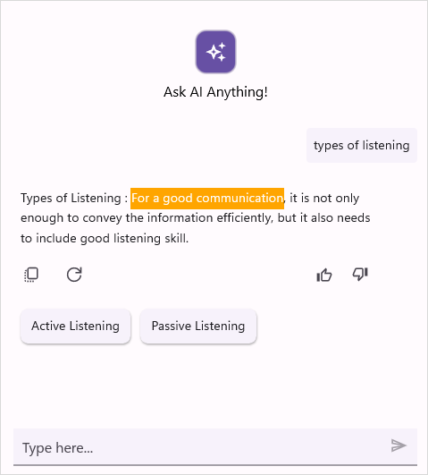

# Styles in .NET MAUI AI AssistView (SfAIAssistView)

You can style the elements of the [SfAIAssistView](https://help.syncfusion.com/cr/maui/Syncfusion.Maui.AIAssistView.html) control by creating resource dictionaries and assigning values to the in-built keys assigned for each individual element.

## AI AssistView background

To set a solid color as the background for [SfAIAssistView](https://help.syncfusion.com/cr/maui/Syncfusion.Maui.AIAssistView.html), assign a color to the `SfAssistView.Background` property. However, if you want the solid color to be applied to the control, also set the background as transparent, as shown in the below code sample.



    
    <?xml version="1.0" encoding="utf-8" ?>
    <ContentPage xmlns="http://schemas.microsoft.com/dotnet/2021/maui"
                 xmlns:x="http://schemas.microsoft.com/winfx/2009/xaml"
                 xmlns:syncfusion="clr-namespace:Syncfusion.Maui.AIAssistView;assembly=Syncfusion.Maui.AIAssistView"
                 xmlns:syncTheme="clr-namespace:Syncfusion.Maui.Themes;assembly=Syncfusion.Maui.Core"
                 xmlns:local="clr-namespace:MauiAIAssistView"             
                 x:Class="MauiAIAssistView.MainPage">

        <ContentPage.BindingContext>
            <local:ViewModel x:Name="viewModel"/>
        </ContentPage.BindingContext>
        
       <ContentPage.Resources>
          <syncTheme:SyncfusionThemeDictionary>
             <syncTheme:SyncfusionThemeDictionary.MergedDictionaries>
                 <ResourceDictionary>
                     <x:String x:Key="SfAIAssistViewTheme">CustomTheme</x:String>
                     <Color x:Key="SfAIAssistViewBackground">transparent</Color>
                 </ResourceDictionary>
             </syncTheme:SyncfusionThemeDictionary.MergedDictionaries>
          </syncTheme:SyncfusionThemeDictionary>
       </ContentPage.Resources>

        <ContentPage.Content>
            <syncfusion:SfAIAssistView x:Name="sfAIAssistView"
                                       AssistItems="{Binding AssistItems}"
                                       Background="#94b6ec" />
         </ContentPage.Content>

      
    </ContentPage>




    public partial class MainPage : ContentPage
    {
        SfAIAssistView sfAIAssistView;
        ViewModel viewModel;      
        public MainPage()
        {
            InitializeComponent();
            this.sfAIAssistView = new SfAIAssistView ();
            this.viewModel = new ViewModel();
            this.sfAIAssistView.AssistItems = viewModel.AssistItems;
            sfAIAssistView .Background = Color.FromHex("#94b6ec");
            this.Content = sfAIAssistView ;
        }
    }




### Set background image

To set an image as the background for the `SfAIAssistView`, set the `SfAIAssistView.Background` to `Colors.Transparent` and place the image below the `SfAIAssistView` control.



    
    <?xml version="1.0" encoding="utf-8" ?>
    <ContentPage xmlns="http://schemas.microsoft.com/dotnet/2021/maui"
                 xmlns:x="http://schemas.microsoft.com/winfx/2009/xaml"
                 xmlns:syncfusion="clr-namespace:Syncfusion.Maui.AIAssistView;assembly=Syncfusion.Maui.AIAssistView"
                 xmlns:syncTheme="clr-namespace:Syncfusion.Maui.Themes;assembly=Syncfusion.Maui.Core"
                 xmlns:local="clr-namespace:MauiAIAssistView"        
                 x:Class="MauiAIAssistView.MainPage">

        <ContentPage.BindingContext>
            <local:ViewModel x:Name="viewModel"/>
        </ContentPage.BindingContext>

        <ContentPage.Resources>
          <syncTheme:SyncfusionThemeDictionary>
             <syncTheme:SyncfusionThemeDictionary.MergedDictionaries>
                <ResourceDictionary>
                    <x:String x:Key="SfAIAssistViewTheme">CustomTheme</x:String>
                    <Color x:Key="SfAIAssistViewBackground">transparent</Color>
                </ResourceDictionary>
            </syncTheme:SyncfusionThemeDictionary.MergedDictionaries>
          </syncTheme:SyncfusionThemeDictionary>
        </ContentPage.Resources>

        <ContentPage.Content>
            <Grid>
                <Image Source="backgroundimage.jpg" Aspect="AspectFill" />
                <syncfusion:SfAIAssistView x:Name="sfAIAssistView"
                                           AssistItems="{Binding AssistItems}"
                                           Background="Transparent" />   
            </Grid>
        </ContentPage.Content>
    </ContentPage>




    public partial class MainPage : ContentPage
    {
        Grid grid = new Grid();
        SfAIAssistView sfAIAssistView;
        Image image = new Image();
        ViewModel viewModel;
        public MainPage()
        {
            this.InitializeComponent();
            image.Source = "backgroundimage.jpg";
            image.Aspect = Aspect.AspectFill;
            grid.Children.Add(image);
            this.sfAIAssistView = new SfAIAssistView();
            this.sfAIAssistView.Background = Colors.Transparent;
            this.viewModel = new ViewModel();
            this.sfAIAssistView.AssistItems = viewModel.AssistItems;
            grid.Children.Add(sfAIAssistView);
            this.Content = grid;
        }
    }




### Set gradient background

To apply a gradient view as a background to the AI AssistView, set the `SfAIAssistView.Background` property to the desired gradient colors.



    
    <?xml version="1.0" encoding="utf-8" ?>
    <ContentPage xmlns="http://schemas.microsoft.com/dotnet/2021/maui"
                 xmlns:x="http://schemas.microsoft.com/winfx/2009/xaml"
                 xmlns:syncfusion="clr-namespace:Syncfusion.Maui.AIAssistView;assembly=Syncfusion.Maui.AIAssistView"
                 xmlns:syncTheme="clr-namespace:Syncfusion.Maui.Themes;assembly=Syncfusion.Maui.Core"
                 xmlns:local="clr-namespace:MauiAIAssistView"        
                 x:Class="MauiAIAssistView.MainPage">

        <ContentPage.BindingContext>
            <local:ViewModel x:Name="viewModel"/>
        </ContentPage.BindingContext>
        
     
        <ContentPage.Resources>
          <syncTheme:SyncfusionThemeDictionary>
             <syncTheme:SyncfusionThemeDictionary.MergedDictionaries>
                <ResourceDictionary>
                    <x:String x:Key="SfAIAssistViewTheme">CustomTheme</x:String>
                    <Color x:Key="SfAIAssistViewBackground">transparent</Color>
                </ResourceDictionary>
            </syncTheme:SyncfusionThemeDictionary.MergedDictionaries>
          </syncTheme:SyncfusionThemeDictionary>
        </ContentPage.Resources>

        <ContentPage.Content>
            <syncfusion:SfAIAssistView x:Name="sfAIAssistView"
                                       AssistItems="{Binding AssistItems}">                                    
                <syncfusion:SfAIAssistView.Background>
                    <LinearGradientBrush>
                        <GradientStop Color="SkyBlue" Offset="0.0" />
                        <GradientStop Color="LightCyan" Offset="0.25" />
                        <GradientStop Color="SteelBlue" Offset="0.5" />
                        <GradientStop Color="LightSkyBlue" Offset="0.75" />
                        <GradientStop Color="LightGray" Offset="1.0" />
                    </LinearGradientBrush>
                </syncfusion:SfAIAssistView.Background>
            </syncfusion:SfAIAssistView>
        </ContentPage.Content>
    </ContentPage>




    public partial class MainPage : ContentPage
    {
        SfAIAssistView sfAIAssistView;
        ViewModel viewModel;
        public MainPage()
        {
            InitializeComponent();
            this.sfAIAssistView = new SfAIAssistView();
            this.viewModel = new ViewModel();
            this.sfAIAssistView.AssistItems = viewModel.AssistItems;
            LinearGradientBrush linearGradientBrush = new LinearGradientBrush();     
            linearGradientBrush.GradientStops.Add(new GradientStop(Colors.SkyBlue, 0.0f));
            linearGradientBrush.GradientStops.Add(new GradientStop(Colors.LightCyan, 0.25f));
            linearGradientBrush.GradientStops.Add(new GradientStop(Colors.SteelBlue, 0.5f));
            linearGradientBrush.GradientStops.Add(new GradientStop(Colors.LightSkyBlue, 0.75f));
            linearGradientBrush.GradientStops.Add(new GradientStop(Colors.LightGray, 1.0f));
            this.AIAssistView.Background = linearGradientBrush;
            this.Content = sfAIAssistView;
        }
    }




## Request item styling

To apply styles to the elements of a request item, set values to the in-built keys of the request item in the resource dictionary.

<table>
<tr>
<th>Key</th>
<th>Description </th>
</tr>
<tr>
<td> SfAIAssistViewRequestItemTextColor </td>
<td> Text color of the request item. </td>
</tr>
<tr>
<td> SfAIAssistViewRequestItemAuthorTextColor </td>
<td> Text color of the author’s name in the request item. </td>
</tr>
<tr>
<td> SfAIAssistViewRequestItemBackground </td>
<td> Background color of the request item. </td>
</tr>
<tr>
<td> SfAIAssistViewRequestItemFontFamily </td>
<td> Font family of the request item. </td>
</tr>
<tr>
<td> SfAIAssistViewRequestItemFontAttributes </td>
<td> Font attributes of the request item. </td>
</tr>
<tr>
<td> SfAIAssistViewRequestItemFontSize </td>
<td> Font size of the request item. </td>
</tr>
<tr>
<td> SfAIAssistViewRequestItemAuthorFontFamily </td>
<td> Font family of the author’s name in request item. </td>
</tr>
<tr>
<td> SfAIAssistViewRequestItemAuthorFontAttributes </td>
<td> Font attributes of the author’s name in request item. </td>
</tr>
<tr>
<td> SfAIAssistViewRequestItemAuthorFontSize </td>
<td> Font size of the author’s name in request item. </td>
</tr>
</table>




    <ContentPage.Resources>
        <syncTheme:SyncfusionThemeDictionary>
            <syncTheme:SyncfusionThemeDictionary.MergedDictionaries>
                <ResourceDictionary>
                    <x:String x:Key="SfAIAssistViewTheme">CustomTheme</x:String>
                    <Color x:Key="SfAIAssistViewRequestItemTextColor">Gray</Color>
                    <Color x:Key="SfAIAssistViewRequestItemAuthorTextColor">Gray</Color>
                    <Color x:Key="SfAIAssistViewRequestItemBackground">#eee479</Color>
                    <x:String x:Key="SfAIAssistViewRequestItemFontFamily">Roboto-Medium</x:String>
                    <FontAttributes x:Key="SfAIAssistViewRequestItemFontAttributes">Italic</FontAttributes>
                    <x:Double x:Key="SfAIAssistViewRequestItemFontSize">16</x:Double>
                    <x:String x:Key="SfAIAssistViewRequestItemAuthorFontFamily">Roboto-Medium</x:String>
                    <FontAttributes x:Key="SfAIAssistViewRequestItemAuthorFontAttributes">Italic</FontAttributes>
                    <x:Double x:Key="SfAIAssistViewRequestItemAuthorFontSize">16</x:Double>
                </ResourceDictionary>
            </syncTheme:SyncfusionThemeDictionary.MergedDictionaries>
        </syncTheme:SyncfusionThemeDictionary>
    </ContentPage.Resources>




    public MainPage()
    {
        InitializeComponent();
        ResourceDictionary dictionary = new ResourceDictionary();
        dictionary.Add("SfAIAssistViewTheme", "CustomTheme");
        dictionary.Add("SfAIAssistViewRequestItemTextColor", Colors.Gray);
        dictionary.Add("SfAIAssistViewRequestItemAuthorTextColor", Colors.Gray);
        dictionary.Add("SfAIAssistViewRequestItemBackground", Color.FromHex("#eee479"));
        dictionary.Add("SfAIAssistViewRequestItemFontFamily", "Roboto-Medium");
        dictionary.Add("SfAIAssistViewRequestItemFontAttributes", FontAttributes.Italic);
        dictionary.Add("SfAIAssistViewRequestItemFontSize", 16);
        dictionary.Add("SfAIAssistViewRequestItemAuthorFontFamily", "Roboto-Medium");
        dictionary.Add("SfAIAssistViewRequestItemAuthorFontAttributes", FontAttributes.Italic);
        dictionary.Add("SfAIAssistViewRequestItemAuthorFontSize", 16);
        this.Resources.Add(dictionary);
    }



 
## Response item styling

To apply styles to the elements of a response item, set values to the in-built keys of the response item in the resource dictionary.

<table>
<tr>
<th> Key </th>
<th> Description </th>
</tr>
<tr>
<td> SfAIAssistViewResponseItemTextColor </td>
<td> Text color of response item. </td>
</tr>
<tr>
<td> SfAIAssistViewResponseItemAuthorTextColor </td>
<td> Text color of the author’s name in response item. </td>
</tr>
<tr>
<td> SfAIAssistViewResponseItemBackground </td>
<td> Background color of the response item. </td>
</tr>
<tr>
<td> SfAIAssistViewResponseItemFontFamily </td>
<td> Font family of the response item. </td>
</tr>
<tr>
<td> SfAIAssistViewResponseItemFontAttributes </td>
<td> Font attributes of the response item. </td>
</tr>
<tr>
<td> SfAIAssistViewResponseItemFontSize </td>
<td> Font size of the response. </td>
</tr>
<tr>
<td> SfAIAssistViewResponseItemAuthorFontFamily </td>
<td> Font family of the author’s name in response item. </td>
</tr>
<tr>
<td> SfAIAssistViewResponseItemAuthorFontAttributes </td>
<td> Font attributes of the author’s name in response item. </td>
</tr>
<tr>
<td> SfAIAssistViewResponseItemAuthorFontSize </td>
<td> Font size of the author’s name in response item </td>
</tr>
</table>



   
    <ContentPage.Resources>
        <syncTheme:SyncfusionThemeDictionary>
            <syncTheme:SyncfusionThemeDictionary.MergedDictionaries>
                <ResourceDictionary>
                    <x:String x:Key="SfAIAssistViewTheme">CustomTheme</x:String>
                    <Color x:Key="SfAIAssistViewResponseItemTextColor">Gray</Color>
                    <Color x:Key="SfAIAssistViewResponseItemBackground">#eee479</Color>
                    <Color x:Key="SfAIAssistViewResponseItemAuthorTextColor">Gray</Color>
                    <x:String x:Key="SfAIAssistViewResponseItemFontFamily">Roboto-Medium</x:String>
                    <FontAttributes x:Key="SfAIAssistViewResponseItemFontAttributes">Italic</FontAttributes>
                    <x:Double x:Key="SfAIAssistViewResponseItemFontSize">16</x:Double>
                    <x:String x:Key="SfAIAssistViewResponseItemAuthorFontFamily">Roboto-Medium</x:String>
                    <FontAttributes x:Key="SfAIAssistViewResponseItemAuthorFontAttributes">Italic</FontAttributes>
                    <x:Double x:Key="SfAIAssistViewResponseItemAuthorFontSize">16</x:Double>
                </ResourceDictionary>
            </syncTheme:SyncfusionThemeDictionary.MergedDictionaries>
        </syncTheme:SyncfusionThemeDictionary>
    </ContentPage.Resources>




    public MainPage()
    {
        InitializeComponent();
        ResourceDictionary dictionary = new ResourceDictionary();
        dictionary.Add("SfAIAssistViewTheme", "CustomTheme");
        dictionary.Add("SfAIAssistViewResponseItemTextColor", Colors.Gray);
        dictionary.Add("SfAIAssistViewResponseItemAuthorTextColor", Colors.Gray);
        dictionary.Add("SfAIAssistViewResponseItemBackground", Color.FromHex("#eee479"));
        dictionary.Add("SfAIAssistViewResponseItemFontFamily", "Roboto-Medium");
        dictionary.Add("SfAIAssistViewResponseItemFontAttributes", FontAttributes.Italic);
        dictionary.Add("SfAIAssistViewResponseItemFontSize", 16);
        dictionary.Add("SfAIAssistViewResponseItemAuthorFontFamily", "Roboto-Medium");
        dictionary.Add("SfAIAssistViewResponseItemAuthorFontAttributes", FontAttributes.Italic);
        dictionary.Add("SfAIAssistViewResponseItemAuthorFontSize", 16);
        this.Resources.Add(dictionary);
    }




## Hyperlink item styling

To apply styles to the elements of a hyperlink item, set values to the in-built keys of the hyperlink item in the resource dictionary.

<table>
<tr>
<th> Key </th>
<th> Description </th>
</tr>
<tr>
<td> SfAIAssistViewRequestHyperlinkColor </td>
<td> Text color of the URL in a hyperlink item. </td>
</tr>
<tr>
<td> SfAIAssistViewResponseHyperlinkColor </td>
<td> Text color of the URL in an outgoing hyperlink item. </td>
</tr>
<tr>
<td> SfAIAssistViewHyperlinkDescriptionTextColor </td>
<td> Text color of the URL's meta description in a hyperlink item. </td>
</tr>
<tr>
<td> SfAIAssistViewHyperlinkDescriptionBackground </td>
<td> Background color of the URL description area in a hyperlink item. </td>
</tr>
<tr>
<td> SfAIAssistViewHyperlinkMetaTitleTextColor </td>
<td> Text color of the URL's meta title in a hyperlink item. </td>
</tr>
</table>




    <ContentPage.Resources>
        <syncTheme:SyncfusionThemeDictionary>
            <syncTheme:SyncfusionThemeDictionary.MergedDictionaries>
                <ResourceDictionary>
                    <Color x:Key="SfAIAssistViewRequestHyperlinkColor">#94b6ec</Color>
                    <Color x:Key="SfAIAssistViewHyperlinkMetaTitleTextColor">#f29d0a</Color>
                    <Color x:Key="SfAIAssistViewHyperlinkDescriptionTextColor">Black</Color>
                    <Color x:Key="SfAIAssistViewHyperlinkDescriptionBackground">#dde9cc</Color>
                </ResourceDictionary>
            </syncTheme:SyncfusionThemeDictionary.MergedDictionaries>
        </syncTheme:SyncfusionThemeDictionary>
    </ContentPage.Resources>




    public MainPage()
    {
        ....
        InitializeComponent();
        ResourceDictionary dictionary = new ResourceDictionary();
        dictionary.Add("SfAIAssistViewTheme", "CustomTheme");
        dictionary.Add("SfAIAssistViewRequestHyperlinkColor", Color.FromHex("#94b6ec"));
        dictionary.Add("SfAIAssistViewHyperlinkMetaTitleTextColor", Color.FromHex("#f29d0a"));
        dictionary.Add("SfAIAssistViewHyperlinkDescriptionTextColor", Colors.Black);
        dictionary.Add("SfAIAssistViewHyperlinkDescriptionBackground", Color.FromHex("#dde9cc"));
        this.Resources.Add(dictionary);
        ....
    }




## Card item styling

To apply styles to the elements of a card item, set values to the in-built keys of the card item in the resource dictionary.

<table>
<tr>
<th> Key </th>
<th> Description </th>
</tr>
<tr>
<td> SfAIAssistViewCardBackground </td>
<td> Background color of the card item. </td>
</tr>
<tr>
<td> SfAIAssistViewCardStroke </td>
<td> Border color of the card item. </td>
</tr>
<tr>
<td> SfAIAssistViewCardTitleTextColor </td>
<td> Title text color of the card item. </td>
</tr>
<tr>
<td> SfAIAssistViewCardTitleFontFamily </td>
<td> Font family of the card title. </td>
</tr>
<tr>
<td> SfAIAssistViewCardTitleFontSize </td>
<td> Font size of the card title. </td>
</tr>
<tr>
<td> SfAIAssistViewCardTitleFontAttributes </td>
<td> Font attributes of the card title. </td>
</tr>
<tr>
<td> SfAIAssistViewCardSubtitleTextColor </td>
<td> Text color of the card subtitle. </td>
</tr>
<tr>
<td> SfAIAssistViewCardSubtitleFontFamily </td>
<td> Font family of the card subtitle. </td>
</tr>
<tr>
<td> SfAIAssistViewCardSubtitleFontSize </td>
<td> Font size of the card subtitle. </td>
</tr>
<tr>
<td> SfAIAssistViewCardSubtitleFontAttributes </td>
<td> Font attributes of the card title. </td>
</tr>
<tr>
<td> SfAIAssistViewCardDescriptionTextColor </td>
<td> Text color of the card description. </td>
</tr>
<tr>
<td> SfAIAssistViewCardDescriptionFontFamily </td>
<td> Font family of the card description. </td>
</tr>
<tr>
<td> SfAIAssistViewCardDescriptionFontSize </td>
<td> Font size of the card description. </td>
</tr>
<tr>
<td> SfAIAssistViewCardDescriptionFontAttributes </td>
<td> Font attributes of the card description. </td>
</tr>
<tr>
<td> SfAIAssistViewCardButtonBackground </td>
<td> Background color of the card button. </td>
</tr>
<tr>
<td> SfAIAssistViewCardButtonStroke </td>
<td> Border color of the card button. </td>
</tr>
<tr>
<td> SfAIAssistViewCardButtonTextColor </td>
<td> Text color of the card button. </td>
</tr>
<tr>
<td> SfAIAssistViewCardButtonFontFamily </td>
<td> Font family of the card button. </td>
</tr>
<tr>
<td> SfAIAssistViewCardButtonFontSize </td>
<td> Font size of the card button. </td>
</tr>
<tr>
<td> SfAIAssistViewCardButtonFontAttributes </td>
<td> Font attributes of the card description. </td>
</tr>
</table>




    <ContentPage.Resources>
        <syncTheme:SyncfusionThemeDictionary>
            <syncTheme:SyncfusionThemeDictionary.MergedDictionaries>
                <ResourceDictionary>
                    <Color x:Key="SfAIAssistViewCardBackground">#94b6ec</Color>
                    <Color x:Key="SfAIAssistViewCardStroke">#f29d0a</Color>
                    <Color x:Key="SfAIAssistViewCardTitleTextColor">Black</Color>
                    <x:String x:Key="SfAIAssistViewCardTitleFontFamily">Roboto-Medium</x:String>
                    <x:Double x:Key="SfAIAssistViewCardTitleFontSize">16</x:Double>
                    <FontAttributes x:Key="SfAIAssistViewCardTitleFontAttributes">Bold</FontAttributes>
                    <Color x:Key="SfAIAssistViewCardSubtitleTextColor">#dde9cc</Color>
                    <x:String x:Key="SfAIAssistViewCardSubtitleFontFamily">Roboto-Medium</x:String>
                    <x:Double x:Key="SfAIAssistViewCardSubtitleFontSize">12</x:Double>
                    <FontAttributes x:Key="SfAIAssistViewCardSubtitleFontAttributes">Italic</FontAttributes>
                    <Color x:Key="SfAIAssistViewCardDescriptionTextColor">#dde9cc</Color>
                    <x:String x:Key="SfAIAssistViewCardDescriptionFontFamily">Roboto-Medium</x:String>
                    <x:Double x:Key="SfAIAssistViewCardDescriptionFontSize">12</x:Double>
                    <FontAttributes x:Key="SfAIAssistViewCardDescriptionFontAttributes">Italic</FontAttributes>
                    <Color x:Key="SfAIAssistViewCardButtonBackground">#94b6ec</Color>
                    <Color x:Key="SfAIAssistViewCardButtonStroke">#f29d0a</Color>
                    <Color x:Key="SfAIAssistViewCardButtonTextColor">Gray</Color>
                    <x:String x:Key="SfAIAssistViewCardButtonFontFamily">Roboto-Medium</x:String>
                    <x:Double x:Key="SfAIAssistViewCardButtonFontSize">16</x:Double>
                    <FontAttributes x:Key="SfAIAssistViewCardButtonFontAttributes">Bold</FontAttributes>
                </ResourceDictionary>
            </syncTheme:SyncfusionThemeDictionary.MergedDictionaries>
        </syncTheme:SyncfusionThemeDictionary>
    </ContentPage.Resources>




    public MainPage()
    {
        ....
        InitializeComponent();
        ResourceDictionary dictionary = new ResourceDictionary();
        dictionary.Add("SfAIAssistViewTheme", "CustomTheme");
        dictionary.Add("SfAIAssistViewCardBackground", Color.FromHex("#94b6ec"));
        dictionary.Add("SfAIAssistViewCardStroke", Color.FromHex("#f29d0a"));
        dictionary.Add("SfAIAssistViewCardTitleTextColor", Colors.Black);
        dictionary.Add("SfAIAssistViewCardTitleFontFamily", "Roboto-Medium");
        dictionary.Add("SfAIAssistViewCardTitleFontSize", 16.0);
        dictionary.Add("SfAIAssistViewCardTitleFontAttributes", FontAttributes.Bold);
        dictionary.Add("SfAIAssistViewCardSubtitleTextColor", Color.FromHex("#dde9cc"));
        dictionary.Add("SfAIAssistViewCardSubtitleFontFamily", "Roboto-Medium");
        dictionary.Add("SfAIAssistViewCardSubtitleFontSize", 12.0);
        dictionary.Add("SfAIAssistViewCardSubtitleFontAttributes", FontAttributes.Italic);
        dictionary.Add("SfAIAssistViewCardDescriptionTextColor", Color.FromHex("#dde9cc"));
        dictionary.Add("SfAIAssistViewCardDescriptionFontFamily", "Roboto-Medium");
        dictionary.Add("SfAIAssistViewCardDescriptionFontSize", 12.0);
        dictionary.Add("SfAIAssistViewCardDescriptionFontAttributes", FontAttributes.Italic);
        dictionary.Add("SfAIAssistViewCardButtonBackground", Color.FromHex("#94b6ec"));
        dictionary.Add("SfAIAssistViewCardButtonStroke", Color.FromHex("#f29d0a"));
        dictionary.Add("SfAIAssistViewCardButtonTextColor", Colors.Gray);
        dictionary.Add("SfAIAssistViewCardButtonFontFamily", "Roboto-Medium");
        dictionary.Add("SfAIAssistViewCardButtonFontSize", 16.0);
        dictionary.Add("SfAIAssistViewCardButtonFontAttributes", FontAttributes.Bold);
        this.Resources.Add(dictionary);
        ....
    }




## Item input view styling

To apply styles to the elements of the input view, set values to the in-built keys of the input view in the resource dictionary.

<table>
<tr>
<th> Key </th>
<th> Description </th>
</tr>
<tr>
<td> SfAIAssistViewInputViewBackground </td>
<td> Item input view background color. </td>
</tr>
</table>




    <ContentPage.Resources>
        <syncTheme:SyncfusionThemeDictionary>
            <syncTheme:SyncfusionThemeDictionary.MergedDictionaries>
                <ResourceDictionary>
                    <x:String x:Key="SfAIAssistViewTheme">CustomTheme</x:String>
                    <Color x:Key="SfAIAssistViewInputViewBackground">#94b6ec</Color>
                </ResourceDictionary>
            </syncTheme:SyncfusionThemeDictionary.MergedDictionaries>
        </syncTheme:SyncfusionThemeDictionary>
    </ContentPage.Resources>




    public MainPage()
    {
        ....
        InitializeComponent();
        ResourceDictionary dictionary = new ResourceDictionary();
        dictionary.Add("SfAIAssistViewTheme", "CustomTheme");
        dictionary.Add("SfAIAssistViewInputViewBackground", Colors.SkyBlue);
        this.Resources.Add(dictionary);
        ....
    }




## Editor styling

To apply styles to the elements of the editor view, set values to the in-built keys of the editor view in the resource dictionary.

<table>
<tr>
<th> Key </th>
<th> Description </th>
</tr>
<tr>
<td> SfAIAssistViewEditorTextColor </td>
<td> Color of the text in the editor. </td>
</tr>
<tr>
<td> SfAIAssistViewEditorPlaceholderTextColor </td>
<td> Color of the placeholder text in the editor. </td>
</tr>
<tr>
<td> SfAIAssistViewEditorStroke </td>
<td> Color of the border in the editor. </td>
</tr>
<tr>
<td> SfAIAssistViewEditorBackground </td>
<td> Background color of the editor. </td>
</tr>
<tr>
<td> SfAIAssistViewEditorFontFamily </td>
<td> Font family of the text in the editor. </td>
</tr>
<tr>
<td> SfAIAssistViewEditorFontAttributes </td>
<td> Font attributes of the text in the editor. </td>
</tr>
<tr>
<td> SfAIAssistViewEditorFontSize </td>
<td> Font size of the text in the editor. </td>
</tr>
</table>




    <ContentPage.Resources>
        <syncTheme:SyncfusionThemeDictionary>
            <syncTheme:SyncfusionThemeDictionary.MergedDictionaries>
                <ResourceDictionary>
                    <x:String x:Key="SfAIAssistViewTheme">CustomTheme</x:String>
                    <Color x:Key="SfAIAssistViewEditorPlaceholderTextColor">Blue</Color>
                    <Color x:Key="SfAIAssistViewEditorTextColor">Black</Color>
                    <Color x:Key="SfAIAssistViewEditorBackground">LightGreen</Color>
                    <Color x:Key="SfAIAssistViewEditorStroke">Black</Color>
                    <x:String x:Key="SfAIAssistViewEditorFontFamily">Roboto-Medium</x:String>
                    <FontAttributes x:Key="SfAIAssistViewEditorFontAttributes">Bold</FontAttributes>
                    <x:Double x:Key="SfAIAssistViewEditorFontSize">16</x:Double>
                </ResourceDictionary>
            </syncTheme:SyncfusionThemeDictionary.MergedDictionaries>
        </syncTheme:SyncfusionThemeDictionary>
    </ContentPage.Resources>




    public MainPage()
    {
        ....
        InitializeComponent();
        ResourceDictionary dictionary = new ResourceDictionary();
        dictionary.Add("SfAIAssistViewTheme", "CustomTheme");
        dictionary.Add("SfAIAssistViewEditorPlaceholderTextColor", Colors.Blue);
        dictionary.Add("SfAIAssistViewEditorBackground", Colors.LightGreen);
        dictionary.Add("SfAIAssistViewEditorTextColor", Colors.Black);
        dictionary.Add("SfAIAssistViewEditorStroke", Colors.Black);
        dictionary.Add("SfAIAssistViewEditorFontFamily", "Roboto-Medium");
        dictionary.Add("SfAIAssistViewEditorFontAttributes", FontAttributes.Italic);
        dictionary.Add("SfAIAssistViewEditorFontSize", 16);
        this.Resources.Add(dictionary);
        ....
    }




## Suggestions styling

To apply styles to the elements of the suggestion view, set values to the in-built keys of the suggestion view in the resource dictionary.

<table>
<tr>
<th> Key </th>
<th> Description </th>
</tr>
<tr>
<td> SfAIAssistViewSuggestionItemTextColor </td>
<td> Text color of an item in the list of suggestions. </td>
</tr>
<tr>
<td> SfAIAssistViewSuggestionItemBackground </td>
<td> Background color of an item in the list of suggestions. </td>
</tr>
<tr>
<td> SfAIAssistViewSuggestionBackground </td>
<td> Background color of the suggestions list view. </td>
</tr>
<tr>
<td> SfAIAssistViewSuggestionItemFontFamily </td>
<td> Font family of an item in the list of suggestions. </td>
</tr>
<tr>
<td> SfAIAssistViewSuggestionItemFontAttributes </td>
<td> Font attributes of an item in the list of suggestions. </td>
</tr>
<tr>
<td> SfAIAssistViewSuggestionItemFontSize </td>
<td> Font size of an item in the list of suggestions. </td>
</tr>
</table>




    <ContentPage.Resources>
        <syncTheme:SyncfusionThemeDictionary>
            <syncTheme:SyncfusionThemeDictionary.MergedDictionaries>
                <ResourceDictionary>
                    <x:String x:Key="SfAIAssistViewTheme">CustomTheme</x:String>
                    <Color x:Key="SfAIAssistViewSuggestionItemTextColor">Blue</Color>
                    <Color x:Key="SfAIAssistViewSuggestionItemBackground">#d9d9d9</Color>
                    <Color x:Key="SfAIAssistViewSuggestionBackground">Violet</Color>
                    <x:String x:Key="SfAIAssistViewSuggestionItemFontFamily">Roboto-Medium</x:String>
                    <FontAttributes x:Key="SfAIAssistViewSuggestionItemFontAttributes">Bold</FontAttributes>
                    <x:Double x:Key="SfAIAssistViewSuggestionItemFontSize">16</x:Double>
                </ResourceDictionary>
            </syncTheme:SyncfusionThemeDictionary.MergedDictionaries>
        </syncTheme:SyncfusionThemeDictionary>
    </ContentPage.Resources>




    public MainPage()
    {
        ....
        InitializeComponent();
        ResourceDictionary dictionary = new ResourceDictionary();
        dictionary.Add("SfAIAssistViewTheme", "CustomTheme");
        dictionary.Add("SfAIAssistViewSuggestionItemTextColor", Colors.Blue);
        dictionary.Add("SfAIAssistViewSuggestionBackground", Colors.Violet);
        dictionary.Add("SfAIAssistViewSuggestionItemBackground", Color.FromHex("#d9d9d9"));
        dictionary.Add("SfAIAssistViewSuggestionItemFontFamily", "Roboto-Medium");
        dictionary.Add("SfAIAssistViewSuggestionItemFontAttributes", FontAttributes.Italic);
        dictionary.Add("SfAIAssistViewSuggestionItemFontSize", 16);
        this.Resources.Add(dictionary);
        ....
    }




## Action view styling

To apply styles to the elements of the action view, set values to the in-built keys of the action view in the resource dictionary.

<table>
<tr>
<th> Key </th>
<th> Description </th>
</tr>
<tr>
<td> SfAIAssistViewNormalActionViewColor </td>
<td>  Background color of the action view. </td>
</tr>
<tr>
<td> SfAIAssistViewHoverActionViewColor </td>
<td> Background color of action view in hover state. </td>
</tr>
<tr>
<td> SfAIAssistViewPressedActionViewColor </td>
<td> Background color when the action view is pressed. </td>
</tr>
<tr>
<td> SfAIAssistViewNormalActionViewIconColor </td>
<td> Icon color of the copy,retry,like, dislike icons. </td>
</tr>
<tr>
<td> SfAIAssistViewSelectedLikeIconColor </td>
<td> Color of the like icon. </td>
</tr>
<tr>
<td> SfAIAssistViewSelectedDisLikeIconColor </td>
<td> Color of the dislike icon. </td>
</tr>
</table>




    <ContentPage.Resources>
        <syncTheme:SyncfusionThemeDictionary>
            <syncTheme:SyncfusionThemeDictionary.MergedDictionaries>
                <ResourceDictionary>
                    <x:String x:Key="SfAIAssistViewTheme">CustomTheme</x:String>
                    <Color x:Key="SfAIAssistViewNormalActionViewColor">Blue</Color>
                    <Color x:Key="SfAIAssistViewHoverActionViewColor">LightGray</Color>
                    <Color x:Key="SfAIAssistViewPressedActionViewColor">DarkGray</Color>
                    <Color x:Key="SfAIAssistViewNormalActionViewIconColor">Black</Color>
                    <Color x:Key="SfAIAssistViewSelectedLikeIconColor">Green</Color>
                    <Color x:Key="SfAIAssistViewSelectedDisLikeIconColor">Red</Color>
                </ResourceDictionary>
            </syncTheme:SyncfusionThemeDictionary.MergedDictionaries>
        </syncTheme:SyncfusionThemeDictionary>
    </ContentPage.Resources>




    public MainPage()
    {
        ....
        InitializeComponent();
        ResourceDictionary dictionary = new ResourceDictionary();
        dictionary.Add("SfAIAssistViewTheme", "CustomTheme");
        dictionary.Add("SfAIAssistViewNormalActionViewColor", Colors.Blue);
        dictionary.Add("SfAIAssistViewHoverActionViewColor", Colors.LightGray);
        dictionary.Add("SfAIAssistViewPressedActionViewColor", Colors.DarkGray);
        dictionary.Add("SfAIAssistViewNormalActionViewIconColor", Colors.Black);
        dictionary.Add("SfAIAssistViewSelectedLikeIconColor", Colors.Green);
        dictionary.Add("SfAIAssistViewSelectedDisLikeIconColor", Colors.Red);
        this.Resources.Add(dictionary);
        ....
    }




## Send button styling

To style the send item button based on its state, set values to the in-built keys of the send button in the resource dictionary.

<table>
<tr>
<th> Key </th>
<th> Description </th>
</tr>
<tr>
<td> SfAIAssistViewDisabledSendButtonIconColor </td>
<td> Color of the send button when it is in Disabled state. </td>
</tr>
<tr>
<td> SfAIAssistViewDisabledSendButtonColor </td>
<td> Disabled background color of the send button. </td>
</tr>
</table>




    <ContentPage.Resources>
        <syncTheme:SyncfusionThemeDictionary>
            <syncTheme:SyncfusionThemeDictionary.MergedDictionaries>
                <ResourceDictionary>
                    <x:String x:Key="SfAIAssistViewTheme">CustomTheme</x:String>
                    <Color x:Key="SfAIAssistViewDisabledSendButtonIconColor">Purple</Color>
                    <Color x:Key="SfAIAssistViewDisabledSendButtonColor">LightGreen</Color>
                </ResourceDictionary>
            </syncTheme:SyncfusionThemeDictionary.MergedDictionaries>
        </syncTheme:SyncfusionThemeDictionary>
    </ContentPage.Resources>




    public MainPage()
    {
        ....
        InitializeComponent();
        ResourceDictionary dictionary = new ResourceDictionary();
        dictionary.Add("SfAIAssistViewTheme", "CustomTheme");
        dictionary.Add("SfAIAssistViewDisabledSendButtonIconColor", Colors.Purple);
        dictionary.Add("SfAIAssistViewDisabledSendButtonColor", Colors.LightGreen);
        this.Resources.Add(dictionary);
        ....
    }




## Stop responding view styling

To style the stop responding view based on its appearance, set values to the in-built keys in the resource dictionary.

<table> 
<tr> 
<th> Key </th>
<th> Description </th> 
</tr>
<tr> 
<td> SfAIAssistViewStopRespondingBackground </td>
<td> Background color of the stop responding view. </td> 
</tr> 
<tr> 
<td> SfAIAssistViewStopRespondingIconColor </td>
<td> Icon color for the stop responding view. </td> 
</tr> 
<tr> 
<td> SfAIAssistViewStopRespondingTextColor </td> 
<td> Text color for the stop responding view. </td> 
</tr> 
<tr> 
<td> SfAIAssistViewStopRespondingFontFamily </td> 
<td> Font family used for the stop responding text. </td> 
</tr> 
<tr> 
<td> SfAIAssistViewStopRespondingFontSize </td> 
<td> Font size of the stop responding text. </td> 
</tr> 
<tr> 
<td> SfAIAssistViewStopRespondingFontAttributes </td> 
<td> Font attributes used for the stop responding text. </td>
</tr>
<tr> 
<td> SfAIAssistViewStopRespondingStroke </td> 
<td> Stroke color for the stop responding view. </td> 
</tr> 
<tr> 
<td> SfAIAssistViewStopRespondingStrokeThickness </td> 
<td> Stroke thickness for the stop responding view. </td> 
</tr> 
</table>




<ContentPage.Resources>
    <syncTheme:SyncfusionThemeDictionary>
        <syncTheme:SyncfusionThemeDictionary.MergedDictionaries>
            <ResourceDictionary>
                <x:String x:Key="SfAIAssistViewTheme">CustomTheme</x:String>
                <Color x:Key="SfAIAssistViewStopRespondingIconColor">Red</Color>
                <Color x:Key="SfAIAssistViewStopRespondingTextColor">DarkBlue</Color>
                <x:String x:Key="SfAIAssistViewStopRespondingFontFamily">Segoe UI</x:String>
                <x:Double x:Key="SfAIAssistViewStopRespondingFontSize">14</x:Double>
                <x:String x:Key="SfAIAssistViewStopRespondingFontAttributes">Italic</x:String>
                <SolidColorBrush x:Key="SfAIAssistViewStopRespondingStroke">Violet</SolidColorBrush>
                <x:Double x:Key="SfAIAssistViewStopRespondingStrokeThickness">2</x:Double>
            </ResourceDictionary>
        </syncTheme:SyncfusionThemeDictionary.MergedDictionaries>
    </syncTheme:SyncfusionThemeDictionary>
</ContentPage.Resources>




public MainPage()
{
    ....
    InitializeComponent();
    ResourceDictionary dictionary = new ResourceDictionary();
    dictionary.Add("SfAIAssistViewTheme", "CustomTheme");
    dictionary.Add("SfAIAssistViewStopRespondingIconColor", Colors.Red);
    dictionary.Add("SfAIAssistViewStopRespondingTextColor", Colors.DarkBlue);
    dictionary.Add("SfAIAssistViewStopRespondingFontFamily", "Segoe UI");
    dictionary.Add("SfAIAssistViewStopRespondingFontSize", 14.0);
    dictionary.Add("SfAIAssistViewStopRespondingFontAttributes", FontAttributes.Italic);
    dictionary.Add("SfAIAssistViewStopRespondingStroke", new SolidColorBrush(Colors.Violet));
    dictionary.Add("SfAIAssistViewStopRespondingStrokeThickness", 2.0);
    this.Resources.Add(dictionary);
    ....
}




## Text selection styling

To modify the highlight color of selected text, you need to update the value associated with the built-in key `SfAIAssistViewSelectionTextHighLightColor` in the resource dictionary.

<table>
<tr>
<th> Key </th>
<th> Description </th>
</tr>
<tr>
<td> SfAIAssistViewSelectionTextHighLightColor </td>
<td> Color to highlight the selected text. </td>
</tr>
</table>




 <ContentPage.Resources>
     <core:SyncfusionThemeDictionary>
         <core:SyncfusionThemeDictionary.MergedDictionaries>
             <ResourceDictionary>
                 <x:String x:Key="SfAIAssistViewTheme">CustomTheme</x:String>
                 <Color x:Key="SfAIAssistViewSelectionTextHighLightColor">Orange</Color>
             </ResourceDictionary>
         </core:SyncfusionThemeDictionary.MergedDictionaries>
     </core:SyncfusionThemeDictionary>
 </ContentPage.Resources>




public MainPage()
{
    ...
    InitializeComponent();
    ResourceDictionary dictionary = new ResourceDictionary();
    dictionary.Add("SfAIAssistViewTheme", "CustomTheme");
    dictionary.Add("SfAIAssistViewSelectionTextHighLightColor", Colors.Orange);
    this.Resources.Add(dictionary);
    ...
}




## Common suggestions styling

To style the common suggestion view based on its appearance, set values to the in-built keys in the resource dictionary.

<table>
<tr>
<th> Key </th>
<th> Description </th>
</tr>
<tr> 
<td> SfAIAssistViewHeaderSuggestionBackground </td>
<td> Background color of the common suggestions view. </td>
</tr>
<tr>
<td> SfAIAssistViewHeaderSuggestionItemStroke </td>
<td> Stroke color for the common suggestion item. </td>
</tr>
<tr>
<td> SfAIAssistViewHeaderSuggestionItemStrokeThickness </td>
<td> Stroke thickness for the common suggestion item. </td>
</tr>
<tr>
<td> SfAIAssistViewHeaderSuggestionItemBackground </td>
<td> Background color of an item in the common suggestions. </td>
</tr>
<tr>
<td> SfAIAssistViewHeaderSuggestionItemTextColor </td>
<td> Text color of an item in the common suggestions. </td>
</tr>
<tr>
<td> SfAIAssistViewHeaderSuggestionItemFontSize </td>
<td> Font size of an item in the common suggestions. </td>
</tr>
<tr>
<td> SfAIAssistViewHeaderSuggestionItemFontFamily </td>
<td> Font family of an item in the common suggestions. </td>
</tr>
<tr>
<td> SfAIAssistViewHeaderSuggestionItemFontAttribute </td>
<td> Font attributes of an item in the common suggestions. </td>
</tr>
</table>




<ContentPage.Resources>
    <syncTheme:SyncfusionThemeDictionary>
        <syncTheme:SyncfusionThemeDictionary.MergedDictionaries>
            <ResourceDictionary>
                <x:String x:Key="SfAIAssistViewTheme">CustomTheme</x:String>
		<Color x:Key="SfAIAssistViewHeaderSuggestionBackground">LightSkyBlue</Color>
		<Color x:Key="SfAIAssistViewHeaderSuggestionItemStroke">BlueViolet</Color>
		<x:Double x:Key="SfAIAssistViewHeaderSuggestionItemStrokeThickness">2</x:Double>
		<Color x:Key="SfAIAssistViewHeaderSuggestionItemBackground">White</Color>
		<Color x:Key="SfAIAssistViewHeaderSuggestionItemTextColor">Blue</Color>
		<x:Double x:Key="SfAIAssistViewHeaderSuggestionItemFontSize">16</x:Double>
		<FontAttributes x:Key="SfAIAssistViewHeaderSuggestionItemFontAttribute">Italic</FontAttributes>
		<x:String x:Key="SfAIAssistViewEditorFontFamily">Roboto-Medium</x:String>
            </ResourceDictionary>
        </syncTheme:SyncfusionThemeDictionary.MergedDictionaries>
    </syncTheme:SyncfusionThemeDictionary>
</ContentPage.Resources>




public MainPage()
{
    ....
    InitializeComponent();
    ResourceDictionary dictionary = new ResourceDictionary();
    dictionary.Add("SfAIAssistViewTheme", "CustomTheme");
    dictionary.Add("SfAIAssistViewHeaderSuggestionBackground", Colors.LightSkyBlue);
    dictionary.Add("SfAIAssistViewHeaderSuggestionItemStroke", Colors.BlueViolet);
    dictionary.Add("SfAIAssistViewHeaderSuggestionItemStrokeThickness", 2.0);
    dictionary.Add("SfAIAssistViewHeaderSuggestionItemTextColor", Colors.Blue);
    dictionary.Add("SfAIAssistViewHeaderSuggestionItemFontSize", 16.0);
    dictionary.Add("SfAIAssistViewHeaderSuggestionItemFontAttribute", FontAttributes.Italic);
    dictionary.Add("SfAIAssistViewEditorFontFamily", "Roboto-Medium");
    dictionary.Add("SfAIAssistViewHeaderSuggestionItemBackground", Colors.White);
    this.Resources.Add(dictionary);
    .... 

}




## Scroll to button button style

To style the scroll to bottom button view based on its appearance, set values to the in-built keys in the resource dictionary.




<ContentPage.Resources>
    <core:SyncfusionThemeDictionary>
        <core:SyncfusionThemeDictionary.MergedDictionaries>
            <ResourceDictionary>
                <x:String x:Key="SfAIAssistViewTheme">CustomTheme</x:String>
                <Color x:Key="SfAIAssistViewScrollToBottomButtonBackground">Orange</Color>
                <Color x:Key="SfAIAssistViewScrollToBottomButtonIconColor">White</Color>
                <Color x:Key="SfAIAssistViewHoveredScrollToBottomButtonBackground">DarkOrange</Color>
                <Color x:Key="SfAIAssistViewPressedScrollToBottomButtonBackground">Red</Color>
            </ResourceDictionary>
        </core:SyncfusionThemeDictionary.MergedDictionaries>
    </core:SyncfusionThemeDictionary>
</ContentPage.Resources>




public MainPage()
{
    InitializeComponent();
    ResourceDictionary dictionary = new ResourceDictionary();
    dictionary.Add("SfAIAssistViewTheme", "CustomTheme");
    dictionary.Add("SfAIAssistViewScrollToBottomButtonBackground", Colors.Orange);
    dictionary.Add("SfAIAssistViewScrollToBottomButtonIconColor", Colors.White);
    dictionary.Add("SfAIAssistViewHoveredScrollToBottomButtonBackground", Colors.DarkOrange);
    dictionary.Add("SfAIAssistViewPressedScrollToBottomButtonBackground", Colors.Red);
    this.Resources.Add(dictionary);
}




## Action button style

To style the action button view based on its appearance, set values to the in-built keys in the resource dictionary.




<ContentPage.Resources>
    <core:SyncfusionThemeDictionary>
        <core:SyncfusionThemeDictionary.MergedDictionaries>
            <ResourceDictionary>
                <x:String x:Key="SfAIAssistViewTheme">CustomTheme</x:String>
                <Color x:Key="SfAIAssistViewActionButtonBackground">Orange</Color>
                <Color x:Key="SfAIAssistViewActionButtonIconColor">White</Color>
                <Color x:Key="SfAIAssistViewActionButtonViewTextColor">Black</Color>
                <Color x:Key="SfAIAssistViewActionButtonsPopupBackground">LightGray</Color>
            </ResourceDictionary>
        </core:SyncfusionThemeDictionary.MergedDictionaries>
    </core:SyncfusionThemeDictionary>
</ContentPage.Resources>




public MainPage()
{
    InitializeComponent();
    ResourceDictionary dictionary = new ResourceDictionary();
    dictionary.Add("SfAIAssistViewTheme", "CustomTheme");
    dictionary.Add("SfAIAssistViewActionButtonBackground", Colors.Orange);
    dictionary.Add("SfAIAssistViewActionButtonIconColor", Colors.White);
    dictionary.Add("SfAIAssistViewActionButtonViewTextColor", Colors.Black);
    dictionary.Add("SfAIAssistViewActionButtonsPopupBackground", Colors.LightGray);
    this.Resources.Add(dictionary);
}


