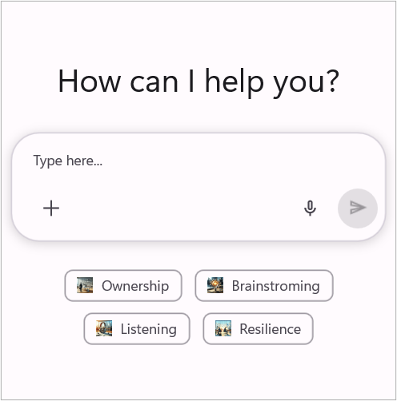
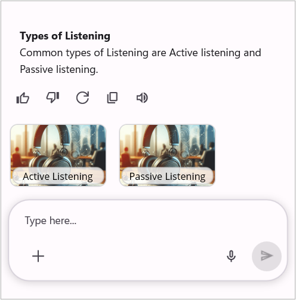

# How to Work with Suggestions in .NET MAUI SfAIAssistView?

The [SfAIAssistView](https://help.syncfusion.com/cr/maui/Syncfusion.Maui.AIAssistView.html) enables the use of suggestions to provide quick responses, enhance user input efficiency, and improve overall interaction within chat interfaces.

To get started quickly with suggestions in .NET MAUI AI AssistView, you can check on this video:



## Common suggestions

The `SfAIAssistView` control provides a collection of common suggestions that users can quickly select. These suggestions offer recommended prompts, tips, and guidance for various tasks.
This feature helps improve user interaction by providing quick access to useful inputs and encouraging efficient usage of the assist view.

### Displaying common suggestions

Common suggestions can be populated by creating a list of [AssistSuggestion](https://help.syncfusion.com/cr/maui/Syncfusion.Maui.AIAssistView.AssistSuggestion.html) objects and assigning it to the [Suggestions](https://help.syncfusion.com/cr/maui/Syncfusion.Maui.AIAssistView.SfAIAssistView.html#Syncfusion_Maui_AIAssistView_SfAIAssistView_Suggestions) API. The suggestions are displayed under the header as part of the header view.

#### Define the view model
Create a simple view model as shown in the following code example, and save it as the `GettingStartedViewModel.cs` file.




    using System.Collections.ObjectModel;
    using System.ComponentModel;
    using System.Runtime.CompilerServices;
    using Syncfusion.Maui.AIAssistView;

    public class GettingStartedViewModel : INotifyPropertyChanged
    {
        private ObservableCollection<ISuggestion> _suggestions;

        public GettingStartedViewModel()
        {
            this._suggestions = new ObservableCollection<ISuggestion>()
            {
                new AssistSuggestion() { Text = "Ownership", ImageSource = "ownership.png" },
                new AssistSuggestion() { Text = "Brainstorming", ImageSource = "brainstorming.png" },
                new AssistSuggestion() { Text = "Listening", ImageSource = "listening.png" },
                new AssistSuggestion() { Text = "Resilience", ImageSource = "resilience.png" },
            };
        }

        public ObservableCollection<ISuggestion> Suggestions
        {
            get { return this._suggestions; }
            set
            {
                this._suggestions = value;
                this.RaisePropertyChanged(nameof(Suggestions));
            }
        }

        /// 

        /// Occurs when a property value changes.
        /// 

        public event PropertyChangedEventHandler PropertyChanged;

        /// 

        /// Raises the <see cref="PropertyChanged"/> event for the specified property.
        /// 

        private void RaisePropertyChanged([CallerMemberName] string propertyName = null)
        {
            this.PropertyChanged?.Invoke(this, new PropertyChangedEventArgs(propertyName));
        }
    }




#### Binding Suggestions to SfAIAssistView

To populate the Suggestions, bind the item collection from its BindingContext to `SfAIAssistView.Suggestions` property. First, set the page's `BindingContext` to an instance of the view model defined in the previous step, then bind the `Suggestions` collection.




    <ContentPage.BindingContext>
        <local:GettingStartedViewModel />
    </ContentPage.BindingContext>

    <syncfusion:SfAIAssistView x:Name="sfAIAssistView"
                               Suggestions="{Binding Suggestions}"
                               ShowHeader="True"/>




    using Syncfusion.Maui.AIAssistView;

    public partial class MainPage : ContentPage
    {
        SfAIAssistView sfAIAssistView;

        public MainPage()
        {
            InitializeComponent();
            this.sfAIAssistView = new SfAIAssistView();
            this.BindingContext = new GettingStartedViewModel();
            this.sfAIAssistView.Suggestions = (this.BindingContext as GettingStartedViewModel).Suggestions;
            this.sfAIAssistView.ShowHeader = true;
            this.Content = this.sfAIAssistView;
        }
    }




N> To view [Suggestions](https://help.syncfusion.com/cr/maui/Syncfusion.Maui.AIAssistView.SfAIAssistView.html#Syncfusion_Maui_AIAssistView_SfAIAssistView_Suggestions), it is mandatory to set [ShowHeader](https://help.syncfusion.com/cr/maui/Syncfusion.Maui.AIAssistView.SfAIAssistView.html#Syncfusion_Maui_AIAssistView_SfAIAssistView_ShowHeader) API to `true`.

### Suggestion customization

The `SfAIAssistView` control allows you to fully customize the appearance of the suggestions by using the [SuggestionTemplate](https://help.syncfusion.com/cr/maui/Syncfusion.Maui.AIAssistView.SfAIAssistView.html#Syncfusion_Maui_AIAssistView_SfAIAssistView_SuggestionTemplate) property. This property lets you define a custom layout and style for the suggestion items.




    <ContentPage.BindingContext>
        <local:GettingStartedViewModel />
    </ContentPage.BindingContext>

    <ContentPage.Resources>
        <ResourceDictionary>
            <DataTemplate x:Key="suggestionTemplate">
                <Border WidthRequest="130"
                        HeightRequest="85"
                        StrokeShape="RoundRectangle 10"
                        BackgroundColor="#E6E8F5"
                        Margin="2">

                    <Grid>
                        <Image Source="{Binding ImageSource}"
                               Aspect="AspectFill" />

                        <Border VerticalOptions="End"
                                BackgroundColor="#CCFFFFFF"
                                StrokeShape="RoundRectangle 10"
                                Margin="2"
                                Padding="2">

                            <Label Text="{Binding Text}"
                                   FontSize="13"
                                   TextColor="Black"
                                   HorizontalOptions="Center"
                                   HorizontalTextAlignment="Center" />
                        </Border>
                    </Grid>
                </Border>
            </DataTemplate>
        </ResourceDictionary>
    </ContentPage.Resources>

    <syncfusion:SfAIAssistView x:Name="sfAIAssistView"
                               Suggestions="{Binding Suggestions}"
                               SuggestionTemplate="{StaticResource suggestionTemplate}"
                               ShowHeader="True"/>




    using Syncfusion.Maui.AIAssistView;

    public partial class MainPage : ContentPage
    {
        private readonly SfAIAssistView sfAIAssistView;

        public MainPage()
        {
            InitializeComponent();
            this.BindingContext = new GettingStartedViewModel();
            this.sfAIAssistView = new SfAIAssistView();
            this.sfAIAssistView.Suggestions = (this.BindingContext as GettingStartedViewModel).Suggestions;
            this.sfAIAssistView.SuggestionTemplate = CreateSuggestionTemplate();
            this.sfAIAssistView.ShowHeader = true;
            this.Content = this.sfAIAssistView;
        }

        private DataTemplate CreateSuggestionTemplate()
        {
            return new DataTemplate(() =>
            {
                ...
            });
        }
    }




## ResponseItem suggestions

The [SfAIAssistView](https://help.syncfusion.com/cr/maui/Syncfusion.Maui.AIAssistView.SfAIAssistView.html) control allows displaying a list of suggestions for users to choose from. These suggestions are supported across all response item types in `SfAIAssistView`.

### Displaying ResponseItem suggestions

Suggestions are displayed by creating an instance of [AssistSuggestion](https://help.syncfusion.com/cr/maui/Syncfusion.Maui.AIAssistView.AssistSuggestion.html) and assigning it to the item's [Suggestion](https://help.syncfusion.com/cr/maui/Syncfusion.Maui.AIAssistView.AssistItem.html#Syncfusion_Maui_AIAssistView_AssistItem_Suggestion) property.




    <ContentPage.BindingContext>
        <local:SuggestionsViewModel />
    </ContentPage.BindingContext>

    <syncfusion:SfAIAssistView x:Name="sfAIAssistView"
                               AssistItems="{Binding AssistItems}"/





    using Syncfusion.Maui.AIAssistView;

    public partial class MainPage : ContentPage
    {
        private readonly SfAIAssistView sfAIAssistView;
        private readonly SuggestionsViewModel viewModel;

        public MainPage()
        {
            InitializeComponent();
            this.viewModel = new SuggestionsViewModel();
            this.BindingContext = this.viewModel;
            this.sfAIAssistView = new SfAIAssistView();
            this.sfAIAssistView.AssistItems = this.viewModel.AssistItems;
            this.Content = this.sfAIAssistView;
        }
    }







    using System.Collections.ObjectModel;
    using System.ComponentModel;
    using System.Runtime.CompilerServices;
    using Syncfusion.Maui.AIAssistView;

    public class SuggestionsViewModel : INotifyPropertyChanged
    {
        private ObservableCollection<ISuggestion> _suggestions;

        public SuggestionsViewModel()
        {
            this.AssistItems = new ObservableCollection<object>();
        }

        /// 

        /// Gets or sets the collection of assist items displayed by the SfAIAssistView.
        /// 

        public ObservableCollection<object> AssistItems
        {
            get;
            set;
        }

        private async Task GetResult(AssistItem requestItem)
        {
            await Task.Delay(1000).ConfigureAwait(true);

            AssistItem responseItem = new AssistItem()
            {
                // response from AI service
                Text = "MAUI stands for .NET Multi-platform App UI. It's a .NET framework for building cross-platform apps with a single C# codebase for iOS, Android, macOS, and Windows. Sure! Here's a link to learn more about .NET MAUI",
            };

            // Generate suggestions.
            var assistSuggestions = new AssistItemSuggestion();

            _suggestions = new ObservableCollection<ISuggestion>();
            _suggestions.Add(new AssistSuggestion() { Text = "Get started with .NET MAUI" });
            _suggestions.Add(new AssistSuggestion() { Text = "Build your first MAUI app" });

            assistSuggestions.Items = _suggestions;

            // Assign suggestions to response item.
            responseItem.Suggestion = assistSuggestions;

            // Add the response item to the collection
            this.AssistItems.Add(responseItem);
        }
    }




#### Adding an image to suggestion items

You can add an image to the suggestion item by setting the [ImageSource](https://help.syncfusion.com/cr/maui/Syncfusion.Maui.AIAssistView.AssistSuggestion.html#Syncfusion_Maui_AIAssistView_AssistSuggestion_ImageSource) property in the [AssistSuggestion](https://help.syncfusion.com/cr/maui/Syncfusion.Maui.AIAssistView.AssistSuggestion.html) object.




    using System.Collections.ObjectModel;
    using Syncfusion.Maui.AIAssistView;

    public class SuggestionsViewModel : INotifyPropertyChanged
    {
	    private ObservableCollection<ISuggestion> _suggestions;

	    private async Task GetResult(AssistItem requestItem)
        {
            await Task.Delay(1000).ConfigureAwait(true);

            AssistItem responseItem = new AssistItem()
            {
                // response from AI service
                Text = "MAUI stands for .NET Multi-platform App UI. It's a .NET framework for building cross-platform apps with a single C# codebase for iOS, Android, macOS, and Windows. Sure! Here's a link to learn more about .NET MAUI",
            };

            // Generate suggestions.
		    var assistSuggestions = new AssistItemSuggestion();

            _suggestions = new ObservableCollection<ISuggestion>();
            _suggestions.Add(new AssistSuggestion() { Text = "Get started with .NET MAUI", ImageSource = "learn_more.png" });
            _suggestions.Add(new AssistSuggestion() { Text = "Build your first MAUI app", ImageSource = "get_started.png" });

            assistSuggestions.Items = _suggestions;

		    // Assign suggestions to response item.
     		responseItem.Suggestion = assistSuggestions;

            // Add the response item to the collection
            this.AssistItems.Add(responseItem);
        }
    }




#### Changing the orientation of suggestions

The [AssistItemSuggestion.Orientation](https://help.syncfusion.com/cr/maui/Syncfusion.Maui.AIAssistView.AssistItemSuggestion.html#Syncfusion_Maui_AIAssistView_AssistItemSuggestion_Orientation) property allows you to display suggestions horizontally or vertically. By default, the orientation is vertical.




    using System.Collections.ObjectModel;
    using Syncfusion.Maui.AIAssistView;

    public class SuggestionsViewModel : INotifyPropertyChanged
    {
        private ObservableCollection<ISuggestion> _suggestions;

        public ObservableCollection<object> AssistItems { get; set; }

        private async Task GetResult(AssistItem requestItem)
        {
            await Task.Delay(1000).ConfigureAwait(true);

            AssistItem responseItem = new AssistItem()
            {
                // response from AI service
                Text = "MAUI stands for .NET Multi-platform App UI. It's a .NET framework for building cross-platform apps with a single C# codebase for iOS, Android, macOS, and Windows. Sure! Here's a link to learn more about .NET MAUI",
            };

            // Generate suggestions.
            var assistSuggestions = new AssistItemSuggestion();

            _suggestions = new ObservableCollection<ISuggestion>();
            _suggestions.Add(new AssistSuggestion() { Text = "Get started with .NET MAUI" });
            _suggestions.Add(new AssistSuggestion() { Text = "Build your first MAUI app" });

            assistSuggestions.Items = _suggestions;

            assistSuggestions.Orientation = SuggestionsOrientation.Horizontal;

            // Assign suggestions to response item.
            responseItem.Suggestion = assistSuggestions;

            // Add the response item to the collection
            this.AssistItems.Add(responseItem);
        }
    }




#### Changing the item spacing of suggestions

The [AssistItemSuggestion.ItemSpacing](https://help.syncfusion.com/cr/maui/Syncfusion.Maui.AIAssistView.AssistItemSuggestion.html#Syncfusion_Maui_AIAssistView_AssistItemSuggestion_ItemSpacing) property allows you to control the spacing between adjacent suggestion items. By default, the spacing is 8 device-independent units.




    using System.Collections.ObjectModel;
    using Syncfusion.Maui.AIAssistView;

    public class SuggestionsViewModel : INotifyPropertyChanged
    {
        private ObservableCollection<ISuggestion> _suggestions;

        public ObservableCollection<object> AssistItems { get; set; }

        private async Task GetResult(AssistItem requestItem)
        {
            await Task.Delay(1000).ConfigureAwait(true);

            AssistItem responseItem = new AssistItem()
            {
                // response from AI service
                Text = "MAUI stands for .NET Multi-platform App UI. It's a .NET framework for building cross-platform apps with a single C# codebase for iOS, Android, macOS, and Windows. Sure! Here's a link to learn more about .NET MAUI",
            };

            // Generate suggestions.
            var assistSuggestions = new AssistItemSuggestion();

            _suggestions = new ObservableCollection<ISuggestion>();
            _suggestions.Add(new AssistSuggestion() { Text = "Get started with .NET MAUI" });
            _suggestions.Add(new AssistSuggestion() { Text = "Build your first MAUI app" });

            assistSuggestions.Items = _suggestions;

            assistSuggestions.ItemSpacing = 10;

            // Assign suggestions to response item.
            responseItem.Suggestion = assistSuggestions;

            // Add the response item to the collection
            this.AssistItems.Add(responseItem);
        }
    }




### Response item suggestion header message

The `SfAIAssistView` control allows you to define the header text for each response suggestion by setting a custom string to the [AssistItem.SuggestionHeaderText](https://help.syncfusion.com/cr/maui/Syncfusion.Maui.AIAssistView.AssistItem.html#Syncfusion_Maui_AIAssistView_AssistItem_SuggestionHeaderText) property. This ensures clear identification and context for each suggestion group displayed to users.




    using System.Collections.ObjectModel;
    using Syncfusion.Maui.AIAssistView;

    public class SuggestionsViewModel : INotifyPropertyChanged
    {
        private ObservableCollection<ISuggestion> _suggestions;

        public ObservableCollection<object> AssistItems { get; set; }

        private async Task GetResult(AssistItem requestItem)
        {
            await Task.Delay(1000).ConfigureAwait(true);

            AssistItem responseItem = new AssistItem()
            {
                Text = "MAUI stands for .NET Multi-platform App UI. It's a .NET framework for building cross-platform apps with a single C# codebase for iOS, Android, macOS, and Windows. Sure! Here's a link to learn more about .NET MAUI",
            };

            var assistSuggestions = new AssistItemSuggestion();

            _suggestions = new ObservableCollection<ISuggestion>();
            _suggestions.Add(new AssistSuggestion() { Text = "Get started with .NET MAUI" });
            _suggestions.Add(new AssistSuggestion() { Text = "Build your first MAUI app" });

            assistSuggestions.Items = _suggestions;

            responseItem.SuggestionHeaderText = "Related Topics";

            // Assign suggestions to response item.
            responseItem.Suggestion = assistSuggestions;
            this.AssistItems.Add(responseItem);
        }
    }




### Response item suggestion customization

The `SfAIAssistView` control allows you to fully customize the appearance of the response suggestion items by using the [ResponseSuggestionTemplate](https://help.syncfusion.com/cr/maui/Syncfusion.Maui.AIAssistView.SfAIAssistView.html#Syncfusion_Maui_AIAssistView_SfAIAssistView_ResponseSuggestionTemplate) property. This property lets you define a custom layout and style for the suggestion item UI.




    <ContentPage.Resources>
        <ResourceDictionary>
            <DataTemplate x:Key="suggestionTemplate">
                ...
            </DataTemplate>
        </ResourceDictionary>
    </ContentPage.Resources>

    <syncfusion:SfAIAssistView x:Name="sfAIAssistView"
                               ResponseSuggestionTemplate="{StaticResource suggestionTemplate}" />





    using Syncfusion.Maui.AIAssistView;

    public partial class MainPage : ContentPage
    {
        private readonly SfAIAssistView sfAIAssistView;

        public MainPage()
        {
            InitializeComponent();
            this.sfAIAssistView = new SfAIAssistView();
            this.sfAIAssistView.ResponseSuggestionTemplate = this.CreateSuggestionTemplate();
            this.Content = this.sfAIAssistView;
        }

        private DataTemplate CreateSuggestionTemplate()
        {
            return new DataTemplate(() =>
            {
                ...
            });
        }
    }




## Footer suggestions

`SfAIAssistView` supports a dedicated set of suggestions that appear above the input area. These footer suggestions are intended to help users compose messages quickly and are configured separately from the header or response suggestions.

- **[FooterSuggestions](https://help.syncfusion.com/cr/maui/Syncfusion.Maui.AIAssistView.SfAIAssistView.html#Syncfusion_Maui_AIAssistView_SfAIAssistView_FooterSuggestions)**: Bind an `IList<ISuggestion>` to this property to populate the footer suggestion list.
- **[FooterSuggestionTemplate](https://help.syncfusion.com/cr/maui/Syncfusion.Maui.AIAssistView.SfAIAssistView.html#Syncfusion_Maui_AIAssistView_SfAIAssistView_FooterSuggestionTemplate)**: Provide a `DataTemplate` to customize each footer suggestion item UI.




    <ContentPage.BindingContext>
        <local:FooterSuggestionsViewModel />
    </ContentPage.BindingContext>

    <ContentPage.Resources>
        <ResourceDictionary>
            <DataTemplate x:Key="footerSuggestionTemplate">
                <Border Padding="8">
                    <Label Text="{Binding Text}" />
                </Border>
            </DataTemplate>
        </ResourceDictionary>
    </ContentPage.Resources>

    <syncfusion:SfAIAssistView x:Name="assist"
                               FooterSuggestions="{Binding FooterSuggestions}"
                               FooterSuggestionTemplate="{StaticResource footerSuggestionTemplate}" />





    using Syncfusion.Maui.AIAssistView;

    public partial class MainPage : ContentPage
    {
        private readonly SfAIAssistView sfAIAssistView;

        public MainPage()
        {
            InitializeComponent();
            this.BindingContext = new FooterSuggestionsViewModel();
            this.sfAIAssistView = new SfAIAssistView();
            this.sfAIAssistView.FooterSuggestions = (this.BindingContext as FooterSuggestionsViewModel).FooterSuggestions;
            this.sfAIAssistView.FooterSuggestionTemplate = new DataTemplate(() =>
            {
                var border = new Border { Padding = 8 };
                var label = new Label();
                label.SetBinding(Label.TextProperty, new Binding("Text"));
                border.Content = label;

                return border;
            });
            this.Content = this.sfAIAssistView;
        }
    }




## Event and Commands

When a user selects a suggestion, both the [SuggestionItemSelected](https://help.syncfusion.com/cr/maui/Syncfusion.Maui.AIAssistView.SfAIAssistView.html#Syncfusion_Maui_AIAssistView_SfAIAssistView_SuggestionItemSelected) event and the [SuggestionItemSelectedCommand](https://help.syncfusion.com/cr/maui/Syncfusion.Maui.AIAssistView.SfAIAssistView.html#Syncfusion_Maui_AIAssistView_SfAIAssistView_SuggestionItemSelectedCommand) are triggered. They provide a [SuggestionItemSelectedEventArgs](https://help.syncfusion.com/cr/maui/Syncfusion.Maui.AIAssistView.SuggestionItemSelectedEventArgs.html) instance that contains the following details about the selected suggestion item.

- [SelectedItem](https://help.syncfusion.com/cr/maui/Syncfusion.Maui.AIAssistView.SuggestionItemSelectedEventArgs.html#Syncfusion_Maui_AIAssistView_SuggestionItemSelectedEventArgs_SelectedItem): The suggestion item chosen by the user.
- [RequestItem](https://help.syncfusion.com/cr/maui/Syncfusion.Maui.AIAssistView.SuggestionItemSelectedEventArgs.html#Syncfusion_Maui_AIAssistView_SuggestionItemSelectedEventArgs_RequestItem): The request item associated with the selected suggestion.
- [CancelRequest](https://help.syncfusion.com/cr/maui/Syncfusion.Maui.AIAssistView.SuggestionItemSelectedEventArgs.html#Syncfusion_Maui_AIAssistView_SuggestionItemSelectedEventArgs_CancelRequest): A boolean that indicates whether the selected suggestion is sent automatically. The default value is `false`.

### Preventing automatic sending of a selected suggestion

By default, a suggestion is sent as a request item immediately when selected. To change this behavior, set [SuggestionItemSelectedEventArgs.CancelRequest](https://help.syncfusion.com/cr/maui/Syncfusion.Maui.AIAssistView.SuggestionItemSelectedEventArgs.html#Syncfusion_Maui_AIAssistView_SuggestionItemSelectedEventArgs_CancelRequest) to `true` in the [SuggestionItemSelected](https://help.syncfusion.com/cr/maui/Syncfusion.Maui.AIAssistView.SfAIAssistView.html#Syncfusion_Maui_AIAssistView_SfAIAssistView_SuggestionItemSelected) event or in the [SuggestionItemSelectedCommand](https://help.syncfusion.com/cr/maui/Syncfusion.Maui.AIAssistView.SfAIAssistView.html#Syncfusion_Maui_AIAssistView_SfAIAssistView_SuggestionItemSelectedCommand).

### Using SuggestionItemSelected event




    using Syncfusion.Maui.AIAssistView;

    public partial class MainPage : ContentPage
    {
         private readonly SfAIAssistView sfAIAssistView;

        public MainPage()
        {
            InitializeComponent();
            this.sfAIAssistView = new SfAIAssistView();
            this.sfAIAssistView.SuggestionItemSelected += this.OnSuggestionItemSelected;
            this.Content = this.sfAIAssistView;
        }

        private void OnSuggestionItemSelected(object sender, SuggestionItemSelectedEventArgs e)
        {
            e.CancelRequest = true;
        }
    }




### Using SuggestionItemSelectedCommand




    <ContentPage.BindingContext>
        <local:SuggestionsViewModel />
    </ContentPage.BindingContext>

    <syncfusion:SfAIAssistView x:Name="sfAIAssistView"
                               SuggestionItemSelectedCommand="{Binding SuggestionItemSelectedCommand}" />







    using System.Windows.Input;
    using Syncfusion.Maui.AIAssistView;

    public class SuggestionsViewModel : INotifyPropertyChanged
    {
        private ICommand _suggestionItemSelectedCommand;

        public SuggestionsViewModel()
        {
            SuggestionItemSelectedCommand = new Command(ExecuteSuggestion);
        }

        /// 

        /// Gets or sets the suggestion item selected command.
        /// 

        public ICommand SuggestionItemSelectedCommand
        {
            get
            {
                return this._suggestionItemSelectedCommand;
            }
            set
            {
                this._suggestionItemSelectedCommand = value;
            }
        }

        /// 

        /// Executes the action when a suggestion item is selected.
        /// 

        public void ExecuteSuggestion(object parameter)
        {
            var args = parameter as SuggestionItemSelectedEventArgs;
            args.CancelRequest = true;
        }
    }



