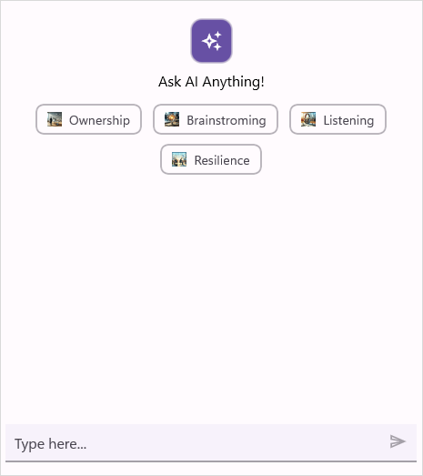

# Working with Suggestions in .NET MAUI AI AssistView (SfAIAssistView)

## Common suggestions

The `SfAIAssistView` control allows users to view a list of common suggestions to choose from. These suggestions offer recommendations, helpful tips, and guides for various tasks and topics.

By providing assistance and encouraging the exploration of new ideas, the common suggestions feature is designed to make interactions more productive and enjoyable.

### Displaying common suggestions

Common Suggestions can be populated by creating list of [AssistSuggestion](https://help.syncfusion.com/cr/maui/Syncfusion.Maui.AIAssistView.AssistSuggestion.html) and assigning it to [Suggestions](https://help.syncfusion.com/cr/maui/Syncfusion.Maui.AIAssistView.SfAIAssistView.html#Syncfusion_Maui_AIAssistView_SfAIAssistView_Suggestions) API. It will be displayed under the header as part of header view.

#### View model
Create a simple view model as shown in the following code example, and save it as `GettingStartedViewModel.cs` file.




using Syncfusion.Maui.AIAssistView;
public class GettingStartedViewModel : INotifyPropertyChanged
{
	private ObservableCollection<ISuggestion> _suggestions;
	public GettingStartedViewModal()
	{
    
		...
		this._suggestions = new ObservableCollection<ISuggestion>()
		{
			new AssistSuggestion() {Text = "Ownership", ImageSource="ownership.png"},
			new AssistSuggestion() {Text = "Brainstroming", ImageSource = "brainstorming.png"},
			new AssistSuggestion() { Text = "Listening", ImageSource="listening.png"},
			new AssistSuggestion() { Text = "Resilience", ImageSource="resilience.png"},
		};
		...
    
	}
	
	public ObservableCollection<ISuggestion> Suggestions
	{
		get { return this._suggestions; }
		set
		{
			this._suggestions = value;
			RaisePropertyChanged("Suggestions");
		}
	}
	...
}




#### Binding suggestions to SfAIAssistView
To populate the Suggestions, bind the item collection from its BindingContext to `SfAIAssistView.Suggestions` property.




<?xml version="1.0" encoding="utf-8" ?>
<ContentPage xmlns="http://schemas.microsoft.com/dotnet/2021/maui"
             xmlns:x="http://schemas.microsoft.com/winfx/2009/xaml"
             xmlns:syncfusion="clr-namespace:Syncfusion.Maui.AIAssistView;assembly=Syncfusion.Maui.AIAssistView"
             xmlns:local="clr-namespace:GettingStarted.ViewModel"            
             x:Class="GettingStarted.MainPage">

    <ContentPage.BindingContext>
        <local:GettingStartedViewModal/>
    </ContentPage.BindingContext>

    <ContentPage.Content>
        <syncfusion:SfAIAssistView x:Name="sfAIAssistView"
                                   AssistItems="{Binding AssistItems}"
                                   Suggestions="{Binding Suggestions}"
                                   ShowHeader="True"/>
    </ContentPage.Content>

</ContentPage>
  

 


public partial class MainPage : ContentPage 
{
    SfAIAssistView sfAIAssistView;
    public MainPage()
    {
        InitializeComponent();
        this.sfAIAssistView = new SfAIAssistView();
        GettingStartedViewModel viewModel = new GettingStartedViewModel();
        this.sfAIAssistView.AssistItems = viewModel.AssistItems;
        this.sfAIAssistView.Suggestions = viewModal.Suggestions;
        this.sfAIAssistView.ShowHeader = true;
        this.Content = sfAIAssistView;
    }
}




N> To view [Suggestions](https://help.syncfusion.com/cr/maui/Syncfusion.Maui.AIAssistView.SfAIAssistView.html#Syncfusion_Maui_AIAssistView_SfAIAssistView_Suggestions), it is mandatory to set [ShowHeader](https://help.syncfusion.com/cr/maui/Syncfusion.Maui.AIAssistView.SfAIAssistView.html#Syncfusion_Maui_AIAssistView_SfAIAssistView_ShowHeader) API to `true`.

### Suggestion customization

The `SfAIAssistView` control allows you to fully customize the suggestions appearance by using the [SuggestionTemplate](https://help.syncfusion.com/cr/maui/Syncfusion.Maui.AIAssistView.SfAIAssistView.html#Syncfusion_Maui_AIAssistView_SfAIAssistView_SuggestionTemplate) property. This property lets you define a custom layout and style for the suggestion items.




<ContentPage.Resources>
    <DataTemplate x:Key="suggestionTemplate">
        <Grid>
            ...
        </Grid>
    </DataTemplate>
</ContentPage.Resources>

<ContentPage.Content>
    <assistView:SfAIAssistView x:Name="sfAIAssistView"
                               AssistItems="{Binding AssistItems}"
                               Suggestions="{Binding Suggestions}"
                               SuggestionTemplate="{StaticResource suggestionTemplate}"
                               ShowHeader="True"/>
</ContentPage.Content>




using Syncfusion.Maui.AIAssistView;

public partial class MainPage : ContentPage
{
    SfAIAssistView sfAIAssistView;
    public MainPage()
    {
        InitializeComponent();
        this.sfAIAssistView = new SfAIAssistView();
        GettingStartedViewModel viewModel = new GettingStartedViewModel();
        this.sfAIAssistView.AssistItems = viewModel.AssistItems;
        this.sfAIAssistView.Suggestions = viewModal.Suggestions;
        this.sfAIAssistView.SuggestionTemplate = CreateSuggestionTemplate();
        this.sfAIAssistView.ShowHeader = true;
        this.Content = sfAIAssistView;
    }

    private DataTemplate CreateSuggestionTemplate()
    {
        return new DataTemplate(() =>
        {
            ...
        });
    }
}




## ResponseItem suggestions

The [SfAIAssistView](https://help.syncfusion.com/cr/maui/Syncfusion.Maui.AIAssistView.SfAIAssistView.html) control enables the display of a list of suggestions for users to select from. Suggestions are supported for all response item types in `SfAIAssistView`.

### Displaying ResponseItem suggestions

Suggestions are displayed by creating an instance of [AssistSuggestion](https://help.syncfusion.com/cr/maui/Syncfusion.Maui.AIAssistView.AssistSuggestion.html) and assigning it to the item's [Suggestion](https://help.syncfusion.com/cr/maui/Syncfusion.Maui.AIAssistView.AssistItem.html#Syncfusion_Maui_AIAssistView_AssistItem_Suggestion) property.




  <?xml version="1.0" encoding="utf-8" ?>
  <ContentPage xmlns="http://schemas.microsoft.com/dotnet/2021/maui"
               xmlns:x="http://schemas.microsoft.com/winfx/2009/xaml"
               xmlns:syncfusion="clr-namespace:Syncfusion.Maui.AIAssistView;assembly=Syncfusion.Maui.AIAssistView"
               x:Class="MauiAIAssistView.MainPage">

      <ContentPage.Content>
             <syncfusion:SfAIAssistView x:Name="sfAIAssistView"
                                        AssistItems="{Binding AssistItems}"/>
	  <ContentPage.Content>	
  </ContentPage>





   namespace MauiAIAssistView
   {
         public partial class MainPage : ContentPage
         {
            public MainPage()
            {
              InitializeComponent();
              SfAIAssistView sfAIAssistView = new SfAIAssistView();
              SuggestionsViewModel viewModel = new SuggestionsViewModel();
              this.sfAIAssistView.AssistItems = viewModel.AssistItems;
              this.Content = sfAIAssistView;
             }
         }
    }  







 public class SuggestionsViewModel : INotifyPropertyChanged
 {
    ...
	
    private ObservableCollection<ISuggestion> suggestions;

    public SuggestionsViewModel()
    {
        this.AssistItems = new ObservableCollection<object>();
    }

    private async Task GetResult(AssistItem requestItem)
    {
        await Task.Delay(1000).ConfigureAwait(true);

        AssistItem responseItem = new AssistItem()
        {
           // response from AI service
           Text = "MAUI stands for .NET Multi-platform App UI. It's a .NET framework for building cross-platform apps with a single C# codebase for iOS, Android, macOS, and Windows. Sure! Here's a link to learn more about .NET MAUI",
        };
		
		// Generate suggestions.
		var assistSuggestions = new AssistItemSuggestion();

        suggestions = new ObservableCollection<ISuggestion>();
        suggestions.Add(new AssistSuggestion() { Text = "Get started with .NET MAUI" });
        suggestions.Add(new AssistSuggestion() { Text = "Build your first MAUI app" });

        assistSuggestions.Items = suggestions;
		
		// Assign suggestions to response item.
		responseItem.Suggestion = assistSuggestions;

        // Add the response item to the collection
        this.AssistItems.Add(responseItem);
    }

    ...
 }




#### Adding an image to suggestion items

You can add an image to the suggestion item by setting the [ImageSource](https://help.syncfusion.com/cr/maui/Syncfusion.Maui.AIAssistView.AssistSuggestion.html#Syncfusion_Maui_AIAssistView_AssistSuggestion_ImageSource) property in the [AssistSuggestion](https://help.syncfusion.com/cr/maui/Syncfusion.Maui.AIAssistView.AssistSuggestion.html) object.




 public class SuggestionsViewModel : INotifyPropertyChanged
 {
    ...
	 
	private async Task GetResult(AssistItem requestItem)
    {
        await Task.Delay(1000).ConfigureAwait(true);

        AssistItem responseItem = new AssistItem()
        {
           // response from AI service
           Text = "MAUI stands for .NET Multi-platform App UI. It's a .NET framework for building cross-platform apps with a single C# codebase for iOS, Android, macOS, and Windows. Sure! Here's a link to learn more about .NET MAUI",
        };
		
		// Generate suggestions.
		var assistSuggestions = new AssistItemSuggestion();

        suggestions = new ObservableCollection<ISuggestion>();
        suggestions.Add(new AssistSuggestion() { Text = "Get started with .NET MAUI", ImageSource = "learn_more.png" });
        suggestions.Add(new AssistSuggestion() { Text = "Build your first MAUI app", ImageSource = "get_started.png" });

        assistSuggestions.Items = suggestions;
		
		// Assign suggestions to response item.
		responseItem.Suggestion = assistSuggestions;

        // Add the response item to the collection
        this.AssistItems.Add(responseItem);
    }

    ...

 }




#### Changing the orientation of suggestions

The [AssistItemSuggestion.Orientation](https://help.syncfusion.com/cr/maui/Syncfusion.Maui.AIAssistView.AssistItemSuggestion.html#Syncfusion_Maui_AIAssistView_AssistItemSuggestion_Orientation) property allows you to display suggestions horizontally or vertically. By, default, the orientation is vertical.




	...
	private async Task GetResult(AssistItem requestItem)
    {
        await Task.Delay(1000).ConfigureAwait(true);

        AssistItem responseItem = new AssistItem()
        {
           // response from AI service
           Text = "MAUI stands for .NET Multi-platform App UI. It's a .NET framework for building cross-platform apps with a single C# codebase for iOS, Android, macOS, and Windows. Sure! Here's a link to learn more about .NET MAUI",
        };
		
		// Generate suggestions.
		var assistSuggestions = new AssistItemSuggestion();

        suggestions = new ObservableCollection<ISuggestion>();
        suggestions.Add(new AssistSuggestion() { Text = "Get started with .NET MAUI" });
        suggestions.Add(new AssistSuggestion() { Text = "Build your first MAUI app" });

        assistSuggestions.Items = suggestions;
		
		assistSuggestions.Orientation = SuggestionsOrientation.Horizontal;
		
		// Assign suggestions to response item.
		responseItem.Suggestion = assistSuggestions;

        // Add the response item to the collection
        this.AssistItems.Add(responseItem);
    }
    ...

 



#### Changing the item spacing of suggestions

The [AssistItemSuggestion.ItemSpacing](https://help.syncfusion.com/cr/maui/Syncfusion.Maui.AIAssistView.AssistItemSuggestion.html#Syncfusion_Maui_AIAssistView_AssistItemSuggestion_ItemSpacing) property allows you to display suggestions with Spacing. By, default, the spacing is 8.




	...
	private async Task GetResult(AssistItem requestItem)
    {
        await Task.Delay(1000).ConfigureAwait(true);

        AssistItem responseItem = new AssistItem()
        {
           // response from AI service
           Text = "MAUI stands for .NET Multi-platform App UI. It's a .NET framework for building cross-platform apps with a single C# codebase for iOS, Android, macOS, and Windows. Sure! Here's a link to learn more about .NET MAUI",
        };
		
		// Generate suggestions.
		var assistSuggestions = new AssistItemSuggestion();

        suggestions = new ObservableCollection<ISuggestion>();
        suggestions.Add(new AssistSuggestion() { Text = "Get started with .NET MAUI" });
        suggestions.Add(new AssistSuggestion() { Text = "Build your first MAUI app" });

        assistSuggestions.Items = suggestions;
		
		assistSuggestions.ItemSpacing = 10;
		
		// Assign suggestions to response item.
		responseItem.Suggestion = assistSuggestions;

        // Add the response item to the collection
        this.AssistItems.Add(responseItem);
    }
    ...
 



### Response item suggestion header

The `SfAIAssistView` control allows you to define the header text for each response suggestion by setting a custom text to the `AssistItem.SuggestionHeaderText` property, ensuring clear identification and context for each suggestion group displayed to users.




	...
	private async Task GetResult(AssistItem requestItem)
    {
        await Task.Delay(1000).ConfigureAwait(true);

        AssistItem responseItem = new AssistItem()
        {
           Text = "MAUI stands for .NET Multi-platform App UI. It's a .NET framework for building cross-platform apps with a single C# codebase for iOS, Android, macOS, and Windows. Sure! Here's a link to learn more about .NET MAUI",
        };
		
		var assistSuggestions = new AssistItemSuggestion();

        suggestions = new ObservableCollection<ISuggestion>();
        suggestions.Add(new AssistSuggestion() { Text = "Get started with .NET MAUI" });
        suggestions.Add(new AssistSuggestion() { Text = "Build your first MAUI app" });

        assistSuggestions.Items = suggestions;
		
		assistSuggestions.SuggestionHeaderText = "Related Topics";
		
		// Assign suggestions to response item.
		responseItem.Suggestion = assistSuggestions;
        this.AssistItems.Add(responseItem);
    }
    ...
 



### Response item suggestion customization
The `SfAIAssistView` control allows you to fully customize the appearance of the response suggestion items using the [ResponseSuggestionTemplate](https://help.syncfusion.com/cr/maui/Syncfusion.Maui.AIAssistView.SfAIAssistView.html#Syncfusion_Maui_AIAssistView_SfAIAssistView_ResponseSuggestionTemplate) property. This property lets you define a custom layout and style for the suggestion item UI.




  <ContentPage.Resources>
    <ResourceDictionary>
        <DataTemplate x:Key="suggestionTemplate">
                ...
        </DataTemplate>
    </ResourceDictionary>
</ContentPage.Resources>
<ContentPage.Content>
      <syncfusion:SfAIAssistView x:Name="sfAIAssistView"
                                 AssistItem = "{Binding AssistItems}"
                                 ResponseSuggestionTemplate="{StaticResource suggestionTemplate}">
      </syncfusion:SfSfAIAssistView>
</ContentPage.Content>





using Syncfusion.Maui.AIAssistView;

public partial class MainPage : ContentPage
{
    SfAIAssistView sfAIAssistView;
    public MainPage()
    {
        InitializeComponent();
        sfAIAssistView = new SfAIAssistView();
        sfAIAssistView.ResponseSuggestionTemplate = this.CreateSuggestionTemplate();
        this.Content = sfAIAssistView;
    }

    private DataTemplate CreateSuggestionTemplate()
    {
        return new DataTemplate(() =>
        {
            ...
        });
    }
}




## Event and Commands

When a user selects a suggestion, the [SuggestionItemSelected](https://help.syncfusion.com/cr/maui/Syncfusion.Maui.AIAssistView.SfAIAssistView.html#Syncfusion_Maui_AIAssistView_SfAIAssistView_SuggestionItemSelected) event and [SuggestionItemSelectedCommand](https://help.syncfusion.com/cr/maui/Syncfusion.Maui.AIAssistView.SfAIAssistView.html#Syncfusion_Maui_AIAssistView_SfAIAssistView_SuggestionItemSelectedCommand) are triggered, providing [SuggestionItemSelectedEventArgs](https://help.syncfusion.com/cr/maui/Syncfusion.Maui.AIAssistView.SuggestionItemSelectedEventArgs.html) as arguments. This arguments contains the following details about the selected suggestion item.

 * [SelectedItem](https://help.syncfusion.com/cr/maui/Syncfusion.Maui.AIAssistView.SuggestionItemSelectedEventArgs.html#Syncfusion_Maui_AIAssistView_SuggestionItemSelectedEventArgs_SelectedItem) : The suggestion item chosen by the user.
 * [RequestItem](https://help.syncfusion.com/cr/maui/Syncfusion.Maui.AIAssistView.SuggestionItemSelectedEventArgs.html#Syncfusion_Maui_AIAssistView_SuggestionItemSelectedEventArgs_RequestItem) : The request item associated with the selected suggestion.
 * [CancelRequest](https://help.syncfusion.com/cr/maui/Syncfusion.Maui.AIAssistView.SuggestionItemSelectedEventArgs.html#Syncfusion_Maui_AIAssistView_SuggestionItemSelectedEventArgs_CancelRequest) : A boolean indicating whether the selected suggestion is automatically sent. The default value is false.

### Preventing automatic sending of selected suggestion

By default, a suggestion is automatically sent as a request item immediately when selected. To change this behavior, set [SuggestionItemSelectedEventArgs.CancelRequest](https://help.syncfusion.com/cr/maui/Syncfusion.Maui.AIAssistView.SuggestionItemSelectedEventArgs.html#Syncfusion_Maui_AIAssistView_SuggestionItemSelectedEventArgs_CancelRequest) to `true` in the [SuggestionItemSelected](https://help.syncfusion.com/cr/maui/Syncfusion.Maui.AIAssistView.SfAIAssistView.html#Syncfusion_Maui_AIAssistView_SfAIAssistView_SuggestionItemSelected) event or [SuggestionItemSelectedCommand](https://help.syncfusion.com/cr/maui/Syncfusion.Maui.AIAssistView.SfAIAssistView.html#Syncfusion_Maui_AIAssistView_SfAIAssistView_SuggestionItemSelectedCommand).

### Using SuggestionItemSelected event




    sfAIAssistView.SuggestionItemSelected += OnSuggestionItemSelected;
	
    private void OnSuggestionItemSelected(object sender, SuggestionItemSelectedEventArgs e)
    {
        e.CancelRequest = true;
    }




### Using SuggestionItemSelectedCommand




 <?xml version="1.0" encoding="utf-8" ?>
 <ContentPage xmlns="http://schemas.microsoft.com/dotnet/2021/maui"
              xmlns:x="http://schemas.microsoft.com/winfx/2009/xaml"
              xmlns:syncfusion="clr-namespace:Syncfusion.Maui.AIAssistView;assembly=Syncfusion.Maui.AIAssistView"
              xmlns:local="clr-namespace:MauiAIAssistView"             
              x:Class="MauiAIAssistView.MainPage">

        <ContentPage.Content>
            <syncfusion:SfAIAssistView x:Name="sfAIAssistView" 
                                       AssistItems="{Binding AssistItems}"
                                       SuggestionItemSelectedCommand="{Binding SuggestionItemSelectedCommand}" />
        </ContentPage.Content>
 </ContentPage>







    public class SuggestionsViewModel : INotifyPropertyChanged
    {
        private ICommand suggestionItemSelectedCommand;

        public SuggestionsViewModel()
        {
            SuggestionItemSelectedCommand = new Command(ExecuteSuggestion);
        }

        /// 

        /// Gets or sets the suggestion item selected command.
        /// 

        public ICommand SuggestionItemSelectedCommand
        {
            get
            {
                return this.suggestionItemSelectedCommand;
            }  
            set
            {
                this.suggestionItemSelectedCommand = value;
            }
        }

        /// 

        /// Executes the action when a suggestion item is selected.
        /// 

        public void ExecuteSuggestion(object parameter)
        {
           var args = parameter as SuggestionItemSelectedEventArgs;
           args.CancelRequest = true;
        }
    }



