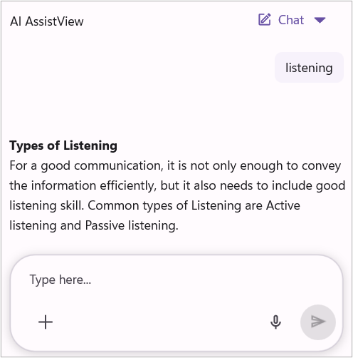
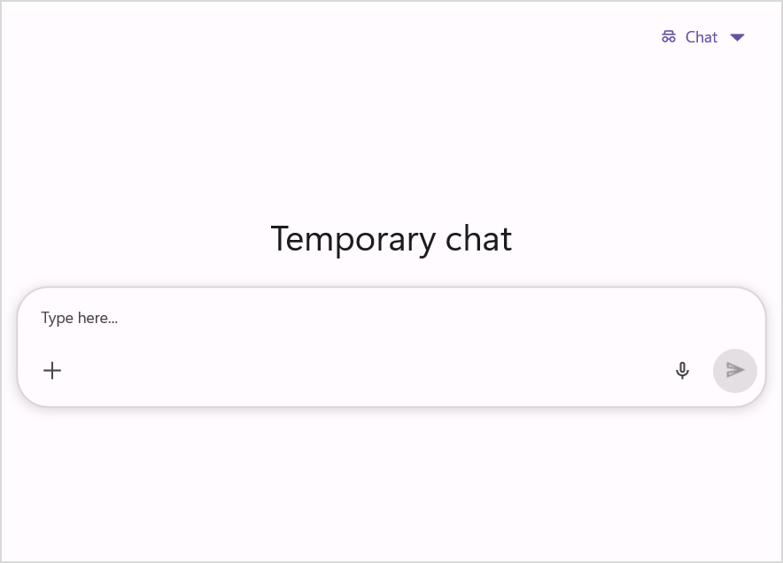

# How to Customize Toolbar in .NET MAUI SfAIAssistView?

The [SfAIAssistView](https://help.syncfusion.com/cr/maui/Syncfusion.Maui.AIAssistView.html) control allows you to define and customize the toolbar to tailor actions and improve user interaction within the chat interface.

## AssistView Toolbar

`SfAIAssistView` exposes a header toolbar that can be enabled and customized for conversation-level actions and titles. The toolbar will not be visible when the [ShowToolbar](https://help.syncfusion.com/cr/maui/Syncfusion.Maui.AIAssistView.SfAIAssistView.html#Syncfusion_Maui_AIAssistView_SfAIAssistView_ShowToolbar) is set to `false`.

- **[ShowToolbar](https://help.syncfusion.com/cr/maui/Syncfusion.Maui.AIAssistView.SfAIAssistView.html#Syncfusion_Maui_AIAssistView_SfAIAssistView_ShowToolbar)**: Set to `false` to hide the toolbar. The default value is `true`.
- **[ToolbarTitle](https://help.syncfusion.com/cr/maui/Syncfusion.Maui.AIAssistView.SfAIAssistView.html#Syncfusion_Maui_AIAssistView_SfAIAssistView_ToolbarTitle)**: A simple string title you can bind or set to display in the toolbar.
- **[ToolbarHeight](https://help.syncfusion.com/cr/maui/Syncfusion.Maui.AIAssistView.SfAIAssistView.html#Syncfusion_Maui_AIAssistView_SfAIAssistView_ToolbarHeight)**: Set a custom height for the toolbar area.




    <syncfusion:SfAIAssistView 
                ShowToolbar="True" 
                ToolbarTitle="AI AssistView" 
                ToolbarHeight="50">
    </syncfusion:SfAIAssistView>




    SfAIAssistView sfAIAssistView = new SfAIAssistView();
    sfAIAssistView.ToolbarTitle = "AI AssistView";
    sfAIAssistView.ShowToolbar = true;
    sfAIAssistView.ToolbarHeight = 50;




## Chat Modes

### New chat button

The toolbar now includes a chat option that provides both New Chat. When clicked, it opens a new chat window where the user can start an entirely new session, while the previous session is preserved in the conversation history.

### Temporary Chat

The `SfAIAssistView` supports a Temporary Chat mode that provides an ephemeral conversation surface for quick, non-persistent interactions. When temporary mode is Clicked, the control clears the active `AssistItems` collection and displays a banner above the chat to indicate the temporary state. The control preserves your original `EmptyViewTemplate` and restores it when temporary mode ends.

- **[EnableTemporaryChat](https://help.syncfusion.com/cr/maui/Syncfusion.Maui.AIAssistView.SfAIAssistView.html#Syncfusion_Maui_AIAssistView_SfAIAssistView_EnableTemporaryChat)**: Set to `false` to disable Temporary Chat mode.

- **[TemporaryChatBannerTemplate](https://help.syncfusion.com/cr/maui/Syncfusion.Maui.AIAssistView.SfAIAssistView.html#Syncfusion_Maui_AIAssistView_SfAIAssistView_TemporaryChatBannerTemplate)**: Provide a `DataTemplate` to replace the default temporary-mode banner with a custom view.
- **[TemporaryChatBannerText](https://help.syncfusion.com/cr/maui/Syncfusion.Maui.AIAssistView.SfAIAssistView.html#Syncfusion_Maui_AIAssistView_SfAIAssistView_TemporaryChatBannerText)**: The default banner text when no custom banner template is provided.

N> Enabling `EnableTemporaryChat` includes the temporary chat in the toolbar's new chat Button. Clicking the temporary chat routes new requests to a fresh `AssistItems` collection and displays a temporary banner.



<syncfusion:SfAIAssistView x:Name="assist"
                               EnableTemporaryChat="True"
                               TemporaryChatBannerText="This chat will not be saved" />




    SfAIAssistView sfAIAssistView = new SfAIAssistView();
    sfAIAssistView.EnableTemporaryChat = true;
    sfAIAssistView.TemporaryChatBannerText="This chat will not be saved";




### Events for chat mode

`SfAIAssistView` raises two events when the user changes the chat mode via the toolbar: [ChatModeChanging](https://help.syncfusion.com/cr/maui/Syncfusion.Maui.AIAssistView.SfAIAssistView.html#Syncfusion_Maui_AIAssistView_SfAIAssistView_ChatModeChanging) (raised before the change) and [ChatModeChanged](https://help.syncfusion.com/cr/maui/Syncfusion.Maui.AIAssistView.SfAIAssistView.html#Syncfusion_Maui_AIAssistView_SfAIAssistView_ChatModeChanged) (raised after the change).

- **`ChatModeChanging`**: provides a [ChatModeChangingEventArgs](https://help.syncfusion.com/cr/maui/Syncfusion.Maui.AIAssistView.ChatModeChangingEventArgs.html)  with the [ChatMode](https://help.syncfusion.com/cr/maui/Syncfusion.Maui.AIAssistView.ChatModeChangingEventArgs.html#Syncfusion_Maui_AIAssistView_ChatModeChangingEventArgs_ChatMode) that the control is about to transition to. Handlers can cancel the change by setting `e.Cancel = true`.
- **`ChatModeChanged`**: provides a [ChatModeChangedEventArgs](https://help.syncfusion.com/cr/maui/Syncfusion.Maui.AIAssistView.ChatModeChangedEventArgs.html) with the [ChatMode](https://help.syncfusion.com/cr/maui/Syncfusion.Maui.AIAssistView.ChatModeChangedEventArgs.html#Syncfusion_Maui_AIAssistView_ChatModeChangedEventArgs_ChatMode) that the control has transitioned to.


    private void OnChatModeChanging(object sender,  ChatModeChangingEventArgs e)
    {
        if (e.ChatMode == ChatMode.TemporaryChat)
        {
            e.Cancel = true; 
        }
    }

    private void OnChatModeChanged(object sender, ChatModeChangedEventArgs e)
    {
        if (e.ChatMode == ChatMode.TemporaryChat)
        {
            // Temporary chat is active: maybe show custom banner or reset local state
        }
        else
        {
            // New chat mode active: restore saved templates/state if needed
        }
    }
