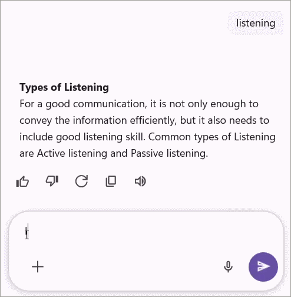
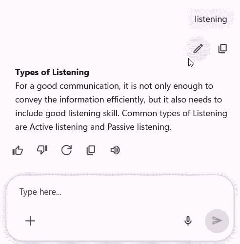
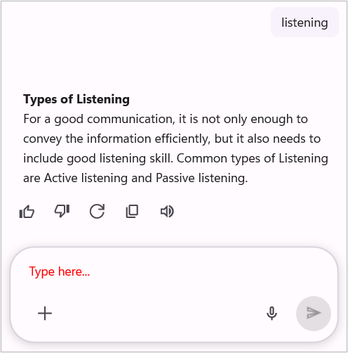
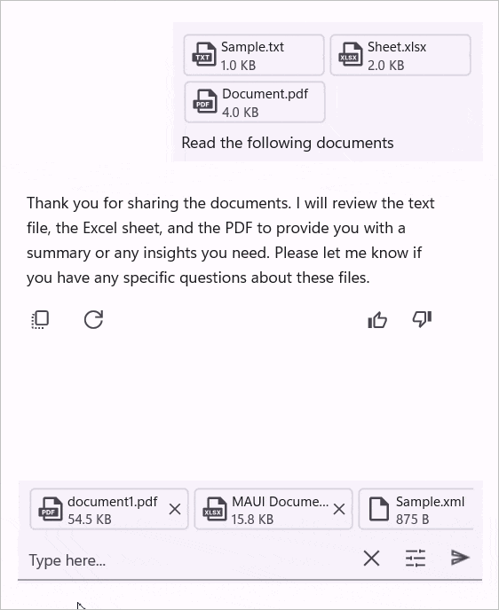
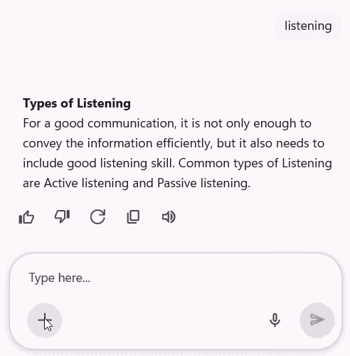
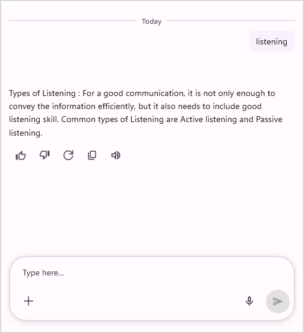
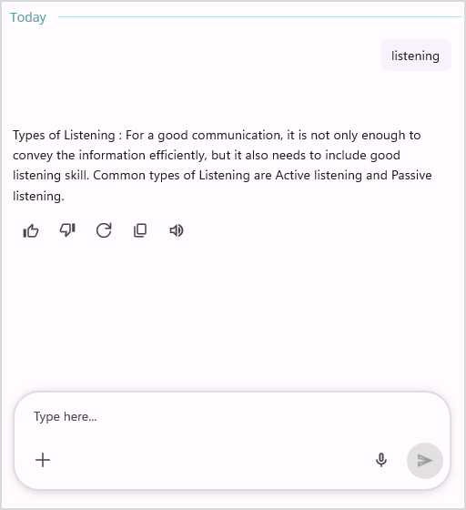
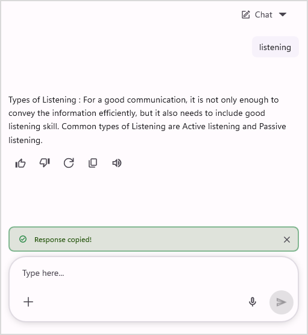
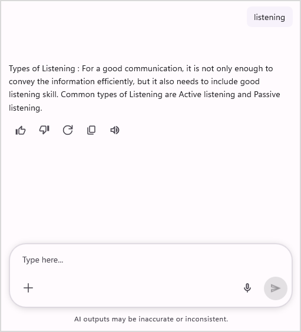
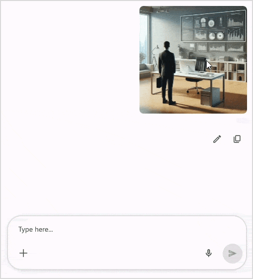

# Working with AI AssistView in .NET MAUI AI AssistView (SfAIAssistView)

## Stop responding

The [SfAIAssistView](https://help.syncfusion.com/cr/maui/Syncfusion.Maui.AIAssistView.SfAIAssistView.html) control provides `Stop Responding` feature that allows you to cancel an ongoing AI response by clicking the Stop Responding view. This feature ensures that users can stop if a response is no longer needed.
By default, the Stop Responding button is displayed, to disable this set the [EnableStopResponding](https://help.syncfusion.com/cr/maui/Syncfusion.Maui.AIAssistView.SfAIAssistView.html#Syncfusion_Maui_AIAssistView_SfAIAssistView_EnableStopResponding) property to `false`.




<syncfusion:SfAIAssistView x:Name="sfAIAssistView"
                           EnableStopResponding="False"/>  

 


SfAIAssistView sfAIAssistView; 
public MainPage() 
{ 
    InitializeComponent(); 
    this.sfAIAssistView = new SfAIAssistView();
    this.sfAIAssistView.EnableStopResponding = false;
    this.Content = sfAIAssistView;
} 




### Event and Command

The `SfAIAssistView` control includes a built-in event called [StopResponding](https://help.syncfusion.com/cr/maui/Syncfusion.Maui.AIAssistView.SfAIAssistView.html#Syncfusion_Maui_AIAssistView_SfAIAssistView_StopResponding) and a command named [StopRespondingCommand](https://help.syncfusion.com/cr/maui/Syncfusion.Maui.AIAssistView.SfAIAssistView.html#Syncfusion_Maui_AIAssistView_SfAIAssistView_StopRespondingCommand). These are triggered when the `Stop Responding` button is clicked.
To cancel the response using the `StopRespondingCommand` or `StopResponding` event, you can include logic to stop the ongoing response as shown below. 

#### StopResponding Event




<syncfusion:SfAIAssistView x:Name="sfAIAssistView"
                           StopResponding="OnStopResponding" />




sfAIAssistView.StopResponding += OnStopResponding;

private void OnStopResponding(object sender, EventArgs e)
{
   // Handle the Stop Responding action
}




#### StopResponding Command




<syncfusion:SfAIAssistView x:Name="sfAIAssistView"  
                           StopRespondingCommand="{Binding StopRespondingCommand}" />




public class ViewModel : INotifyPropertyChanged
{
    public ICommand StopRespondingCommand { get; set; }

    public ViewModel()
    {
      AssistViewRequestCommand = new Command(ExecuteRequestCommand);
      StopRespondingCommand = new Command(ExecuteStopResponding);
    }

    private void ExecuteStopResponding()
    {
        // logic to handle the Stop Responding action
        this.CancelResponse = true;
        AssistItem responseItem = new AssistItem() { Text = "You canceled the response" };
        responseItem.ShowAssistItemFooter = false;
        this.AssistItems.Add(responseItem);
    } 
        
    private void ExecuteRequestCommand()
    {
        this.GetResult();
    }

    private void GetResult()
    {
        if (!CancelResponse)
        {
            // generating the response if it has not been canceled.
        }  
    }      
}




N> [View sample in GitHub](https://github.com/SyncfusionExamples/getting-started-with-.net-maui-aiassistview)

### StopResponding UI customization

The `SfAIAssistView` control allows you to fully customize the Stop Responding view appearance by using the [StopRespondingTemplate](https://help.syncfusion.com/cr/maui/Syncfusion.Maui.AIAssistView.SfAIAssistView.html#Syncfusion_Maui_AIAssistView_SfAIAssistView_StopRespondingTemplate) property. This property lets you define a custom layout and style for the StopResponding UI.




<ContentPage.Resources>
    <ResourceDictionary>
        <DataTemplate x:Key="stopRespondingTemplate">
            <Grid>
                ...
            </Grid>
        </DataTemplate>
    </ResourceDictionary>
</ContentPage.Resources>
<ContentPage.Content>
      <syncfusion:SfAIAssistView x:Name="sfAIAssistView"
                                 StopRespondingTemplate="{StaticResource stopRespondingTemplate}">
      </syncfusion:SfSfAIAssistView>
</ContentPage.Content>




using Syncfusion.Maui.AIAssistView;

public partial class MainPage : ContentPage
{
    SfAIAssistView sfAIAssistView;
    public MainPage()
    {
        InitializeComponent();
        sfAIAssistView = new SfAIAssistView();
        sfAIAssistView.StopRespondingTemplate = CreateStopRespondingViewTemplate();
        this.Content = sfAIAssistView;
    }

    private DataTemplate CreateStopRespondingViewTemplate()
    {
        return new DataTemplate(() =>
        {
            ...
        });
    }
}




## Control template

The `ControlTemplate` in AI AssistView allows you to define and reuse the visual structure of a control. This flexible structure enables to fully customize the appearance and behavior of the AI AssistView. By using `ControlTemplate` with the AI AssistView, you can create a highly customized and interactive interface, as demonstrated below.




<ContentPage.Content>
    ...      
    <local:CustomAssistView x:Name="sfAIAssistView"
                            AssistItems="{Binding AssistMessages}">
        <local:CustomAssistView.ControlTemplate>
                <ControlTemplate>
                    <ContentView>
                        <ContentView.Content>
                            <Grid>
                                <ContentView IsVisible="{Binding IsActiveChatView}" Content="{TemplateBinding AssistChatView}" BindingContext="{TemplateBinding BindingContext}" />
                                <local:ComposeView  IsVisible="{Binding IsActiveComposeView}" BindingContext="{TemplateBinding BindingContext}"/>
                             </Grid>
                        </ContentView.Content>
                    </ContentView>
                </ControlTemplate>
        </local:CustomAssistView.ControlTemplate>
    </local:CustomAssistView>
            ...
</ContentPage.Content>




### Custom chat view

The [CreateAssistChat](https://help.syncfusion.com/cr/maui/Syncfusion.Maui.AIAssistView.SfAIAssistView.html#Syncfusion_Maui_AIAssistView_SfAIAssistView_CreateAssistChat) method allows for the customization of the chat view functionality within the AI AssistView control. By overriding this method, can create their own custom implementation of the chat view, allowing for greater control over the appearance and behavior of chat interactions. It provides the flexibility to modify how chat messages are displayed, how user interactions are handled. Here’s how to override the `CreateAssistChat` method to return a custom instance of [AssistViewChat](https://help.syncfusion.com/cr/maui/Syncfusion.Maui.AIAssistView.AssistViewChat.html).

 


public class CustomAIAssiststView : SfAIAssistView
{
    public CustomAIAssiststView() { }

    protected override AssistViewChat CreateAssistChat()
    {
        // Returning custom implementation of AssistViewChat
        return new CustomAssistViewChat(this);
    }
}

 


The `CustomAssistViewChat `class inherits from `AssistViewChat` and can be used to further customize the chat view, here  the input view is removed by setting `ShowMessageInputView` to `false` as shown below.




public class CustomAssistViewChat : AssistViewChat
{
    public CustomAssistViewChat(SfAIAssistView assistView) : base(assistView)
    {
        //Customize the AssistViewChat
        this.ShowMessageInputView = false;   
    }
}

 


N> [View sample in GitHub](https://github.com/SyncfusionExamples/custom-control-template-in-.net-maui-aiassistview)

## Edit option for request item

The `SfAIAssistView` allows you to edit a previously sent request. This feature lets users review and refine the prompt and resubmit from the editor to get more accurate responses. Each request shows an Edit icon; when tapped, the request text is placed in the editor (InputView) to redefine.

N> **Interaction**: On desktop (Windows, macOS), hover over a request to reveal the Edit icon. On mobile (Android, iOS), tap the request to show the Edit option.

## Editor
### EditorView template

The `SfAIAssistView` control allows you to fully customize the editor's appearance by using the [EditorViewTemplate](https://help.syncfusion.com/cr/maui/Syncfusion.Maui.AIAssistView.SfAIAssistView.html#Syncfusion_Maui_AIAssistView_SfAIAssistView_EditorViewTemplate) property. This property lets you define a custom layout and style for the editor.




<ContentPage.Resources>
    <ResourceDictionary>
        <DataTemplate x:Key="editorViewTemplate">
            <Grid>
                <Editor x:Name="editor" Placeholder="Type Message...">
                     ...
            </Grid>
        </DataTemplate>
    </ResourceDictionary>
</ContentPage.Resources>
<ContentPage.Content>
      <syncfusion:SfAIAssistView x:Name="sfAIAssistView"
                                 EditorViewTemplate="{StaticResource editorViewTemplate}">
      </syncfusion:SfSfAIAssistView>
</ContentPage.Content>




using Syncfusion.Maui.AIAssistView;

public partial class MainPage : ContentPage
{
    SfAIAssistView sfAIAssistView;
    public MainPage()
    {
            InitializeComponent();
            sfAIAssistView = new SfAIAssistView();
            sfAIAssistView.EditorViewTemplate = CreateEditorViewTemplate();
            this.Content = sfAIAssistView;
    }

    private DataTemplate CreateEditorViewTemplate()
    {
        return new DataTemplate(() =>
        {
            var grid = new Grid { };

            var editor = new Editor
            {
                Placeholder = "Type Message...",
            };

                .......

            grid.Children.Add(editor);

            return grid;
        });
    }
}




### Editor customization
The `SfAIAssistView` allows users to customize the editor’s visual surface by accessing the [RequestEditor](https://help.syncfusion.com/cr/maui/Syncfusion.Maui.AIAssistView.SfAIAssistView.html#Syncfusion_Maui_AIAssistView_SfAIAssistView_RequestEditor) only in the code behind C#.




using Syncfusion.Maui.AIAssistView;

public partial class MainPage : ContentPage
{
    public MainPage()
    {
            InitializeComponent();
            sfAIAssistView = new SfAIAssistView();
            sfAIAssistView.RequestEditor.PlaceholderColor = Colors.Red;
    }
}




### Accessing the editor in AssistView
The `SfAIAssistView` allows you to access the editor by using [RequestEditorView](https://help.syncfusion.com/cr/maui/Syncfusion.Maui.AIAssistView.RequestEditorView.html), which helps you to customize the editor’s visual elements and overall appearance wherever it is used.

## Attachment Preview in EditorView

The `SfAIAssistView` allows you to add files and images as attachments in the editor using [Attachments](https://help.syncfusion.com/cr/maui/Syncfusion.Maui.AIAssistView.SfAIAssistView.html#Syncfusion_Maui_AIAssistView_SfAIAssistView_Attachments) property. This feature lets you show the preview for attachments added in the editor. `Attachments` are added as [AssistAttachment](https://help.syncfusion.com/cr/maui/Syncfusion.Maui.AIAssistView.AssistAttachment.html) which has the following members:

* [FileName](https://help.syncfusion.com/cr/maui/Syncfusion.Maui.AIAssistView.AssistAttachment.html#Syncfusion_Maui_AIAssistView_AssistAttachment_FileName) : Displays the name of the file.
* [FileSize](https://help.syncfusion.com/cr/maui/Syncfusion.Maui.AIAssistView.AssistAttachment.html#Syncfusion_Maui_AIAssistView_AssistAttachment_FileSize) : Displays the size of the file.
* [FilePath](https://help.syncfusion.com/cr/maui/Syncfusion.Maui.AIAssistView.AssistAttachment.html#Syncfusion_Maui_AIAssistView_AssistAttachment_FilePath) : Displays the local path of the file.
* [FileExtension](https://help.syncfusion.com/cr/maui/Syncfusion.Maui.AIAssistView.AssistAttachment.html#Syncfusion_Maui_AIAssistView_AssistAttachment_FileExtension) : Displays the type of the file using the extension.
* [FileContent](https://help.syncfusion.com/cr/maui/Syncfusion.Maui.AIAssistView.AssistAttachment.html#Syncfusion_Maui_AIAssistView_AssistAttachment_FileContent) : Displays the content of the file.
* [FilePreviewIcon](https://help.syncfusion.com/cr/maui/Syncfusion.Maui.AIAssistView.AssistAttachment.html#Syncfusion_Maui_AIAssistView_AssistAttachment_FilePreviewIcon) : Displays the preview icon for the file.




<ContentPage.Content>
      <syncfusion:SfAIAssistView x:Name = "sfAIAssistView"
                                 Attachments = "{Binding Attachments}">
      </syncfusion:SfSfAIAssistView>
</ContentPage.Content>




using Syncfusion.Maui.AIAssistView;

internal class ViewModel : INotifyPropertyChanged
{
    private ObservableCollection<IAttachment>? attachments;

    public ViewModel()
    {
        Attachments = new ObservableCollection<IAttachment>();
        UploadCommand = new Command(async () => await UploadFilesAsync());
    }

    public ObservableCollection<IAttachment>? Attachments
    {
        get => attachments;
        set
        {
            if (attachments != value)
            {
                attachments = value;
            }
        }
    }

    public ICommand UploadCommand { get; }

    private async Task UploadFilesAsync()
    {
        var results = await FilePicker.Default.PickMultipleAsync();
        if (results == null) return;

        foreach (var file in results)
        {
            Stream stream = await file.OpenReadAsync();

            long size;
            if (stream.CanSeek)
            {
                size = stream.Length;
            }
            else
            {
                using var ms = new MemoryStream();
                await stream.CopyToAsync(ms);
                size = ms.Length;
                stream.Dispose();
                stream = new MemoryStream(ms.ToArray());
            }

            Attachments?.Add(new AssistAttachment
            {
                FileName = file.FileName,
                FileSize = size,
                FilePath = file.FullPath ?? string.Empty,
                FileExtension = Path.GetExtension(file.FileName) ?? string.Empty,
                FileContent = stream,
            });
        }
    }
}




### Max Attachment Count

The `SfAIAssistView` control allows you to control the number of attachments using the [MaxAttachmentCount](https://help.syncfusion.com/cr/maui/Syncfusion.Maui.AIAssistView.SfAIAssistView.html#Syncfusion_Maui_AIAssistView_SfAIAssistView_MaxAttachmentCount) property. This feature allows us to restrict the number of attachments that can be added to the `Attachments`. The default value is 10.




<ContentPage.Content>
      <syncfusion:SfAIAssistView x:Name = "sfAIAssistView"
                                 Attachments = "{Binding Attachments}"
                                 MaxAttachmentCount = 8>                 
      </syncfusion:SfSfAIAssistView>
</ContentPage.Content>




using Syncfusion.Maui.AIAssistView;

public partial class MainPage : ContentPage
{
    SfAIAssistView sfAIAssistView;
    public MainPage()
    {
        InitializeComponent();
        sfAIAssistView = new SfAIAssistView();
        sfAIAssistView.Attachment = viewModel.Attachments;
        sfAIAssistView.MaxAttachmentCount = 8;
        this.Content = sfAIAssistView;
    }
}




### Attachment Item Template

The `SfAIAssistView` control allows you to customize the preview for the attachments by using the [AttachmentItemTemplate](https://help.syncfusion.com/cr/maui/Syncfusion.Maui.AIAssistView.SfAIAssistView.html#Syncfusion_Maui_AIAssistView_SfAIAssistView_AttachmentItemTemplate) property. This property lets you define a custom layout for the attachment preview UI.




<ContentPage.Resources>
    <ResourceDictionary>
        <DataTemplate x:Key = "attachmentItemTemplate">
            <Grid>
                ...
            </Grid>
        </DataTemplate>
    </ResourceDictionary>
</ContentPage.Resources>
<ContentPage.Content>
      <syncfusion:SfAIAssistView x:Name = "sfAIAssistView"
                                 Attachments = "{Binding Attachments}"
                                 AttachmentItemTemplate = "{StaticResource attachmentItemTemplate}">
      </syncfusion:SfSfAIAssistView>
</ContentPage.Content>




using Syncfusion.Maui.AIAssistView;

public partial class MainPage : ContentPage
{
    SfAIAssistView sfAIAssistView;
    public MainPage()
    {
        InitializeComponent();
        sfAIAssistView = new SfAIAssistView();
        SfAIAssistView.Attachments = viewModel.Attachments;
        sfAIAssistView.AttachmentItemTemplate = CreateAttachmentItemTemplate();
        this.Content = sfAIAssistView;
    }

    private DataTemplate CreateAttachmentItemTemplate()
    {
        return new DataTemplate(() =>
        {
            ...
        });
    }
}



 
## Action buttons in the editor

The `SfAIAssistView` can display a quick action icon inside the editor. To enable the action button, set the [ShowActionButtons](https://help.syncfusion.com/cr/maui/Syncfusion.Maui.AIAssistView.SfAIAssistView.html#Syncfusion_Maui_AIAssistView_SfAIAssistView_ShowActionButtons) property to `true`.

 
 

<syncfusion:SfAIAssistView x:Name="sfAIAssistView" 
                           ShowActionButtons="True" />



 

using Syncfusion.Maui.AIAssistView;

public partial class MainPage : ContentPage 
{ 
    SfAIAssistView sfAIAssistView;
    public MainPage()
    {
        InitializeComponent();
        this.sfAIAssistView = new SfAIAssistView();
        this.sfAIAssistView.ShowActionButtons = true;
        this.Content = sfAIAssistView;
    }
} 

 


### Displaying action buttons

Bind the [ActionButtons](https://help.syncfusion.com/cr/maui/Syncfusion.Maui.AIAssistView.SfAIAssistView.html#Syncfusion_Maui_AIAssistView_SfAIAssistView_ActionButtons) collection with one or more [ActionButton](https://help.syncfusion.com/cr/maui/Syncfusion.Maui.AIAssistView.ActionButton.html) items to populate the popup. The `ActionButton` provides the properties. When the `ActionButton` icon is tapped, an action popup appears with the list of configured `ActionButton`.

- [Text](https://help.syncfusion.com/cr/maui/Syncfusion.Maui.AIAssistView.ActionButton.html#Syncfusion_Maui_AIAssistView_ActionButton_Text): Displays the text for the action button.
- [Icon](https://help.syncfusion.com/cr/maui/Syncfusion.Maui.AIAssistView.ActionButton.html#Syncfusion_Maui_AIAssistView_ActionButton_Icon): Displays an icon for the action button.
- [Command](https://help.syncfusion.com/cr/maui/Syncfusion.Maui.AIAssistView.ActionButton.html#Syncfusion_Maui_AIAssistView_ActionButton_Command): Executes a command when the action button is tapped.
- [CommandParameter](https://help.syncfusion.com/cr/maui/Syncfusion.Maui.AIAssistView.ActionButton.html#Syncfusion_Maui_AIAssistView_ActionButton_CommandParameter): Passes a parameter to the command when executed.

 
 

<syncfusion:SfAIAssistView x:Name="sfAIAssistView" 
                           ShowActionButtons="True"
                           AssistItems="{Binding AssistItems}"> 
    <syncfusion:SfAIAssistView.ActionButtons> 
        <syncfusion:ActionButton BindingContext="{x:Reference viewModel}" Text="Upload images" Icon="image.png" Command="{Binding UploadCommand}" /> 
        <syncfusion:ActionButton BindingContext="{x:Reference viewModel}" Text="Search in web" Icon="web.png" Command="{Binding SearchCommand}" />
    </syncfusion:SfAIAssistView.ActionButtons> 
</syncfusion:SfAIAssistView>



 

using Syncfusion.Maui.AIAssistView;

public partial class MainPage : ContentPage 
{ 
    SfAIAssistView sfAIAssistView;
    ViewModel viewModel;
    public MainPage()
    {
        InitializeComponent();
        this.viewModel = new ViewModel();
        this.BindingContext = this.viewModel;
        this.sfAIAssistView = new SfAIAssistView();
        this.sfAIAssistView.ShowActionButtons = true,
        this.sfAIAssistView.AssistItems = this.viewModel.AssistItems,
        this.sfAIAssistView.ActionButtons = new ObservableCollection<ActionButton>
        {
            new ActionButton
            {
                BindingContext = this.viewModel,
                Text = "Upload images",
                Icon = ImageSource.FromFile("image.png"),
                Command = this.viewModel.UploadCommand
            },
            new ActionButton
            {
                BindingContext = this.viewModel,
                Text = "Search in web",
                Icon = ImageSource.FromFile("web.png"),
                Command = this.viewModel.SearchCommand
            },
        };

        this.Content = sfAIAssistView;
    }
}

 


### Action button customization

The editor action button and its popup are customizable beyond the `ActionButtons` collection:

- **[ActionButtonIcon](https://help.syncfusion.com/cr/maui/Syncfusion.Maui.AIAssistView.SfAIAssistView.html#Syncfusion_Maui_AIAssistView_SfAIAssistView_ActionButtonIcon)**: Set a custom `ImageSource` for the quick action icon shown inside the editor (the icon that opens the action popup).
- **[ActionButtonPosition](https://help.syncfusion.com/cr/maui/Syncfusion.Maui.AIAssistView.SfAIAssistView.html#Syncfusion_Maui_AIAssistView_SfAIAssistView_ActionButtonPosition)**: Controls where the action icon appears in the input view. Use [ActionButtonPosition.Start](https://help.syncfusion.com/cr/maui/Syncfusion.Maui.AIAssistView.ActionButtonPosition.html#Syncfusion_Maui_AIAssistView_ActionButtonPosition_Start) or [ActionButtonPosition.End](https://help.syncfusion.com/cr/maui/Syncfusion.Maui.AIAssistView.ActionButtonPosition.html#Syncfusion_Maui_AIAssistView_ActionButtonPosition_End) to place the icon at the leading or trailing edge.

 


<syncfusion:SfAIAssistView
    ShowActionButtons="True"
    ActionButtonIcon="dotmenu.png"
    ActionButtonPosition="Start">
    <syncfusion:SfAIAssistView.ActionButtons>
        <syncfusion:ActionButton BindingContext="{x:Reference viewModel}" Text="Attach" Icon="attach.png" Command="{Binding AttachCommand}" />
        <syncfusion:ActionButton BindingContext="{x:Reference viewModel}" Text="Format" Icon="format.png" Command="{Binding FormatCommand}" />
    </syncfusion:SfAIAssistView.ActionButtons>
</syncfusion:SfAIAssistView>





public partial class MainPage : ContentPage 
{ 
    SfAIAssistView sfAIAssistView;
    ViewModel viewModel;
    public MainPage()
    {
        InitializeComponent();
        this.viewModel = new ViewModel();
        this.BindingContext = this.viewModel;
        this.sfAIAssistView = new SfAIAssistView();
        this.sfAIAssistView.ShowActionButtons = true,
        this.sfAIAssistView.ActionButtonIcon = trueImageSource.FromFile("dotmenu.png"),
        this.sfAIAssistView.ActionButtonPosition = ActionButtonPosition.Start; // or   ActionButtonPosition.End,
        this.sfAIAssistView.AssistItems = this.viewModel.AssistItems,
        this.sfAIAssistView.ActionButtons = new     ObservableCollection<ActionButton>
        {
            new ActionButton
            {
                BindingContext = this.viewModel;
                Text = "Attach",
                Icon = ImageSource.FromFile ("attach.png"),
                Command = viewModel.AttachCommand
            },
            new ActionButton
            {
                BindingContext = this.viewModel;
                Text = "Search in web",
                Icon = ImageSource.FromFile ("format.png"),
                Command = this.viewModel.FormatCommand
            },
        };

        this.Content = sfAIAssistView;
    }
}




## Request button customization

### Request button icon

The `SfAIAssistView` control allows you to customize the request button icon by setting an `ImageSource` to the [RequestButtonIcon](https://help.syncfusion.com/cr/maui/Syncfusion.Maui.AIAssistView.SfAIAssistView.html#Syncfusion_Maui_AIAssistView_SfAIAssistView_RequestButtonIcon) property.




<syncfusion:SfAIAssistView x:Name="sfAIAssistView"
                           AssistItems="{Binding AssistItems}">
        <syncfusion:SfAIAssistView.RequestButtonIcon>
            <FontImageSource Glyph="&#xe809;"
                             FontFamily="MauiSampleFontIcon"
                             Color="Black" />
        </syncfusion:SfAIAssistView.RequestButtonIcon>
</syncfusion:SfAIAssistView>




using Syncfusion.Maui.AIAssistView;

public partial class MainPage : ContentPage
{
    SfAIAssistView sfAIAssistView;
    public MainPage()
    {
        InitializeComponent();
        sfAIAssistView = new SfAIAssistView();
        sfAIAssistView.RequestButtonIcon = new FontImageSource
        {
            Glyph = "\ue809;",
            FontFamily = "MauiMaterialAssets",
            Color = Colors.Green
        };
        this.Content = sfAIAssistView;
    }
}




### Request button template

The `SfAIAssistView` control allows you to fully customize the request button's appearance using the [RequestButtonTemplate](https://help.syncfusion.com/cr/maui/Syncfusion.Maui.AIAssistView.SfAIAssistView.html#Syncfusion_Maui_AIAssistView_SfAIAssistView_RequestButtonTemplate) property. This property lets you define a custom layout and style for the send button.




<ContentPage.Resources>
        <ResourceDictionary>
            <!-- Define the RequestButtonTemplate as a static resource -->
            <DataTemplate x:Key="RequestButtonTemplate">
                <Grid>
                    <Label x:Name="label"
                           Text="&#xe791;"
                           FontFamily="MauiMaterialAssets"
                           FontSize="24"
                           HorizontalOptions="Center"
                           VerticalOptions="Center" />
                </Grid>
            </DataTemplate>
        </ResourceDictionary>
    </ContentPage.Resources>

<ContentPage.Content>
       <StackLayout>
        <syncfusion:SfAIAssistView x:Name="assist"
                                   AssistItems="{Binding AssistItems}"
                                   Request="assist_Request"
                                   RequestButtonTemplate="{StaticResource RequestButtonTemplate}" />
    </StackLayout>
</ContentPage.Content>




using Syncfusion.Maui.AIAssistView;

public partial class MainPage : ContentPage
{
    SfAIAssistView sfAIAssistView;
    public MainPage()
    {
            InitializeComponent();
            sfAIAssistView = new SfAIAssistView();
            sfAIAssistView.RequestButtonTemplate = RequestButtonTemplate();
            this.Content = sfAIAssistView;
    }

    private DataTemplate RequestButtonTemplate()
    {
        return new DataTemplate(() =>
        {
            var grid = new Grid();

            var label = new Label
            {
                Text = "&#xe791;", // Unicode for the icon
                FontFamily = "MauiMaterialAssets",
                FontSize = 24,
                HorizontalOptions = LayoutOptions.Center,
                VerticalOptions = LayoutOptions.Center
            };

            grid.Children.Add(label);
            return grid;
        });
    }
}




N> The [InputText](https://help.syncfusion.com/cr/maui/Syncfusion.Maui.AIAssistView.SfAIAssistView.html#Syncfusion_Maui_AIAssistView_SfAIAssistView_InputText) is used to gets or sets the text of the editor in the `SfAIAssistView`.

## Show ResponseLoader View

By Default, the response loader view will be enabled, and the default shimmer view will be displayed when the request is added. To disable it, set the [ShowResponseLoader](https://help.syncfusion.com/cr/maui/Syncfusion.Maui.AIAssistView.SfAIAssistView.html#Syncfusion_Maui_AIAssistView_SfAIAssistView_ShowResponseLoader) property to `false`.




<ContentPage.BindingContext>
    <local:GettingStartedViewModel/>
</ContentPage.BindingContext>

<ContentPage.Content>
    <syncfusion:SfAIAssistView x:Name="sfAIAssistView"
                               AssistItems="{Binding AssistItems}"
                               ShowResponseLoader="False"/>
</ContentPage.Content>




public partial class MainPage : ContentPage
{
    SfAIAssistView sfAIAssistView;
    public MainPage()
    {
        InitializeComponent();
        this.sfAIAssistView = new SfAIAssistView();
        GettingStartedViewModel viewModel = new GettingStartedViewModel();
        this.sfAIAssistView.AssistItems = viewModel.AssistItems;
        this.sfAIAssistView.ShowResponseLoader = false;
        this.Content = sfAIAssistView;
    }
}




## Template customization

The `SfAIAssistView` facilitates the customization of both request and response item templates according to specific requirements. This feature enhances flexibility and provides a higher degree of control over the display of items.

By utilizing the template selector, distinct templates can be assigned to all [AssistItem](https://help.syncfusion.com/cr/maui/Syncfusion.Maui.AIAssistView.AssistItem.html) or to a particular item, allowing for the independent customization of both request and response items. This capability is particularly beneficial when custom item types require different visual representations, offering precise control over the layout and presentation within the assist view.

### Request item template

A template can be used to present the data in a way that makes sense for the application by using different controls. `SfAIAssistView` allows customizing the appearance of the Request view by setting the [RequestItemTemplate](https://help.syncfusion.com/cr/maui/Syncfusion.Maui.AIAssistView.SfAIAssistView.html#Syncfusion_Maui_AIAssistView_SfAIAssistView_RequestItemTemplate) property.

#### Data model




public class FileAssistItem : AssistItem, INotifyPropertyChanged
{
    private string fileName;

    private string fileType;

    public string FileName
    { 
        get
        {
            return fileName;
        }
        set
        {
            fileName = value;
            OnPropertyChanged("FileName");
        }
    }
    public string FileType
    {
        get
        {
            return fileType;
        }
        set
        {
            fileType = value;
            OnPropertyChanged("FileType");
        }
    }

    public event PropertyChangedEventHandler PropertyChanged;

    public void OnPropertyChanged(string name)
    {
        if (this.PropertyChanged != null)
            this.PropertyChanged(this, new PropertyChangedEventArgs(name));
    }
}




#### View model




public class GettingStartedViewModel : INotifyPropertyChanged
{
    private ObservableCollection<IAssistItem> assistItems;

    public GettingStartedViewModel()
    {
        this.assistItems = new ObservableCollection<IAssistItem>();
        this.GenerateAssistItems();
    }

    /// 

    /// Gets or sets the collection of AssistItem of a conversation.
    /// 

    public ObservableCollection<IAssistItem> AssistItems
    {
        get
        {
            return this.assistItems;
        }

        set
        {
            this.assistItems = value;
        }
    }

    private async void GenerateAssistItems()
    {
            

        FileAssistItem FileItem = new FileAssistItem()
        {
            FileName = ".NET MAUI",
            FileType = "Document",
            IsRequested = true
        };

        this.AssistItems.Add(FileItem);

        await Task.Delay(1000).ConfigureAwait(true);

        AssistItem responseItem2 = new AssistItem()
        {
            Text = "you've uploaded a file containing information about .NET MAUI.If you have any specific questions or would like to dive deeper into any part of the file, feel free to let me know!",
            IsRequested = false
        };

        this.AssistItems.Add(responseItem2);
    }
}




#### Data template selector

Create a custom class that inherits from [RequestItemTemplateSelector](https://help.syncfusion.com/cr/maui/Syncfusion.Maui.AIAssistView.RequestItemTemplateSelector.html), and override the [OnSelectTemplate](https://help.syncfusion.com/cr/maui/Syncfusion.Maui.AIAssistView.RequestItemTemplateSelector.html#Syncfusion_Maui_AIAssistView_RequestItemTemplateSelector_OnSelectTemplate_System_Object_Microsoft_Maui_Controls_BindableObject_) method to return the `DataTemplate` for that item. At runtime, the `SfAIAssistView` invokes the `OnSelectTemplate` method for each item and passes the data object as parameter.




public class CustomRequestTemplateSelector : RequestItemTemplateSelector
{
    private readonly DataTemplate? requestcustomtemplate;

    public CustomRequestTemplateSelector()
    {
        this.requestcustomtemplate = new DataTemplate(typeof(FileTemplate));
    }

    protected override DataTemplate? OnSelectTemplate(object item, BindableObject container)
    {
        var assistitem = item as IAssistItem;

        if (assistitem == null)
        {
            return null;
        }

        // Returns the custom data template for the file item.
        if (item.GetType() == typeof(FileAssistItem))
        {
            return requestcustomtemplate;
        }

        // Returns the inbuilt data templates for the other request AssistItems.
        else
        {
            return base.OnSelectTemplate(item, container);
        }
    }
}




#### Applying the data template selector




<ContentPage.BindingContext>
    <local:GettingStartedViewModel/>
</ContentPage.BindingContext>

<ContentPage.Resources>
    <local:CustomRequestTemplateSelector x:Key="requestSelector"/>
</ContentPage.Resources>

<ContentPage.Content>
    <syncfusion:SfAIAssistView x:Name="sfAIAssistView"
                            AssistItems="{Binding AssistItems}"
                            RequestItemTemplate="{StaticResource requestSelector}"/>
</ContentPage.Content>




public partial class MainPage : ContentPage
{
    SfAIAssistView sfAIAssistView;
    public MainPage()
    {
        InitializeComponent();
        this.sfAIAssistView = new SfAIAssistView();
        GettingStartedViewModel viewModel = new GettingStartedViewModel();
        this.sfAIAssistView.AssistItems = viewModel.AssistItems;
        this.sfAIAssistView.RequestItemTemplate = new CustomRequestTemplateSelector();
        this.Content = sfAIAssistView;
    }
}




### Response item template

A template can be used to present the data in a way that makes sense for the application by using different controls. `SfAIAssistView` allows customizing the appearance of the Response view by setting the [ResponseItemTemplate](https://help.syncfusion.com/cr/maui/Syncfusion.Maui.AIAssistView.SfAIAssistView.html#Syncfusion_Maui_AIAssistView_SfAIAssistView_ResponseItemTemplate) property.

#### View model




public class GettingStartedViewModel : INotifyPropertyChanged
{
    /// 

    /// Collection of assistItem in a conversation.
    /// 

    private ObservableCollection<IAssistItem> assistItems;

    public GettingStartedViewModel()
    {
        this.assistItems = new ObservableCollection<IAssistItem>();
        this.GenerateAssistItems();
    }

    /// 

    /// Gets or sets the collection of AssistItem of a conversation.
    /// 

    public ObservableCollection<IAssistItem> AssistItems
    {
        get
        {
            return this.assistItems;
        }

        set
        {
            this.assistItems = value;
        }
    }

    private async void GenerateAssistItems()
    {
        AssistItem requestItem = new AssistItem()
        {
            Text = "Hi, I think I caught a cold.",
            IsRequested = true
        };

        // Add the request item to the collection
        this.AssistItems.Add(requestItem);

        await Task.Delay(1000).ConfigureAwait(true);

        AssistItem responseItem = new AssistItem()
        {
            Text = "Do you want me to schedule a consultation with a doctor?",
            IsRequested = false,
        };

        // Add the response item to the collection
        this.AssistItems.Add(responseItem);

        // Adding a request item
        AssistItem requestItem1 = new AssistItem()
        {
            Text = "Yes, Consultation with Dr.Harry tomorrow",
            IsRequested = true
        };

        // Add the request item to the collection
        this.AssistItems.Add(requestItem1);

        await Task.Delay(1000).ConfigureAwait(true);

        DatePickerItem datepickerItem = new DatePickerItem()
        {
            Text = "Choose a date for Consultation",
            IsRequested = false,
            SelectedDate = DateTime.Today,
        };

        // Add the response item to the collection
        this.AssistItems.Add(datepickerItem);
        // Generating response item
    }
}




#### Data template selector

Create a custom class that inherits from [ResponseItemTemplateSelector](https://help.syncfusion.com/cr/maui/Syncfusion.Maui.AIAssistView.ResponseItemTemplateSelector.html), and override the [OnSelectTemplate](https://help.syncfusion.com/cr/maui/Syncfusion.Maui.AIAssistView.ResponseItemTemplateSelector.html#Syncfusion_Maui_AIAssistView_ResponseItemTemplateSelector_OnSelectTemplate_System_Object_Microsoft_Maui_Controls_BindableObject_) method to return the `DataTemplate` for that item. At runtime, the `SfAIAssistView` invokes the `OnSelectTemplate` method for each item and passes the data object as parameter.




public class CustomResponseTemplateSelector : ResponseItemTemplateSelector
{
    private readonly DataTemplate? reponsecustomtemplate;

    public CustomResponseTemplateSelector()
    {
        this.reponsecustomtemplate = new DataTemplate(typeof(TimePickerTemplate));
    }

    protected override DataTemplate? OnSelectTemplate(object item, BindableObject container)
    {
        var assistitem = item as IAssistItem;

        if (assistitem == null)
        {
            return null;
        }

        // Returns the custom data template for the DatePickerItem item.
        if (item.GetType() == typeof(DatePickerItem))
        {
            return reponsecustomtemplate;
        }

        // Returns the inbuilt data templates for the other request AssistItems.
        else
        {
            return base.OnSelectTemplate(item, container);
        }
    }
}




#### Applying the data template selector




<ContentPage.BindingContext>
    <local:GettingStartedViewModel/>
</ContentPage.BindingContext>

<ContentPage.Resources>
    <local:CustomResponseTemplateSelector x:Key="responseSelector"/>
</ContentPage.Resources>

<ContentPage.Content>
    <syncfusion:SfAIAssistView x:Name="sfAIAssistView"
                                AssistItems="{Binding AssistItems}"
                                ResponseItemTemplate="{StaticResource responseSelector}"/>
</ContentPage.Content>




public partial class MainPage : ContentPage
{
    SfAIAssistView sfAIAssistView;
    public MainPage()
    {
        InitializeComponent();
        this.sfAIAssistView = new SfAIAssistView();
        GettingStartedViewModel viewModel = new GettingStartedViewModel();
        this.sfAIAssistView.AssistItems = viewModel.AssistItems;
        this.sfAIAssistView.ResponseItemTemplate = new CustomResponseTemplateSelector();
        this.Content = sfAIAssistView;
    }
}




## Text selection
The `SfAIAssistView` allows for selecting specific phrases or the entire response or request text. It enables the platform specific selection functionalities.
By default, text selection is disabled. To enable it, set the [AllowTextSelection](https://help.syncfusion.com/cr/maui/Syncfusion.Maui.AIAssistView.SfAIAssistView.html#Syncfusion_Maui_AIAssistView_SfAIAssistView_AllowTextSelection) property to `true`.




<syncfusion:SfAIAssistView x:Name="sfAIAssistView"
                           AllowTextSelection="True"/>




using Syncfusion.Maui.AIAssistView;

public partial class MainPage : ContentPage
{
    SfAIAssistView sfAIAssistView;
    public MainPage()
    {
            InitializeComponent();
            sfAIAssistView = new SfAIAssistView();
            sfAIAssistView.AllowTextSelection = true;
            this.Content = sfAIAssistView;
    }
}




## Scroll to bottom button

The `SfAIAssistView` control provides an option to display a scroll-to-bottom button that helps users quickly navigate back to the latest responses when they have scrolled up in the AI conversation. To enable this, set the [ShowScrollToBottomButton](https://help.syncfusion.com/cr/maui/Syncfusion.Maui.AIAssistView.SfAIAssistView.html#Syncfusion_Maui_AIAssistView_SfAIAssistView_ShowScrollToBottomButton) property to `true`.




<syncfusion:SfAIAssistView x:Name="sfAIAssistView"
                           AssistItems="{Binding AssistItems}"
                           ShowScrollToBottomButton="True" />




using Syncfusion.Maui.AIAssistView;

public partial class MainPage : ContentPage
{
    SfAIAssistView sfAIAssistView;
    public MainPage()
    {
        InitializeComponent();
        this.sfAIAssistView = new SfAIAssistView();
        this.sfAIAssistView.ShowScrollToBottomButton = true;
        this.Content = sfAIAssistView;
    }
}




### Scroll to bottom button customization

The `SfAIAssistView` control allows you to fully customize the scroll-to-bottom button appearance by using the [ScrollToBottomButtonTemplate](https://help.syncfusion.com/cr/maui/Syncfusion.Maui.AIAssistView.SfAIAssistView.html#Syncfusion_Maui_AIAssistView_SfAIAssistView_ScrollToBottomButtonTemplate) property. This property lets you define a custom layout and style.




<ContentPage.Resources>
    <ResourceDictionary>
        <DataTemplate x:Key="scrollToBottomButtonTemplate">
            <Border Padding="10"
                BackgroundColor="#6C4EC2"
                StrokeThickness="0"
                StrokeShape="RoundRectangle 25"
                HorizontalOptions="Center"
                VerticalOptions="End">
                    <HorizontalStackLayout Spacing="6"
                                    HorizontalOptions="Center"
                                    VerticalOptions="Center">
                        <Image Source="down.png"
                        WidthRequest="16"
                        HeightRequest="16"
                        VerticalOptions="Center" />
                        <Label Text="New Response"
                        FontSize="14"
                        TextColor="White"
                        VerticalOptions="Center" />
                    </HorizontalStackLayout>
            </Border>
        </DataTemplate>
    </ResourceDictionary>
</ContentPage.Resources>

<syncfusion:SfAIAssistView x:Name="sfAIAssistView"
                           AssistItems="{Binding AssistItems}"
                           ShowScrollToBottomButton="True"
                           ScrollToBottomButtonTemplate="{StaticResource scrollToBottomButtonTemplate}" />




using Syncfusion.Maui.AIAssistView;

public partial class MainPage : ContentPage
{
    SfAIAssistView sfAIAssistView;
    public MainPage()
    {
        InitializeComponent();
        this.sfAIAssistView = new SfAIAssistView();
        this.sfAIAssistView.ShowScrollToBottomButton = true;
        this.sfAIAssistView.ScrollToBottomButtonTemplate = this.CreateScrollToBottomButtonTemplate();
        this.Content = this.sfAIAssistView;
    }
    
    private DataTemplate CreateScrollToBottomButtonTemplate()
    {
        return new DataTemplate(() =>
        {
            var border = new Border
            {
                Padding = new Thickness(10),
                BackgroundColor = Color.FromArgb("#6C4EC2"),
                StrokeThickness = 0,
                StrokeShape = new RoundRectangle
                {
                    CornerRadius = new CornerRadius(25)
                },
                HorizontalOptions = LayoutOptions.Center,
                VerticalOptions = LayoutOptions.End
            };

            var layout = new HorizontalStackLayout
            {
                Spacing = 6,
                HorizontalOptions = LayoutOptions.Center,
                VerticalOptions = LayoutOptions.Center
            };

            var image = new Image
            {
                Source = "down.png",
                WidthRequest = 16,
                HeightRequest = 16,
                VerticalOptions = LayoutOptions.Center
            };

            var label = new Label
            {
                Text = "New Response",
                FontSize = 14,
                TextColor = Colors.White,
                VerticalOptions = LayoutOptions.Center
            };

            layout.Children.Add(image);
            layout.Children.Add(label);
            border.Content = layout;
            return border;
        });
    }
}




## Auto scroll control to bottom when new message is added

By default, the `SfAIAssistView` control automatically scrolls to the bottom of the conversation to display newly added messages. If you want to prevent this behavior and retain the current scroll position, you can disable auto‑scrolling by setting the [CanAutoScrollToBottom](https://help.syncfusion.com/cr/maui/Syncfusion.Maui.AIAssistView.SfAIAssistView.html#Syncfusion_Maui_AIAssistView_SfAIAssistView_CanAutoScrollToBottom) property to `false`.




<syncfusion:SfAIAssistView x:Name="sfAIAssistView"
                           AssistItems="{Binding AssistItems}"
                           CanAutoScrollToBottom="False" />




## Scrolled Event

The `SfAIAssistView` control comes with a built-in [Scrolled](https://help.syncfusion.com/cr/maui/Syncfusion.Maui.AIAssistView.SfAIAssistView.html#Syncfusion_Maui_AIAssistView_SfAIAssistView_Scrolled) event that will be fired whenever the conversation view is scrolled.  This event allows developers to track the current scroll position and determine whether the user has reached the top or bottom of the conversation list through the [ScrolledEventArgs](https://help.syncfusion.com/cr/maui/Syncfusion.Maui.AIAssistView.ScrolledEventArgs.html). 

You can handle this event to control the auto-scroll behavior of the AssistView. For example, if the user manually scrolls up and is no longer at the bottom of the conversation, auto-scrolling can be disabled to prevent newly added messages from interrupting the user’s reading position.




<syncfusion:SfAIAssistView x:Name="sfAIAssistView"
                           Scrolled="sfAIAssistView_Scrolled" />




 sfAIAssistView.Scrolled += sfAIAssistView_Scrolled;

private void sfAIAssistView_Scrolled(object sender, Syncfusion.Maui.AIAssistView.ScrolledEventArgs e)
{
   // Handle the Scrolled event.
}




## Enable time break in view

The `SfAIAssistView` control allows for organizing the `AssistItems` by their creation date and time, enabling users to identify request and responses chronologically. Set the `ShowTimeBreak` property to `true` to display the time break view.




<syncfusion:SfAIAssistView x:Name="sfAIAssistView"
                           ShowTimeBreak="True" />




using Syncfusion.Maui.AIAssistView;

public partial class MainPage : ContentPage
{
    SfAIAssistView sfAIAssistView;
    public MainPage()
    {
        InitializeComponent();
        this.sfAIAssistView = new SfAIAssistView();
        this.sfAIAssistView.ShowTimeBreak = true;
        this.Content = this.sfAIAssistView;
    }
}




### Time break customization

The `SfAIAssistView` control allows you to fully customize the time break appearance using the `TimeBreakTemplate` property. This property lets you define a custom layout and style for the time break UI.




<ContentPage.Resources>
        <ResourceDictionary>
            <DataTemplate x:Key="timeBreakTemplate">
                ...
            </DataTemplate>
        </ResourceDictionary>
</ContentPage.Resources>

<syncfusion:SfAIAssistView x:Name="sfAIAssistView"
                           ShowTimeBreak="True"
                           TimeBreakTemplate="{StaticResource timeBreakTemplate}" />




using Syncfusion.Maui.AIAssistView;

public partial class MainPage : ContentPage
{
    SfAIAssistView sfAIAssistView;
    public MainPage()
    {
        InitializeComponent();
        this.sfAIAssistView = new SfAIAssistView();
        this.sfAIAssistView.ShowScrollToBottomButton = true;
        this.sfAIAssistView.TimeBreakTemplate = this.CreateTimeBreakTemplate();
        this.Content = this.sfAIAssistView;
    }

    private DataTemplate CreateTimeBreakTemplate()
    {
        return new DataTemplate(() =>
        {
            ...
        });
    }
}




## Show Toast notification in view

The `SfAIAssistView` control supports displaying toast notifications. These notifications appear as pop-up windows providing information during user interactions with the `SfAIAssistView`.

### Restrict toast notification in view

By default, toast notifications appear in the view. To prevent them from showing, use the `ToastOpening` event.




<syncfusion:SfAIAssistView x:Name="sfAIAssistView"
                           ToastOpening="assistView_ToastOpening" />




sfAIAssistView.ToastOpening += assistView_ToastOpening;

private void assistView_ToastOpening(object sender, Syncfusion.Maui.AIAssistView.ToastNotificationEventArgs e)
{
   e.Cancel = true;
}




## Editor expansion button in view

The `SfAIAssistView` control allows for expanding the editor view based on its `MaximumHeightRequest` property. To enable editor expansion, set the `AllowEditorExpansion` property to `true`.




<syncfusion:SfAIAssistView x:Name="sfAIAssistView"
                           AllowEditorExpansion="True" />




using Syncfusion.Maui.AIAssistView;

public partial class MainPage : ContentPage
{
    SfAIAssistView sfAIAssistView;
    public MainPage()
    {
        InitializeComponent();
        this.sfAIAssistView = new SfAIAssistView();
        this.sfAIAssistView.RequestEditor.MaximumHeightRequest = 300;
        this.sfAIAssistView.AllowEditorExpansion = true;
        this.Content = this.sfAIAssistView;
    }
}




N> The editor expansion button is only visible when the content reaches the third line of the editor.

## Voice input support in SfAIAssistView

The `SfAIAssistView` control provides built-in voice input support through a microphone button in the editor. By default, the microphone view is visible. To hide it, set the `EnableVoiceInput` property to `false`.

### Permission required for voice input

For using voice input support, you need to grant permission for audio. 

#### Android platform

Provide audio permission within the `AndroidManifest.xml` file:




<uses-permission android:name="android.permission.RECORD_AUDIO" />




#### iOS and macOS platform

Add the `NSMicrophoneUsageDescription` and `NSSpeechRecognitionUsageDescription` permissions to your `Info.plist` file:




<key>NSSpeechRecognitionUsageDescription</key>
<string>Recognize speech</string>
<key>NSMicrophoneUsageDescription</key>
<string>Use microphone to listen to your voice input</string>




#### Windows platform

Provide the `Microphone` capability for the application in the `Package.appxmanifest` file.




<DeviceCapability Name="microphone"/>




##### Configure Speech Recognition

Confirm that the following are enabled in your WinUI app:

 - Online speech recognition: (Settings -> Privacy -> Privacy & Security) is enabled.
 - Microphone: (Settings -> Privacy & Security -> Microphone) has the necessary permissions for the app.




<syncfusion:SfAIAssistView x:Name="sfAIAssistView"
                           EnableVoiceInput="False" />




using Syncfusion.Maui.AIAssistView;

public partial class MainPage : ContentPage
{
    SfAIAssistView sfAIAssistView;
    public MainPage()
    {
        InitializeComponent();
        this.sfAIAssistView = new SfAIAssistView();
        this.sfAIAssistView.EnableVoiceInput = false;
        this.Content = this.sfAIAssistView;
    }
}




## Text-to-speech support in SfAIAssistView

The `SfAIAssistView` control provides built-in text-to-speech support for each response. This allows users to play, pause, and stop the text-to-speech functionality.

## Disclaimer text

The `SfAIAssistView` control supports displaying a note or suggestion text below the editor. To display this text, assign a value to the `DisclaimerText` property.




<syncfusion:SfAIAssistView x:Name="sfAIAssistView"
                           DisclaimerText="AI outputs may be inaccurate or inconsistent." />




SfAIAssistView sfAIAssistView; 
public MainPage() 
{ 
    InitializeComponent(); 
    this.sfAIAssistView = new SfAIAssistView();
    this.sfAIAssistView.DisclaimerText = "AI outputs may be inaccurate or inconsistent.";
    this.Content = sfAIAssistView;
} 




## Image preview support in SfAIAssistView

The `SfAIAssistView` control provides built-in image preview support. When an image is associated with an `AssistImageItem` or an `AssistAttachmentItem`, tapping the image displays it in a preview view.
This behavior is enabled by default and does not require additional configuration.

