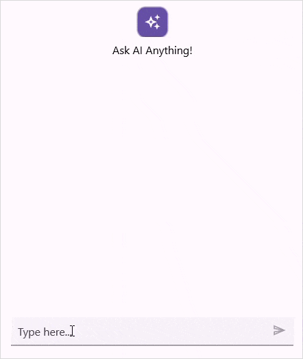
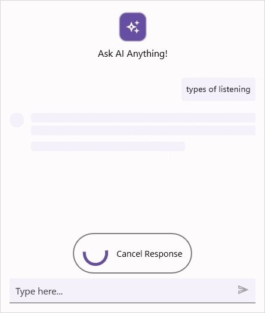
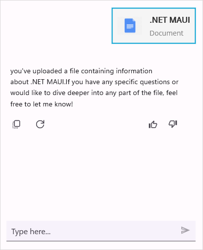
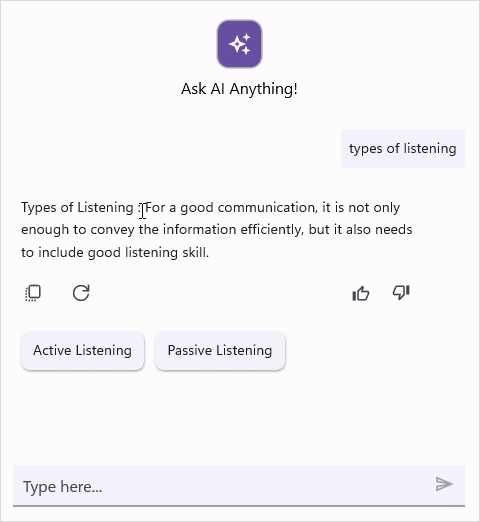

# Working with AI AssistView in .NET MAUI AI AssistView (SfAIAssistView)

## Stop responding

The [SfAIAssistView](https://help.syncfusion.com/cr/maui/Syncfusion.Maui.AIAssistView.SfAIAssistView.html) control provides `Stop Responding` feature that allows you to cancel an ongoing AI response by clicking the Stop Responding view. This feature ensures that users can stop if a response is no longer needed.
By default, the Stop Responding button is displayed, to disable this set the [EnableStopResponding](https://help.syncfusion.com/cr/maui/Syncfusion.Maui.AIAssistView.SfAIAssistView.html#Syncfusion_Maui_AIAssistView_SfAIAssistView_EnableStopResponding) property to `false`.




<syncfusion:SfAIAssistView x:Name="sfAIAssistView"
                           EnableStopResponding="False"/>  

 


SfAIAssistView sfAIAssistView; 
public MainPage() 
{ 
    InitializeComponent(); 
    this.sfAIAssistView = new SfAIAssistView();
    this.sfAIAssistView.EnableStopResponding = false;
    this.Content = sfAIAssistView;
} 




### Event and Command

The `SfAIAssistView` control includes a built-in event called [StopResponding](https://help.syncfusion.com/cr/maui/Syncfusion.Maui.AIAssistView.SfAIAssistView.html#Syncfusion_Maui_AIAssistView_SfAIAssistView_StopResponding) and a command named [StopRespondingCommand](https://help.syncfusion.com/cr/maui/Syncfusion.Maui.AIAssistView.SfAIAssistView.html#Syncfusion_Maui_AIAssistView_SfAIAssistView_StopRespondingCommand). These are triggered when the `Stop Responding` button is clicked.
To cancel the response using the `StopRespondingCommand` or `StopResponding` event, you can include logic to stop the ongoing response as shown below. 

#### StopResponding Event




<syncfusion:SfAIAssistView x:Name="sfAIAssistView"
                           StopResponding="OnStopResponding" />




sfAIAssistView.StopResponding += OnStopResponding;

private void OnStopResponding(object sender, EventArgs e)
{
   // Handle the Stop Responding action
}




#### StopResponding Command




<syncfusion:SfAIAssistView x:Name="sfAIAssistView"  
                           StopRespondingCommand="{Binding StopRespondingCommand}" />




public class ViewModel : INotifyPropertyChanged
{
    public ICommand StopRespondingCommand { get; set; }

    public ViewModel()
    {
      AssistViewRequestCommand = new Command(ExecuteRequestCommand);
      StopRespondingCommand = new Command(ExecuteStopResponding);
    }

    private void ExecuteStopResponding()
    {
        // logic to handle the Stop Responding action
        this.CancelResponse = true;
        AssistItem responseItem = new AssistItem() { Text = "You canceled the response" };
        responseItem.ShowAssistItemFooter = false;
        this.AssistItems.Add(responseItem);
    } 
        
    private void ExecuteRequestCommand()
    {
        this.GetResult();
    }

    private void GetResult()
    {
        if (!CancelResponse)
        {
            // generating the response if it has not been canceled.
        }  
    }      
}




N> [View sample in GitHub](https://github.com/SyncfusionExamples/getting-started-with-.net-maui-aiassistview)

### StopResponding text

The `SfAIAssistView` control allows you to set custom text for the StopResponding view using the [StopRespondingText](https://help.syncfusion.com/cr/maui/Syncfusion.Maui.AIAssistView.SfAIAssistView.html#Syncfusion_Maui_AIAssistView_SfAIAssistView_StopRespondingText) property.




    <syncfusion:SfAIAssistView x:Name="sfAIAssistView"
                               StopRespondingText="Cancel Response"/>  

 

 

SfAIAssistView sfAIAssistView; 
public MainPage() 
{ 
    InitializeComponent(); 
    this.sfAIAssistView = new SfAIAssistView();
    this.sfAIAssistView.StopRespondingText = "Cancel Response";
    this.Content = sfAIAssistView; 
} 




### StopResponding UI customization

The `SfAIAssistView` control allows you to fully customize the Stop Responding view appearance by using the [StopRespondingTemplate](https://help.syncfusion.com/cr/maui/Syncfusion.Maui.AIAssistView.SfAIAssistView.html#Syncfusion_Maui_AIAssistView_SfAIAssistView_StopRespondingTemplate) property. This property lets you define a custom layout and style for the StopResponding UI.




<ContentPage.Resources>
    <ResourceDictionary>
        <DataTemplate x:Key="stopRespondingTemplate">
            <Grid>
                ...
            </Grid>
        </DataTemplate>
    </ResourceDictionary>
</ContentPage.Resources>
<ContentPage.Content>
      <syncfusion:SfAIAssistView x:Name="sfAIAssistView"
                                 StopRespondingTemplate="{StaticResource stopRespondingTemplate}">
      </syncfusion:SfSfAIAssistView>
</ContentPage.Content>




using Syncfusion.Maui.AIAssistView;

public partial class MainPage : ContentPage
{
    SfAIAssistView sfAIAssistView;
    public MainPage()
    {
        InitializeComponent();
        sfAIAssistView = new SfAIAssistView();
        sfAIAssistView.StopRespondingTemplate = CreateStopRespondingViewTemplate();
        this.Content = sfAIAssistView;
    }

    private DataTemplate CreateStopRespondingViewTemplate()
    {
        return new DataTemplate(() =>
        {
            ...
        });
    }
}




## Control template

The `ControlTemplate` in AI AssistView allows you to define and reuse the visual structure of a control. This flexible structure enables to fully customize the appearance and behavior of the AI AssistView. By using `ControlTemplate` with the AI AssistView, you can create a highly customized and interactive interface, as demonstrated below.




<ContentPage.Content>
    ...      
    <local:CustomAssistView x:Name="sfAIAssistView"
                            AssistItems="{Binding AssistMessages}">
        <local:CustomAssistView.ControlTemplate>
                <ControlTemplate>
                    <ContentView>
                        <ContentView.Content>
                            <Grid>
                                <ContentView IsVisible="{Binding IsActiveChatView}" Content="{TemplateBinding AssistChatView}" BindingContext="{TemplateBinding BindingContext}" />
                                <local:ComposeView  IsVisible="{Binding IsActiveComposeView}" BindingContext="{TemplateBinding BindingContext}"/>
                             </Grid>
                        </ContentView.Content>
                    </ContentView>
                </ControlTemplate>
        </local:CustomAssistView.ControlTemplate>
    </local:CustomAssistView>
            ...
</ContentPage.Content>




### Custom chat view

The [CreateAssistChat](https://help.syncfusion.com/cr/maui/Syncfusion.Maui.AIAssistView.SfAIAssistView.html#Syncfusion_Maui_AIAssistView_SfAIAssistView_CreateAssistChat) method allows for the customization of the chat view functionality within the AI AssistView control. By overriding this method, can create their own custom implementation of the chat view, allowing for greater control over the appearance and behavior of chat interactions. It provides the flexibility to modify how chat messages are displayed, how user interactions are handled. Here’s how to override the `CreateAssistChat` method to return a custom instance of [AssistViewChat](https://help.syncfusion.com/cr/maui/Syncfusion.Maui.AIAssistView.AssistViewChat.html).

 


public class CustomAIAssiststView : SfAIAssistView
{
    public CustomAIAssiststView() { }

    protected override AssistViewChat CreateAssistChat()
    {
        // Returning custom implementation of AssistViewChat
        return new CustomAssistViewChat(this);
    }
}

 


The `CustomAssistViewChat `class inherits from `AssistViewChat` and can be used to further customize the chat view, here  the input view is removed by setting `ShowMessageInputView` to `false` as shown below.




public class CustomAssistViewChat : AssistViewChat
{
    public CustomAssistViewChat(SfAIAssistView assistView) : base(assistView)
    {
        //Customize the AssistViewChat
        this.ShowMessageInputView = false;   
    }
}

 


N> [View sample in GitHub](https://github.com/SyncfusionExamples/custom-control-template-in-.net-maui-aiassistview)

## Edit option for request item

The `SfAIAssistView` allows you to edit a previously sent request. This feature lets users review and refine the prompt and resubmit from the editor to get more accurate responses. Each request shows an Edit icon; when tapped, the request text is placed in the editor (InputView) to redefine.

N> **Interaction**: On desktop (Windows, macOS), hover over a request to reveal the Edit icon. On mobile (Android, iOS), tap the request to show the Edit option.

## EditorView template

The `SfAIAssistView` control allows you to fully customize the editor's appearance by using the [EditorViewTemplate](https://help.syncfusion.com/cr/maui/Syncfusion.Maui.AIAssistView.SfAIAssistView.html#Syncfusion_Maui_AIAssistView_SfAIAssistView_EditorViewTemplate) property. This property lets you define a custom layout and style for the editor.




<ContentPage.Resources>
    <ResourceDictionary>
        <DataTemplate x:Key="editorViewTemplate">
            <Grid>
                <Editor x:Name="editor" Placeholder="Type Message...">
                     ...
            </Grid>
        </DataTemplate>
    </ResourceDictionary>
</ContentPage.Resources>
<ContentPage.Content>
      <syncfusion:SfAIAssistView x:Name="sfAIAssistView"
                                 EditorViewTemplate="{StaticResource editorViewTemplate}">
      </syncfusion:SfSfAIAssistView>
</ContentPage.Content>




using Syncfusion.Maui.AIAssistView;

public partial class MainPage : ContentPage
{
    SfAIAssistView sfAIAssistView;
    public MainPage()
    {
            InitializeComponent();
            sfAIAssistView = new SfAIAssistView();
            sfAIAssistView.EditorViewTemplate = CreateEditorViewTemplate();
            this.Content = sfAIAssistView;
    }

    private DataTemplate CreateEditorViewTemplate()
    {
        return new DataTemplate(() =>
        {
            var grid = new Grid { };

            var editor = new Editor
            {
                Placeholder = "Type Message...",
            };

                .......

            grid.Children.Add(editor);

            return grid;
        });
    }
}




## Action buttons in the editor

The `SfAIAssistView` can display a quick action icon inside the editor. To enable the action button, set the `ShowActionButtons` property to `true`.

 
 

<syncfusion:SfAIAssistView x:Name="sfAIAssistView" 
                           ShowActionButtons="True" />



 

using Syncfusion.Maui.AIAssistView;

public partial class MainPage : ContentPage 
{ 
    SfAIAssistView sfAIAssistView;
    public MainPage()
    {
        InitializeComponent();
        this.sfAIAssistView = new SfAIAssistView();
        this.sfAIAssistView.ShowActionButtons = true;
        this.Content = sfAIAssistView;
    }
} 

 


### Displaying action buttons

Bind the `ActionButtons` collection with one or more `ActionButton` items to populate the popup. The `ActionButton` provides the properties. When the `ActionButton` icon is tapped, an action popup appears with the list of configured `ActionButton`.

- `Text`: Displays the text for the action button.
- `Icon`: Displays an icon for the action button.
- `Command`: Executes a command when the action button is tapped.
- `CommandParameter`: Passes a parameter to the command when executed.

 
 

<syncfusion:SfAIAssistView x:Name="sfAIAssistView" 
                           ShowActionButtons="True"
                           AssistItems="{Binding AssistItems}"> 
    <syncfusion:SfAIAssistView.ActionButtons> 
        <syncfusion:ActionButton Text="Upload images" Icon="image.png" Command="{Binding UploadCommand}" /> 
        <syncfusion:ActionButton Text="Search in web" Icon="web.png" Command="{Binding SearchCommand}" />
    </syncfusion:SfAIAssistView.ActionButtons> 
</syncfusion:SfAIAssistView>



 

using Syncfusion.Maui.AIAssistView;

public partial class MainPage : ContentPage 
{ 
    SfAIAssistView sfAIAssistView;
    ViewModel viewModel;
    public MainPage()
    {
        InitializeComponent();
        this.viewModel = new ViewModel();
        this.BindingContext = this.viewModel;
        this.sfAIAssistView = new SfAIAssistView();
        this.sfAIAssistView.ShowActionButtons = true,
        this.sfAIAssistView.AssistItems = this.viewModel.AssistItems,
        this.sfAIAssistView.ActionButtons = new ObservableCollection<ActionButton>
        {
            new ActionButton
            {
                Text = "Upload images",
                Icon = ImageSource.FromFile("image.png"),
                Command = this.viewModel.UploadCommand
            },
            new ActionButton
            {
                Text = "Search in web",
                Icon = ImageSource.FromFile("web.png"),
                Command = this.viewModel.SearchCommand
            },
        };

        this.Content = sfAIAssistView;
    }
}

 


## Request button customization

### Request button icon

The `SfAIAssistView` control allows you to customize the request button icon by setting an `ImageSource` to the `RequestButtonIcon` property.




<syncfusion:SfAIAssistView x:Name="sfAIAssistView"
                           AssistItems="{Binding AssistItems}">
        <syncfusion:SfAIAssistView.RequestButtonIcon>
            <FontImageSource Glyph="&#xe809;"
                             FontFamily="MauiMaterialAssets"
                             Color="Black" />
        </syncfusion:SfAIAssistView.RequestButtonIcon>
</syncfusion:SfAIAssistView>




using Syncfusion.Maui.AIAssistView;

public partial class MainPage : ContentPage
{
    SfAIAssistView sfAIAssistView;
    public MainPage()
    {
        InitializeComponent();
        sfAIAssistView = new SfAIAssistView();
        sfAIAssistView.RequestButtonIcon = new FontImageSource
        {
            Glyph = "\ue809;",
            FontFamily = "MauiMaterialAssets",
            Color = Colors.Green
        };
        this.Content = sfAIAssistView;
    }
}




### Request button template

The `SfAIAssistView` control allows you to fully customize the request button's appearance using the [RequestButtonTemplate](https://help.syncfusion.com/cr/maui/Syncfusion.Maui.AIAssistView.SfAIAssistView.html#Syncfusion_Maui_AIAssistView_SfAIAssistView_RequestButtonTemplate) property. This property lets you define a custom layout and style for the send button.




<ContentPage.Resources>
        <ResourceDictionary>
            <!-- Define the RequestButtonTemplate as a static resource -->
            <DataTemplate x:Key="RequestButtonTemplate">
                <Grid>
                    <Label x:Name="label"
                           Text="&#xe791;"
                           FontFamily="MauiMaterialAssets"
                           FontSize="24"
                           HorizontalOptions="Center"
                           VerticalOptions="Center" />
                </Grid>
            </DataTemplate>
        </ResourceDictionary>
    </ContentPage.Resources>

<ContentPage.Content>
       <StackLayout>
        <syncfusion:SfAIAssistView x:Name="assist"
                                   AssistItems="{Binding AssistItems}"
                                   Request="assist_Request"
                                   RequestButtonTemplate="{StaticResource RequestButtonTemplate}" />
    </StackLayout>
</ContentPage.Content>




using Syncfusion.Maui.AIAssistView;

public partial class MainPage : ContentPage
{
    SfAIAssistView sfAIAssistView;
    public MainPage()
    {
            InitializeComponent();
            sfAIAssistView = new SfAIAssistView();
            sfAIAssistView.RequestButtonTemplate = RequestButtonTemplate();
            this.Content = sfAIAssistView;
    }

    private DataTemplate RequestButtonTemplate()
    {
        return new DataTemplate(() =>
        {
            var grid = new Grid();

            var label = new Label
            {
                Text = "&#xe791;", // Unicode for the icon
                FontFamily = "MauiMaterialAssets",
                FontSize = 24,
                HorizontalOptions = LayoutOptions.Center,
                VerticalOptions = LayoutOptions.Center
            };

            grid.Children.Add(label);
            return grid;
        });
    }
}




N> The [InputText](https://help.syncfusion.com/cr/maui/Syncfusion.Maui.AIAssistView.SfAIAssistView.html#Syncfusion_Maui_AIAssistView_SfAIAssistView_InputText) is used to gets or sets the text of the editor in the `SfAIAssistView`.

## Show ResponseLoader View

By Default, the response loader view will be enabled, and the default shimmer view will be displayed when the request is added. To disable it, set the [ShowResponseLoader](https://help.syncfusion.com/cr/maui/Syncfusion.Maui.AIAssistView.SfAIAssistView.html#Syncfusion_Maui_AIAssistView_SfAIAssistView_ShowResponseLoader) property to `false`.




<ContentPage.BindingContext>
    <local:GettingStartedViewModel/>
</ContentPage.BindingContext>

<ContentPage.Content>
    <syncfusion:SfAIAssistView x:Name="sfAIAssistView"
                               AssistItems="{Binding AssistItems}"
                               ShowResponseLoader="False"/>
</ContentPage.Content>




public partial class MainPage : ContentPage
{
    SfAIAssistView sfAIAssistView;
    public MainPage()
    {
        InitializeComponent();
        this.sfAIAssistView = new SfAIAssistView();
        GettingStartedViewModel viewModel = new GettingStartedViewModel();
        this.sfAIAssistView.AssistItems = viewModel.AssistItems;
        this.sfAIAssistView.ShowResponseLoader = false;
        this.Content = sfAIAssistView;
    }
}




## Template customization

The `SfAIAssistView` facilitates the customization of both request and response item templates according to specific requirements. This feature enhances flexibility and provides a higher degree of control over the display of items.

By utilizing the template selector, distinct templates can be assigned to all [AssistItem](https://help.syncfusion.com/cr/maui/Syncfusion.Maui.AIAssistView.AssistItem.html) or to a particular item, allowing for the independent customization of both request and response items. This capability is particularly beneficial when custom item types require different visual representations, offering precise control over the layout and presentation within the assist view.

### Request item template

A template can be used to present the data in a way that makes sense for the application by using different controls. `SfAIAssistView` allows customizing the appearance of the Request view by setting the [RequestItemTemplate](https://help.syncfusion.com/cr/maui/Syncfusion.Maui.AIAssistView.SfAIAssistView.html#Syncfusion_Maui_AIAssistView_SfAIAssistView_RequestItemTemplate) property.

#### Data model




public class FileAssistItem : AssistItem, INotifyPropertyChanged
{
    private string fileName;

    private string fileType;

    public string FileName
    { 
        get
        {
            return fileName;
        }
        set
        {
            fileName = value;
            OnPropertyChanged("FileName");
        }
    }
    public string FileType
    {
        get
        {
            return fileType;
        }
        set
        {
            fileType = value;
            OnPropertyChanged("FileType");
        }
    }

    public event PropertyChangedEventHandler PropertyChanged;

    public void OnPropertyChanged(string name)
    {
        if (this.PropertyChanged != null)
            this.PropertyChanged(this, new PropertyChangedEventArgs(name));
    }
}




#### View model




public class GettingStartedViewModel : INotifyPropertyChanged
{
    private ObservableCollection<IAssistItem> assistItems;

    public GettingStartedViewModel()
    {
        this.assistItems = new ObservableCollection<IAssistItem>();
        this.GenerateAssistItems();
    }

    /// 

    /// Gets or sets the collection of AssistItem of a conversation.
    /// 

    public ObservableCollection<IAssistItem> AssistItems
    {
        get
        {
            return this.assistItems;
        }

        set
        {
            this.assistItems = value;
        }
    }

    private async void GenerateAssistItems()
    {
            

        FileAssistItem FileItem = new FileAssistItem()
        {
            FileName = ".NET MAUI",
            FileType = "Document",
            IsRequested = true
        };

        this.AssistItems.Add(FileItem);

        await Task.Delay(1000).ConfigureAwait(true);

        AssistItem responseItem2 = new AssistItem()
        {
            Text = "you've uploaded a file containing information about .NET MAUI.If you have any specific questions or would like to dive deeper into any part of the file, feel free to let me know!",
            IsRequested = false
        };

        this.AssistItems.Add(responseItem2);
    }
}




#### Data template selector

Create a custom class that inherits from [RequestItemTemplateSelector](https://help.syncfusion.com/cr/maui/Syncfusion.Maui.AIAssistView.RequestItemTemplateSelector.html), and override the [OnSelectTemplate](https://help.syncfusion.com/cr/maui/Syncfusion.Maui.AIAssistView.RequestItemTemplateSelector.html#Syncfusion_Maui_AIAssistView_RequestItemTemplateSelector_OnSelectTemplate_System_Object_Microsoft_Maui_Controls_BindableObject_) method to return the `DataTemplate` for that item. At runtime, the `SfAIAssistView` invokes the `OnSelectTemplate` method for each item and passes the data object as parameter.




public class CustomRequestTemplateSelector : RequestItemTemplateSelector
{
    private readonly DataTemplate? requestcustomtemplate;

    public CustomRequestTemplateSelector()
    {
        this.requestcustomtemplate = new DataTemplate(typeof(FileTemplate));
    }

    protected override DataTemplate? OnSelectTemplate(object item, BindableObject container)
    {
        var assistitem = item as IAssistItem;

        if (assistitem == null)
        {
            return null;
        }

        // Returns the custom data template for the file item.
        if (item.GetType() == typeof(FileAssistItem))
        {
            return requestcustomtemplate;
        }

        // Returns the inbuilt data templates for the other request AssistItems.
        else
        {
            return base.OnSelectTemplate(item, container);
        }
    }
}




#### Applying the data template selector




    <ContentPage.BindingContext>
        <local:GettingStartedViewModel/>
    </ContentPage.BindingContext>

    <ContentPage.Resources>
        <local:CustomRequestTemplateSelector x:Key="requestSelector"/>
    </ContentPage.Resources>

    <ContentPage.Content>
        <syncfusion:SfAIAssistView x:Name="sfAIAssistView"
                               AssistItems="{Binding AssistItems}"
                               RequestItemTemplate="{StaticResource requestSelector}"/>
    </ContentPage.Content>




public partial class MainPage : ContentPage
{
    SfAIAssistView sfAIAssistView;
    public MainPage()
    {
        InitializeComponent();
        this.sfAIAssistView = new SfAIAssistView();
        GettingStartedViewModel viewModel = new GettingStartedViewModel();
        this.sfAIAssistView.AssistItems = viewModel.AssistItems;
        this.sfAIAssistView.RequestItemTemplate = new CustomRequestTemplateSelector();
        this.Content = sfAIAssistView;
    }
}




### Response item template

A template can be used to present the data in a way that makes sense for the application by using different controls. `SfAIAssistView` allows customizing the appearance of the Response view by setting the [ResponseItemTemplate](https://help.syncfusion.com/cr/maui/Syncfusion.Maui.AIAssistView.SfAIAssistView.html#Syncfusion_Maui_AIAssistView_SfAIAssistView_ResponseItemTemplate) property.

#### View model




public class GettingStartedViewModel : INotifyPropertyChanged
{
    /// 

    /// Collection of assistItem in a conversation.
    /// 

    private ObservableCollection<IAssistItem> assistItems;

    public GettingStartedViewModel()
    {
        this.assistItems = new ObservableCollection<IAssistItem>();
        this.GenerateAssistItems();
    }

    /// 

    /// Gets or sets the collection of AssistItem of a conversation.
    /// 

    public ObservableCollection<IAssistItem> AssistItems
    {
        get
        {
            return this.assistItems;
        }

        set
        {
            this.assistItems = value;
        }
    }

    private async void GenerateAssistItems()
    {
        AssistItem requestItem = new AssistItem()
        {
            Text = "Hi, I think I caught a cold.",
            IsRequested = true
        };

        // Add the request item to the collection
        this.AssistItems.Add(requestItem);

        await Task.Delay(1000).ConfigureAwait(true);

        AssistItem responseItem = new AssistItem()
        {
            Text = "Do you want me to schedule a consultation with a doctor?",
            IsRequested = false,
        };

        // Add the response item to the collection
        this.AssistItems.Add(responseItem);

        // Adding a request item
        AssistItem requestItem1 = new AssistItem()
        {
            Text = "Yes, Consultation with Dr.Harry tomorrow",
            IsRequested = true
        };

        // Add the request item to the collection
        this.AssistItems.Add(requestItem1);

        await Task.Delay(1000).ConfigureAwait(true);

        DatePickerItem datepickerItem = new DatePickerItem()
        {
            Text = "Choose a date for Consultation",
            IsRequested = false,
            SelectedDate = DateTime.Today,
        };

        // Add the response item to the collection
        this.AssistItems.Add(datepickerItem);
        // Generating response item
    }
}




#### Data template selector

Create a custom class that inherits from [ResponseItemTemplateSelector](https://help.syncfusion.com/cr/maui/Syncfusion.Maui.AIAssistView.ResponseItemTemplateSelector.html), and override the [OnSelectTemplate](https://help.syncfusion.com/cr/maui/Syncfusion.Maui.AIAssistView.ResponseItemTemplateSelector.html#Syncfusion_Maui_AIAssistView_ResponseItemTemplateSelector_OnSelectTemplate_System_Object_Microsoft_Maui_Controls_BindableObject_) method to return the `DataTemplate` for that item. At runtime, the `SfAIAssistView` invokes the `OnSelectTemplate` method for each item and passes the data object as parameter.




public class CustomResponseTemplateSelector : ResponseItemTemplateSelector
{
    private readonly DataTemplate? reponsecustomtemplate;

    public CustomResponseTemplateSelector()
    {
        this.reponsecustomtemplate = new DataTemplate(typeof(TimePickerTemplate));
    }

    protected override DataTemplate? OnSelectTemplate(object item, BindableObject container)
    {
        var assistitem = item as IAssistItem;

        if (assistitem == null)
        {
            return null;
        }

        // Returns the custom data template for the DatePickerItem item.
        if (item.GetType() == typeof(DatePickerItem))
        {
            return reponsecustomtemplate;
        }

        // Returns the inbuilt data templates for the other request AssistItems.
        else
        {
            return base.OnSelectTemplate(item, container);
        }
    }
}




#### Applying the data template selector




    <ContentPage.BindingContext>
        <local:GettingStartedViewModel/>
    </ContentPage.BindingContext>

    <ContentPage.Resources>
        <local:CustomResponseTemplateSelector x:Key="responseSelector"/>
    </ContentPage.Resources>

    <ContentPage.Content>
        <syncfusion:SfAIAssistView x:Name="sfAIAssistView"
                                   AssistItems="{Binding AssistItems}"
                                   ResponseItemTemplate="{StaticResource responseSelector}"/>
    </ContentPage.Content>




public partial class MainPage : ContentPage
{
    SfAIAssistView sfAIAssistView;
    public MainPage()
    {
        InitializeComponent();
        this.sfAIAssistView = new SfAIAssistView();
        GettingStartedViewModel viewModel = new GettingStartedViewModel();
        this.sfAIAssistView.AssistItems = viewModel.AssistItems;
        this.sfAIAssistView.ResponseItemTemplate = new CustomResponseTemplateSelector();
        this.Content = sfAIAssistView;
    }
}




## Text selection
The `SfAIAssistView` allows for selecting specific phrases or the entire response or request text. It enables the platform specific selection functionalities.
By default, text selection is disabled. To enable it, set the [AllowTextSelection](https://help.syncfusion.com/cr/maui/Syncfusion.Maui.AIAssistView.SfAIAssistView.html#Syncfusion_Maui_AIAssistView_SfAIAssistView_AllowTextSelection) property to `true`.




<syncfusion:SfAIAssistView x:Name="sfAIAssistView"
                           AllowTextSelection="True"/>




using Syncfusion.Maui.AIAssistView;

public partial class MainPage : ContentPage
{
    SfAIAssistView sfAIAssistView;
    public MainPage()
    {
            InitializeComponent();
            sfAIAssistView = new SfAIAssistView();
            sfAIAssistView.AllowTextSelection = true;
            this.Content = sfAIAssistView;
    }
}




## Scroll to bottom button

The `SfAIAssistView` control provides an option to display a scroll-to-bottom button that helps users quickly navigate back to the latest responses when they have scrolled up in the AI conversation. To enable this, set the `ShowScrollToBottomButton` property to `true`.




<syncfusion:SfAIAssistView x:Name="sfAIAssistView"
                           AssistItems="{Binding AssistItems}"
                           ShowScrollToBottomButton="True" />




using Syncfusion.Maui.AIAssistView;

public partial class MainPage : ContentPage
{
    SfAIAssistView sfAIAssistView;
    public MainPage()
    {
        InitializeComponent();
        this.sfAIAssistView = new SfAIAssistView();
        this.sfAIAssistView.ShowScrollToBottomButton = true;
        this.Content = sfAIAssistView;
    }
}




### Scroll to bottom button customization

The `SfAIAssistView` control allows you to fully customize the scroll-to-bottom button appearance by using the `ScrollToBottomButtonTemplate` property. This property lets you define a custom layout and style.




<ContentPage.Resources>
        <ResourceDictionary>
            <DataTemplate x:Key="scrollToBottomButtonTemplate">
                ...
            </DataTemplate>
        </ResourceDictionary>
</ContentPage.Resources>

<syncfusion:SfAIAssistView x:Name="sfAIAssistView"
                           AssistItems="{Binding AssistItems}"
                           ShowScrollToBottomButton="True"
                           ScrollToBottomButtonTemplate="{StaticResource scrollToBottomButtonTemplate}" />




using Syncfusion.Maui.AIAssistView;

public partial class MainPage : ContentPage
{
    SfAIAssistView sfAIAssistView;
    public MainPage()
    {
        InitializeComponent();
        this.sfAIAssistView = new SfAIAssistView();
        this.sfAIAssistView.ShowScrollToBottomButton = true;
        this.sfAIAssistView.ScrollToBottomButtonTemplate = this.CreateScrollToBottomButtonTemplate();
        this.Content = this.sfAIAssistView;
    }

    private DataTemplate CreateScrollToBottomButtonTemplate()
    {
        return new DataTemplate(() =>
        {
            ...
        });
    }
}




