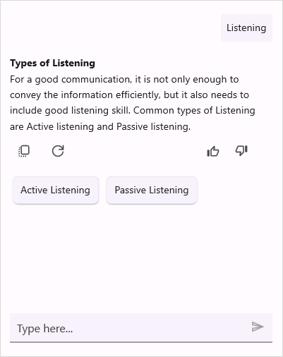

# Syncfusion® AI Components for .NET MAUI

Syncfusion® AI components for .NET MAUI provide a range of intelligent controls designed to enhance desktop and mobile applications with advanced, AI-driven capabilities. These tools integrate seamlessly with modern AI services to deliver smart data processing, conversational experiences, predictive interactions, and automation, enabling developers to create more efficient and user-centric applications.

## AI Controls

<h3 class="form-title"><a class="form-link" href="https://help.syncfusion.com/maui/aiassistview/overview">AI Assist View</a></h3>

              Provides AI-based chat interactions and helpful context-aware assistance.

<h3 class="form-title"><a class="form-link" href="https://help.syncfusion.com/maui/smartdatagrid/overview">Smart DataGrid</a></h3>

               Provides intelligent data analysis with AI-driven insights, filtering, and automation.

<h3 class="form-title"><a class="form-link" href="https://help.syncfusion.com/maui/smartscheduler/overview">Smart Scheduler</a></h3>

               Simplifies event management using natural language input and AI-assisted scheduling.

<h3 class="form-title"><a class="form-link" href="https://help.syncfusion.com/maui/smarttexteditor/overview">Smart Text Editor</a></h3>

                 Enhances typing with AI-powered autocomplete and contextual text suggestions.

<!-- Popup Modal -->

&times;

