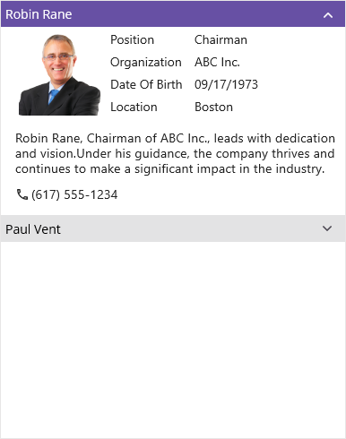

# Appearance in Maui Accordion (SfAccordion)

The .NET MAUI SfAccordion comes with built-in support for customizing the appearance of the header.

# Header icon position 
 
The [SfAccordion](https://help.syncfusion.com/cr/maui/Syncfusion.Maui.Accordion.SfAccordion.html) allows you to customize the position of the header icon in each accordion item using the [HeaderIconPosition](https://help.syncfusion.com/cr/maui/Syncfusion.Maui.Accordion.SfAccordion.html#Syncfusion_Maui_Accordion_SfAccordion_HeaderIconPosition) property. By default, the header icon position is set to [End](https://help.syncfusion.com/cr/maui/Syncfusion.Maui.Expander.ExpanderIconPosition.html#Syncfusion_Maui_Expander_ExpanderIconPosition_End).



<syncfusion:SfAccordion x:Name="accordion" 
                        HeaderIconPosition="Start" />


accordion.HeaderIconPosition = Syncfusion.Maui.Expander.ExpanderIconPosition.Start;



## Header background color customization

The [SfAccordion](https://help.syncfusion.com/cr/maui/Syncfusion.Maui.Accordion.SfAccordion.html) allows you to customize the background color of the expander header by using the [HeaderBackground](https://help.syncfusion.com/cr/maui/Syncfusion.Maui.Accordion.AccordionItem.html#Syncfusion_Maui_Accordion_AccordionItem_HeaderBackground) property.



<syncfusion:SfAccordion x:Name="accordion">
    <syncfusion:SfAccordion.Items>
        <syncfusion:AccordionItem HeaderBackground="Pink"/>
    </syncfusion:SfAccordion.Items>
</syncfusion:SfAccordion>


SfAccordion accordion;
public MainPage()
{
    InitializeComponent();
    InitializeAccordionItems();
    this.Content = accordion;
}

private void InitializeAccordionItems()
{
    accordion = new SfAccordion();
    accordion.Items.Add(GenerateAccordionItem());
}

public AccordionItem GenerateAccordionItem()
{
    var item = new AccordionItem();
    item.HeaderBackground = Colors.Pink;
    return item;
}



## Icon color customization

The [SfAccordion](https://help.syncfusion.com/cr/maui/Syncfusion.Maui.Accordion.SfAccordion.html) allows you to customize the color of the expander icon by using the [HeaderIconColor](https://help.syncfusion.com/cr/maui/Syncfusion.Maui.Accordion.AccordionItem.html#Syncfusion_Maui_Accordion_AccordionItem_HeaderIconColor) property.



<syncfusion:SfAccordion x:Name="accordion">
    <syncfusion:SfAccordion.Items>
        <syncfusion:AccordionItem HeaderIconColor="Brown"/>
    </syncfusion:SfAccordion.Items>
</syncfusion:SfAccordion>


SfAccordion accordion;
public MainPage()
{
    InitializeComponent();
    InitializeAccordionItems();
    this.Content = accordion;
}

private void InitializeAccordionItems()
{
    accordion = new SfAccordion();
    accordion.Items.Add(GenerateAccordionItem());
}

public AccordionItem GenerateAccordionItem()
{
    var item = new AccordionItem();
    item.HeaderIconColor = Colors.Brown;
    return item;
}



## Visual State Manager

The appearance of the [SfAccordion](https://help.syncfusion.com/cr/maui/Syncfusion.Maui.Accordion.SfAccordion.html) can be customized using the following `VisualStates`:

* Expanded
* Collapsed
* Focused
* PointerOver
* Normal



     <ContentPage.Resources>
        
    </ContentPage.Resources>
    <ContentPage.Content>
        <syncfusion:SfAccordion ExpandMode="MultipleOrNone" BackgroundColor="#FAFAFA">
            <syncfusion:SfAccordion.Items>
                <syncfusion:AccordionItem x:Name="item1" 
                                          IsExpanded="True">
                    <syncfusion:AccordionItem.Header>
                        <Grid Padding="5,5,5,5">
                            <Label TextColor="{Binding HeaderIconColor, Source={x:Reference item1}}" Text="Robin Rane" VerticalTextAlignment="Center"/>
                        </Grid>
                    </syncfusion:AccordionItem.Header>
                    <syncfusion:AccordionItem.Content>
                        <Grid ColumnSpacing="10" RowSpacing="2" >
                            <Grid Margin="16,6,0,0">
                                <Grid.Resources>
                                    
                                </Grid.Resources>
                                <Grid.RowDefinitions >
                                    <RowDefinition Height="25"/>
                                    <RowDefinition Height="25"/>
                                    <RowDefinition Height="25"/>
                                    <RowDefinition Height="25"/>
                                    <RowDefinition Height="{OnPlatform Default=90,Android=90,WinUI=70, iOS=100,MacCatalyst=70 }"/>
                                    <RowDefinition Height="Auto"/>
                                </Grid.RowDefinitions>
                                <Grid.ColumnDefinitions>
                                    <ColumnDefinition Width="100"/>
                                    <ColumnDefinition Width="100"/>
                                    <ColumnDefinition Width="*"/>
                                </Grid.ColumnDefinitions>
                                <Border Grid.RowSpan="4"
                                        Grid.Row="0"
                                        Grid.Column="0"
                                        Padding="0"
                                        Margin="0,0,0,7">
                                    <Image  Source="emp_01.png" />
                                </Border>
                                <Label Text="Position" Grid.Column="1" Grid.Row="0" Margin="6,0,0,0"/>
                                <Label Text="Chairman" Grid.Row="0" Grid.Column="2"/>
                                <Label Text="Organization " Grid.Row="1" Grid.Column="1" Margin="6,0,0,0"/>
                                <Label Text="ABC Inc." Grid.Row="1" Grid.Column="2"/>
                                <Label Text="Date Of Birth " Grid.Row="2" Grid.Column="1" Margin="6,0,0,0"/>
                                <Label Text="09/17/1973" Grid.Row="2" Grid.Column="2"/>
                                <Label Text="Location " Grid.Row="3" Grid.Column="1" Margin="6,0,0,0"/>
                                <Label Text="Boston" Grid.Row="3" Grid.Column="2"/>
                                <Label Padding="0,10,0,10" Grid.Row="4" Grid.ColumnSpan="3"  LineBreakMode="WordWrap"  
                                            FontSize="14" CharacterSpacing="0.25" VerticalTextAlignment="Center" 
                                                Text="Robin Rane, Chairman of ABC Inc., leads with dedication and vision.Under his guidance, the company thrives and continues to make a significant impact in the industry.">
                                </Label>
                                <StackLayout Grid.Row="5" Orientation="Horizontal" Margin="0,0,0,12">
                                    <Label Text="&#xe700;" FontSize="16" Margin="0,2,2,2"
                                                   FontFamily='{OnPlatform Android=AccordionFontIcons.ttf#,WinUI=AccordionFontIcons.ttf#AccordionFontIcons,MacCatalyst=AccordionFontIcons,iOS=AccordionFontIcons}'
                                                   VerticalOptions="Center" VerticalTextAlignment="Center"/>
                                    <Label Text="(617) 555-1234" Grid.Column="1" VerticalOptions="Center" CharacterSpacing="0.25" FontSize="14"/>
                                </StackLayout>
                            </Grid>
                        </Grid>
                    </syncfusion:AccordionItem.Content>
                </syncfusion:AccordionItem>
            </syncfusion:SfAccordion.Items>
        </syncfusion:SfAccordion>
    </ContentPage.Content>
</ContentPage>



N> [View Sample in GitHub](https://github.com/SyncfusionExamples/customize-the-ui-appearance-using-visual-states-in-.net-maui-accordion).
