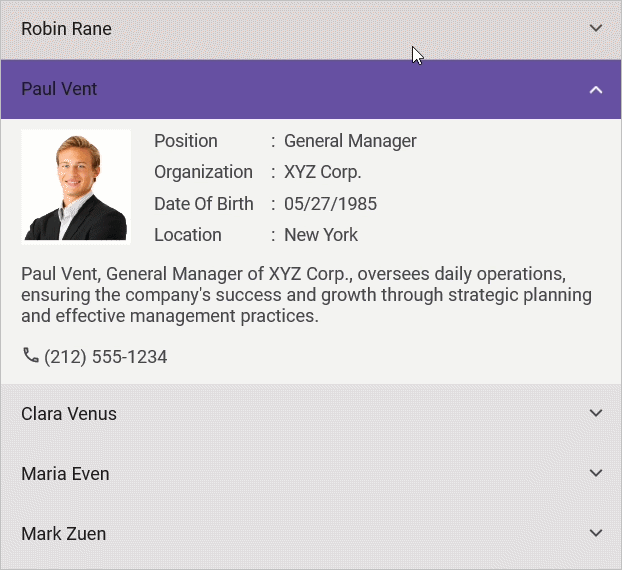

# Appearance in Maui Accordion (SfAccordion)

The .NET MAUI SfAccordion comes with built-in support for customizing the appearance of the header.

# Header icon position 
 
The [SfAccordion](https://help.syncfusion.com/cr/maui/Syncfusion.Maui.Accordion.SfAccordion.html) allows you to customize the position of the header icon in each accordion item using the [HeaderIconPosition](https://help.syncfusion.com/cr/maui/Syncfusion.Maui.Accordion.SfAccordion.html#Syncfusion_Maui_Accordion_SfAccordion_HeaderIconPosition) property. By default, the header icon position is set to [End](https://help.syncfusion.com/cr/maui/Syncfusion.Maui.Expander.ExpanderIconPosition.html#Syncfusion_Maui_Expander_ExpanderIconPosition_End).



<syncfusion:SfAccordion x:Name="accordion"
                        HeaderIconPosition="Start">
    <syncfusion:SfAccordion.Items>
        <syncfusion:AccordionItem>
            <syncfusion:AccordionItem.Header>
                <Grid  HeightRequest="48">
                    <Label Text="Robin Rane" Margin="16,14,0,14" CharacterSpacing="0.25" FontFamily="Roboto-Regular" FontSize="14" />
                </Grid>
            </syncfusion:AccordionItem.Header>
            <syncfusion:AccordionItem.Content>
                <Grid ColumnSpacing="10" RowSpacing="2" BackgroundColor="#f4f4f4">
                    <Grid Margin="16,6,0,0" RowDefinitions="25,25,25,25,70,Auto" ColumnDefinitions="100,100,*">
                        <Grid.Resources>
                            
                        </Grid.Resources>
                        <Border Grid.RowSpan="4" Grid.Row="0" Grid.Column="0" Padding="0" Margin="0,0,0,7">
                            <Image Source="emp_01.png" />
                        </Border>
                        <Label Text="Position" Grid.Row="0" Grid.Column="1" Margin="6,0,0,0" />
                        <Label Text="Chairman" Grid.Row="0" Grid.Column="2" />
                        <Label Text="Organization " Grid.Row="1" Grid.Column="1" Margin="6,0,0,0" />
                        <Label Text="ABC Inc." Grid.Row="1" Grid.Column="2" />
                        <Label Text="Date Of Birth " Grid.Row="2" Grid.Column="1" Margin="6,0,0,0" />
                        <Label Text="09/17/1973" Grid.Row="2" Grid.Column="2" />
                        <Label Text="Location " Grid.Row="3" Grid.Column="1" Margin="6,0,0,0" />
                        <Label Text="Boston" Grid.Row="3" Grid.Column="2" />
                        <Label Padding="0,10,0,10" Grid.Row="4" Grid.ColumnSpan="3" LineBreakMode="WordWrap" FontSize="14" CharacterSpacing="0.25" VerticalTextAlignment="Center" 
                               Text="Robin Rane, Chairman of ABC Inc., leads with dedication and vision.Under his guidance, the company thrives and continues to make a significant impact in the industry." />
                        <StackLayout Grid.Row="5" Orientation="Horizontal" Margin="0,0,0,12">
                            <Label Text="&#xe700;" FontSize="16" Margin="0,2,2,2" FontFamily='{OnPlatform Android=AccordionFontIcons.ttf#,WinUI=AccordionFontIcons.ttf#AccordionFontIcons,MacCatalyst=AccordionFontIcons,iOS=AccordionFontIcons}' VerticalOptions="Center" VerticalTextAlignment="Center" />
                            <Label Text="(617) 555-1234" Grid.Column="1" VerticalOptions="Center" CharacterSpacing="0.25" FontSize="14" />
                        </StackLayout>
                    </Grid>
                </Grid>
            </syncfusion:AccordionItem.Content>
        </syncfusion:AccordionItem>
        ..........................
    </syncfusion:SfAccordion.Items>
</syncfusion:SfAccordion>


public partial class MainPage : ContentPage
{
    public MainPage()
    {
        InitializeComponent();

        var accordion = new SfAccordion();
        accordion.HeaderIconPosition = Syncfusion.Maui.Expander.ExpanderIconPosition.Start;
        var accordionItems = new AccordionItem
        {
            Header = CreateHeader(),
            Content = CreateContent()
        };

        accordion.Items.Add(accordionItems);
        this.Content = accordion;
    }

    private View CreateHeader()
    {
        var headerGrid = new Grid
        {
            HeightRequest = 48
        };

        headerGrid.Children.Add(new Label
        {
            Text = "Robin Rane",
            Margin = new Thickness(16, 14, 0, 14),
            CharacterSpacing = 0.25,
            FontFamily = "Roboto-Regular",
            FontSize = 14
        });

        return headerGrid;
    }

    private View CreateContent()
    {
        var outerGrid = new Grid
        {
            BackgroundColor = Color.FromArgb("#f4f4f4"),
            ColumnSpacing = 10,
            RowSpacing = 2
        };

        var innerGrid = new Grid
        {
            Margin = new Thickness(16, 6, 0, 0),
            RowDefinitions =
            {
                new RowDefinition { Height = 25 },
                new RowDefinition { Height = 25 },
                new RowDefinition { Height = 25 },
                new RowDefinition { Height = 25 },
                new RowDefinition { Height = 70 },
                new RowDefinition { Height = GridLength.Auto }
            },
            ColumnDefinitions =
            {
                new ColumnDefinition { Width = 100 },
                new ColumnDefinition { Width = 100 },
                new ColumnDefinition { Width = GridLength.Star }
            }
        };

        // Image
        var imageBorder = new Border
        {
            Margin = new Thickness(0, 0, 0, 7),
            Content = new Image { Source = "emp_01.png" }
        };

        Grid.SetRow(imageBorder, 0);
        Grid.SetColumn(imageBorder, 0);
        Grid.SetRowSpan(imageBorder, 4);
        innerGrid.Children.Add(imageBorder);

        AddText(innerGrid, "Position", 0, 1, true);
        AddText(innerGrid, "Chairman", 0, 2);

        AddText(innerGrid, "Organization", 1, 1, true);
        AddText(innerGrid, "ABC Inc.", 1, 2);

        AddText(innerGrid, "Date Of Birth", 2, 1, true);
        AddText(innerGrid, "09/17/1973", 2, 2);

        AddText(innerGrid, "Location", 3, 1, true);
        AddText(innerGrid, "Boston", 3, 2);

        // Description
        var description = new Label
        {
            Text = "Robin Rane, Chairman of ABC Inc., leads with dedication and vision. "Under his guidance, the company thrives and continues to make a significant impact in the industry.",
            Padding = new Thickness(0, 10),
            LineBreakMode = LineBreakMode.WordWrap,
            VerticalTextAlignment = TextAlignment.Center,
            FontFamily = "Roboto-Regular",
            FontSize = 14,
            CharacterSpacing = 0.25
        };

        Grid.SetRow(description, 4);
        Grid.SetColumnSpan(description, 3);
        innerGrid.Children.Add(description);

        // Phone row
        var phoneStack = new StackLayout
        {
            Orientation = StackOrientation.Horizontal,
            Margin = new Thickness(0, 0, 0, 12),
            Children =
            {
                new Label
                {
                    Text = "\ue700",
                    FontSize = 16,
                    FontFamily = DeviceInfo.Platform == DevicePlatform.Android ? "AccordionFontIcons.ttf#" : "AccordionFontIcons",
                    VerticalTextAlignment = TextAlignment.Center
                },
                new Label
                {
                    Text = "(617) 555-1234",
                    FontSize = 14,
                    CharacterSpacing = 0.25,
                    VerticalTextAlignment = TextAlignment.Center
                }
            }
        };

        Grid.SetRow(phoneStack, 5);
        Grid.SetColumnSpan(phoneStack, 3);
        innerGrid.Children.Add(phoneStack);
        outerGrid.Children.Add(innerGrid);
        return outerGrid;
    }

    private void AddText(Grid grid, string text, int row, int column, bool withMargin = false)
    {
        var label = new Label
        {
            Text = text,
            FontFamily = "Roboto-Regular",
            Margin = withMargin ? new Thickness(6, 0, 0, 0) : Thickness.Zero
        };

        Grid.SetRow(label, row);
        Grid.SetColumn(label, column);
        grid.Children.Add(label);
    }
}



 

## Header background color customization

The [SfAccordion](https://help.syncfusion.com/cr/maui/Syncfusion.Maui.Accordion.SfAccordion.html) allows you to customize the background color of the expander header by using the [HeaderBackground](https://help.syncfusion.com/cr/maui/Syncfusion.Maui.Accordion.AccordionItem.html#Syncfusion_Maui_Accordion_AccordionItem_HeaderBackground) property.



<syncfusion:SfAccordion x:Name="accordion">
    <syncfusion:SfAccordion.Items>
        <syncfusion:AccordionItem HeaderBackground="#5fa8d3">
            <syncfusion:AccordionItem.Header>
                <Grid  HeightRequest="48">
                    <Label Text="Robin Rane" Margin="16,14,0,14" CharacterSpacing="0.25" FontFamily="Roboto-Regular" FontSize="14" />
                </Grid>
            </syncfusion:AccordionItem.Header>
            <syncfusion:AccordionItem.Content>
                <Grid ColumnSpacing="10" RowSpacing="2" BackgroundColor="#f4f4f4">
                    <Grid Margin="16,6,0,0" RowDefinitions="25,25,25,25,70,Auto" ColumnDefinitions="100,100,*">
                        <Grid.Resources>
                            
                        </Grid.Resources>
                        <Border Grid.RowSpan="4" Grid.Row="0" Grid.Column="0" Padding="0" Margin="0,0,0,7">
                            <Image Source="emp_01.png" />
                        </Border>
                        <Label Text="Position" Grid.Row="0" Grid.Column="1" Margin="6,0,0,0" />
                        <Label Text="Chairman" Grid.Row="0" Grid.Column="2" />
                        <Label Text="Organization " Grid.Row="1" Grid.Column="1" Margin="6,0,0,0" />
                        <Label Text="ABC Inc." Grid.Row="1" Grid.Column="2" />
                        <Label Text="Date Of Birth " Grid.Row="2" Grid.Column="1" Margin="6,0,0,0" />
                        <Label Text="09/17/1973" Grid.Row="2" Grid.Column="2" />
                        <Label Text="Location " Grid.Row="3" Grid.Column="1" Margin="6,0,0,0" />
                        <Label Text="Boston" Grid.Row="3" Grid.Column="2" />
                        <Label Padding="0,10,0,10" Grid.Row="4" Grid.ColumnSpan="3" LineBreakMode="WordWrap" FontSize="14" CharacterSpacing="0.25" VerticalTextAlignment="Center" 
                               Text="Robin Rane, Chairman of ABC Inc., leads with dedication and vision.Under his guidance, the company thrives and continues to make a significant impact in the industry." />
                        <StackLayout Grid.Row="5" Orientation="Horizontal" Margin="0,0,0,12">
                            <Label Text="&#xe700;" FontSize="16" Margin="0,2,2,2" FontFamily='{OnPlatform Android=AccordionFontIcons.ttf#,WinUI=AccordionFontIcons.ttf#AccordionFontIcons,MacCatalyst=AccordionFontIcons,iOS=AccordionFontIcons}' VerticalOptions="Center" VerticalTextAlignment="Center" />
                            <Label Text="(617) 555-1234" Grid.Column="1" VerticalOptions="Center" CharacterSpacing="0.25" FontSize="14" />
                        </StackLayout>
                    </Grid>
                </Grid>
            </syncfusion:AccordionItem.Content>
        </syncfusion:AccordionItem>
        ..........................
    </syncfusion:SfAccordion.Items>
</syncfusion:SfAccordion>


public partial class MainPage : ContentPage
{
    public MainPage()
    {
        InitializeComponent();

        var accordion = new SfAccordion();
        var accordionItems = new AccordionItem
        {
            HeaderBackground = Color.FromArgb("#5fa8d3"),
            Header = CreateHeader(),
            Content = CreateContent()
        };

        accordion.Items.Add(accordionItems);
        this.Content = accordion;
    }

    private View CreateHeader()
    {
        var headerGrid = new Grid
        {
            HeightRequest = 48
        };

        headerGrid.Children.Add(new Label
        {
            Text = "Robin Rane",
            Margin = new Thickness(16, 14, 0, 14),
            CharacterSpacing = 0.25,
            FontFamily = "Roboto-Regular",
            FontSize = 14
        });

        return headerGrid;
    }

    private View CreateContent()
    {
        var outerGrid = new Grid
        {
            BackgroundColor = Color.FromArgb("#f4f4f4"),
            ColumnSpacing = 10,
            RowSpacing = 2
        };

        var innerGrid = new Grid
        {
            Margin = new Thickness(16, 6, 0, 0),
            RowDefinitions =
            {
                new RowDefinition { Height = 25 },
                new RowDefinition { Height = 25 },
                new RowDefinition { Height = 25 },
                new RowDefinition { Height = 25 },
                new RowDefinition { Height = 70 },
                new RowDefinition { Height = GridLength.Auto }
            },
            ColumnDefinitions =
            {
                new ColumnDefinition { Width = 100 },
                new ColumnDefinition { Width = 100 },
                new ColumnDefinition { Width = GridLength.Star }
            }
        };

        // Image
        var imageBorder = new Border
        {
            Margin = new Thickness(0, 0, 0, 7),
            Content = new Image { Source = "emp_01.png" }
        };

        Grid.SetRow(imageBorder, 0);
        Grid.SetColumn(imageBorder, 0);
        Grid.SetRowSpan(imageBorder, 4);
        innerGrid.Children.Add(imageBorder);

        AddText(innerGrid, "Position", 0, 1, true);
        AddText(innerGrid, "Chairman", 0, 2);

        AddText(innerGrid, "Organization", 1, 1, true);
        AddText(innerGrid, "ABC Inc.", 1, 2);

        AddText(innerGrid, "Date Of Birth", 2, 1, true);
        AddText(innerGrid, "09/17/1973", 2, 2);

        AddText(innerGrid, "Location", 3, 1, true);
        AddText(innerGrid, "Boston", 3, 2);

        // Description
        var description = new Label
        {
            Text = "Robin Rane, Chairman of ABC Inc., leads with dedication and vision. "Under his guidance, the company thrives and continues to make a significant impact in the industry.",
            Padding = new Thickness(0, 10),
            LineBreakMode = LineBreakMode.WordWrap,
            VerticalTextAlignment = TextAlignment.Center,
            FontFamily = "Roboto-Regular",
            FontSize = 14,
            CharacterSpacing = 0.25
        };

        Grid.SetRow(description, 4);
        Grid.SetColumnSpan(description, 3);
        innerGrid.Children.Add(description);

        // Phone row
        var phoneStack = new StackLayout
        {
            Orientation = StackOrientation.Horizontal,
            Margin = new Thickness(0, 0, 0, 12),
            Children =
            {
                new Label
                {
                    Text = "\ue700",
                    FontSize = 16,
                    FontFamily = DeviceInfo.Platform == DevicePlatform.Android ? "AccordionFontIcons.ttf#" : "AccordionFontIcons",
                    VerticalTextAlignment = TextAlignment.Center
                },
                new Label
                {
                    Text = "(617) 555-1234",
                    FontSize = 14,
                    CharacterSpacing = 0.25,
                    VerticalTextAlignment = TextAlignment.Center
                }
            }
        };

        Grid.SetRow(phoneStack, 5);
        Grid.SetColumnSpan(phoneStack, 3);
        innerGrid.Children.Add(phoneStack);
        outerGrid.Children.Add(innerGrid);
        return outerGrid;
    }

    private void AddText(Grid grid, string text, int row, int column, bool withMargin = false)
    {
        var label = new Label
        {
            Text = text,
            FontFamily = "Roboto-Regular",
            Margin = withMargin ? new Thickness(6, 0, 0, 0) : Thickness.Zero
        };

        Grid.SetRow(label, row);
        Grid.SetColumn(label, column);
        grid.Children.Add(label);
    }
}

 




## Icon color customization

The [SfAccordion](https://help.syncfusion.com/cr/maui/Syncfusion.Maui.Accordion.SfAccordion.html) allows you to customize the color of the expander icon by using the [HeaderIconColor](https://help.syncfusion.com/cr/maui/Syncfusion.Maui.Accordion.AccordionItem.html#Syncfusion_Maui_Accordion_AccordionItem_HeaderIconColor) property.



<syncfusion:SfAccordion x:Name="accordion">
    <syncfusion:SfAccordion.Items>
        <syncfusion:AccordionItem HeaderIconColor="Brown">
            <syncfusion:AccordionItem.Header>
                <Grid  HeightRequest="48">
                    <Label Text="Robin Rane" Margin="16,14,0,14" CharacterSpacing="0.25" FontFamily="Roboto-Regular" FontSize="14" />
                </Grid>
            </syncfusion:AccordionItem.Header>
            <syncfusion:AccordionItem.Content>
                <Grid ColumnSpacing="10" RowSpacing="2" BackgroundColor="#f4f4f4">
                    <Grid Margin="16,6,0,0" RowDefinitions="25,25,25,25,70,Auto" ColumnDefinitions="100,100,*">
                        <Grid.Resources>
                            
                        </Grid.Resources>
                        <Border Grid.RowSpan="4" Grid.Row="0" Grid.Column="0" Padding="0" Margin="0,0,0,7">
                            <Image Source="emp_01.png" />
                        </Border>
                        <Label Text="Position" Grid.Row="0" Grid.Column="1" Margin="6,0,0,0" />
                        <Label Text="Chairman" Grid.Row="0" Grid.Column="2" />
                        <Label Text="Organization " Grid.Row="1" Grid.Column="1" Margin="6,0,0,0" />
                        <Label Text="ABC Inc." Grid.Row="1" Grid.Column="2" />
                        <Label Text="Date Of Birth " Grid.Row="2" Grid.Column="1" Margin="6,0,0,0" />
                        <Label Text="09/17/1973" Grid.Row="2" Grid.Column="2" />
                        <Label Text="Location " Grid.Row="3" Grid.Column="1" Margin="6,0,0,0" />
                        <Label Text="Boston" Grid.Row="3" Grid.Column="2" />
                        <Label Padding="0,10,0,10" Grid.Row="4" Grid.ColumnSpan="3" LineBreakMode="WordWrap" FontSize="14" CharacterSpacing="0.25" VerticalTextAlignment="Center" 
                               Text="Robin Rane, Chairman of ABC Inc., leads with dedication and vision.Under his guidance, the company thrives and continues to make a significant impact in the industry." />
                        <StackLayout Grid.Row="5" Orientation="Horizontal" Margin="0,0,0,12">
                            <Label Text="&#xe700;" FontSize="16" Margin="0,2,2,2" FontFamily='{OnPlatform Android=AccordionFontIcons.ttf#,WinUI=AccordionFontIcons.ttf#AccordionFontIcons,MacCatalyst=AccordionFontIcons,iOS=AccordionFontIcons}' VerticalOptions="Center" VerticalTextAlignment="Center" />
                            <Label Text="(617) 555-1234" Grid.Column="1" VerticalOptions="Center" CharacterSpacing="0.25" FontSize="14" />
                        </StackLayout>
                    </Grid>
                </Grid>
            </syncfusion:AccordionItem.Content>
        </syncfusion:AccordionItem>
        ..........................
    </syncfusion:SfAccordion.Items>
</syncfusion:SfAccordion>


public partial class MainPage : ContentPage
{
    public MainPage()
    {
        InitializeComponent();

        var accordion = new SfAccordion();
        var accordionItems = new AccordionItem
        {
            HeaderIconColor = Colors.Brown,
            Header = CreateHeader(),
            Content = CreateContent()
        };

        accordion.Items.Add(accordionItems);
        this.Content = accordion;
    }

    private View CreateHeader()
    {
        var headerGrid = new Grid
        {
            HeightRequest = 48
        };

        headerGrid.Children.Add(new Label
        {
            Text = "Robin Rane",
            Margin = new Thickness(16, 14, 0, 14),
            CharacterSpacing = 0.25,
            FontFamily = "Roboto-Regular",
            FontSize = 14
        });

        return headerGrid;
    }

    private View CreateContent()
    {
        var outerGrid = new Grid
        {
            BackgroundColor = Color.FromArgb("#f4f4f4"),
            ColumnSpacing = 10,
            RowSpacing = 2
        };

        var innerGrid = new Grid
        {
            Margin = new Thickness(16, 6, 0, 0),
            RowDefinitions =
            {
                new RowDefinition { Height = 25 },
                new RowDefinition { Height = 25 },
                new RowDefinition { Height = 25 },
                new RowDefinition { Height = 25 },
                new RowDefinition { Height = 70 },
                new RowDefinition { Height = GridLength.Auto }
            },
            ColumnDefinitions =
            {
                new ColumnDefinition { Width = 100 },
                new ColumnDefinition { Width = 100 },
                new ColumnDefinition { Width = GridLength.Star }
            }
        };

        // Image
        var imageBorder = new Border
        {
            Margin = new Thickness(0, 0, 0, 7),
            Content = new Image { Source = "emp_01.png" }
        };

        Grid.SetRow(imageBorder, 0);
        Grid.SetColumn(imageBorder, 0);
        Grid.SetRowSpan(imageBorder, 4);
        innerGrid.Children.Add(imageBorder);

        AddText(innerGrid, "Position", 0, 1, true);
        AddText(innerGrid, "Chairman", 0, 2);

        AddText(innerGrid, "Organization", 1, 1, true);
        AddText(innerGrid, "ABC Inc.", 1, 2);

        AddText(innerGrid, "Date Of Birth", 2, 1, true);
        AddText(innerGrid, "09/17/1973", 2, 2);

        AddText(innerGrid, "Location", 3, 1, true);
        AddText(innerGrid, "Boston", 3, 2);

        // Description
        var description = new Label
        {
            Text = "Robin Rane, Chairman of ABC Inc., leads with dedication and vision. "Under his guidance, the company thrives and continues to make a significant impact in the industry.",
            Padding = new Thickness(0, 10),
            LineBreakMode = LineBreakMode.WordWrap,
            VerticalTextAlignment = TextAlignment.Center,
            FontFamily = "Roboto-Regular",
            FontSize = 14,
            CharacterSpacing = 0.25
        };

        Grid.SetRow(description, 4);
        Grid.SetColumnSpan(description, 3);
        innerGrid.Children.Add(description);

        // Phone row
        var phoneStack = new StackLayout
        {
            Orientation = StackOrientation.Horizontal,
            Margin = new Thickness(0, 0, 0, 12),
            Children =
            {
                new Label
                {
                    Text = "\ue700",
                    FontSize = 16,
                    FontFamily = DeviceInfo.Platform == DevicePlatform.Android ? "AccordionFontIcons.ttf#" : "AccordionFontIcons",
                    VerticalTextAlignment = TextAlignment.Center
                },
                new Label
                {
                    Text = "(617) 555-1234",
                    FontSize = 14,
                    CharacterSpacing = 0.25,
                    VerticalTextAlignment = TextAlignment.Center
                }
            }
        };

        Grid.SetRow(phoneStack, 5);
        Grid.SetColumnSpan(phoneStack, 3);
        innerGrid.Children.Add(phoneStack);
        outerGrid.Children.Add(innerGrid);
        return outerGrid;
    }

    private void AddText(Grid grid, string text, int row, int column, bool withMargin = false)
    {
        var label = new Label
        {
            Text = text,
            FontFamily = "Roboto-Regular",
            Margin = withMargin ? new Thickness(6, 0, 0, 0) : Thickness.Zero
        };

        Grid.SetRow(label, row);
        Grid.SetColumn(label, column);
        grid.Children.Add(label);
    }
}



 

## Visual State Manager

The appearance of the [SfAccordion](https://help.syncfusion.com/cr/maui/Syncfusion.Maui.Accordion.SfAccordion.html) can be customized using the following `VisualStates`:

* Expanded
* Collapsed
* Focused
* PointerOver
* Normal



<ContentPage.Resources>
    
</ContentPage.Resources>
<ContentPage.Content>
    <syncfusion:SfAccordion x:Name="accordion">
        <syncfusion:SfAccordion.Items>
            <syncfusion:AccordionItem HeaderIconColor="Brown">
                <syncfusion:AccordionItem.Header>
                    <Grid  HeightRequest="48">
                        <Label Text="Robin Rane" Margin="16,14,0,14" CharacterSpacing="0.25" FontFamily="Roboto-Regular" FontSize="14" />
                    </Grid>
                </syncfusion:AccordionItem.Header>
                <syncfusion:AccordionItem.Content>
                    <Grid ColumnSpacing="10" RowSpacing="2" BackgroundColor="#f4f4f4">
                        <Grid Margin="16,6,0,0" RowDefinitions="25,25,25,25,70,Auto" ColumnDefinitions="100,100,*">
                            <Grid.Resources>
                                
                            </Grid.Resources>
                            <Border Grid.RowSpan="4" Grid.Row="0" Grid.Column="0" Padding="0" Margin="0,0,0,7">
                                <Image Source="emp_01.png" />
                            </Border>
                            <Label Text="Position" Grid.Row="0" Grid.Column="1" Margin="6,0,0,0" />
                            <Label Text="Chairman" Grid.Row="0" Grid.Column="2" />
                            <Label Text="Organization " Grid.Row="1" Grid.Column="1" Margin="6,0,0,0" />
                            <Label Text="ABC Inc." Grid.Row="1" Grid.Column="2" />
                            <Label Text="Date Of Birth " Grid.Row="2" Grid.Column="1" Margin="6,0,0,0" />
                            <Label Text="09/17/1973" Grid.Row="2" Grid.Column="2" />
                            <Label Text="Location " Grid.Row="3" Grid.Column="1" Margin="6,0,0,0" />
                            <Label Text="Boston" Grid.Row="3" Grid.Column="2" />
                            <Label Padding="0,10,0,10" Grid.Row="4" Grid.ColumnSpan="3" LineBreakMode="WordWrap" FontSize="14" CharacterSpacing="0.25" VerticalTextAlignment="Center" 
                                   Text="Robin Rane, Chairman of ABC Inc., leads with dedication and vision.Under his guidance, the company thrives and continues to make a significant impact in the industry." />
                            <StackLayout Grid.Row="5" Orientation="Horizontal" Margin="0,0,0,12">
                                <Label Text="&#xe700;" FontSize="16" Margin="0,2,2,2" FontFamily='{OnPlatform Android=AccordionFontIcons.ttf#,WinUI=AccordionFontIcons.ttf#AccordionFontIcons,MacCatalyst=AccordionFontIcons,iOS=AccordionFontIcons}' VerticalOptions="Center" VerticalTextAlignment="Center" />
                                <Label Text="(617) 555-1234" Grid.Column="1" VerticalOptions="Center" CharacterSpacing="0.25" FontSize="14" />
                            </StackLayout>
                        </Grid>
                    </Grid>
                </syncfusion:AccordionItem.Content>
            </syncfusion:AccordionItem>
            ..........................
        </syncfusion:SfAccordion.Items>
    </syncfusion:SfAccordion>
</ContentPage.Content>



 

N> [View Sample in GitHub](https://github.com/SyncfusionExamples/customize-the-ui-appearance-using-visual-states-in-.net-maui-accordion).
