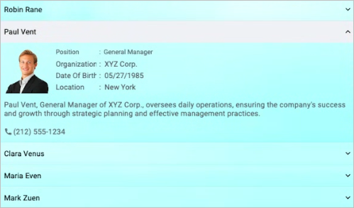

# Liquid Glass Effect in .NET MAUI Accordion (SfAccordion)

The Liquid Glass Effect introduces a modern, translucent design with adaptive color tinting and light refraction, creating a sleek, glass like user experience that remains clear and accessible. This section explains how to enable and customize the effect in the Syncfusion® .NET MAUI Accordion (SfAccordion) control.

## Apply liquid glass effect

Follow these steps to enable and configure the Liquid Glass Effect in the Accordion control:

### Step 1: Wrap the control inside glass effect view

To apply the Liquid Glass Effect to Syncfusion® .NET MAUI [SfAccordion](https://help.syncfusion.com/cr/maui/Syncfusion.Maui.Accordion.SfAccordion.html), wrap it inside the [SfGlassEffectView](https://help.syncfusion.com/cr/maui/Syncfusion.Maui.Core.SfGlassEffectView.html).

For more details, refer to the [Liquid Glass Getting Started documentation](https://help.syncfusion.com/maui/liquid-glass-ui/getting-started).

### Step 2: Enable the liquid glass effect on Accordion

Set the [EnableLiquidGlassEffect](https://help.syncfusion.com/cr/maui/Syncfusion.Maui.Accordion.SfAccordion.html#Syncfusion_Maui_Accordion_SfAccordion_EnableLiquidGlassEffect) property to `true` in the [SfAccordion](https://help.syncfusion.com/cr/maui/Syncfusion.Maui.Accordion.SfAccordion.html) control. When enabled, the effect is applied to all accordion items and provides responsive interaction for a smooth and engaging user experience. 

### Step 3: Customize the background

To achieve a glass like background, set the `Background` property to `Transparent`. The background will then be treated as a tinted color, ensuring a consistent glass effect across the controls.

The following code snippet demonstrates how to apply the Liquid Glass Effect to the [SfAccordion](https://help.syncfusion.com/cr/maui/Syncfusion.Maui.Accordion.SfAccordion.html) control:



<Grid>
    <Grid.Background>
        <LinearGradientBrush StartPoint="0,0"
                             EndPoint="0,1">
            <GradientStop Color="#0F4C75" Offset="0.0"/>
            <GradientStop Color="#3282B8" Offset="0.5"/>
            <GradientStop Color="#1B262C" Offset="1.0"/>
        </LinearGradientBrush>
    </Grid.Background>

    <core:SfGlassEffectView EffectType="Regular"
                            CornerRadius="20">
        <syncfusion:SfAccordion Background="Transparent"
                                EnableLiquidGlassEffect="True">
            <syncfusion:SfAccordion.Items>
                <syncfusion:AccordionItem>
                    <syncfusion:AccordionItem.Header>
                        <Grid  HeightRequest="48">
                            <Label Text="Robin Rane" Margin="16,14,0,14" CharacterSpacing="0.25" FontFamily="Roboto-Regular"  FontSize="14" />
                        </Grid>
                    </syncfusion:AccordionItem.Header>
                    <syncfusion:AccordionItem.Content>
                        <Grid ColumnSpacing="10" RowSpacing="2">
                            <Grid Margin="16,6,0,0">
                                <Grid.Resources>
                                    
                                </Grid.Resources>
                                <Grid.RowDefinitions >
                                    <RowDefinition Height="25"/>
                                    <RowDefinition Height="25"/>
                                    <RowDefinition Height="25"/>
                                    <RowDefinition Height="25"/>
                                    <RowDefinition Height="{OnPlatform Default=90,Android=90,WinUI=70, iOS=100,MacCatalyst=70 }"/>
                                    <RowDefinition Height="Auto"/>
                                </Grid.RowDefinitions>
                                <Grid.ColumnDefinitions>
                                    <ColumnDefinition Width="100"/>
                                    <ColumnDefinition Width="100"/>
                                    <ColumnDefinition Width="*"/>
                                </Grid.ColumnDefinitions>
                                <Border Grid.RowSpan="4"
                                        Grid.Row="0"
                                        Grid.Column="0"
                                        Padding="0"
                                        Margin="0,0,0,7">
                                    <Image  Source="emp_01.png" />
                                </Border>
                                <Label Text="Position" Grid.Column="1" Grid.Row="0" Margin="6,0,0,0"/>
                                <Label Text="Chairman" Grid.Row="0" Grid.Column="2"/>
                                <Label Text="Organization " Grid.Row="1" Grid.Column="1" Margin="6,0,0,0"/>
                                <Label Text="ABC Inc." Grid.Row="1" Grid.Column="2"/>
                                <Label Text="Date Of Birth " Grid.Row="2" Grid.Column="1" Margin="6,0,0,0"/>
                                <Label Text="09/17/1973" Grid.Row="2" Grid.Column="2"/>
                                <Label Text="Location " Grid.Row="3" Grid.Column="1" Margin="6,0,0,0"/>
                                <Label Text="Boston" Grid.Row="3" Grid.Column="2"/>
                                <Label Padding="0,10,0,10" Grid.Row="4" Grid.ColumnSpan="3"  LineBreakMode="WordWrap"  
                                       FontSize="14" CharacterSpacing="0.25" VerticalTextAlignment="Center" 
                                       Text="Robin Rane, Chairman of ABC Inc., leads with dedication and vision.Under his guidance, the company thrives and continues to make a significant impact in the industry.">
                                </Label>
                                <StackLayout Grid.Row="5" Orientation="Horizontal" Margin="0,0,0,12">
                                    <Label Text="&#xe700;" FontSize="16" Margin="0,2,2,2"
                                           FontFamily='{OnPlatform Android=AccordionFontIcons.ttf#,WinUI=AccordionFontIcons.ttf#AccordionFontIcons,MacCatalyst=AccordionFontIcons,iOS=AccordionFontIcons}'
                                           VerticalOptions="Center" VerticalTextAlignment="Center"/>
                                    <Label Text="(617) 555-1234" Grid.Column="1" VerticalOptions="Center" CharacterSpacing="0.25" FontSize="14"/>
                                </StackLayout>
                            </Grid>
                        </Grid>
                    </syncfusion:AccordionItem.Content>
                </syncfusion:AccordionItem>
                ..........................
            </syncfusion:SfAccordion.Items>
        </syncfusion:SfAccordion>
    </core:SfGlassEffectView>
</Grid>


using Syncfusion.Maui.Core;
using Syncfusion.Maui.Accordion;

var gradientBrush = new LinearGradientBrush
{
    StartPoint = new Point(0, 0),
    EndPoint = new Point(0, 1),
    GradientStops = new GradientStopCollection
    {
        new GradientStop { Color = Color.FromArgb("#0F4C75"), Offset = 0.0f },
        new GradientStop { Color = Color.FromArgb("#3282B8"), Offset = 0.5f },
        new GradientStop { Color = Color.FromArgb("#1B262C"), Offset = 1.0f }
    }
};

var grid = new Grid
{
    Background = gradientBrush
};

var glassView = new SfGlassEffectView
{
    CornerRadius = 20,
    EffectType = LiquidGlassEffectType.Regular
};

var accordion = new SfAccordion
{
    Background = Colors.Transparent,
    EnableLiquidGlassEffect = true
};

var accordionItem = new AccordionItem();

var headerGrid = new Grid
{
    HeightRequest = 48
};

var headerLabel = new Label
{
    Text = "Robin Rane",
    Margin = new Thickness(16, 14, 0, 14),
    CharacterSpacing = 0.25,
    FontFamily = "Roboto-Regular",
    FontSize = 14
};

headerGrid.Children.Add(headerLabel);
accordionItem.Header = headerGrid;

var contentOuterGrid = new Grid
{
    ColumnSpacing = 10,
    RowSpacing = 2
};

var contentGrid = new Grid
{
    Margin = new Thickness(16, 6, 0, 0)
};

var labelStyle = new Style(typeof(Label));
labelStyle.Setters.Add(new Setter { Property = Label.FontFamilyProperty, Value = "Roboto-Regular" });
contentGrid.Resources = new ResourceDictionary();
contentGrid.Resources.Add(labelStyle);
contentGrid.RowDefinitions.Add(new RowDefinition { Height = 25 });
contentGrid.RowDefinitions.Add(new RowDefinition { Height = 25 });
contentGrid.RowDefinitions.Add(new RowDefinition { Height = 25 });
contentGrid.RowDefinitions.Add(new RowDefinition { Height = 25 });
contentGrid.RowDefinitions.Add(new RowDefinition { Height = DeviceInfo.Platform == DevicePlatform.Android ? 90 : DeviceInfo.Platform == DevicePlatform.WinUI ? 70 : DeviceInfo.Platform == DevicePlatform.iOS ? 100 : DeviceInfo.Platform == DevicePlatform.MacCatalyst ? 70 : 90 });
contentGrid.RowDefinitions.Add(new RowDefinition { Height = GridLength.Auto });
contentGrid.ColumnDefinitions.Add(new ColumnDefinition { Width = 100 });
contentGrid.ColumnDefinitions.Add(new ColumnDefinition { Width = 100 });
contentGrid.ColumnDefinitions.Add(new ColumnDefinition { Width = GridLength.Star });
var border = new Border
{
    Padding = 0,
    Margin = new Thickness(0, 0, 0, 7)
};

Grid.SetRow(border, 0);
Grid.SetColumn(border, 0);
Grid.SetRowSpan(border, 4);
var image = new Image
{
    Source = "emp_01.png"
};

border.Content = image;
contentGrid.Children.Add(border);

var positionLabel = new Label { Text = "Position", Margin = new Thickness(6, 0, 0, 0) };
Grid.SetRow(positionLabel, 0);
Grid.SetColumn(positionLabel, 1);
contentGrid.Children.Add(positionLabel);

var chairmanLabel = new Label { Text = "Chairman" };
Grid.SetRow(chairmanLabel, 0);
Grid.SetColumn(chairmanLabel, 2);
contentGrid.Children.Add(chairmanLabel);

var organizationLabel = new Label { Text = "Organization ", Margin = new Thickness(6, 0, 0, 0) };
Grid.SetRow(organizationLabel, 1);
Grid.SetColumn(organizationLabel, 1);
contentGrid.Children.Add(organizationLabel);

var abcIncLabel = new Label { Text = "ABC Inc." };
Grid.SetRow(abcIncLabel, 1);
Grid.SetColumn(abcIncLabel, 2);
contentGrid.Children.Add(abcIncLabel);

var dobLabel = new Label { Text = "Date Of Birth ", Margin = new Thickness(6, 0, 0, 0) };
Grid.SetRow(dobLabel, 2);
Grid.SetColumn(dobLabel, 1);
contentGrid.Children.Add(dobLabel);

var dateLabel = new Label { Text = "09/17/1973" };
Grid.SetRow(dateLabel, 2);
Grid.SetColumn(dateLabel, 2);
contentGrid.Children.Add(dateLabel);

var locationTitleLabel = new Label { Text = "Location ", Margin = new Thickness(6, 0, 0, 0) };
Grid.SetRow(locationTitleLabel, 3);
Grid.SetColumn(locationTitleLabel, 1);
contentGrid.Children.Add(locationTitleLabel);

var locationLabel = new Label { Text = "Boston" };
Grid.SetRow(locationLabel, 3);
Grid.SetColumn(locationLabel, 2);
contentGrid.Children.Add(locationLabel);

var descriptionLabel = new Label
{
    Padding = new Thickness(0, 10, 0, 10),
    LineBreakMode = LineBreakMode.WordWrap,
    FontSize = 14,
    CharacterSpacing = 0.25,
    VerticalTextAlignment = TextAlignment.Center,
    Text = "Robin Rane, Chairman of ABC Inc., leads with dedication and vision.Under his guidance, the company thrives and continues to make a significant impact in the industry."
};

Grid.SetRow(descriptionLabel, 4);
Grid.SetColumnSpan(descriptionLabel, 3);
contentGrid.Children.Add(descriptionLabel);

var phoneStack = new StackLayout
{
    Orientation = StackOrientation.Horizontal,
    Margin = new Thickness(0, 0, 0, 12)
};

Grid.SetRow(phoneStack, 5);

var phoneIcon = new Label
{
    Text = "\ue700",
    FontSize = 16,
    Margin = new Thickness(0, 2, 2, 2),
    FontFamily = DeviceInfo.Platform == DevicePlatform.Android ? "AccordionFontIcons.ttf#" :
                    DeviceInfo.Platform == DevicePlatform.WinUI ? "AccordionFontIcons.ttf#AccordionFontIcons" :
                    "AccordionFontIcons",
    VerticalOptions = LayoutOptions.Center,
    VerticalTextAlignment = TextAlignment.Center
};

var phoneNumber = new Label
{
    Text = "(617) 555-1234",
    VerticalOptions = LayoutOptions.Center,
    CharacterSpacing = 0.25,
    FontSize = 14
};

phoneStack.Children.Add(phoneIcon);
phoneStack.Children.Add(phoneNumber);
contentGrid.Children.Add(phoneStack);
contentOuterGrid.Children.Add(contentGrid);
accordionItem.Content = contentOuterGrid;
accordion.Items.Add(accordionItem);
glassView.Content = accordion;
grid.Children.Add(glassView);
this.Content = grid;



The following screenshot illustrates SfAccordion within SfGlassEffectView.

   

N>
* Supported on `macOS 26 or higher` and `iOS 26 or higher`.
* This feature is available only in `.NET 10.`