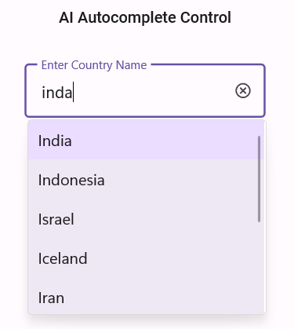

# Implementing AI-Powered Smart Search in .NET MAUI Autocomplete

This document will walk you through the implementation of an advanced search functionality in the Syncfusion [.NET MAUI Autocomplete](https://help.syncfusion.com/cr/maui/Syncfusion.Maui.Inputs.SfAutocomplete.html) control. The example leverages the power of Azure OpenAI for an intelligent, AI-driven search experience.

## Integrating Azure OpenAI with your .NET MAUI App

First, ensure you have access to [Azure OpenAI](https://learn.microsoft.com/en-us/azure/ai-foundry/openai/overview) and have created a deployment in the Azure portal.

If you don’t have access, please refer to the [create and deploy Azure OpenAI service](https://learn.microsoft.com/en-us/azure/ai-foundry/openai/how-to/create-resource?pivots=web-portal) guide to set up a new account.

Note down the deployment name, endpoint URL, and API key.

we’ll use the [Azure.AI.OpenAI](https://www.nuget.org/packages/Azure.AI.OpenAI/1.0.0-beta.12) NuGet package from the [NuGet Gallery](https://www.nuget.org/). So, before getting started, install the Azure.AI.OpenAI NuGet package in your .NET MAUI app.

In your base service class (AzureBaseService), initialize the OpenAIClient. Replace the Endpoint, DeploymentName, Key with actual values from your Azure OpenAI resource.

This creates a chat client using your endpoint, API key, and deployment name. It’s stored in the Client property for use in other methods.

ComboBoxAzureAIService use this Client to send prompts and receive completions.

In the `GetCompletion` method, we will construct the prompt and send it to the Azure OpenAI Service. The ChatHistory helps maintain context but is cleared for each new prompt in this implementation to ensure each search is independent.




// AzureBaseService.cs
    public abstract class AzureBaseService
    {        
        internal const string Endpoint = "YOUR_END_POINT_NAME";

        internal const string DeploymentName = "DEPLOYMENT_NAME";

        internal const string Key = "API_KEY";

        public AzureBaseService()
        {
        }
                        
        /// 

        /// To get the Azure open ai kernal method
        /// 

        private void GetAzureOpenAIKernal()
        {
            try
            {
                var client = new AzureOpenAIClient(new Uri(Endpoint), new AzureKeyCredential(Key)).AsChatClient(modelId: DeploymentName);
                this.Client = client;
            }
            catch (Exception)
            {
            }
        }
        
    }








//AzureAIService.cs

public class AzureAIService : AzureBaseService
    {
        /// 

        /// Gets a completion response from the AzureAI service based on the provided prompt.
        /// 

        /// <param name="prompt"></param>
        /// <param name="cancellationToken"></param>
        /// <returns></returns>
        public async Task<string> GetCompletion(string prompt, CancellationToken cancellationToken)
        {
            ChatHistory = string.Empty;
            if(ChatHistory != null)
            {
                ChatHistory = ChatHistory + "You are a filtering assistant.";
                ChatHistory = ChatHistory + prompt;
                try
                {
                    if (Client != null)
                    {
                        cancellationToken.ThrowIfCancellationRequested();
                        var chatresponse = await Client.CompleteAsync(prompt);
                        return chatresponse.ToString();
                    }
                }
                catch (RequestFailedException ex)
                {
                    // Log the error message and rethrow the exception or handle it appropriately
                    Debug.WriteLine($"Request failed: {ex.Message}");
                    throw;
                }
                catch (Exception ex)
                {
                    // Handle other potential exceptions
                    Debug.WriteLine($"An error occurred: {ex.Message}");
                    throw;
                }
            }
            return "";
        }
    }





## Implementing custom filtering in .NET MAUI Autocomplete

The [.NET MAUI Autocomplete](https://help.syncfusion.com/cr/maui/Syncfusion.Maui.Inputs.SfAutocomplete.html) control allows you to apply custom filter logic to suggest items based on your specific filter criteria by utilizing the `FilterBehavior` property, which is the entry point for our smart search logic.

**Step 1:** Let’s create a new business model to search country names. Refer to the following code example.




// Model.cs

public class CountryModel
{
    public string? Name { get; set; }
}

//ViewModel.cs

internal class CountryViewModel : INotifyPropertyChanged
    {
        private ObservableCollection<CountryModel> countries;

        public ObservableCollection<CountryModel> Countries
        {
            get { return countries; }
            set { countries = value; OnPropertyChanged(nameof(Countries)); }
        }
        public CountryViewModel()
        {
            countries = new ObservableCollection<CountryModel>
            {
                new CountryModel { Name = "Afghanistan" },
                new CountryModel { Name = "Akrotiri" },
                new CountryModel { Name = "Albania" },
                new CountryModel { Name = "Algeria" },
                new CountryModel { Name = "American Samoa" },
                new CountryModel { Name = "Andorra" },
                new CountryModel { Name = "Angola" },
                new CountryModel { Name = "Anguilla" },
                ....
            }
        }

        public event PropertyChangedEventHandler? PropertyChanged;

        private void OnPropertyChanged(string propertyName)
        {
            PropertyChanged?.Invoke(this, new PropertyChangedEventArgs(propertyName));
        }
    }





**Step 2:** Connecting the Custom Filter to Azure OpenAI

Implement the `GetMatchingItemsAsync` method from the interface. This method is the heart of the custom filter. It is invoked every time the text in the [Autocomplete](https://help.syncfusion.com/cr/maui/Syncfusion.Maui.Inputs.SfAutocomplete.html) control changes. 

The logic within [Autocomplete](https://help.syncfusion.com/cr/maui/Syncfusion.Maui.Inputs.SfAutocomplete.html) intelligently decides whether to perform an online AI search based on the availability of Azure credentials.

To get accurate and structured results from the AI, we must provide a detailed prompt. This is constructed inside the 
`FilterCountriesUsingAzureAI` method.

The `FilterCountriesUsingAzureAI` method uses prompt engineering to instruct the AI on how to filter the results, including asking it to handle spelling mistakes and providing the response in a clean format.




//CustomFilter.cs

public class CustomFilter : IAutocompleteFilterBehavior
    {
        private readonly AzureAIService _azureAIService;
        public ObservableCollection<CountryModel> Countries { get; set; }
        public ObservableCollection<CountryModel> FilteredCountries { get; set; } = new ObservableCollection<CountryModel>();
        private CancellationTokenSource? _cancellationTokenSource;
        private SoundexAndLevensteinDistance soundexAndLevensteinDistance;
      
        public CustomFilter()
        {
            _azureAIService = new AzureAIService();
            Countries = new ObservableCollection<CountryModel>();
            _cancellationTokenSource = new CancellationTokenSource();
            soundexAndLevensteinDistance = new SoundexAndLevensteinDistance();
        }

        /// 

        ///  Finds matching items using the typed text
        /// 

        /// <param name="source"></param>
        /// <param name="filterInfo"></param>
        /// <returns></returns>
        public async Task<object?> GetMatchingItemsAsync(SfAutocomplete source, AutocompleteFilterInfo filterInfo)
        {
            if (string.IsNullOrEmpty(filterInfo.Text))
            {
                _cancellationTokenSource?.Cancel();
                FilteredCountries.Clear();
                return await Task.FromResult(FilteredCountries);
            }

            Countries = (ObservableCollection<CountryModel>)source.ItemsSource;

            // If the API key is not provided, perform an offline search using Soundex and Levenshtein algorithms.
            if (!AzureBaseService.IsCredentialValid)
            {
                foreach (CountryModel country in Countries)
                {
                    soundexAndLevensteinDistance.FilterItemsBySoundexAndLevenshtein(filterInfo.Text, country.Name!);
                }
                var filteredItems = soundexAndLevensteinDistance.GetOrder();

                return await Task.FromResult(filteredItems);
            }

            string listItems = string.Join(", ", Countries!.Select(c => c.Name));
          
            // Join the first five items with newline characters for demo output template for AI           
            string outputTemplate = string.Join("\n", Countries.Take(5).Select(c => c.Name));

            //The cancellationToken was used for cancelling the API request if user types continuously       
            _cancellationTokenSource?.Cancel();
            _cancellationTokenSource = new CancellationTokenSource();
            var cancellationToken = _cancellationTokenSource.Token;

            //Passing the User Input, ItemsSource, Reference output and CancellationToken
            var filterCountries = await FilterCountriesUsingAzureAI(filterInfo.Text, listItems, outputTemplate, cancellationToken);

            return await Task.FromResult(filterCountries);
        }

        /// 

        /// Filters country names based on user input using Azure AI.
        /// 

        /// <param name="userInput"></param>
        /// <param name="itemsList"></param>
        /// <param name="outputTemplate"></param>
        /// <param name="cancellationToken"></param>
        /// <returns></returns>
        public async Task<ObservableCollection<CountryModel>> FilterCountriesUsingAzureAI(string userInput, string itemsList, string outputTemplate, CancellationToken cancellationToken)
        {
            if (!string.IsNullOrEmpty(userInput))
            {
                var prompt = $"Filter the list items based on the user input using character Starting with and Phonetic algorithms like Soundex or Damerau-Levenshtein Distance. " +
                            $"The filter should ignore spelling mistakes and be case insensitive. " +
                            $"Return only the filtered items with each item in new line without any additional content like explanations, Hyphen, Numberings and - Minus sign. Ignore the content 'Here are the filtered items or similar things' " +
                            $"Only return items that are present in the List Items. " +
                            $"Ensure that each filtered item is returned in its entirety without missing any part of its content. " +
                            $"Arrange the filtered items that starting with the user input's first letter are at the first index, followed by other matches. " +
                            $"Examples of filtering behavior: " +
                            $" userInput: a, filter the items starting with A " +
                            $" userInput: b, filter items starting with B " +
                            $" userInput: c, filter items starting with C " +
                            $" userInput: d, filter items starting with D " +
                            $" userInput: e, filter items starting with E " +
                            $" userInput: f, filter items starting with F " +
                            $" userInput: i, filter items starting with I " +
                            $" userInput: z, filter items starting with Z " +
                            $" userInput: l, filter items starting with L " +
                            $" userInput: q, filter items starting with Q " +
                            $" userInput: o, filter items starting with O " +
                            $" userInput: in, filter items starting with In " +
                            $" userInput: pa, filter items starting with Pa " +
                            $" userInput: em, filter items starting with Em " +
                            $"The example data are for reference, dont provide these as output. Filter the item from list items properly" +
                            $"Here is the User input: {userInput}, " +
                            $"List of Items: {itemsList}" +
                            $"If no items found, return \"Empty\" " +
                            $"Dont use 'Here are the filtered items:' in the output. Check this demo output template, you should return output like this: {outputTemplate} ";
            
                var completion = await _azureAIService.GetCompletion(prompt, cancellationToken);

                var filteredCountryNames = completion.Split('\n').Select(x => x.Trim()).Where(x => !string.IsNullOrEmpty(x)).ToList();

                if (FilteredCountries.Count > 0)
                    FilteredCountries.Clear();
                FilteredCountries.AddRange(
                              Countries
                               .Where(i => filteredCountryNames.Any(item => i.Name!.StartsWith(item))));
            }
            return FilteredCountries;
        }

    }





**Step:3** Applying Custom Filtering to AutoComplete

Applying custom filtering to the [Autocomplete](https://help.syncfusion.com/cr/maui/Syncfusion.Maui.Inputs.SfAutocomplete.html) control by using the `FilterBehavior` property.




    <editors:SfAutocomplete x:Name="autoComplete" 
                              DropDownPlacement="Bottom"
                              MaxDropDownHeight="200"
                              TextSearchMode="Contains"
                              DisplayMemberPath="Name"
                              TextMemberPath="Name"
                              ItemsSource="{Binding Countries}">
        <editors:SfAutocomplete.FilterBehavior>
            <local:CustomFilter/>
        </editors:SfAutocomplete.FilterBehavior>
    </editors:SfAutocomplete>





The following image demonstrates the output of the above AI-based search using a custom filtering sample.

You can find the complete sample from this [link](https://github.com/SyncfusionExamples/Smart-AI-Searching-using-.NET-MAUI-Autocomplete).

By combining a powerful AI-driven online search with a robust you can create a truly smart and reliable search experience in your .NET MAUI applications.