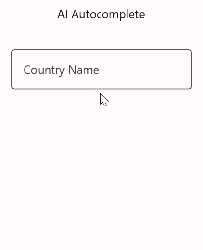

# Implementing AI-Powered Smart Search in .NET MAUI Autocomplete

This document will walk you through the implementation of an advanced search functionality in the Syncfusion [.NET MAUI Autocomplete](https://help.syncfusion.com/cr/maui/Syncfusion.Maui.Inputs.SfAutocomplete.html) control. The example leverages the power of Azure OpenAI for an intelligent, AI-driven search experience.

## Prerequisites

Before you begin, ensure you have the following:

- A working .NET MAUI application with the Syncfusion.Maui.Inputs package installed.
- An active Azure subscription with access to [Azure OpenAI](https://learn.microsoft.com/en-us/azure/ai-foundry/openai/overview) and a deployed model. If you don’t have access, refer to the [create and deploy Azure OpenAI service](https://learn.microsoft.com/en-us/azure/ai-foundry/openai/how-to/create-resource?pivots=web-portal) guide to set up a new account. Note down the deployment name, endpoint URL, and API key.
- The [Azure.AI.OpenAI](https://www.nuget.org/packages/Azure.AI.OpenAI) NuGet package (version 2.x recommended for the `IChatClient` API used in this sample). Install it by running the following command in the Visual Studio Package Manager Console:

    ```powershell
    Install-Package Azure.AI.OpenAI -Version 2.0.0
    ```

    Or using the .NET CLI:

    ```bash
    dotnet add package Azure.AI.OpenAI --version 2.0.0
    ```

## Integrating Azure OpenAI with your .NET MAUI App

The sample uses two service classes: an `AzureBaseService` that holds the shared client, and an `AzureAIService` that builds prompts and calls the AI.

**Step 1:** Create the base service class (`AzureBaseService.cs`). Replace the `Endpoint`, `DeploymentName`, and `Key` constants with the actual values from your Azure OpenAI resource.

**Step 2:** Create the `AzureAIService` class that inherits from `AzureBaseService`. The `GetCompletion` method builds the prompt and calls Azure OpenAI. The conversation history is reset for each request so every search is independent.




// AzureBaseService.cs
using System.ClientModel;
using Azure;
using Azure.AI.OpenAI;
using OpenAI.Chat;
using Microsoft.Extensions.AI;

public abstract class AzureBaseService
{
    internal const string Endpoint = "YOUR_END_POINT_NAME";
    internal const string DeploymentName = "DEPLOYMENT_NAME";
    internal const string Key = "API_KEY";

    /// <summary>
    /// Gets a value indicating whether the Azure OpenAI credentials are configured.
    /// Set this to false to fall back to the offline phonetic filter.
    /// </summary>
    public static bool IsCredentialValid { get; set; } = true;

    /// <summary>
    /// Gets the shared chat client used by derived services.
    /// </summary>
    protected IChatClient? Client { get; private set; }

    /// <summary>
    /// Stores the system instructions appended to every prompt.
    /// </summary>
    protected string ChatHistory { get; set; } = string.Empty;

    public AzureBaseService()
    {
        GetAzureOpenAIKernal();
    }

    /// <summary>
    /// Initializes the Azure OpenAI chat client using the configured endpoint, key, and deployment.
    /// </summary>
    private void GetAzureOpenAIKernal()
    {
        try
        {
            var client = new AzureOpenAIClient(new Uri(Endpoint), new AzureKeyCredential(Key))
                .AsChatClient(modelId: DeploymentName);
            this.Client = client;
        }
        catch (Exception ex)
        {
            Debug.WriteLine($"Failed to initialize Azure OpenAI client: {ex.Message}");
            IsCredentialValid = false;
        }
    }
}








// AzureAIService.cs
using System.Diagnostics;
using OpenAI.Chat;

public class AzureAIService : AzureBaseService
{
    /// <summary>
    /// Gets a completion response from the Azure OpenAI service for the supplied prompt.
    /// </summary>
    public async Task<string> GetCompletion(string prompt, CancellationToken cancellationToken)
    {
        if (Client is null)
        {
            return string.Empty;
        }

        cancellationToken.ThrowIfCancellationRequested();

        var messages = new List<ChatMessage>
        {
            new SystemChatMessage("You are a filtering assistant."),
            new UserChatMessage(prompt)
        };

        try
        {
            var chatResponse = await Client.CompleteAsync(messages, cancellationToken: cancellationToken);
            return chatResponse.Choices[0].Message.Text ?? string.Empty;
        }
        catch (RequestFailedException ex)
        {
            Debug.WriteLine($"Request failed: {ex.Message}");
            throw;
        }
        catch (Exception ex)
        {
            Debug.WriteLine($"An error occurred: {ex.Message}");
            throw;
        }
    }
}





## Implementing custom filtering in .NET MAUI Autocomplete

The [.NET MAUI Autocomplete](https://help.syncfusion.com/cr/maui/Syncfusion.Maui.Inputs.SfAutocomplete.html) control allows you to apply custom filter logic to suggest items based on your filter criteria by using the [FilterBehavior](https://help.syncfusion.com/cr/maui/Syncfusion.Maui.Inputs.SfAutocomplete.html#Syncfusion_Maui_Inputs_SfAutocomplete_FilterBehavior) property, which is the entry point for the smart search logic.

**Step 1:** Create a model and a view model to hold the country data.




// Model.cs
public class CountryModel
{
    public string? Name { get; set; }
}

// ViewModel.cs
using System.Collections.ObjectModel;
using System.ComponentModel;

internal class CountryViewModel : INotifyPropertyChanged
{
    private ObservableCollection<CountryModel> countries;

    public ObservableCollection<CountryModel> Countries
    {
        get => countries;
        set
        {
            countries = value;
            OnPropertyChanged(nameof(Countries));
        }
    }

    public CountryViewModel()
    {
        countries = new ObservableCollection<CountryModel>
        {
            new CountryModel { Name = "Afghanistan" },
            new CountryModel { Name = "Akrotiri" },
            new CountryModel { Name = "Albania" },
            new CountryModel { Name = "Algeria" },
            new CountryModel { Name = "American Samoa" },
            new CountryModel { Name = "Andorra" },
            new CountryModel { Name = "Angola" },
            new CountryModel { Name = "Anguilla" }
            // Add more country entries here
        };
    }

    public event PropertyChangedEventHandler? PropertyChanged;

    private void OnPropertyChanged(string propertyName)
    {
        PropertyChanged?.Invoke(this, new PropertyChangedEventArgs(propertyName));
    }
}





**Step 2:** Implement the offline phonetic fallback (`SoundexAndLevensteinDistance`).

The `CustomFilter` class uses a `SoundexAndLevensteinDistance` helper to perform an offline search when Azure credentials are unavailable. Add the following helper class:




// SoundexAndLevensteinDistance.cs
public class SoundexAndLevensteinDistance
{
    private readonly Dictionary<string, int> _scores = new();

    public void FilterItemsBySoundexAndLevenshtein(string userInput, string item)
    {
        if (string.IsNullOrWhiteSpace(userInput) || string.IsNullOrWhiteSpace(item))
        {
            return;
        }

        var soundexScore = Soundex(userInput) == Soundex(item) ? 2 : 0;
        var levenshteinScore = Math.Max(0, 5 - Levenshtein(userInput, item));
        _scores[item] = soundexScore + levenshteinScore;
    }

    public IEnumerable<string> GetOrder() => _scores
        .Where(kvp => kvp.Value > 0)
        .OrderByDescending(kvp => kvp.Value)
        .Select(kvp => kvp.Key);

    private static string Soundex(string value)
    {
        // Soundex implementation
        // ...
        return value.ToUpperInvariant();
    }

    private static int Levenshtein(string a, string b)
    {
        // Standard Levenshtein distance implementation
        // ...
        return 0;
    }
}





**Step 3:** Create the custom filter that connects to Azure OpenAI.

The `CustomFilter` class implements [`IAutocompleteFilterBehavior`](https://help.syncfusion.com/cr/maui/Syncfusion.Maui.Inputs.DropDownControls.IAutocompleteFilterBehavior.html). The `GetMatchingItemsAsync` method runs every time the text in the SfAutocomplete changes, and the class decides whether to perform an online AI search or use the offline phonetic fallback based on `AzureBaseService.IsCredentialValid`. The `FilterCountriesUsingAzureAI` method uses prompt engineering to ask the AI to filter results, handle spelling mistakes, and respond in a clean newline-delimited format.




// CustomFilter.cs
using System.Collections.ObjectModel;
using Syncfusion.Maui.Inputs;

public class CustomFilter : IAutocompleteFilterBehavior
{
    private readonly AzureAIService _azureAIService;
    public ObservableCollection<CountryModel> Countries { get; set; } = new();
    public ObservableCollection<CountryModel> FilteredCountries { get; set; } = new();
    private CancellationTokenSource? _cancellationTokenSource;
    private readonly SoundexAndLevensteinDistance _soundexAndLevensteinDistance;

    public CustomFilter()
    {
        _azureAIService = new AzureAIService();
        _cancellationTokenSource = new CancellationTokenSource();
        _soundexAndLevensteinDistance = new SoundexAndLevensteinDistance();
    }

    /// <summary>
    /// Finds matching items using the typed text.
    /// </summary>
    public async Task<object?> GetMatchingItemsAsync(SfAutocomplete source, AutocompleteFilterInfo filterInfo)
    {
        if (string.IsNullOrEmpty(filterInfo.Text))
        {
            _cancellationTokenSource?.Cancel();
            FilteredCountries.Clear();
            return await Task.FromResult<object?>(FilteredCountries);
        }

        // Cast ItemsSource to IEnumerable<CountryModel> rather than assuming the concrete type.
        var countries = (source.ItemsSource as IEnumerable<CountryModel>)?.ToList() ?? new List<CountryModel>();
        Countries = new ObservableCollection<CountryModel>(countries);

        // Use the offline phonetic fallback when Azure credentials are not configured.
        if (!AzureBaseService.IsCredentialValid)
        {
            foreach (var country in Countries)
            {
                _soundexAndLevensteinDistance.FilterItemsBySoundexAndLevenshtein(filterInfo.Text, country.Name!);
            }

            var filteredItems = _soundexAndLevensteinDistance.GetOrder()
                .Select(name => Countries.FirstOrDefault(c => c.Name == name))
                .Where(c => c is not null)
                .Cast<CountryModel>()
                .ToList();

            FilteredCountries.Clear();
            foreach (var item in filteredItems)
            {
                FilteredCountries.Add(item);
            }
            return await Task.FromResult<object?>(FilteredCountries);
        }

        var listItems = string.Join(", ", Countries.Select(c => c.Name));
        var outputTemplate = string.Join("\n", Countries.Take(5).Select(c => c.Name));

        // Cancel any in-flight request and start a new one so that the result reflects the latest keystroke.
        _cancellationTokenSource?.Cancel();
        _cancellationTokenSource = new CancellationTokenSource();
        var cancellationToken = _cancellationTokenSource.Token;

        var filterCountries = await FilterCountriesUsingAzureAI(
            filterInfo.Text, listItems, outputTemplate, cancellationToken);

        return await Task.FromResult<object?>(filterCountries);
    }

    /// <summary>
    /// Filters country names based on user input using Azure AI.
    /// </summary>
    public async Task<ObservableCollection<CountryModel>> FilterCountriesUsingAzureAI(
        string userInput, string itemsList, string outputTemplate, CancellationToken cancellationToken)
    {
        if (string.IsNullOrEmpty(userInput))
        {
            return FilteredCountries;
        }

        var prompt = "Filter the list items based on the user input using character starts-with and phonetic algorithms like Soundex or Damerau-Levenshtein. " +
                     "The filter should ignore spelling mistakes and be case-insensitive. " +
                     "Return only the filtered items, with each item on a new line, without explanations, hyphens, or numbering. " +
                     "Only return items that are present in the List Items. " +
                     "Arrange the items that start with the user input's first letter first, followed by other matches. " +
                     $"User input: {userInput}. " +
                     $"List of Items: {itemsList}. " +
                     "If no items found, return \"Empty\". " +
                     $"Return the output in this format: {outputTemplate}.";

        var completion = await _azureAIService.GetCompletion(prompt, cancellationToken);

        var filteredCountryNames = completion
            .Split('\n')
            .Select(x => x.Trim())
            .Where(x => !string.IsNullOrEmpty(x))
            .ToList();

        FilteredCountries.Clear();
        foreach (var item in Countries.Where(c => filteredCountryNames.Any(name => c.Name!.StartsWith(name, StringComparison.OrdinalIgnoreCase))))
        {
            FilteredCountries.Add(item);
        }

        return FilteredCountries;
    }
}





**Step 4:** Apply the custom filter to the `SfAutocomplete` control by using the `FilterBehavior` property. Make sure the `xmlns:local` namespace points to the namespace where `CustomFilter` and `CountryViewModel` are defined.




<ContentPage xmlns="http://schemas.microsoft.com/dotnet/2021/maui"
             xmlns:x="http://schemas.microsoft.com/winfx/2009/xaml"
             xmlns:editors="clr-namespace:Syncfusion.Maui.Inputs;assembly=Syncfusion.Maui.Inputs"
             xmlns:local="clr-namespace:YourNamespace"
             x:Class="YourNamespace.AISearchPage">

    <ContentPage.BindingContext>
        <local:CountryViewModel />
    </ContentPage.BindingContext>

    <editors:SfAutocomplete x:Name="autoComplete"
                             DropDownPlacement="Bottom"
                             MaxDropDownHeight="200"
                             TextSearchMode="Contains"
                             DisplayMemberPath="Name"
                             TextMemberPath="Name"
                             ItemsSource="{Binding Countries}">
        <editors:SfAutocomplete.FilterBehavior>
            <local:CustomFilter />
        </editors:SfAutocomplete.FilterBehavior>
    </editors:SfAutocomplete>

</ContentPage>





The following gif demonstrates the output of the above AI-based search using the custom filtering sample.



You can find the complete sample at [SyncfusionExamples/Smart-AI-Searching-using-.NET-MAUI-Autocomplete](https://github.com/SyncfusionExamples/Smart-AI-Searching-using-.NET-MAUI-Autocomplete).

## Troubleshooting

- **Authentication errors:** Verify the `Endpoint`, `DeploymentName`, and `Key` constants in `AzureBaseService` match the values from the Azure portal. Set `AzureBaseService.IsCredentialValid = false` to use the offline fallback while you debug.
- **Empty AI responses:** If the model returns "Empty" or no items, simplify the prompt or check the AI service's content filtering settings.
- **OperationCanceledException:** Thrown when the user types continuously. The `CustomFilter` cancels the previous request before starting a new one, so this is expected behavior.
- **Offline fallback not matching:** Confirm that `SoundexAndLevensteinDistance.FilterItemsBySoundexAndLevenshtein` is called for every item and that the `GetOrder` method returns items in descending score order.

By combining a powerful AI-driven online search with a robust offline phonetic fallback, you can create a truly smart and reliable search experience in your .NET MAUI applications.