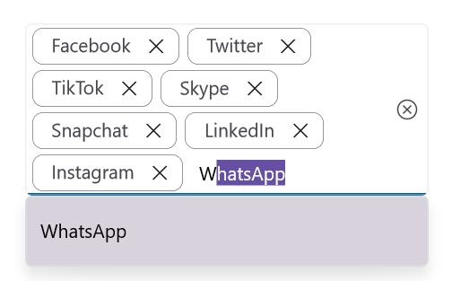

# Auto Sizing in .NET MAUI Autocomplete (SfAutocomplete)

## Prerequisites

Before using the [SfAutocomplete](https://help.syncfusion.com/cr/maui/Syncfusion.Maui.Inputs.SfAutocomplete.html), ensure the following NuGet package is installed in your .NET MAUI project:

- `Syncfusion.Maui.Inputs`

For a step-by-step setup, refer to the [Getting Started](https://help.syncfusion.com/maui/autocomplete/getting-started) documentation.

## Enabling auto sizing

Auto sizing can be enabled in the [SfAutocomplete](https://help.syncfusion.com/cr/maui/Syncfusion.Maui.Inputs.SfAutocomplete.html) so that the input area grows vertically to fit the selected tokens when the control is in multiple-selection mode.

To enable auto sizing, set the [EnableAutoSize](https://help.syncfusion.com/cr/maui/Syncfusion.Maui.Inputs.SfAutocomplete.html#Syncfusion_Maui_Inputs_SfAutocomplete_EnableAutoSize) property to `true`. The feature requires that the [SelectionMode](https://help.syncfusion.com/cr/maui/Syncfusion.Maui.Inputs.SfAutocomplete.html#Syncfusion_Maui_Inputs_SfAutocomplete_SelectionMode) is set to [Multiple](https://help.syncfusion.com/cr/maui/Syncfusion.Maui.Inputs.AutocompleteSelectionMode.html#Syncfusion_Maui_Inputs_AutocompleteSelectionMode_Multiple) and the [TokensWrapMode](https://help.syncfusion.com/cr/maui/Syncfusion.Maui.Inputs.SfAutocomplete.html#Syncfusion_Maui_Inputs_SfAutocomplete_TokensWrapMode) is set to [Wrap](https://help.syncfusion.com/cr/maui/Syncfusion.Maui.Inputs.AutocompleteTokensWrapMode.html#Syncfusion_Maui_Inputs_AutocompleteTokensWrapMode_Wrap); otherwise, the property has no visible effect. The default value of `EnableAutoSize` is `false`.

The following code example shows how to enable auto sizing in the [SfAutocomplete](https://help.syncfusion.com/cr/maui/Syncfusion.Maui.Inputs.SfAutocomplete.html):




<editors:SfAutocomplete x:Name="autocomplete"
                        ItemsSource="{Binding SocialMedias}"
                        SelectionMode="Multiple"
                        DisplayMemberPath="Name"
                        TextMemberPath="Name"
                        Placeholder="Enter Media"
                        TokensWrapMode="Wrap"
                        EnableAutoSize="True" />




SfAutocomplete autocomplete = new SfAutocomplete()
{
    ItemsSource = new SocialMediaViewModel().SocialMedias,
    SelectionMode = AutocompleteSelectionMode.Multiple,
    DisplayMemberPath = "Name",
    TextMemberPath = "Name",
    Placeholder = "Enter Media",
    TokensWrapMode = AutocompleteTokensWrapMode.Wrap,
    EnableAutoSize = true
};




// ViewModel
public class SocialMediaViewModel
{
    public ObservableCollection<SocialMedia> SocialMedias { get; set; }

    public SocialMediaViewModel()
    {
        this.SocialMedias = new ObservableCollection<SocialMedia>
        {
            new SocialMedia { Name = "Facebook", ID = 0 },
            new SocialMedia { Name = "Google Plus", ID = 1 },
            new SocialMedia { Name = "Instagram", ID = 2 },
            new SocialMedia { Name = "LinkedIn", ID = 3 },
            new SocialMedia { Name = "Skype", ID = 4 },
            new SocialMedia { Name = "Telegram", ID = 5 },
            new SocialMedia { Name = "Twitter", ID = 6 },
            new SocialMedia { Name = "WhatsApp", ID = 7 },
            new SocialMedia { Name = "YouTube", ID = 8 }
        };
    }
}

public class SocialMedia
{
    public string Name { get; set; }
    public int ID { get; set; }
}




The following image illustrates the auto-sized Autocomplete as the selected tokens wrap to the next line:

## See also

- [Selection](https://help.syncfusion.com/maui/autocomplete/selection)
- [UI Customization](https://help.syncfusion.com/maui/autocomplete/ui-customization)
- [Getting Started](https://help.syncfusion.com/maui/autocomplete/getting-started)
