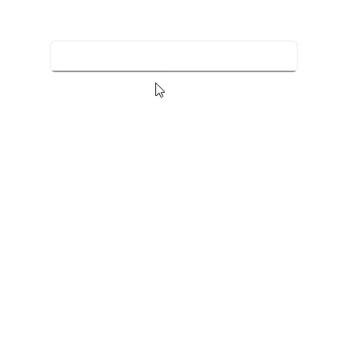

# Basic Features with .NET MAUI Autocomplete (SfAutocomplete)

## Selection

The [.NET MAUI Autocomplete](https://help.syncfusion.com/cr/maui/Syncfusion.Maui.Inputs.SfAutocomplete.html) allows the user to select an item from the drop-down list by clicking the `Enter` key or losing focus from the text box.




<editors:SfAutocomplete x:Name="autocomplete"
                        DisplayMemberPath = "Name"
                        TextMemberPath = "Name"
                        ItemsSource="{Binding SocialMedias}" />




SfAutocomplete autocomplete = new SfAutocomplete()
{
    DisplayMemberPath = "Name",
    TextMemberPath = "Name",
    ItemsSource = socialMediaViewModel.SocialMedias,
};




The following image illustrates the output:

## Text

The [Text](https://help.syncfusion.com/cr/maui/Syncfusion.Maui.Inputs.DropDownControls.DropDownListBase.html#Syncfusion_Maui_Inputs_DropDownControls_DropDownListBase_Text) property is used to get the user-submitted text in the [SfAutocomplete](https://help.syncfusion.com/cr/maui/Syncfusion.Maui.Inputs.SfAutocomplete.html). The default value of the `Text` property is `string.Empty`.

## Automation ID

The [SfAutocomplete](https://help.syncfusion.com/cr/maui/Syncfusion.Maui.Inputs.SfAutocomplete.html) control provides `AutomationId` support specifically for the `editable entry` and the `clear button`, enabling UI automation frameworks to reliably target these two elements. Each element’s AutomationId is derived from the control’s `AutomationId` to ensure uniqueness. 

For example, if the SfAutocomplete’s `AutomationId` is set to “Employee Autocomplete,” the editable entry can be targeted as “Employee Autocomplete Entry” and the clear button as “Employee Autocomplete Clear Button.” This focused support improves accessibility and automated UI testing by providing stable, predictable identifiers for the primary interactive elements

The following screenshot illustrates the AutomationIds of inner elements.

