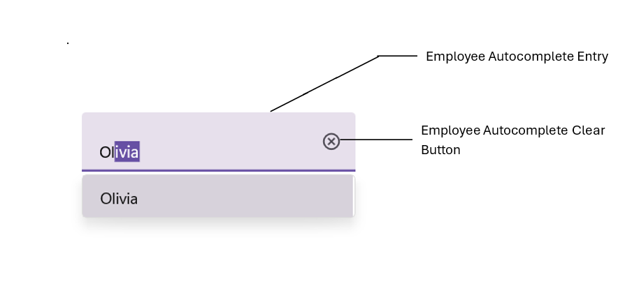

# Basic Features with .NET MAUI Autocomplete (SfAutocomplete)

## Prerequisites

Before using the [SfAutocomplete](https://help.syncfusion.com/cr/maui/Syncfusion.Maui.Inputs.SfAutocomplete.html), ensure the following NuGet package is installed in your .NET MAUI project:

- `Syncfusion.Maui.Inputs`

For a step-by-step setup, refer to the [Getting Started](Getting-Started.md) documentation.

## Selection

The [.NET MAUI Autocomplete](https://help.syncfusion.com/cr/maui/Syncfusion.Maui.Inputs.SfAutocomplete.html) allows the user to select an item from the drop-down list by clicking or tapping the item, pressing the `Enter` key, or losing focus from the text box. By default, the [SelectionMode](https://help.syncfusion.com/cr/maui/Syncfusion.Maui.Inputs.SfAutocomplete.html#Syncfusion_Maui_Inputs_SfAutocomplete_SelectionMode) is `Single`.

### Selection properties

| Property | Type | Description |
|----------|------|-------------|
| `SelectedItem` | `object` | Gets or sets the currently selected item. |
| `SelectedValue` | `object` | Gets or sets the value of the selected item based on `ValueMemberPath`. |
| `SelectionMode` | `SelectionMode` | Specifies whether single or multiple selection is enabled. Default is `Single`. |

The following code example shows how to configure the basic selection behavior in the [SfAutocomplete](https://help.syncfusion.com/cr/maui/Syncfusion.Maui.Inputs.SfAutocomplete.html):




<editors:SfAutocomplete x:Name="autocomplete"
                        DisplayMemberPath = "Name"
                        TextMemberPath = "Name"
                        ItemsSource="{Binding SocialMedias}"
                        SelectionChanged="autocomplete_SelectionChanged" />




using Syncfusion.Maui.Inputs;

SfAutocomplete autocomplete = new SfAutocomplete()
{
    DisplayMemberPath = "Name",
    TextMemberPath = "Name",
    ItemsSource = new List<SocialMedia>
    {
        new SocialMedia { Name = "Facebook" },
        new SocialMedia { Name = "Twitter" },
        new SocialMedia { Name = "Instagram" },
        new SocialMedia { Name = "LinkedIn" }
    },
};
autocomplete.SelectionChanged += autocomplete_SelectionChanged;




The following image illustrates the output:

For more information about selection, refer to the [Selection](Selection.md) documentation.

## Text

The [Text](https://help.syncfusion.com/cr/maui/Syncfusion.Maui.Inputs.DropDownControls.DropDownListBase.html#Syncfusion_Maui_Inputs_DropDownControls_DropDownListBase_Text) property is used to get the text entered by the user in the [SfAutocomplete](https://help.syncfusion.com/cr/maui/Syncfusion.Maui.Inputs.SfAutocomplete.html). The default value of the `Text` property is `string.Empty`. The `Text` property is updated live as the user types and is also updated when an item is selected from the drop-down list.

## Automation ID

The [SfAutocomplete](https://help.syncfusion.com/cr/maui/Syncfusion.Maui.Inputs.SfAutocomplete.html) control provides `AutomationId` support for the input field and the clear button, enabling UI automation frameworks to reliably target these elements. Each element's `AutomationId` is derived from the control's `AutomationId` to ensure uniqueness.

For example, if the SfAutocomplete’s `AutomationId` is set to “Employee Autocomplete,” the editable entry can be targeted as “Employee Autocomplete Entry” and the clear button as “Employee Autocomplete Clear Button.” This focused support improves accessibility and automated UI testing by providing stable, predictable identifiers for the primary interactive elements

### Example

For example, if the [SfAutocomplete](https://help.syncfusion.com/cr/maui/Syncfusion.Maui.Inputs.SfAutocomplete.html)'s `AutomationId` is set to "Employee Autocomplete", the input field can be targeted as "Employee Autocomplete Entry" and the clear button as "Employee Autocomplete Clear Button". This support improves accessibility and automated UI testing by providing stable, predictable identifiers for the primary interactive elements.




<editors:SfAutocomplete x:Name="autocomplete"
                        AutomationId="Employee Autocomplete" />




using Syncfusion.Maui.Inputs;

SfAutocomplete autocomplete = new SfAutocomplete()
{
    AutomationId = "Employee Autocomplete",
};




The following screenshot illustrates the AutomationIds of the inner elements:

## See also

- [Selection](Selection.md)
- [Getting Started](Getting-Started.md)
- [UI Customization](UI-Customization.md)