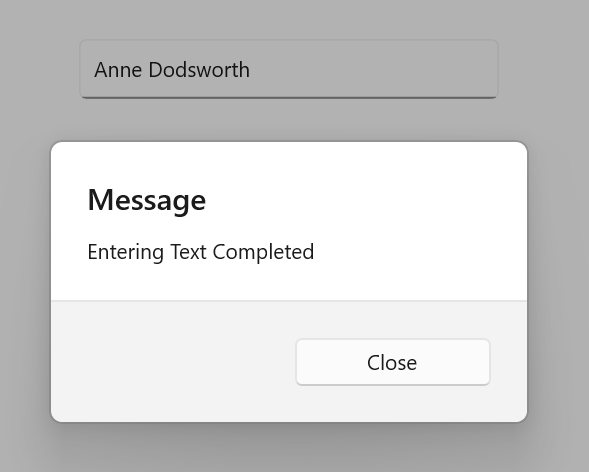

# Events in .NET MAUI Autocomplete

This section explains different Events available in the [.NET MAUI Autocomplete](https://help.syncfusion.com/cr/maui/Syncfusion.Maui.Inputs.SfAutocomplete.html) control.

## Prerequisites

Before using the [SfAutocomplete](https://help.syncfusion.com/cr/maui/Syncfusion.Maui.Inputs.SfAutocomplete.html), ensure the following NuGet package is installed in your .NET MAUI project:

- `Syncfusion.Maui.Inputs`

For a step-by-step setup, refer to the [Getting Started](https://help.syncfusion.com/maui/autocomplete/getting-started) documentation.

To get started quickly on customizing the appearance of the .NET MAUI Autocomplete, you can check out this video:



# Events

## Completed Event

The [Completed](https://help.syncfusion.com/cr/maui/Syncfusion.Maui.Inputs.DropDownControls.DropDownListBase.html#Syncfusion_Maui_Inputs_DropDownControls_DropDownListBase_Completed) event is raised when the user finalizes the text in the [SfAutocomplete](https://help.syncfusion.com/cr/maui/Syncfusion.Maui.Inputs.SfAutocomplete.html) by pressing the return key on the keyboard. The handler for the event is a generic event handler, taking the `sender` and `EventArgs`:




<editors:SfAutocomplete x:Name="autocomplete"
                        ItemsSource="{Binding SocialMedias}"
                        DisplayMemberPath="Name"
                        TextMemberPath="Name"
                        Completed="Autocomplete_Completed" />




private async void Autocomplete_Completed(object sender, EventArgs e)
{
    await DisplayAlert("Message", "Text entering Completed", "close");
}




// ViewModel
public class SocialMediaViewModel
{
    public ObservableCollection<SocialMedia> SocialMedias { get; set; }

    public SocialMediaViewModel()
    {
        this.SocialMedias = new ObservableCollection<SocialMedia>
        {
            new SocialMedia { Name = "Facebook", ID = 0 },
            new SocialMedia { Name = "Google Plus", ID = 1 },
            new SocialMedia { Name = "Instagram", ID = 2 },
            new SocialMedia { Name = "LinkedIn", ID = 3 },
            new SocialMedia { Name = "Skype", ID = 4 },
            new SocialMedia { Name = "Telegram", ID = 5 },
            new SocialMedia { Name = "Twitter", ID = 6 },
            new SocialMedia { Name = "WhatsApp", ID = 7 },
            new SocialMedia { Name = "YouTube", ID = 8 }
        };
    }
}

public class SocialMedia
{
    public string Name { get; set; }
    public int ID { get; set; }
}




Completed event can be subscribed in C# also:




SfAutocomplete autocomplete = new SfAutocomplete
{
    ItemsSource = socialMediaViewModel.SocialMedias,
    DisplayMemberPath = "Name",
    TextMemberPath = "Name"
};
autocomplete.Completed+=Autocomplete_Completed;




The following image illustrates the result of the above code:

N> The `Completed` event is not supported in the Android platform.

## DropDownOpening Event

The [DropDownOpening](https://help.syncfusion.com/cr/maui/Syncfusion.Maui.Core.SfDropdownEntry.html#Syncfusion_Maui_Core_SfDropdownEntry_DropdownOpening) event is raised when the dropdown menu is about to open in the `SfAutocomplete`. The event uses `CancelEventArgs`, which exposes the following property:

 * Cancel: Dropdown opening is based on this value.





<editors:SfAutocomplete x:Name="autocomplete"
                        DropdownOpening="Autocomplete_DropdownOpening"
                        ItemsSource="{Binding SocialMedias}"
                        DisplayMemberPath="Name"
                        TextMemberPath="Name">
</editors:SfAutocomplete>
    




    SfAutocomplete autocomplete = new SfAutocomplete
    {
        ItemsSource = socialMediaViewModel.SocialMedias,
        DisplayMemberPath = "Name",
        TextMemberPath = "Name"
    };
    autocomplete.DropdownOpening += Autocomplete_DropdownOpening;




// ViewModel
public class SocialMediaViewModel
{
    public ObservableCollection<SocialMedia> SocialMedias { get; set; }

    public SocialMediaViewModel()
    {
        this.SocialMedias = new ObservableCollection<SocialMedia>
        {
            new SocialMedia { Name = "Facebook", ID = 0 },
            new SocialMedia { Name = "Google Plus", ID = 1 },
            new SocialMedia { Name = "Instagram", ID = 2 },
            new SocialMedia { Name = "LinkedIn", ID = 3 },
            new SocialMedia { Name = "Skype", ID = 4 },
            new SocialMedia { Name = "Telegram", ID = 5 },
            new SocialMedia { Name = "Twitter", ID = 6 },
            new SocialMedia { Name = "WhatsApp", ID = 7 },
            new SocialMedia { Name = "YouTube", ID = 8 }
        };
    }
}

public class SocialMedia
{
    public string Name { get; set; }
    public int ID { get; set; }
}







    
 private void Autocomplete_DropdownOpening(object sender, CancelEventArgs e)
 {
     e.Cancel = true; // If you want to restrict the dropdown open then set the e.Cancel is true. 
 }
 




## DropDownOpened Event

The [DropDownOpened](https://help.syncfusion.com/cr/maui/Syncfusion.Maui.Core.SfDropdownEntry.html#Syncfusion_Maui_Core_SfDropdownEntry_DropdownOpened) event occurs when the SfAutocomplete drop-down is opened.





<editors:SfAutocomplete x:Name="autoComplete" 
                        DropdownOpened="Autocomplete_DropdownOpened"
                        ItemsSource="{Binding SocialMedias}"
                        DisplayMemberPath="Name"
                        TextMemberPath="Name">
</editors:SfAutocomplete>
 




    SfAutocomplete autocomplete = new SfAutocomplete
    {
        ItemsSource = socialMediaViewModel.SocialMedias,
        DisplayMemberPath = "Name",
        TextMemberPath = "Name"
    };
    autocomplete.DropdownOpened += Autocomplete_DropdownOpened;
    




// ViewModel
public class SocialMediaViewModel
{
    public ObservableCollection<SocialMedia> SocialMedias { get; set; }

    public SocialMediaViewModel()
    {
        this.SocialMedias = new ObservableCollection<SocialMedia>
        {
            new SocialMedia { Name = "Facebook", ID = 0 },
            new SocialMedia { Name = "Google Plus", ID = 1 },
            new SocialMedia { Name = "Instagram", ID = 2 },
            new SocialMedia { Name = "LinkedIn", ID = 3 },
            new SocialMedia { Name = "Skype", ID = 4 },
            new SocialMedia { Name = "Telegram", ID = 5 },
            new SocialMedia { Name = "Twitter", ID = 6 },
            new SocialMedia { Name = "WhatsApp", ID = 7 },
            new SocialMedia { Name = "YouTube", ID = 8 }
        };
    }
}

public class SocialMedia
{
    public string Name { get; set; }
    public int ID { get; set; }
}








  private void Autocomplete_DropdownOpened(object sender, EventArgs e)
  {
    // Trigger when the dropdown is opened
  }
   




## DropDownClosed Event

The [DropDownClosed](https://help.syncfusion.com/cr/maui/Syncfusion.Maui.Inputs.DropDownControls.DropDownListBase.html#Syncfusion_Maui_Inputs_DropDownControls_DropDownListBase_DropDownClosed) event occurs when the SfAutocomplete drop-down is closed.




    
<editors:SfAutocomplete x:Name="autocomplete" 
                        ItemsSource="{Binding SocialMedias}"
                        DisplayMemberPath="Name"
                        TextMemberPath="Name"
                        DropDownClosed="Autocomplete_DropDownClosed">
</editors:SfAutocomplete>



    SfAutocomplete autocomplete = new SfAutocomplete
    {
        ItemsSource = socialMediaViewModel.SocialMedias,
        DisplayMemberPath = "Name",
        TextMemberPath = "Name"
    };
    autocomplete.DropDownClosed += Autocomplete_DropDownClosed;




// ViewModel
public class SocialMediaViewModel
{
    public ObservableCollection<SocialMedia> SocialMedias { get; set; }

    public SocialMediaViewModel()
    {
        this.SocialMedias = new ObservableCollection<SocialMedia>
        {
            new SocialMedia { Name = "Facebook", ID = 0 },
            new SocialMedia { Name = "Google Plus", ID = 1 },
            new SocialMedia { Name = "Instagram", ID = 2 },
            new SocialMedia { Name = "LinkedIn", ID = 3 },
            new SocialMedia { Name = "Skype", ID = 4 },
            new SocialMedia { Name = "Telegram", ID = 5 },
            new SocialMedia { Name = "Twitter", ID = 6 },
            new SocialMedia { Name = "WhatsApp", ID = 7 },
            new SocialMedia { Name = "YouTube", ID = 8 }
        };
    }
}

public class SocialMedia
{
    public string Name { get; set; }
    public int ID { get; set; }
}






    
    private void Autocomplete_DropDownClosed(object sender, EventArgs e)
    {
        await DisplayAlert("Message", "DropDown Closed", "close");
    }




## ValueChanged Event
When the value of Autocomplete changes, the [ValueChanged](https://help.syncfusion.com/cr/maui/Syncfusion.Maui.Inputs.SfAutocomplete.html#Syncfusion_Maui_Inputs_SfAutocomplete_ValueChanged) event is triggered. This event is raised when the value changes due to user interaction, programmatic updates, or any other mechanism. It provides both `OldValue` and `NewValue`, allowing for responsive handling of changes. The ValueChanged event contains the following properties:

* `OldValue` - Contains the previous text value before the change.
* `NewValue` - Contains the new text value after the change.




<editors:SfAutocomplete x:Name="autocomplete"  
                        TextMemberPath="Name" 
                        DisplayMemberPath="Name" 
                        ItemsSource="{Binding SocialMedias}" 
                        ValueChanged="OnValueChanged" />





SfAutocomplete autocomplete = new SfAutocomplete
{
    ItemsSource = socialMediaViewModel.SocialMedias,
    DisplayMemberPath = "Name",
    TextMemberPath = "Name"
};
autocomplete.ValueChanged += OnValueChanged;




// ViewModel
public class SocialMediaViewModel
{
    public ObservableCollection<SocialMedia> SocialMedias { get; set; }

    public SocialMediaViewModel()
    {
        this.SocialMedias = new ObservableCollection<SocialMedia>
        {
            new SocialMedia { Name = "Facebook", ID = 0 },
            new SocialMedia { Name = "Google Plus", ID = 1 },
            new SocialMedia { Name = "Instagram", ID = 2 },
            new SocialMedia { Name = "LinkedIn", ID = 3 },
            new SocialMedia { Name = "Skype", ID = 4 },
            new SocialMedia { Name = "Telegram", ID = 5 },
            new SocialMedia { Name = "Twitter", ID = 6 },
            new SocialMedia { Name = "WhatsApp", ID = 7 },
            new SocialMedia { Name = "YouTube", ID = 8 }
        };
    }
}

public class SocialMedia
{
    public string Name { get; set; }
    public int ID { get; set; }
}




The ValueChanged event can be handled as follows:




private async void OnValueChanged(object sender, AutocompleteValueChangedEventArgs e)
{
    await DisplayAlert("Alert", "Value has changed to: " + e.NewValue.ToString(), "Ok");
}



 

## ClearButtonClicked Event

The [ClearButtonClicked]() event is raised when the user activates the clear button in the `SfAutocomplete` editable mode by tapping or pressing the clear button on the keyboard. The handler for the event is a generic event handler, taking the `sender` and `EventArgs`.




<editors:SfAutocomplete x:Name="autocomplete"
                        ItemsSource="{Binding SocialMedias}"
                        TextMemberPath="Name"
                        DisplayMemberPath="Name"
                        ClearButtonClicked="Autocomplete_ClearButtonClicked"/>




    SfAutocomplete autocomplete = new SfAutocomplete
    {
        ItemsSource = socialMediaViewModel.SocialMedias,
        TextMemberPath = "Name",
        DisplayMemberPath = "Name"
    };
autocomplete.ClearButtonClicked += Autocomplete_ClearButtonClicked;




// ViewModel
public class SocialMediaViewModel
{
    public ObservableCollection<SocialMedia> SocialMedias { get; set; }

    public SocialMediaViewModel()
    {
        this.SocialMedias = new ObservableCollection<SocialMedia>
        {
            new SocialMedia { Name = "Facebook", ID = 0 },
            new SocialMedia { Name = "Google Plus", ID = 1 },
            new SocialMedia { Name = "Instagram", ID = 2 },
            new SocialMedia { Name = "LinkedIn", ID = 3 },
            new SocialMedia { Name = "Skype", ID = 4 },
            new SocialMedia { Name = "Telegram", ID = 5 },
            new SocialMedia { Name = "Twitter", ID = 6 },
            new SocialMedia { Name = "WhatsApp", ID = 7 },
            new SocialMedia { Name = "YouTube", ID = 8 }
        };
    }
}

public class SocialMedia
{
    public string Name { get; set; }
    public int ID { get; set; }
}




The `ClearButtonClicked` event can be handled as follows:



    
private async void Autocomplete_ClearButtonClicked(object sender, EventArgs e)
{
   await DisplayAlert("Message", "Clear Button Clicked", "ok");
}




## See also

- [Getting Started](https://help.syncfusion.com/maui/autocomplete/getting-started)
- [Basic Features](https://help.syncfusion.com/maui/autocomplete/basic-features)
- [Searching and Filtering](https://help.syncfusion.com/maui/autocomplete/searching-filtering)