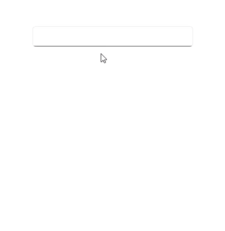

# Getting Started with .NET MAUI Autocomplete

This section guides you through setting up and configuring a [Autocomplete](https://help.syncfusion.com/cr/maui/Syncfusion.Maui.Inputs.SfAutocomplete.html) in your .NET MAUI application. Follow the steps below to add a basic Autocomplete to your project.

To quickly get started with the .NET MAUI Autocomplete, watch this video.






## Prerequisites

Before proceeding, ensure the following are in place:

1. Install [.NET 9 SDK](https://dotnet.microsoft.com/en-us/download/dotnet/9.0) or later.
2. Set up a .NET MAUI environment with Visual Studio 2022 v17.12 or later.

## Step 1: Create a New MAUI Project

1. Go to **File > New > Project** and choose the **.NET MAUI App** template.
2. Name the project and choose a location. Then, click **Next**.
3. Select the .NET framework version and click **Create**.

## Step 2: Install the Syncfusion® MAUI Inputs NuGet Package

1. In **Solution Explorer**, right-click the project and choose **Manage NuGet Packages**.
2. Search for [Syncfusion.Maui.Inputs](https://www.nuget.org/packages/Syncfusion.Maui.Inputs) and install the latest version.
3. Ensure the necessary dependencies are installed correctly, and the project is restored.




## Prerequisites

Before proceeding, ensure the following are set up:

1. Install [.NET 9 SDK](https://dotnet.microsoft.com/en-us/download/dotnet/9.0) or later.
2. Set up a .NET MAUI environment with Visual Studio Code.
3. Ensure that the .NET MAUI workloads are installed and configured as described [here](https://learn.microsoft.com/en-us/dotnet/maui/get-started/installation?view=net-maui-9.0&tabs=visual-studio-code).

## Step 1: Create a New MAUI Project

1. Open the Command Palette by pressing **Ctrl+Shift+P** and type **.NET:New Project** and press Enter.
2. Choose the **.NET MAUI App** template.
3. Select the project location, type the project name and press Enter.
4. Then choose **Create project**

## Step 2: Install the Syncfusion® MAUI Inputs NuGet Package

1. Press <kbd>Ctrl</kbd> + <kbd>`</kbd> (backtick) to open the integrated terminal in Visual Studio Code.
2. Ensure you're in the project root directory where your .csproj file is located.
3. Run the command `dotnet add package Syncfusion.Maui.Inputs` to install the Syncfusion® .NET MAUI Inputs package.
4. To ensure all dependencies are installed, run `dotnet restore`.




## Prerequisites

Before proceeding, ensure the following are set up:

1. Install [.NET 9 SDK](https://dotnet.microsoft.com/en-us/download/dotnet/9.0) or later.
2. Set up a .NET MAUI environment with JetBrains Rider 2024.3 or later.
3. Make sure the MAUI workloads are installed and configured as described [here.](https://www.jetbrains.com/help/rider/MAUI.html#before-you-start)

## Step 1: Create a new .NET MAUI Project

1. Go to **File > New Solution,** Select .NET (C#) and choose the .NET MAUI App template.
2. Enter the Project Name, Solution Name, and Location.
3. Select the .NET framework version and click Create.

## Step 2: Install the Syncfusion® MAUI Inputs NuGet Package

1. In **Solution Explorer,** right-click the project and choose **Manage NuGet Packages.**
2. Search for [Syncfusion.Maui.Inputs](https://www.nuget.org/packages/Syncfusion.Maui.Inputs/) and install the latest version.
3. Ensure the necessary dependencies are installed correctly, and the project is restored. If not, Open the Terminal in Rider and manually run: `dotnet restore`




## Step 3: Register Syncfusion handler

Make sure to add the namespace.


using Syncfusion.Maui.Core.Hosting;
 

Register the Syncfusion core handler in your `CreateMauiApp` method of `MauiProgram.cs` file to use Syncfusion controls.


builder.ConfigureSyncfusionCore();
 

## Step 4: Define Model and View Model

Create a simple model class called 'SocialMedia' with fields 'ID' and 'Name', and then populate social media data in the 'SocialMediaViewModel'.




//Model.cs
public class SocialMedia
{
    public string Name { get; set; }
    public int ID { get; set; }
}

//ViewModel.cs
public class SocialMediaViewModel
{
    public ObservableCollection<SocialMedia> SocialMedias { get; set; }
    public SocialMediaViewModel()
    {
        this.SocialMedias = new ObservableCollection<SocialMedia>();
        this.SocialMedias.Add(new SocialMedia() { Name = "Facebook", ID = 0 });
        this.SocialMedias.Add(new SocialMedia() { Name = "Google Plus", ID = 1 });
        this.SocialMedias.Add(new SocialMedia() { Name = "Instagram", ID = 2 });
        this.SocialMedias.Add(new SocialMedia() { Name = "LinkedIn", ID = 3 });
        this.SocialMedias.Add(new SocialMedia() { Name = "Skype", ID = 4 });
        this.SocialMedias.Add(new SocialMedia() { Name = "Telegram", ID = 5 });
        this.SocialMedias.Add(new SocialMedia() { Name = "Televzr", ID = 6 });
        this.SocialMedias.Add(new SocialMedia() { Name = "Tik Tok", ID = 7 });
    }
}




## Step 5: Import the Autocomplete namespace

Add the following namespace in your XAML or C#.



xmlns:inputs="clr-namespace:Syncfusion.Maui.Inputs;assembly=Syncfusion.Maui.Inputs"


using Syncfusion.Maui.Inputs;



## Step 6: Add the Autocomplete component

Create an instance for the Autocomplete control, and add it as content. Now, populate this 'SocialMediaViewModel' data in the [Autocomplete](https://help.syncfusion.com/cr/maui/Syncfusion.Maui.Inputs.SfAutocomplete.html) control by binding to the [ItemsSource](https://help.syncfusion.com/cr/maui/Syncfusion.Maui.Inputs.DropDownControls.DropDownListBase.html#Syncfusion_Maui_Inputs_DropDownControls_DropDownListBase_ItemsSource) property.

The [.NET MAUI Autocomplete](https://help.syncfusion.com/cr/maui/Syncfusion.Maui.Inputs.SfAutocomplete.html) control is populated with a list of social media options. However, since the 'SocialMedia' model includes two properties, 'Name' and 'ID', it's necessary to specify which property should be used as the display value in both the selection box portion and the drop-down suggestion list of the Autocomplete control.

**TextMemberPath**: This property path is used to retrieve the value that will be displayed in the selection box portion of the [.NET MAUI Autocomplete](https://help.syncfusion.com/cr/maui/Syncfusion.Maui.Inputs.SfAutocomplete.html) control when an item is selected. The default value is **String.Empty**.

**DisplayMemberPath**: This property path is used to specify the name or path of the property that will be displayed for each data item in the drop-down list. The default value is **String.Empty**.




<inputs:SfAutocomplete WidthRequest="250"
                       HeightRequest = "40"
                       DisplayMemberPath = "Name"
                       TextMemberPath = "Name"
                       ItemsSource="{Binding SocialMedias}">
    <inputs:SfAutocomplete.BindingContext>
        <local:SocialMediaViewModel />
    </inputs:SfAutocomplete.BindingContext>
</inputs:SfAutocomplete>





SocialMediaViewModel socialMediaViewModel = new SocialMediaViewModel();
SfAutocomplete autocomplete = new SfAutocomplete
{
    WidthRequest = 250,
    HeightRequest = 40,
    DisplayMemberPath = "Name",
    TextMemberPath = "Name",
    BindingContext = socialMediaViewModel,
    ItemsSource = socialMediaViewModel.SocialMedias,
};




The following image illustrates the output:

You can download the Autocomplete Getting Started sample from [GitHub](https://github.com/SyncfusionExamples/getting-started-with-the-dotnet-maui-autocomplete-control)

N> Set the BindingContext of your page to an instance of SocialMediaViewModel. This allows you to bind the properties of SocialMediaViewModel to the Autocomplete control.

N> When publishing in AOT mode on iOS, ensure [Preserve(AllMembers = true)] is added to the model class to maintain DisplayMemberPath binding

N> You can refer to our [.NET MAUI Autocomplete](https://www.syncfusion.com/maui-controls/maui-autocomplete) feature tour page for its groundbreaking feature representations. You can also explore our [.NET MAUI Autocomplete Example](https://github.com/SyncfusionExamples/maui-autocomplete-samples) that shows you how to render the Autocomplete in .NET MAUI.