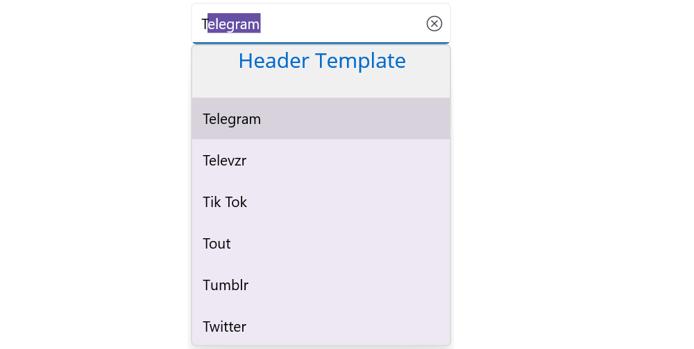

# Header and Footer support in .NET MAUI Autocomplete (SfAutocomplete)

We can provide Header and Footer view in the dropdown in [`SfAutocomplete`] by enabling [`ShowDropDownHeaderView`] and [`ShowDropDownFooterView`]. 

## Header Content

We can provide Header Content at the top of the Autocomplete's dropdown.[`DropDownHeaderView`] property is used to set the content of the header. The height of the Header in the [`SfAutocomplete`] can be adjusted by the property [`DropDownHeaderViewHeight`].





<?xml version="1.0" encoding="utf-8" ?>
<ContentPage xmlns="http://schemas.microsoft.com/dotnet/2021/maui"
             xmlns:x="http://schemas.microsoft.com/winfx/2009/xaml"
             xmlns:autocomplete="clr-namespace:Syncfusion.Maui.Inputs;assembly=Syncfusion.Maui.Inputs"
             xmlns:local="clr-namespace:AutocompleteSample"             
             x:Class="AutocompleteSample.MainPage">

    <ContentPage.BindingContext>
        <local:SocialMediaViewModel />
    </ContentPage.BindingContext>

    <StackLayout VerticalOptions="Start" 
                 HorizontalOptions="Start" 
                 Padding="30">
        <autocomplete:SfAutocomplete HeightRequest="40"
                                     ShowDropDownHeaderView ="True"
                                     ItemsSource="{Binding SocialMedias}"
                                     DisplayMemberPath="Name"
                                     DropDownHeaderViewHeight="50">
            <autocomplete:SfAutocomplete.DropDownHeaderView>
                <StackLayout BackgroundColor="#f0f0f0" >
                    <Label  x:Name="SearchLabel" 
                            FontSize="20" 
                            VerticalTextAlignment="Center" 
                            HorizontalOptions="Center" 
                            VerticalOptions="Center" 
                            TextColor="#006bcd"   />
                </StackLayout>
            </autocomplete:SfAutocomplete.DropDownHeaderView>
        </autocomplete:SfAutocomplete>
    </StackLayout>
</ContentPage>





using Syncfusion.Maui.Inputs;
using System.Collections.Generic;

namespace AutocompleteSample
{
    public partial class MainPage : ContentPage
    {
        Label SearchLabel;
        public MainPage()
        {
            InitializeComponent();
            StackLayout stackLayout = new StackLayout
            {
                VerticalOptions = LayoutOptions.Start,
                HorizontalOptions = LayoutOptions.Start,
                Padding = new Thickness(30)
            };

            SfAutocomplete autoComplete = new SfAutocomplete
            {
                HeightRequest = 40,
                ShowDropDownHeaderView = true,
                ItemsSource = new List<string> { "Facebook", "Twitter", "Instagram", "LinkedIn" },
                DropDownHeaderViewHeight = 50
            };

            StackLayout dropDownHeaderView = new StackLayout
            {
                BackgroundColor = Color.FromHex("#f0f0f0")
            };

            Label searchLabel = new Label
            {
                FontSize = 20,
                VerticalTextAlignment = TextAlignment.Center,
                HorizontalOptions = LayoutOptions.Center,
                VerticalOptions = LayoutOptions.Center,
                TextColor = Color.FromHex("#006bcd")
            };
            dropDownHeaderView.Children.Add(searchLabel);
            autoComplete.DropDownHeaderView = dropDownHeaderView;
            stackLayout.Children.Add(autoComplete);
            Content = stackLayout;
        }
    }
}





## Footer Content

We can provide Footer Content at the bottom of the Autocomplete's dropdown. [`DropDownFooterView`] property is used to set the content of the footer.The height of the Footer in the [`SfAutocomplete`] can be adjusted by the property [`DropDownFooterViewHeight`].

The following code example illustrate how to set Footer content in [`SfAutocomplete`].





<?xml version="1.0" encoding="utf-8" ?>
<ContentPage xmlns="http://schemas.microsoft.com/dotnet/2021/maui"
             xmlns:x="http://schemas.microsoft.com/winfx/2009/xaml"
             xmlns:autocomplete="clr-namespace:Syncfusion.Maui.Inputs;assembly=Syncfusion.Maui.Inputs"
             xmlns:local="clr-namespace:AutocompleteSample"             
             x:Class="AutocompleteSample.MainPage">

    <ContentPage.BindingContext>
        <local:SocialMediaViewModel />
    </ContentPage.BindingContext>

    <StackLayout VerticalOptions="Start" 
                 HorizontalOptions="Start" 
                 Padding="30">
        <autocomplete:SfAutocomplete HeightRequest="40"
                                     ShowDropDownFooterView ="True"
                                     ItemsSource = "{Binding SocialMedias}"
                                     DisplayMemberPath="Name"
                                     DropDownFooterViewHeight="50">
            <autocomplete:SfAutocomplete.DropDownFooterView>
                <StackLayout BackgroundColor="#f0f0f0" >
                    <Label  Text="Add New"
                            FontSize="20" 
                            VerticalTextAlignment="Center" 
                            HorizontalOptions="Center" 
                            VerticalOptions="Center" 
                            TextColor="#006bcd" />
                </StackLayout>
            </autocomplete:SfAutocomplete.DropDownFooterView>
        </autocomplete:SfAutocomplete>
    </StackLayout>
</ContentPage>





using Syncfusion.Maui.Inputs;
using System.Collections.Generic;

namespace AutocompleteSample
{
    public partial class MainPage : ContentPage
    {
        public MainPage()
        {
            InitializeComponent();
            StackLayout stackLayout = new StackLayout()
            {
                VerticalOptions = LayoutOptions.Start,
                HorizontalOptions = LayoutOptions.Start,
                Padding = new Thickness(30)
            };

            SfAutocomplete autoComplete = new SfAutocomplete()
            {
                HeightRequest = 40,
                ShowDropDownFooterView = true,
                ItemsSource = new List<string> { "Facebook", "Twitter", "Instagram", "LinkedIn" },
                DropDownFooterViewHeight = 50,
            };

            StackLayout layout = new StackLayout()
            {
                BackgroundColor = Color.FromHex("#f0f0f0")
            };

            Label SearchLabel = new Label()
            {
                FontSize = 20,
                Text = "Add New",
                VerticalTextAlignment = TextAlignment.Center,
                HorizontalOptions = LayoutOptions.Center,
                VerticalOptions = LayoutOptions.Center,
                TextColor = Color.FromHex("#006bcd")
            };

            layout.Children.Add(SearchLabel);
            autoComplete.DropDownFooterView = layout;
            stackLayout.Children.Add(autoComplete);
            this.Content = stackLayout;
        }
    }
}





