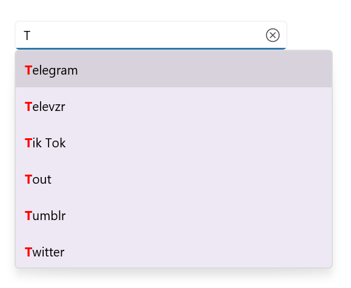
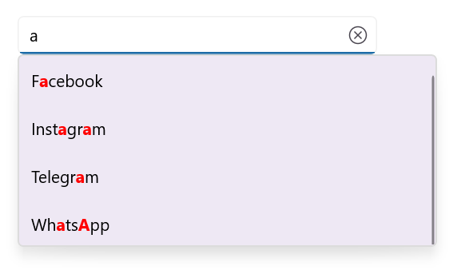

# Highlighting matched text in .NET MAUI Autocomplete (SfAutocomplete)

## Prerequisites

Before using the [SfAutocomplete](https://help.syncfusion.com/cr/maui/Syncfusion.Maui.Inputs.SfAutocomplete.html), ensure the following NuGet package is installed in your .NET MAUI project:

- `Syncfusion.Maui.Inputs`

For step-by-step setup, refer to the [Getting Started](Getting-Started.md) documentation.

## Overview

You can highlight the matching characters in each suggestion of the `SfAutocomplete` drop-down to help users identify the matching suggestion. There are two highlight modes:

- `FirstOccurrence` — highlights the first match in each suggestion.
- `MultipleOccurrence` — highlights every match in each suggestion (requires `TextSearchMode` to be `Contains`).

Use the following properties to customize the appearance of the highlighted text:

- `HighlightedTextColor` — the color applied to the highlighted characters.
- `HighlightedTextFontAttributes` — the font attributes applied to the highlighted characters (`None`, `Bold`, `Italic`, or `Bold, Italic`).

### Properties

| Property | Type | Default | Description |
|----------|------|---------|-------------|
| `TextHighlightMode` | `OccurrenceMode` | `None` | Specifies whether the first match or every match is highlighted. |
| `HighlightedTextColor` | `Color` | `Colors.Black` | Gets or sets the color of the highlighted text. |
| `HighlightedTextFontAttributes` | `FontAttributes` | `None` | Gets or sets the font attributes of the highlighted text. |
| `TextSearchMode` | `AutocompleteTextSearchMode` | `StartsWith` | Specifies how the input text is matched against the suggestion list. `MultipleOccurrence` requires `Contains`. |

## First Occurrence

Set `TextHighlightMode` to [FirstOccurrence](https://help.syncfusion.com/cr/maui/Syncfusion.Maui.Inputs.OccurrenceMode.html#Syncfusion_Maui_Inputs_OccurrenceMode_FirstOccurrence) to highlight the first match in each suggestion.





xmlns:editors="clr-namespace:Syncfusion.Maui.Inputs;assembly=Syncfusion.Maui.Inputs"

<editors:SfAutocomplete x:Name="autocomplete"
                        DisplayMemberPath="Name"
                        TextMemberPath="Name"
                        ItemsSource="{Binding SocialMedias}"
                        TextHighlightMode="FirstOccurrence"
                        HighlightedTextColor="Red"
                        HighlightedTextFontAttributes="Bold" />




using Syncfusion.Maui.Inputs;
using System.Collections.Generic;

SfAutocomplete autocomplete = new SfAutocomplete()
{
    DisplayMemberPath = "Name",
    TextMemberPath = "Name",
    ItemsSource = new List<SocialMedia>
    {
        new SocialMedia { Name = "Facebook" },
        new SocialMedia { Name = "Twitter" },
        new SocialMedia { Name = "Instagram" },
        new SocialMedia { Name = "LinkedIn" }
    },
    TextHighlightMode = OccurrenceMode.FirstOccurrence,
    HighlightedTextColor = Colors.Red,
    HighlightedTextFontAttributes = FontAttributes.Bold
};

public class SocialMedia
{
    public string Name { get; set; }
}





The following image illustrates first-occurrence highlighting in the SfAutocomplete drop-down:

## Multiple Occurrence

Set `TextHighlightMode` to [MultipleOccurrence](https://help.syncfusion.com/cr/maui/Syncfusion.Maui.Inputs.OccurrenceMode.html#Syncfusion_Maui_Inputs_OccurrenceMode_MultipleOccurrence) to highlight every match in each suggestion. This mode requires [TextSearchMode](https://help.syncfusion.com/cr/maui/Syncfusion.Maui.Inputs.SfAutocomplete.html#Syncfusion_Maui_Inputs_SfAutocomplete_TextSearchMode) to be set to [Contains](https://help.syncfusion.com/cr/maui/Syncfusion.Maui.Inputs.AutocompleteTextSearchMode.html#Syncfusion_Maui_Inputs_AutocompleteTextSearchMode_Contains); otherwise, only the first match is highlighted.





<editors:SfAutocomplete x:Name="autocomplete"
                        DisplayMemberPath="Name"
                        TextMemberPath="Name"
                        ItemsSource="{Binding SocialMedias}"
                        TextHighlightMode="MultipleOccurrence"
                        HighlightedTextColor="Red"
                        HighlightedTextFontAttributes="Bold"
                        TextSearchMode="Contains" />




using Syncfusion.Maui.Inputs;
using System.Collections.Generic;

SfAutocomplete autocomplete = new SfAutocomplete()
{
    DisplayMemberPath = "Name",
    TextMemberPath = "Name",
    ItemsSource = new List<SocialMedia>
    {
        new SocialMedia { Name = "Facebook" },
        new SocialMedia { Name = "Twitter" },
        new SocialMedia { Name = "Instagram" },
        new SocialMedia { Name = "LinkedIn" }
    },
    TextHighlightMode = OccurrenceMode.MultipleOccurrence,
    HighlightedTextColor = Colors.Red,
    HighlightedTextFontAttributes = FontAttributes.Bold,
    TextSearchMode = AutocompleteTextSearchMode.Contains
};





The following image illustrates multiple-occurrence highlighting in the SfAutocomplete drop-down:

## Notes

N> **Disabling highlighting**: Set `TextHighlightMode` to `OccurrenceMode.None` (or the XAML value `None`) to disable highlighting.

N> **iOS AOT**: When publishing in AOT mode on iOS, add `[Preserve(AllMembers = true)]` to the model class. The attribute requires `using Foundation;`.

## See also

- [Searching and Filtering](Searching-Filtering.md)
- [Selection](Selection.md)
- [Getting Started](Getting-Started.md)