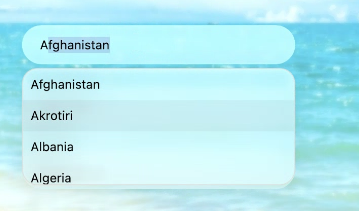

# Liquid Glass Effect in .NET MAUI Autocomplete (SfAutocomplete)

## Prerequisites

N> **Platform support**: The Liquid Glass Effect is supported only on .NET 10 with iOS 26 and macOS 26. On other platforms the effect is a no-op.

Before using the [SfAutocomplete](https://help.syncfusion.com/cr/maui/Syncfusion.Maui.Inputs.SfAutocomplete.html), ensure the following NuGet packages are installed in your .NET MAUI project:

- `Syncfusion.Maui.Inputs`
- `Syncfusion.Maui.Core` (for [SfGlassEffectView](https://help.syncfusion.com/cr/maui/Syncfusion.Maui.Core.SfGlassEffectView.html))

For step-by-step setup, refer to the [Getting Started](Getting-Started.md) documentation and the [Liquid Glass Getting Started](https://help.syncfusion.com/maui/autocomplete/liquidglasssupport) page.

## Overview

The Liquid Glass Effect introduces a modern, translucent design with adaptive color tinting and light refraction, creating a sleek, glass-like user experience that remains readable on top of any background. This section explains how to enable and customize the effect in the [SfAutocomplete](https://help.syncfusion.com/cr/maui/Syncfusion.Maui.Inputs.SfAutocomplete.html) control.

## Apply the liquid glass effect

Follow these steps to enable and configure the Liquid Glass Effect in the SfAutocomplete control:

### Step 1: Wrap the control inside the glass effect view

To apply the Liquid Glass Effect to the [SfAutocomplete](https://help.syncfusion.com/cr/maui/Syncfusion.Maui.Inputs.SfAutocomplete.html) control, wrap it inside the [SfGlassEffectView](https://help.syncfusion.com/cr/maui/Syncfusion.Maui.Core.SfGlassEffectView.html) class.

### Step 2: Enable the liquid glass effect on the SfAutocomplete

Set the [EnableLiquidGlassEffect](https://help.syncfusion.com/cr/maui/Syncfusion.Maui.Inputs.DropDownControls.DropDownListBase.html#Syncfusion_Maui_Inputs_DropDownControls_DropDownListBase_EnableLiquidGlassEffect) property to `true`. The default value is `false`. When enabled, the effect is also applied to the drop-down and suggestion list.

### Step 3: Customize the background

To achieve a glass-like background in the SfAutocomplete, set the `Background` and `DropDownBackground` properties to `Transparent`. The background is then treated as a tinted color, ensuring a consistent glass effect across the input and the drop-down. Make sure the parent layout's background is also transparent or a tinted color so the effect is visible.

### Properties

| Property | Type | Default | Description |
|----------|------|---------|-------------|
| `EnableLiquidGlassEffect` | `bool` | `false` | Gets or sets a value that indicates whether the Liquid Glass Effect is applied. |
| `Background` | `Brush` | `null` | Gets or sets the background of the input. Set to `Transparent` for the glass effect. |
| `DropDownBackground` | `Brush` | `null` | Gets or sets the background of the drop-down. Set to `Transparent` for the glass effect. |
| `SfGlassEffectView.EffectType` | `LiquidGlassEffectType` | `Regular` | The thickness of the glass effect. Values: `Clear`, `Regular`. |
| `SfGlassEffectView.CornerRadius` | `double` | `8.0` | The corner radius of the glass container. |

The following code snippet demonstrates how to apply the Liquid Glass Effect to the SfAutocomplete control:




xmlns:core="clr-namespace:Syncfusion.Maui.Core;assembly=Syncfusion.Maui.Core"
xmlns:autocomplete="clr-namespace:Syncfusion.Maui.Inputs;assembly=Syncfusion.Maui.Inputs"

<Grid BackgroundColor="Transparent">
    <Image Source="Wallpaper.png" Aspect="AspectFill" />
    <core:SfGlassEffectView EffectType="Regular"
                            CornerRadius="20">
        <autocomplete:SfAutocomplete x:Name="Autocomplete"
                                     Background="Transparent"
                                     HeightRequest="40"
                                     WidthRequest="300"
                                     ItemsSource="{Binding Names}"
                                     DisplayMemberPath="Name"
                                     TextMemberPath="Name"
                                     DropDownBackground="Transparent"
                                     EnableLiquidGlassEffect="True" />
    </core:SfGlassEffectView>
</Grid>




using Microsoft.Maui.Controls;
using Syncfusion.Maui.Core;
using Syncfusion.Maui.Inputs;
using System.Collections.Generic;

var grid = new Grid
{
    BackgroundColor = Colors.Transparent
};

var image = new Image
{
    Source = "Wallpaper.png",
    Aspect = Aspect.AspectFill
};
grid.Children.Add(image);

var glass = new SfGlassEffectView
{
    EffectType = LiquidGlassEffectType.Regular,
    CornerRadius = 20
};

var autocomplete = new SfAutocomplete
{
    Background = Colors.Transparent,
    HeightRequest = 40,
    WidthRequest = 300,
    DropDownBackground = Colors.Transparent,
    ItemsSource = new List<string> { "Jacob", "Will", "Noah", "Dustin" },
    EnableLiquidGlassEffect = true
};

glass.Content = autocomplete;
grid.Children.Add(glass);
this.Content = grid;




N> The `Wallpaper.png` image must be added to the project's `Resources/Images` folder and have its build action set to **MauiImage**. Register the namespace in `MauiProgram.cs` if required.

The following screenshot illustrates the SfAutocomplete with the Liquid Glass Effect applied to the input and the drop-down:

## Customize the effect

You can change the appearance of the glass effect by adjusting the `EffectType` and `CornerRadius` of the [SfGlassEffectView](https://help.syncfusion.com/cr/maui/Syncfusion.Maui.Core.SfGlassEffectView.html):

- `EffectType` — choose `Clear`, `Regular` (default) to control the glass thickness.
- `CornerRadius` — set a value in device-independent units to round the corners of the glass container.
- The `Background` and `DropDownBackground` of the SfAutocomplete can be set to any translucent `Color` (for example, `Colors.Transparent` or `Color.FromArgb("#80FFFFFF")`) to fine-tune the tint.

## Notes

N> **Platform support**: The Liquid Glass Effect is supported only on .NET 10 with iOS 26 and macOS 26. On other platforms the effect is a no-op.

N> **Image not visible**: If the `Wallpaper.png` image is not displayed, verify that it is added to `Resources/Images` with the **MauiImage** build action and that the `Image.Source` matches the filename.

N> **iOS AOT**: When publishing in AOT mode on iOS, add `[Preserve(AllMembers = true)]` to the model class. The attribute requires `using Foundation;`.

## See also

- [UI Customization](UI-Customization.md)
- [Selection](Selection.md)
- [Getting Started](Getting-Started.md) 