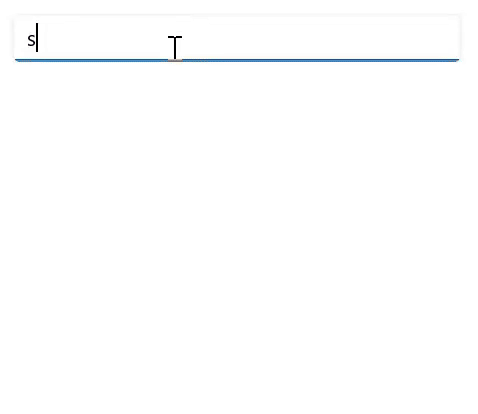
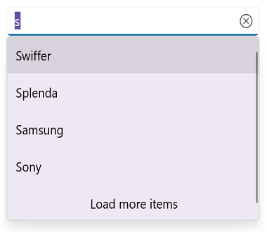
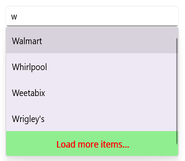

# LoadMore in .NET MAUI Autocomplete (SfAutocomplete)

You can limit the number of suggestions displayed by using the LoadMore functionality, which allows additional items to be loaded upon request. This is achieved by setting the [MaximumSuggestion](https://help.syncfusion.com/cr/maui/Syncfusion.Maui.Inputs.DropDownControls.DropDownListBase.html#Syncfusion_Maui_Inputs_DropDownControls_DropDownListBase_MaximumSuggestion) property.




 <editors:SfAutocomplete x:Name="autocomplete"
                         ItemsSource="{Binding SocialMedias}"
                         MaximumSuggestion="2"
                         DisplayMemberPath="Name"
                         TextMemberPath="Name" />





SfAutocomplete autocomplete = new SfAutocomplete()
{
    ItemsSource = socialMediaViewModel.SocialMedias,
    MaximumSuggestion = 2,
    DisplayMemberPath = "Name",
    TextMemberPath = "Name"
};




The following GIF illustrates the result of the above code:

## LoadMore Text Customization

The LoadMore feature allows you to customize the display text using the [LoadMoreText](https://help.syncfusion.com/cr/maui/Syncfusion.Maui.Inputs.DropDownControls.DropDownListBase.html#Syncfusion_Maui_Inputs_DropDownControls_DropDownListBase_LoadMoreText) property. This property lets you set custom text for the Load More button.




 <editors:SfAutocomplete x:Name="autocomplete"
                         ItemsSource="{Binding SocialMedias}"
                         MaximumSuggestion="2"
                         LoadMoreText="Load more items"
                         DisplayMemberPath="Name"
                         TextMemberPath="Name" />





SfAutocomplete autocomplete = new SfAutocomplete()
{
    ItemsSource = socialMediaViewModel.SocialMedias,
    MaximumSuggestion = 2,
    LoadMoreText= "Load more items"
    DisplayMemberPath = "Name",
    TextMemberPath = "Name",
};




The following GIF illustrates the result of the above code:

## LoadMore View Customization

SfAutocomplete allows customization of the Load More view's User Interface (UI). You can add a custom UI using the [LoadMoreTemplate](https://help.syncfusion.com/cr/maui/Syncfusion.Maui.Inputs.DropDownControls.DropDownListBase.html#Syncfusion_Maui_Inputs_DropDownControls_DropDownListBase_LoadMoreTemplate) property.




 <editors:SfAutocomplete x:Name="autocomplete"
                         ItemsSource="{Binding SocialMedias}"
                         MaximumSuggestion="2"
                         DisplayMemberPath="Name"
                         TextMemberPath="Name" >
                <editors:SfAutocomplete.LoadMoreTemplate>
                    <DataTemplate>
                        <Grid BackgroundColor="LightGreen">
                            <Label Text="Load more items..." VerticalOptions="Center" FontAttributes="Bold" HorizontalOptions="Center" TextColor="Red"/>
                        </Grid>
                    </DataTemplate>
                </editors:SfAutocomplete.LoadMoreTemplate>
            </editors:SfAutocomplete>





SfAutocomplete autocomplete = new SfAutocomplete()
{
    DisplayMemberPath = "Name",
    TextMemberPath = "Name",
    MaximumSuggestion = 2,
    ItemsSource = socialMediaViewModel.SocialMedias
};
autocomplete.LoadMoreTemplate = new DataTemplate(() =>
{
    var grid = new Grid();
    Label label = new Label();
    label.Text = "Load more items...";
    label.TextColor = Colors.Red;
    grid.Background = Colors.LightGreen;
    label.HorizontalOptions = LayoutOptions.Center;
    label.VerticalOptions = LayoutOptions.Center;
    label.FontAttributes = FontAttributes.Bold;
    grid.Children.Add(label);
    return grid;
});




The following gif image illustrates the result of the above code:

## LoadMore Button Tapped Event

The LoadMore support provides [LoadMoreButtonTapped](https://help.syncfusion.com/cr/maui/Syncfusion.Maui.Inputs.DropDownControls.DropDownListBase.html#Syncfusion_Maui_Inputs_DropDownControls_DropDownListBase_LoadMoreButtonTapped) Event. The event can be triggered only when you tap on the load more button.




 <editors:SfAutocomplete x:Name="autocomplete"
                         ItemsSource="{Binding SocialMedias}"
                         MaximumSuggestion="2"
                         LoadMoreButtonTapped="autocomplete_LoadMoreButtonTapped"
                         DisplayMemberPath="Name"
                         TextMemberPath="Name" >
             </editors:SfAutocomplete>





SfAutocomplete autocomplete = new SfAutocomplete()
{
    DisplayMemberPath = "Name",
    TextMemberPath = "Name",
    MaximumSuggestion = 2,
    ItemsSource = socialMediaViewModel.SocialMedias,
};
autocomplete.LoadMoreButtonTapped += Autocomplete_LoadMoreButtonTapped;

private void Autocomplete_LoadMoreButtonTapped(object? sender, EventArgs e)
{
    //Trigger when the Load More Button is Tapped
}




