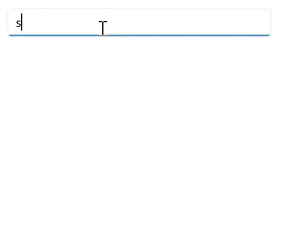
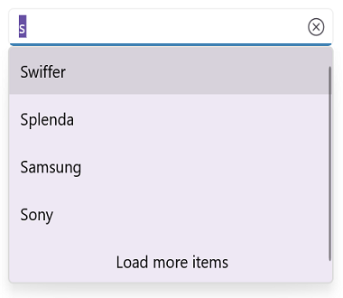
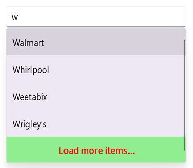

# LoadMore in .NET MAUI Autocomplete (SfAutocomplete)

## Prerequisites

Before using the [SfAutocomplete](https://help.syncfusion.com/cr/maui/Syncfusion.Maui.Inputs.SfAutocomplete.html), ensure the following NuGet package is installed in your .NET MAUI project:

- `Syncfusion.Maui.Inputs`

For step-by-step setup, refer to the [Getting Started](Getting-Started.md) documentation.

## Overview

You can restrict the number of suggestions shown in the drop-down of the `SfAutocomplete` and let users load the remaining items by tapping a LoadMore button. This page covers the `MaximumSuggestion` property, the `LoadMoreText` and `LoadMoreTemplate` customizations, and the `LoadMoreButtonTapped` event.

### Properties

| Property | Type | Default | Description |
|----------|------|---------|-------------|
| `MaximumSuggestion` | `int` | `0` (no limit) | Gets or sets the maximum number of suggestions to display before showing the LoadMore button. |
| `LoadMoreText` | `string` | `Load more` | Gets or sets the text displayed on the LoadMore button. |
| `LoadMoreTemplate` | `DataTemplate` | `null` | Gets or sets a custom template used to render the LoadMore button. |
| `LoadMoreButtonTapped` | `EventHandler` | - | Raised when the user taps the LoadMore button. |

## MaximumSuggestion

You can restrict the maximum number of suggestions displayed by setting the [MaximumSuggestion](https://help.syncfusion.com/cr/maui/Syncfusion.Maui.Inputs.DropDownControls.DropDownListBase.html#Syncfusion_Maui_Inputs_DropDownControls_DropDownListBase_MaximumSuggestion) property. When more items are available, a LoadMore button is shown at the bottom of the drop-down.




<editors:SfAutocomplete x:Name="autocomplete"
                        ItemsSource="{Binding SocialMedias}"
                        MaximumSuggestion="2"
                        DisplayMemberPath="Name"
                        TextMemberPath="Name" />




SfAutocomplete autocomplete = new SfAutocomplete
{
    ItemsSource = new SocialMediaViewModel().SocialMedias,
    MaximumSuggestion = 2,
    DisplayMemberPath = "Name",
    TextMemberPath = "Name"
};




// ViewModel
public class SocialMediaViewModel
{
    public ObservableCollection<SocialMedia> SocialMedias { get; set; }

    public SocialMediaViewModel()
    {
        this.SocialMedias = new ObservableCollection<SocialMedia>
        {
            new SocialMedia { Name = "Facebook", ID = 0 },
            new SocialMedia { Name = "Google Plus", ID = 1 },
            new SocialMedia { Name = "Instagram", ID = 2 },
            new SocialMedia { Name = "LinkedIn", ID = 3 },
            new SocialMedia { Name = "Skype", ID = 4 },
            new SocialMedia { Name = "Telegram", ID = 5 },
            new SocialMedia { Name = "Twitter", ID = 6 },
            new SocialMedia { Name = "WhatsApp", ID = 7 },
            new SocialMedia { Name = "YouTube", ID = 8 }
        };
    }
}

public class SocialMedia
{
    public string Name { get; set; }
    public int ID { get; set; }
}




The following image illustrates the LoadMore button shown after the maximum number of suggestions is reached:

## LoadMore text customization

The LoadMore feature exposes the [LoadMoreText](https://help.syncfusion.com/cr/maui/Syncfusion.Maui.Inputs.DropDownControls.DropDownListBase.html#Syncfusion_Maui_Inputs_DropDownControls_DropDownListBase_LoadMoreText) property. You can set the desired text for the LoadMore button with this property.




<editors:SfAutocomplete x:Name="autocomplete"
                        ItemsSource="{Binding SocialMedias}"
                        MaximumSuggestion="2"
                        LoadMoreText="Load more items"
                        DisplayMemberPath="Name"
                        TextMemberPath="Name" />





SfAutocomplete autocomplete = new SfAutocomplete
{
    ItemsSource = new SocialMediaViewModel().SocialMedias,
    MaximumSuggestion = 2,
    LoadMoreText = "Load more items",
    DisplayMemberPath = "Name",
    TextMemberPath = "Name"
};




// ViewModel
public class SocialMediaViewModel
{
    public ObservableCollection<SocialMedia> SocialMedias { get; set; }

    public SocialMediaViewModel()
    {
        this.SocialMedias = new ObservableCollection<SocialMedia>
        {
            new SocialMedia { Name = "Facebook", ID = 0 },
            new SocialMedia { Name = "Google Plus", ID = 1 },
            new SocialMedia { Name = "Instagram", ID = 2 },
            new SocialMedia { Name = "LinkedIn", ID = 3 },
            new SocialMedia { Name = "Skype", ID = 4 },
            new SocialMedia { Name = "Telegram", ID = 5 },
            new SocialMedia { Name = "Twitter", ID = 6 },
            new SocialMedia { Name = "WhatsApp", ID = 7 },
            new SocialMedia { Name = "YouTube", ID = 8 }
        };
    }
}

public class SocialMedia
{
    public string Name { get; set; }
    public int ID { get; set; }
}




The following image illustrates a customized LoadMore text:

## LoadMore view customization

SfAutocomplete allows you to customize the user interface (UI) of the LoadMore view. To customize the LoadMore button, provide a custom UI by setting the [LoadMoreTemplate](https://help.syncfusion.com/cr/maui/Syncfusion.Maui.Inputs.DropDownControls.DropDownListBase.html#Syncfusion_Maui_Inputs_DropDownControls_DropDownListBase_LoadMoreTemplate) property.




<editors:SfAutocomplete x:Name="autocomplete"
                        ItemsSource="{Binding SocialMedias}"
                        MaximumSuggestion="2"
                        DisplayMemberPath="Name"
                        TextMemberPath="Name">
    <editors:SfAutocomplete.LoadMoreTemplate>
        <DataTemplate>
            <Grid BackgroundColor="LightGreen">
                <Label Text="Load more items..."
                       VerticalOptions="Center"
                       FontAttributes="Bold"
                       HorizontalOptions="Center"
                       TextColor="Red" />
            </Grid>
        </DataTemplate>
    </editors:SfAutocomplete.LoadMoreTemplate>
</editors:SfAutocomplete>





SfAutocomplete autocomplete = new SfAutocomplete
{
    DisplayMemberPath = "Name",
    TextMemberPath = "Name",
    MaximumSuggestion = 2,
    ItemsSource = new SocialMediaViewModel().SocialMedias
};
autocomplete.LoadMoreTemplate = new DataTemplate(() =>
{
    var grid = new Grid { BackgroundColor = Colors.LightGreen };
    var label = new Label
    {
        Text = "Load more items...",
        TextColor = Colors.Red,
        HorizontalOptions = LayoutOptions.Center,
        VerticalOptions = LayoutOptions.Center,
        FontAttributes = FontAttributes.Bold
    };
    grid.Children.Add(label);
    return grid;
});




// ViewModel
public class SocialMediaViewModel
{
    public ObservableCollection<SocialMedia> SocialMedias { get; set; }

    public SocialMediaViewModel()
    {
        this.SocialMedias = new ObservableCollection<SocialMedia>
        {
            new SocialMedia { Name = "Facebook", ID = 0 },
            new SocialMedia { Name = "Google Plus", ID = 1 },
            new SocialMedia { Name = "Instagram", ID = 2 },
            new SocialMedia { Name = "LinkedIn", ID = 3 },
            new SocialMedia { Name = "Skype", ID = 4 },
            new SocialMedia { Name = "Telegram", ID = 5 },
            new SocialMedia { Name = "Twitter", ID = 6 },
            new SocialMedia { Name = "WhatsApp", ID = 7 },
            new SocialMedia { Name = "YouTube", ID = 8 }
        };
    }
}

public class SocialMedia
{
    public string Name { get; set; }
    public int ID { get; set; }
}




The following image illustrates a customized LoadMore template:

## LoadMore button tapped event

The LoadMore feature exposes the [LoadMoreButtonTapped](https://help.syncfusion.com/cr/maui/Syncfusion.Maui.Inputs.DropDownControls.DropDownListBase.html#Syncfusion_Maui_Inputs_DropDownControls_DropDownListBase_LoadMoreButtonTapped) event. The event is raised only when the user taps the LoadMore button. Subscribe to it to load the remaining items or perform custom logic.




<editors:SfAutocomplete x:Name="autocomplete"
                        ItemsSource="{Binding SocialMedias}"
                        MaximumSuggestion="2"
                        LoadMoreButtonTapped="autocomplete_LoadMoreButtonTapped"
                        DisplayMemberPath="Name"
                        TextMemberPath="Name" />





SfAutocomplete autocomplete = new SfAutocomplete
{
    DisplayMemberPath = "Name",
    TextMemberPath = "Name",
    MaximumSuggestion = 2,
    ItemsSource = new SocialMediaViewModel().SocialMedias
};
autocomplete.LoadMoreButtonTapped += Autocomplete_LoadMoreButtonTapped;

private void Autocomplete_LoadMoreButtonTapped(object? sender, EventArgs e)
{
    // Triggered when the LoadMore button is tapped.
    // For example, load more items into the socialMedias collection.
}




// ViewModel
public class SocialMediaViewModel
{
    public ObservableCollection<SocialMedia> SocialMedias { get; set; }

    public SocialMediaViewModel()
    {
        this.SocialMedias = new ObservableCollection<SocialMedia>
        {
            new SocialMedia { Name = "Facebook", ID = 0 },
            new SocialMedia { Name = "Google Plus", ID = 1 },
            new SocialMedia { Name = "Instagram", ID = 2 },
            new SocialMedia { Name = "LinkedIn", ID = 3 },
            new SocialMedia { Name = "Skype", ID = 4 },
            new SocialMedia { Name = "Telegram", ID = 5 },
            new SocialMedia { Name = "Twitter", ID = 6 },
            new SocialMedia { Name = "WhatsApp", ID = 7 },
            new SocialMedia { Name = "YouTube", ID = 8 }
        };
    }
}

public class SocialMedia
{
    public string Name { get; set; }
    public int ID { get; set; }
}




## Notes

N> **LoadMore visibility**: The LoadMore button is shown only when the `ItemsSource` contains more items than the value of `MaximumSuggestion`. If all items fit within `MaximumSuggestion`, the button is not displayed.

N> **Loading more items**: In the `LoadMoreButtonTapped` event handler, add the remaining items to the same `ObservableCollection` (or to a backing list and reassign the `ItemsSource`) to make them visible.

## See also

- [Selection](Selection.md)
- [UI Customization](UI-Customization.md)
- [Getting Started](Getting-Started.md)
