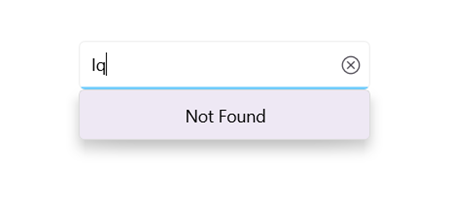
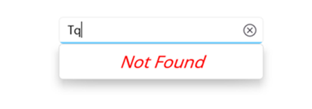

# No Results Found in .NET MAUI Autocomplete (SfAutocomplete)

## Prerequisites

Before using the [SfAutocomplete](https://help.syncfusion.com/cr/maui/Syncfusion.Maui.Inputs.SfAutocomplete.html), ensure the following NuGet package is installed in your .NET MAUI project:

- `Syncfusion.Maui.Inputs`

For step-by-step setup, refer to the [Getting Started](Getting-Started.md) documentation.

## Overview

When the entered text does not match any item in the `SfAutocomplete`drop-down, the control displays a no-results-found message. You can customize the message text with the [NoResultsFoundText](https://help.syncfusion.com/cr/maui/Syncfusion.Maui.Inputs.DropDownControls.DropDownListBase.html#Syncfusion_Maui_Inputs_DropDownControls_DropDownListBase_NoResultsFoundText) property, or provide a fully custom UI with the [NoResultsFoundTemplate](https://help.syncfusion.com/cr/maui/Syncfusion.Maui.Inputs.DropDownControls.DropDownListBase.html#Syncfusion_Maui_Inputs_DropDownControls_DropDownListBase_NoResultsFoundTemplate) property.

### Properties

| Property | Type | Default | Description |
|----------|------|---------|-------------|
| `NoResultsFoundText` | `string` | `No results found` | Gets or sets the message displayed when no matching items are found. |
| `NoResultsFoundTemplate` | `DataTemplate` | `null` | Gets or sets a custom template used to render the no-results-found message. Takes precedence over `NoResultsFoundText` when set. |

## NoResultsFoundText

You can customize the text displayed when no results are found by setting the [NoResultsFoundText](https://help.syncfusion.com/cr/maui/Syncfusion.Maui.Inputs.DropDownControls.DropDownListBase.html#Syncfusion_Maui_Inputs_DropDownControls_DropDownListBase_NoResultsFoundText) property. The default value is `No results found`.





xmlns:editors="clr-namespace:Syncfusion.Maui.Inputs;assembly=Syncfusion.Maui.Inputs"

<editors:SfAutocomplete x:Name="autocomplete"
                        NoResultsFoundText="Not Found"
                        ItemsSource="{Binding SocialMedias}"
                        TextMemberPath="Name"
                        DisplayMemberPath="Name" />




using Syncfusion.Maui.Inputs;
using System.Collections.Generic;

public class SocialMedia
{
    public string Name { get; set; }
    public int ID { get; set; }
}

var socialMedias = new List<SocialMedia>
{
    new SocialMedia { Name = "Facebook", ID = 0 },
    new SocialMedia { Name = "Twitter", ID = 1 },
    new SocialMedia { Name = "Instagram", ID = 2 },
    new SocialMedia { Name = "LinkedIn", ID = 3 }
};

SfAutocomplete autocomplete = new SfAutocomplete
{
    NoResultsFoundText = "Not Found",
    DisplayMemberPath = "Name",
    TextMemberPath = "Name",
    ItemsSource = socialMedias
};





The following image illustrates a customized no-results-found message:

## NoResultsFoundTemplate

You can fully customize the appearance of the no-results-found message by setting the [NoResultsFoundTemplate](https://help.syncfusion.com/cr/maui/Syncfusion.Maui.Inputs.DropDownControls.DropDownListBase.html#Syncfusion_Maui_Inputs_DropDownControls_DropDownListBase_NoResultsFoundTemplate) property. When the template is set, it takes precedence over the `NoResultsFoundText` property.




<editors:SfAutocomplete x:Name="autocomplete"
                        ItemsSource="{Binding SocialMedias}"
                        TextMemberPath="Name"
                        DisplayMemberPath="Name">
    <editors:SfAutocomplete.NoResultsFoundTemplate>
        <DataTemplate>
            <Label Text="Not Found"
                   FontSize="20"
                   FontAttributes="Italic"
                   TextColor="Red"
                   Margin="70,10,0,0" />
        </DataTemplate>
    </editors:SfAutocomplete.NoResultsFoundTemplate>
</editors:SfAutocomplete>




using Microsoft.Maui.Controls;
using Syncfusion.Maui.Inputs;
using System.Collections.Generic;

var socialMedias = new List<SocialMedia>
{
    new SocialMedia { Name = "Facebook", ID = 0 },
    new SocialMedia { Name = "Twitter", ID = 1 },
    new SocialMedia { Name = "Instagram", ID = 2 },
    new SocialMedia { Name = "LinkedIn", ID = 3 }
};

SfAutocomplete autocomplete = new SfAutocomplete
{
    ItemsSource = socialMedias,
    TextMemberPath = "Name",
    DisplayMemberPath = "Name",
    NoResultsFoundTemplate = new DataTemplate(() =>
    {
        return new Label
        {
            Text = "Not Found",
            FontSize = 20,
            FontAttributes = FontAttributes.Italic,
            TextColor = Colors.Red,
            Margin = new Thickness(70, 10, 0, 0)
        };
    })
};





The following image illustrates a customized no-results-found template:

## Notes

N> **Hiding the message**: To hide the no-results-found message, set `NoResultsFoundText` to an empty string (`NoResultsFoundText = string.Empty`).

N> **Template precedence**: When `NoResultsFoundTemplate` is set, the template is used instead of the `NoResultsFoundText` value. Leave the template unset to use the plain text message.

N> **iOS AOT**: When publishing in AOT mode on iOS, add `[Preserve(AllMembers = true)]` to the model class. The attribute requires `using Foundation;`.

## See also

- [Getting Started](Getting-Started.md)
- [Selection](Selection.md)
- [UI Customization](UI-Customization.md)