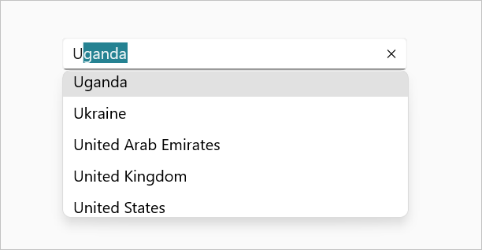

# .NET MAUI Autocomplete (SfAutocomplete) Overview

The [.NET MAUI Autocomplete](https://help.syncfusion.com/cr/maui/Syncfusion.Maui.Inputs.SfAutocomplete.html) control is highly optimized to load and populate suggestions quickly from large amounts of data depending on the user’s input characters. It allows users to select an item from the suggestion list. It displays the selected item in the input view with the text and clear button.

## Business use cases

- Search boxes with instant suggestions for faster discovery.  
- Form inputs with predefined selectable values to reduce errors.  
- Product and category search in e‑commerce apps for better navigation.  
- Mobile apps requiring fast lookup from large datasets.  

## Key features

- **Flexible data binding** binds the control to different types of data sources.
- **Filtering support** filters the suggestion list based on input and fills with the closest match.
- **Search support** highlights matching text within suggestions.
- **Placeholder text** displays helpful text before input.

## Globalization

The following table summarizes the globalization support available in this control.

    
    Full Support

    
    Partial Support

    
    Not Applicable

<table>
<tr>
<th align="center">Control</th>
<th align="center">Localization</th>
<th align="center">RTL</th>
<th align="center">Time zone</th>
<th align="center">Screen reader</th>
<th align="center">Keyboard navigation</th>
</tr>
<tr>
<td><a href="/maui/autocomplete/overview">AutoComplete</a></td>
<td align="center"></td>
<td align="center"></td>
<td align="center"></td>
<td align="center"></td>
<td align="center"></td>
</tr> 
</table>

## Related controls

- [ComboBox](https://help.syncfusion.com/maui/combobox/overview) for flexible selection with optional user input.
- [ListView](https://help.syncfusion.com/maui/listview/overview) for displaying filtered results in list format.
- [DataForm](https://help.syncfusion.com/maui/dataform/overview) for integrating autocomplete inputs within forms.

## See Also

Explore further resources:

- [Getting Started](https://help.syncfusion.com/maui/autocomplete/getting-started) shows how to begin using AutoComplete step by step. 
- [Searching & Filtering](https://help.syncfusion.com/maui/autocomplete/searching-filtering) explains how to configure search logic and filtering behavior.
- [UI Customization](https://help.syncfusion.com/maui/autocomplete/ui-customization) shows how to style and customize the AutoComplete control.

## Resources

<!-- Card 1 -->
<a href="https://www.syncfusion.com/maui-controls/maui-autocomplete" class="form-card" target="_blank">
  

    <h3 class="form-title">Feature Tour</h3>
    

      Walk through highlights and core capabilities.
    

  

</a>
<!-- Card 2 -->
<a href="https://www.syncfusion.com/tutorial-videos/maui/autocomplete" class="form-card" target="_blank">
  

    <h3 class="form-title">Tutorial Videos</h3>
    

      Step‑by‑step guidance through video tutorials.
    

  

</a>
<!-- Card 3 -->
<a href="https://support.syncfusion.com/kb/cross-platforms/category/76" class="form-card" target="_blank">
  

    <h3 class="form-title">Explore KB's</h3>
    

      Find quick solutions and step‑by‑step guidance.
    

  

</a>
<!-- Card 4 -->
<a href="https://www.syncfusion.com/blogs/category/net-maui" class="form-card" target="_blank">
  

    <h3 class="form-title">Explore Blogs</h3>
    

      Read insights, tutorials, and developer journeys.
    

  

</a>