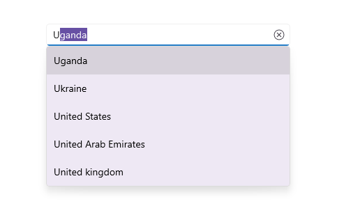

# .NET MAUI Autocomplete (SfAutocomplete) Overview

The [.NET MAUI Autocomplete](https://help.syncfusion.com/cr/maui/Syncfusion.Maui.Inputs.SfAutocomplete.html) control is highly optimized to load and populate suggestions quickly from large amounts of data depending on the user’s input characters. It allows users to select an item from the suggestion list. It displays the selected item in the input view with the text and clear button.

## Key features

* **Data binding** – Provided support to bind various types of data sources.
* **Filtering** – The Autocomplete filters items based on the entered text and auto-fills with the first suggestion.
* **Searching** – Highlights the matching item in the drop-down list based on the provided input. 
* **Placeholder** – Display placeholder text inside the control until the user enters text.
