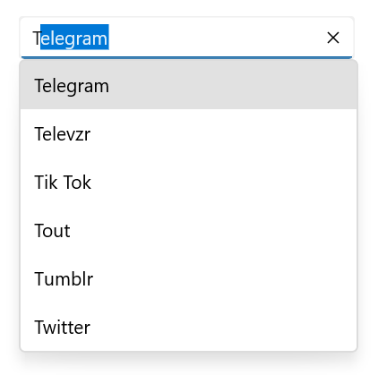
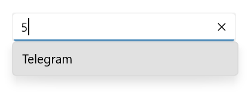
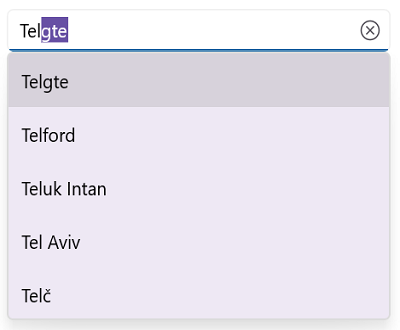
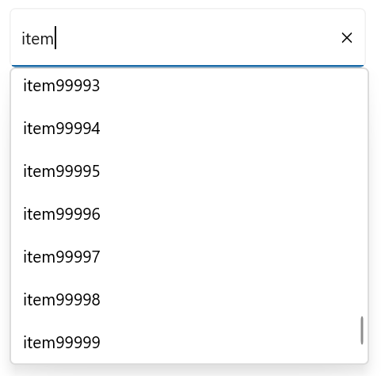

# Searching and Filtering in .NET MAUI Autocomplete (SfAutocomplete)

## Prerequisites

Before using the [SfAutocomplete](https://help.syncfusion.com/cr/maui/Syncfusion.Maui.Inputs.SfAutocomplete.html), ensure the following NuGet package is installed in your .NET MAUI project:

- `Syncfusion.Maui.Inputs`

For step-by-step setup, refer to the [Getting Started](Getting-Started.md) documentation.

## Overview

The [SfAutocomplete](https://help.syncfusion.com/cr/maui/Syncfusion.Maui.Inputs.SfAutocomplete.html) supports text searching and filtering of the items in its drop-down. You can choose the property used to display and search, the matching mode, the minimum number of characters to start filtering, and provide custom filter and search logic.

### Properties

| Property | Type | Default | Description |
|----------|------|---------|-------------|
| `DisplayMemberPath` | `string` | `string.Empty` | The property path whose value is displayed as text in the drop-down. |
| `TextMemberPath` | `string` | `string.Empty` | The property path used to perform searching. When `null` or `string.Empty`, the `DisplayMemberPath` is used. |
| `TextSearchMode` | `AutocompleteTextSearchMode` | `StartsWith` | Specifies how the input text is matched against the items. Values: `StartsWith`, `Contains`. The default is case- and accent-insensitive. |
| `MinimumPrefixCharacters` | `int` | `1` | The minimum number of characters that must be entered before the drop-down opens. |
| `FilterBehavior` | `IAutocompleteFilterBehavior` | `null` | Gets or sets a custom filter behavior for selecting the items to display. |
| `SearchBehavior` | `IAutocompleteSearchBehavior` | `null` | Gets or sets a custom search behavior for selecting the default highlighted item. |

## Searching based on member path

The [DisplayMemberPath](https://help.syncfusion.com/cr/maui/Syncfusion.Maui.Inputs.DropDownControls.DropDownListBase.html#Syncfusion_Maui_Inputs_DropDownControls_DropDownListBase_DisplayMemberPath) and [TextMemberPath](https://help.syncfusion.com/cr/maui/Syncfusion.Maui.Inputs.DropDownControls.DropDownListBase.html#Syncfusion_Maui_Inputs_DropDownControls_DropDownListBase_TextMemberPath) properties of the SfAutocomplete control specify the property path used to search when a custom data source is bound to the [ItemsSource](https://help.syncfusion.com/cr/maui/Syncfusion.Maui.Inputs.DropDownControls.DropDownListBase.html#Syncfusion_Maui_Inputs_DropDownControls_DropDownListBase_ItemsSource) property.

- `DisplayMemberPath` – the property path whose value is displayed as text in the drop-down. The default value is `string.Empty`.
- `TextMemberPath` – the property path whose value is used to perform searching based on user input received in the input area of the [SfAutocomplete](https://help.syncfusion.com/cr/maui/Syncfusion.Maui.Inputs.SfAutocomplete.html) control. The default value is `string.Empty`. When `TextMemberPath` is `null` or `string.Empty`, the search is performed against `DisplayMemberPath`.

N> `DisplayMemberPath` and `TextMemberPath` are effective when the bound item type has two or more properties.

N> When both `DisplayMemberPath` and `TextMemberPath` are `null` or `string.Empty`, the search is performed against the class name (with namespace) of the item.

### Searching based on DisplayMemberPath

The SfAutocomplete searches by the [DisplayMemberPath](https://help.syncfusion.com/cr/maui/Syncfusion.Maui.Inputs.DropDownControls.DropDownListBase.html#Syncfusion_Maui_Inputs_DropDownControls_DropDownListBase_DisplayMemberPath) property as you type in the input area when [TextMemberPath](https://help.syncfusion.com/cr/maui/Syncfusion.Maui.Inputs.DropDownControls.DropDownListBase.html#Syncfusion_Maui_Inputs_DropDownControls_DropDownListBase_TextMemberPath) is `null` or `string.Empty`.




<editors:SfAutocomplete x:Name="autocomplete"
                        ItemsSource="{Binding SocialMedias}"
                        DisplayMemberPath="Name" />




SfAutocomplete autocomplete = new SfAutocomplete
{
    DisplayMemberPath = "Name",
    ItemsSource = new SocialMediaViewModel().SocialMedias
};




// ViewModel
public class SocialMediaViewModel
{
    public ObservableCollection<SocialMedia> SocialMedias { get; set; }

    public SocialMediaViewModel()
    {
        this.SocialMedias = new ObservableCollection<SocialMedia>
        {
            new SocialMedia { Name = "Facebook", ID = 0 },
            new SocialMedia { Name = "Google Plus", ID = 1 },
            new SocialMedia { Name = "Instagram", ID = 2 },
            new SocialMedia { Name = "LinkedIn", ID = 3 },
            new SocialMedia { Name = "Skype", ID = 4 },
            new SocialMedia { Name = "Telegram", ID = 5 },
            new SocialMedia { Name = "Twitter", ID = 6 },
            new SocialMedia { Name = "WhatsApp", ID = 7 },
            new SocialMedia { Name = "YouTube", ID = 8 }
        };
    }
}

public class SocialMedia
{
    public string Name { get; set; }
    public int ID { get; set; }
}




For example, after typing `T` in the input area, the social media items whose name starts with `T` are listed in the drop-down.

The following image illustrates the result of the above code:

### Searching based on TextMemberPath

The SfAutocomplete searches by the [TextMemberPath](https://help.syncfusion.com/cr/maui/Syncfusion.Maui.Inputs.DropDownControls.DropDownListBase.html#Syncfusion_Maui_Inputs_DropDownControls_DropDownListBase_TextMemberPath) property as you type in the input area. If `TextMemberPath` is `null` or `string.Empty`, the search falls back to [DisplayMemberPath](https://help.syncfusion.com/cr/maui/Syncfusion.Maui.Inputs.DropDownControls.DropDownListBase.html#Syncfusion_Maui_Inputs_DropDownControls_DropDownListBase_DisplayMemberPath).




<editors:SfAutocomplete x:Name="autocomplete"
                        ItemsSource="{Binding SocialMedias}"
                        TextMemberPath="ID"
                        DisplayMemberPath="Name" />




SfAutocomplete autocomplete = new SfAutocomplete
{
    DisplayMemberPath = "Name",
    TextMemberPath = "ID",
    ItemsSource = new SocialMediaViewModel().SocialMedias
};




// ViewModel
public class SocialMediaViewModel
{
    public ObservableCollection<SocialMedia> SocialMedias { get; set; }

    public SocialMediaViewModel()
    {
        this.SocialMedias = new ObservableCollection<SocialMedia>
        {
            new SocialMedia { Name = "Facebook", ID = 0 },
            new SocialMedia { Name = "Google Plus", ID = 1 },
            new SocialMedia { Name = "Instagram", ID = 2 },
            new SocialMedia { Name = "LinkedIn", ID = 3 },
            new SocialMedia { Name = "Skype", ID = 4 },
            new SocialMedia { Name = "Telegram", ID = 5 },
            new SocialMedia { Name = "Twitter", ID = 6 },
            new SocialMedia { Name = "WhatsApp", ID = 7 },
            new SocialMedia { Name = "YouTube", ID = 8 }
        };
    }
}

public class SocialMedia
{
    public string Name { get; set; }
    public int ID { get; set; }
}




The following image illustrates the result of the above code:

## Filtering mode

The [TextSearchMode](https://help.syncfusion.com/cr/maui/Syncfusion.Maui.Inputs.SfAutocomplete.html#Syncfusion_Maui_Inputs_SfAutocomplete_TextSearchMode) property of the [SfAutocomplete](https://help.syncfusion.com/cr/maui/Syncfusion.Maui.Inputs.SfAutocomplete.html) controls how the input is matched against the items. The default value is [StartsWith](https://help.syncfusion.com/cr/maui/Syncfusion.Maui.Inputs.AutocompleteTextSearchMode.html#Syncfusion_Maui_Inputs_AutocompleteTextSearchMode_StartsWith), which is case- and accent-insensitive. The supported values are:

- `StartsWith`
- `Contains`

### Filter with beginning text

Set the [TextSearchMode](https://help.syncfusion.com/cr/maui/Syncfusion.Maui.Inputs.AutocompleteTextSearchMode.html) property to [StartsWith](https://help.syncfusion.com/cr/maui/Syncfusion.Maui.Inputs.AutocompleteTextSearchMode.html#Syncfusion_Maui_Inputs_AutocompleteTextSearchMode_StartsWith) to filter items whose text starts with the user input.




<editors:SfAutocomplete x:Name="autocomplete"
                        TextSearchMode="StartsWith"
                        ItemsSource="{Binding SocialMedias}"
                        DisplayMemberPath="Name"
                        TextMemberPath="Name" />




SfAutocomplete autocomplete = new SfAutocomplete
{
    DisplayMemberPath = "Name",
    TextMemberPath = "Name",
    TextSearchMode = AutocompleteTextSearchMode.StartsWith,
    ItemsSource = new SocialMediaViewModel().SocialMedias
};





// ViewModel
public class SocialMediaViewModel
{
    public ObservableCollection<SocialMedia> SocialMedias { get; set; }

    public SocialMediaViewModel()
    {
        this.SocialMedias = new ObservableCollection<SocialMedia>
        {
            new SocialMedia { Name = "Facebook", ID = 0 },
            new SocialMedia { Name = "Google Plus", ID = 1 },
            new SocialMedia { Name = "Instagram", ID = 2 },
            new SocialMedia { Name = "LinkedIn", ID = 3 },
            new SocialMedia { Name = "Skype", ID = 4 },
            new SocialMedia { Name = "Telegram", ID = 5 },
            new SocialMedia { Name = "Twitter", ID = 6 },
            new SocialMedia { Name = "WhatsApp", ID = 7 },
            new SocialMedia { Name = "YouTube", ID = 8 }
        };
    }
}

public class SocialMedia
{
    public string Name { get; set; }
    public int ID { get; set; }
}





The following image illustrates the result of the above code:

### Filter with contains text

Set the [TextSearchMode](https://help.syncfusion.com/cr/maui/Syncfusion.Maui.Inputs.AutocompleteTextSearchMode.html) property to [Contains](https://help.syncfusion.com/cr/maui/Syncfusion.Maui.Inputs.AutocompleteTextSearchMode.html#Syncfusion_Maui_Inputs_AutocompleteTextSearchMode_Contains) to filter items whose text contains the user input anywhere.




<editors:SfAutocomplete x:Name="autocomplete"
                        TextSearchMode="Contains"
                        ItemsSource="{Binding SocialMedias}"
                        DisplayMemberPath="Name"
                        TextMemberPath="Name" />




SfAutocomplete autocomplete = new SfAutocomplete
{
    DisplayMemberPath = "Name",
    TextMemberPath = "Name",
    TextSearchMode = AutocompleteTextSearchMode.Contains,
    ItemsSource = new SocialMediaViewModel().SocialMedias
};




// ViewModel
public class SocialMediaViewModel
{
    public ObservableCollection<SocialMedia> SocialMedias { get; set; }

    public SocialMediaViewModel()
    {
        this.SocialMedias = new ObservableCollection<SocialMedia>
        {
            new SocialMedia { Name = "Facebook", ID = 0 },
            new SocialMedia { Name = "Google Plus", ID = 1 },
            new SocialMedia { Name = "Instagram", ID = 2 },
            new SocialMedia { Name = "LinkedIn", ID = 3 },
            new SocialMedia { Name = "Skype", ID = 4 },
            new SocialMedia { Name = "Telegram", ID = 5 },
            new SocialMedia { Name = "Twitter", ID = 6 },
            new SocialMedia { Name = "WhatsApp", ID = 7 },
            new SocialMedia { Name = "YouTube", ID = 8 }
        };
    }
}

public class SocialMedia
{
    public string Name { get; set; }
    public int ID { get; set; }
}




The following image illustrates the result of the above code.

### Prefix characters constraint

Instead of opening the drop-down on every keystroke, you can require a minimum number of characters before filtering begins. Set the [MinimumPrefixCharacters](https://help.syncfusion.com/cr/maui/Syncfusion.Maui.Inputs.DropDownControls.DropDownListBase.html#Syncfusion_Maui_Inputs_DropDownControls_DropDownListBase_MinimumPrefixCharacters) property to control this. The default value is `1`.




<editors:SfAutocomplete x:Name="autocomplete"
                        TextSearchMode="StartsWith"
                        ItemsSource="{Binding SocialMedias}"
                        MinimumPrefixCharacters="3"
                        DisplayMemberPath="Name"
                        TextMemberPath="Name" />




SfAutocomplete autocomplete = new SfAutocomplete
{
    DisplayMemberPath = "Name",
    TextMemberPath = "Name",
    MinimumPrefixCharacters = 3,
    TextSearchMode = AutocompleteTextSearchMode.StartsWith,
    ItemsSource = new SocialMediaViewModel().SocialMedias
};




// ViewModel
public class SocialMediaViewModel
{
    public ObservableCollection<SocialMedia> SocialMedias { get; set; }

    public SocialMediaViewModel()
    {
        this.SocialMedias = new ObservableCollection<SocialMedia>
        {
            new SocialMedia { Name = "Facebook", ID = 0 },
            new SocialMedia { Name = "Google Plus", ID = 1 },
            new SocialMedia { Name = "Instagram", ID = 2 },
            new SocialMedia { Name = "LinkedIn", ID = 3 },
            new SocialMedia { Name = "Skype", ID = 4 },
            new SocialMedia { Name = "Telegram", ID = 5 },
            new SocialMedia { Name = "Twitter", ID = 6 },
            new SocialMedia { Name = "WhatsApp", ID = 7 },
            new SocialMedia { Name = "YouTube", ID = 8 }
        };
    }
}

public class SocialMedia
{
    public string Name { get; set; }
    public int ID { get; set; }
}




The following image illustrates the result of the above code.

## Custom filtering

The SfAutocomplete supports custom filter and search logic via the `FilterBehavior` and `SearchBehavior` properties. The default value of both is `null`.

First, define the model and view model used by the following examples:




public class CityInfo
{
    public string CityName { get; set; }
    public string CountryName { get; set; }
    public bool IsCapital { get; set; }
}

public class CityViewModel
{
    public ObservableCollection<CityInfo> Cities { get; set; } = new ObservableCollection<CityInfo>
    {
        new CityInfo { CityName = "Delhi", CountryName = "India", IsCapital = true },
        new CityInfo { CityName = "Mumbai", CountryName = "India", IsCapital = false },
        new CityInfo { CityName = "Chennai", CountryName = "India", IsCapital = false },
        new CityInfo { CityName = "Kolkata", CountryName = "India", IsCapital = false },
        new CityInfo { CityName = "Chicago", CountryName = "USA", IsCapital = false },
        new CityInfo { CityName = "Los Angeles", CountryName = "USA", IsCapital = false },
        new CityInfo { CityName = "Houston", CountryName = "USA", IsCapital = false },
        new CityInfo { CityName = "New York", CountryName = "USA", IsCapital = true },
        new CityInfo { CityName = "Washington", CountryName = "USA", IsCapital = false }
    };
}




### Custom filter behavior

#### Step 1: Create the filter class

Create a class that derives from the [IAutocompleteFilterBehavior](https://help.syncfusion.com/cr/maui/Syncfusion.Maui.Inputs.IAutocompleteFilterBehavior.html) interface.




public class CityFilteringBehavior : IAutocompleteFilterBehavior
{
    // Members are added in Step 2.
}




#### Step 2: Implement GetMatchingItemsAsync

Implement the `GetMatchingItemsAsync` method to return the items that match the text entered in the SfAutocomplete. The method receives the following arguments:

- `source` - the SfAutocomplete instance, which exposes the `ItemsSource` and other contextual information.
- `filterInfo` - an [AutocompleteFilterInfo](https://help.syncfusion.com/cr/maui/Syncfusion.Maui.Inputs.AutocompleteFilterInfo.html) instance that contains the text entered in the SfAutocomplete (`filterInfo.Text`).




public class CityFilteringBehavior : IAutocompleteFilterBehavior
{
    public async Task<object> GetMatchingItemsAsync(SfAutocomplete source, AutocompleteFilterInfo filterInfo)
    {
        IEnumerable itemsSource = source.ItemsSource as IEnumerable;
        var filteredItems = from CityInfo item in itemsSource
                           where item.CountryName.StartsWith(filterInfo.Text, StringComparison.CurrentCultureIgnoreCase) ||
                                 item.CityName.StartsWith(filterInfo.Text, StringComparison.CurrentCultureIgnoreCase)
                           select item;

        return await Task.FromResult(filteredItems);
    }
}




#### Step 3: Apply the custom filter

Apply the custom filter to the SfAutocomplete by setting the `FilterBehavior` property.



<editors:SfAutocomplete x:Name="autocomplete"
                        DisplayMemberPath="CityName"
                        ItemsSource="{Binding Cities}">
    <editors:SfAutocomplete.BindingContext>
        <local:CityViewModel />
    </editors:SfAutocomplete.BindingContext>
    <editors:SfAutocomplete.FilterBehavior>
        <local:CityFilteringBehavior />
    </editors:SfAutocomplete.FilterBehavior>
</editors:SfAutocomplete>




The following image demonstrates how to display cities in the drop-down based on the country name entered in the SfAutocomplete.

### Custom search behavior (default highlighted item)

When filtering, the first item in the drop-down is highlighted by default. Use the `SearchBehavior` property to choose a different default highlighted item based on your criteria. The default value is `null`.

#### Step 1: Create the search class

Create a class that derives from the [IAutocompleteSearchBehavior](https://help.syncfusion.com/cr/maui/Syncfusion.Maui.Inputs.IAutocompleteSearchBehavior.html) interface.




public class CapitalCitySearchingBehavior : IAutocompleteSearchBehavior
{
    // Members are added in Step 2.
}




#### Step 2: Implement GetHighlightIndex

Implement the `GetHighlightIndex` method to return the index of the item that should be highlighted by default. The method receives the following arguments:

- `source` - the SfAutocomplete instance.
- `searchInfo` - an [AutocompleteSearchInfo](https://help.syncfusion.com/cr/maui/Syncfusion.Maui.Inputs.AutocompleteSearchInfo.html) instance that exposes the filtered items (`searchInfo.FilteredItems`).

The following example highlights the capital city of the country the user enters.




public class CapitalCitySearchingBehavior : IAutocompleteSearchBehavior
{
    public int GetHighlightIndex(SfAutocomplete source, AutocompleteSearchInfo searchInfo)
    {
        var filteredCapitals = from CityInfo cityInfo in searchInfo.FilteredItems
                               where cityInfo.IsCapital
                               select searchInfo.FilteredItems.IndexOf(cityInfo);

        if (filteredCapitals.Any())
        {
            return filteredCapitals.FirstOrDefault();
        }

        return 0;
    }
}




#### Step 3: Apply the custom search

Apply the custom search behavior to the SfAutocomplete by setting the `SearchBehavior` property.




<editors:SfAutocomplete x:Name="autocomplete"
                        DisplayMemberPath="CityName"
                        ItemsSource="{Binding Cities}">
    <editors:SfAutocomplete.FilterBehavior>
        <local:CityFilteringBehavior />
    </editors:SfAutocomplete.FilterBehavior>
    <editors:SfAutocomplete.SearchBehavior>
        <local:CapitalCitySearchingBehavior />
    </editors:SfAutocomplete.SearchBehavior>
</editors:SfAutocomplete>




The following image demonstrates how to select the capital city from the drop-down based on the country name entered in the SfAutocomplete.

## Load asynchronous items

You can load items dynamically at runtime based on the typed input. Implement the [GetMatchingItemsAsync](https://help.syncfusion.com/cr/maui/Syncfusion.Maui.Inputs.IAutocompleteFilterBehavior.html#Syncfusion_Maui_Inputs_IAutocompleteFilterBehavior_GetMatchingItemsAsync_Syncfusion_Maui_Inputs_SfAutocomplete_Syncfusion_Maui_Inputs_AutocompleteFilterInfo_) method of the `IAutocompleteFilterBehavior` interface to run filtering on a background thread using `await Task.Run()`.

#### Step 1: Create the asynchronous filter class

Create a class that derives from `IAutocompleteFilterBehavior` and implement `GetMatchingItemsAsync` to load items at runtime.




public class CustomAsyncFilter : IAutocompleteFilterBehavior
{
    private CancellationTokenSource cancellationTokenSource;

    public async Task<object> GetMatchingItemsAsync(SfAutocomplete source, AutocompleteFilterInfo filterInfo)
    {
        if (this.cancellationTokenSource != null)
        {
            this.cancellationTokenSource.Cancel();
            this.cancellationTokenSource.Dispose();
        }

        this.cancellationTokenSource = new CancellationTokenSource();
        CancellationToken token = this.cancellationTokenSource.Token;

        return await Task.Run(() =>
        {
            var list = new List<string>();
            for (int i = 0; i < 100000; i++)
            {
                list.Add(filterInfo.Text + i);
            }

            return list;
        }, token);
    }
}




#### Step 2: Apply the asynchronous filter

Apply the `CustomAsyncFilter` to the SfAutocomplete by setting the `FilterBehavior` property.




<editors:SfAutocomplete x:Name="autocomplete">
    <editors:SfAutocomplete.FilterBehavior>
        <local:CustomAsyncFilter />
    </editors:SfAutocomplete.FilterBehavior>
</editors:SfAutocomplete>




The following image shows 100,000 items being loaded asynchronously in the drop-down at runtime based on the typed input.

## Notes

N> **Case and accent sensitivity**: The default `StartsWith` and `Contains` filtering modes are case- and accent-insensitive. To perform a case- or accent-sensitive search, provide a custom `FilterBehavior`.

N> **Cancelled requests**: The `CustomAsyncFilter` example cancels any in-flight request when a new keystroke arrives, so the UI always shows the result of the latest filter. Keep a similar pattern when implementing your own asynchronous filter.

## See also

- [Highlighting matched text](Highlighting-matched-text.md)
- [Selection](Selection.md)
- [UI Customization](UI-Customization.md)
- [Getting Started](Getting-Started.md)
