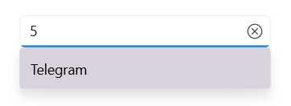
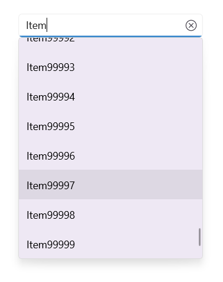

# Searching and Filtering in .NET MAUI Autocomplete (SfAutocomplete)

The [Autocomplete](https://help.syncfusion.com/cr/maui/Syncfusion.Maui.Inputs.SfAutocomplete.html) control allows for rich text searching and filtering functionality.

## Searching based on member path

The [DisplayMemberPath](https://help.syncfusion.com/cr/maui/Syncfusion.Maui.Inputs.DropDownControls.DropDownListBase.html#Syncfusion_Maui_Inputs_DropDownControls_DropDownListBase_DisplayMemberPath) and [TextMemberPath](https://help.syncfusion.com/cr/maui/Syncfusion.Maui.Inputs.DropDownControls.DropDownListBase.html#Syncfusion_Maui_Inputs_DropDownControls_DropDownListBase_TextMemberPath) properties of Autocomplete control specify the property path by which the searching must be done when a custom data is bound to the [ItemsSource](https://help.syncfusion.com/cr/maui/Syncfusion.Maui.Inputs.DropDownControls.DropDownListBase.html#Syncfusion_Maui_Inputs_DropDownControls_DropDownListBase_ItemsSource) property.

 * `DisplayMemberPath` - Specifies the property path whose value is displayed as text in the drop-down menu. The default value is `string.Empty`.

 * `TextMemberPath` - Specifies the property path whose value is used to perform searching based on user input received in the selection box portion of the [Autocomplete](https://help.syncfusion.com/cr/maui/Syncfusion.Maui.Inputs.SfAutocomplete.html) control. The default value is `string.Empty`. When `TextMemberPath` is `null` or `string.Empty`, searching will be performed based on `DisplayMemberPath`. 

N> `DisplayMemberPath` and `TextMemberPath` will be effective for the collection item that holds two or more properties in it.

N> When both the `DisplayMemberPath` and `TextMemberPath` properties have a `null` or `string.Empty` value, searching will be performed based on the class name with the namespace of the item.

### Searching based on DisplayMemberPath

Searching will be performed based on the [DisplayMemberPath](https://help.syncfusion.com/cr/maui/Syncfusion.Maui.Inputs.DropDownControls.DropDownListBase.html#Syncfusion_Maui_Inputs_DropDownControls_DropDownListBase_DisplayMemberPath) property while entering the text into the selection box when [TextMemberPath](https://help.syncfusion.com/cr/maui/Syncfusion.Maui.Inputs.DropDownControls.DropDownListBase.html#Syncfusion_Maui_Inputs_DropDownControls_DropDownListBase_TextMemberPath)  is `null` or `string.Empty`. 




//Model.cs
public class SocialMedia
{
    public string Name { get; set; }
    public int ID { get; set; }
}

//ViewModel.cs
public class SocialMediaViewModel
{
    public ObservableCollection<SocialMedia> SocialMedias { get; set; }
    public SocialMediaViewModel()
    {
        this.SocialMedias = new ObservableCollection<SocialMedia>();
        this.SocialMedias.Add(new SocialMedia() { Name = "Facebook", ID = 0 });
        this.SocialMedias.Add(new SocialMedia() { Name = "Google Plus", ID = 1 });
        this.SocialMedias.Add(new SocialMedia() { Name = "Instagram", ID = 2 });
        this.SocialMedias.Add(new SocialMedia() { Name = "LinkedIn", ID = 3 });
        this.SocialMedias.Add(new SocialMedia() { Name = "Skype", ID = 4 });
        this.SocialMedias.Add(new SocialMedia() { Name = "Telegram", ID = 5 });
        this.SocialMedias.Add(new SocialMedia() { Name = "Televzr", ID = 6 });
        this.SocialMedias.Add(new SocialMedia() { Name = "Tik Tok", ID = 7 });
        this.SocialMedias.Add(new SocialMedia() { Name = "Tout", ID = 8 });
        this.SocialMedias.Add(new SocialMedia() { Name = "Tumblr", ID = 9 });
        this.SocialMedias.Add(new SocialMedia() { Name = "Twitter", ID = 10 });
        this.SocialMedias.Add(new SocialMedia() { Name = "Vimeo", ID = 11 });
        this.SocialMedias.Add(new SocialMedia() { Name = "WhatsApp", ID = 12 });
        this.SocialMedias.Add(new SocialMedia() { Name = "YouTube", ID = 13 });
    }
}







<editors:SfAutocomplete x:Name="autocomplete"
                        WidthRequest="250" 
                        ItemsSource="{Binding SocialMedias}"
                        DisplayMemberPath="Name" />





autocomplete.DisplayMemberPath = "Name";




For e.g. After typing `T` in selection box, social media which have starting letter `T` will be listed in drop-down.

The following image illustrates the result of the above code:

### Searching based on TextMemberPath

Searching will be performed based on the [TextMemberPath](https://help.syncfusion.com/cr/maui/Syncfusion.Maui.Inputs.DropDownControls.DropDownListBase.html#Syncfusion_Maui_Inputs_DropDownControls_DropDownListBase_TextMemberPath) property while entering the text into the selection box. If TextMemberPath is `null` or `string.Empty`, searching will be performed based on [DisplayMemberPath](https://help.syncfusion.com/cr/maui/Syncfusion.Maui.Inputs.DropDownControls.DropDownListBase.html#Syncfusion_Maui_Inputs_DropDownControls_DropDownListBase_DisplayMemberPath). 




<editors:SfAutocomplete x:Name="autocomplete"
                        WidthRequest="250"
                        ItemsSource="{Binding SocialMedias}"
                        TextMemberPath="ID"
                        DisplayMemberPath="Name" />





autocomplete.TextMemberPath = "ID";




The following image illustrates the result of the above code:

## Filtering mode

The `TextSearchMode` property of the [Autocomplete](https://help.syncfusion.com/cr/maui/Syncfusion.Maui.Inputs.SfAutocomplete.html) can be used to regulate how the control behaves when it receives user input. The default text filtering type is [StartWith](https://help.syncfusion.com/cr/maui/Syncfusion.Maui.Inputs.AutocompleteTextSearchMode.html#Syncfusion_Maui_Inputs_AutocompleteTextSearchMode_StartsWith), which ignores accent and is case insensitive. The text filter modes that are available are as follows:

* StartsWith
* Contains

### Filter with beginning text

Set the [TextSearchMode](https://help.syncfusion.com/cr/maui/Syncfusion.Maui.Inputs.AutocompleteTextSearchMode.html) property value to [StartWith](https://help.syncfusion.com/cr/maui/Syncfusion.Maui.Inputs.AutocompleteTextSearchMode.html#Syncfusion_Maui_Inputs_AutocompleteTextSearchMode_StartsWith) to filter matching items based on the starting text. The first item in the drop-down list that matches the user input will be highlighted. 




<editors:SfAutocomplete x:Name="autocomplete"
                        WidthRequest="250"
                        TextSearchMode="StartsWith"
                        ItemsSource="{Binding SocialMedias}"
                        DisplayMemberPath="Name"
                        TextMemberPath="Name" />





autocomplete.TextSearchMode = AutocompleteTextSearchMode.StartsWith;




The following image illustrates the result of the above code:

### Filter with contains text

Set the [TextSearchMode](https://help.syncfusion.com/cr/maui/Syncfusion.Maui.Inputs.AutocompleteTextSearchMode.html) property value to [Contains](https://help.syncfusion.com/cr/maui/Syncfusion.Maui.Inputs.AutocompleteTextSearchMode.html#Syncfusion_Maui_Inputs_AutocompleteTextSearchMode_Contains) to filter the matching items based on the containing specific text. The first item in the drop-down list that matches the user input will be highlighted.




<editors:SfAutocomplete x:Name="autocomplete"
                        WidthRequest="250"
                        TextSearchMode="Contains"
                        ItemsSource="{Binding SocialMedias}"
                        DisplayMemberPath="Name"
                        TextMemberPath="Name" />





autocomplete.TextSearchMode = AutocompleteTextSearchMode.Contains;




The following image illustrates the result of the above code.

### Prefix characters constraint

Instead of displaying suggestion list on every character entry, matches can be filtered and displayed after a few character entries. This can be done by [MinimumPrefixCharacters](https://help.syncfusion.com/cr/maui/Syncfusion.Maui.Inputs.DropDownControls.DropDownListBase.html#Syncfusion_Maui_Inputs_DropDownControls_DropDownListBase_MinimumPrefixCharacters) property and its default value is 1.




<editors:SfAutocomplete x:Name="autocomplete"
                        WidthRequest="250"
                        TextSearchMode="StartsWith"
                        ItemsSource="{Binding SocialMedias}"
                        MinimumPrefixCharacters="3"
                        DisplayMemberPath="Name"
                        TextMemberPath="Name" />





autocomplete.MinimumPrefixCharacters = 3;




The following image illustrates the result of the above code.

### Custom filtering

The `Autocomplete` control supports applying your custom filter logic to suggest items based on your filter criteria by using the `FilterBehavior` and `SearchBehavior` properties. The default value of `FilterBehavior` and `SearchBehavior` is `null`.




//Model.cs

public class CityInfo
{
    private bool _isCapital;
    public bool IsCapital
    {
        get { return _isCapital; }
        set { _isCapital = value; }
    }
    private string _cityname;
    public string CityName
    {
        get { return _cityname; }
        set { _cityname = value; }
    }
    private string _country;
    public string CountryName
    {
        get { return _country; }
        set { _country = value; }
    }
}

//ViewModel.cs

public class CityViewModel
{
    private ObservableCollection<CityInfo> _cityCollection;
    public ObservableCollection<CityInfo> Cities
    {
        get { return _cityCollection; }
        set { _cityCollection = value; }
    }
    public CityViewModel()
    {
        _cityCollection = new ObservableCollection<CityInfo>();

        Cities.Add(new CityInfo() { CityName = "Delhi", CountryName = "India", IsCapital = true });
        Cities.Add(new CityInfo() { CityName = "Mumbai", CountryName = "India", IsCapital = false });
        Cities.Add(new CityInfo() { CityName = "Chennai", CountryName = "India", IsCapital = false });
        Cities.Add(new CityInfo() { CityName = "Kolkata", CountryName = "India", IsCapital = false });
        Cities.Add(new CityInfo() { CityName = "Chicago", CountryName = "USA", IsCapital = false });
        Cities.Add(new CityInfo() { CityName = "Los Angels", CountryName = "USA", IsCapital = false });
        Cities.Add(new CityInfo() { CityName = "Houston", CountryName = "USA", IsCapital = false });
        Cities.Add(new CityInfo() { CityName = "New York", CountryName = "USA", IsCapital = true });
        Cities.Add(new CityInfo() { CityName = "Wasington", CountryName = "USA", IsCapital = false });
        
    }
}




Now, create a custom filtering class to apply your filter logic to the `Autocomplete` control by following these steps.

**Step 1:** Create a class that derives from the `IAutocompleteFilterBehavior` interface.




/// 

/// Represents a custom filtering behavior for the    `Autocomplete` control. 
/// 

public class CityFilteringBehavior : IAutocompleteFilterBehavior
{

}




**Step 2:** Then, implement the `GetMatchingIndexes` method of the `IAutocompleteFilterBehavior` interface to create your suggestion list (containing the indices of the filtered items) based on the text entered in the `Autocomplete` control that needs to be shown in the drop-down. The `GetMatchingIndexes` method contains following arguments.

* `source` - The owner of the filter behavior, which holds information about the `ItemsSource`  property and so on.
* `filterInfo` - Contains details about the text entered in `Autocomplete` control. Using this text, you can prepare suggestion list, which gets displayed in the drop-down list. 

The following image shows how to display cities in a drop-down based on the country name entered in the `Autocomplete` control.




public class CityFilteringBehavior : IAutocompleteFilterBehavior
{
    public async Task<object> GetMatchingItemsAsync(SfAutocomplete source, AutocompleteFilterInfo filterInfo)
    {
         IEnumerable itemssource = source.ItemsSource as IEnumerable;
        var filteredItems = (from CityInfo item in itemssource
                             where item.CountryName.StartsWith(filterInfo.Text, StringComparison.CurrentCultureIgnoreCase) ||
                                   item.CityName.StartsWith(filterInfo.Text, StringComparison.CurrentCultureIgnoreCase)
                             select item);

        return await Task.FromResult(filteredItems);
    }
}




**Step 3:** Applying custom filtering to the `Autocomplete` control by using the `FilterBehavior` property.



 <ContentPage.BindingContext>
    <local:CityViewModel>
    </local:CityViewModel>
</ContentPage.BindingContext>
  <editors:SfAutocomplete 
    DisplayMemberPath="CityName"
    ItemsSource="{Binding Cities}">
            <editors:SfAutocomplete.FilterBehavior>
                <local:CityFilteringBehavior/>
            </editors:SfAutocomplete.FilterBehavior>
  </editors:SfAutocomplete>




The following image demonstrates how to display cities in the drop-down based on the country name entered in the `Autocomplete` control.

### Choose default item to select

When searching, the first item in the drop-down will be highlighted by default. Using the `SearchBehavior` property, you can customize the default highlighting behavior by using your custom selection logic to select the items based on your search criteria. The default value of `SearchBehavior` is `null`. 

**Step 1:** Create a class that derives from the `IAutocompleteSearchBehavior` interface.




/// 

/// Represents a custom searching behavior for `Autocomplete` control. 
/// 

public class CapitalCitySearchingBehavior : Syncfusion.Maui.Inputs.IAutocompleteSearchBehavior

{

}




**Step 2:** Then, implement the `GetHighlightIndex` method of the `IAutocompleteSearchBehavior` interface to initially select any item from the filtered list in the `Autocomplete` control drop-down. The `GetHighlightIndex` method contains the following arguments.

* `source` - The owner of the search behavior, which holds information about the `ItemsSource` and so on.
* `searchInfo` - Contains information about the filtered items based on the text entered in the `Autocomplete` control. Select an item from the drop-down list using this list. 

The following code initially demonstrates how to select an item from the filtered list of the drop-down in the `Autocomplete` control. When entering the country's name, the capital cities will be selected.




public class CapitalCitySearchingBehavior : Syncfusion.Maui.Inputs.IAutocompleteSearchBehavior
{
    public int GetHighlightIndex(SfAutocomplete source, AutocompleteSearchInfo searchInfo)
    {

        var filteredCapitals = from CityInfo cityInfo in searchInfo.FilteredItems
                               where cityInfo.IsCapital
                               select searchInfo.FilteredItems.IndexOf(cityInfo);
        if (filteredCapitals.Count() > 0)
            return filteredCapitals.FirstOrDefault();

        return 0;
    }
}





**Step 3:** Apply the custom searching to the `Autocomplete` control by using the `SearchBehavior` property. 



 <ContentPage.BindingContext>
        <local:CityViewModel></local:CityViewModel>
    </ContentPage.BindingContext>
<editors:SfAutocomplete 
    DisplayMemberPath="CityName"
    ItemsSource="{Binding Cities}">
            <editors:SfAutocomplete.FilterBehavior>
                <local:CityFilteringBehavior/>
            </editors:SfAutocomplete.FilterBehavior>
<editors:SfAutocomplete.SearchBehavior>
                <local:CapitalCitySearchingBehavior></local:CapitalCitySearchingBehavior>
            </editors:SfAutocomplete.SearchBehavior>
</editors:SfAutocomplete>




The following image demonstrates how to select the capital city from the drop-down based on the country name entered in the `Autocomplete` control.

## Load asynchronous items

Load the data dynamically at runtime based on typed input. This dynamic loading can be done while performing custom filtering using the `CustomFilter` property.

The `GetMatchingItemsAsync` method of the `IAutocompleteFilterBehavior` helps you perform filtering operations on different threads without blocking the current thread by using `await Task.Run()`.

**Step 1:** Create a class from the `IAutocompleteFilterBehavior` interface and add your custom filter logic to the `GetMatchingItemsAsync` method to load the runtime items based on typed input.




public class CustomAsyncFilter : IAutocompleteFilterBehavior
{
    /// 

    /// Gets the cancellation token source.
    /// 

    CancellationTokenSource cancellationTokenSource;

    public async Task<object> GetMatchingItemsAsync(SfAutocomplete source, AutocompleteFilterInfo filterInfo)
    {
        if (this.cancellationTokenSource != null)
        {
            this.cancellationTokenSource.Cancel();
            this.cancellationTokenSource.Dispose();
        }

        this.cancellationTokenSource = new CancellationTokenSource();
        CancellationToken token = this.cancellationTokenSource.Token;

        return await Task.Run(() =>
        {
            List<string> list = new List<string>();
            for (int i = 0; i < 100000; i++)
            {
                list.Add(filterInfo.Text + i);
            }

            return list;
        }, token);
    }
}




**Step 2:** Apply the `CustomAsyncFilter` to the `Autocomplete` control by using the `FilterBehavior` property. 




<editors:SfAutocomplete
       >
            <editors:SfAutocomplete.FilterBehavior>
                <local:CustomAsyncFilter/>
            </editors:SfAutocomplete.FilterBehavior>
        </editors:SfAutocomplete>




The following image shows 1 lakh of data being loaded asynchronously in a drop-down at runtime based on typed input.

