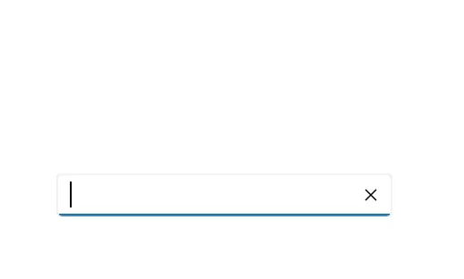
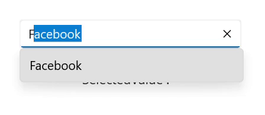
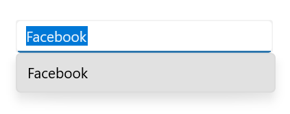

# Selection in .NET MAUI Autocomplete (SfAutocomplete)

The `Autocomplete` allows user to select a single item from dropdown list.

## Single selection

The `Autocomplete` allows the user to select an item by entering the value using the keyboard, then selecting from the drop-down list by clicking the item. The selected item can be retrieved from the `SelectedItem` property.




//Model.cs
public class SocialMedia
{
    public string Name { get; set; }
    public int ID { get; set; }
}

//ViewModel.cs
public class SocialMediaViewModel
{
    public ObservableCollection<SocialMedia> SocialMedias { get; set; }
    public SocialMediaViewModel()
    {
        this.SocialMedias = new ObservableCollection<SocialMedia>();
        this.SocialMedias.Add(new SocialMedia() { Name = "Facebook", ID = 0 });
        this.SocialMedias.Add(new SocialMedia() { Name = "Google Plus", ID = 1 });
        this.SocialMedias.Add(new SocialMedia() { Name = "Instagram", ID = 2 });
        this.SocialMedias.Add(new SocialMedia() { Name = "LinkedIn", ID = 3 });
        this.SocialMedias.Add(new SocialMedia() { Name = "Skype", ID = 4 });
        this.SocialMedias.Add(new SocialMedia() { Name = "Telegram", ID = 5 });
        this.SocialMedias.Add(new SocialMedia() { Name = "Televzr", ID = 6 });
        this.SocialMedias.Add(new SocialMedia() { Name = "Tik Tok", ID = 7 });
        this.SocialMedias.Add(new SocialMedia() { Name = "Tout", ID = 8 });
        this.SocialMedias.Add(new SocialMedia() { Name = "Tumblr", ID = 9 });
        this.SocialMedias.Add(new SocialMedia() { Name = "Twitter", ID = 10 });
        this.SocialMedias.Add(new SocialMedia() { Name = "Vimeo", ID = 11 });
        this.SocialMedias.Add(new SocialMedia() { Name = "WhatsApp", ID = 12 });
        this.SocialMedias.Add(new SocialMedia() { Name = "YouTube", ID = 13 });
    }
}







<editors:SfAutoComplete x:Name="autocomplete"
                        WidthRequest="250"
                        ItemsSource="{Binding SocialMedias}"
                        DisplayMemberPath="Name"
                        TextMemberPath="Name" />




SfAutocomplete autocomplete = new SfAutoComplete();
SocialMediaViewModel socialMediaViewModel = new SocialMediaViewModel();
autocomplete.BindingContext = socialMediaViewModel;
autocomplete.ItemsSource = SocialMediaViewModel.SocialMedias;
autocomplete.DisplayMemberPath = "Name";
autocomplete.TextMemberPath = "Name";




The following gif image illustrates the result of the above code:

## Selection changed notification

When an item is selected from the drop-down list, the `SelectionChanged` event is triggered. The SelectionChanged event contains the newly selected and previously selected items in the `CurrentSelection` and `PreviousSelection` properties. The SelectionChanged contains the following properties:

 * CurrentSelection - Contains the item that were currently selected.
 * PreviousSelection - Contains the item that were previously selected.




<editors:SfAutoComplete x:Name="autocomplete"
                        WidthRequest="250"
                        ItemsSource="{Binding SocialMedias}"
                        TextMemberPath="Name"
                        DisplayMemberPath="Name"
                        SelectionChanged="OnSelectionChanged"/>





autocomplete.SelectionChanged += OnSelectionChanged;




The `SelectionChanged` event can be handled as follows:




private async void OnSelectionChanged(object sender, Syncfusion.Maui.Inputs.SelectionChangedEventArgs e)
{
    await DisplayAlert("Alert", "Selected Item has changed", "Ok");
}




The following gif image illustrates the result of the above code:

## Get the selected value

The `SelectedValuePath` property allows you to specify a SelectedValue for a `Autocomplete`'s `SelectedItem`. The `SelectedItem` represents an object in the `Items` collection, and the `Autocomplete` displays the value of the selected item's single property. The `SelectedValuePath` property specifies the path to the property that is used to determine the `SelectedValue` property's value. The default value of `SelectedValue` and `SelectedValuePath` is `null`.

For example, when you select any `SocialMedia.Name` in the `Autocomplete,` the `SelectedItem` property returns the `SocialMedia` data item that corresponds to the selected `SocialMedia.Name.` However, because the `SelectedValuePath` of this `Autocomplete` is set to `SocialMedia.ID,` the `SelectedValue` is set to the `SocialMedia.ID.`




<editors:SfAutoComplete x:Name="autoComplete"
                        WidthRequest="250"
                        SelectedValuePath="ID"
                        TextMemberPath="Name"   
                        DisplayMemberPath="Name"
                        ItemsSource="{Binding SocialMedias}" 
                        SelectionChanged="OnSelectionChanged"/>

<Label Text="SelectedValue :" />
<Label x:Name="selectedValue" />




autoComplete.SelectedValuePath = "ID";
autoComplete.SelectionChanged += OnSelectionChanged;







private void OnSelectionChanged(object sender, Syncfusion.Maui.Inputs.SelectionChangedEventArgs e)
{
    selectedValue.Text = autocomplete.SelectedValue.ToString();
}




The following gif image illustrates the result of the above code:

## Hide clear button in the Autocomplete

By default, the clear button `X` will be displayed in the editor of the `Autocomplete` control, which can be used to clear the entered input. Hide the clear button in `Autocomplete` control using the `IsClearButtonVisible` property. The default value of `IsClearButtonVisible` property value is `true`.




<editors:SfAutocomplete x:Name="autocomplete"
                        WidthRequest="250"
                        IsClearButtonVisible="false"
                        ItemsSource="{Binding SocialMedias}"
                        DisplayMemberPath="Name"
                        TextMemberPath="Name" />





autocomplete.IsClearButtonVisible = false;




The following image illustrates the result of the above code:

## Open a drop-down programmatically

In `Autocomplete` control, the drop-down can be opened or closed programmatically by using the `IsDropDownOpen` property. The default value of `IsDropDownOpen` property is `false`. 




<editors:SfAutocomplete x:Name="autocomplete"
                        WidthRequest="250"
                        IsEditable="true"
                        ItemsSource="{Binding SocialMedias}"
                        IsDropDownOpen = true;
                        DisplayMemberPath="Name"
                        TextMemberPath="Name">
</editors:SfAutocomplete>




autocomplete.IsDropDownOpen = true;


