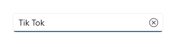
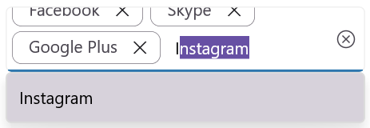
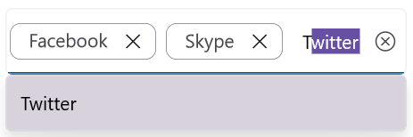
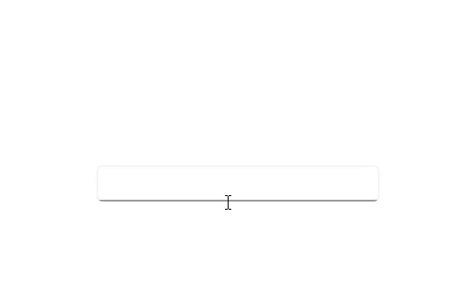
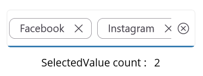
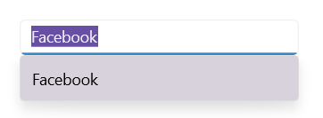

# Selection in .NET MAUI Autocomplete (SfAutocomplete)

The [.NET MAUI Autocomplete](https://help.syncfusion.com/cr/maui/Syncfusion.Maui.Inputs.SfAutocomplete.html) allows user to select single or multiple items. The selection mode can be set by using the [SelectionMode](https://help.syncfusion.com/cr/maui/Syncfusion.Maui.Inputs.SfAutocomplete.html#Syncfusion_Maui_Inputs_SfAutocomplete_SelectionMode) property. There are two different selection modes: [Single](https://help.syncfusion.com/cr/maui/Syncfusion.Maui.Inputs.AutocompleteSelectionMode.html#Syncfusion_Maui_Inputs_AutocompleteSelectionMode_Single) and [Multiple](https://help.syncfusion.com/cr/maui/Syncfusion.Maui.Inputs.AutocompleteSelectionMode.html#Syncfusion_Maui_Inputs_AutocompleteSelectionMode_Multiple).

## Single selection

The [Autocomplete](https://help.syncfusion.com/cr/maui/Syncfusion.Maui.Inputs.SfAutocomplete.html) allows the user to select an item by entering the value using the keyboard, then selecting from the drop-down list by clicking the item. The selected item can be retrieved from the [SelectedItem](https://help.syncfusion.com/cr/maui/Syncfusion.Maui.Inputs.DropDownControls.DropDownListBase.html#Syncfusion_Maui_Inputs_DropDownControls_DropDownListBase_SelectedItem) property.




//Model.cs
public class SocialMedia
{
    public string Name { get; set; }
    public int ID { get; set; }
}

//ViewModel.cs
public class SocialMediaViewModel
{
    public ObservableCollection<SocialMedia> SocialMedias { get; set; }
    public SocialMediaViewModel()
    {
        this.SocialMedias = new ObservableCollection<SocialMedia>();
        this.SocialMedias.Add(new SocialMedia() { Name = "Facebook", ID = 0 });
        this.SocialMedias.Add(new SocialMedia() { Name = "Google Plus", ID = 1 });
        this.SocialMedias.Add(new SocialMedia() { Name = "Instagram", ID = 2 });
        this.SocialMedias.Add(new SocialMedia() { Name = "LinkedIn", ID = 3 });
        this.SocialMedias.Add(new SocialMedia() { Name = "Skype", ID = 4 });
        this.SocialMedias.Add(new SocialMedia() { Name = "Telegram", ID = 5 });
        this.SocialMedias.Add(new SocialMedia() { Name = "Televzr", ID = 6 });
        this.SocialMedias.Add(new SocialMedia() { Name = "Tik Tok", ID = 7 });
        this.SocialMedias.Add(new SocialMedia() { Name = "Tout", ID = 8 });
        this.SocialMedias.Add(new SocialMedia() { Name = "Tumblr", ID = 9 });
        this.SocialMedias.Add(new SocialMedia() { Name = "Twitter", ID = 10 });
        this.SocialMedias.Add(new SocialMedia() { Name = "Vimeo", ID = 11 });
        this.SocialMedias.Add(new SocialMedia() { Name = "WhatsApp", ID = 12 });
        this.SocialMedias.Add(new SocialMedia() { Name = "YouTube", ID = 13 });
    }
}







<editors:SfAutoComplete x:Name="autocomplete"
                        WidthRequest="250"
                        ItemsSource="{Binding SocialMedias}"
                        DisplayMemberPath="Name"
                        TextMemberPath="Name" />




SfAutocomplete autocomplete = new SfAutoComplete();
SocialMediaViewModel socialMediaViewModel = new SocialMediaViewModel();
autocomplete.BindingContext = socialMediaViewModel;
autocomplete.ItemsSource = SocialMediaViewModel.SocialMedias;
autocomplete.DisplayMemberPath = "Name";
autocomplete.TextMemberPath = "Name";




The following gif image illustrates the result of the above code:

## Multiple selection

The Autocomplete allows user to select multiple values from the drop-down list by setting the [SelectionMode](https://help.syncfusion.com/cr/maui/Syncfusion.Maui.Inputs.SfAutocomplete.html#Syncfusion_Maui_Inputs_SfAutocomplete_SelectionMode) property as [Multiple](https://help.syncfusion.com/cr/maui/Syncfusion.Maui.Inputs.AutocompleteSelectionMode.html#Syncfusion_Maui_Inputs_AutocompleteSelectionMode_Multiple).

The selected items can be changed programmatically by using the [SelectedItems](https://help.syncfusion.com/cr/maui/Syncfusion.Maui.Inputs.DropDownControls.DropDownListBase.html#Syncfusion_Maui_Inputs_DropDownControls_DropDownListBase_SelectedItems) property. This property allows both getting and setting of the selected items in the Autocomplete control.

Also there are two ways to display multi-selection items in the AutoComplete control using [MultiSelectionDisplayMode](https://help.syncfusion.com/cr/maui/Syncfusion.Maui.Inputs.AutocompleteMultiSelectionDisplayMode.html) property. By default MultiSelectionDisplayMode  is [Token](https://help.syncfusion.com/cr/maui/Syncfusion.Maui.Inputs.AutocompleteMultiSelectionDisplayMode.html#Syncfusion_Maui_Inputs_AutocompleteMultiSelectionDisplayMode_Token).

* [Delimiter](https://help.syncfusion.com/cr/maui/Syncfusion.Maui.Inputs.AutocompleteMultiSelectionDisplayMode.html#Syncfusion_Maui_Inputs_AutocompleteMultiSelectionDisplayMode_Delimiter)
* [Token](https://help.syncfusion.com/cr/maui/Syncfusion.Maui.Inputs.AutocompleteMultiSelectionDisplayMode.html#Syncfusion_Maui_Inputs_AutocompleteMultiSelectionDisplayMode_Token)





  <editors:SfAutocomplete x:Name="autoComplete"
                SelectionMode="Multiple"
                WidthRequest="350"
                HeightRequest="50"
                ItemsSource="{Binding SocialMedias}"
                SelectedItems="{Binding SelectedItemsList}"
                DisplayMemberPath="Name"
                TextMemberPath="Name" />





  public ObservableCollection<SocialMedia> SelectedItemsList { get; set; }
  SocialMediaViewModel socialMediaViewModel = (this.autoComplete.BindingContext as SocialMediaViewModel);
  ObservableCollection<SocialMedia> socialMediasList = socialMediaViewModel.SocialMedias;
  SelectedItemsList = new ObservableCollection<SocialMedia>();
  SelectedItemsList.Add(socialMediasList[0]);
  SelectedItemsList.Add(socialMediasList[2]);
  SelectedItemsList.Add(socialMediasList[4]);





### Delimiter

When setting [MultiSelectionDisplayMode](https://help.syncfusion.com/cr/maui/Syncfusion.Maui.Inputs.AutocompleteMultiSelectionDisplayMode.html) to [Delimiter](https://help.syncfusion.com/cr/maui/Syncfusion.Maui.Inputs.AutocompleteMultiSelectionDisplayMode.html#Syncfusion_Maui_Inputs_AutocompleteMultiSelectionDisplayMode_Delimiter), the selected items can be separated by the desired character specified as the delimiter. We can set the delimiter text to any preferred character using the [DelimiterText](https://help.syncfusion.com/cr/maui/Syncfusion.Maui.Inputs.DropDownControls.DropDownListBase.html#Syncfusion_Maui_Inputs_DropDownControls_DropDownListBase_DelimiterText) property. By default DelimiterText is ",".





 <editors:SfAutocomplete x:Name="autoComplete" 
                         HeightRequest="50"
                         WidthRequest="350"
                         ItemsSource="{Binding SocialMedias}"
                         SelectionMode="Multiple"
                         MultiSelectionDisplayMode="Delimiter"
                         DelimiterText="/"
                         MaxDropDownHeight="250"
                         DisplayMemberPath="Name"
                         TextMemberPath="Name"
                         Placeholder="Enter Media" />





### Token
Multi-selection token mode has two different layouts to display the selected items by setting [TokensWrapMode](https://help.syncfusion.com/cr/maui/Syncfusion.Maui.Inputs.SfAutocomplete.html#Syncfusion_Maui_Inputs_SfAutocomplete_TokensWrapMode) property.

* [Wrap](https://help.syncfusion.com/cr/maui/Syncfusion.Maui.Inputs.AutocompleteTokensWrapMode.html#Syncfusion_Maui_Inputs_AutocompleteTokensWrapMode_Wrap)
* [None](https://help.syncfusion.com/cr/maui/Syncfusion.Maui.Inputs.AutocompleteTokensWrapMode.html#Syncfusion_Maui_Inputs_AutocompleteTokensWrapMode_None)

#### Wrap mode

When the [TokensWrapMode](https://help.syncfusion.com/cr/maui/Syncfusion.Maui.Inputs.SfAutocomplete.html#Syncfusion_Maui_Inputs_SfAutocomplete_TokensWrapMode) is set to [Wrap](https://help.syncfusion.com/cr/maui/Syncfusion.Maui.Inputs.AutocompleteTokensWrapMode.html#Syncfusion_Maui_Inputs_AutocompleteTokensWrapMode_Wrap), the selected items will be wrapped to the next line of the SfAutoComplete.





 <editors:SfAutoComplete x:Name="autoComplete" 
             HeightRequest="50"
             WidthRequest="350"
             ItemsSource="{Binding SocialMedias}"
             SelectionMode="Multiple"
             MaxDropDownHeight="250"
             DisplayMemberPath="Name"
             Placeholder="Enter Media"
             TextMemberPath="Name"
             TokensWrapMode="Wrap" />





#### None Mode

When the [TokensWrapMode](https://help.syncfusion.com/cr/maui/Syncfusion.Maui.Inputs.SfAutocomplete.html#Syncfusion_Maui_Inputs_SfAutocomplete_TokensWrapMode) is set to [None](https://help.syncfusion.com/cr/maui/Syncfusion.Maui.Inputs.AutocompleteTokensWrapMode.html#Syncfusion_Maui_Inputs_AutocompleteTokensWrapMode_None), the selected item will be wrapped in a horizontal orientation.





 <editors:SfAutoComplete x:Name="autoComplete" 
             HeightRequest="50"
             WidthRequest="350"
             ItemsSource="{Binding SocialMedias}"
             SelectionMode="Multiple"
             MaxDropDownHeight="250"
             DisplayMemberPath="Name"
             Placeholder="Enter Media"
             TextMemberPath="Name"
             TokensWrapMode="None" />





 
## Selection changed notification

When an item is selected from the drop-down list, the [SelectionChanged](https://help.syncfusion.com/cr/maui/Syncfusion.Maui.Inputs.DropDownControls.DropDownListBase.html#Syncfusion_Maui_Inputs_DropDownControls_DropDownListBase_SelectionChanged) event is triggered. The SelectionChanged event contains the newly selected and removed items in the `AddedItems` and `RemovedItems` properties. The SelectionChanged Event contains the following properties:

 * `AddedItems` - Contains the item that were currently selected.
 * `RemovedItems` - Contains the item that were unselected.




<editors:SfAutoComplete x:Name="autocomplete"
                        WidthRequest="250"
                        ItemsSource="{Binding SocialMedias}"
                        TextMemberPath="Name"
                        DisplayMemberPath="Name"
                        SelectionChanged="OnSelectionChanged"/>





autocomplete.SelectionChanged += OnSelectionChanged;




The `SelectionChanged` event can be handled as follows:




private async void OnSelectionChanged(object sender, Syncfusion.Maui.Inputs.SelectionChangedEventArgs e)
{
    await DisplayAlert("Alert", "Selected Item has changed", "Ok");
}




The following gif image illustrates the result of the above code:

N> SelectionChanged event arguments `CurrentSelection` and `PreviousSelection` marked as "Obsolete". You can use the `AddedItems` and `RemovedItems` event arguments.

## Selected value

The [SelectedValue](https://help.syncfusion.com/cr/maui/Syncfusion.Maui.Inputs.DropDownControls.DropDownListBase.html#Syncfusion_Maui_Inputs_DropDownControls_DropDownListBase_SelectedValue) property in a Autocomplete control allows you to get or set the selected value based on the [SelectedItem](https://help.syncfusion.com/cr/maui/Syncfusion.Maui.Inputs.DropDownControls.DropDownListBase.html#Syncfusion_Maui_Inputs_DropDownControls_DropDownListBase_SelectedItem) or [SelectedItems](https://help.syncfusion.com/cr/maui/Syncfusion.Maui.Inputs.DropDownControls.DropDownListBase.html#Syncfusion_Maui_Inputs_DropDownControls_DropDownListBase_SelectedItems) depending on the selection mode. The [SelectedValuePath](https://help.syncfusion.com/cr/maui/Syncfusion.Maui.Inputs.DropDownControls.DropDownListBase.html#Syncfusion_Maui_Inputs_DropDownControls_DropDownListBase_SelectedValuePath) property specifies which property of the selected item is used to populate the [SelectedValue](https://help.syncfusion.com/cr/maui/Syncfusion.Maui.Inputs.DropDownControls.DropDownListBase.html#Syncfusion_Maui_Inputs_DropDownControls_DropDownListBase_SelectedValue).

In single selection mode, the [SelectedValue](https://help.syncfusion.com/cr/maui/Syncfusion.Maui.Inputs.DropDownControls.DropDownListBase.html#Syncfusion_Maui_Inputs_DropDownControls_DropDownListBase_SelectedValue) property holds the value defined by the [SelectedValuePath](https://help.syncfusion.com/cr/maui/Syncfusion.Maui.Inputs.DropDownControls.DropDownListBase.html#Syncfusion_Maui_Inputs_DropDownControls_DropDownListBase_SelectedValuePath) property, such as "ID". When the [SelectedItem](https://help.syncfusion.com/cr/maui/Syncfusion.Maui.Inputs.DropDownControls.DropDownListBase.html#Syncfusion_Maui_Inputs_DropDownControls_DropDownListBase_SelectedItem) returns the entire object (e.g., SocialMedia), the [SelectedValue](https://help.syncfusion.com/cr/maui/Syncfusion.Maui.Inputs.DropDownControls.DropDownListBase.html#Syncfusion_Maui_Inputs_DropDownControls_DropDownListBase_SelectedValue) contains the value of SocialMedia.ID field.




<editors:SfAutoComplete x:Name="autocomplete"
                    WidthRequest="250"
                    MaxDropDownHeight="250"
                    TextMemberPath="Name"   
                    DisplayMemberPath="Name"
                    ItemsSource="{Binding SocialMedias}"
                    SelectedValuePath="ID"
                    SelectionChanged="OnSelectionChanged"/>

<Label Text="SelectedValue :" />
<Label x:Name="selectedValue" />




autocomplete.SelectedValuePath = "ID";
autocomplete.SelectionChanged += OnSelectionChanged;







private void OnSelectionChanged(object sender, Syncfusion.Maui.Inputs.SelectionChangedEventArgs e)
{
    selectedValue.Text = autocomplete.SelectedValue.ToString();
}




The following gif image illustrates the result of the above code:

In multi-selection mode, the [SelectedValue](https://help.syncfusion.com/cr/maui/Syncfusion.Maui.Inputs.DropDownControls.DropDownListBase.html#Syncfusion_Maui_Inputs_DropDownControls_DropDownListBase_SelectedValue) is a collection of values derived from the [SelectedItems](https://help.syncfusion.com/cr/maui/Syncfusion.Maui.Inputs.DropDownControls.DropDownListBase.html#Syncfusion_Maui_Inputs_DropDownControls_DropDownListBase_SelectedItems) based on the [SelectedValuePath](https://help.syncfusion.com/cr/maui/Syncfusion.Maui.Inputs.DropDownControls.DropDownListBase.html#Syncfusion_Maui_Inputs_DropDownControls_DropDownListBase_SelectedValuePath) property such as "ID", the [SelectedValue](https://help.syncfusion.com/cr/maui/Syncfusion.Maui.Inputs.DropDownControls.DropDownListBase.html#Syncfusion_Maui_Inputs_DropDownControls_DropDownListBase_SelectedValue) will contains a list of IDs (e.g., SocialMedia.ID) corresponding to the selected SocialMedia items.




<editors:SfAutocomplete x:Name="autocomplete"
                    WidthRequest="250"
                    MaxDropDownHeight="250"
                    TextMemberPath="Name"   
                    DisplayMemberPath="Name"
                    ItemsSource="{Binding SocialMedias}"
                    SelectionMode="Multiple"
                    SelectedValuePath="ID"
                    SelectedValue="{Binding SelectedValueList}"
                    SelectionChanged="OnSelectionChanged"/>

<Label Text="SelectedValue count :" />
<Label x:Name="selectedValue" />




public ObservableCollection<object> SelectedValueList { get; set; }
SocialMediaViewModel socialMediaViewModel = (this.autocomplete.BindingContext as SocialMediaViewModel);
ObservableCollection<SocialMedia> socialMediasList = socialMediaViewModel.SocialMedias;
SelectedValueList = new ObservableCollection<object>();
SelectedValueList.Add(socialMediasList[0].ID);
SelectedValueList.Add(socialMediasList[4].ID);
autocomplete.SelectedValuePath = "ID";
autocomplete.SelectionChanged += OnSelectionChanged;
  







private void OnSelectionChanged(object sender, Syncfusion.Maui.Inputs.SelectionChangedEventArgs e)
{
    if(autocomplete != null && autocomplete.SelectedValue is IList<object> value)
    {
        selectedValue.Text = value.Count.ToString();
    }
}




The following gif image illustrates the result of the above code:

N> If the [SelectedValuePath](https://help.syncfusion.com/cr/maui/Syncfusion.Maui.Inputs.DropDownControls.DropDownListBase.html#Syncfusion_Maui_Inputs_DropDownControls_DropDownListBase_SelectedValuePath) is not specified, the [SelectedValue](https://help.syncfusion.com/cr/maui/Syncfusion.Maui.Inputs.DropDownControls.DropDownListBase.html#Syncfusion_Maui_Inputs_DropDownControls_DropDownListBase_SelectedValue) will be the same as the [SelectedItem](https://help.syncfusion.com/cr/maui/Syncfusion.Maui.Inputs.DropDownControls.DropDownListBase.html#Syncfusion_Maui_Inputs_DropDownControls_DropDownListBase_SelectedItem) or [SelectedItems](https://help.syncfusion.com/cr/maui/Syncfusion.Maui.Inputs.DropDownControls.DropDownListBase.html#Syncfusion_Maui_Inputs_DropDownControls_DropDownListBase_SelectedItems), depending on the selection mode.

## Hide clear button in the Autocomplete

By default, the clear button `X` will be displayed in the editor of the [Autocomplete](https://help.syncfusion.com/cr/maui/Syncfusion.Maui.Inputs.SfAutocomplete.html) control, which can be used to clear the entered input. Hide the clear button in Autocomplete control using the [IsClearButtonVisible](https://help.syncfusion.com/cr/maui/Syncfusion.Maui.Core.SfDropdownEntry.html#Syncfusion_Maui_Core_SfDropdownEntry_IsClearButtonVisibleProperty) property. The default value of IsClearButtonVisible property value is `true`.




<editors:SfAutocomplete x:Name="autocomplete"
                        WidthRequest="250"
                        IsClearButtonVisible="false"
                        ItemsSource="{Binding SocialMedias}"
                        DisplayMemberPath="Name"
                        TextMemberPath="Name" />





autocomplete.IsClearButtonVisible = false;




The following image illustrates the result of the above code:

## Is Drop-Down Open

In the Autocomplete control, the drop-down can be opened or closed programmatically by using the [IsDropDownOpen](https://help.syncfusion.com/cr/maui/Syncfusion.Maui.Core.SfDropdownEntry.html#Syncfusion_Maui_Core_SfDropdownEntry_IsDropDownOpen) property. The default value of the IsDropDownOpen property is `false`.




<editors:SfAutocomplete x:Name="autocomplete"
                        WidthRequest="250"
                        ItemsSource="{Binding SocialMedias}"
                        IsDropDownOpen = true;
                        DisplayMemberPath="Name"
                        TextMemberPath="Name">
</editors:SfAutocomplete>




autocomplete.IsDropDownOpen = true;




### Clear Selected Items

You can remove all selected items using the **Clear** method.





autocomplete.Clear();


