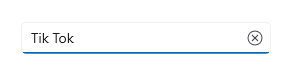
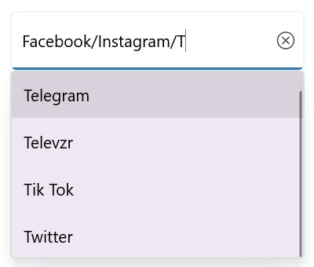
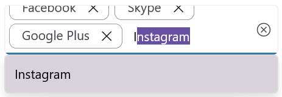
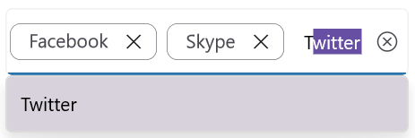
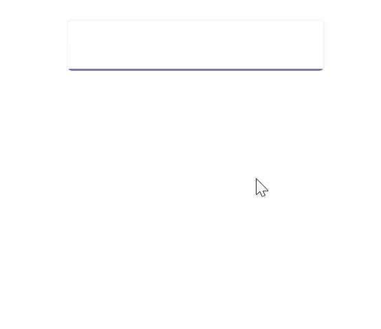
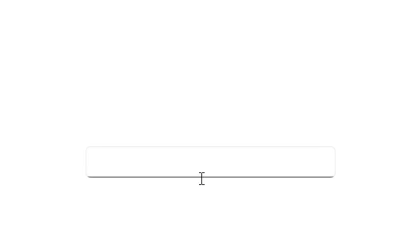
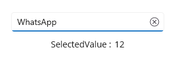
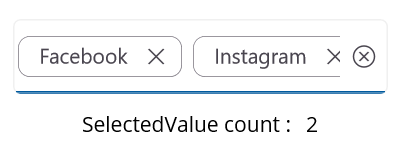
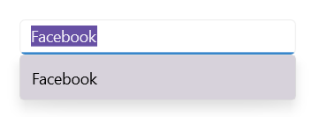

# Selection in .NET MAUI Autocomplete (SfAutocomplete)

## Prerequisites

Before using the [SfAutocomplete](https://help.syncfusion.com/cr/maui/Syncfusion.Maui.Inputs.SfAutocomplete.html), ensure the following NuGet package is installed in your .NET MAUI project:

- `Syncfusion.Maui.Inputs`

For step-by-step setup, refer to the [Getting Started](Getting-Started.md) documentation.

## Overview

The [SfAutocomplete](https://help.syncfusion.com/cr/maui/Syncfusion.Maui.Inputs.SfAutocomplete.html) allows users to select a single item or multiple items from the drop-down. The selection mode is set by using the [SelectionMode](https://help.syncfusion.com/cr/maui/Syncfusion.Maui.Inputs.SfAutocomplete.html#Syncfusion_Maui_Inputs_SfAutocomplete_SelectionMode) property. The supported values are [Single](https://help.syncfusion.com/cr/maui/Syncfusion.Maui.Inputs.AutocompleteSelectionMode.html#Syncfusion_Maui_Inputs_AutocompleteSelectionMode_Single) and [Multiple](https://help.syncfusion.com/cr/maui/Syncfusion.Maui.Inputs.AutocompleteSelectionMode.html#Syncfusion_Maui_Inputs_AutocompleteSelectionMode_Multiple).

### Properties

| Property | Type | Default | Description |
|----------|------|---------|-------------|
| `SelectionMode` | `AutocompleteSelectionMode` | `Single` | Specifies single or multiple selection. |
| `SelectedItem` | `object` | `null` | Gets or sets the currently selected item (single mode). |
| `SelectedItems` | `IList` | `null` | Gets or sets the collection of selected items (multiple mode). |
| `SelectedValue` | `object` | `null` | Gets or sets the value(s) of the selected item(s) based on `SelectedValuePath`. |
| `SelectedValuePath` | `string` | `null` | The property path used to populate `SelectedValue`. |
| `MultiSelectionDisplayMode` | `AutocompleteMultiSelectionDisplayMode` | `Token` | Specifies how selected items are displayed in multiple mode. Values: `Token`, `Delimiter`. |
| `TokensWrapMode` | `AutocompleteTokensWrapMode` | `None` | Specifies how tokens are arranged when `MultiSelectionDisplayMode` is `Token`. Values: `Wrap`, `None`. |
| `DelimiterText` | `string` | `,` | The character used to separate selected items in `Delimiter` mode. |
| `IsClearButtonVisible` | `bool` | `true` | Gets or sets a value that indicates whether the clear button is shown. |
| `IsDropDownOpen` | `bool` | `false` | Gets or sets a value that indicates whether the drop-down is open. |

### Events

| Event | Description |
|-------|-------------|
| `SelectionChanging` | Raised when the selection is about to change. Use the `Cancel` property of the event args to prevent the change. |
| `SelectionChanged` | Raised after the selection has changed. Exposes the `AddedItems` and `RemovedItems` collections. |

## Model and ViewModel

The samples on this page use the following `SocialMedia` model and view model.




public class SocialMedia
{
    public string Name { get; set; }
    public int ID { get; set; }
}

public class SocialMediaViewModel
{
    public ObservableCollection<SocialMedia> SocialMedias { get; set; } = new ObservableCollection<SocialMedia>
    {
        new SocialMedia { Name = "Facebook", ID = 0 },
        new SocialMedia { Name = "Google Plus", ID = 1 },
        new SocialMedia { Name = "Instagram", ID = 2 },
        new SocialMedia { Name = "LinkedIn", ID = 3 },
        new SocialMedia { Name = "Skype", ID = 4 },
        new SocialMedia { Name = "Telegram", ID = 5 },
        new SocialMedia { Name = "Tik Tok", ID = 6 },
        new SocialMedia { Name = "Twitter", ID = 7 },
        new SocialMedia { Name = "WhatsApp", ID = 8 },
        new SocialMedia { Name = "YouTube", ID = 9 }
    };

    public ObservableCollection<SocialMedia> SelectedItemsList { get; set; } = new ObservableCollection<SocialMedia>();
    public ObservableCollection<object> SelectedValueList { get; set; } = new ObservableCollection<object>();
}




## Single selection

The SfAutocomplete allows the user to type a value and then select an item from the drop-down. The selected item is exposed by the [SelectedItem](https://help.syncfusion.com/cr/maui/Syncfusion.Maui.Inputs.DropDownControls.DropDownListBase.html#Syncfusion_Maui_Inputs_DropDownControls_DropDownListBase_SelectedItem) property.




<editors:SfAutocomplete x:Name="autocomplete"
                        ItemsSource="{Binding SocialMedias}"
                        DisplayMemberPath="Name"
                        TextMemberPath="Name" />



var viewModel = new SocialMediaViewModel();

SfAutocomplete autocomplete = new SfAutocomplete
{
    DisplayMemberPath = "Name",
    TextMemberPath = "Name",
    ItemsSource = viewModel.SocialMedias
};




The following image illustrates single selection in the SfAutocomplete:

## Multiple selection

The SfAutocomplete allows users to select multiple values from the drop-down by setting the [SelectionMode](https://help.syncfusion.com/cr/maui/Syncfusion.Maui.Inputs.SfAutocomplete.html#Syncfusion_Maui_Inputs_SfAutocomplete_SelectionMode) property to [Multiple](https://help.syncfusion.com/cr/maui/Syncfusion.Maui.Inputs.AutocompleteSelectionMode.html#Syncfusion_Maui_Inputs_AutocompleteSelectionMode_Multiple).

The selected items can be retrieved or set programmatically by using the [SelectedItems](https://help.syncfusion.com/cr/maui/Syncfusion.Maui.Inputs.DropDownControls.DropDownListBase.html#Syncfusion_Maui_Inputs_DropDownControls_DropDownListBase_SelectedItems) property.

You can choose how the selected items are displayed using the [MultiSelectionDisplayMode](https://help.syncfusion.com/cr/maui/Syncfusion.Maui.Inputs.AutocompleteMultiSelectionDisplayMode.html) property. The default value is [Token](https://help.syncfusion.com/cr/maui/Syncfusion.Maui.Inputs.AutocompleteMultiSelectionDisplayMode.html#Syncfusion_Maui_Inputs_AutocompleteMultiSelectionDisplayMode_Token). The supported values are:

- [Delimiter](https://help.syncfusion.com/cr/maui/Syncfusion.Maui.Inputs.AutocompleteMultiSelectionDisplayMode.html#Syncfusion_Maui_Inputs_AutocompleteMultiSelectionDisplayMode_Delimiter)
- [Token](https://help.syncfusion.com/cr/maui/Syncfusion.Maui.Inputs.AutocompleteMultiSelectionDisplayMode.html#Syncfusion_Maui_Inputs_AutocompleteMultiSelectionDisplayMode_Token)




<editors:SfAutocomplete x:Name="autoComplete"
                        SelectionMode="Multiple"
                        ItemsSource="{Binding SocialMedias}"
                        SelectedItems="{Binding SelectedItemsList}"
                        DisplayMemberPath="Name"
                        TextMemberPath="Name" />




var viewModel = new SocialMediaViewModel();

SfAutocomplete autocomplete = new SfAutocomplete
{
    SelectionMode = AutocompleteSelectionMode.Multiple,
    ItemsSource = viewModel.SocialMedias,
    SelectedItems = viewModel.SelectedItemsList,
    DisplayMemberPath = "Name",
    TextMemberPath = "Name"
};




### Delimiter mode

When [MultiSelectionDisplayMode](https://help.syncfusion.com/cr/maui/Syncfusion.Maui.Inputs.AutocompleteMultiSelectionDisplayMode.html) is set to [Delimiter](https://help.syncfusion.com/cr/maui/Syncfusion.Maui.Inputs.AutocompleteMultiSelectionDisplayMode.html#Syncfusion_Maui_Inputs_AutocompleteMultiSelectionDisplayMode_Delimiter), the selected items are separated by the character defined by the [DelimiterText](https://help.syncfusion.com/cr/maui/Syncfusion.Maui.Inputs.DropDownControls.DropDownListBase.html#Syncfusion_Maui_Inputs_DropDownControls_DropDownListBase_DelimiterText) property. The default value of `DelimiterText` is `,`.




<editors:SfAutocomplete x:Name="autoComplete"
                        ItemsSource="{Binding SocialMedias}"
                        SelectionMode="Multiple"
                        MultiSelectionDisplayMode="Delimiter"
                        DelimiterText="/"
                        MaxDropDownHeight="250"
                        DisplayMemberPath="Name"
                        TextMemberPath="Name"
                        Placeholder="Enter Media" />




SfAutocomplete autocomplete = new SfAutocomplete
{
    ItemsSource = new SocialMediaViewModel().SocialMedias,
    SelectionMode = AutocompleteSelectionMode.Multiple,
    MultiSelectionDisplayMode = AutocompleteMultiSelectionDisplayMode.Delimiter,
    DelimiterText = "/",
    MaxDropDownHeight = 250,
    DisplayMemberPath = "Name",
    TextMemberPath = "Name",
    Placeholder = "Enter Media"
};




### Token mode

When [MultiSelectionDisplayMode](https://help.syncfusion.com/cr/maui/Syncfusion.Maui.Inputs.AutocompleteMultiSelectionDisplayMode.html) is set to `Token`, the selected items are displayed as tokens. The arrangement of the tokens is controlled by the [TokensWrapMode](https://help.syncfusion.com/cr/maui/Syncfusion.Maui.Inputs.SfAutocomplete.html#Syncfusion_Maui_Inputs_SfAutocomplete_TokensWrapMode) property. The supported values are:

- [Wrap](https://help.syncfusion.com/cr/maui/Syncfusion.Maui.Inputs.AutocompleteTokensWrapMode.html#Syncfusion_Maui_Inputs_AutocompleteTokensWrapMode_Wrap)
- [None](https://help.syncfusion.com/cr/maui/Syncfusion.Maui.Inputs.AutocompleteTokensWrapMode.html#Syncfusion_Maui_Inputs_AutocompleteTokensWrapMode_None)

#### Wrap mode

When [TokensWrapMode](https://help.syncfusion.com/cr/maui/Syncfusion.Maui.Inputs.SfAutocomplete.html#Syncfusion_Maui_Inputs_SfAutocomplete_TokensWrapMode) is set to [Wrap](https://help.syncfusion.com/cr/maui/Syncfusion.Maui.Inputs.AutocompleteTokensWrapMode.html#Syncfusion_Maui_Inputs_AutocompleteTokensWrapMode_Wrap), the selected tokens wrap to the next line of the SfAutocomplete.




<editors:SfAutocomplete x:Name="autoComplete"
                        ItemsSource="{Binding SocialMedias}"
                        SelectionMode="Multiple"
                        MaxDropDownHeight="250"
                        DisplayMemberPath="Name"
                        Placeholder="Enter Media"
                        TextMemberPath="Name"
                        TokensWrapMode="Wrap" />




SfAutocomplete autoComplete = new SfAutocomplete
{
    ItemsSource = new SocialMediaViewModel().SocialMedias,
    DisplayMemberPath = "Name",
    TextMemberPath = "Name",
    Placeholder = "Enter Media",
    SelectionMode = AutocompleteSelectionMode.Multiple,
    MaxDropDownHeight = 250,
    TokensWrapMode = AutocompleteTokensWrapMode.Wrap
};




#### None mode

When [TokensWrapMode](https://help.syncfusion.com/cr/maui/Syncfusion.Maui.Inputs.SfAutocomplete.html#Syncfusion_Maui_Inputs_SfAutocomplete_TokensWrapMode) is set to [None](https://help.syncfusion.com/cr/maui/Syncfusion.Maui.Inputs.AutocompleteTokensWrapMode.html#Syncfusion_Maui_Inputs_AutocompleteTokensWrapMode_None), the selected tokens are displayed on a single horizontal line.




<editors:SfAutocomplete x:Name="autoComplete"
                        ItemsSource="{Binding SocialMedias}"
                        DisplayMemberPath="Name"
                        TextMemberPath="Name"
                        Placeholder="Enter Media"
                        SelectionMode="Multiple"
                        MaxDropDownHeight="250"
                        TokensWrapMode="None" />




SfAutocomplete autoComplete = new SfAutocomplete
{
    ItemsSource = new SocialMediaViewModel().SocialMedias,
    SelectionMode = AutocompleteSelectionMode.Multiple,
    MaxDropDownHeight = 250,
    DisplayMemberPath = "Name",
    Placeholder = "Enter Media",
    TextMemberPath = "Name",
    TokensWrapMode = AutocompleteTokensWrapMode.None
};




## Selection changing notification

When the user attempts to select an item, the [SelectionChanging](https://help.syncfusion.com/cr/maui/Syncfusion.Maui.Inputs.DropDownControls.DropDownListBase.html#Syncfusion_Maui_Inputs_DropDownControls_DropDownListBase_SelectionChanging) event is raised. The event lets you intercept the selection and optionally cancel it. The `SelectionChangingEventArgs` provides the following data:

- [CurrentSelection](https://help.syncfusion.com/cr/maui/Syncfusion.Maui.Inputs.SelectionChangingEventArgs.html#Syncfusion_Maui_Inputs_SelectionChangingEventArgs_CurrentSelection) - the items that are about to be selected.
- [PreviousSelection](https://help.syncfusion.com/cr/maui/Syncfusion.Maui.Inputs.SelectionChangingEventArgs.html#Syncfusion_Maui_Inputs_SelectionChangingEventArgs_PreviousSelection) - the items that were previously selected.
- `Cancel` - set to `true` to prevent the selection change.




<editors:SfAutocomplete x:Name="autocomplete"
                        ItemsSource="{Binding SocialMedias}"
                        TextMemberPath="Name"
                        DisplayMemberPath="Name"
                        SelectionChanging="OnSelectionChanging" />




SfAutocomplete autocomplete = new SfAutocomplete
{
    ItemsSource = new SocialMediaViewModel().SocialMedias,
    TextMemberPath = "Name",
    DisplayMemberPath = "Name"
};
autocomplete.SelectionChanging += OnSelectionChanging;




The event handler is implemented in the page's code-behind:




private async void OnSelectionChanging(object sender, SelectionChangingEventArgs e)
{
    await DisplayAlert("Alert", "Selecting item is changing", "Ok");
}




The following image illustrates the result of the above code:

## Selection changed notification

When the selection changes, the [SelectionChanged](https://help.syncfusion.com/cr/maui/Syncfusion.Maui.Inputs.DropDownControls.DropDownListBase.html#Syncfusion_Maui_Inputs_DropDownControls_DropDownListBase_SelectionChanged) event is raised. The `SelectionChangedEventArgs` provides the newly selected and removed items in the following collections:

- `AddedItems` - the items that were selected.
- `RemovedItems` - the items that were unselected.




<editors:SfAutocomplete x:Name="autocomplete"
                        ItemsSource="{Binding SocialMedias}"
                        TextMemberPath="Name"
                        DisplayMemberPath="Name"
                        SelectionChanged="OnSelectionChanged" />




SfAutocomplete autocomplete = new SfAutocomplete
{
    ItemsSource = new SocialMediaViewModel().SocialMedias,
    TextMemberPath = "Name",
    DisplayMemberPath = "Name"
};
autocomplete.SelectionChanged += OnSelectionChanged;




The event handler is implemented in the page's code-behind:




private async void OnSelectionChanged(object sender, SelectionChangedEventArgs e)
{
    await DisplayAlert("Alert", "Selected item has changed", "Ok");
}




The following image illustrates the result of the above code:

N> The `CurrentSelection` and `PreviousSelection` members of the legacy `SelectionChangedEventArgs` are obsolete. Use the `AddedItems` and `RemovedItems` collections instead.

## Selected value

The [SelectedValue](https://help.syncfusion.com/cr/maui/Syncfusion.Maui.Inputs.DropDownControls.DropDownListBase.html#Syncfusion_Maui_Inputs_DropDownControls_DropDownListBase_SelectedValue) property gets or sets the value of the selected item based on the [SelectedValuePath](https://help.syncfusion.com/cr/maui/Syncfusion.Maui.Inputs.DropDownControls.DropDownListBase.html#Syncfusion_Maui_Inputs_DropDownControls_DropDownListBase_SelectedValuePath) property. Use it instead of `SelectedItem` or `SelectedItems` when you only need the underlying value (for example, an `ID`).

### Single selection

In single selection mode, `SelectedValue` holds the value defined by `SelectedValuePath` (for example, `ID`).




<StackLayout>
    <editors:SfAutocomplete x:Name="autocomplete"
                            MaxDropDownHeight="250"
                            TextMemberPath="Name"
                            DisplayMemberPath="Name"
                            ItemsSource="{Binding SocialMedias}"
                            SelectedValuePath="ID"
                            SelectionChanged="OnSelectionChanged" />
    <HorizontalStackLayout>
        <Label x:Name="labelTitle" Text="SelectedValue :" />
        <Label x:Name="selectedValue" />
    </HorizontalStackLayout>
</StackLayout>




SfAutocomplete autocomplete = new SfAutocomplete
{
    MaxDropDownHeight = 250,
    TextMemberPath = "Name",
    DisplayMemberPath = "Name",
    ItemsSource = new SocialMediaViewModel().SocialMedias,
    SelectedValuePath = "ID"
};
autocomplete.SelectionChanged += OnSelectionChanged;

Label labelTitle = new Label { Text = "SelectedValue :" };
Label selectedValue = new Label();

HorizontalStackLayout horizontalLayout = new HorizontalStackLayout
{
    Children = { labelTitle, selectedValue }
};

StackLayout mainLayout = new StackLayout
{
    Children = { autocomplete, horizontalLayout }
};







private void OnSelectionChanged(object sender, SelectionChangedEventArgs e)
{
    selectedValue.Text = autocomplete.SelectedValue?.ToString();
}




The following image illustrates the result of the above code:

### Multiple selection

In multiple selection mode, `SelectedValue` is a collection (`IList<object>`) of the values derived from `SelectedItems` using `SelectedValuePath`.




<StackLayout>
    <editors:SfAutocomplete x:Name="autocomplete"
                            MaxDropDownHeight="250"
                            TextMemberPath="Name"
                            DisplayMemberPath="Name"
                            ItemsSource="{Binding SocialMedias}"
                            SelectionMode="Multiple"
                            SelectedValuePath="ID"
                            SelectedValue="{Binding SelectedValueList}"
                            SelectionChanged="OnSelectionChanged"/>
    <HorizontalStackLayout>
        <Label x:Name="labelTitle" Text="SelectedValue count :"/>
        <Label x:Name="selectedValue"/>
    </HorizontalStackLayout>
</StackLayout>




SfAutocomplete autocomplete = new SfAutocomplete
{
    MaxDropDownHeight = 250,
    TextMemberPath = "Name",
    DisplayMemberPath = "Name",
    ItemsSource = new SocialMediaViewModel().SocialMedias,
    SelectionMode = AutocompleteSelectionMode.Multiple,
    SelectedValuePath = "ID",
    SelectedValue = new SocialMediaViewModel().SelectedValueList
};
autocomplete.SelectionChanged += OnSelectionChanged;







private void OnSelectionChanged(object sender, SelectionChangedEventArgs e)
{
    if (autocomplete.SelectedValue is IList<object> value)
    {
        selectedValue.Text = value.Count.ToString();
    }
}




The following image illustrates the result of the above code:

N> If `SelectedValuePath` is not specified, `SelectedValue` is the same as `SelectedItem` (single mode) or `SelectedItems` (multiple mode).

## Hide the clear button

By default, the clear button (`X`) is displayed in the input area of the SfAutocomplete. Hide it by setting the [IsClearButtonVisible](https://help.syncfusion.com/cr/maui/Syncfusion.Maui.Core.SfDropdownEntry.html#Syncfusion_Maui_Core_SfDropdownEntry_IsClearButtonVisibleProperty) property to `false`. The default value is `true`.




<editors:SfAutocomplete x:Name="autocomplete"
                        IsClearButtonVisible="false"
                        ItemsSource="{Binding SocialMedias}"
                        DisplayMemberPath="Name"
                        TextMemberPath="Name" />




SfAutocomplete autocomplete = new SfAutocomplete
{
    IsClearButtonVisible = false,
    ItemsSource = new SocialMediaViewModel().SocialMedias,
    DisplayMemberPath = "Name",
    TextMemberPath = "Name"
};




The following image illustrates the result of the above code:

## Programmatically open or close the drop-down

You can open or close the drop-down programmatically by using the [IsDropDownOpen](https://help.syncfusion.com/cr/maui/Syncfusion.Maui.Core.SfDropdownEntry.html#Syncfusion_Maui_Core_SfDropdownEntry_IsDropDownOpen) property. The default value is `false`.




<editors:SfAutocomplete x:Name="autocomplete"
                        ItemsSource="{Binding SocialMedias}"
                        IsDropDownOpen="True"
                        DisplayMemberPath="Name"
                        TextMemberPath="Name" />




SfAutocomplete autocomplete = new SfAutocomplete
{
    ItemsSource = new SocialMediaViewModel().SocialMedias,
    IsDropDownOpen = true,
    DisplayMemberPath = "Name",
    TextMemberPath = "Name"
};




## Clear selected items

You can remove the selected items and the input text programmatically by calling the [Clear](https://help.syncfusion.com/cr/maui/Syncfusion.Maui.Inputs.DropDownControls.DropDownListBase.html#Syncfusion_Maui_Inputs_DropDownControls_DropDownListBase_Clear) method on the SfAutocomplete.




autocomplete.Clear();




## Notes

N> **Selection event args**: The `SelectionChangedEventArgs` exposes `AddedItems` and `RemovedItems` for new/removed items. The legacy `CurrentSelection` and `PreviousSelection` members are obsolete.

N> **iOS AOT**: When publishing in AOT mode on iOS, add `[Preserve(AllMembers = true)]` to the model class. The attribute requires `using Foundation;`.

## See also

- [Getting Started](Getting-Started.md)
- [Basic Features](Basic-Features.md)
- [UI Customization](UI-Customization.md)
- [Searching and Filtering](Searching-Filtering.md)
