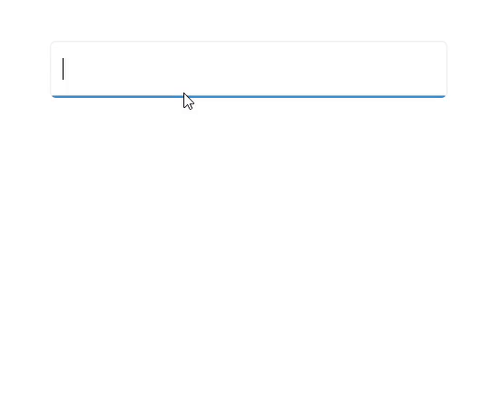
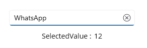

# Selection in .NET MAUI Autocomplete (SfAutocomplete)

The [.NET MAUI Autocomplete](https://help.syncfusion.com/cr/maui/Syncfusion.Maui.Inputs.SfAutocomplete.html) allows user to select single or multiple items. The selection mode can be set by using the [SelectionMode](https://help.syncfusion.com/cr/maui/Syncfusion.Maui.Inputs.SfAutocomplete.html#Syncfusion_Maui_Inputs_SfAutocomplete_SelectionMode) property. There are two different selection modes: [Single](https://help.syncfusion.com/cr/maui/Syncfusion.Maui.Inputs.AutocompleteSelectionMode.html#Syncfusion_Maui_Inputs_AutocompleteSelectionMode_Single) and [Multiple](https://help.syncfusion.com/cr/maui/Syncfusion.Maui.Inputs.AutocompleteSelectionMode.html#Syncfusion_Maui_Inputs_AutocompleteSelectionMode_Multiple).

## Single selection

The [Autocomplete](https://help.syncfusion.com/cr/maui/Syncfusion.Maui.Inputs.SfAutocomplete.html) allows the user to select an item by entering the value using the keyboard, then selecting from the drop-down list by clicking the item. The selected item can be retrieved from the [SelectedItem](https://help.syncfusion.com/cr/maui/Syncfusion.Maui.Inputs.DropDownControls.DropDownListBase.html#Syncfusion_Maui_Inputs_DropDownControls_DropDownListBase_SelectedItem) property.




//Model.cs
public class SocialMedia
{
    public string Name { get; set; }
    public int ID { get; set; }
}

//ViewModel.cs
public class SocialMediaViewModel
{
    public ObservableCollection<SocialMedia> SocialMedias { get; set; }
    public SocialMediaViewModel()
    {
        this.SocialMedias = new ObservableCollection<SocialMedia>();
        this.SocialMedias.Add(new SocialMedia() { Name = "Facebook", ID = 0 });
        this.SocialMedias.Add(new SocialMedia() { Name = "Google Plus", ID = 1 });
        this.SocialMedias.Add(new SocialMedia() { Name = "Instagram", ID = 2 });
        this.SocialMedias.Add(new SocialMedia() { Name = "LinkedIn", ID = 3 });
        this.SocialMedias.Add(new SocialMedia() { Name = "Skype", ID = 4 });
        this.SocialMedias.Add(new SocialMedia() { Name = "Telegram", ID = 5 });
        this.SocialMedias.Add(new SocialMedia() { Name = "Televzr", ID = 6 });
        this.SocialMedias.Add(new SocialMedia() { Name = "Tik Tok", ID = 7 });
        this.SocialMedias.Add(new SocialMedia() { Name = "Tout", ID = 8 });
        this.SocialMedias.Add(new SocialMedia() { Name = "Tumblr", ID = 9 });
        this.SocialMedias.Add(new SocialMedia() { Name = "Twitter", ID = 10 });
        this.SocialMedias.Add(new SocialMedia() { Name = "Vimeo", ID = 11 });
        this.SocialMedias.Add(new SocialMedia() { Name = "WhatsApp", ID = 12 });
        this.SocialMedias.Add(new SocialMedia() { Name = "YouTube", ID = 13 });
    }
}







<editors:SfAutoComplete x:Name="autocomplete"
                        WidthRequest="250"
                        ItemsSource="{Binding SocialMedias}"
                        DisplayMemberPath="Name"
                        TextMemberPath="Name" />




SfAutocomplete autocomplete = new SfAutoComplete();
SocialMediaViewModel socialMediaViewModel = new SocialMediaViewModel();
autocomplete.BindingContext = socialMediaViewModel;
autocomplete.ItemsSource = SocialMediaViewModel.SocialMedias;
autocomplete.DisplayMemberPath = "Name";
autocomplete.TextMemberPath = "Name";




The following gif image illustrates the result of the above code:

## Multiple selection

The AutoComplete allows user to select multiple values by beginning to enter the input and selecting items from the drop-down list. The multi-select AutoComplete mode can be enabled by setting the [SelectionMode](https://help.syncfusion.com/cr/maui/Syncfusion.Maui.Inputs.SfAutocomplete.html#Syncfusion_Maui_Inputs_SfAutocomplete_SelectionMode) property as [Multiple](https://help.syncfusion.com/cr/maui/Syncfusion.Maui.Inputs.AutocompleteSelectionMode.html#Syncfusion_Maui_Inputs_AutocompleteSelectionMode_Multiple). 

Selected items will be displayed with a  token representation and each tokenized items can be removed by clicking their close button. The selected items can be retrieved from the [SelectedItems](https://help.syncfusion.com/cr/maui/Syncfusion.Maui.Inputs.DropDownControls.DropDownListBase.html#Syncfusion_Maui_Inputs_DropDownControls_DropDownListBase_SelectedItems) property.





 <editors:SfAutocomplete
 SelectionMode="Multiple"
 WidthRequest="350"
 HeightRequest="50"
 ItemsSource="{Binding SocialMedias}"
 DisplayMemberPath="Name"
 TextMemberPath="Name"    
 Width="250"
 x:Name="autoComplete" />





autoComplete.SelectionMode = Syncfusion.Maui.Inputs.AutocompleteSelectionMode.Multiple;




The following gif image illustrates the result of the above code:

### Programmatic selection

The selected items can be changed programmatically by using the [SelectedItems](https://help.syncfusion.com/cr/maui/Syncfusion.Maui.Inputs.DropDownControls.DropDownListBase.html#Syncfusion_Maui_Inputs_DropDownControls_DropDownListBase_SelectedItems) property of Autocomplete control. This property allows both getting and setting of the selected items in the Autocomplete control.





  <editors:SfAutocomplete x:Name="autoComplete"
                SelectionMode="Multiple"
                WidthRequest="350"
                HeightRequest="50"
                ItemsSource="{Binding SocialMedias}"
                SelectedItems="{Binding SelectedItemsList}"
                DisplayMemberPath="Name"
                TextMemberPath="Name" />





  public ObservableCollection<SocialMedia> SelectedItemsList { get; set; }
  SocialMediaViewModel socialMediaViewModel = (this.autoComplete.BindingContext as SocialMediaViewModel);
  ObservableCollection<SocialMedia> socialMediasList = socialMediaViewModel.SocialMedias;
  SelectedItemsList = new ObservableCollection<SocialMedia>();
  SelectedItemsList.Add(socialMediasList[0]);
  SelectedItemsList.Add(socialMediasList[2]);
  SelectedItemsList.Add(socialMediasList[4]);





### TokensWrapMode

There are two ways to display multi-selection items in the AutoComplete control. They are:

* Wrap
* None

#### Wrap mode

When the TokensWrapMode is set to Wrap, the selected items will be wrapped to the next line of the SfAutoComplete.





 <editors:SfAutoComplete x:Name="autoComplete" 
             HeightRequest="50"
             WidthRequest="350"
             ItemsSource="{Binding SocialMedias}"
             SelectionMode="Multiple"
             MaxDropDownHeight="250"
             DisplayMemberPath="Name"
             TextMemberPath="Name"
             TokensWrapMode="Wrap" />





#### None Mode

When the TokensWrapMode is set to None, the selected item will be wrapped in a horizontal orientation.





 <editors:SfAutoComplete x:Name="autoComplete" 
             HeightRequest="50"
             WidthRequest="350"
             ItemsSource="{Binding SocialMedias}"
             SelectionMode="Multiple"
             MaxDropDownHeight="250"
             DisplayMemberPath="Name"
             TextMemberPath="Name"
             TokensWrapMode="None" />




 
## Selection changed notification

When an item is selected from the drop-down list, the [SelectionChanged](https://help.syncfusion.com/cr/maui/Syncfusion.Maui.Inputs.DropDownControls.DropDownListBase.html#Syncfusion_Maui_Inputs_DropDownControls_DropDownListBase_SelectionChanged) event is triggered. The SelectionChanged event contains the newly selected and removed items in the `AddedItems` and `RemovedItems` properties. The SelectionChanged Event contains the following properties:

 * `AddedItems` - Contains the item that were currently selected.
 * `RemovedItems` - Contains the item that were unselected.




<editors:SfAutoComplete x:Name="autocomplete"
                        WidthRequest="250"
                        ItemsSource="{Binding SocialMedias}"
                        TextMemberPath="Name"
                        DisplayMemberPath="Name"
                        SelectionChanged="OnSelectionChanged"/>





autocomplete.SelectionChanged += OnSelectionChanged;




The `SelectionChanged` event can be handled as follows:




private async void OnSelectionChanged(object sender, Syncfusion.Maui.Inputs.SelectionChangedEventArgs e)
{
    await DisplayAlert("Alert", "Selected Item has changed", "Ok");
}




The following gif image illustrates the result of the above code:

N> SelectionChanged event arguments `CurrentSelection` and `PreviousSelection` marked as "Obsolete". You can use the `AddedItems` and `RemovedItems` event arguments.

## Get the selected value

The [SelectedValuePath](https://help.syncfusion.com/cr/maui/Syncfusion.Maui.Inputs.DropDownControls.DropDownListBase.html#Syncfusion_Maui_Inputs_DropDownControls_DropDownListBase_SelectedValuePath)  property allows you to specify a SelectedValue for a Autocomplete's [SelectedItem](https://help.syncfusion.com/cr/maui/Syncfusion.Maui.Inputs.DropDownControls.DropDownListBase.html#Syncfusion_Maui_Inputs_DropDownControls_DropDownListBase_SelectedItem). The SelectedItem represents an object in the `Items` collection, and the `Autocomplete` displays the value of the selected item's single property. The `SelectedValuePath` property specifies the path to the property that is used to determine the [SelectedValue](https://help.syncfusion.com/cr/maui/Syncfusion.Maui.Inputs.DropDownControls.DropDownListBase.html#Syncfusion_Maui_Inputs_DropDownControls_DropDownListBase_SelectedValue) property's value. The default value of SelectedValue and SelectedValuePath is `null`.

For example, when you select any `SocialMedia.Name` in the `Autocomplete,` the `SelectedItem` property returns the `SocialMedia` data item that corresponds to the selected `SocialMedia.Name.` However, because the `SelectedValuePath` of this `Autocomplete` is set to `SocialMedia.ID,` the `SelectedValue` is set to the `SocialMedia.ID.`




<editors:SfAutoComplete x:Name="autoComplete"
                        WidthRequest="250"
                        SelectedValuePath="ID"
                        TextMemberPath="Name"   
                        DisplayMemberPath="Name"
                        ItemsSource="{Binding SocialMedias}" 
                        SelectionChanged="OnSelectionChanged"/>

<Label Text="SelectedValue :" />
<Label x:Name="selectedValue" />




autoComplete.SelectedValuePath = "ID";
autoComplete.SelectionChanged += OnSelectionChanged;







private void OnSelectionChanged(object sender, Syncfusion.Maui.Inputs.SelectionChangedEventArgs e)
{
    selectedValue.Text = autocomplete.SelectedValue.ToString();
}




The following gif image illustrates the result of the above code:

## Hide clear button in the Autocomplete

By default, the clear button `X` will be displayed in the editor of the [Autocomplete](https://help.syncfusion.com/cr/maui/Syncfusion.Maui.Inputs.SfAutocomplete.html) control, which can be used to clear the entered input. Hide the clear button in Autocomplete control using the [IsClearButtonVisible](https://help.syncfusion.com/cr/maui/Syncfusion.Maui.Core.SfDropdownEntry.html#Syncfusion_Maui_Core_SfDropdownEntry_IsClearButtonVisibleProperty) property. The default value of IsClearButtonVisible property value is `true`.




<editors:SfAutocomplete x:Name="autocomplete"
                        WidthRequest="250"
                        IsClearButtonVisible="false"
                        ItemsSource="{Binding SocialMedias}"
                        DisplayMemberPath="Name"
                        TextMemberPath="Name" />





autocomplete.IsClearButtonVisible = false;




The following image illustrates the result of the above code:

## Is Drop-Down Open

The [IsDropDownOpen](https://help.syncfusion.com/cr/maui/Syncfusion.Maui.Core.SfDropdownEntry.html#Syncfusion_Maui_Core_SfDropdownEntry_IsDropDownOpenProperty) property in the Autocomplete control can be used to get a boolean value indicating whether the drop-down is open or closed state. It returns `true` if the drop-down is open, otherwise `false`.

N> Currently, users can only get the boolean value based on whether a drop-down menu is open or not; the property "IsDropDownOpen" cannot be set.




<editors:SfAutocomplete x:Name="autocomplete"
                        WidthRequest="250"
                        ItemsSource="{Binding SocialMedias}"
                        DisplayMemberPath="Name"
                        TextMemberPath="Name">
</editors:SfAutocomplete>




bool isAutocompleteDropDownOpen = autocomplete.IsDropDownOpen;


