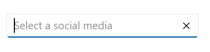
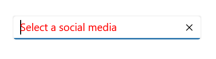
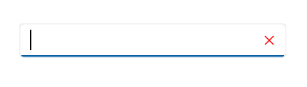
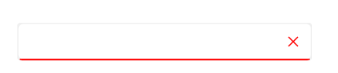
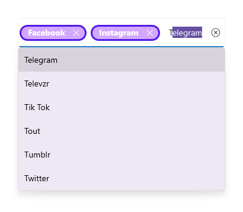
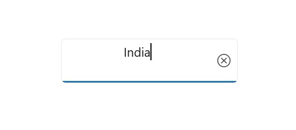
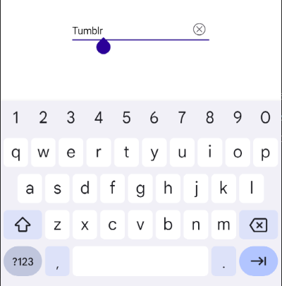
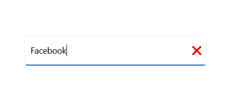

# UI Customization in .NET MAUI Autocomplete

This section explains different UI customizations available in the [.NET MAUI Autocomplete](https://help.syncfusion.com/cr/maui/Syncfusion.Maui.Inputs.SfAutocomplete.html) control.

## Prerequisites

Before using the [SfAutocomplete](https://help.syncfusion.com/cr/maui/Syncfusion.Maui.Inputs.SfAutocomplete.html), ensure the following NuGet package is installed in your .NET MAUI project:

- `Syncfusion.Maui.Inputs`

For a step-by-step setup, refer to the [Getting Started](https://help.syncfusion.com/maui/autocomplete/getting-started) documentation.

To get started quickly on customizing the appearance of the .NET MAUI Autocomplete, you can check out this video:



## Placeholder

You can prompt the user with any information by using the [Placeholder](https://help.syncfusion.com/cr/maui/Syncfusion.Maui.Core.SfDropdownEntry.html#Syncfusion_Maui_Core_SfDropdownEntry_Placeholder) property. This text will be displayed only if no items are selected or the edit text is empty. The default value of the Placeholder property is `string.Empty` (No string will be displayed).




<editors:SfAutocomplete x:Name="autocomplete"
                        Placeholder="Select a social media"
                        ItemsSource="{Binding SocialMedias}"
                        DisplayMemberPath="Name"
                        TextMemberPath="Name" />




SfAutocomplete autocomplete = new SfAutocomplete
{
    Placeholder = "Select a social media",
    ItemsSource = socialMediaViewModel.SocialMedias,
    DisplayMemberPath = "Name",
    TextMemberPath = "Name"
};




// ViewModel
public class SocialMediaViewModel
{
    public ObservableCollection<SocialMedia> SocialMedias { get; set; }

    public SocialMediaViewModel()
    {
        this.SocialMedias = new ObservableCollection<SocialMedia>
        {
            new SocialMedia { Name = "Facebook", ID = 0 },
            new SocialMedia { Name = "Google Plus", ID = 1 },
            new SocialMedia { Name = "Instagram", ID = 2 },
            new SocialMedia { Name = "LinkedIn", ID = 3 },
            new SocialMedia { Name = "Skype", ID = 4 },
            new SocialMedia { Name = "Telegram", ID = 5 },
            new SocialMedia { Name = "Twitter", ID = 6 },
            new SocialMedia { Name = "WhatsApp", ID = 7 },
            new SocialMedia { Name = "YouTube", ID = 8 }
        };
    }
}

public class SocialMedia
{
    public string Name { get; set; }
    public int ID { get; set; }
}




The following image illustrates the result of the above code:

## Placeholder Color

The placeholder text color can be changed by using the [PlaceholderColor](https://help.syncfusion.com/cr/maui/Syncfusion.Maui.Core.SfDropdownEntry.html#Syncfusion_Maui_Core_SfDropdownEntry_PlaceholderColor) property. The default value of the PlaceholderColor property is `Colors.Black`.




<editors:SfAutocomplete x:Name="autocomplete"
                        ItemsSource="{Binding SocialMedias}"
                        DisplayMemberPath="Name"
                        TextMemberPath="Name"
                        Placeholder="Select a social media"
                        PlaceholderColor="Red" />




SfAutocomplete autocomplete = new SfAutocomplete
{
    ItemsSource = socialMediaViewModel.SocialMedias,
    DisplayMemberPath = "Name",
    TextMemberPath = "Name",
    Placeholder = "Select a social media",
    PlaceholderColor = Colors.Red
};




// ViewModel
public class SocialMediaViewModel
{
    public ObservableCollection<SocialMedia> SocialMedias { get; set; }

    public SocialMediaViewModel()
    {
        this.SocialMedias = new ObservableCollection<SocialMedia>
        {
            new SocialMedia { Name = "Facebook", ID = 0 },
            new SocialMedia { Name = "Google Plus", ID = 1 },
            new SocialMedia { Name = "Instagram", ID = 2 },
            new SocialMedia { Name = "LinkedIn", ID = 3 },
            new SocialMedia { Name = "Skype", ID = 4 },
            new SocialMedia { Name = "Telegram", ID = 5 },
            new SocialMedia { Name = "Twitter", ID = 6 },
            new SocialMedia { Name = "WhatsApp", ID = 7 },
            new SocialMedia { Name = "YouTube", ID = 8 }
        };
    }
}

public class SocialMedia
{
    public string Name { get; set; }
    public int ID { get; set; }
}




The following gif image illustrates the result of the above code:

## Clear Button Icon Color

The clear button icon color can be changed by using the [ClearButtonIconColor](https://help.syncfusion.com/cr/maui/Syncfusion.Maui.Core.SfDropdownEntry.html#Syncfusion_Maui_Core_SfDropdownEntry_ClearButtonIconColor) property. The default value of the `ClearButtonIconColor` property is `Color.FromArgb("#49454F")`.




<editors:SfAutocomplete x:Name="autocomplete"
                        ItemsSource="{Binding SocialMedias}"
                        DisplayMemberPath="Name"
                        TextMemberPath="Name"
                        Placeholder="Select a social media"
                        PlaceholderColor="Red"
                        ClearButtonIconColor="Red" />




SfAutocomplete autocomplete = new SfAutocomplete
{
    ItemsSource = socialMediaViewModel.SocialMedias,
    DisplayMemberPath = "Name",
    TextMemberPath = "Name",
    Placeholder = "Select a social media",
    PlaceholderColor = Colors.Red,
    ClearButtonIconColor = Colors.Red
};




// ViewModel
public class SocialMediaViewModel
{
    public ObservableCollection<SocialMedia> SocialMedias { get; set; }

    public SocialMediaViewModel()
    {
        this.SocialMedias = new ObservableCollection<SocialMedia>
        {
            new SocialMedia { Name = "Facebook", ID = 0 },
            new SocialMedia { Name = "Google Plus", ID = 1 },
            new SocialMedia { Name = "Instagram", ID = 2 },
            new SocialMedia { Name = "LinkedIn", ID = 3 },
            new SocialMedia { Name = "Skype", ID = 4 },
            new SocialMedia { Name = "Telegram", ID = 5 },
            new SocialMedia { Name = "Twitter", ID = 6 },
            new SocialMedia { Name = "WhatsApp", ID = 7 },
            new SocialMedia { Name = "YouTube", ID = 8 }
        };
    }
}

public class SocialMedia
{
    public string Name { get; set; }
    public int ID { get; set; }
}




The following gif image illustrates the result of the above code:

## Stroke

The Autocomplete border color can be changed by using the [`Stroke`](https://help.syncfusion.com/cr/maui/Syncfusion.Maui.Core.SfDropdownEntry.html#Syncfusion_Maui_Core_SfDropdownEntry_Stroke) property. The default value of the `Stroke` property is `Colors.LightGray`.




<editors:SfAutocomplete x:Name="autocomplete"
                        ItemsSource="{Binding SocialMedias}"
                        DisplayMemberPath="Name"
                        TextMemberPath="Name"
                        Placeholder="Select a social media"
                        PlaceholderColor="Red"
                        Stroke="Red" />




SfAutocomplete autocomplete = new SfAutocomplete
{
    ItemsSource = socialMediaViewModel.SocialMedias,
    DisplayMemberPath = "Name",
    TextMemberPath = "Name",
    Placeholder = "Select a social media",
    PlaceholderColor = Colors.Red,
    Stroke = Colors.Red
};




// ViewModel
public class SocialMediaViewModel
{
    public ObservableCollection<SocialMedia> SocialMedias { get; set; }

    public SocialMediaViewModel()
    {
        this.SocialMedias = new ObservableCollection<SocialMedia>
        {
            new SocialMedia { Name = "Facebook", ID = 0 },
            new SocialMedia { Name = "Google Plus", ID = 1 },
            new SocialMedia { Name = "Instagram", ID = 2 },
            new SocialMedia { Name = "LinkedIn", ID = 3 },
            new SocialMedia { Name = "Skype", ID = 4 },
            new SocialMedia { Name = "Telegram", ID = 5 },
            new SocialMedia { Name = "Twitter", ID = 6 },
            new SocialMedia { Name = "WhatsApp", ID = 7 },
            new SocialMedia { Name = "YouTube", ID = 8 }
        };
    }
}

public class SocialMedia
{
    public string Name { get; set; }
    public int ID { get; set; }
}




The following gif image illustrates the result of the above code.

## Customize the Selection Text Highlight Color

The [SelectionTextHighlightColor](https://help.syncfusion.com/cr/maui/Syncfusion.Maui.Inputs.DropDownControls.DropDownListBase.html#Syncfusion_Maui_Inputs_DropDownControls_DropDownListBase_SelectionTextHighlightColor) property is used to modify the background color of the selected item text in the autocomplete control. The default value of the `SelectionTextHighlightColor` property is `Color.FromArgb("#6750A4")`.




<editors:SfAutocomplete x:Name="autocomplete"
                        ItemsSource="{Binding SocialMedias}"
                        DisplayMemberPath="Name"
                        TextMemberPath="Name"
                        Placeholder="Enter Media"
                        SelectionTextHighlightColor="Green" />





SfAutocomplete autocomplete = new SfAutocomplete
{
    ItemsSource = socialMediaViewModel.SocialMedias,
    DisplayMemberPath = "Name",
    TextMemberPath = "Name",
    Placeholder = "Enter Media",
    SelectionTextHighlightColor = Colors.Green
};




// ViewModel
public class SocialMediaViewModel
{
    public ObservableCollection<SocialMedia> SocialMedias { get; set; }

    public SocialMediaViewModel()
    {
        this.SocialMedias = new ObservableCollection<SocialMedia>
        {
            new SocialMedia { Name = "Facebook", ID = 0 },
            new SocialMedia { Name = "Google Plus", ID = 1 },
            new SocialMedia { Name = "Instagram", ID = 2 },
            new SocialMedia { Name = "LinkedIn", ID = 3 },
            new SocialMedia { Name = "Skype", ID = 4 },
            new SocialMedia { Name = "Telegram", ID = 5 },
            new SocialMedia { Name = "Twitter", ID = 6 },
            new SocialMedia { Name = "WhatsApp", ID = 7 },
            new SocialMedia { Name = "YouTube", ID = 8 }
        };
    }
}

public class SocialMedia
{
    public string Name { get; set; }
    public int ID { get; set; }
}




## Styling token items

The Autocomplete control allows you to customize the style of the TokenItem generated in the selection area by using the TokenItemStyle property.





 ...
  xmlns:core="clr-namespace:Syncfusion.Maui.Core;assembly=Syncfusion.Maui.Core"
  xmlns:editors="clr-namespace:Syncfusion.Maui.Inputs;assembly=Syncfusion.Maui.Inputs"
 ...

<editors:SfAutocomplete x:Name="autoComplete"
                        SelectionMode="Multiple"
                        ItemsSource="{Binding SocialMedias}"
                        DisplayMemberPath="Name"
                        TextMemberPath="Name" > 
    <editors:SfAutocomplete.TokenItemStyle>
        
    </editors:SfAutocomplete.TokenItemStyle>
</editors:SfAutocomplete>





The following image illustrates the result of the above code:

## CursorPosition

The cursor position in the input view can be obtained or updated using the [CursorPosition](https://help.syncfusion.com/cr/maui/Syncfusion.Maui.Core.SfDropdownEntry.html#Syncfusion_Maui_Core_SfDropdownEntry_CursorPosition) property in the SfAutocomplete.




<editors:SfAutocomplete x:Name="autocomplete"
                        CursorPosition = "4" />



    using Syncfusion.Maui.Inputs;

    SfAutocomplete autocomplete = new SfAutocomplete
    {
        CursorPosition = 4,
    };




N> Two way binding not supported in Android platform.

## Border Visibility

The [ShowBorder](https://help.syncfusion.com/cr/maui/Syncfusion.Maui.Inputs.SfAutocomplete.html#Syncfusion_Maui_Inputs_SfAutocomplete_ShowBorder) property of [SfAutocomplete](https://help.syncfusion.com/cr/maui/Syncfusion.Maui.Inputs.SfAutocomplete.html) is used to modify the visibility of the border and its default value is **true**. The following code example demonstrates how to change the border visibility,




<editors:SfAutocomplete x:Name="autocomplete"
                        ShowBorder = "False" />



SfAutocomplete autocomplete = new SfAutocomplete
{
    ShowBorder = false,
};




The following image illustrates the result of the above code:

## TextAlignment

The [SfAutocomplete](https://help.syncfusion.com/cr/maui/Syncfusion.Maui.Inputs.SfAutocomplete.html) provides support to customize the text alignment by using the [HorizontalTextAlignment](https://help.syncfusion.com/cr/maui/Syncfusion.Maui.Inputs.SfAutocomplete.html#Syncfusion_Maui_Inputs_SfAutocomplete_HorizontalTextAlignment) and [VerticalTextAlignment](https://help.syncfusion.com/cr/maui/Syncfusion.Maui.Inputs.SfAutocomplete.html#Syncfusion_Maui_Inputs_SfAutocomplete_VerticalTextAlignment) properties.

N> Dynamic changes to the `HorizontalTextAlignment` property may not be functioning as expected on Android platform.




<editors:SfAutocomplete x:Name="autocomplete"
                        HorizontalTextAlignment="Center" 
                        VerticalTextAlignment="Start"/>



SfAutocomplete autocomplete = new SfAutocomplete
{
    HorizontalTextAlignment = TextAlignment.Center,
    VerticalTextAlignment = TextAlignment.Start,
};




The following image illustrates the result of the above code:

## ReturnType

The `ReturnType` property specifies the return button (e.g., Next, Done, Go) of the keyboard. It helps manage the flow between multiple input fields by defining what happens when the action button is pressed.

You can define the return key type of [SfAutocomplete](https://help.syncfusion.com/cr/maui/Syncfusion.Maui.Inputs.SfAutocomplete.html) by using the ReturnType property.

N> Default value of ReturnType is `Default`.




<editors:SfAutocomplete x:Name="autocomplete"
                        ItemsSource="{Binding SocialMedias}"
                        DisplayMemberPath="Name"
                        TextMemberPath="Name" 
                        ReturnType="Next"/>




SfAutocomplete autocomplete = new SfAutocomplete
{
    ItemsSource = socialMediaViewModel.SocialMedias,
    DisplayMemberPath = "Name",
    TextMemberPath = "Name",
    ReturnType = ReturnType.Next
};




// ViewModel
public class SocialMediaViewModel
{
    public ObservableCollection<SocialMedia> SocialMedias { get; set; }

    public SocialMediaViewModel()
    {
        this.SocialMedias = new ObservableCollection<SocialMedia>
        {
            new SocialMedia { Name = "Facebook", ID = 0 },
            new SocialMedia { Name = "Google Plus", ID = 1 },
            new SocialMedia { Name = "Instagram", ID = 2 },
            new SocialMedia { Name = "LinkedIn", ID = 3 },
            new SocialMedia { Name = "Skype", ID = 4 },
            new SocialMedia { Name = "Telegram", ID = 5 },
            new SocialMedia { Name = "Twitter", ID = 6 },
            new SocialMedia { Name = "WhatsApp", ID = 7 },
            new SocialMedia { Name = "YouTube", ID = 8 }
        };
    }
}

public class SocialMedia
{
    public string Name { get; set; }
    public int ID { get; set; }
}




## Clear button customization

The [ClearButtonPath](https://help.syncfusion.com/cr/maui/Syncfusion.Maui.Core.SfDropdownEntry.html#Syncfusion_Maui_Core_SfDropdownEntry_ClearButtonPath) property is used to customize the appearance of the [SfAutocomplete](https://help.syncfusion.com/cr/maui/Syncfusion.Maui.Inputs.SfAutocomplete.html) clear button using a custom shape.




<editors:SfAutocomplete x:Name="autocomplete"
                        ItemsSource="{Binding SocialMedias}"
                        TextMemberPath="Name"
                        DisplayMemberPath="Name">
            <editors:SfAutocomplete.ClearButtonPath>
                <Path Data="M1.70711 0.292893C1.31658 -0.097631 0.683417 -0.097631 0.292893 0.292893C-0.097631 0.683417 -0.097631 1.31658 0.292893 1.70711L5.58579 7L0.292893 12.2929C-0.097631 12.6834 -0.097631 13.3166 0.292893 13.7071C0.683417 14.0976 1.31658 14.0976 1.70711 13.7071L7 8.41421L12.2929 13.7071C12.6834 14.0976 13.3166 14.0976 13.7071 13.7071C14.0976 13.3166 14.0976 12.6834 13.7071 12.2929L8.41421 7L13.7071 1.70711C14.0976 1.31658 14.0976 0.683417 13.7071 0.292893C13.3166 -0.097631 12.6834 -0.097631 12.2929 0.292893L7 5.58579L1.70711 0.292893Z" 
                Fill="Red" 
                Stroke="Red"/>
            </editors:SfAutocomplete.ClearButtonPath>
</editors:SfAutocomplete>




private string _customPath = "M1.70711 0.292893C1.31658 -0.097631 0.683417 -0.097631 0.292893 0.292893C-0.097631 0.683417 -0.097631 1.31658 0.292893 1.70711L5.58579 7L0.292893 12.2929C-0.097631 12.6834 -0.097631 13.3166 0.292893 13.7071C0.683417 14.0976 1.31658 14.0976 1.70711 13.7071L7 8.41421L12.2929 13.7071C12.6834 14.0976 13.3166 14.0976 13.7071 13.7071C14.0976 13.3166 14.0976 12.6834 13.7071 12.2929L8.41421 7L13.7071 1.70711C14.0976 1.31658 14.0976 0.683417 13.7071 0.292893C13.3166 -0.097631 12.6834 -0.097631 12.2929 0.292893L7 5.58579L1.70711 0.292893Z";

var converter = new PathGeometryConverter();
var path = new Path() 
{ 
    Data = (PathGeometry)converter.ConvertFromInvariantString(_customPath),
    Fill = Colors.Red,
    Stroke = Colors.Red
};

SfAutocomplete autocomplete = new SfAutocomplete();
autocomplete.ItemsSource = socialMediaViewModel.SocialMedias;
autocomplete.DisplayMemberPath = "Name";
autocomplete.TextMemberPath = "Name";
autocomplete.ClearButtonPath = path;




// ViewModel
public class SocialMediaViewModel
{
    public ObservableCollection<SocialMedia> SocialMedias { get; set; }

    public SocialMediaViewModel()
    {
        this.SocialMedias = new ObservableCollection<SocialMedia>
        {
            new SocialMedia { Name = "Facebook", ID = 0 },
            new SocialMedia { Name = "Google Plus", ID = 1 },
            new SocialMedia { Name = "Instagram", ID = 2 },
            new SocialMedia { Name = "LinkedIn", ID = 3 },
            new SocialMedia { Name = "Skype", ID = 4 },
            new SocialMedia { Name = "Telegram", ID = 5 },
            new SocialMedia { Name = "Twitter", ID = 6 },
            new SocialMedia { Name = "WhatsApp", ID = 7 },
            new SocialMedia { Name = "YouTube", ID = 8 }
        };
    }
}

public class SocialMedia
{
    public string Name { get; set; }
    public int ID { get; set; }
}




The following image illustrates the result of the above code:

## Return Command and Return Command Parameter

- `ReturnCommand`, of type ICommand, defines the command to be executed when the return key is pressed.
- `ReturnCommandParameter`, of type object, specifies the parameter for the `ReturnCommand`.




<editors:SfAutocomplete x:Name="autocomplete"
                        ItemsSource="{Binding SocialMedia}"
                        DisplayMemberPath="Name"
                        TextMemberPath="Name"
                        ReturnCommand="{Binding AlertCommand}"
                        ReturnCommandParameter="Return key is pressed"/>




SfAutocomplete autocomplete = new SfAutocomplete
{
    ItemsSource = socialMediaViewModel.SocialMedias,
    DisplayMemberPath = "Name",
    TextMemberPath = "Name",
    ReturnCommand = socialMediaViewModel.AlertCommand,
    ReturnCommandParameter = "Return key is pressed"
};




// ViewModel
public class SocialMediaViewModel
{
    public ObservableCollection<SocialMedia> SocialMedias { get; set; }

    public SocialMediaViewModel()
    {
        this.SocialMedias = new ObservableCollection<SocialMedia>
        {
            new SocialMedia { Name = "Facebook", ID = 0 },
            new SocialMedia { Name = "Google Plus", ID = 1 },
            new SocialMedia { Name = "Instagram", ID = 2 },
            new SocialMedia { Name = "LinkedIn", ID = 3 },
            new SocialMedia { Name = "Skype", ID = 4 },
            new SocialMedia { Name = "Telegram", ID = 5 },
            new SocialMedia { Name = "Twitter", ID = 6 },
            new SocialMedia { Name = "WhatsApp", ID = 7 },
            new SocialMedia { Name = "YouTube", ID = 8 }
        };
    }
}

public class SocialMedia
{
    public string Name { get; set; }
    public int ID { get; set; }
}







public SocialMediaViewModel
{
    public ICommand AlertCommand => new Command<string>(OnAlertCommandExecuted);

    private async void OnAlertCommandExecuted(string parameter)
    {
        await Application.Current.MainPage.DisplayAlert("Alert", parameter, "OK");
    }
}




## See also

- [Getting Started](https://help.syncfusion.com/maui/autocomplete/getting-started)
- [Basic Features](https://help.syncfusion.com/maui/autocomplete/basic-features)
- [Searching and Filtering](https://help.syncfusion.com/maui/autocomplete/searching-filtering)