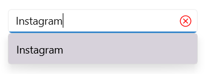
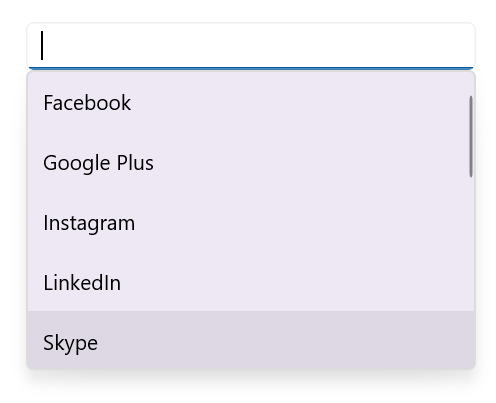
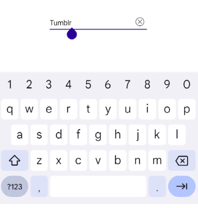

# UI Customization in .NET MAUI Autocomplete (SfAutocomplete)

This section explains different UI customizations available in the [.NET MAUI Autocomplete](https://help.syncfusion.com/cr/maui/Syncfusion.Maui.Inputs.SfAutocomplete.html) control.

To get start quickly to customize the Appearance of .NET MAUI Autocomplete, you can check on this video:



## Placeholder

You can prompt the user with any information by using the [Placeholder](https://help.syncfusion.com/cr/maui/Syncfusion.Maui.Core.SfDropdownEntry.html#Syncfusion_Maui_Core_SfDropdownEntry_Placeholder) property. This text will be displayed only if no items are selected or the edit text is empty. The default value of the Placeholder property is `string.Empty` (No string will be displayed).




<editors:SfAutocomplete x:Name="autocomplete"
                        Placeholder="Select a social media"
                        ItemsSource="{Binding SocialMedias}"
                        DisplayMemberPath="Name"
                        TextMemberPath="Name" />




SfAutocomplete autocomplete = new SfAutocomplete
{
    Placeholder = "Select a social media",
    ItemsSource = socialMediaViewModel.SocialMedias,
    DisplayMemberPath = "Name",
    TextMemberPath = "Name"
};




The following image illustrates the result of the above code:

## Placeholder Color

The placeholder text color can be changed by using the [PlaceholderColor](https://help.syncfusion.com/cr/maui/Syncfusion.Maui.Core.SfDropdownEntry.html#Syncfusion_Maui_Core_SfDropdownEntry_PlaceholderColor) property. The default value of the PlaceholderColor property is `Colors.Gray`.




<editors:SfAutocomplete x:Name="autocomplete"
                        ItemsSource="{Binding SocialMedias}"
                        DisplayMemberPath="Name"
                        TextMemberPath="Name"
                        Placeholder="Select a social media"
                        PlaceholderColor="Red" />




SfAutocomplete autocomplete = new SfAutocomplete
{
    ItemsSource = socialMediaViewModel.SocialMedias,
    DisplayMemberPath = "Name",
    TextMemberPath = "Name",
    Placeholder = "Select a social media",
    PlaceholderColor = Colors.Red
};




The following gif image illustrates the result of the above code:

## Clear Button Icon Color

The clear button icon color can be changed by using the [ClearButtonIconColor](https://help.syncfusion.com/cr/maui/Syncfusion.Maui.Core.SfDropdownEntry.html#Syncfusion_Maui_Core_SfDropdownEntry_ClearButtonIconColor) property. The default value of the ClearButtonIconColor property is `Colors.Black`.




<editors:SfAutocomplete x:Name="autocomplete"
                        ItemsSource="{Binding SocialMedias}"
                        DisplayMemberPath="Name"
                        TextMemberPath="Name"
                        Placeholder="Select a social media"
                        PlaceholderColor="Red"
                        ClearButtonIconColor="Red" />




SfAutocomplete autocomplete = new SfAutocomplete
{
    ItemsSource = socialMediaViewModel.SocialMedias,
    DisplayMemberPath = "Name",
    TextMemberPath = "Name",
    Placeholder = "Select a social media",
    PlaceholderColor = Colors.Red,
    ClearButtonIconColor = Colors.Red
};




The following gif image illustrates the result of the above code:

## Stroke

The Autocomplete border color can be changed by using the [`Stroke`](https://help.syncfusion.com/cr/maui/Syncfusion.Maui.Core.SfDropdownEntry.html#Syncfusion_Maui_Core_SfDropdownEntry_Stroke) property.




<editors:SfAutocomplete x:Name="autocomplete"
                        ItemsSource="{Binding SocialMedias}"
                        DisplayMemberPath="Name"
                        TextMemberPath="Name"
                        Placeholder="Select a social media"
                        PlaceholderColor="Red"
                        Stroke="Red" />




SfAutocomplete autocomplete = new SfAutocomplete
{
    ItemsSource = socialMediaViewModel.SocialMedias,
    DisplayMemberPath = "Name",
    TextMemberPath = "Name",
    Placeholder = "Select a social media",
    PlaceholderColor = Colors.Red,
    Stroke = Colors.Red
};




The following gif image illustrates the result of the above code.

## Customize the selection text highlightColor 

The [SelectionTextHighlightColor](https://help.syncfusion.com/cr/maui/Syncfusion.Maui.Inputs.DropDownControls.DropDownListBase.html#Syncfusion_Maui_Inputs_DropDownControls_DropDownListBase_SelectionTextHighlightColor) property is used to modify the background color of the selected item text in the autocomplete control.




<editors:SfAutocomplete x:Name="autocomplete"
                        ItemsSource="{Binding SocialMedias}"
                        DisplayMemberPath="Name"
                        TextMemberPath="Name"
                        Placeholder="Enter Media"
                        SelectionTextHighlightColor="Green" />





SfAutocomplete autocomplete = new SfAutocomplete
{
    ItemsSource = socialMediaViewModel.SocialMedias,
    DisplayMemberPath = "Name",
    TextMemberPath = "Name",
    Placeholder = "Enter Media",
    SelectionTextHighlightColor = Colors.Green
};




## Maximum DropDown Height

The maximum height of the drop-down can be changed by using the [MaxDropDownHeight](https://help.syncfusion.com/cr/maui/Syncfusion.Maui.Core.SfDropdownEntry.html#Syncfusion_Maui_Core_SfDropdownEntry_MaxDropDownHeight) property of the `Autocomplete` control. The default value of the MaxDropDownHeight property is `400d`. 

N> If the `MaxDropDownHeight` is too small compared to the populated items, the scroll viewer will be automatically shown to navigate the hidden items.




<editors:SfAutocomplete x:Name="autocomplete"
                        MaxDropDownHeight = "100"
                        ItemsSource="{Binding SocialMedias}"
                        DisplayMemberPath="Name"
                        TextMemberPath="Name" />




SfAutocomplete autocomplete = new SfAutocomplete
{
    MaxDropDownHeight = 100,
    ItemsSource = socialMediaViewModel.SocialMedias,
    DisplayMemberPath = "Name",
    TextMemberPath = "Name"
};




The following gif image illustrates the result of the above code:

## Customize the DropDown (suggestion) item

The [ItemTemplate](https://help.syncfusion.com/cr/maui/Syncfusion.Maui.Inputs.DropDownControls.DropDownListBase.html#Syncfusion_Maui_Inputs_DropDownControls_DropDownListBase_ItemTemplate) property helps you to decorate drop-down items using the custom templates. The default value of the `ItemTemplate` is `null`. The following example shows how to customize drop-down items using templates.




    //Model.cs
    public class Employee
    {
        public string Name { get; set; }
        public string ProfilePicture { get; set; }
        public string Designation { get; set; }
        public string ID { get; set; }
    }

    //ViewModel.cs
    public class EmployeeViewModel
    {
        public ObservableCollection<Employee> Employees { get; set; }
        public EmployeeViewModel()
        {
            this.Employees = new ObservableCollection<Employee>();
            Employees.Add(new Employee
            {
                Name = "Anne Dodsworth",
                ProfilePicture = "people_circle1.png",
                Designation = "Developer",
                ID = "E001",
            });
            Employees.Add(new Employee
            {
                Name = "Andrew Fuller",
                ProfilePicture = "people_circle8.png", 
                Designation = "Team Lead",
                ID = "E002",
            });
            ...
        }
    }







    <editors:SfAutocomplete Placeholder="Enter an employee"
                            TextMemberPath="Name"
                            DisplayMemberPath="Name"
                            ItemsSource="{Binding Employees}"
                            x:Name="autoComplete">
        <editors:SfAutocomplete.BindingContext>
            <local:EmployeeViewModel/>
        </editors:SfAutocomplete.BindingContext>
        <editors:SfAutocomplete.ItemTemplate>
            <DataTemplate >
                <ViewCell>
                    <Grid Margin="0,5"
                          VerticalOptions="Center"
                          HorizontalOptions="Center"
                          ColumnDefinitions="48,220"
                          RowDefinitions="50">
                        <Image Grid.Column="0"
                               HorizontalOptions="Center"
                               VerticalOptions="Center"
                               Source="{Binding ProfilePicture}"
                               Aspect="AspectFit"/>
                        <StackLayout HorizontalOptions="Start"
                                     VerticalOptions="Center"
                                     Grid.Column="1"
                                     Margin="15,0,0,0">
                            <Label HorizontalTextAlignment="Start"
                                   VerticalTextAlignment="Center"
                                   Opacity=".87"
                                   FontSize="14"
                                   Text="{Binding Name}"/>
                            <Label HorizontalOptions="Start"
                                   VerticalTextAlignment="Center"
                                   Opacity=".54"
                                   FontSize="12"
                                   Text="{Binding Designation}"/>
                        </StackLayout>
                    </Grid>
                </ViewCell>
            </DataTemplate>
        </editors:SfAutocomplete.ItemTemplate>
    </editors:SfAutocomplete>




    EmployeeViewModel employee = new EmployeeViewModel();

    SfAutocomplete autoComplete = new()
    {
        BindingContext = employee,
        ItemsSource = employee.Employees,
        DisplayMemberPath = "Name",
        Placeholder = "Enter an employee",
        TextMemberPath = "Name", 
    };

    DataTemplate itemTemplate = new DataTemplate(() =>
    {
        Grid grid = new();
        grid.Margin = new Thickness(0, 5);
        grid.HorizontalOptions = LayoutOptions.Center;
        grid.VerticalOptions = LayoutOptions.Center;
        ColumnDefinition colDef1 = new ColumnDefinition() { Width = 48 };
        ColumnDefinition colDef2 = new ColumnDefinition() { Width = 220 };
        RowDefinition rowDef = new RowDefinition() { Height = 50 };
        grid.ColumnDefinitions.Add(colDef1);
        grid.ColumnDefinitions.Add(colDef2);
        grid.RowDefinitions.Add(rowDef);

        Image image = new();
        image.HorizontalOptions = LayoutOptions.Center;
        image.VerticalOptions = LayoutOptions.Center;
        image.Aspect = Aspect.AspectFit;
        image.SetBinding(Image.SourceProperty, ("ProfilePicture"));
        Grid.SetColumn(image, 0);

        StackLayout stack = new();
        stack.Orientation = StackOrientation.Vertical;
        stack.Margin = new Thickness(15, 0,0,0);
        stack.HorizontalOptions = LayoutOptions.Start;
        stack.VerticalOptions = LayoutOptions.Center;
        Grid.SetColumn(stack, 1);

        Label label = new();
        label.SetBinding(Label.TextProperty, "Name");
        label.FontSize = 14;
        label.VerticalOptions = LayoutOptions.Center;
        label.HorizontalTextAlignment = TextAlignment.Start;
        label.Opacity = .87;

        Label label1 = new();
        label1.SetBinding(Label.TextProperty, "Designation");
        label1.FontSize = 12;
        label1.VerticalOptions = LayoutOptions.Center;
        label1.HorizontalTextAlignment = TextAlignment.Start;
        label1.Opacity = .54;

        stack.Children.Add(label);
        stack.Children.Add(label1);

        grid.Children.Add(image);
        grid.Children.Add(stack);

        return new ViewCell { View = grid };
    });
    autoComplete.ItemTemplate = itemTemplate;




The following image illustrates the result of the above code:

### Customize the DropDown item text

DropDown items can be customized using the [DropDownItemFontAttributes](https://help.syncfusion.com/cr/maui/Syncfusion.Maui.Inputs.DropDownControls.DropDownListBase.html#Syncfusion_Maui_Inputs_DropDownControls_DropDownListBase_DropDownItemFontAttributes), [DropDownItemFontFamily](https://help.syncfusion.com/cr/maui/Syncfusion.Maui.Inputs.DropDownControls.DropDownListBase.html#Syncfusion_Maui_Inputs_DropDownControls_DropDownListBase_DropDownItemFontFamily), [DropDownItemFontSize](https://help.syncfusion.com/cr/maui/Syncfusion.Maui.Inputs.DropDownControls.DropDownListBase.html#Syncfusion_Maui_Inputs_DropDownControls_DropDownListBase_DropDownItemFontSize), and [DropDownItemTextColor](https://help.syncfusion.com/cr/maui/Syncfusion.Maui.Inputs.DropDownControls.DropDownListBase.html#Syncfusion_Maui_Inputs_DropDownControls_DropDownListBase_DropDownItemTextColor) properties.




<editors:SfAutocomplete x:Name="autocomplete"
                        ItemsSource="{Binding SocialMedias}"
                        DisplayMemberPath="Name"
                        TextMemberPath="Name"
                        Placeholder="Enter Media"
                        DropDownItemFontAttributes="Italic"
                        DropDownItemFontFamily="OpenSansSemibold"
                        DropDownItemFontSize="16"
                        DropDownItemTextColor="DarkViolet" />





SfAutocomplete autocomplete = new SfAutocomplete
{
    ItemsSource = socialMediaViewModel.SocialMedias,
    DisplayMemberPath = "Name",
    TextMemberPath = "Name",
    Placeholder = "Enter Media",
    DropDownItemFontAttributes = FontAttributes.Italic,
    DropDownItemFontFamily = "OpenSansSemibold",
    DropDownItemFontSize = 16,
    DropDownItemTextColor = Colors.DarkViolet
};




### Customize the DropDown background color

The [DropDownBackground](https://help.syncfusion.com/cr/maui/Syncfusion.Maui.Inputs.DropDownControls.DropDownListBase.html#Syncfusion_Maui_Inputs_DropDownControls_DropDownListBase_DropDownBackground) property is used to modify the background color of the dropdown.




<editors:SfAutocomplete x:Name="autocomplete"
                        ItemsSource="{Binding SocialMedias}"
                        DisplayMemberPath="Name"
                        TextMemberPath="Name"
                        Placeholder="Enter Media"
                        DropDownBackground="YellowGreen" />





SfAutocomplete autocomplete = new SfAutocomplete
{
    ItemsSource = socialMediaViewModel.SocialMedias,
    DisplayMemberPath = "Name",
    TextMemberPath = "Name",
    Placeholder = "Enter Media",
    DropDownBackground = Colors.YellowGreen
};




### Customize the DropDown selected item background color

The [SelectedDropDownItemBackground](https://help.syncfusion.com/cr/maui/Syncfusion.Maui.Inputs.DropDownControls.DropDownListBase.html#Syncfusion_Maui_Inputs_DropDownControls_DropDownListBase_SelectedDropDownItemBackground) property is used to modify the background color of the selected item in the dropdown.




<editors:SfAutocomplete x:Name="autocomplete"
                        ItemsSource="{Binding SocialMedias}"
                        DisplayMemberPath="Name"
                        TextMemberPath="Name"
                        Placeholder="Enter Media"
                        SelectedDropDownItemBackground="LightSeaGreen" />





SfAutocomplete autocomplete = new SfAutocomplete()
{
    ItemsSource = socialMediaViewModel.SocialMedias;
    DisplayMemberPath = "Name";
    TextMemberPath = "Name";
    Placeholder = "Enter Media";
    SelectedDropDownItemBackground = Colors.LightSeaGreen;
};




### Customize the Selected DropDown Item Text Style

The [SelectedDropDownItemTextStyle]() property in the SfAutoComplete control allows developers to customize the appearance of the selected item in the dropdown list. This feature is useful for highlighting user selections and improving the overall UI experience.




<editors:SfAutocomplete x:Name="autoComplete" DisplayMemberPath = "Name" TextMemberPath = "Name" ItemsSource="{Binding SocialMedias}">
    <editors:SfAutocomplete.SelectedDropDownItemTextStyle>
        <editors:DropDownTextStyle TextColor="Orange" FontSize="16" FontAttributes="Bold"/>
    </editors:SfAutocomplete.SelectedDropDownItemTextStyle>
</editors:SfAutocomplete>




SfAutocomplete autoComplete = new SfAutocomplete
{
    ItemsSource = socialMediaViewModel.SocialMedias,
    DisplayMemberPath = "Name",
    TextMemberPath = "Name",
    SelectedDropDownItemTextStyle = new DropDownTextStyle
    {
        TextColor = Colors.Orange,
        FontSize = 16,
        FontAttributes = FontAttributes.Bold
    }
};




### Customize the DropDown Border Color

The [DropDownStroke](https://help.syncfusion.com/cr/maui/Syncfusion.Maui.Inputs.DropDownControls.DropDownListBase.html#Syncfusion_Maui_Inputs_DropDownControls_DropDownListBase_DropDownStroke) property is used to modify the border color of the dropdown.



<editors:SfAutocomplete x:Name="autocomplete"
                        ItemsSource="{Binding SocialMedias}"
                        DisplayMemberPath="Name"
                        TextMemberPath="Name"
                        Placeholder="Enter Media"
                        DropDownStroke="DarkOrange" />





SfAutocomplete autocomplete = new SfAutocomplete
{
    ItemsSource = socialMediaViewModel.SocialMedias,
    DisplayMemberPath = "Name",
    TextMemberPath = "Name",
    Placeholder = "Enter Media",
    DropDownStroke = Colors.DarkOrange
};




### Customize the DropDown Border Thickness

The [DropDownStrokeThickness](https://help.syncfusion.com/cr/maui/Syncfusion.Maui.Inputs.DropDownControls.DropDownListBase.html#Syncfusion_Maui_Inputs_DropDownControls_DropDownListBase_DropDownStrokeThickness) property is used to modify the thickness of the dropdown border.




<editors:SfAutocomplete x:Name="autocomplete"
                        ItemsSource="{Binding SocialMedias}"
                        DisplayMemberPath="Name"
                        TextMemberPath="Name"
                        Placeholder="Enter Media"
                        DropDownStroke="DarkOrange"
                        DropDownStrokeThickness="5" />





SfAutocomplete autocomplete = new SfAutocomplete
{
    ItemsSource = socialMediaViewModel.SocialMedias,
    DisplayMemberPath = "Name",
    TextMemberPath = "Name",
    Placeholder = "Enter Media",
    DropDownStroke = Color.DarkOrange,
    DropDownStrokeThickness = 5
};




### Customize the visibility of Dropdown Shadow

The [IsDropDownShadowVisible](https://help.syncfusion.com/cr/maui/Syncfusion.Maui.Inputs.DropDownControls.DropDownListBase.html#Syncfusion_Maui_Inputs_DropDownControls_DropDownListBase_IsDropDownShadowVisible) property is used to customize the visibility of the dropdown shadow.




<editors:SfAutocomplete x:Name="autocomplete"
                        ItemsSource="{Binding SocialMedias}"
                        DisplayMemberPath="Name"
                        TextMemberPath="Name"
                        Placeholder="Enter Media"
                        IsDropDownShadowVisible="False" />





SfAutocomplete autocomplete = new SfAutocomplete
{
    ItemsSource = socialMediaViewModel.SocialMedias,
    DisplayMemberPath = "Name",
    TextMemberPath = "Name",
    Placeholder = "Enter Media",
    IsDropDownShadowVisible = False
};




### Customize the DropDown Item Height

The [DropDownItemHeight](https://help.syncfusion.com/cr/maui/Syncfusion.Maui.Inputs.DropDownControls.DropDownListBase.html#Syncfusion_Maui_Inputs_DropDownControls_DropDownListBase_DropDownItemHeight) property is used to modify the height of the dropdown items.




<editors:SfAutocomplete x:Name="autocomplete"
                        ItemsSource="{Binding SocialMedias}"
                        DisplayMemberPath="Name"
                        TextMemberPath="Name"
                        Placeholder="Enter Media"
                        DropDownItemHeight="80" />





SfAutocomplete autocomplete = new SfAutocomplete
{
    ItemsSource = socialMediaViewModel.SocialMedias,
    DisplayMemberPath = "Name",
    TextMemberPath = "Name",
    Placeholder = "Enter Media",
    DropDownItemHeight = 80
};




### Customize the DropDownPlacement

The drop-down that shows the filtered items will be placed automatically based on the available space and can also be customized using the `DropDownPlacement` property.

*   `Top` - Drop-down will be placed above the text box.

*   `Bottom` - Drop-down will be placed below the text box.

*   `Auto` - Drop-down will be placed based on the available space either top or bottom of the text box.

*   `None` - Drop-down will not be shown with the filtered items.




 <editors:SfAutocomplete x:Name="autocomplete"
                         ItemsSource="{Binding SocialMedias}"
                         DisplayMemberPath="Name"
                         TextMemberPath="Name"
                         DropDownPlacement="Top"/>





SfAutocomplete autocomplete = new SfAutocomplete
{
    ItemsSource = socialMediaViewModel.SocialMedias,
    DisplayMemberPath = "Name",
    TextMemberPath = "Name",
    DropDownPlacement = AutocompleteDropDownPlacement.Top
};





### Customize the DropDown ItemPadding

The autocomplete enables the user to provide padding for the items inside dropdown using `ItemPadding` property.




   <editors:SfAutocomplete x:Name="autocomplete"
                           ItemsSource="{Binding SocialMedias}"
                           DisplayMemberPath="Name"
                           TextMemberPath="Name"
                           ItemPadding="10,20,0,0"/>





SfAutocomplete autocomplete = new SfAutocomplete
{
    ItemsSource = socialMediaViewModel.SocialMedias,
    DisplayMemberPath = "Name",
    TextMemberPath = "Name",
    ItemPadding = new Thickness(10, 20, 0, 0)
};





### Customize the DropDown Width

The `DropdownWidth` property is used to modify the Width of the dropdown.




    <editors:SfAutocomplete x:Name="autocomplete"
                            ItemsSource="{Binding SocialMedias}"
                            DisplayMemberPath="Name"
                            TextMemberPath="Name"                           
                            DropdownWidth="400"/>





SfAutocomplete autocomplete = new SfAutocomplete
{
    ItemsSource = socialMediaViewModel.SocialMedias,
    DisplayMemberPath = "Name",
    TextMemberPath = "Name",
    DropDownWidth = 400
};





### Show suggestion box on focus

Suggestion box can be shown whenever the control receives focus using the `ShowSuggestionsOnFocus` property. At this time, suggestion list is the complete list of data source.





      <editors:SfAutocomplete x:Name="autocomplete"
                              ItemsSource="{Binding SocialMedias}"
                              DisplayMemberPath="Name"
                              TextMemberPath="Name"                           
                              ShowSuggestionsOnFocus="True"/>





SfAutocomplete autocomplete = new SfAutocomplete
{
    ItemsSource = socialMediaViewModel.SocialMedias,
    DisplayMemberPath = "Name",
    TextMemberPath = "Name",
    ShowSuggestionsOnFocus = true
};





## Customize DropDown (suggestion) items based on condition

The [ItemTemplate](https://help.syncfusion.com/cr/maui/Syncfusion.Maui.Inputs.DropDownControls.DropDownListBase.html#Syncfusion_Maui_Inputs_DropDownControls_DropDownListBase_ItemTemplate) property helps you to decorate drop-down items conditionally based on their content using the custom templates. The default value of the `ItemTemplate` is `null`.




    //Model.cs
    public class Employee
    {
        public string Name { get; set; }
        public string ProfilePicture { get; set; }
        public string Designation { get; set; }
        public string ID { get; set; }
    }

    //ViewModel.cs
    public class EmployeeViewModel
    {
        public ObservableCollection<Employee> Employees { get; set; }
        public EmployeeViewModel()
        {
            this.Employees = new ObservableCollection<Employee>();
            Employees.Add(new Employee
            {
                Name = "Anne Dodsworth",
                ProfilePicture = "people_circle1.png",
                Designation = "Developer",
                ID = "E001",
            });
            Employees.Add(new Employee
            {
                Name = "Andrew Fuller",
                ProfilePicture = "people_circle8.png", 
                Designation = "Team Lead",
                ID = "E002",
            });
            Employees.Add(new Employee
            {
                Name = "Emilio Alvaro",
                ProfilePicture = "people_circle7.png",
                Designation = "Product Manager",
                ID = "E003"
            });
            Employees.Add(new Employee
            {
                Name = "Janet Leverling",
                ProfilePicture = "people_circle2.png",
                Designation = "HR",
                ID = "E004",
            });
            Employees.Add(new Employee
            {
                Name = "Laura Callahan",
                ProfilePicture = "people_circle10.png",
                Designation = "Product Manager",
                ID = "E005",
            });
        }
    }

    //Template selector
    public class EmployeeTemplateSelector : DataTemplateSelector
    {
        public DataTemplate EmployeeTemplate1 { get; set; }
        public DataTemplate EmployeeTemplate2 { get; set; }

        protected override DataTemplate OnSelectTemplate(object item, BindableObject container)
        {
            var employeeName = ((Employee)item).Name;
            {
                if (employeeName.ToString() == "Anne Dodsworth" || employeeName.ToString() == "Emilio Alvaro" ||
                    employeeName.ToString() == "Laura Callahan")
                {
                    return EmployeeTemplate1;
                }
                else
                {
                    return EmployeeTemplate2;
                }
            }
        }
    }







    <Grid>
        <Grid.Resources>
            <DataTemplate x:Key="employeeTemplate1">
                <ViewCell>
                    <Grid Margin="0,5"
                          VerticalOptions="Center"
                          HorizontalOptions="Center"
                          ColumnDefinitions="48,220"
                          RowDefinitions="50">
                            <Image Grid.Column="0"
                                   HorizontalOptions="Center"
                                   VerticalOptions="Center"
                                   Source="{Binding ProfilePicture}"
                                   Aspect="AspectFit"/>
                            <StackLayout HorizontalOptions="Start"
                                         VerticalOptions="Center"
                                         Grid.Column="1"
                                         Margin="15,0,0,0">
                                <Label HorizontalTextAlignment="Start"
                                        VerticalTextAlignment="Center"
                                        Opacity=".87"
                                        FontSize="14"
                                        TextColor="Blue"
                                        Text="{Binding Name}"/>
                                <Label HorizontalOptions="Start"
                                        VerticalTextAlignment="Center"
                                        Opacity=".54"
                                        FontSize="12"
                                        TextColor="Coral"
                                        Text="{Binding Designation}"/>
                            </StackLayout>
                    </Grid>
                </ViewCell>
            </DataTemplate>
            
            <DataTemplate x:Key="employeeTemplate2">
                <ViewCell>
                    <Grid Margin="0,5"
                          VerticalOptions="Center"
                          HorizontalOptions="Center"
                          ColumnDefinitions="48,220"
                          RowDefinitions="50">
                            <Image Grid.Column="0"
                                   HorizontalOptions="Center"
                                   VerticalOptions="Center"
                                   Source="{Binding ProfilePicture}"
                                   Aspect="AspectFit"/>
                            <StackLayout HorizontalOptions="Start"
                                         VerticalOptions="Center"
                                         Grid.Column="1"
                                         Margin="15,0,0,0">
                                <Label HorizontalTextAlignment="Start"
                                       VerticalTextAlignment="Center"
                                       Opacity=".87"
                                       FontSize="14"
                                       TextColor="Red"
                                       Text="{Binding Name}"/>
                                <Label HorizontalOptions="Start"
                                       VerticalTextAlignment="Center"
                                       Opacity=".54"
                                       FontSize="12"
                                       TextColor="Green"
                                       Text="{Binding Designation}"/>
                            </StackLayout>
                    </Grid>
                </ViewCell>
            </DataTemplate>

            <local:EmployeeTemplateSelector x:Key="employeeTemplateSelector"
                                            EmployeeTemplate1="{StaticResource employeeTemplate1}"
                                            EmployeeTemplate2="{StaticResource employeeTemplate2}"/>

        </Grid.Resources>

        <editors:SfAutocomplete Placeholder="Enter an employee"
                                TextMemberPath="Name"
                                DisplayMemberPath="Name"
                                ItemsSource="{Binding Employees}"
                                SelectedItem="{Binding SelectedEmployee,Mode=TwoWay}"
                                x:Name="autoComplete"
                                ItemTemplate="{StaticResource employeeTemplateSelector}">
            <editors:SfAutocomplete.BindingContext>
                <local:EmployeeViewModel/>
            </editors:SfAutocomplete.BindingContext>
        </editors:SfAutocomplete>
    </Grid>




    EmployeeViewModel employee = new EmployeeViewModel();

    DataTemplate employeeTemplate1 = new DataTemplate(() =>
    {
        Grid grid = new();
        grid.Margin = new Thickness(0, 5);
        grid.HorizontalOptions = LayoutOptions.Center;
        grid.VerticalOptions = LayoutOptions.Center;
        ColumnDefinition colDef1 = new ColumnDefinition() { Width = 48 };
        ColumnDefinition colDef2 = new ColumnDefinition() { Width = 220 };
        RowDefinition rowDef = new RowDefinition() { Height = 50 };
        grid.ColumnDefinitions.Add(colDef1);
        grid.ColumnDefinitions.Add(colDef2);
        grid.RowDefinitions.Add(rowDef);

        Image image = new();
        image.HorizontalOptions = LayoutOptions.Center;
        image.VerticalOptions = LayoutOptions.Center;
        image.Aspect = Aspect.AspectFit;
        image.SetBinding(Image.SourceProperty, ("ProfilePicture"));
        Grid.SetColumn(image, 0);

        StackLayout stack = new();
        stack.Orientation = StackOrientation.Vertical;
        stack.Margin = new Thickness(15, 0,0,0);
        stack.HorizontalOptions = LayoutOptions.Start;
        stack.VerticalOptions = LayoutOptions.Center;
        Grid.SetColumn(stack, 1);

        Label label = new();
        label.SetBinding(Label.TextProperty, "Name");
        label.FontSize = 14;
        label.TextColor = Colors.Blue;
        label.VerticalOptions = LayoutOptions.Center;
        label.HorizontalTextAlignment = TextAlignment.Start;
        label.Opacity = .87;

        Label label1 = new();
        label1.SetBinding(Label.TextProperty, "Designation");
        label1.FontSize = 12;
        label1.TextColor = Colors.Coral;
        label1.VerticalOptions = LayoutOptions.Center;
        label1.HorizontalTextAlignment = TextAlignment.Start;
        label1.Opacity = .54;

        stack.Children.Add(label);
        stack.Children.Add(label1);

        grid.Children.Add(image);
        grid.Children.Add(stack);

        return new ViewCell { View = grid };
    });

    DataTemplate employeeTemplate2 = new DataTemplate(() =>
    {
        Grid grid = new();
        grid.Margin = new Thickness(0, 5);
        grid.HorizontalOptions = LayoutOptions.Center;
        grid.VerticalOptions = LayoutOptions.Center;
        ColumnDefinition colDef1 = new ColumnDefinition() { Width = 48 };
        ColumnDefinition colDef2 = new ColumnDefinition() { Width = 220 };
        RowDefinition rowDef = new RowDefinition() { Height = 50 };
        grid.ColumnDefinitions.Add(colDef1);
        grid.ColumnDefinitions.Add(colDef2);
        grid.RowDefinitions.Add(rowDef);

        Image image = new();
        image.HorizontalOptions = LayoutOptions.Center;
        image.VerticalOptions = LayoutOptions.Center;
        image.Aspect = Aspect.AspectFit;
        image.SetBinding(Image.SourceProperty, ("ProfilePicture"));
        Grid.SetColumn(image, 0);

        StackLayout stack = new();
        stack.Orientation = StackOrientation.Vertical;
        stack.Margin = new Thickness(15, 0, 0, 0);
        stack.HorizontalOptions = LayoutOptions.Start;
        stack.VerticalOptions = LayoutOptions.Center;
        Grid.SetColumn(stack, 1);

        Label label = new();
        label.SetBinding(Label.TextProperty, "Name");
        label.FontSize = 14;
        label.TextColor = Colors.Red;
        label.VerticalOptions = LayoutOptions.Center;
        label.HorizontalTextAlignment = TextAlignment.Start;
        label.Opacity = .87;

        Label label1 = new();
        label1.SetBinding(Label.TextProperty, "Designation");
        label1.FontSize = 12;
        label1.TextColor = Colors.Green;
        label1.VerticalOptions = LayoutOptions.Center;
        label1.HorizontalTextAlignment = TextAlignment.Start;
        label1.Opacity = .54;

        stack.Children.Add(label);
        stack.Children.Add(label1);

        grid.Children.Add(image);
        grid.Children.Add(stack);

        return new ViewCell { View = grid };
    });

    EmployeeTemplateSelector employeeTemplateSelector = new EmployeeTemplateSelector();
    employeeTemplateSelector.EmployeeTemplate1 = employeeTemplate1;
    employeeTemplateSelector.EmployeeTemplate2 = employeeTemplate2;

    SfAutocomplete autoComplete = new()
    {
        BindingContext = employee,
        ItemsSource = employee.Employees,
        DisplayMemberPath = "Name",
        Placeholder = "Enter an employee",
        TextMemberPath = "Name", 
        ItemTemplate = employeeTemplateSelector,
    };

    this.Content = autoComplete;




The following image illustrates the result of the above code:

## Styling token items

The Autocomplete control allows you to customize the style of the TokenItem generated in the selection area by using the TokenItemStyle property.





 ...
  xmlns:core="clr-namespace:Syncfusion.Maui.Core;assembly=Syncfusion.Maui.Core"
  xmlns:editors="clr-namespace:Syncfusion.Maui.Inputs;assembly=Syncfusion.Maui.Inputs"
 ...

  <editors:SfAutocomplete x:Name="autoComplete"
                        SelectionMode="Multiple"
                        ItemsSource="{Binding SocialMedias}"
                        DisplayMemberPath="Name"
                        TextMemberPath="Name" > 
       <editors:SfAutocomplete.TokenItemStyle>
           
       </editors:SfAutocomplete.TokenItemStyle>
   </editors:SfAutocomplete>





The following image illustrates the result of the above code:

## Completed Event

The [Completed](https://help.syncfusion.com/cr/maui/Syncfusion.Maui.Inputs.DropDownControls.DropDownListBase.html#Syncfusion_Maui_Inputs_DropDownControls_DropDownListBase_Completed) event is raised when the user finalizes the text in the [SfAutocomplete](https://help.syncfusion.com/cr/maui/Syncfusion.Maui.Inputs.SfAutocomplete.html) by pressing return key on the keyboard.The handler for the event is a generic event handler, taking the `sender` and `EventArgs`(the `EventArgs` value is `string.Empty`):




    <editors:SfAutocomplete x:Name="autoComplete"
                            ItemsSource="{Binding SocialMedias}"
                            DisplayMemberPath="Name"
                            TextMemberPath="Name"
                            Completed="autoComplete_Completed" />




private async void autoComplete_Completed(object sender, EventArgs e)
{
    await DisplayAlert("Message", "Text entering Completed", "close");
}




Completed event can be subscribed in C# also:




SfAutocomplete autocomplete = new SfAutocomplete
{
    ItemsSource = socialMediaViewModel.SocialMedias,
    DisplayMemberPath = "Name",
    TextMemberPath = "Name"
};
autoComplete.Completed+=autoComplete_Completed;




The following image illustrates the result of the above code:

N> The `Completed` event is not supported in the Android platform.

## DropDownOpening Event

The [DropDownOpening](https://help.syncfusion.com/cr/maui/Syncfusion.Maui.Core.SfDropdownEntry.html#Syncfusion_Maui_Core_SfDropdownEntry_DropdownOpening) event will be fired whenever opening the dropdown menu in the SfAutocomplete. It can cancel dropdown opening with CancelEventArgs that contains the following property:

 * Cancel: Dropdown opening is based on this value.





    <editors:SfAutocomplete x:Name="autoComplete"
                            DropdownOpening="Autocomplete_DropdownOpening"
                            ItemsSource="{Binding SocialMedias}"
                            DisplayMemberPath="Name"
                            TextMemberPath="Name">
    </editors:SfAutocomplete>
    




    SfAutocomplete autoComplete = new SfAutocomplete
    {
        ItemsSource = socialMediaViewModel.SocialMedias,
        DisplayMemberPath = "Name",
        TextMemberPath = "Name"
    };
    autoComplete.DropdownOpening += Autocomplete_DropdownOpening;








    
 private void Autocomplete_DropdownOpening(object sender, CancelEventArgs e)
 {
     e.Cancel = true; // If you want to restrict the dropdown open then set the e.Cancel is true. 
 }
 




## DropDownOpened Event

The [DropDownOpened](https://help.syncfusion.com/cr/maui/Syncfusion.Maui.Core.SfDropdownEntry.html#Syncfusion_Maui_Core_SfDropdownEntry_DropdownOpened) event occurs when the SfAutocomplete drop-down is opened.





     <editors:SfAutocomplete x:Name="autoComplete" 
                             DropdownOpened="autoComplete_DropdownOpened"
                             ItemsSource="{Binding SocialMedias}"
                             DisplayMemberPath="Name"
                             TextMemberPath="Name">
     </editors:SfAutocomplete>
 




    SfAutocomplete autoComplete = new SfAutocomplete
    {
        ItemsSource = socialMediaViewModel.SocialMedias,
        DisplayMemberPath = "Name",
        TextMemberPath = "Name"
    };
    autoComplete.DropdownOpened += autoComplete_DropdownOpened;
    









  private void autoComplete_DropdownOpened(object sender, EventArgs e)
  {
    // Trigger when the dropdown is opened
  }
   




## DropDownClosed Event

The [DropDownClosed](https://help.syncfusion.com/cr/maui/Syncfusion.Maui.Inputs.DropDownControls.DropDownListBase.html#Syncfusion_Maui_Inputs_DropDownControls_DropDownListBase_DropDownClosed) event occurs when the SfAutocomplete drop-down is closed.




    
    <editors:SfAutocomplete x:Name="autoComplete" 
                            ItemsSource="{Binding SocialMedias}"
                            DisplayMemberPath="Name"
                            TextMemberPath="Name"
                            DropDownClosed="SfAutocomplete_DropDownClosed">
    </editors:SfAutocomplete>



    SfAutocomplete autoComplete = new SfAutocomplete
    {
        ItemsSource = socialMediaViewModel.SocialMedias,
        DisplayMemberPath = "Name",
        TextMemberPath = "Name"
    };
    autoComplete.DropDownClosed += SfAutocomplete_DropDownClosed;






    
    private void SfAutocomplete_DropDownClosed(object sender, EventArgs e)
    {
        await DisplayAlert("Message", "DropDown Closed", "close");
    }




## ValueChanged Event
When the value of Autocomplete changes, the [ValueChanged](https://help.syncfusion.com/cr/maui/Syncfusion.Maui.Inputs.SfAutocomplete.html#Syncfusion_Maui_Inputs_SfAutocomplete_ValueChanged) event is triggered. This event is raised when the value changes due to user interaction, programmatic updates, or any other mechanism. It provides both `OldValue` and `NewValue`, allowing for responsive handling of changes. The ValueChanged event contains the following properties:

* `OldValue` – Contains the previous text value before the change.
* `NewValue` – Contains the new text value after the change.




<editors:SfAutocomplete x:Name="autocomplete"  
                    TextMemberPath="Name" 
                    DisplayMemberPath="Name" 
                    ItemsSource="{Binding SocialMedias}" 
                    ValueChanged="OnValueChanged" />





SfAutoComplete autocomplete = new SfAutoComplete
{
    ItemsSource = socialMediaViewModel.SocialMedias,
    DisplayMemberPath = "Name",
    TextMemberPath = "Name"
};
autocomplete.ValueChanged += OnValueChanged;





The ValueChanged event can be handled as follows:




private async void OnValueChanged(object sender, AutocompleteValueChangedEventArgs e)
{
    await DisplayAlert("Alert", "Value has changed to: " + e.NewValue.ToString(), "Ok");
}



 
 

## CursorPosition

The cursor position in the input view can be obtained or updated using the [CursorPosition](https://help.syncfusion.com/cr/maui/Syncfusion.Maui.Core.SfDropdownEntry.html#Syncfusion_Maui_Core_SfDropdownEntry_CursorPosition) property in the SfAutocomplete.




    <editors:SfAutocomplete x:Name="autoComplete"
                            CursorPosition = "4" />



    using Syncfusion.Maui.Inputs;

    SfAutocomplete autocomplete = new SfAutocomplete
    {
        CursorPosition = 4,
    };




N> Two way binding not supported in Android platform.

## Border visibility

The [ShowBorder](https://help.syncfusion.com/cr/maui/Syncfusion.Maui.Inputs.SfAutocomplete.html#Syncfusion_Maui_Inputs_SfAutocomplete_ShowBorder) property of [SfAutocomplete](https://help.syncfusion.com/cr/maui/Syncfusion.Maui.Inputs.SfAutocomplete.html) is used to modify the visibility of the border and its default value is **true**. The following code example demonstrates how to change the border visibility,




    <editors:SfAutocomplete x:Name="autoComplete"
                            ShowBorder = "False" />



using Syncfusion.Maui.Inputs;

    SfAutocomplete autocomplete = new SfAutocomplete
    {
        ShowBorder = false,
    };




The following image illustrates the result of the above code:

## TextAlignment

The [SfAutocomplete](https://help.syncfusion.com/cr/maui/Syncfusion.Maui.Inputs.SfAutocomplete.html) provides support to customize the text alignment by using the [HorizontalTextAlignment](https://help.syncfusion.com/cr/maui/Syncfusion.Maui.Inputs.SfAutocomplete.html#Syncfusion_Maui_Inputs_SfAutocomplete_HorizontalTextAlignment) and [VerticalTextAlignment](https://help.syncfusion.com/cr/maui/Syncfusion.Maui.Inputs.SfAutocomplete.html#Syncfusion_Maui_Inputs_SfAutocomplete_VerticalTextAlignment) properties.

N> Dynamic changes to the `HorizontalTextAlignment` property may not be functioning as expected on Android platform.




    <editors:SfAutocomplete x:Name="autoComplete"
                            HorizontalTextAlignment="Center" 
                            VerticalTextAlignment="Start"/>



    SfAutocomplete autocomplete = new SfAutocomplete
    {
        HorizontalTextAlignment = TextAlignment.Center,
        VerticalTextAlignment = TextAlignment.Start,
    };




The following image illustrates the result of the above code:

## ReturnType

The `ReturnType` property specifies the return button (e.g., Next, Done, Go) of the keyboard. It helps manage the flow between multiple input fields by defining what happens when the action button is pressed.

You can define the return key type of [SfAutocomplete](https://help.syncfusion.com/cr/maui/Syncfusion.Maui.Inputs.SfAutocomplete.html) by using the ReturnType property.

N> Default value of ReturnType is `Default`.




<editors:SfAutocomplete x:Name="autocomplete"
            ItemsSource="{Binding SocialMedias}"
            DisplayMemberPath="Name"
            TextMemberPath="Name" 
            ReturnType="Next"/>




SfAutocomplete autocomplete = new SfAutocomplete
{
    ItemsSource = socialMediaViewModel.SocialMedias,
    DisplayMemberPath = "Name",
    TextMemberPath = "Name",
    ReturnType = ReturnType.Next
};




## Clear button customization

The `ClearButtonPath` property allows users to set the path for customizing the appearance of the [SfAutocomplete](https://help.syncfusion.com/cr/maui/Syncfusion.Maui.Inputs.SfAutocomplete.html) clear button.




<editors:SfAutocomplete x:Name="autoComplete"
                    ItemsSource="{Binding SocialMedias}"
                    TextMemberPath="Name"
                    DisplayMemberPath="Name">
            <editors:SfAutocomplete.ClearButtonPath>
                <Path Data="M1.70711 0.292893C1.31658 -0.097631 0.683417 -0.097631 0.292893 0.292893C-0.097631 0.683417 -0.097631 1.31658 0.292893 1.70711L5.58579 7L0.292893 12.2929C-0.097631 12.6834 -0.097631 13.3166 0.292893 13.7071C0.683417 14.0976 1.31658 14.0976 1.70711 13.7071L7 8.41421L12.2929 13.7071C12.6834 14.0976 13.3166 14.0976 13.7071 13.7071C14.0976 13.3166 14.0976 12.6834 13.7071 12.2929L8.41421 7L13.7071 1.70711C14.0976 1.31658 14.0976 0.683417 13.7071 0.292893C13.3166 -0.097631 12.6834 -0.097631 12.2929 0.292893L7 5.58579L1.70711 0.292893Z" 
                Fill="Red" 
                Stroke="Red"/>
            </editors:SfAutocomplete.ClearButtonPath>
</editors:SfAutocomplete>




private string _customPath = "M1.70711 0.292893C1.31658 -0.097631 0.683417 -0.097631 0.292893 0.292893C-0.097631 0.683417 -0.097631 1.31658 0.292893 1.70711L5.58579 7L0.292893 12.2929C-0.097631 12.6834 -0.097631 13.3166 0.292893 13.7071C0.683417 14.0976 1.31658 14.0976 1.70711 13.7071L7 8.41421L12.2929 13.7071C12.6834 14.0976 13.3166 14.0976 13.7071 13.7071C14.0976 13.3166 14.0976 12.6834 13.7071 12.2929L8.41421 7L13.7071 1.70711C14.0976 1.31658 14.0976 0.683417 13.7071 0.292893C13.3166 -0.097631 12.6834 -0.097631 12.2929 0.292893L7 5.58579L1.70711 0.292893Z";

var converter = new PathGeometryConverter();
var path = new Path() 
{ 
    Data = (PathGeometry)converter.ConvertFromInvariantString(_customPath),
    Fill = Colors.Red,
    Stroke = Colors.Red
};

SfAutocomplte autocomplete = new SfAutocomplte();
autocomplete.ItemsSource = viewModel.SocialMedia;
autocomplete.DisplayMemberPath = "Name";
autocomplete.TextMemberPath = "Name";
autocomplete.ClearButtonPath = path;




The following image illustrates the result of the above code:

## Return Command and Return Command Parameter

- `ReturnCommand`, of type ICommand, defines the command to be executed when the return key is pressed.
- `ReturnCommandParameter`, of type object, specifies the parameter for the `ReturnCommand`.




<editors:SfAutocomplete x:Name="autocomplete"
                    ItemsSource="{Binding SocialMedia}"
                    DisplayMemberPath="Name"
                    TextMemberPath="Name"
                    ReturnCommand="{Binding AlertCommand}"
                    ReturnCommandParameter="Return key is pressed"/>




SfAutocomplete autocomplete = new SfAutocomplete
{
    ItemsSource = socialMediaViewModel.SocialMedias,
    DisplayMemberPath = "Name",
    TextMemberPath = "Name",
    ReturnCommand = socialMediaViewModel.AlertCommand,
    ReturnCommandParameter = "Return key is pressed"
};







public SocialMediaViewModel
{
    public ICommand AlertCommand => new Command<string>(OnAlertCommandExecuted);

    private async void OnAlertCommandExecuted(string parameter)
    {
        await Application.Current.MainPage.DisplayAlert("Alert", parameter, "OK");
    }
}



