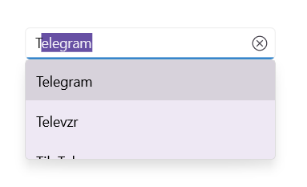

# UI Customization in .NET MAUI Autocomplete (SfAutocomplete)

This section explains different UI customization available in the `Autocomplete` control.

## Placeholder

You can prompt the user with any information by using the `Placeholder` property. This text will be displayed only if no items are selected or the edit text is empty. The default value of `Placeholder` property is `string.Empty` (No string will be displayed).




<editors:SfAutocomplete
    x:Name="autocomplete"
    WidthRequest="250"
    Placeholder="Select a social media"
    ItemsSource="{Binding SocialMedias}"
    DisplayMemberPath="Name"
    TextMemberPath="Name" />




autocomplete.Placeholder = "Select a social media";




The following image illustrates the result of the above code:

### Change color of placeholder

The placeholder texts’ foreground can be changed by using the `PlaceholderColor` property. The default value of `PlaceholderColor` property is `Colors.Gray`.




<editors:SfAutocomplete
    x:Name="autocomplete"
    WidthRequest="250"
    ItemsSource="{Binding SocialMedias}"
    DisplayMemberPath="Name"
    TextMemberPath="Name"
    Placeholder="Select a social media"
    PlaceholderColor="Red" />




autocomplete.PlaceholderColor = Colors.Red;




The following gif image illustrates the result of the above code:

## How to change DropDown MaxHeight

The maximum height of the drop-down can be changed by using `MaxDropDownHeight` property of `Autocomplete` control. The default value of `MaxDropDownHeight` property is `400d`. 

N> If the `MaxDropDownHeight` is too small compared to the populated items, the scroll viewer will be automatically shown to navigate the hidden items.




<editors:SfAutocomplete
    x:Name="autocomplete"
    WidthRequest="250"
    MaxDropDownHeight = "100"
    ItemsSource="{Binding SocialMedias}"
    DisplayMemberPath="Name"
    TextMemberPath="Name" />




autocomplete.MaxDropDownHeight = 100;




The following gif image illustrates the result of the above code:

