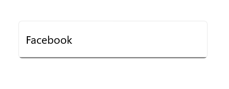
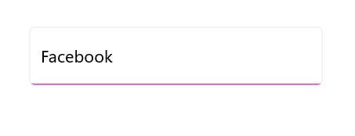
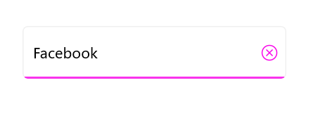

# Visual States in .NET MAUI Autocomplete

Visual states let you change the appearance of [.NET MAUI Autocomplete](https://help.syncfusion.com/cr/maui/Syncfusion.Maui.Inputs.SfAutocomplete.html) in response to user interaction. Use them to apply different colors, borders, or other properties for each state without writing code-behind handlers.

`Autocomplete` supports the following visual states through the [`VisualStateManager`](https://learn.microsoft.com/en-us/dotnet/maui/user-interface/visual-states?view=net-maui-10.0):

* `Normal` - The default resting state of the Autocomplete.
* `Focused` - The Autocomplete has keyboard or input focus.
* `Disabled` - The Autocomplete is disabled (`IsEnabled` is `false`).
* `Hover` - The pointer is over the Autocomplete (desktop platforms).

## Prerequisites

Before using the  [SfAutocomplete](https://help.syncfusion.com/cr/maui/Syncfusion.Maui.Inputs.SfAutocomplete.html), ensure the following NuGet package is installed in your .NET MAUI project:

- `Syncfusion.Maui.Inputs`

For a step-by-step setup, refer to the [Getting Started](https://help.syncfusion.com/maui/autocomplete/getting-started) documentation.

## Defining visual states

`SfAutocomplete` exposes its states through a single `VisualStateGroup` named `CommonStates`. Each `VisualState` contains a list of `Setter` objects that target bindable properties on the Autocomplete. Common target properties are `Background`, `Stroke`, `TextColor`, `PlaceholderColor`, `ClearButtonIconColor`, and `DropDownIconColor`.

The dropdown appearance can be customized independently using properties such as `DropDownBackground`, `DropDownStroke`, `DropDownStrokeThickness`, `DropDownItemTextColor`, `DropDownItemFontSize`, `SelectedDropDownItemBackground`, and `SelectedDropDownItemTextStyle`.




<inputs:SfAutocomplete x:Name="autocomplete"
                DisplayMemberPath="Name"
                TextMemberPath="Name"
                ItemsSource="{Binding SocialMedias}"
                WidthRequest="250"
                HeightRequest="50"
                Placeholder="Select an item">
    <inputs:SfAutocomplete.BindingContext>
        <local:SocialMediaViewModel />
    </inputs:SfAutocomplete.BindingContext>
    <VisualStateManager.VisualStateGroups>
        <VisualStateGroup x:Name="CommonStates">
            <VisualState x:Name="Normal">
                <VisualState.Setters>
                    <Setter Property="Stroke" Value="#707070" />
                    <Setter Property="TextColor" Value="Black" />
                    <Setter Property="ClearButtonIconColor" Value="#707070" />
                    <Setter Property="DropDownIconColor" Value="#707070" />
                </VisualState.Setters>
            </VisualState>
        <VisualState x:Name="Focused">
            <VisualState.Setters>
                <Setter Property="Stroke" Value="#f903e9" />
                <Setter Property="TextColor" Value="Black" />
                    <Setter Property="ClearButtonIconColor" Value="#f903e9" />
                    <Setter Property="DropDownIconColor" Value="#f903e9" />
            </VisualState.Setters>
        </VisualState>
        <VisualState x:Name="Disabled">
                <VisualState.Setters>
                    <Setter Property="Stroke" Value="#BDBDBD" />
                    <Setter Property="TextColor" Value="Black" />
                    <Setter Property="ClearButtonIconColor" Value="#BDBDBD" />
                    <Setter Property="DropDownIconColor" Value="#BDBDBD" />
                </VisualState.Setters>
            </VisualState>
        <VisualState x:Name="Hover">
            <VisualState.Setters>
                <Setter Property="Stroke" Value="#c372bd" />
                <Setter Property="TextColor" Value="Black" />
                <Setter Property="ClearButtonIconColor" Value="#c372bd" />
                <Setter Property="DropDownIconColor" Value="#c372bd" />
            </VisualState.Setters>
        </VisualState>
    </VisualStateGroup>
    </VisualStateManager.VisualStateGroups>
</inputs:SfAutocomplete>




SocialMediaViewModel socialMediaViewModel = new SocialMediaViewModel();
SfAutocomplete autocomplete = new SfAutocomplete
{
    WidthRequest = 250,
    HeightRequest = 50,
    DisplayMemberPath = "Name",
    TextMemberPath = "Name",
    ItemsSource = socialMediaViewModel.SocialMedias,
    Placeholder = "Select an item",
};

VisualStateGroupList visualStateGroupList = new VisualStateGroupList();
VisualStateGroup commonStateGroup = new VisualStateGroup { Name = "CommonStates" };

VisualState normalState = new VisualState { Name = "Normal" };
normalState.Setters.Add(new Setter { Property = SfAutocomplete.StrokeProperty, Value = Color.FromArgb("#8A8A8A") });
normalState.Setters.Add(new Setter { Property = SfAutocomplete.TextColorProperty, Value = Colors.Black });
normalState.Setters.Add(new Setter { Property = SfAutocomplete.ClearButtonIconColorProperty, Value = Color.FromArgb("#8A8A8A") });

VisualState focusedState = new VisualState { Name = "Focused" };
focusedState.Setters.Add(new Setter { Property = SfAutocomplete.StrokeProperty, Value = Color.FromArgb("#f903e9") });
focusedState.Setters.Add(new Setter { Property = SfAutocomplete.TextColorProperty, Value = Colors.Black });
focusedState.Setters.Add(new Setter { Property = SfAutocomplete.ClearButtonIconColorProperty, Value = Color.FromArgb("#f903e9") });

VisualState disabledState = new VisualState { Name = "Disabled" };
disabledState.Setters.Add(new Setter { Property = SfAutocomplete.StrokeProperty, Value = Color.FromArgb("#9E9E9E") });
disabledState.Setters.Add(new Setter { Property = SfAutocomplete.TextColorProperty, Value = Colors.Black });
disabledState.Setters.Add(new Setter { Property = SfAutocomplete.ClearButtonIconColorProperty, Value = Color.FromArgb("#9E9E9E") });

VisualState hoverState = new VisualState { Name = "Hover" };
hoverState.Setters.Add(new Setter { Property = SfAutocomplete.StrokeProperty, Value = Color.FromArgb("#c372bd") });
hoverState.Setters.Add(new Setter { Property = SfAutocomplete.TextColorProperty, Value = Colors.Black });
hoverState.Setters.Add(new Setter { Property = SfAutocomplete.ClearButtonIconColorProperty, Value = Color.FromArgb("#c372bd") });

commonStateGroup.States.Add(normalState);
commonStateGroup.States.Add(focusedState);
commonStateGroup.States.Add(disabledState);
commonStateGroup.States.Add(hoverState);
visualStateGroupList.Add(commonStateGroup);
VisualStateManager.SetVisualStateGroups(autocomplete, visualStateGroupList);
Content = autocomplete;




// ViewModel
public class SocialMediaViewModel
{
    public ObservableCollection<SocialMedia> SocialMedias { get; set; }

    public SocialMediaViewModel()
    {
        this.SocialMedias = new ObservableCollection<SocialMedia>
        {
            new SocialMedia { Name = "Facebook", ID = 0 },
            new SocialMedia { Name = "Google Plus", ID = 1 },
            new SocialMedia { Name = "Instagram", ID = 2 },
            new SocialMedia { Name = "LinkedIn", ID = 3 },
            new SocialMedia { Name = "Skype", ID = 4 },
            new SocialMedia { Name = "Telegram", ID = 5 },
            new SocialMedia { Name = "Twitter", ID = 6 },
            new SocialMedia { Name = "WhatsApp", ID = 7 },
            new SocialMedia { Name = "YouTube", ID = 8 }
        };
    }
}

public class SocialMedia
{
    public string Name { get; set; }
    public int ID { get; set; }
}




### Normal visual state

### Hover visual state

### Focused visual state

### Disabled visual state

## See Also

- [Customization](https://help.syncfusion.com/maui/autocomplete/ui-customization)
- [Selection](https://help.syncfusion.com/maui/autocomplete/selection)
- [Getting Started](https://help.syncfusion.com/maui/autocomplete/getting-started)