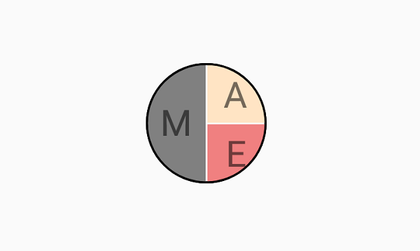

# Content Types

## Avatar Types

The `SfAvatarView` control provides the following five different ways to display the view:

* `Default` - Adds the default image when initializing without any other source such as image and group.

* `AvatarName` - Set the initial value in SfAvatarView.

* `Custom` - Adds the user custom image in SfAvatarView.

* `Group` - Adds maximum three images or initials in a single `SfAvatarView`.

## Default

Automatic type avatar view is used for displaying the default vector image when initializing without the initials, custom, or group view types.





    <sfavatar:SfAvatarView ContentType="Default"     
                            VerticalOptions="Center"
                            HorizontalOptions="Center"
                            WidthRequest="50"
                            HeightRequest="50"
                            CornerRadius="25">
    </sfavatar:SfAvatarView>
	




            Grid mainGrid = new Grid();       
            SfAvatarView avatarview = new SfAvatarView();
            avatarview.VerticalOptions = LayoutOptions.Center;
            avatarview.HorizontalOptions = LayoutOptions.Center;
            avatarview.WidthRequest = 50;
            avatarview.HeightRequest = 50;
            avatarview.CornerRadius = 25;
            avatarview.ContentType = ContentType.Default;   
            mainGrid.Children.Add(avatarview);
            this.Content = mainGrid;





## Initials 

When using the SfAvatarType as initials, you need to set the initial character using the following properties:

* `InitialsType` - Defines the type of characters to be displayed.
* `AvatarName`- Gets or sets the value for the initials type, which displays the text in the avatar view.
* `InitialsColor`- Gets or sets the color of the initial color value that defines color for the initial string.

### InitialsType

The `InitialsType` contains the following two types:

* SingleCharacter
* DoubleCharacter

You must set the `AvatarName` string property for displaying the initial value in the AvatarView.

#### SingleCharacter

The `SingleCharacter` is used for displaying the first character in the string you have set in the `Initials` property.




        <sfavatar:SfAvatarView ContentType="Initials"
                               HorizontalOptions="Center"
                               VerticalOptions="Center"
                               InitialsType="SingleCharacter"
                               AvatarName="Alex"
                               InitialsColor="Black" 
                               WidthRequest="50"
                               FontAttributes="Bold"
                               HeightRequest="50"
                               CornerRadius="25"          
                               BackgroundColor="Bisque">
        </sfavatar:SfAvatarView>



             
            Grid mainGrid = new Grid();
            SfAvatarView avatarview = new SfAvatarView();
            avatarview.VerticalOptions = LayoutOptions.Center;
            avatarview.HorizontalOptions = LayoutOptions.Center;
            avatarview.BackgroundColor = Colors.Bisque;
            avatarview.WidthRequest = 50;
            avatarview.HeightRequest = 50;
            avatarview.CornerRadius = 25;
            avatarview.ContentType = ContentType.Initials;
            avatarview.AvatarName = "Alex";
            avatarview.InitialsType = InitialsType.SingleCharacter;
            avatarview.InitialsColor = Colors.Black;
            mainGrid.Children.Add(avatarview);
            this.Content = mainGrid;




### DoubleCharacter

The `DoubleCharacter` is used for displaying a two-characters text you have set in the `Initials` property. If the initials contain one word, it shows the first and last letters of the single string. If it contains two or more words, it displays the first letter of the first string and first letter of the last string.




        <sfavatar:SfAvatarView ContentType="Initials"
                               InitialsType="DoubleCharacter"
                               AvatarName="Alex"
                               InitialsColor="Black"                     
                               WidthRequest="50"
                               FontAttributes="Bold"                     
                               HeightRequest="50"
                               CornerRadius="25"                        
                               BackgroundColor="Bisque">
        </sfavatar:SfAvatarView>



          
            Grid mainGrid = new Grid();
            SfAvatarView avatarview = new SfAvatarView();
            avatarview.VerticalOptions = LayoutOptions.Center;
            avatarview.HorizontalOptions = LayoutOptions.Center;
            avatarview.BackgroundColor = Colors.Bisque;
            avatarview.WidthRequest = 50;
            avatarview.HeightRequest = 50;
            avatarview.CornerRadius = 25;
            avatarview.ContentType = ContentType.Initials;
            avatarview.AvatarName = "Alex";
            avatarview.InitialsType = InitialsType.DoubleCharacter;
            avatarview.InitialsColor = Colors.Black;
            mainGrid.Children.Add(avatarview);
            this.Content = mainGrid;




## Custom image

You can add a custom user image by setting the `ImageSource` property. Refer to this [`documentation`](https://help.syncfusion.com/maui/avatar-view/getting-started).

## GroupView 

You can add maximum three images or initials in the same view using a GroupView type.

Set the `InitialsMemberPath` for displaying the initials in the group view. For image, set the `ImageSourcePath`. The following code sample demonstrates how to add images using the `GroupView` property.



 public class Employee
    {

        private string name;
        public string Name
        {
            get { return name; }
            set { name = value; }
        }

        private string imagesource;

        public string ImageSource
        {
            get { return imagesource; }
            set { imagesource = value; }
        }

        private Color colors;

        public Color Colors
        {
            get { return colors; }
            set { colors = value; }
        }

    }

    public class EmployeeViewMdoel : INotifyPropertyChanged
    {

        public event PropertyChangedEventHandler PropertyChanged;
        private void OnPropertyRaised(string propertyname)
        {
            if (PropertyChanged != null)
            {
                PropertyChanged(this, new PropertyChangedEventArgs(propertyname));
            }
        }
        private ObservableCollection<Employee> collectionimage;

        public ObservableCollection<Employee> CollectionImage
        {
            get { return collectionimage; }
            set
            {
                collectionimage = value;
                OnPropertyRaised("CollectionImage");
            }
        }

        public EmployeeViewMdoel()
        {
            CollectionImage = new ObservableCollection<Employee>();
            CollectionImage.Add(new Employee { Name="Mike" , ImageSource = "mike.png",Colors=Colors.Gray });
            CollectionImage.Add(new Employee { Name="Alex",ImageSource= "alex.png", Colors = Colors.Bisque });
            CollectionImage.Add(new Employee { Name="Ellanaa", ImageSource= "ellanaa.png",Colors=Colors.LightCoral });
        }

    }






<ContentPage.BindingContext>
        <local:EmployeeViewMdoel/>
</ContentPage.BindingContext>

   <sfavatar:SfAvatarView ContentType="Group"                         
                          VerticalOptions="Center"
                          HorizontalOptions="Center"
                          GroupSource="{Binding CollectionImage}"
                          InitialsMemberPath="Name"
                          BackgroundColorMemberPath="Colors"
                          ImageSourceMemberPath="ImageSource"
                          WidthRequest="50"
                          HeightRequest="50"
                          CornerRadius="25">
    </sfavatar:SfAvatarView>




 public partial class MainPage : ContentPage, INotifyPropertyChanged
    {
        EmployeeViewMdoel emp;

           public MainPage()
          {
            InitializeComponent();
            Grid mainGrid = new Grid();
            emp = new EmployeeViewMdoel();
            SfAvatarView avatarview = new SfAvatarView();
            avatarview.VerticalOptions = LayoutOptions.Center;
            avatarview.HorizontalOptions = LayoutOptions.Center;
            avatarview.WidthRequest = 50;
            avatarview.HeightRequest = 50;
            avatarview.CornerRadius = 25;
            avatarview.ContentType = ContentType.Group;
            avatarview.GroupSource = emp.CollectionImage;
            avatarview.InitialsMemberPath = "Name";
            avatarview.ImageSourceMemberPath = "ImageSource";
            avatarview.BackgroundColorMemberPath = "Colors";
            this.BindingContext = emp;
            mainGrid.Children.Add(avatarview);
            this.Content = mainGrid;
            }
    }




## Add initials only in GroupView

You can set the initials only in the group view by setting the `InitialsMemberPath` alone. It is demonstrated in the following code sample.





<ContentPage.BindingContext>
        <local:EmployeeViewMdoel/>
</ContentPage.BindingContext>

   <sfavatar:SfAvatarView ContentType="Group"                  
                          VerticalOptions="Center"
                          HorizontalOptions="Center"
                          GroupSource="{Binding CollectionImage}"
                          InitialsMemberPath="Name"
                          BackgroundColorMemberPath="Colors"
                          WidthRequest="50"
                          HeightRequest="50"
                          CornerRadius="25">
                </sfavatar:SfAvatarView>





public partial class MainPage : ContentPage, INotifyPropertyChanged
    {
        EmployeeViewMdoel emp;
         public MainPage()
        {

            Grid mainGrid = new Grid();
            emp = new EmployeeViewMdoel();
            SfAvatarView avatarview = new SfAvatarView();
            avatarview.VerticalOptions = LayoutOptions.Center;
            avatarview.HorizontalOptions = LayoutOptions.Center;
            avatarview.WidthRequest = 50;
            avatarview.HeightRequest = 50;
            avatarview.CornerRadius = 25;
            avatarview.ContentType = ContentType.Group;
            avatarview.GroupSource = emp.CollectionImage;
            avatarview.InitialsMemberPath = "Name";
            avatarview.BackgroundColorMemberPath = "Colors";
            this.BindingContext = emp;
            mainGrid.Children.Add(avatarview);
            this.Content = mainGrid;
         }
      }




## Add both image and initials in a GroupView

You have to set both the image and initials based on what should be added in the collection. If the image needs to be added, set `ImageSourcePath`, or if initials need to be added, set `InitialsMemberPath`. This is demonstrated in the following code snippet.




 public class EmployeeViewMdoel : INotifyPropertyChanged
    {
          public EmployeeViewMdoel()
        {
            CollectionImage = new ObservableCollection<Employee>();
            CollectionImage.Add(new Employee { ImageSource="mike.png" });
            CollectionImage.Add(new Employee { Name= "alex", Colors=Colors.White });
            CollectionImage.Add(new Employee { ImageSource= "ellanaa.png" });
        } 
        
    }
}




## Add GroupView using MVVM

Create model and view model for initializing and assigning a value for adding image or initials in the `SfAvatarView`. The following code sample demonstrates how to use the `GroupView` property using MVVM pattern.




//Model.cs
   public class Model
    {      
        public string Name { get; set; }

        public string Images { get; set; }
    }







//ViewModel.cs
 public class AvatarViewModel
    {
       
        /// 

        /// Gets or sets the value for PeopleCollection field.
        /// 

        public ObservableCollection<Model> PeopleCollection { get; set; }

        /// 

        /// Gets oe sets the value for the group view collections.
        /// 

        public ObservableCollection<Model> GroupViewCollection { get; set; }

        /// 

        /// AvatarViewModel
        /// 

        /// <param name="count">Count value</param>
        public AvatarViewModel(int count)
        {
            PopulateModel();
            PopulatePeopleCollection(count);
        }

        /// 

        /// Static count value.
        /// 

        static int staticcount = 0;

        /// 

        /// Change the collections for each group.
        /// 

        /// <param name="count">count value</param>
        private void PopulatePeopleCollection(int count)
        {
            PeopleCollection = new ObservableCollection<Model>();
            for (int i = 0; i < count; i++)
            {
                while (true)
                {
                    if (GroupViewCollection.Count <= staticcount)
                        staticcount = 0;
                    var person = GroupViewCollection[staticcount++];
                    if (!PeopleCollection.Contains(person))
                    {
                        PeopleCollection.Add(person);
                        break;
                    }
                }
            }

        }

        /// 

        /// To add the name and images.
        /// 

        private void PopulateModel()
        {
            GroupViewCollection = new ObservableCollection<Model>();
            GroupViewCollection.Add(new Model() { Name = "Adriana", Images = "Adriana.png" });
            GroupViewCollection.Add(new Model() { Name = "Aiden", Images = "Aiden.png" });
            GroupViewCollection.Add(new Model() { Name = "Alexander" });
            GroupViewCollection.Add(new Model() { Name = "Arianna", Images = "Arianna.png" });
            GroupViewCollection.Add(new Model() { Name = "Clara", Images = "Clara.png" });
            GroupViewCollection.Add(new Model() { Name = "Daleyza", Images = "Daleyza.png" });
            GroupViewCollection.Add(new Model() { Name = "Ellie", Images = "Ellie.png" });
            GroupViewCollection.Add(new Model() { Name = "Finley" });
            GroupViewCollection.Add(new Model() { Name = "Jackson", Images = "Jackson.png" });
            GroupViewCollection.Add(new Model() { Name = "Jayden" });
            GroupViewCollection.Add(new Model() { Name = "Kaylee", Images = "Kaylee.png" });
            GroupViewCollection.Add(new Model() { Name = "Lucy" });

        }
    }







<!--MainPage.Xaml-->

   <sfavatarview:SfAvatarView ContentType="Group"
                              Margin="5,0,0,0"
                              HorizontalOptions="Center"
                              HeightRequest="50"
                              WidthRequest="50"
                              CornerRadius="25"
                              VerticalOptions="Center"
                              GroupSource="{Binding PeopleCollection}"
                              ImageSourceMemberPath="Images"
                              InitialsMemberPath="Name">
     </sfavatarview:SfAvatarView>




//MainPage.Xaml.cs
            avm = new AvatarViewModel();
            SfAvatarView avatarview = new SfAvatarView();
            avatarview.VerticalOptions = LayoutOptions.Center;
            avatarview.HorizontalOptions = LayoutOptions.Center;
            avatarview.WidthRequest = 50;
            avatarview.HeightRequest = 50;
            avatarview.CornerRadius = 25;
            avatarview.ContentType = ContentType.Group;
            avatarview.GroupSource = avm.PeopleCollection;
            avatarview.InitialsMemberPath = "Name";
            avatarview.BackgroundColorMemberPath = "Colors";
            mainGrid.Children.Add(avatarview);




