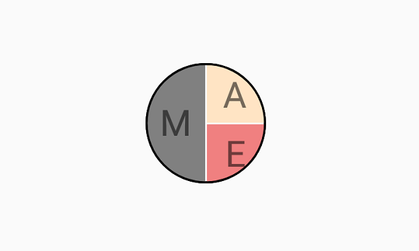

# Content Types in SfAvatarView

## Avatar Types

The `SfAvatarView` control allows you to display the view in three different ways:

* `Initials` - Displays the initial in the view.

* `Custom` - Displays a custom image in the view.

* `Group` - Displays a maximum of three images or initials in a single view.

## Initials 

When using the SfAvatarType as initials, you need to set the initial character using the following properties:

* `InitialsType` - Defines the type of characters to be displayed.
* `AvatarName`- Gets or sets the value for the initials type, which displays the text in the avatar view.
* `InitialsColor`- Gets or sets the color of the initial color value that defines color for the initial string.

### InitialsType

The `InitialsType` contains the following two types:

* SingleCharacter
* DoubleCharacter

You must set the `AvatarName` string property for displaying the initial value in the AvatarView.

#### SingleCharacter

The `SingleCharacter` is used for displaying the first character in the string you have set in the `Initials` property.




        <sfavatar:SfAvatarView ContentType="Initials"
                               HorizontalOptions="Center"
                               VerticalOptions="Center"
                               InitialsType="SingleCharacter"
                               AvatarName="Alex"
                               InitialsColor="Black" 
                               WidthRequest="50"
                               FontAttributes="Bold"
                               HeightRequest="50"
                               CornerRadius="25"          
                               BackgroundColor="Bisque">
        </sfavatar:SfAvatarView>



             
            Grid mainGrid = new Grid();
            SfAvatarView avatarview = new SfAvatarView();
            avatarview.VerticalOptions = LayoutOptions.Center;
            avatarview.HorizontalOptions = LayoutOptions.Center;
            avatarview.BackgroundColor = Colors.Bisque;
            avatarview.WidthRequest = 50;
            avatarview.HeightRequest = 50;
            avatarview.CornerRadius = 25;
            avatarview.ContentType = ContentType.Initials;
            avatarview.AvatarName = "Alex";
            avatarview.InitialsType = InitialsType.SingleCharacter;
            avatarview.InitialsColor = Colors.Black;
            mainGrid.Children.Add(avatarview);
            this.Content = mainGrid;




### DoubleCharacter

The `DoubleCharacter` is used for displaying a two-characters text you have set in the `Initials` property. If the initials contain one word, it shows the first and last letters of the single string. If it contains two or more words, it displays the first letter of the first string and first letter of the last string.




        <sfavatar:SfAvatarView ContentType="Initials"
                               InitialsType="DoubleCharacter"
                               AvatarName="Alex"
                               InitialsColor="Black"                     
                               WidthRequest="50"
                               FontAttributes="Bold"                     
                               HeightRequest="50"
                               CornerRadius="25"                        
                               BackgroundColor="Bisque">
        </sfavatar:SfAvatarView>



          
            Grid mainGrid = new Grid();
            SfAvatarView avatarview = new SfAvatarView();
            avatarview.VerticalOptions = LayoutOptions.Center;
            avatarview.HorizontalOptions = LayoutOptions.Center;
            avatarview.BackgroundColor = Colors.Bisque;
            avatarview.WidthRequest = 50;
            avatarview.HeightRequest = 50;
            avatarview.CornerRadius = 25;
            avatarview.ContentType = ContentType.Initials;
            avatarview.AvatarName = "Alex";
            avatarview.InitialsType = InitialsType.DoubleCharacter;
            avatarview.InitialsColor = Colors.Black;
            mainGrid.Children.Add(avatarview);
            this.Content = mainGrid;




## Custom image

You can add a custom user image by setting the `ImageSource` property. Refer to the Getting Started Documentation in SfAvatarView

## GroupView 

You can add maximum three images or initials in the same view using a GroupView type.

Set the `InitialsMemberPath` for displaying the initials in the group view. For image, set the `ImageSourcePath`. The following code sample demonstrates how to add images using the `GroupView` property.



 public class Employee
    {

        private string name;
        public string Name
        {
            get { return name; }
            set { name = value; }
        }

        private string imagesource;

        public string ImageSource
        {
            get { return imagesource; }
            set { imagesource = value; }
        }

        private Color colors;

        public Color Colors
        {
            get { return colors; }
            set { colors = value; }
        }

    }

    public class EmployeeViewMdoel : INotifyPropertyChanged
    {

        public event PropertyChangedEventHandler PropertyChanged;
        private void OnPropertyRaised(string propertyname)
        {
            if (PropertyChanged != null)
            {
                PropertyChanged(this, new PropertyChangedEventArgs(propertyname));
            }
        }
        private ObservableCollection<Employee> collectionimage;

        public ObservableCollection<Employee> CollectionImage
        {
            get { return collectionimage; }
            set
            {
                collectionimage = value;
                OnPropertyRaised("CollectionImage");
            }
        }

        public EmployeeViewMdoel()
        {
            CollectionImage = new ObservableCollection<Employee>();
            CollectionImage.Add(new Employee { Name="Mike" , ImageSource = "mike.png",Colors=Colors.Gray });
            CollectionImage.Add(new Employee { Name="Alex",ImageSource= "alex.png", Colors = Colors.Bisque });
            CollectionImage.Add(new Employee { Name="Ellanaa", ImageSource= "ellanaa.png",Colors=Colors.LightCoral });
        }

    }






<ContentPage.BindingContext>
        <local:EmployeeViewMdoel/>
</ContentPage.BindingContext>

   <sfavatar:SfAvatarView ContentType="Group"                         
                          VerticalOptions="Center"
                          HorizontalOptions="Center"
                          GroupSource="{Binding CollectionImage}"
                          BackgroundColorMemberPath="Colors"
                          ImageSourceMemberPath="ImageSource"
                          WidthRequest="50"
                          HeightRequest="50"
                          CornerRadius="25">
    </sfavatar:SfAvatarView>




 public partial class MainPage : ContentPage, INotifyPropertyChanged
    {
        EmployeeViewMdoel emp;

           public MainPage()
          {
            InitializeComponent();
            Grid mainGrid = new Grid();
            emp = new EmployeeViewMdoel();
            SfAvatarView avatarview = new SfAvatarView();
            avatarview.VerticalOptions = LayoutOptions.Center;
            avatarview.HorizontalOptions = LayoutOptions.Center;
            avatarview.WidthRequest = 50;
            avatarview.HeightRequest = 50;
            avatarview.CornerRadius = 25;
            avatarview.ContentType = ContentType.Group;
            avatarview.GroupSource = emp.CollectionImage;
            avatarview.ImageSourceMemberPath = "ImageSource";
            avatarview.BackgroundColorMemberPath = "Colors";
            this.BindingContext = emp;
            mainGrid.Children.Add(avatarview);
            this.Content = mainGrid;
            }
    }




## Add initials only in GroupView

You can set the initials only in the group view by setting the `InitialsMemberPath` alone. It is demonstrated in the following code sample.





<ContentPage.BindingContext>
        <local:EmployeeViewMdoel/>
</ContentPage.BindingContext>

    <sfavatar:SfAvatarView ContentType="Group"                         
                          VerticalOptions="Center"
                          HorizontalOptions="Center"
                          GroupSource="{Binding CollectionImage}"
                          BackgroundColorMemberPath="Colors"
                          ImageSourceMemberPath="ImageSource"
                          InitialsMemberPath="Name"
                          WidthRequest="50"
                          HeightRequest="50"
                          CornerRadius="25">
    </sfavatar:SfAvatarView>





public partial class MainPage : ContentPage, INotifyPropertyChanged
    {
        EmployeeViewMdoel emp;
         public MainPage()
        {

            Grid mainGrid = new Grid();
            emp = new EmployeeViewMdoel();
            SfAvatarView avatarview = new SfAvatarView();
            avatarview.VerticalOptions = LayoutOptions.Center;
            avatarview.HorizontalOptions = LayoutOptions.Center;
            avatarview.WidthRequest = 50;
            avatarview.HeightRequest = 50;
            avatarview.CornerRadius = 25;
            avatarview.ContentType = ContentType.Group;
            avatarview.GroupSource = emp.CollectionImage;
            avatarview.InitialsMemberPath = "Name";
			avatarview.ImageSourceMemberPath = "ImageSource";
            avatarview.BackgroundColorMemberPath = "Colors";
            this.BindingContext = emp;
            mainGrid.Children.Add(avatarview);
            this.Content = mainGrid;
         }
      }




## Add both image and initials in a GroupView

You have to set both the image and initials based on what should be added in the collection. If the image needs to be added, set `ImageSourcePath`, or if initials need to be added, set `InitialsMemberPath`. This is demonstrated in the following code snippet.




 public class EmployeeViewMdoel : INotifyPropertyChanged
    {
          public EmployeeViewMdoel()
        {
            CollectionImage = new ObservableCollection<Employee>();
            CollectionImage.Add(new Employee { ImageSource="mike.png" });
            CollectionImage.Add(new Employee { Name= "alex", Colors=Colors.White });
            CollectionImage.Add(new Employee { ImageSource= "ellanaa.png" });
        } 
        
    }
}




