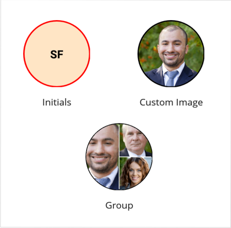

# .NET MAUI Avatar View (SfAvatarView) Overview

The [.NET MAUI Avatar View](https://help.syncfusion.com/cr/maui/Syncfusion.Maui.Core.SfAvatarView.html?tabs=tabid-1) control provides a graphical representation of a user's image. It allows customization of the view by adding an image, background color, icon, and text.

## Key features

* **Image and Initials Support:** Facilitates adding both images and initials.
* **View Customization:** Allows customization of the height, width, stroke, background color, and corner radius of the view.
* **GroupView:** Supports adding a maximum of three custom images or initials in a single view.
* **Visual Styles:** Offers support for different types of visual styles.
* **BadgeView Integration:** Compatible with [BadgeView](https://help.syncfusion.com/cr/maui/Syncfusion.Maui.Core.SfBadgeView.html).
